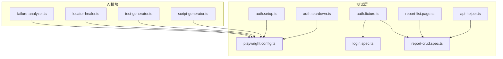
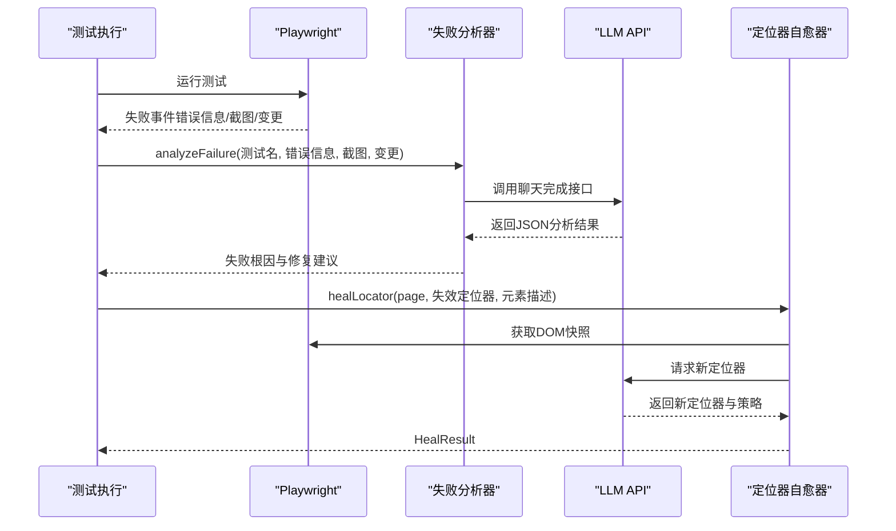
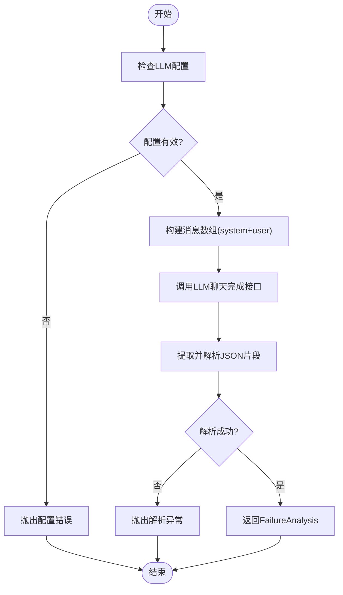
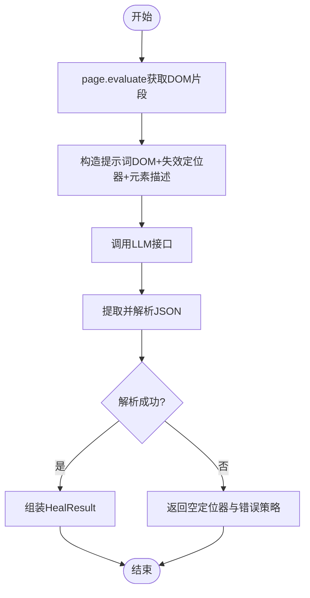
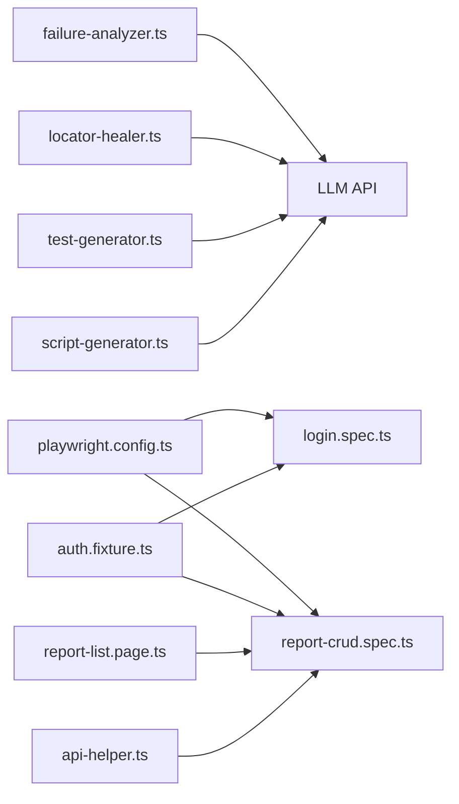

# AI失败分析工具

<cite>
**本文引用的文件**
- [failure-analyzer.ts](file://e2e-tests/ai/failure-analyzer.ts)
- [locator-healer.ts](file://e2e-tests/ai/locator-healer.ts)
- [script-generator.ts](file://e2e-tests/ai/script-generator.ts)
- [test-generator.ts](file://e2e-tests/ai/test-generator.ts)
- [package.json](file://e2e-tests/package.json)
- [playwright.config.ts](file://e2e-tests/playwright.config.ts)
- [auth.fixture.ts](file://e2e-tests/fixtures/auth.fixture.ts)
- [auth.setup.ts](file://e2e-tests/fixtures/auth.setup.ts)
- [auth.teardown.ts](file://e2e-tests/fixtures/auth.teardown.ts)
- [report-crud.spec.ts](file://e2e-tests/tests/regression/report-crud.spec.ts)
- [login.spec.ts](file://e2e-tests/tests/smoke/login.spec.ts)
- [report-list.page.ts](file://e2e-tests/pages/report-list.page.ts)
- [api-helper.ts](file://e2e-tests/utils/api-helper.ts)
</cite>

## 目录
1. [简介](#简介)
2. [项目结构](#项目结构)
3. [核心组件](#核心组件)
4. [架构总览](#架构总览)
5. [详细组件分析](#详细组件分析)
6. [依赖关系分析](#依赖关系分析)
7. [性能考量](#性能考量)
8. [故障排除指南](#故障排除指南)
9. [结论](#结论)
10. [附录](#附录)

## 简介
本项目是一个基于Playwright的端到端测试AI失败分析工具，旨在通过大语言模型（LLM）对测试失败进行智能分析，自动识别失败根因（定位器失效、业务逻辑变更、环境问题、数据问题），并生成可执行的修复建议与代码片段。工具同时支持：
- 失败原因分析与分类
- 定位器自愈（基于页面DOM重建稳定定位）
- 测试用例与测试脚本的AI生成
- 与Playwright测试框架的无缝集成
- 在CI/CD中的报告与回放支持

## 项目结构
项目采用Playwright标准目录组织，结合AI分析模块，形成“测试+AI分析”的一体化方案：
- e2e-tests/ai：AI分析与生成模块（失败分析、定位器自愈、测试用例与脚本生成）
- e2e-tests/tests：测试用例（冒烟与回归）
- e2e-tests/pages：Page Object封装
- e2e-tests/fixtures：认证与全局fixture
- e2e-tests/utils：API辅助工具
- e2e-tests/playwright.config.ts：Playwright配置（报告、项目、设备）
- e2e-tests/package.json：脚本与依赖

图表来源
- [playwright.config.ts:1-68](file://e2e-tests/playwright.config.ts#L1-L68)
- [auth.fixture.ts:1-40](file://e2e-tests/fixtures/auth.fixture.ts#L1-L40)
- [auth.setup.ts:1-28](file://e2e-tests/fixtures/auth.setup.ts#L1-L28)
- [auth.teardown.ts:1-18](file://e2e-tests/fixtures/auth.teardown.ts#L1-L18)
- [login.spec.ts:1-25](file://e2e-tests/tests/smoke/login.spec.ts#L1-L25)
- [report-crud.spec.ts:1-122](file://e2e-tests/tests/regression/report-crud.spec.ts#L1-L122)
- [report-list.page.ts:1-130](file://e2e-tests/pages/report-list.page.ts#L1-L130)
- [api-helper.ts:1-172](file://e2e-tests/utils/api-helper.ts#L1-L172)

章节来源
- [playwright.config.ts:1-68](file://e2e-tests/playwright.config.ts#L1-L68)
- [package.json:1-27](file://e2e-tests/package.json#L1-L27)

## 核心组件
- 失败分析器：接收测试名称、错误信息、截图、最近变更等上下文，调用LLM输出结构化的失败根因与修复建议。
- 定位器自愈器：在定位器失效时，抓取页面DOM快照，基于LLM推荐新的稳定定位器，并返回置信度与策略说明。
- 测试用例生成器：输入功能描述与角色，输出结构化的测试用例清单，覆盖正向、逆向、边界与权限。
- 测试脚本生成器：输入测试用例与Page Object接口，输出可直接运行的Playwright .spec.ts脚本。

章节来源
- [failure-analyzer.ts:45-112](file://e2e-tests/ai/failure-analyzer.ts#L45-L112)
- [locator-healer.ts:49-131](file://e2e-tests/ai/locator-healer.ts#L49-L131)
- [test-generator.ts:45-107](file://e2e-tests/ai/test-generator.ts#L45-L107)
- [script-generator.ts:46-110](file://e2e-tests/ai/script-generator.ts#L46-L110)

## 架构总览
AI失败分析工具的整体工作流如下：
- 测试执行阶段：Playwright执行测试，失败时收集错误信息、截图、最近变更等上下文。
- AI分析阶段：调用LLM API，将上下文与系统提示词组合，解析JSON输出，得到失败根因与修复建议。
- 定位器自愈阶段：若定位器失效，抓取DOM快照，LLM推荐新定位器，返回策略与置信度。
- 生成与回放阶段：生成测试用例与脚本，配合Playwright报告与Allure报告，便于复现与追踪。

图表来源
- [failure-analyzer.ts:69-112](file://e2e-tests/ai/failure-analyzer.ts#L69-L112)
- [locator-healer.ts:62-103](file://e2e-tests/ai/locator-healer.ts#L62-L103)

## 详细组件分析

### 失败分析器（Failure Analyzer）
- 功能职责
  - 将测试失败上下文（测试名、错误信息、截图、最近变更）封装为提示词
  - 调用LLM API，解析JSON输出，返回FailureAnalysis对象
  - 支持四种根因分类：定位器、逻辑、环境、数据
- 关键流程
  - 参数校验：确保LLM API地址与密钥已配置
  - 构造消息数组（可选system提示词 + 用户提示词）
  - 发送请求并处理响应
  - 从LLM回复中提取JSON片段并解析
- 性能与可靠性
  - 低温度参数以提升确定性
  - 对响应格式进行严格校验，避免解析异常
  - 异常路径抛出明确错误，便于上层捕获与记录

图表来源
- [failure-analyzer.ts:12-41](file://e2e-tests/ai/failure-analyzer.ts#L12-L41)
- [failure-analyzer.ts:69-112](file://e2e-tests/ai/failure-analyzer.ts#L69-L112)

章节来源
- [failure-analyzer.ts:45-112](file://e2e-tests/ai/failure-analyzer.ts#L45-L112)

### 定位器自愈器（Locator Healer）
- 功能职责
  - 在定位器失效时，抓取当前页面DOM片段
  - 基于LLM推荐新的稳定定位器（优先data-testid，其次role+name，最后文本/CSS）
  - 返回原定位器、新定位器、置信度与策略说明
  - 支持批量修复
- 关键流程
  - 获取DOM快照（限制长度以控制成本）
  - 构造提示词并调用LLM
  - 解析JSON并组装HealResult
  - 批量修复时对单个失败进行try-catch兜底
- 性能与可靠性
  - 控制DOM快照大小，避免LLM输入过长
  - 降低temperature以提升稳定性
  - 对解析失败与API异常进行降级处理

图表来源
- [locator-healer.ts:62-103](file://e2e-tests/ai/locator-healer.ts#L62-L103)
- [locator-healer.ts:109-131](file://e2e-tests/ai/locator-healer.ts#L109-L131)

章节来源
- [locator-healer.ts:49-131](file://e2e-tests/ai/locator-healer.ts#L49-L131)

### 测试用例生成器（Test Case Generator）
- 功能职责
  - 输入功能名称、描述与角色，输出结构化测试用例数组
  - 覆盖正向、逆向、边界与权限场景
  - 优先级定义：P0（核心）、P1（重要）、P2（边界/异常）
- 关键流程
  - 构造系统提示词与用户提示词
  - 调用LLM并解析JSON数组
  - 返回TestCase[]供后续脚本生成使用

章节来源
- [test-generator.ts:45-107](file://e2e-tests/ai/test-generator.ts#L45-L107)

### 测试脚本生成器（Script Generator）
- 功能职责
  - 输入测试用例与Page Object接口，输出可执行的Playwright .spec.ts脚本
  - 使用describe组织、fixture注入、beforeEach准备数据、expect断言
- 关键流程
  - 拼装PO接口描述与可用Fixture列表
  - 构造提示词并调用LLM
  - 清理markdown代码块标记，返回纯代码

章节来源
- [script-generator.ts:46-110](file://e2e-tests/ai/script-generator.ts#L46-L110)

### 与测试框架的集成
- Playwright配置
  - 多项目配置：setup、cleanup、smoke-chromium、regression-chromium、regression-firefox
  - CI环境下启用HTML/JUnit/Allure报告
  - 失败时自动截取截图、录制视频、保留trace
- Fixture与认证
  - 通过auth.fixture.ts注入不同角色的Page实例
  - 通过auth.setup.ts与auth.teardown.ts管理storageState
- Page Object与API工具
  - report-list.page.ts提供稳定的定位器封装
  - api-helper.ts提供API上下文、创建/删除报告、状态更新等工具

章节来源
- [playwright.config.ts:31-66](file://e2e-tests/playwright.config.ts#L31-L66)
- [auth.fixture.ts:10-37](file://e2e-tests/fixtures/auth.fixture.ts#L10-L37)
- [auth.setup.ts:17-26](file://e2e-tests/fixtures/auth.setup.ts#L17-L26)
- [auth.teardown.ts:7-17](file://e2e-tests/fixtures/auth.teardown.ts#L7-L17)
- [report-list.page.ts:19-32](file://e2e-tests/pages/report-list.page.ts#L19-L32)
- [api-helper.ts:45-77](file://e2e-tests/utils/api-helper.ts#L45-L77)

## 依赖关系分析
- 外部依赖
  - OpenAI兼容的LLM服务（通过环境变量配置）
  - Playwright测试框架与Allure报告插件
- 内部依赖
  - AI模块相互独立，可按需调用
  - 测试层依赖Playwright配置与fixture
  - Page Object与API工具为测试层提供稳定抽象

图表来源
- [failure-analyzer.ts:12-41](file://e2e-tests/ai/failure-analyzer.ts#L12-L41)
- [locator-healer.ts:13-45](file://e2e-tests/ai/locator-healer.ts#L13-L45)
- [test-generator.ts:12-41](file://e2e-tests/ai/test-generator.ts#L12-L41)
- [script-generator.ts:13-42](file://e2e-tests/ai/script-generator.ts#L13-L42)
- [playwright.config.ts:1-68](file://e2e-tests/playwright.config.ts#L1-L68)
- [auth.fixture.ts:1-40](file://e2e-tests/fixtures/auth.fixture.ts#L1-L40)
- [report-crud.spec.ts:1-122](file://e2e-tests/tests/regression/report-crud.spec.ts#L1-L122)
- [report-list.page.ts:1-130](file://e2e-tests/pages/report-list.page.ts#L1-L130)
- [api-helper.ts:1-172](file://e2e-tests/utils/api-helper.ts#L1-L172)

章节来源
- [package.json:17-25](file://e2e-tests/package.json#L17-L25)

## 性能考量
- LLM调用成本控制
  - 控制提示词长度（如DOM快照长度限制）
  - 降低temperature提升确定性，减少无效重试
  - 批量修复时逐条处理并降级兜底
- 测试执行效率
  - 合理设置timeout与retries，避免CI时间过长
  - 失败时仅在必要时生成报告与截图
- 可靠性保障
  - 对LLM响应进行严格格式校验
  - 对API异常与网络错误进行显式处理

## 故障排除指南
- LLM配置缺失
  - 现象：调用LLM时抛出配置错误
  - 处理：在环境变量中设置LLM_API_URL、LLM_API_KEY、LLM_MODEL
- LLM响应格式异常
  - 现象：无法解析JSON片段
  - 处理：检查提示词是否包含期望的JSON结构；适当提高temperature或调整system提示词
- 定位器自愈失败
  - 现象：healLocator返回空定位器或错误策略
  - 处理：确认DOM快照是否足够；检查元素描述是否准确；尝试简化定位器或更换策略
- 测试报告与回放
  - 现象：CI中报告无法打开或缺少trace
  - 处理：确认CI环境下的reporter配置；确保trace与video在失败时保留

章节来源
- [failure-analyzer.ts:13-15](file://e2e-tests/ai/failure-analyzer.ts#L13-L15)
- [locator-healer.ts:14-16](file://e2e-tests/ai/locator-healer.ts#L14-L16)
- [playwright.config.ts:16-22](file://e2e-tests/playwright.config.ts#L16-L22)

## 结论
本AI失败分析工具通过将LLM能力与Playwright测试框架深度融合，实现了从失败根因分析、定位器自愈到测试用例与脚本生成的完整闭环。其模块化设计便于扩展与定制，适合在持续集成环境中大规模应用。建议在生产使用中完善LLM提示词工程与错误处理策略，以进一步提升稳定性与可维护性。

## 附录

### 使用示例与配置选项
- 环境变量
  - LLM_API_URL：LLM服务地址
  - LLM_API_KEY：访问密钥
  - LLM_MODEL：模型名称（默认gpt-4）
  - BASE_URL：目标应用基地址（用于Playwright）
  - API_BASE_URL：后端API基础地址（用于API工具）
- Playwright脚本
  - npm脚本：test:smoke、test:regression、test:all、report:html、report:allure
- 集成要点
  - 在测试失败时调用analyzeFailure，传入测试名、错误信息、截图与最近变更
  - 若定位器失效，调用healLocator获取新定位器
  - 使用generateTestCases与generateScript生成测试用例与脚本

章节来源
- [failure-analyzer.ts:5-7](file://e2e-tests/ai/failure-analyzer.ts#L5-L7)
- [locator-healer.ts:6-8](file://e2e-tests/ai/locator-healer.ts#L6-L8)
- [script-generator.ts:6-8](file://e2e-tests/ai/script-generator.ts#L6-L8)
- [api-helper.ts](file://e2e-tests/utils/api-helper.ts#L6)
- [package.json:6-12](file://e2e-tests/package.json#L6-L12)