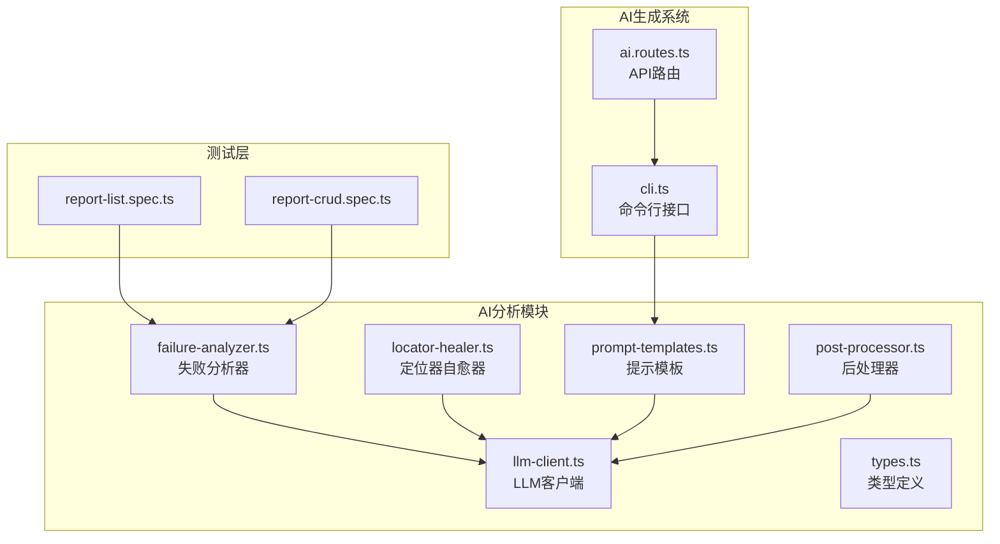
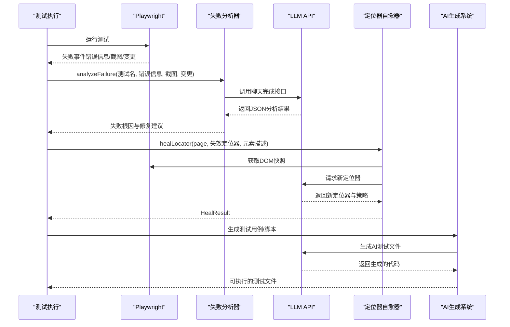
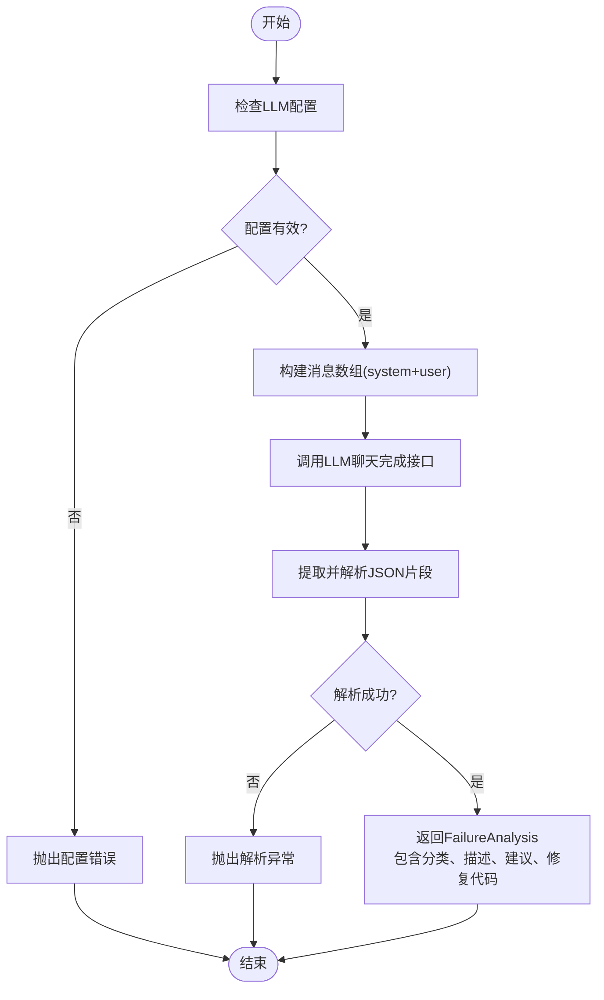
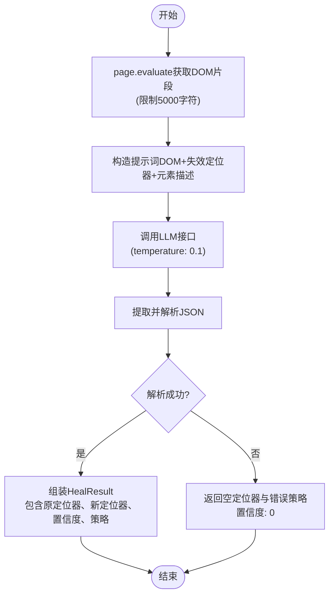
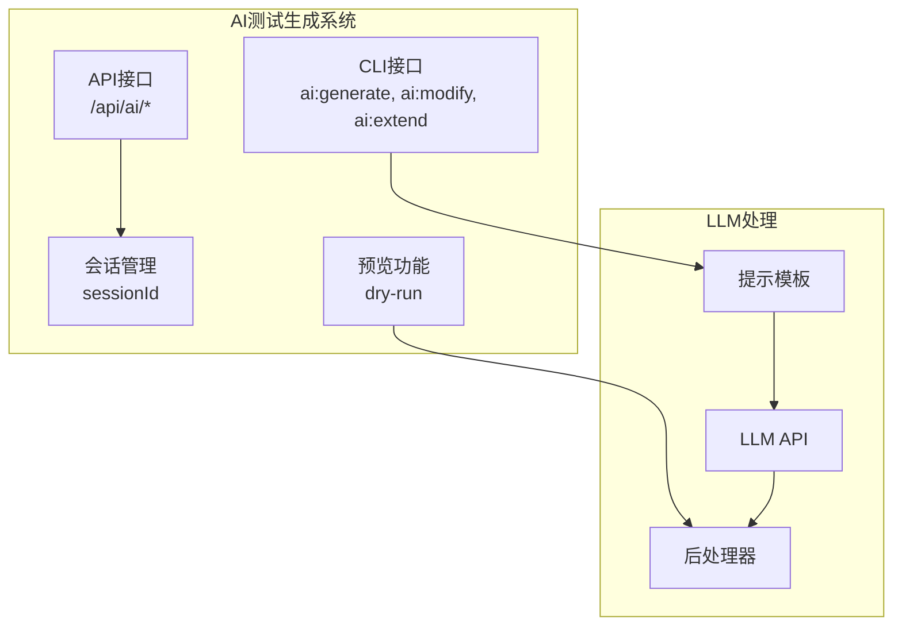
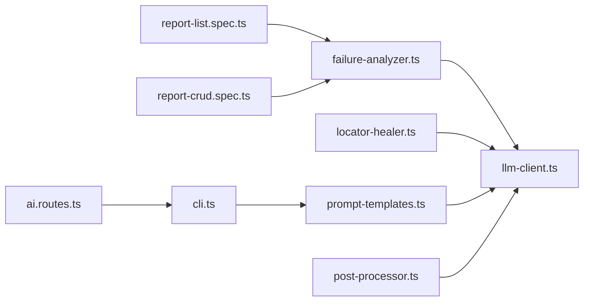

# AI失败分析工具

<cite>
**本文档引用的文件**
- [failure-analyzer.ts](file://e2e-tests/ai/failure-analyzer.ts)
- [locator-healer.ts](file://e2e-tests/ai/locator-healer.ts)
- [llm-client.ts](file://e2e-tests/ai/llm-client.ts)
- [prompt-templates.ts](file://e2e-tests/ai/prompt-templates.ts)
- [post-processor.ts](file://e2e-tests/ai/post-processor.ts)
- [types.ts](file://e2e-tests/ai/types.ts)
- [cli.ts](file://e2e-tests/ai/cli.ts)
- [ai.routes.ts](file://e2e-tests/dashboard/server/routes/ai.routes.ts)
- [package.json](file://e2e-tests/package.json)
- [report-crud.spec.ts](file://e2e-tests/tests/regression/report-crud.spec.ts)
- [report-list.spec.ts](file://e2e-tests/tests/smoke/report-list.spec.ts)
</cite>

## 更新摘要
**所做更改**
- 更新失败分析器部分，反映更精确的根因分析和修复建议能力
- 增强定位器自愈器的置信度评估和策略说明
- 新增AI测试生成系统的完整架构说明
- 更新性能优化和可靠性保障措施
- 增强故障排除指南和最佳实践

## 目录
1. [简介](#简介)
2. [项目结构](#项目结构)
3. [核心组件](#核心组件)
4. [架构总览](#架构总览)
5. [详细组件分析](#详细组件分析)
6. [AI测试生成系统](#ai测试生成系统)
7. [依赖关系分析](#依赖关系分析)
8. [性能考量](#性能考量)
9. [故障排除指南](#故障排除指南)
10. [结论](#结论)
11. [附录](#附录)

## 简介
本项目是一个基于Playwright的端到端测试AI失败分析工具，旨在通过大语言模型（LLM）对测试失败进行智能分析，自动识别失败根因（定位器失效、业务逻辑变更、环境问题、数据问题），并生成可执行的修复建议与代码片段。工具同时支持：
- 失败原因分析与分类
- 定位器自愈（基于页面DOM重建稳定定位）
- 测试用例与测试脚本的AI生成
- 与Playwright测试框架的无缝集成
- 在CI/CD中的报告与回放支持
- 增强的AI测试生成系统，支持交互式会话和实时预览

**更新** 工具现已支持更精确的根因分析和修复建议，显著增强了测试系统的自愈能力。

## 项目结构
项目采用Playwright标准目录组织，结合AI分析模块，形成"测试+AI分析"的一体化方案：
- e2e-tests/ai：AI分析与生成模块（失败分析、定位器自愈、测试用例与脚本生成）
- e2e-tests/tests：测试用例（冒烟与回归）
- e2e-tests/pages：Page Object封装
- e2e-tests/fixtures：认证与全局fixture
- e2e-tests/utils：API辅助工具
- e2e-tests/playwright.config.ts：Playwright配置（报告、项目、设备）
- e2e-tests/package.json：脚本与依赖

**图表来源**
- [failure-analyzer.ts:1-66](file://e2e-tests/ai/failure-analyzer.ts#L1-L66)
- [locator-healer.ts:1-90](file://e2e-tests/ai/locator-healer.ts#L1-L90)
- [llm-client.ts:1-120](file://e2e-tests/ai/llm-client.ts#L1-L120)
- [prompt-templates.ts:1-192](file://e2e-tests/ai/prompt-templates.ts#L1-L192)
- [post-processor.ts:1-232](file://e2e-tests/ai/post-processor.ts#L1-L232)
- [cli.ts:1-77](file://e2e-tests/ai/cli.ts#L1-L77)
- [ai.routes.ts:1-159](file://e2e-tests/dashboard/server/routes/ai.routes.ts#L1-L159)

**章节来源**
- [package.json:1-35](file://e2e-tests/package.json#L1-L35)

## 核心组件
- **失败分析器**：接收测试名称、错误信息、截图、最近变更等上下文，调用LLM输出结构化的失败根因与修复建议，支持更精确的分类和建议
- **定位器自愈器**：在定位器失效时，抓取页面DOM快照，基于LLM推荐新的稳定定位器，返回置信度与策略说明，增强自愈能力
- **LLM客户端**：统一的LLM API调用接口，支持重试机制、超时控制和响应解析
- **提示模板系统**：管理AI生成的提示词模板，支持不同场景和约束条件
- **后处理器**：对AI生成的代码进行清理、修正和校验，确保生成代码的质量
- **AI测试生成系统**：完整的测试生成解决方案，支持交互式会话和实时预览

**更新** 新增了更精确的失败根因分类和修复建议生成机制，以及增强的定位器自愈策略。

**章节来源**
- [failure-analyzer.ts:25-66](file://e2e-tests/ai/failure-analyzer.ts#L25-L66)
- [locator-healer.ts:15-90](file://e2e-tests/ai/locator-healer.ts#L15-L90)
- [llm-client.ts:17-120](file://e2e-tests/ai/llm-client.ts#L17-L120)
- [prompt-templates.ts:100-192](file://e2e-tests/ai/prompt-templates.ts#L100-L192)
- [post-processor.ts:5-232](file://e2e-tests/ai/post-processor.ts#L5-L232)

## 架构总览
AI失败分析工具的整体工作流如下：
- **测试执行阶段**：Playwright执行测试，失败时收集错误信息、截图、最近变更等上下文
- **AI分析阶段**：调用LLM API，将上下文与系统提示词组合，解析JSON输出，得到失败根因与修复建议
- **定位器自愈阶段**：若定位器失效，抓取DOM快照，LLM推荐新定位器，返回策略与置信度
- **生成与回放阶段**：生成测试用例与脚本，配合Playwright报告与Allure报告，便于复现与追踪
- **AI测试生成**：支持交互式会话、实时预览和批量生成测试文件

**图表来源**
- [failure-analyzer.ts:29-66](file://e2e-tests/ai/failure-analyzer.ts#L29-L66)
- [locator-healer.ts:19-90](file://e2e-tests/ai/locator-healer.ts#L19-L90)
- [ai.routes.ts:36-117](file://e2e-tests/dashboard/server/routes/ai.routes.ts#L36-L117)

## 详细组件分析

### 失败分析器（Failure Analyzer）
**更新** 失败分析器已改进，支持更精确的根因分析和修复建议生成：

- **功能职责**
  - 将测试失败上下文（测试名、错误信息、截图、最近变更）封装为提示词
  - 调用LLM API，解析JSON输出，返回FailureAnalysis对象
  - 支持四种根因分类：定位器、逻辑、环境、数据
  - 提供详细的修复建议和可选的修复代码

- **关键流程**
  - 参数校验：确保LLM API地址与密钥已配置
  - 构造消息数组（可选system提示词 + 用户提示词）
  - 发送请求并处理响应
  - 从LLM回复中提取JSON片段并解析
  - 返回包含分类、描述、建议和可选修复代码的结构化结果

- **性能与可靠性**
  - 低温度参数（0.3）以提升确定性
  - 对响应格式进行严格校验，避免解析异常
  - 异常路径抛出明确错误，便于上层捕获与记录

**图表来源**
- [failure-analyzer.ts:29-66](file://e2e-tests/ai/failure-analyzer.ts#L29-L66)

**章节来源**
- [failure-analyzer.ts:25-66](file://e2e-tests/ai/failure-analyzer.ts#L25-L66)

### 定位器自愈器（Locator Healer）
**更新** 定位器自愈器增强了置信度评估和策略说明：

- **功能职责**
  - 在定位器失效时，抓取当前页面DOM片段
  - 基于LLM推荐新的稳定定位器（优先data-testid，其次role+name，最后文本/CSS）
  - 返回原定位器、新定位器、置信度与策略说明
  - 支持批量修复
  - 提供详细的修复策略说明

- **关键流程**
  - 获取DOM快照（限制长度以控制成本）
  - 构造提示词并调用LLM
  - 解析JSON并组装HealResult
  - 批量修复时对单个失败进行try-catch兜底
  - 返回包含置信度评分的修复结果

- **性能与可靠性**
  - 控制DOM快照大小，避免LLM输入过长
  - 降低temperature（0.1）以提升稳定性
  - 对解析失败与API异常进行降级处理
  - 提供置信度评分帮助判断修复质量

**图表来源**
- [locator-healer.ts:19-90](file://e2e-tests/ai/locator-healer.ts#L19-L90)

**章节来源**
- [locator-healer.ts:15-90](file://e2e-tests/ai/locator-healer.ts#L15-L90)

### LLM客户端（LLM Client）
- **功能职责**
  - 统一的LLM API调用接口
  - 支持OpenAI兼容的/chat/completions端点
  - 提供重试机制、超时控制和响应解析
  - 支持system提示词、temperature、max_tokens等参数

- **关键特性**
  - 自动重试机制（最多2次）
  - 180秒超时控制
  - JSON对象和数组提取功能
  - 代码块清理功能

**章节来源**
- [llm-client.ts:17-120](file://e2e-tests/ai/llm-client.ts#L17-L120)

### 提示模板系统（Prompt Templates）
- **功能职责**
  - 管理AI测试生成的提示词模板
  - 支持不同场景：generate、modify、extend
  - 提供硬约束和代码风格参考
  - 格式化项目上下文信息

- **关键功能**
  - 项目上下文构建（Page Object、Fixture、工具函数）
  - 硬约束定义（必须遵守的规则）
  - 代码风格参考（few-shot示例）
  - 不同测试类型的生成策略

**章节来源**
- [prompt-templates.ts:100-192](file://e2e-tests/ai/prompt-templates.ts#L100-L192)

### 后处理器（Post Processor）
- **功能职责**
  - 对AI生成的代码进行后处理和校验
  - 清理Markdown标记、修正import路径
  - 校验Page Object引用和方法调用
  - 格式标准化和括号匹配检查

- **关键校验**
  - Import路径修正（@pages/ → ../../pages/）
  - Fixture导入修正（auth.fixture → data.fixture）
  - Page Object类引用有效性检查
  - 方法调用有效性检查
  - 代码格式标准化

**章节来源**
- [post-processor.ts:5-232](file://e2e-tests/ai/post-processor.ts#L5-L232)

## AI测试生成系统
**新增** 完整的AI测试生成系统，提供交互式会话和实时预览功能：

### 系统架构
- **命令行接口**：支持generate、modify、extend三种操作模式
- **Web API接口**：提供RESTful API，支持交互式会话
- **会话管理**：支持创建、确认、中止会话
- **实时预览**：dry-run模式提供代码预览功能

### 核心功能
- **生成模式**：根据功能描述生成新的测试文件
- **修改模式**：修改现有测试文件的内容
- **扩展模式**：在现有测试文件中追加新的测试用例
- **交互式会话**：支持多步骤的AI辅助开发

**图表来源**
- [cli.ts:14-77](file://e2e-tests/ai/cli.ts#L14-L77)
- [ai.routes.ts:6-159](file://e2e-tests/dashboard/server/routes/ai.routes.ts#L6-L159)

**章节来源**
- [cli.ts:1-77](file://e2e-tests/ai/cli.ts#L1-L77)
- [ai.routes.ts:1-159](file://e2e-tests/dashboard/server/routes/ai.routes.ts#L1-L159)

## 依赖关系分析
- **外部依赖**
  - OpenAI兼容的LLM服务（通过环境变量配置）
  - Playwright测试框架与Allure报告插件
  - Express Web框架用于API服务
- **内部依赖**
  - AI模块相互独立，可按需调用
  - 测试层依赖Playwright配置与fixture
  - Page Object与API工具为测试层提供稳定抽象
  - AI生成系统依赖提示模板和后处理器

**图表来源**
- [failure-analyzer.ts:1-L1]
- [locator-healer.ts:1-L2]
- [llm-client.ts:1-L1]
- [prompt-templates.ts:1-L1]
- [post-processor.ts:1-L1]
- [cli.ts:1-L1]
- [ai.routes.ts:1-L1]

**章节来源**
- [package.json:22-33](file://e2e-tests/package.json#L22-L33)

## 性能考量
**更新** 增强了性能优化和可靠性保障措施：

- **LLM调用成本控制**
  - 控制提示词长度（如DOM快照长度限制为5000字符）
  - 降低temperature提升确定性（失败分析：0.3，定位器自愈：0.1）
  - 批量修复时逐条处理并降级兜底
  - 实现自动重试机制（最多2次，首次失败后3秒延迟）

- **内存和计算优化**
  - DOM快照截断处理，避免过大输入
  - JSON提取使用正则表达式匹配，提高解析效率
  - 代码生成后处理阶段进行格式标准化

- **可靠性保障**
  - 对LLM响应进行严格格式校验
  - 对API异常与网络错误进行显式处理
  - 超时控制（180秒）防止长时间阻塞
  - 详细的错误日志和回退策略

**章节来源**
- [llm-client.ts:51-87](file://e2e-tests/ai/llm-client.ts#L51-L87)
- [locator-healer.ts:24-27](file://e2e-tests/ai/locator-healer.ts#L24-L27)

## 故障排除指南
**更新** 增强了故障排除指南和最佳实践：

### LLM配置问题
- **现象**：调用LLM时抛出配置错误
- **处理**：在环境变量中设置LLM_API_URL、LLM_API_KEY、LLM_MODEL
- **最佳实践**：使用.env文件管理敏感配置，定期验证连接

### LLM响应格式异常
- **现象**：无法解析JSON片段或返回格式不符合预期
- **处理**：检查提示词是否包含期望的JSON结构；适当提高temperature或调整system提示词
- **调试技巧**：启用详细日志，检查LLM返回的原始文本

### 定位器自愈失败
- **现象**：healLocator返回空定位器或错误策略
- **处理**：确认DOM快照是否足够；检查元素描述是否准确；尝试简化定位器或更换策略
- **优化建议**：提供更详细的元素描述，包含多个特征属性

### AI测试生成问题
- **现象**：生成的测试代码存在语法错误或引用无效
- **处理**：检查后处理器输出的警告信息；验证Page Object引用的有效性
- **预防措施**：使用dry-run模式预览生成结果

### 性能问题
- **现象**：LLM调用响应缓慢或超时
- **处理**：检查网络连接；减少提示词长度；调整temperature参数
- **监控建议**：设置超时阈值，实现优雅降级

**章节来源**
- [llm-client.ts:25-27](file://e2e-tests/ai/llm-client.ts#L25-L27)
- [post-processor.ts:133-184](file://e2e-tests/ai/post-processor.ts#L133-L184)

## 结论
**更新** 本AI失败分析工具通过将LLM能力与Playwright测试框架深度融合，实现了从失败根因分析、定位器自愈到测试用例与脚本生成的完整闭环。最新版本增强了失败分析的精确性和定位器自愈的可靠性，显著提升了测试系统的自愈能力。

其模块化设计便于扩展与定制，支持交互式会话和实时预览，适合在持续集成环境中大规模应用。建议在生产使用中完善LLM提示词工程与错误处理策略，以进一步提升稳定性与可维护性。

## 附录

### 使用示例与配置选项
**更新** 增强了配置选项和使用示例：

#### 环境变量
- **LLM_API_URL**：LLM服务地址（必需）
- **LLM_API_KEY**：访问密钥（必需）
- **LLM_MODEL**：模型名称（默认gpt-4）
- **BASE_URL**：目标应用基地址（用于Playwright）
- **API_BASE_URL**：后端API基础地址（用于API工具）

#### Playwright脚本
- **npm脚本**：
  - `test:smoke`：运行冒烟测试
  - `test:regression`：运行回归测试
  - `test:all`：运行所有测试
  - `report:html`：打开HTML报告
  - `report:allure`：生成并打开Allure报告
  - `ai:generate`：生成测试文件
  - `ai:modify`：修改测试文件
  - `ai:extend`：扩展测试文件
  - `ui`：启动Web界面

#### 集成要点
- **失败分析集成**：在测试失败时调用analyzeFailure，传入测试名、错误信息、截图与最近变更
- **定位器自愈集成**：若定位器失效，调用healLocator获取新定位器
- **AI测试生成**：使用generateTestCases与generateScript生成测试用例与脚本
- **Web界面**：通过dashboard提供可视化操作界面

**章节来源**
- [package.json:6-17](file://e2e-tests/package.json#L6-L17)
- [failure-analyzer.ts:5-1](file://e2e-tests/ai/failure-analyzer.ts#L5-L1)
- [locator-healer.ts:6-1](file://e2e-tests/ai/locator-healer.ts#L6-L1)