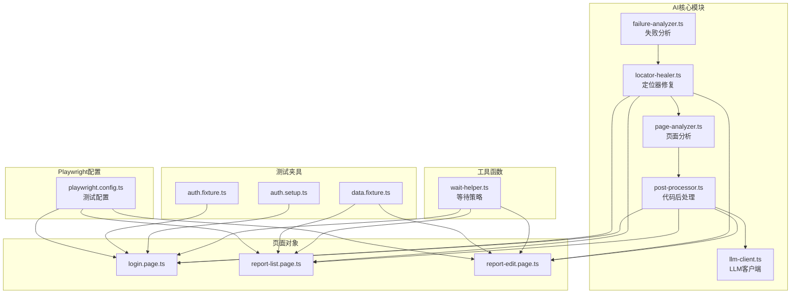
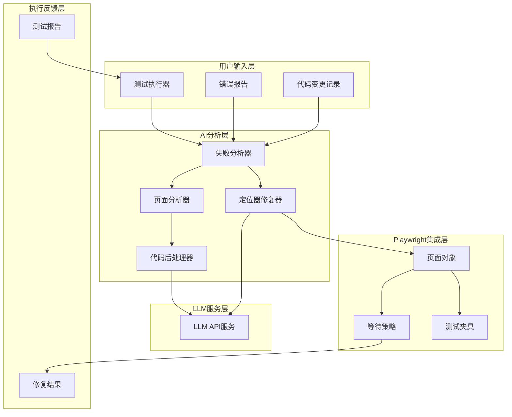
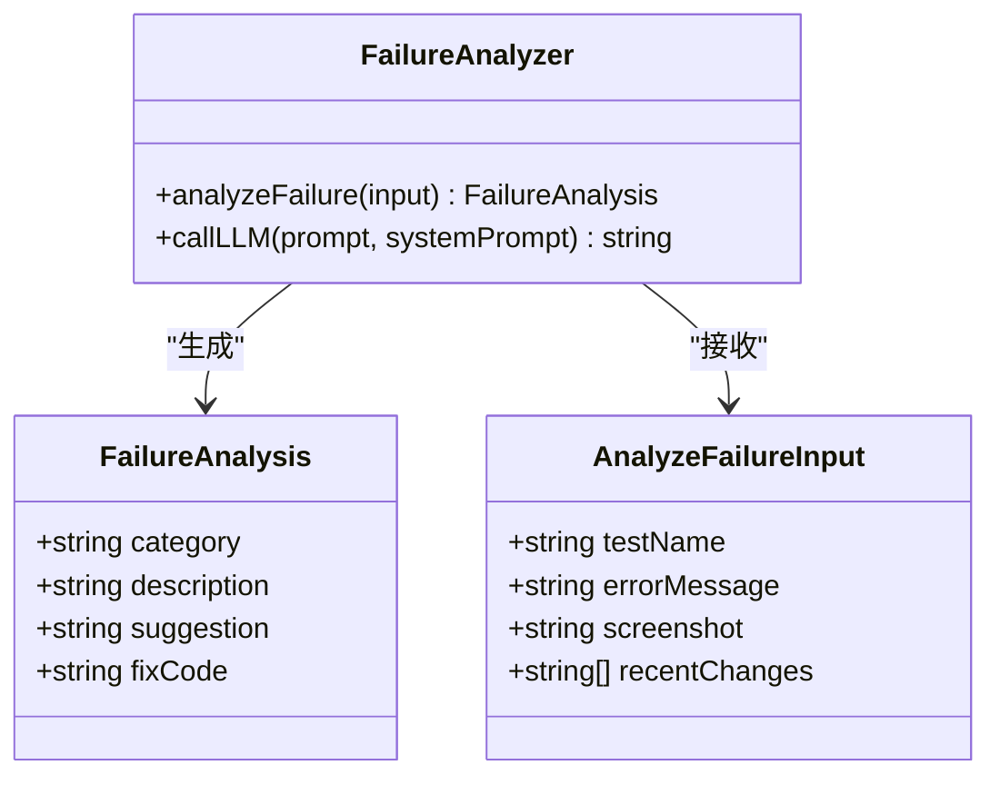
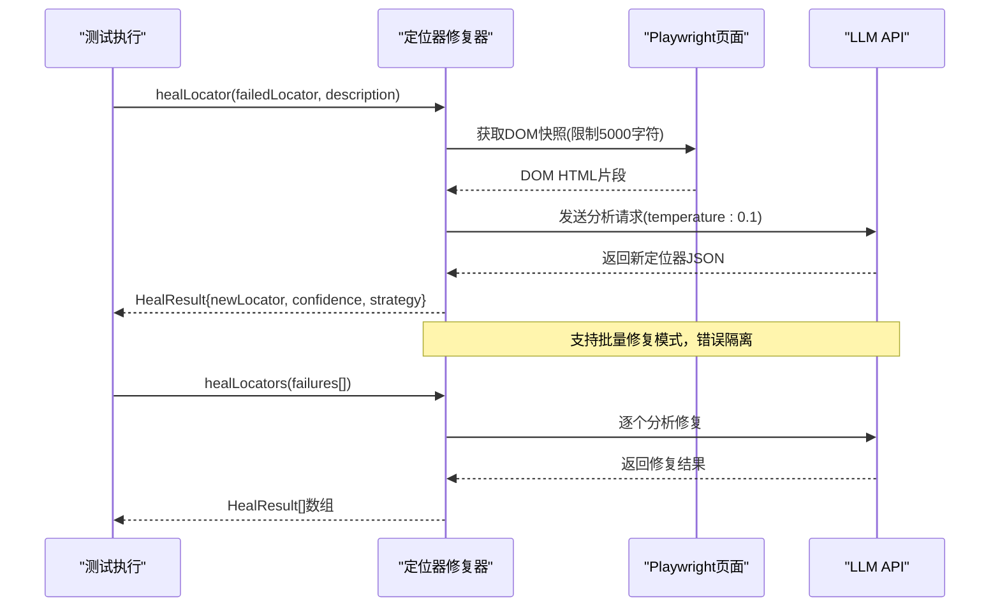
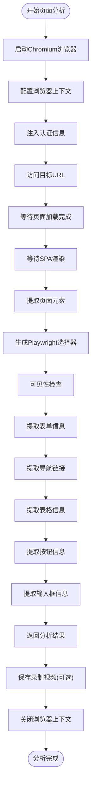
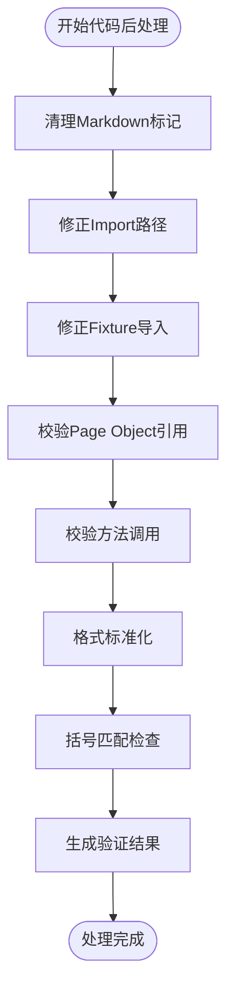
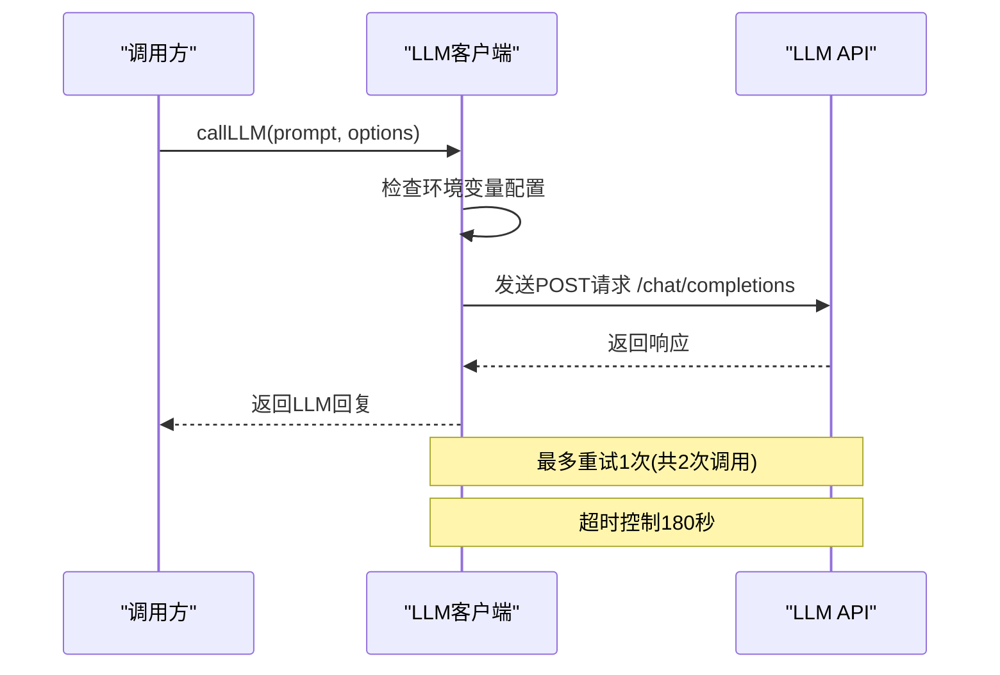
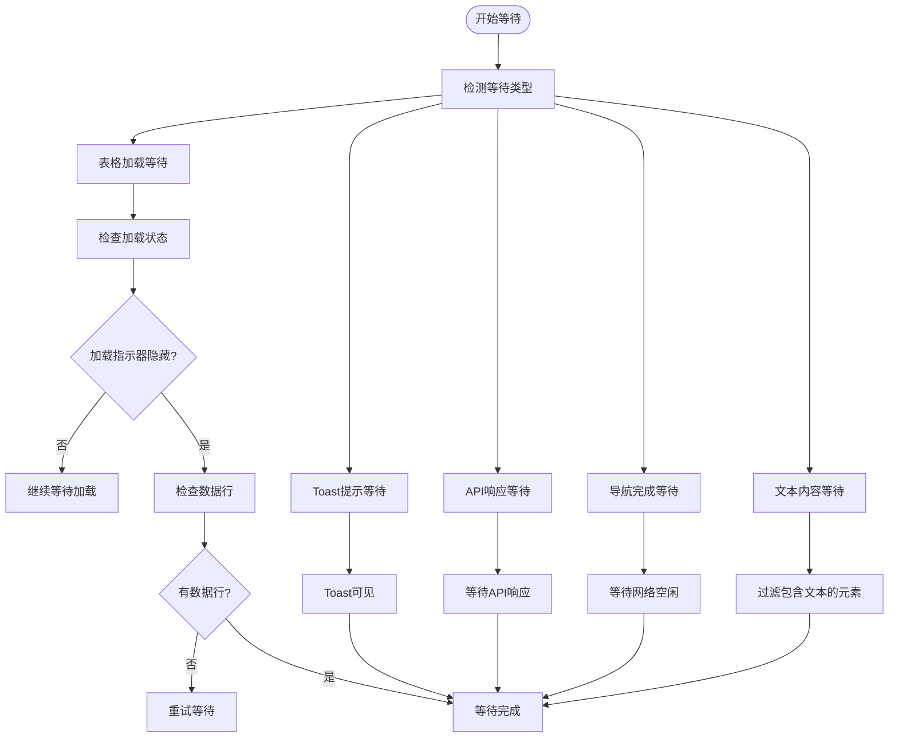
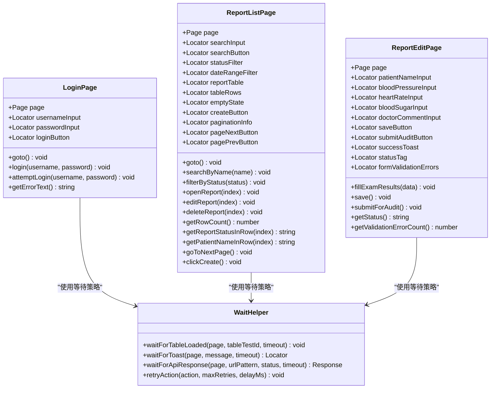

# AI定位修复工具

<cite>
**本文档引用的文件**
- [failure-analyzer.ts](file://e2e-tests/ai/failure-analyzer.ts)
- [locator-healer.ts](file://e2e-tests/ai/locator-healer.ts)
- [page-analyzer.ts](file://e2e-tests/ai/page-analyzer.ts)
- [post-processor.ts](file://e2e-tests/ai/post-processor.ts)
- [llm-client.ts](file://e2e-tests/ai/llm-client.ts)
- [types.ts](file://e2e-tests/ai/types.ts)
- [script-generator.ts](file://e2e-tests/ai/script-generator.ts)
- [test-generator.ts](file://e2e-tests/ai/test-generator.ts)
- [playwright.config.ts](file://e2e-tests/playwright.config.ts)
- [login.page.ts](file://e2e-tests/pages/login.page.ts)
- [report-list.page.ts](file://e2e-tests/pages/report-list.page.ts)
- [report-edit.page.ts](file://e2e-tests/pages/report-edit.page.ts)
- [wait-helper.ts](file://e2e-tests/utils/wait-helper.ts)
- [auth.fixture.ts](file://e2e-tests/fixtures/auth.fixture.ts)
- [auth.setup.ts](file://e2e-tests/fixtures/auth.setup.ts)
- [data.fixture.ts](file://e2e-tests/fixtures/data.fixture.ts)
- [login.spec.ts](file://e2e-tests/tests/smoke/login.spec.ts)
- [package.json](file://e2e-tests/package.json)
</cite>

## 更新摘要
**变更内容**
- 优化了定位器修复器的DOM分析能力，改进了定位器推荐算法
- 增强了页面分析引擎的元素提取和选择器生成能力
- 改进了后处理和代码校验机制，提高生成代码的质量
- 优化了LLM客户端的错误处理和重试机制

## 目录
1. [简介](#简介)
2. [项目结构](#项目结构)
3. [核心组件](#核心组件)
4. [架构总览](#架构总览)
5. [详细组件分析](#详细组件分析)
6. [依赖关系分析](#依赖关系分析)
7. [性能考虑](#性能考虑)
8. [故障排除指南](#故障排除指南)
9. [结论](#结论)
10. [附录](#附录)

## 简介
本项目为基于AI的端到端测试定位修复工具，专注于解决由于UI变化导致的测试失败问题。工具通过分析测试失败的根本原因，结合Playwright定位器系统，提供自动化的元素定位器修复、等待策略优化和稳定性改进方案。系统采用LLM（大语言模型）作为智能决策引擎，配合Playwright强大的定位能力，实现从"失败分析"到"自动修复"的闭环。

**更新** 系统已优化定位器修复器，改进了DOM分析能力和定位器推荐算法，显著提高了UI测试的稳定性。

## 项目结构
项目采用分层组织方式，核心AI能力位于`e2e-tests/ai`目录，Playwright测试框架配置位于根目录，页面对象（Page Objects）位于`pages`目录，测试夹具（Fixtures）位于`fixtures`目录，通用等待辅助工具位于`utils`目录。



**图表来源**
- [playwright.config.ts:1-68](file://e2e-tests/playwright.config.ts#L1-L68)
- [login.page.ts:1-52](file://e2e-tests/pages/login.page.ts#L1-L52)
- [report-list.page.ts:1-182](file://e2e-tests/pages/report-list.page.ts#L1-L182)
- [report-edit.page.ts:1-99](file://e2e-tests/pages/report-edit.page.ts#L1-L99)
- [wait-helper.ts:1-107](file://e2e-tests/utils/wait-helper.ts#L1-L107)
- [auth.fixture.ts:1-40](file://e2e-tests/fixtures/auth.fixture.ts#L1-L40)
- [auth.setup.ts:1-28](file://e2e-tests/fixtures/auth.setup.ts#L1-L28)
- [data.fixture.ts:1-57](file://e2e-tests/fixtures/data.fixture.ts#L1-L57)

**章节来源**
- [playwright.config.ts:1-68](file://e2e-tests/playwright.config.ts#L1-L68)
- [package.json:1-27](file://e2e-tests/package.json#L1-L27)

## 核心组件
本节深入分析AI定位修复工具的核心组件，包括失败分析、定位器修复、页面分析、代码后处理和LLM客户端等模块。

### 失败分析模块（Failure Analyzer）
失败分析模块负责对测试失败进行根因分类和修复建议生成。该模块采用系统提示词引导LLM进行专业化分析，支持四种失败类型：定位器失效、业务逻辑变更、环境问题和数据问题。

关键特性：
- 支持基于错误信息的根因分类
- 提供结构化修复建议
- 可生成可执行的修复代码片段
- 支持最近代码变更上下文分析

### 定位器修复模块（Locator Healer）
定位器修复模块是系统的核心智能修复组件，专门处理由于UI变化导致的定位器失效问题。该模块通过分析当前页面DOM快照，为失效的定位器提供替代方案。

**更新** 优化了DOM分析能力和定位器推荐算法，提高了修复精度和稳定性。

主要功能：
- 实时获取页面DOM快照（限制前5000字符）
- 基于Playwright语法生成新定位器
- 提供修复置信度评估
- 支持批量定位器修复
- 错误隔离和容错处理

### 页面分析模块（Page Analyzer）
页面分析模块负责对目标URL进行深度分析，提取页面结构和交互元素信息。

**更新** 增强了元素提取和选择器生成能力，支持更复杂的DOM结构分析。

核心能力：
- 启动Playwright浏览器访问页面
- 提取表单、导航、表格、按钮、输入框等元素
- 生成Playwright友好的选择器
- 支持认证信息注入和视频录制
- 提供详细的页面统计信息

### 代码后处理模块（Post Processor）
代码后处理模块对LLM生成的代码进行清理、修正和校验，确保生成的代码质量。

**更新** 改进了代码校验机制，增强了错误检测和修复能力。

主要功能：
- 清理Markdown标记和格式问题
- 修正Import路径和Fixture导入
- 校验Page Object引用和方法调用
- 格式标准化和括号匹配检查
- 生成详细的警告和错误报告

### LLM客户端模块（LLM Client）
LLM客户端模块提供统一的LLM API调用接口，支持重试机制和错误处理。

**更新** 优化了错误处理和重试机制，提高了API调用的稳定性。

关键特性：
- 支持OpenAI兼容的/chat/completions端点
- 内置重试机制（最多2次调用）
- 超时控制和取消支持
- JSON格式提取和代码块处理
- 环境变量配置管理

**章节来源**
- [failure-analyzer.ts:25-65](file://e2e-tests/ai/failure-analyzer.ts#L25-L65)
- [locator-healer.ts:15-89](file://e2e-tests/ai/locator-healer.ts#L15-L89)
- [page-analyzer.ts:20-414](file://e2e-tests/ai/page-analyzer.ts#L20-L414)
- [post-processor.ts:8-231](file://e2e-tests/ai/post-processor.ts#L8-L231)
- [llm-client.ts:21-87](file://e2e-tests/ai/llm-client.ts#L21-L87)

## 架构总览
系统采用模块化架构设计，AI分析模块与Playwright测试框架深度集成，形成完整的测试稳定性保障体系。



**图表来源**
- [failure-analyzer.ts:29-65](file://e2e-tests/ai/failure-analyzer.ts#L29-L65)
- [locator-healer.ts:19-62](file://e2e-tests/ai/locator-healer.ts#L19-L62)
- [page-analyzer.ts:20-414](file://e2e-tests/ai/page-analyzer.ts#L20-L414)
- [post-processor.ts:8-45](file://e2e-tests/ai/post-processor.ts#L8-L45)

## 详细组件分析

### 失败分析组件
失败分析组件通过精心设计的提示词模板，引导LLM进行专业化的测试失败诊断。



**图表来源**
- [failure-analyzer.ts:5-21](file://e2e-tests/ai/failure-analyzer.ts#L5-L21)
- [failure-analyzer.ts:29-65](file://e2e-tests/ai/failure-analyzer.ts#L29-L65)

**章节来源**
- [failure-analyzer.ts:29-65](file://e2e-tests/ai/failure-analyzer.ts#L29-L65)

### 定位器修复组件
定位器修复组件实现了从DOM分析到新定位器生成的完整流程，支持多种定位策略的优先级排序。

**更新** 优化了DOM分析能力和定位器推荐算法，提高了修复精度。



**图表来源**
- [locator-healer.ts:19-62](file://e2e-tests/ai/locator-healer.ts#L19-L62)
- [locator-healer.ts:68-89](file://e2e-tests/ai/locator-healer.ts#L68-L89)

**章节来源**
- [locator-healer.ts:19-89](file://e2e-tests/ai/locator-healer.ts#L19-L89)

### 页面分析组件
页面分析组件提供了深度的页面结构分析能力，支持复杂的DOM元素提取和选择器生成。

**更新** 增强了元素提取和选择器生成能力，支持更复杂的DOM结构分析。



**图表来源**
- [page-analyzer.ts:20-414](file://e2e-tests/ai/page-analyzer.ts#L20-L414)

**章节来源**
- [page-analyzer.ts:20-414](file://e2e-tests/ai/page-analyzer.ts#L20-L414)

### 代码后处理组件
代码后处理组件提供了全面的代码质量保证机制，确保生成的代码符合项目标准。

**更新** 改进了代码校验机制，增强了错误检测和修复能力。



**图表来源**
- [post-processor.ts:8-45](file://e2e-tests/ai/post-processor.ts#L8-L45)

**章节来源**
- [post-processor.ts:8-231](file://e2e-tests/ai/post-processor.ts#L8-L231)

### LLM客户端组件
LLM客户端组件提供了稳定的API调用接口，支持重试机制和错误处理。

**更新** 优化了错误处理和重试机制，提高了API调用的稳定性。



**图表来源**
- [llm-client.ts:21-87](file://e2e-tests/ai/llm-client.ts#L21-L87)

**章节来源**
- [llm-client.ts:21-120](file://e2e-tests/ai/llm-client.ts#L21-L120)

### 等待策略优化组件
等待策略组件提供了针对不同场景的稳定等待机制，有效解决SPA应用中的时序问题。



**图表来源**
- [wait-helper.ts:8-107](file://e2e-tests/utils/wait-helper.ts#L8-L107)

**章节来源**
- [wait-helper.ts:8-107](file://e2e-tests/utils/wait-helper.ts#L8-L107)

### Playwright集成组件
系统与Playwright的集成体现在多个层面，从配置到页面对象再到测试夹具。



**图表来源**
- [login.page.ts:3-52](file://e2e-tests/pages/login.page.ts#L3-L52)
- [report-list.page.ts:3-182](file://e2e-tests/pages/report-list.page.ts#L3-L182)
- [report-edit.page.ts:3-99](file://e2e-tests/pages/report-edit.page.ts#L3-L99)
- [wait-helper.ts:1-107](file://e2e-tests/utils/wait-helper.ts#L1-L107)

**章节来源**
- [login.page.ts:3-52](file://e2e-tests/pages/login.page.ts#L3-L52)
- [report-list.page.ts:3-182](file://e2e-tests/pages/report-list.page.ts#L3-L182)
- [report-edit.page.ts:3-99](file://e2e-tests/pages/report-edit.page.ts#L3-L99)

## 依赖关系分析
系统各组件之间的依赖关系清晰明确，形成了从AI分析到Playwright执行的完整链路。

```mermaid
graph LR
subgraph "外部依赖"
LLM["LLM API服务"]
PW["Playwright框架"]
DOTENV["dotenv配置管理"]
END
subgraph "内部模块"
FA["failure-analyzer"]
LH["locator-healer"]
PA["page-analyzer"]
PP["post-processor"]
LLMC["llm-client"]
WH["wait-helper"]
PC["playwright.config"]
end
LLM --> FA
LLM --> LH
LLM --> PA
LLM --> PP
LLM --> LLMC
DOTENV --> FA
DOTENV --> LH
DOTENV --> PA
DOTENV --> PP
DOTENV --> LLMC
PW --> FA
PW --> LH
PW --> PA
PW --> PP
PW --> WH
PC --> FA
PC --> LH
PC --> WH
```

**图表来源**
- [failure-analyzer.ts:1-65](file://e2e-tests/ai/failure-analyzer.ts#L1-L65)
- [locator-healer.ts:1-89](file://e2e-tests/ai/locator-healer.ts#L1-L89)
- [page-analyzer.ts:1-414](file://e2e-tests/ai/page-analyzer.ts#L1-L414)
- [post-processor.ts:1-231](file://e2e-tests/ai/post-processor.ts#L1-L231)
- [llm-client.ts:1-120](file://e2e-tests/ai/llm-client.ts#L1-L120)
- [playwright.config.ts:1-68](file://e2e-tests/playwright.config.ts#L1-L68)

**章节来源**
- [package.json:17-26](file://e2e-tests/package.json#L17-L26)

## 性能考虑
系统在设计时充分考虑了性能优化，主要体现在以下几个方面：

### LLM调用优化
**更新** 优化了LLM调用参数和错误处理机制

- 采用温度参数控制（0.1-0.3），平衡准确性与效率
- 限制DOM快照大小（前5000字符），避免LLM上下文过长
- 批量修复模式下的错误隔离，防止单点故障影响整体
- 最多重试1次（共2次调用），提高API调用稳定性
- 180秒超时控制，防止长时间阻塞

### Playwright执行优化
- 合理的超时配置：全局30秒，expect断言5秒
- 并行测试支持，CI环境下最多4个worker
- 智能重试机制，减少间歇性失败的影响

### 缓存与复用
- 测试夹具预加载认证状态，避免重复登录
- 页面对象定位器缓存，提升查找效率
- 等待策略的智能判断，避免不必要的等待

## 故障排除指南
针对系统可能出现的问题，提供详细的排查和解决方案：

### LLM API配置问题
**症状**：运行时报错"LLM_API_URL 和 LLM_API_KEY 未配置"
**解决方案**：
1. 检查`.env`文件中是否正确配置了LLM相关环境变量
2. 确认API密钥具有访问权限
3. 验证网络连接和防火墙设置

### 定位器修复失败
**症状**：定位器修复返回空结果或置信度为0
**排查步骤**：
1. 检查传入的DOM快照是否包含目标元素
2. 验证元素描述的准确性
3. 确认Playwright定位器语法正确性
4. 检查LLM API响应格式是否符合预期

### 页面分析失败
**症状**：页面分析超时或返回空结果
**解决方法**：
1. 调整等待时间参数（waitTime）
2. 检查目标URL的可达性和响应速度
3. 验证认证信息的正确性
4. 检查浏览器启动参数配置

### 代码后处理错误
**症状**：生成的代码存在语法错误或引用问题
**排查步骤**：
1. 检查生成代码的括号匹配情况
2. 验证Page Object类的引用是否正确
3. 确认方法调用的有效性
4. 检查Import路径的正确性

**章节来源**
- [failure-analyzer.ts:25-27](file://e2e-tests/ai/failure-analyzer.ts#L25-L27)
- [locator-healer.ts:25-27](file://e2e-tests/ai/locator-healer.ts#L25-L27)
- [llm-client.ts:25-27](file://e2e-tests/ai/llm-client.ts#L25-L27)

## 结论
AI定位修复工具通过智能化的失败分析和定位器修复机制，有效解决了UI变化导致的测试维护难题。系统采用模块化设计，与Playwright框架深度集成，提供了从根因分析到自动修复的完整解决方案。

**更新** 通过优化定位器修复器的DOM分析能力和定位器推荐算法，显著提高了UI测试的稳定性。增强的页面分析引擎能够更好地处理复杂的DOM结构，改进的代码后处理机制确保了生成代码的质量。优化的LLM客户端提供了更稳定的API调用体验。

通过合理的性能优化和故障排除机制，确保了工具在实际项目中的可靠性和实用性。

## 附录

### 使用示例
系统提供了完整的使用示例，展示如何在实际测试中应用AI定位修复功能。

**章节来源**
- [login.spec.ts:105-133](file://e2e-tests/tests/smoke/login.spec.ts#L105-L133)

### 配置参数说明
系统支持丰富的配置选项，可通过环境变量进行定制。

**章节来源**
- [playwright.config.ts:24-29](file://e2e-tests/playwright.config.ts#L24-L29)
- [package.json:6-13](file://e2e-tests/package.json#L6-L13)

### 自定义扩展
系统设计支持自定义扩展，开发者可以根据需要添加新的AI分析策略或修复规则。

**章节来源**
- [types.ts:43-54](file://e2e-tests/ai/types.ts#L43-L54)