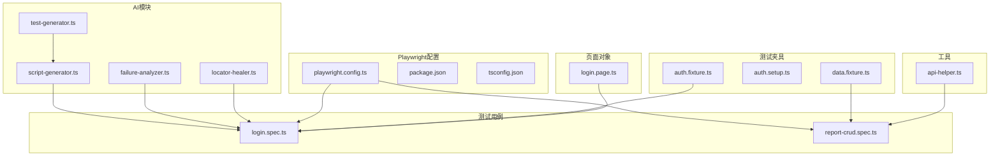
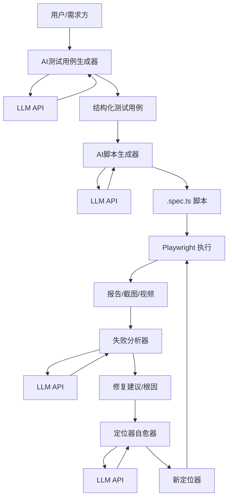
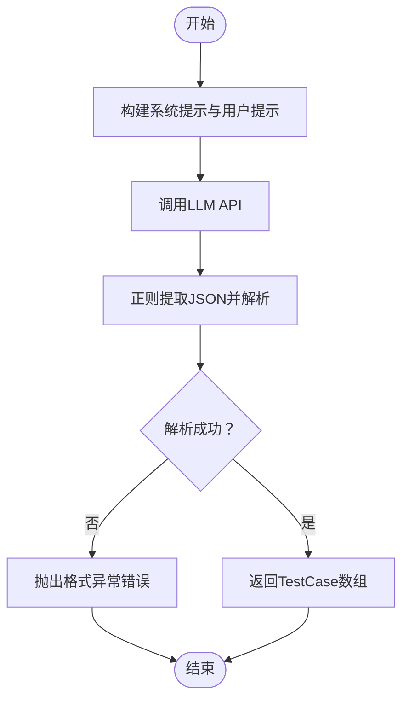
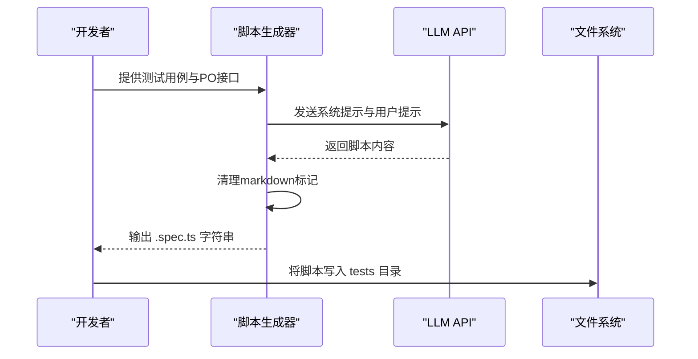
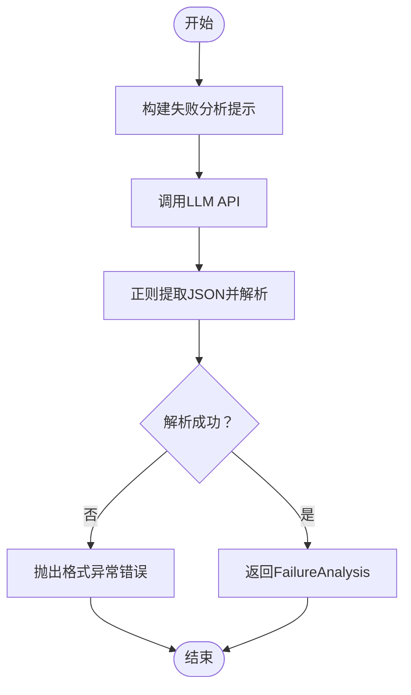
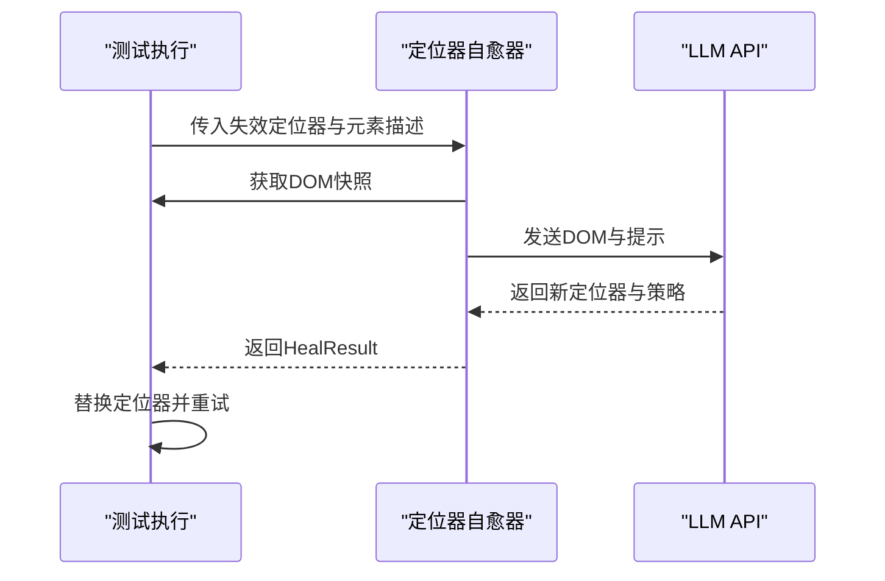
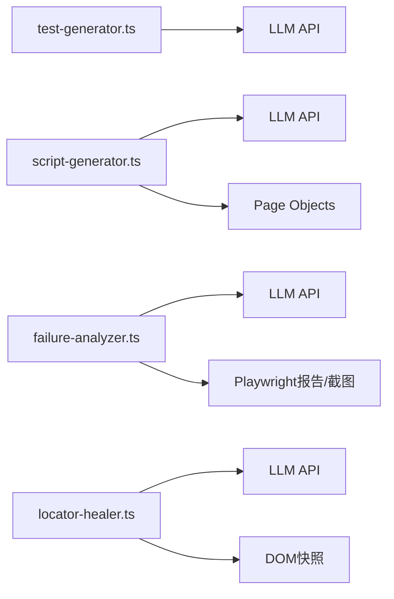

# AI测试生成系统

<cite>
**本文档引用的文件**
- [test-generator.ts](file://e2e-tests/ai/test-generator.ts)
- [script-generator.ts](file://e2e-tests/ai/script-generator.ts)
- [failure-analyzer.ts](file://e2e-tests/ai/failure-analyzer.ts)
- [locator-healer.ts](file://e2e-tests/ai/locator-healer.ts)
- [playwright.config.ts](file://e2e-tests/playwright.config.ts)
- [package.json](file://e2e-tests/package.json)
- [tsconfig.json](file://e2e-tests/tsconfig.json)
- [auth.fixture.ts](file://e2e-tests/fixtures/auth.fixture.ts)
- [auth.setup.ts](file://e2e-tests/fixtures/auth.setup.ts)
- [data.fixture.ts](file://e2e-tests/fixtures/data.fixture.ts)
- [api-helper.ts](file://e2e-tests/utils/api-helper.ts)
- [login.page.ts](file://e2e-tests/pages/login.page.ts)
- [report-crud.spec.ts](file://e2e-tests/tests/regression/report-crud.spec.ts)
- [login.spec.ts](file://e2e-tests/tests/smoke/login.spec.ts)
</cite>

## 目录
1. [简介](#简介)
2. [项目结构](#项目结构)
3. [核心组件](#核心组件)
4. [架构总览](#架构总览)
5. [详细组件分析](#详细组件分析)
6. [依赖关系分析](#依赖关系分析)
7. [性能考虑](#性能考虑)
8. [故障排除指南](#故障排除指南)
9. [结论](#结论)
10. [附录](#附录)

## 简介
本项目是一个基于Playwright的端到端测试框架，集成了AI能力以实现测试用例与测试脚本的自动化生成，并提供失败分析与定位器自愈能力。系统通过大语言模型（LLM）完成从自然语言到结构化测试用例、再到可执行Playwright测试脚本的转换；同时支持对失败用例进行根因分析与定位器修复，提升测试稳定性与可维护性。

## 项目结构
项目采用“功能+层次”混合组织方式：
- ai目录：AI相关模块（测试用例生成、脚本生成、失败分析、定位器自愈）
- fixtures目录：Playwright测试夹具（登录态、测试数据）
- pages目录：页面对象（PO）
- tests目录：测试用例（冒烟与回归）
- utils目录：通用工具（API辅助）
- 根目录：Playwright配置、包管理与TypeScript路径映射

图表来源
- [playwright.config.ts:1-68](file://e2e-tests/playwright.config.ts#L1-L68)
- [package.json:1-27](file://e2e-tests/package.json#L1-L27)
- [tsconfig.json:1-25](file://e2e-tests/tsconfig.json#L1-L25)
- [auth.fixture.ts:1-40](file://e2e-tests/fixtures/auth.fixture.ts#L1-L40)
- [auth.setup.ts:1-30](file://e2e-tests/fixtures/auth.setup.ts#L1-L30)
- [data.fixture.ts:1-57](file://e2e-tests/fixtures/data.fixture.ts#L1-L57)
- [login.page.ts:1-52](file://e2e-tests/pages/login.page.ts#L1-L52)
- [login.spec.ts:1-25](file://e2e-tests/tests/smoke/login.spec.ts#L1-L25)
- [report-crud.spec.ts:1-122](file://e2e-tests/tests/regression/report-crud.spec.ts#L1-L122)
- [api-helper.ts:1-172](file://e2e-tests/utils/api-helper.ts#L1-L172)
- [test-generator.ts:1-107](file://e2e-tests/ai/test-generator.ts#L1-L107)
- [script-generator.ts:1-110](file://e2e-tests/ai/script-generator.ts#L1-L110)
- [failure-analyzer.ts:1-112](file://e2e-tests/ai/failure-analyzer.ts#L1-L112)
- [locator-healer.ts:1-131](file://e2e-tests/ai/locator-healer.ts#L1-L131)

章节来源
- [playwright.config.ts:1-68](file://e2e-tests/playwright.config.ts#L1-L68)
- [package.json:1-27](file://e2e-tests/package.json#L1-L27)
- [tsconfig.json:1-25](file://e2e-tests/tsconfig.json#L1-L25)

## 核心组件
- AI测试用例生成器：接收功能描述与角色信息，调用LLM生成结构化测试用例（TC）。
- AI脚本生成器：接收测试用例与Page Object接口，生成可执行的Playwright .spec.ts脚本。
- 失败分析器：接收测试失败信息、截图与变更记录，输出根因分类与修复建议。
- 定位器自愈器：在定位器失效时，分析DOM并推荐新的定位器。
- Playwright配置：定义项目、设备、报告器与项目间依赖。
- 夹具与工具：提供登录态与测试数据准备，以及API辅助工具。

章节来源
- [test-generator.ts:43-107](file://e2e-tests/ai/test-generator.ts#L43-L107)
- [script-generator.ts:44-110](file://e2e-tests/ai/script-generator.ts#L44-L110)
- [failure-analyzer.ts:43-112](file://e2e-tests/ai/failure-analyzer.ts#L43-L112)
- [locator-healer.ts:47-131](file://e2e-tests/ai/locator-healer.ts#L47-L131)
- [playwright.config.ts:6-68](file://e2e-tests/playwright.config.ts#L6-L68)
- [auth.fixture.ts:1-40](file://e2e-tests/fixtures/auth.fixture.ts#L1-L40)
- [data.fixture.ts:1-57](file://e2e-tests/fixtures/data.fixture.ts#L1-L57)
- [api-helper.ts:1-172](file://e2e-tests/utils/api-helper.ts#L1-L172)

## 架构总览
系统通过LLM实现“自然语言→结构化用例→可执行脚本”的闭环，结合Playwright的夹具与页面对象，形成稳定的测试执行环境；失败分析与定位器自愈进一步增强系统的鲁棒性。

图表来源
- [test-generator.ts:12-41](file://e2e-tests/ai/test-generator.ts#L12-L41)
- [script-generator.ts:13-42](file://e2e-tests/ai/script-generator.ts#L13-L42)
- [failure-analyzer.ts:12-41](file://e2e-tests/ai/failure-analyzer.ts#L12-L41)
- [locator-healer.ts:13-45](file://e2e-tests/ai/locator-healer.ts#L13-L45)
- [playwright.config.ts:31-66](file://e2e-tests/playwright.config.ts#L31-L66)

## 详细组件分析

### AI测试用例生成器
- 功能：将功能名称、描述与角色信息转化为结构化测试用例数组。
- 关键点：
  - 使用OpenAI兼容的/chat/completions接口，temperature较低以提高确定性。
  - 通过正则提取JSON片段并解析，确保输出格式可控。
  - 支持优先级与分类（P0/P1/P2、正向/逆向/边界/权限）。
- 典型输入输出：
  - 输入：featureName、description、roles
  - 输出：TestCase[]
- 复杂度：O(n)（n为提示词长度与LLM响应解析）

图表来源
- [test-generator.ts:67-107](file://e2e-tests/ai/test-generator.ts#L67-L107)

章节来源
- [test-generator.ts:12-41](file://e2e-tests/ai/test-generator.ts#L12-L41)
- [test-generator.ts:67-107](file://e2e-tests/ai/test-generator.ts#L67-L107)

### AI脚本生成器
- 功能：将测试用例与Page Object接口转换为可执行的Playwright .spec.ts脚本。
- 关键点：
  - 严格约束生成规范（describe组织、fixture、beforeEach、expect断言）。
  - 支持注入工具函数（如创建/删除测试报告）。
  - 清理markdown代码块标记，保证输出为纯净TS代码。
- 典型输入输出：
  - 输入：testCase、pageObjects、fixtures
  - 输出：.spec.ts字符串

图表来源
- [script-generator.ts:63-110](file://e2e-tests/ai/script-generator.ts#L63-L110)

章节来源
- [script-generator.ts:13-42](file://e2e-tests/ai/script-generator.ts#L13-L42)
- [script-generator.ts:63-110](file://e2e-tests/ai/script-generator.ts#L63-L110)

### 失败分析器
- 功能：对失败用例进行根因分析，输出category/description/suggestion/fixCode。
- 关键点：
  - 支持定位器失效(locator)、业务逻辑变更(logic)、环境问题(env)、数据问题(data)四类。
  - 可选附带最近变更列表与截图，帮助LLM更准确判断。
- 典型输入输出：
  - 输入：testName、errorMessage、screenshot、recentChanges
  - 输出：FailureAnalysis

图表来源
- [failure-analyzer.ts:69-112](file://e2e-tests/ai/failure-analyzer.ts#L69-L112)

章节来源
- [failure-analyzer.ts:12-41](file://e2e-tests/ai/failure-analyzer.ts#L12-L41)
- [failure-analyzer.ts:69-112](file://e2e-tests/ai/failure-analyzer.ts#L69-L112)

### 定位器自愈器
- 功能：当定位器失效时，分析当前页面DOM并推荐新的定位器。
- 关键点：
  - 截取DOM片段，结合元素描述与Playwright语法生成新定位器。
  - 支持批量修复，记录置信度与策略说明。
- 典型输入输出：
  - 输入：page、failedLocator、elementDescription
  - 输出：HealResult（originalLocator/newLocator/confidence/strategy）

图表来源
- [locator-healer.ts:62-103](file://e2e-tests/ai/locator-healer.ts#L62-L103)

章节来源
- [locator-healer.ts:13-45](file://e2e-tests/ai/locator-healer.ts#L13-L45)
- [locator-healer.ts:62-131](file://e2e-tests/ai/locator-healer.ts#L62-L131)

### Playwright配置与项目结构
- 配置要点：
  - testDir、timeout、expect.timeout、fullyParallel、retries、workers、reporter、use.baseURL、screenshot/video/trace策略。
  - 项目划分：setup/cleanup、smoke-chromium、regression-chromium、regression-firefox。
- 作用：统一测试执行环境、报告输出与跨浏览器一致性。

章节来源
- [playwright.config.ts:6-68](file://e2e-tests/playwright.config.ts#L6-L68)

### 夹具与工具
- 登录态夹具：为不同角色提供带storageState的Page实例。
- 数据夹具：自动创建/清理测试报告，确保测试隔离与干净状态。
- API辅助：封装认证、创建/删除/更新/查询报告与批量清理。

章节来源
- [auth.fixture.ts:1-40](file://e2e-tests/fixtures/auth.fixture.ts#L1-L40)
- [auth.setup.ts:1-30](file://e2e-tests/fixtures/auth.setup.ts#L1-L30)
- [data.fixture.ts:1-57](file://e2e-tests/fixtures/data.fixture.ts#L1-L57)
- [api-helper.ts:45-172](file://e2e-tests/utils/api-helper.ts#L45-L172)

## 依赖关系分析
- 模块内聚与耦合：
  - AI模块内部低耦合，均通过LLM API进行外部交互。
  - 测试脚本生成依赖于Page Object接口与夹具信息，耦合度中等。
- 外部依赖：
  - LLM API（OpenAI兼容）、Playwright、dotenv、Allure等。
- 可能的循环依赖：
  - 未发现直接循环依赖；AI模块与测试脚本生成器通过类型共享，但无运行时导入链。

图表来源
- [test-generator.ts:12-41](file://e2e-tests/ai/test-generator.ts#L12-L41)
- [script-generator.ts:13-42](file://e2e-tests/ai/script-generator.ts#L13-L42)
- [failure-analyzer.ts:12-41](file://e2e-tests/ai/failure-analyzer.ts#L12-L41)
- [locator-healer.ts:13-45](file://e2e-tests/ai/locator-healer.ts#L13-L45)

章节来源
- [package.json:17-26](file://e2e-tests/package.json#L17-L26)

## 性能考虑
- LLM调用成本：
  - 通过较低temperature与明确的提示模板降低token消耗与不确定性。
  - 在CI中合理设置workers与retries，避免过度并发导致LLM限流。
- 测试执行性能：
  - fullyParallel开启，缩短整体执行时间；注意资源竞争与定位器稳定性。
  - 合理使用fixtures与API辅助，减少重复初始化开销。
- 失败分析与自愈：
  - 批量定位器修复应限制尝试次数与超时，避免阻塞测试流程。

## 故障排除指南
- LLM API未配置：
  - 现象：调用LLM时报错，提示未配置URL与Key。
  - 处理：在环境变量中设置LLM_API_URL、LLM_API_KEY、LLM_MODEL。
- LLM响应格式异常：
  - 现象：无法解析JSON片段，抛出格式异常。
  - 处理：检查提示模板是否强制输出JSON；确认LLM版本与参数。
- Playwright执行失败：
  - 现象：定位器失效、断言失败、环境不稳定。
  - 处理：使用失败分析器获取根因；利用定位器自愈器替换失效定位器；检查页面DOM与元素描述。
- CI报告与产物：
  - 现象：报告未生成或报告器配置无效。
  - 处理：确认CI环境变量与reporter配置；检查输出目录权限。

章节来源
- [test-generator.ts:13-15](file://e2e-tests/ai/test-generator.ts#L13-L15)
- [script-generator.ts:14-16](file://e2e-tests/ai/script-generator.ts#L14-L16)
- [failure-analyzer.ts:13-15](file://e2e-tests/ai/failure-analyzer.ts#L13-L15)
- [locator-healer.ts:14-16](file://e2e-tests/ai/locator-healer.ts#L14-L16)
- [playwright.config.ts:16-22](file://e2e-tests/playwright.config.ts#L16-L22)

## 结论
本系统通过LLM实现了从需求到可执行测试的自动化闭环，结合Playwright的稳定执行与夹具体系，显著提升了测试效率与质量。失败分析与定位器自愈进一步增强了系统的韧性。建议在生产环境中完善LLM密钥管理、监控调用成本与稳定性，并持续优化提示模板以提升生成质量。

## 附录

### 配置参数说明
- LLM相关
  - LLM_API_URL：LLM服务地址（需支持/chat/completions）
  - LLM_API_KEY：访问密钥
  - LLM_MODEL：模型名称，默认gpt-4
- 运行时参数
  - BASE_URL：应用基地址
  - API_BASE_URL：API基础地址
- Playwright参数
  - timeout、expect.timeout、retries、workers、reporter等详见配置文件

章节来源
- [test-generator.ts:5-7](file://e2e-tests/ai/test-generator.ts#L5-L7)
- [script-generator.ts:6-8](file://e2e-tests/ai/script-generator.ts#L6-L8)
- [failure-analyzer.ts:5-7](file://e2e-tests/ai/failure-analyzer.ts#L5-L7)
- [locator-healer.ts:6-8](file://e2e-tests/ai/locator-healer.ts#L6-L8)
- [playwright.config.ts:25](file://e2e-tests/playwright.config.ts#L25)
- [api-helper.ts:6](file://e2e-tests/utils/api-helper.ts#L6)

### 最佳实践
- 提示工程
  - 明确输出格式与约束，使用system prompt限定风格。
  - 在测试用例生成中强调覆盖维度（正向/逆向/边界/权限）。
- 脚本生成
  - 保持PO接口简洁一致，便于LLM理解与生成。
  - 在生成脚本中显式声明fixture与beforeEach逻辑。
- 失败处理
  - 结合截图与最近变更列表，提升根因分析准确性。
  - 对定位器自愈结果进行阈值过滤与回退策略。
- CI集成
  - 控制并发与重试次数，避免LLM限流。
  - 使用Allure等报告器统一输出，便于追踪与复盘。

### 扩展AI功能指导
- 新增提示模板
  - 在对应AI模块中新增systemPrompt与prompt模板，遵循现有格式。
- 新增LLM能力
  - 如需多模态输入（截图/视频），可在失败分析器中扩展输入字段与解析逻辑。
- 本地化与缓存
  - 引入本地缓存策略，减少重复LLM调用；对常用模板进行预热。
- 监控与可观测性
  - 记录LLM调用耗时、成功率与错误码，建立SLA与告警。