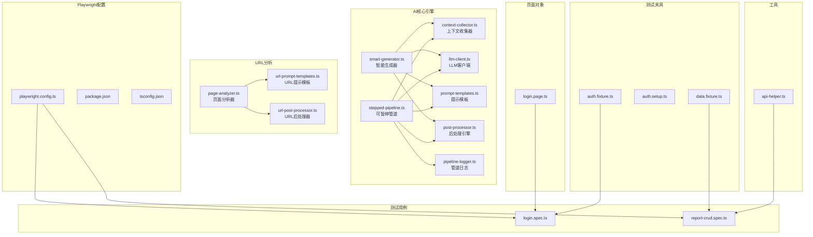
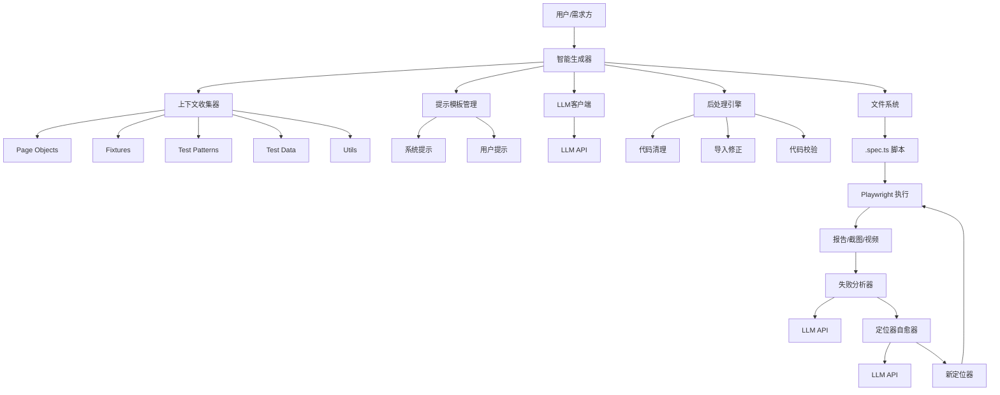
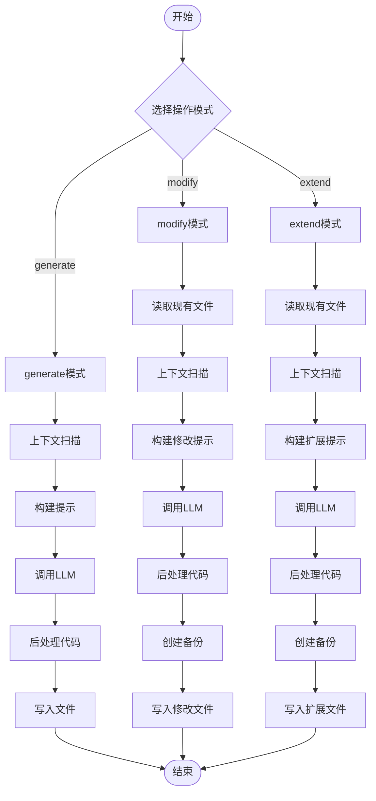
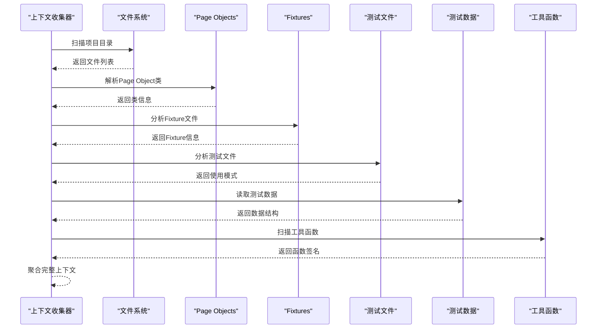
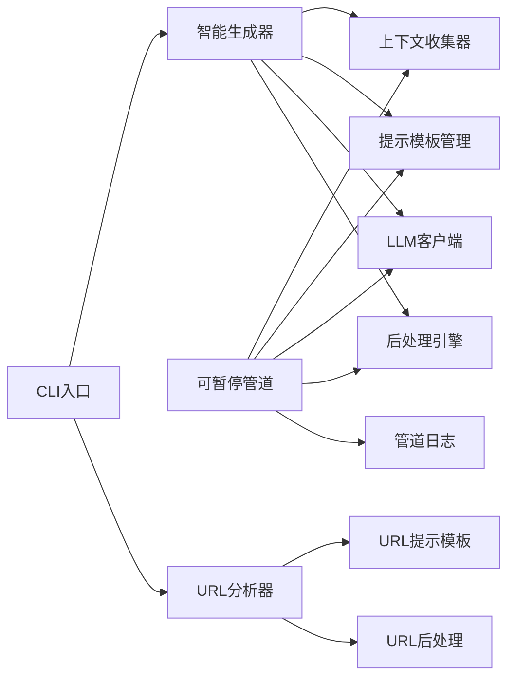

# AI测试生成系统

<cite>
**本文档引用的文件**
- [smart-generator.ts](file://e2e-tests/ai/smart-generator.ts)
- [context-collector.ts](file://e2e-tests/ai/context-collector.ts)
- [llm-client.ts](file://e2e-tests/ai/llm-client.ts)
- [prompt-templates.ts](file://e2e-tests/ai/prompt-templates.ts)
- [stepped-pipeline.ts](file://e2e-tests/ai/stepped-pipeline.ts)
- [types.ts](file://e2e-tests/ai/types.ts)
- [pipeline-types.ts](file://e2e-tests/ai/pipeline-types.ts)
- [cli.ts](file://e2e-tests/ai/cli.ts)
- [post-processor.ts](file://e2e-tests/ai/post-processor.ts)
- [page-analyzer.ts](file://e2e-tests/ai/page-analyzer.ts)
- [url-prompt-templates.ts](file://e2e-tests/ai/url-prompt-templates.ts)
- [url-post-processor.ts](file://e2e-tests/ai/url-post-processor.ts)
- [pipeline-logger.ts](file://e2e-tests/ai/pipeline-logger.ts)
- [playwright.config.ts](file://e2e-tests/playwright.config.ts)
- [package.json](file://e2e-tests/package.json)
- [tsconfig.json](file://e2e-tests/tsconfig.json)
- [auth.fixture.ts](file://e2e-tests/fixtures/auth.fixture.ts)
- [auth.setup.ts](file://e2e-tests/fixtures/auth.setup.ts)
- [data.fixture.ts](file://e2e-tests/fixtures/data.fixture.ts)
- [api-helper.ts](file://e2e-tests/utils/api-helper.ts)
- [login.page.ts](file://e2e-tests/pages/login.page.ts)
- [report-crud.spec.ts](file://e2e-tests/tests/regression/report-crud.spec.ts)
- [login.spec.ts](file://e2e-tests/tests/smoke/login.spec.ts)
</cite>

## 更新摘要
**变更内容**
- 新增智能生成器（Smart Generator）作为核心编排引擎
- 新增上下文收集器（Context Collector）实现项目上下文自动发现
- 新增提示模板管理（Prompt Templates）支持多种生成场景
- 新增LLM客户端（LLM Client）统一API调用接口
- 新增可暂停管道引擎（Stepped Pipeline）支持交互式调试
- 新增URL分析引擎支持任意网站测试生成
- 新增管道日志记录器（Pipeline Logger）提供结构化日志
- 支持generate、modify、extend三种操作模式的完整重构

## 目录
1. [简介](#简介)
2. [项目结构](#项目结构)
3. [核心组件](#核心组件)
4. [架构总览](#架构总览)
5. [详细组件分析](#详细组件分析)
6. [依赖关系分析](#依赖关系分析)
7. [性能考虑](#性能考虑)
8. [故障排除指南](#故障排除指南)
9. [结论](#结论)
10. [附录](#附录)

## 简介
本项目是一个基于Playwright的端到端测试框架，经过完全重构后集成了AI能力以实现测试用例与测试脚本的自动化生成。系统通过智能生成器、上下文收集器、提示模板管理、LLM客户端等核心组件，支持generate（生成）、modify（修改）、extend（扩展）三种操作模式，能够从自然语言到结构化测试用例、再到可执行Playwright测试脚本的完整转换；同时支持对失败用例进行根因分析与定位器修复，提升测试稳定性与可维护性。

## 项目结构
项目采用"功能+层次"混合组织方式，经过重构后形成了更加模块化的架构：
- ai目录：AI相关模块（智能生成器、上下文收集器、提示模板、LLM客户端、管道引擎等）
- fixtures目录：Playwright测试夹具（登录态、测试数据）
- pages目录：页面对象（PO）
- tests目录：测试用例（冒烟与回归）
- utils目录：通用工具（API辅助）
- 根目录：Playwright配置、包管理与TypeScript路径映射



**图表来源**
- [smart-generator.ts:1-272](file://e2e-tests/ai/smart-generator.ts#L1-L272)
- [context-collector.ts:1-370](file://e2e-tests/ai/context-collector.ts#L1-L370)
- [llm-client.ts:1-120](file://e2e-tests/ai/llm-client.ts#L1-L120)
- [prompt-templates.ts:1-192](file://e2e-tests/ai/prompt-templates.ts#L1-L192)
- [post-processor.ts:1-232](file://e2e-tests/ai/post-processor.ts#L1-L232)
- [stepped-pipeline.ts:1-696](file://e2e-tests/ai/stepped-pipeline.ts#L1-L696)
- [pipeline-logger.ts:1-116](file://e2e-tests/ai/pipeline-logger.ts#L1-L116)
- [page-analyzer.ts:1-415](file://e2e-tests/ai/page-analyzer.ts#L1-L415)
- [url-prompt-templates.ts:1-291](file://e2e-tests/ai/url-prompt-templates.ts#L1-L291)
- [url-post-processor.ts:1-137](file://e2e-tests/ai/url-post-processor.ts#L1-L137)

**章节来源**
- [playwright.config.ts:1-68](file://e2e-tests/playwright.config.ts#L1-L68)
- [package.json:1-27](file://e2e-tests/package.json#L1-L27)
- [tsconfig.json:1-25](file://e2e-tests/tsconfig.json#L1-L25)

## 核心组件
- **智能生成器（Smart Generator）**：核心编排引擎，负责协调上下文收集、提示构建、LLM调用、代码后处理和文件写入等全流程操作，支持generate、modify、extend三种模式。
- **上下文收集器（Context Collector）**：自动发现和分析项目结构，包括Page Object类、Fixture、测试模式、测试数据和工具函数等。
- **提示模板管理（Prompt Templates）**：提供系统提示和用户提示的构建逻辑，支持generate、modify、extend三种场景的定制化提示。
- **LLM客户端（LLM Client）**：统一的LLM API调用接口，支持重试机制、超时控制和响应解析。
- **可暂停管道引擎（Stepped Pipeline）**：提供交互式调试能力，支持步骤确认、错误处理和状态跟踪。
- **后处理引擎（Post Processor）**：对LLM生成的代码进行清理、修正和校验，确保生成代码的质量和可执行性。
- **URL分析引擎**：支持任意网站的页面分析和测试生成，无需项目上下文。
- **管道日志记录器（Pipeline Logger）**：提供结构化日志记录和实时事件推送。

**章节来源**
- [smart-generator.ts:97-164](file://e2e-tests/ai/smart-generator.ts#L97-L164)
- [context-collector.ts:360-370](file://e2e-tests/ai/context-collector.ts#L360-L370)
- [prompt-templates.ts:102-132](file://e2e-tests/ai/prompt-templates.ts#L102-L132)
- [llm-client.ts:21-87](file://e2e-tests/ai/llm-client.ts#L21-L87)
- [stepped-pipeline.ts:90-104](file://e2e-tests/ai/stepped-pipeline.ts#L90-L104)
- [post-processor.ts:8-45](file://e2e-tests/ai/post-processor.ts#L8-L45)
- [page-analyzer.ts:20-415](file://e2e-tests/ai/page-analyzer.ts#L20-L415)
- [pipeline-logger.ts:10-32](file://e2e-tests/ai/pipeline-logger.ts#L10-L32)

## 架构总览
系统通过智能生成器实现"自然语言→结构化用例→可执行脚本"的完整闭环，结合上下文收集器的自动化发现能力和提示模板的定制化构建，形成高度智能化的测试生成体系。可暂停管道引擎提供交互式调试能力，后处理引擎确保代码质量和一致性。



**图表来源**
- [smart-generator.ts:97-164](file://e2e-tests/ai/smart-generator.ts#L97-L164)
- [context-collector.ts:360-370](file://e2e-tests/ai/context-collector.ts#L360-L370)
- [prompt-templates.ts:102-132](file://e2e-tests/ai/prompt-templates.ts#L102-L132)
- [llm-client.ts:21-87](file://e2e-tests/ai/llm-client.ts#L21-L87)
- [post-processor.ts:8-45](file://e2e-tests/ai/post-processor.ts#L8-L45)

## 详细组件分析

### 智能生成器（Smart Generator）
智能生成器是系统的核心编排引擎，负责协调整个AI测试生成流程。它支持三种操作模式：

- **generate模式**：根据功能描述生成新的测试文件，自动推断相关Page Object类，构建合适的测试文件名。
- **modify模式**：修改现有测试文件，保留原文件内容，仅做必要修改，并创建.bak备份。
- **extend模式**：在现有测试文件中追加新的测试用例，保持现有代码不变，仅添加新用例。

智能生成器还提供了干运行（dry-run）模式，允许用户先查看生成的代码而不实际写入文件。



**图表来源**
- [smart-generator.ts:97-164](file://e2e-tests/ai/smart-generator.ts#L97-L164)
- [smart-generator.ts:169-216](file://e2e-tests/ai/smart-generator.ts#L169-L216)
- [smart-generator.ts:221-271](file://e2e-tests/ai/smart-generator.ts#L221-L271)

**章节来源**
- [smart-generator.ts:97-164](file://e2e-tests/ai/smart-generator.ts#L97-L164)
- [smart-generator.ts:169-216](file://e2e-tests/ai/smart-generator.ts#L169-L216)
- [smart-generator.ts:221-271](file://e2e-tests/ai/smart-generator.ts#L221-L271)

### 上下文收集器（Context Collector）
上下文收集器负责自动发现和分析项目的结构信息，为智能生成提供准确的上下文数据：

- **Page Object收集**：自动扫描pages目录，提取类名、定位器属性和方法签名
- **Fixture收集**：分析auth.fixture和data.fixture，提取角色页面和数据fixture信息
- **测试模式收集**：分析现有测试文件的导入语句、使用的fixture和Page Object
- **测试数据收集**：读取data目录下的JSON文件，提取测试数据结构
- **工具函数收集**：扫描utils目录，提取导出的工具函数签名和描述



**图表来源**
- [context-collector.ts:18-84](file://e2e-tests/ai/context-collector.ts#L18-L84)
- [context-collector.ts:89-133](file://e2e-tests/ai/context-collector.ts#L89-L133)
- [context-collector.ts:138-187](file://e2e-tests/ai/context-collector.ts#L138-L187)
- [context-collector.ts:192-252](file://e2e-tests/ai/context-collector.ts#L192-L252)
- [context-collector.ts:257-315](file://e2e-tests/ai/context-collector.ts#L257-L315)
- [context-collector.ts:320-355](file://e2e-tests/ai/context-collector.ts#L320-L355)

**章节来源**
- [context-collector.ts:18-84](file://e2e-tests/ai/context-collector.ts#L18-L84)
- [context-collector.ts:89-133](file://e2e-tests/ai/context-collector.ts#L89-L133)
- [context-collector.ts:138-187](file://e2e-tests/ai/context-collector.ts#L138-L187)
- [context-collector.ts:192-252](file://e2e-tests/ai/context-collector.ts#L192-L252)
- [context-collector.ts:257-315](file://e2e-tests/ai/context-collector.ts#L257-L315)
- [context-collector.ts:320-355](file://e2e-tests/ai/context-collector.ts#L320-L355)

### 提示模板管理（Prompt Templates）
提示模板管理器提供三种场景的提示构建逻辑：

- **Generate提示**：基于项目上下文和现有测试模式，生成符合项目风格的测试代码
- **Modify提示**：在现有代码基础上进行修改，保持不相关代码不变
- **Extend提示**：在现有测试文件中追加新的测试用例，不破坏现有结构

系统提示包含严格的约束条件，确保生成的代码符合项目规范和最佳实践。

**章节来源**
- [prompt-templates.ts:102-132](file://e2e-tests/ai/prompt-templates.ts#L102-L132)
- [prompt-templates.ts:137-161](file://e2e-tests/ai/prompt-templates.ts#L137-L161)
- [prompt-templates.ts:166-191](file://e2e-tests/ai/prompt-templates.ts#L166-L191)

### LLM客户端（LLM Client）
LLM客户端提供统一的API调用接口，具备以下特性：

- **环境配置**：通过dotenv加载LLM_API_URL、LLM_API_KEY、LLM_MODEL等配置
- **重试机制**：最多重试2次，首次失败后等待3秒再重试
- **超时控制**：使用AbortController设置180秒超时
- **响应解析**：提供extractJSON、extractJSONArray、extractCodeBlock等解析工具

**章节来源**
- [llm-client.ts:21-87](file://e2e-tests/ai/llm-client.ts#L21-L87)
- [llm-client.ts:92-120](file://e2e-tests/ai/llm-client.ts#L92-L120)

### 可暂停管道引擎（Stepped Pipeline）
可暂停管道引擎提供交互式调试能力，支持以下功能：

- **步骤状态管理**：context-scan、prompt-build、llm-call、post-process、file-write五个步骤
- **用户确认机制**：每个需要确认的步骤都会等待用户操作（continue、edit、retry、abort）
- **错误处理**：支持步骤级错误处理和用户决策
- **事件系统**：通过EventEmitter提供详细的执行事件

```mermaid
stateDiagram-v2
[*] --> context-scan
context-scan --> prompt-build
prompt-build --> llm-call
llm-call --> post-process
post-process --> file-write
file-write --> [*]
state context-scan {
[*] --> scanning
scanning --> collecting
collecting --> [*]
}
state prompt-build {
[*] --> building
building --> [*]
}
state llm-call {
[*] --> calling
calling --> [*]
}
state post-process {
[*] --> processing
processing --> [*]
}
state file-write {
[*] --> writing
writing --> [*]
}
```

**图表来源**
- [stepped-pipeline.ts:284-438](file://e2e-tests/ai/stepped-pipeline.ts#L284-L438)
- [stepped-pipeline.ts:442-565](file://e2e-tests/ai/stepped-pipeline.ts#L442-L565)
- [stepped-pipeline.ts:569-694](file://e2e-tests/ai/stepped-pipeline.ts#L569-L694)

**章节来源**
- [stepped-pipeline.ts:90-104](file://e2e-tests/ai/stepped-pipeline.ts#L90-L104)
- [stepped-pipeline.ts:107-212](file://e2e-tests/ai/stepped-pipeline.ts#L107-L212)
- [stepped-pipeline.ts:237-245](file://e2e-tests/ai/stepped-pipeline.ts#L237-L245)

### 后处理引擎（Post Processor）
后处理引擎对LLM生成的代码进行全面的清理、修正和校验：

- **Markdown清理**：移除代码围栏标记和非代码文字
- **导入路径修正**：将别名导入转换为相对路径
- **Fixture导入修正**：根据使用情况自动调整fixture导入
- **代码校验**：检查Page Object引用和方法调用的有效性
- **格式标准化**：添加AI生成标记和统一格式

**章节来源**
- [post-processor.ts:8-45](file://e2e-tests/ai/post-processor.ts#L8-L45)
- [post-processor.ts:47-69](file://e2e-tests/ai/post-processor.ts#L47-L69)
- [post-processor.ts:71-108](file://e2e-tests/ai/post-processor.ts#L71-L108)
- [post-processor.ts:110-128](file://e2e-tests/ai/post-processor.ts#L110-L128)
- [post-processor.ts:130-184](file://e2e-tests/ai/post-processor.ts#L130-L184)
- [post-processor.ts:186-204](file://e2e-tests/ai/post-processor.ts#L186-L204)
- [post-processor.ts:206-232](file://e2e-tests/ai/post-processor.ts#L206-L232)

### URL分析引擎
URL分析引擎支持任意网站的页面分析和测试生成，无需项目上下文：

- **页面分析**：启动Playwright浏览器访问目标URL，提取DOM结构
- **元素识别**：自动识别表单、按钮、导航链接、表格、输入框等交互元素
- **选择器生成**：为每个元素生成Playwright友好的选择器
- **页面类型推断**：根据元素特征推断页面类型（登录页、数据列表页等）
- **测试建议**：基于页面类型生成相应的测试用例建议

**章节来源**
- [page-analyzer.ts:20-415](file://e2e-tests/ai/page-analyzer.ts#L20-L415)
- [url-prompt-templates.ts:20-82](file://e2e-tests/ai/url-prompt-templates.ts#L20-L82)
- [url-prompt-templates.ts:84-179](file://e2e-tests/ai/url-prompt-templates.ts#L84-L179)
- [url-post-processor.ts:9-38](file://e2e-tests/ai/url-post-processor.ts#L9-L38)
- [url-post-processor.ts:40-82](file://e2e-tests/ai/url-post-processor.ts#L40-L82)
- [url-post-processor.ts:84-110](file://e2e-tests/ai/url-post-processor.ts#L84-L110)
- [url-post-processor.ts:112-137](file://e2e-tests/ai/url-post-processor.ts#L112-L137)

### 管道日志记录器（Pipeline Logger）
管道日志记录器提供结构化日志记录和实时事件推送：

- **日志级别**：info、debug、warn、error四种级别
- **日志分类**：progress、prompt、llm-response、validation、diff、system六种分类
- **事件系统**：通过EventEmitter实时推送日志事件
- **日志查询**：支持按步骤和分类过滤日志

**章节来源**
- [pipeline-logger.ts:10-32](file://e2e-tests/ai/pipeline-logger.ts#L10-L32)
- [pipeline-logger.ts:33-75](file://e2e-tests/ai/pipeline-logger.ts#L33-L75)
- [pipeline-logger.ts:77-95](file://e2e-tests/ai/pipeline-logger.ts#L77-L95)

### CLI入口
CLI入口提供命令行界面，支持三种操作模式：

- **generate命令**：生成新测试文件，支持--feature、--type、--output、--dry-run选项
- **modify命令**：修改现有测试文件，支持--file、--change选项  
- **extend命令**：扩展现有测试文件，支持--file、--add选项

**章节来源**
- [cli.ts:14-33](file://e2e-tests/ai/cli.ts#L14-L33)
- [cli.ts:35-50](file://e2e-tests/ai/cli.ts#L35-L50)
- [cli.ts:52-67](file://e2e-tests/ai/cli.ts#L52-L67)

## 依赖关系分析
重构后的系统具有清晰的模块化架构，各组件之间的依赖关系如下：

- **智能生成器**依赖于上下文收集器、提示模板管理器、LLM客户端和后处理引擎
- **可暂停管道引擎**同样依赖于这些核心组件，但增加了事件系统和用户交互
- **URL分析引擎**独立于项目上下文，专门处理任意网站的测试生成
- **CLI入口**作为用户接口，调用智能生成器的不同模式



**图表来源**
- [smart-generator.ts:5-18](file://e2e-tests/ai/smart-generator.ts#L5-L18)
- [stepped-pipeline.ts:6-14](file://e2e-tests/ai/stepped-pipeline.ts#L6-L14)
- [cli.ts:4-5](file://e2e-tests/ai/cli.ts#L4-L5)

**章节来源**
- [package.json:17-26](file://e2e-tests/package.json#L17-L26)

## 性能考虑
重构后的系统在性能方面有以下优化：

- **智能缓存**：上下文收集结果在管道执行期间缓存，避免重复扫描
- **异步处理**：所有LLM调用和文件操作都是异步的，提高并发性能
- **增量处理**：modify和extend模式只处理必要的部分，减少计算开销
- **内存管理**：管道日志和中间结果及时清理，避免内存泄漏
- **重试机制**：LLM调用具备自动重试，提高成功率

## 故障排除指南
针对重构后的系统，提供以下故障排除指导：

- **LLM API配置错误**：
  - 现象：调用LLM时报错，提示未配置URL与Key
  - 处理：检查.env文件中的LLM_API_URL、LLM_API_KEY、LLM_MODEL配置
- **管道执行中断**：
  - 现象：管道在某个步骤卡住或报错
  - 处理：检查管道日志，使用用户确认机制继续或中止执行
- **代码生成质量差**：
  - 现象：生成的代码存在语法错误或不符合项目规范
  - 处理：检查后处理警告，调整提示模板或上下文收集
- **URL分析失败**：
  - 现象：页面分析无法正确识别元素或生成测试
  - 处理：检查页面加载状态，调整等待时间和认证配置
- **文件写入权限问题**：
  - 现象：无法写入生成的测试文件
  - 处理：检查目标目录权限，确保有写入权限

**章节来源**
- [llm-client.ts:25-27](file://e2e-tests/ai/llm-client.ts#L25-L27)
- [stepped-pipeline.ts:137-157](file://e2e-tests/ai/stepped-pipeline.ts#L137-L157)
- [post-processor.ts:133-149](file://e2e-tests/ai/post-processor.ts#L133-L149)
- [page-analyzer.ts:32-36](file://e2e-tests/ai/page-analyzer.ts#L32-L36)

## 结论
经过完全重构的AI测试生成系统通过智能生成器、上下文收集器、提示模板管理、LLM客户端等核心组件，形成了高度模块化和智能化的测试生成体系。系统支持generate、modify、extend三种操作模式，提供交互式调试能力，具备完善的错误处理和日志记录机制。重构后的架构不仅提升了系统的可维护性和扩展性，还大幅改善了用户体验和生成质量。

## 附录

### 配置参数说明
- **LLM相关配置**
  - LLM_API_URL：LLM服务地址（需支持/chat/completions）
  - LLM_API_KEY：访问密钥
  - LLM_MODEL：模型名称，默认gpt-4
- **智能生成器配置**
  - feature：功能描述（中文或英文）
  - type：测试类型，smoke或regression
  - output：输出文件名（可选）
  - dry-run：干运行模式
  - change：修改描述
  - add：新增用例描述
- **URL分析配置**
  - auth.cookies：认证Cookie数组
  - auth.localStorage：localStorage键值对
  - waitTime：等待时间（毫秒）
  - headed：有头模式开关
  - recordVideo：录制视频开关
  - videoDir：视频保存目录
  - slowMo：慢动作延迟

**章节来源**
- [llm-client.ts:7-9](file://e2e-tests/ai/llm-client.ts#L7-L9)
- [smart-generator.ts:57-62](file://e2e-tests/ai/smart-generator.ts#L57-L62)
- [smart-generator.ts:65-68](file://e2e-tests/ai/smart-generator.ts#L65-L68)
- [smart-generator.ts:71-74](file://e2e-tests/ai/smart-generator.ts#L71-L74)
- [page-analyzer.ts:20-24](file://e2e-tests/ai/page-analyzer.ts#L20-L24)

### 最佳实践
- **提示工程优化**
  - 在提示模板中明确输出格式和约束条件
  - 使用few-shot学习样例提高生成质量
  - 根据测试类型调整生成策略和约束
- **上下文管理**
  - 定期更新上下文收集器，确保信息准确性
  - 合理组织Page Object结构，便于LLM理解和使用
  - 维护Fixture和工具函数的文档和描述
- **管道调试**
  - 利用可暂停管道的交互功能进行调试
  - 仔细阅读管道日志，及时发现问题
  - 设置合理的超时和重试机制
- **代码质量保证**
  - 重视后处理引擎的警告信息
  - 定期审查生成的测试代码质量
  - 建立代码审查和测试验证流程

### 扩展AI功能指导
- **新增操作模式**
  - 在smart-generator中添加新的模式处理逻辑
  - 创建对应的提示模板构建函数
  - 实现相应的后处理和文件写入逻辑
- **增强上下文收集**
  - 扩展context-collector以支持新的项目结构
  - 添加新的文件类型和解析规则
  - 优化现有的解析算法和性能
- **改进LLM集成**
  - 支持更多类型的LLM服务提供商
  - 实现多模态输入（图片、视频等）
  - 增强错误处理和重试机制
- **增强调试能力**
  - 扩展管道日志记录的内容和粒度
  - 实现可视化调试界面
  - 添加性能监控和分析功能