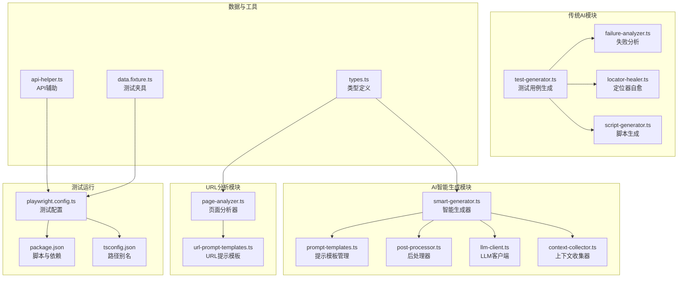
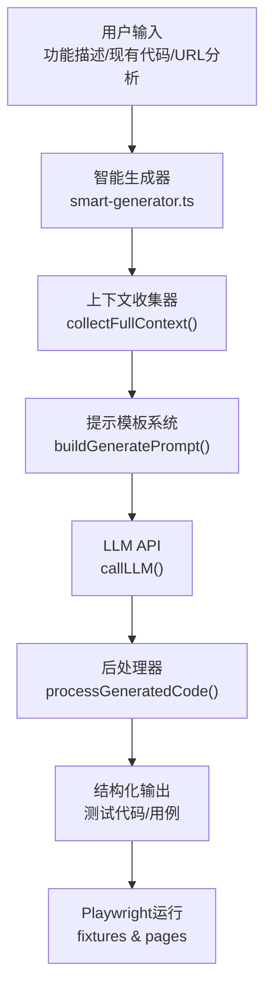
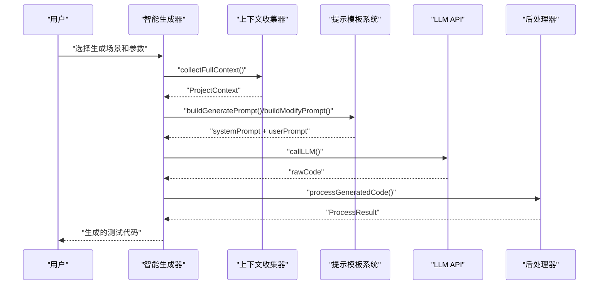
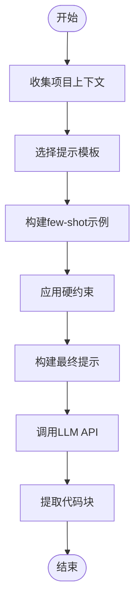
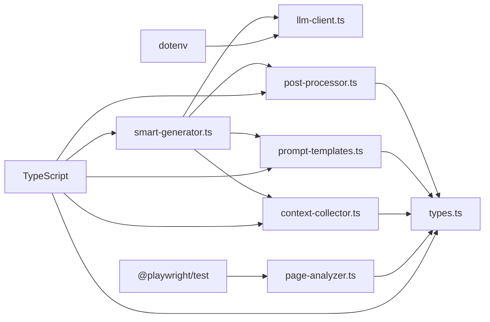

# AI测试用例生成器

<cite>
**本文档引用的文件**
- [e2e-tests/ai/smart-generator.ts](file://e2e-tests/ai/smart-generator.ts)
- [e2e-tests/ai/prompt-templates.ts](file://e2e-tests/ai/prompt-templates.ts)
- [e2e-tests/ai/post-processor.ts](file://e2e-tests/ai/post-processor.ts)
- [e2e-tests/ai/llm-client.ts](file://e2e-tests/ai/llm-client.ts)
- [e2e-tests/ai/context-collector.ts](file://e2e-tests/ai/context-collector.ts)
- [e2e-tests/ai/types.ts](file://e2e-tests/ai/types.ts)
- [e2e-tests/ai/url-prompt-templates.ts](file://e2e-tests/ai/url-prompt-templates.ts)
- [e2e-tests/ai/page-analyzer.ts](file://e2e-tests/ai/page-analyzer.ts)
- [e2e-tests/ai/test-generator.ts](file://e2e-tests/ai/test-generator.ts)
- [e2e-tests/ai/failure-analyzer.ts](file://e2e-tests/ai/failure-analyzer.ts)
- [e2e-tests/ai/locator-healer.ts](file://e2e-tests/ai/locator-healer.ts)
- [e2e-tests/ai/script-generator.ts](file://e2e-tests/ai/script-generator.ts)
- [e2e-tests/utils/api-helper.ts](file://e2e-tests/utils/api-helper.ts)
- [e2e-tests/fixtures/data.fixture.ts](file://e2e-tests/fixtures/data.fixture.ts)
- [e2e-tests/playwright.config.ts](file://e2e-tests/playwright.config.ts)
- [e2e-tests/package.json](file://e2e-tests/package.json)
- [e2e-tests/tsconfig.json](file://e2e-tests/tsconfig.json)
</cite>

## 更新摘要
**变更内容**
- 新增智能生成器模块，提供更复杂的提示模板系统
- 引入后处理器和代码校验机制，增强生成质量
- 支持多种测试场景：generate、modify、extend命令
- 增强URL分析和页面理解能力
- 重构测试用例生成流程，支持更多样化的测试场景

## 目录
1. [简介](#简介)
2. [项目结构](#项目结构)
3. [核心组件](#核心组件)
4. [架构总览](#架构总览)
5. [详细组件分析](#详细组件分析)
6. [依赖关系分析](#依赖关系分析)
7. [性能考虑](#性能考虑)
8. [故障排除指南](#故障排除指南)
9. [结论](#结论)
10. [附录](#附录)

## 简介
本项目是一个基于大语言模型（LLM）的端到端测试用例生成与自动化测试辅助系统，主要面向"医院体检报告管理系统"。经过重构后，系统现已支持更复杂的提示模板和后处理器，显著提升了AI生成测试用例的质量和多样性。

核心能力包括：
- **智能测试生成**：通过复杂的提示模板系统生成结构化的测试用例
- **多场景支持**：支持generate、modify、extend三种测试生成场景
- **代码质量保证**：内置后处理器和代码校验机制
- **项目上下文感知**：自动收集和分析项目结构、Page Object、Fixture等信息
- **URL场景分析**：支持任意网站的页面分析和测试生成
- **统一LLM集成**：通过llm-client模块提供稳定的API调用

系统通过统一的LLM配置（LLM_API_URL、LLM_API_KEY、LLM_MODEL）对接OpenAI兼容的聊天接口，采用严格的JSON格式约束确保输出稳定可靠。

## 项目结构
项目采用按功能域划分的目录组织方式，AI相关能力集中在e2e-tests/ai目录中，包含智能生成器、提示模板管理、后处理器、上下文收集器等多个核心模块。

**图表来源**
- [e2e-tests/ai/smart-generator.ts:1-272](file://e2e-tests/ai/smart-generator.ts#L1-L272)
- [e2e-tests/ai/prompt-templates.ts:1-192](file://e2e-tests/ai/prompt-templates.ts#L1-L192)
- [e2e-tests/ai/post-processor.ts:1-232](file://e2e-tests/ai/post-processor.ts#L1-L232)
- [e2e-tests/ai/llm-client.ts:1-120](file://e2e-tests/ai/llm-client.ts#L1-L120)
- [e2e-tests/ai/context-collector.ts:1-370](file://e2e-tests/ai/context-collector.ts#L1-L370)
- [e2e-tests/ai/page-analyzer.ts:1-415](file://e2e-tests/ai/page-analyzer.ts#L1-L415)
- [e2e-tests/ai/url-prompt-templates.ts:1-291](file://e2e-tests/ai/url-prompt-templates.ts#L1-L291)

**章节来源**
- [e2e-tests/playwright.config.ts:1-68](file://e2e-tests/playwright.config.ts#L1-L68)
- [e2e-tests/package.json:1-27](file://e2e-tests/package.json#L1-L27)
- [e2e-tests/tsconfig.json:1-25](file://e2e-tests/tsconfig.json#L1-L25)

## 核心组件
- **智能生成器**：统一的测试生成编排引擎，支持三种生成场景
- **提示模板系统**：复杂的提示模板管理，支持few-shot学习和约束控制
- **后处理器**：代码清理、校验和格式化，确保生成代码质量
- **LLM客户端**：统一的LLM API调用接口，支持重试和超时控制
- **上下文收集器**：自动分析项目结构，收集Page Object、Fixture等信息
- **URL分析器**：使用Playwright浏览器分析任意网站的页面结构
- **类型系统**：完整的TypeScript类型定义，确保类型安全

**章节来源**
- [e2e-tests/ai/smart-generator.ts:1-272](file://e2e-tests/ai/smart-generator.ts#L1-L272)
- [e2e-tests/ai/prompt-templates.ts:1-192](file://e2e-tests/ai/prompt-templates.ts#L1-L192)
- [e2e-tests/ai/post-processor.ts:1-232](file://e2e-tests/ai/post-processor.ts#L1-L232)
- [e2e-tests/ai/llm-client.ts:1-120](file://e2e-tests/ai/llm-client.ts#L1-L120)
- [e2e-tests/ai/context-collector.ts:1-370](file://e2e-tests/ai/context-collector.ts#L1-L370)
- [e2e-tests/ai/page-analyzer.ts:1-415](file://e2e-tests/ai/page-analyzer.ts#L1-L415)
- [e2e-tests/ai/types.ts:1-180](file://e2e-tests/ai/types.ts#L1-L180)

## 架构总览
系统整体工作流分为四个层次：
- **输入层**：用户提供的功能描述、现有测试代码、URL分析结果等
- **智能决策层**：复杂的提示模板系统和上下文收集器
- **执行层**：LLM API调用和后处理器
- **输出层**：结构化的测试用例、可执行的测试代码和质量保证

**图表来源**
- [e2e-tests/ai/smart-generator.ts:97-164](file://e2e-tests/ai/smart-generator.ts#L97-L164)
- [e2e-tests/ai/context-collector.ts:360-369](file://e2e-tests/ai/context-collector.ts#L360-L369)
- [e2e-tests/ai/prompt-templates.ts:102-132](file://e2e-tests/ai/prompt-templates.ts#L102-L132)
- [e2e-tests/ai/llm-client.ts:21-87](file://e2e-tests/ai/llm-client.ts#L21-L87)
- [e2e-tests/ai/post-processor.ts:8-45](file://e2e-tests/ai/post-processor.ts#L8-L45)

## 详细组件分析

### 智能生成器与多场景支持
智能生成器是重构后的核心模块，提供了三种不同的测试生成场景：

- **generate场景**：从零开始生成新的测试文件
- **modify场景**：修改现有的测试文件
- **extend场景**：在现有测试文件基础上扩展新的测试用例

**图表来源**
- [e2e-tests/ai/smart-generator.ts:97-164](file://e2e-tests/ai/smart-generator.ts#L97-L164)
- [e2e-tests/ai/context-collector.ts:360-369](file://e2e-tests/ai/context-collector.ts#L360-L369)
- [e2e-tests/ai/prompt-templates.ts:102-191](file://e2e-tests/ai/prompt-templates.ts#L102-L191)
- [e2e-tests/ai/post-processor.ts:8-45](file://e2e-tests/ai/post-processor.ts#L8-L45)

**章节来源**
- [e2e-tests/ai/smart-generator.ts:97-272](file://e2e-tests/ai/smart-generator.ts#L97-L272)

### 复杂提示模板系统
提示模板系统是重构的关键创新，提供了以下功能：

- **few-shot学习**：基于现有测试文件的示例学习
- **硬约束控制**：严格的代码风格和项目规范约束
- **场景特定模板**：针对不同测试场景的专门提示
- **项目上下文整合**：动态整合项目结构信息

**图表来源**
- [e2e-tests/ai/prompt-templates.ts:102-132](file://e2e-tests/ai/prompt-templates.ts#L102-L132)
- [e2e-tests/ai/context-collector.ts:360-369](file://e2e-tests/ai/context-collector.ts#L360-L369)

**章节来源**
- [e2e-tests/ai/prompt-templates.ts:1-192](file://e2e-tests/ai/prompt-templates.ts#L1-L192)

### 后处理器与代码质量保证
后处理器是重构的重要组成部分，提供了七层质量保证：

1. **Markdown标记清理**：移除代码围栏和说明文字
2. **导入路径修正**：自动修正相对路径和别名
3. **Fixture导入修复**：根据使用情况修正导入源
4. **Page Object引用校验**：验证PO类的有效性
5. **方法调用校验**：检查PO方法的正确性
6. **格式标准化**：添加AI生成标记和统一格式
7. **括号匹配检查**：确保代码结构完整性

**章节来源**
- [e2e-tests/ai/post-processor.ts:1-232](file://e2e-tests/ai/post-processor.ts#L1-L232)

### LLM客户端与统一API
LLM客户端提供了稳定的API调用接口，包含以下特性：

- **环境变量配置**：LLM_API_URL、LLM_API_KEY、LLM_MODEL
- **重试机制**：最多重试1次，首次失败后3秒延迟
- **超时控制**：180秒超时，防止长时间阻塞
- **JSON提取工具**：支持JSON对象和数组提取
- **代码块提取**：自动清理Markdown标记

**章节来源**
- [e2e-tests/ai/llm-client.ts:1-120](file://e2e-tests/ai/llm-client.ts#L1-L120)

### 上下文收集器与项目理解
上下文收集器能够自动分析项目结构，提供完整的项目上下文：

- **Page Object分析**：提取类名、定位器、方法签名和JSDoc
- **Fixture收集**：识别角色Fixture和数据Fixture
- **测试模式学习**：分析现有测试文件的模式和风格
- **数据Schema收集**：提取测试数据结构和示例
- **工具函数识别**：发现项目中的工具函数

**章节来源**
- [e2e-tests/ai/context-collector.ts:1-370](file://e2e-tests/ai/context-collector.ts#L1-L370)

### URL分析器与页面理解
URL分析器使用Playwright浏览器实际访问目标URL，提供精确的页面结构分析：

- **真实浏览器渲染**：支持SPA应用的完整渲染
- **元素提取**：自动识别表单、按钮、导航、表格等元素
- **选择器生成**：为每个元素生成Playwright友好的选择器
- **认证支持**：支持Cookie和localStorage注入
- **视频录制**：可选的页面录制功能

**章节来源**
- [e2e-tests/ai/page-analyzer.ts:1-415](file://e2e-tests/ai/page-analyzer.ts#L1-L415)

### 传统AI模块的演进
原有的AI模块经过重构，现在作为智能生成系统的补充：

- **测试用例生成器**：简化为基本的JSON数组提取
- **失败分析器**：支持更复杂的分析场景
- **定位器自愈器**：增强的DOM快照分析
- **脚本生成器**：与智能生成器协同工作

**章节来源**
- [e2e-tests/ai/test-generator.ts:1-61](file://e2e-tests/ai/test-generator.ts#L1-L61)
- [e2e-tests/ai/failure-analyzer.ts:1-112](file://e2e-tests/ai/failure-analyzer.ts#L1-L112)
- [e2e-tests/ai/locator-healer.ts:1-131](file://e2e-tests/ai/locator-healer.ts#L1-L131)
- [e2e-tests/ai/script-generator.ts:1-110](file://e2e-tests/ai/script-generator.ts#L1-L110)

### 类型系统与类型安全
完整的TypeScript类型系统确保了代码的类型安全：

- **Page Object类型**：结构化描述PO类的信息
- **Fixture类型**：角色Fixture和数据Fixture的详细信息
- **测试模式类型**：现有测试文件的模式信息
- **项目上下文类型**：聚合的项目信息
- **URL分析类型**：页面分析结果的结构化表示

**章节来源**
- [e2e-tests/ai/types.ts:1-180](file://e2e-tests/ai/types.ts#L1-L180)

## 依赖关系分析
重构后的系统具有更复杂的依赖关系：

- **运行时依赖**
  - Playwright测试框架与类型
  - dotenv用于加载环境变量
  - MySQL驱动（用于数据库相关场景）
  - TypeScript编译器和类型定义
- **智能生成器依赖**
  - 上下文收集器依赖整个项目结构
  - 提示模板系统依赖类型定义
  - 后处理器依赖上下文信息
- **URL分析依赖**
  - Playwright浏览器引擎
  - 项目中的utils和fixtures模块

**图表来源**
- [e2e-tests/package.json:17-25](file://e2e-tests/package.json#L17-L25)
- [e2e-tests/playwright.config.ts:1-68](file://e2e-tests/playwright.config.ts#L1-L68)
- [e2e-tests/tsconfig.json:1-25](file://e2e-tests/tsconfig.json#L1-L25)

**章节来源**
- [e2e-tests/package.json:17-25](file://e2e-tests/package.json#L17-L25)
- [e2e-tests/tsconfig.json:1-25](file://e2e-tests/tsconfig.json#L1-L25)

## 性能考虑
重构后的系统在性能方面有以下优化：

- **温度系数调优**
  - generate场景：temperature=0.3，平衡创造性和稳定性
  - modify/extend场景：temperature=0.3，保持一致性
  - URL分析：temperature=0，最大化准确性
- **上下文缓存**
  - 上下文收集结果可缓存，避免重复分析
  - 提示模板可预编译，减少运行时开销
- **并发优化**
  - LLM调用支持并发，但需注意API限制
  - 后处理器可并行处理多个文件
- **内存管理**
  - 大文件分析时注意内存使用
  - 及时释放Playwright浏览器资源

## 故障排除指南
重构后的系统提供了更完善的错误处理：

- **智能生成器错误**
  - 现象：generate/modify/extend命令失败
  - 处理：检查项目结构、LLM配置、文件路径
  - 参考路径：[命令执行错误处理:97-164](file://e2e-tests/ai/smart-generator.ts#L97-L164)
- **提示模板错误**
  - 现象：提示构建失败或约束不满足
  - 处理：检查上下文收集、模板配置
  - 参考路径：[提示模板构建:102-132](file://e2e-tests/ai/prompt-templates.ts#L102-L132)
- **后处理器错误**
  - 现象：代码校验失败或格式化错误
  - 处理：查看警告信息、检查生成代码
  - 参考路径：[后处理校验:8-45](file://e2e-tests/ai/post-processor.ts#L8-L45)
- **LLM调用错误**
  - 现象：API调用失败或超时
  - 处理：检查网络连接、API密钥、重试机制
  - 参考路径：[LLM调用重试:52-86](file://e2e-tests/ai/llm-client.ts#L52-L86)
- **URL分析错误**
  - 现象：页面分析失败或元素识别错误
  - 处理：检查浏览器配置、等待时间、认证信息
  - 参考路径：[URL分析配置:20-41](file://e2e-tests/ai/page-analyzer.ts#L20-L41)

**章节来源**
- [e2e-tests/ai/smart-generator.ts:97-272](file://e2e-tests/ai/smart-generator.ts#L97-L272)
- [e2e-tests/ai/prompt-templates.ts:102-191](file://e2e-tests/ai/prompt-templates.ts#L102-L191)
- [e2e-tests/ai/post-processor.ts:8-45](file://e2e-tests/ai/post-processor.ts#L8-L45)
- [e2e-tests/ai/llm-client.ts:52-86](file://e2e-tests/ai/llm-client.ts#L52-L86)
- [e2e-tests/ai/page-analyzer.ts:20-41](file://e2e-tests/ai/page-analyzer.ts#L20-L41)

## 结论
经过重构的AI测试用例生成器通过引入智能生成器、复杂提示模板系统和后处理器，显著提升了测试用例生成的质量和多样性。新系统不仅保持了原有功能的稳定性，还增加了对多种测试场景的支持，提供了更好的代码质量保证和用户体验。配合Playwright生态和API辅助工具，能够高效支撑端到端测试的生成与维护。

## 附录
- **配置参数说明**
  - LLM_API_URL：LLM服务基础URL（必须）
  - LLM_API_KEY：访问令牌（必须）
  - LLM_MODEL：模型名称（默认"gpt-4"）
  - API_BASE_URL：API服务基础URL（默认"http://localhost:8080/api"）
  - BASE_URL：前端应用基础URL（默认"http://localhost:8080"）
- **常用命令**
  - 生成新测试：npx playwright test --grep "generate"
  - 修改现有测试：npx playwright test --grep "modify"
  - 扩展现有测试：npx playwright test --grep "extend"
  - 冒烟测试：npm run test:smoke
  - 回归测试：npm run test:regression
  - 全量测试：npm run test:all
  - 生成HTML报告：npm run report:html
  - 生成Allure报告：npm run report:allure

**章节来源**
- [e2e-tests/playwright.config.ts:24-29](file://e2e-tests/playwright.config.ts#L24-L29)
- [e2e-tests/package.json:6-12](file://e2e-tests/package.json#L6-L12)