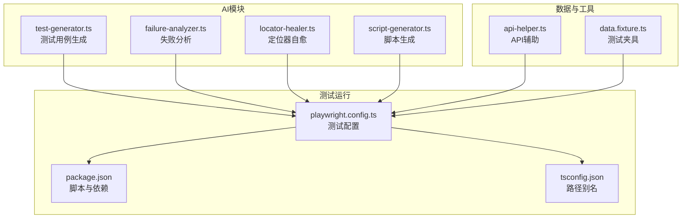
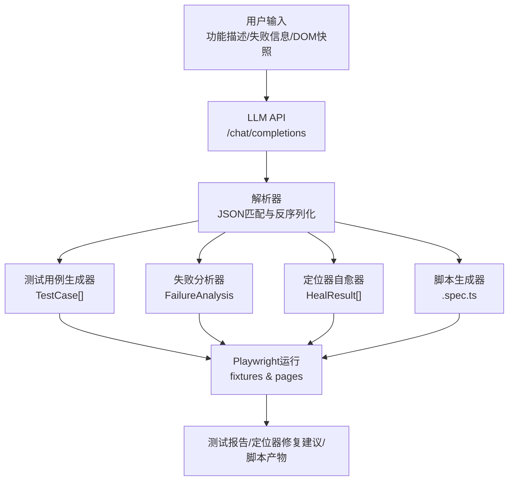
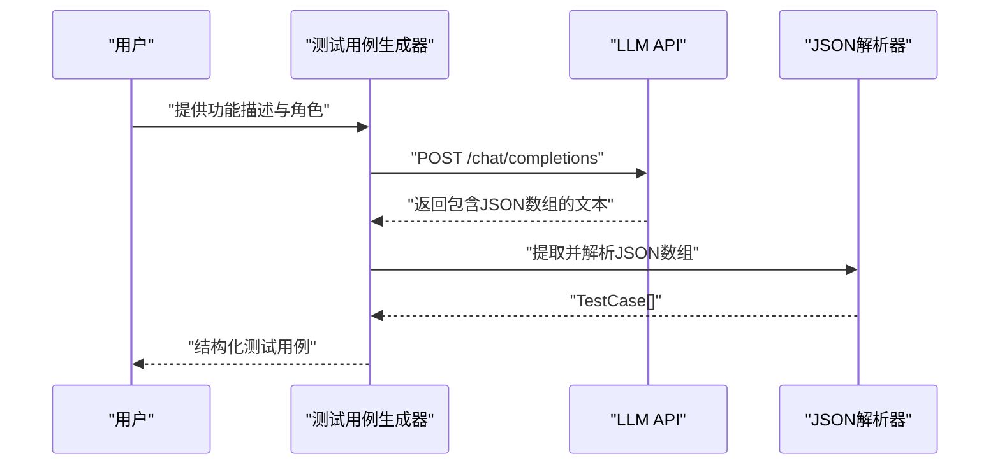
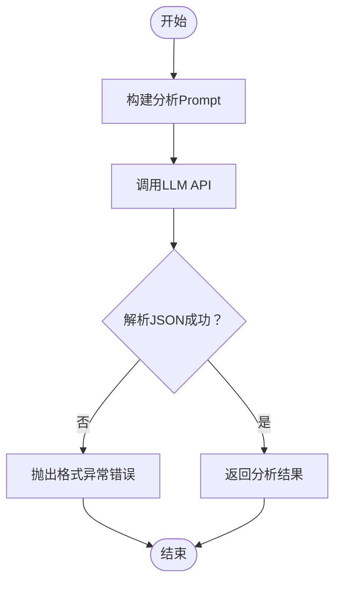
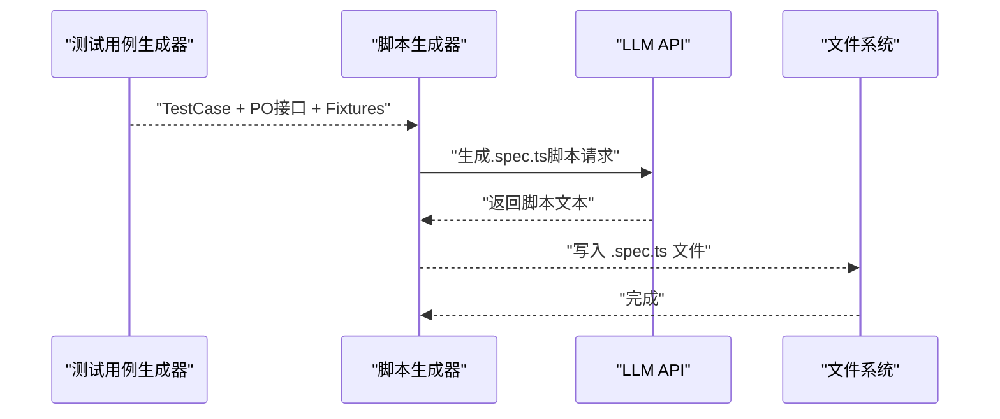
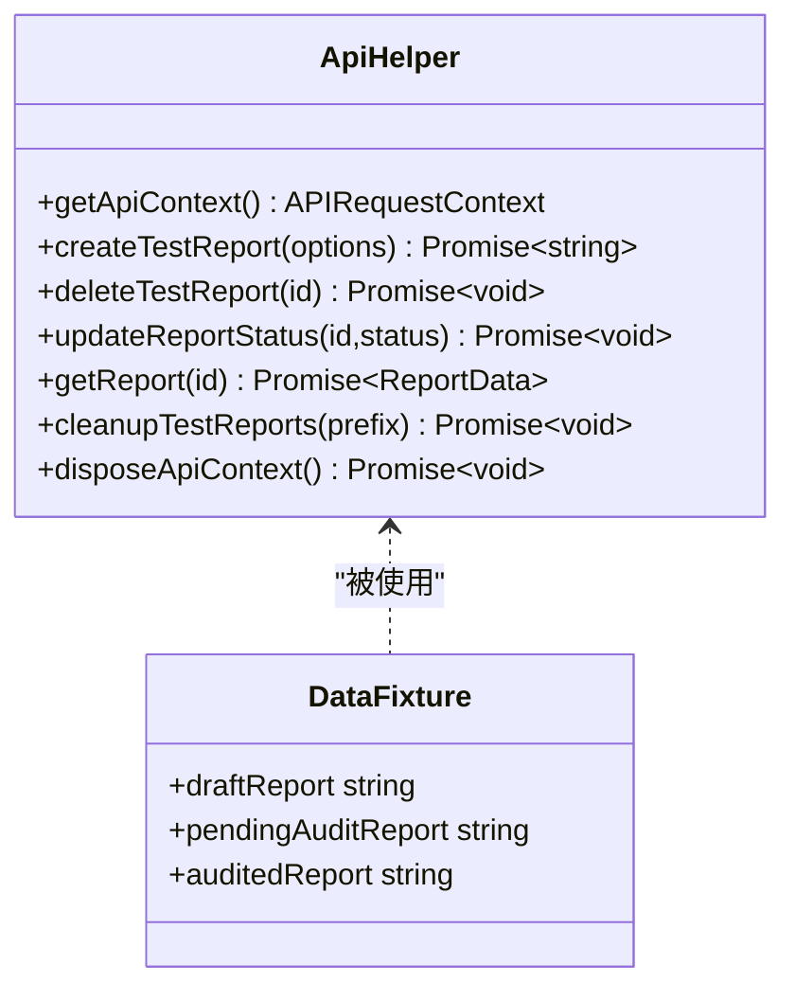
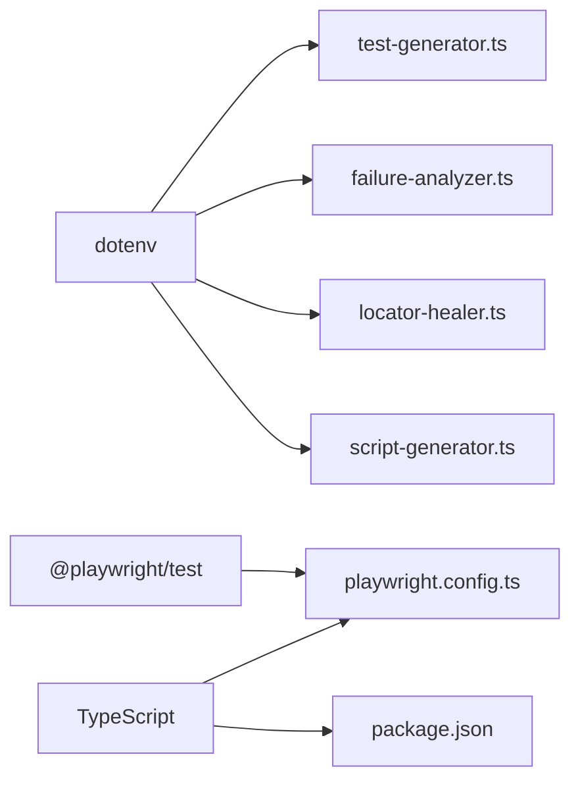

# AI测试用例生成器

<cite>
**本文档引用的文件**
- [e2e-tests/ai/test-generator.ts](file://e2e-tests/ai/test-generator.ts)
- [e2e-tests/ai/failure-analyzer.ts](file://e2e-tests/ai/failure-analyzer.ts)
- [e2e-tests/ai/locator-healer.ts](file://e2e-tests/ai/locator-healer.ts)
- [e2e-tests/ai/script-generator.ts](file://e2e-tests/ai/script-generator.ts)
- [e2e-tests/utils/api-helper.ts](file://e2e-tests/utils/api-helper.ts)
- [e2e-tests/fixtures/data.fixture.ts](file://e2e-tests/fixtures/data.fixture.ts)
- [e2e-tests/playwright.config.ts](file://e2e-tests/playwright.config.ts)
- [e2e-tests/package.json](file://e2e-tests/package.json)
- [e2e-tests/tsconfig.json](file://e2e-tests/tsconfig.json)
</cite>

## 目录
1. [简介](#简介)
2. [项目结构](#项目结构)
3. [核心组件](#核心组件)
4. [架构总览](#架构总览)
5. [详细组件分析](#详细组件分析)
6. [依赖关系分析](#依赖关系分析)
7. [性能考虑](#性能考虑)
8. [故障排除指南](#故障排除指南)
9. [结论](#结论)
10. [附录](#附录)

## 简介
本项目是一个基于大语言模型（LLM）的端到端测试用例生成与自动化测试辅助系统，主要面向“医院体检报告管理系统”。其核心能力包括：
- 通过LLM生成结构化的测试用例
- 将测试用例转换为可执行的Playwright测试脚本
- 对测试失败进行根因分析与定位器自愈
- 提供API辅助工具以准备测试数据

系统通过统一的LLM配置（LLM_API_URL、LLM_API_KEY、LLM_MODEL）对接OpenAI兼容的聊天接口，采用严格的JSON格式约束确保输出稳定可靠。

## 项目结构
项目采用按功能域划分的目录组织方式，AI相关能力集中在e2e-tests/ai目录中，测试运行配置位于playwright.config.ts，测试数据与工具位于fixtures与utils目录。

图表来源
- [e2e-tests/ai/test-generator.ts:1-107](file://e2e-tests/ai/test-generator.ts#L1-L107)
- [e2e-tests/ai/failure-analyzer.ts:1-112](file://e2e-tests/ai/failure-analyzer.ts#L1-L112)
- [e2e-tests/ai/locator-healer.ts:1-131](file://e2e-tests/ai/locator-healer.ts#L1-L131)
- [e2e-tests/ai/script-generator.ts:1-110](file://e2e-tests/ai/script-generator.ts#L1-L110)
- [e2e-tests/playwright.config.ts:1-68](file://e2e-tests/playwright.config.ts#L1-L68)
- [e2e-tests/package.json:1-27](file://e2e-tests/package.json#L1-L27)
- [e2e-tests/tsconfig.json:1-25](file://e2e-tests/tsconfig.json#L1-L25)
- [e2e-tests/utils/api-helper.ts:1-172](file://e2e-tests/utils/api-helper.ts#L1-L172)
- [e2e-tests/fixtures/data.fixture.ts:1-57](file://e2e-tests/fixtures/data.fixture.ts#L1-L57)

章节来源
- [e2e-tests/playwright.config.ts:1-68](file://e2e-tests/playwright.config.ts#L1-L68)
- [e2e-tests/package.json:1-27](file://e2e-tests/package.json#L1-L27)
- [e2e-tests/tsconfig.json:1-25](file://e2e-tests/tsconfig.json#L1-L25)

## 核心组件
- LLM集成层：统一读取LLM_API_URL、LLM_API_KEY、LLM_MODEL，构造OpenAI兼容的/chat/completions请求，设置Authorization头与temperature参数。
- 测试用例生成器：接收功能描述与角色信息，生成结构化TestCase数组。
- 失败分析器：接收测试失败信息与上下文，输出根因分类、描述、修复建议及可选的修复代码。
- 定位器自愈器：在定位器失效时，基于页面DOM快照生成新的定位器建议。
- 脚本生成器：将测试用例与Page Object接口结合，生成可直接运行的Playwright .spec.ts脚本。
- API辅助工具：提供API上下文管理、测试报告创建/删除/状态更新、批量清理等能力。
- 测试夹具：封装常用前置数据（草稿/待审核/已审核报告），并在用例结束后自动清理。

章节来源
- [e2e-tests/ai/test-generator.ts:1-107](file://e2e-tests/ai/test-generator.ts#L1-L107)
- [e2e-tests/ai/failure-analyzer.ts:1-112](file://e2e-tests/ai/failure-analyzer.ts#L1-L112)
- [e2e-tests/ai/locator-healer.ts:1-131](file://e2e-tests/ai/locator-healer.ts#L1-L131)
- [e2e-tests/ai/script-generator.ts:1-110](file://e2e-tests/ai/script-generator.ts#L1-L110)
- [e2e-tests/utils/api-helper.ts:1-172](file://e2e-tests/utils/api-helper.ts#L1-L172)
- [e2e-tests/fixtures/data.fixture.ts:1-57](file://e2e-tests/fixtures/data.fixture.ts#L1-L57)

## 架构总览
系统整体工作流分为三层：
- 输入层：用户提供的功能描述、测试失败信息、页面DOM片段等。
- 智能决策层：LLM根据system prompt与user prompt生成结构化输出。
- 执行层：将LLM输出转换为测试用例、定位器修复建议或可执行脚本，并与Playwright生态集成。

图表来源
- [e2e-tests/ai/test-generator.ts:67-106](file://e2e-tests/ai/test-generator.ts#L67-L106)
- [e2e-tests/ai/failure-analyzer.ts:69-111](file://e2e-tests/ai/failure-analyzer.ts#L69-L111)
- [e2e-tests/ai/locator-healer.ts:62-103](file://e2e-tests/ai/locator-healer.ts#L62-L103)
- [e2e-tests/ai/script-generator.ts:63-109](file://e2e-tests/ai/script-generator.ts#L63-L109)

## 详细组件分析

### LLM集成配置与调用
- 环境变量
  - LLM_API_URL：LLM服务的基础URL（必须）
  - LLM_API_KEY：访问令牌（必须）
  - LLM_MODEL：模型名称，默认"gpt-4"
- 调用方式
  - 方法：POST /chat/completions
  - 头部：Content-Type: application/json, Authorization: Bearer {LLM_API_KEY}
  - Body：model, messages, temperature
  - 错误处理：当LLM_API_URL或LLM_API_KEY未配置时抛出错误；当HTTP响应非ok时抛出错误
- 代码示例路径
  - [LLM调用实现:12-41](file://e2e-tests/ai/test-generator.ts#L12-L41)
  - [失败分析器中的LLM调用:12-41](file://e2e-tests/ai/failure-analyzer.ts#L12-L41)
  - [定位器自愈器中的LLM调用:13-45](file://e2e-tests/ai/locator-healer.ts#L13-L45)
  - [脚本生成器中的LLM调用:13-42](file://e2e-tests/ai/script-generator.ts#L13-L42)

章节来源
- [e2e-tests/ai/test-generator.ts:5-41](file://e2e-tests/ai/test-generator.ts#L5-L41)
- [e2e-tests/ai/failure-analyzer.ts:5-41](file://e2e-tests/ai/failure-analyzer.ts#L5-L41)
- [e2e-tests/ai/locator-healer.ts:6-45](file://e2e-tests/ai/locator-healer.ts#L6-L45)
- [e2e-tests/ai/script-generator.ts:6-42](file://e2e-tests/ai/script-generator.ts#L6-L42)

### 测试用例生成工作流程
- 输入：功能名称、功能描述、系统角色列表
- 输出：TestCase数组（包含id、name、precondition、steps、expected、priority、category）
- 工作流程
  1) 构造system prompt与user prompt
  2) 调用LLM API
  3) 从响应中提取JSON数组并解析为TestCase[]
  4) 异常处理：若未匹配到JSON数组则抛出错误
- 代码示例路径
  - [测试用例生成主函数:67-106](file://e2e-tests/ai/test-generator.ts#L67-L106)

图表来源
- [e2e-tests/ai/test-generator.ts:67-106](file://e2e-tests/ai/test-generator.ts#L67-L106)

章节来源
- [e2e-tests/ai/test-generator.ts:67-106](file://e2e-tests/ai/test-generator.ts#L67-L106)

### JSON格式规范与数据模型
- TestCase接口
  - 字段：id、name、precondition、steps（字符串数组）、expected、priority（'P0'|'P1'|'P2'）、category（'正向'|'逆向'|'边界'|'权限'）
  - 用途：承载结构化测试用例
- FailureAnalysis接口
  - 字段：category（'locator'|'logic'|'env'|'data'）、description、suggestion、fixCode（可选）
  - 用途：承载失败根因分析结果
- HealResult接口
  - 字段：originalLocator、newLocator、confidence、strategy
  - 用途：承载定位器修复建议
- GenerateTestCasesInput接口
  - 字段：featureName、description、roles
  - 用途：测试用例生成输入
- AnalyzeFailureInput接口
  - 字段：testName、errorMessage、screenshot（可选）、recentChanges（可选）
  - 用途：失败分析输入
- GenerateScriptInput接口
  - 字段：testCase（TestCase）、pageObjects（POInterface[]）、fixtures（字符串数组）
  - 用途：脚本生成输入
- POInterface接口
  - 字段：className、methods（字符串数组）
  - 用途：Page Object接口描述

章节来源
- [e2e-tests/ai/test-generator.ts:45-59](file://e2e-tests/ai/test-generator.ts#L45-L59)
- [e2e-tests/ai/failure-analyzer.ts:45-61](file://e2e-tests/ai/failure-analyzer.ts#L45-L61)
- [e2e-tests/ai/locator-healer.ts:49-54](file://e2e-tests/ai/locator-healer.ts#L49-L54)
- [e2e-tests/ai/script-generator.ts:46-55](file://e2e-tests/ai/script-generator.ts#L46-L55)

### 失败分析与定位器自愈
- 失败分析
  - 输入：测试名称、错误信息、截图（可选）、最近变更（可选）
  - 输出：FailureAnalysis对象
  - 实现要点：通过JSON模式约束确保输出结构稳定
- 定位器自愈
  - 输入：Page实例、失效定位器、元素描述
  - 输出：HealResult对象（包含新定位器、置信度、修复策略）
  - 实现要点：截取页面DOM片段作为上下文，优先使用data-testid，其次role+name，最后文本/CSS选择器

图表来源
- [e2e-tests/ai/failure-analyzer.ts:69-111](file://e2e-tests/ai/failure-analyzer.ts#L69-L111)
- [e2e-tests/ai/locator-healer.ts:62-103](file://e2e-tests/ai/locator-healer.ts#L62-L103)

章节来源
- [e2e-tests/ai/failure-analyzer.ts:69-111](file://e2e-tests/ai/failure-analyzer.ts#L69-L111)
- [e2e-tests/ai/locator-healer.ts:62-103](file://e2e-tests/ai/locator-healer.ts#L62-L103)

### 脚本生成器与Playwright集成
- 输入：TestCase、Page Object接口描述、可用Fixture列表
- 输出：完整的Playwright .spec.ts脚本内容
- 实现要点：严格遵循Playwright组织方式（test.describe、fixture、beforeEach、expect断言），并提供API工具函数说明

图表来源
- [e2e-tests/ai/script-generator.ts:63-109](file://e2e-tests/ai/script-generator.ts#L63-L109)

章节来源
- [e2e-tests/ai/script-generator.ts:63-109](file://e2e-tests/ai/script-generator.ts#L63-L109)

### API辅助工具与测试夹具
- API辅助工具
  - 单例API上下文管理（自动登录并注入Authorization头）
  - 提供创建/删除/状态更新/查询报告等方法
  - 支持批量清理测试数据
- 测试夹具
  - 自动创建草稿/待审核/已审核报告
  - 在用例结束后自动清理，避免脏数据

图表来源
- [e2e-tests/utils/api-helper.ts:45-171](file://e2e-tests/utils/api-helper.ts#L45-L171)
- [e2e-tests/fixtures/data.fixture.ts:13-54](file://e2e-tests/fixtures/data.fixture.ts#L13-L54)

章节来源
- [e2e-tests/utils/api-helper.ts:45-171](file://e2e-tests/utils/api-helper.ts#L45-L171)
- [e2e-tests/fixtures/data.fixture.ts:13-54](file://e2e-tests/fixtures/data.fixture.ts#L13-L54)

## 依赖关系分析
- 运行时依赖
  - Playwright测试框架与类型
  - dotenv用于加载环境变量
  - MySQL驱动（用于数据库相关场景）
- 脚本与引擎
  - Node >= 18
  - TypeScript编译与路径别名配置
- 项目内依赖
  - AI模块之间相互独立，均依赖dotenv加载LLM配置
  - 测试运行依赖playwright.config.ts中的项目配置与环境变量

图表来源
- [e2e-tests/package.json:17-25](file://e2e-tests/package.json#L17-L25)
- [e2e-tests/playwright.config.ts:1-68](file://e2e-tests/playwright.config.ts#L1-L68)
- [e2e-tests/tsconfig.json:1-25](file://e2e-tests/tsconfig.json#L1-L25)

章节来源
- [e2e-tests/package.json:17-25](file://e2e-tests/package.json#L17-L25)
- [e2e-tests/tsconfig.json:1-25](file://e2e-tests/tsconfig.json#L1-L25)

## 性能考虑
- 温度系数调优
  - 测试用例生成：temperature=0.3，提升确定性
  - 失败分析：temperature=0.3，保持稳定输出
  - 定位器自愈：temperature=0.1，最大化准确性
  - 脚本生成：temperature=0.2，平衡创造性与稳定性
- 网络与并发
  - LLM调用为同步阻塞操作，建议在CI中合理配置workers与retries
  - API上下文复用（单例）减少重复登录开销
- 输出解析
  - 使用正则匹配JSON片段，避免全量解析带来的不确定性
- 缓存与重试
  - 可在上层增加LLM调用缓存与指数退避重试策略（建议）

## 故障排除指南
- LLM配置缺失
  - 现象：抛出“LLM_API_URL 和 LLM_API_KEY 未配置”错误
  - 处理：检查.env文件或CI环境变量是否正确设置
  - 参考路径：[LLM配置检查:13-15](file://e2e-tests/ai/test-generator.ts#L13-L15)
- LLM调用失败
  - 现象：HTTP非ok响应，抛出包含状态码与状态文本的错误
  - 处理：检查服务可用性、网络连通性、API密钥有效性
  - 参考路径：[HTTP错误处理:35-37](file://e2e-tests/ai/test-generator.ts#L35-L37)
- 输出格式异常
  - 现象：无法匹配到JSON片段，抛出“AI返回格式异常，无法解析...”错误
  - 处理：调整prompt约束、提高temperature、确认模型支持JSON输出
  - 参考路径：[JSON解析与异常:100-103](file://e2e-tests/ai/test-generator.ts#L100-L103)
- 定位器修复失败
  - 现象：healLocator返回strategy包含“修复失败: ...”
  - 处理：检查DOM快照长度、元素描述清晰度、定位器复杂度
  - 参考路径：[批量修复失败处理:119-126](file://e2e-tests/ai/locator-healer.ts#L119-L126)
- API上下文问题
  - 现象：鉴权失败或请求超时
  - 处理：确认API_BASE_URL、管理员凭据、网络可达性
  - 参考路径：[API上下文与登录:45-77](file://e2e-tests/utils/api-helper.ts#L45-L77)

章节来源
- [e2e-tests/ai/test-generator.ts:13-15](file://e2e-tests/ai/test-generator.ts#L13-L15)
- [e2e-tests/ai/test-generator.ts:35-37](file://e2e-tests/ai/test-generator.ts#L35-L37)
- [e2e-tests/ai/test-generator.ts:100-103](file://e2e-tests/ai/test-generator.ts#L100-L103)
- [e2e-tests/ai/locator-healer.ts:119-126](file://e2e-tests/ai/locator-healer.ts#L119-L126)
- [e2e-tests/utils/api-helper.ts:45-77](file://e2e-tests/utils/api-helper.ts#L45-L77)

## 结论
本项目通过标准化的LLM集成与严格的JSON输出约束，实现了从功能描述到可执行测试脚本的自动化闭环。AI模块具备良好的扩展性，可进一步引入缓存、重试与监控机制以提升稳定性与可观测性。配合Playwright生态与API辅助工具，能够高效支撑端到端测试的生成与维护。

## 附录
- 配置参数说明
  - LLM_API_URL：LLM服务基础URL（必须）
  - LLM_API_KEY：访问令牌（必须）
  - LLM_MODEL：模型名称（默认"gpt-4"）
  - API_BASE_URL：API服务基础URL（默认"http://localhost:8080/api"）
  - BASE_URL：前端应用基础URL（默认"http://localhost:8080"）
- 常用命令
  - 冒烟测试：npm run test:smoke
  - 回归测试：npm run test:regression
  - 全量测试：npm run test:all
  - 生成HTML报告：npm run report:html
  - 生成Allure报告：npm run report:allure

章节来源
- [e2e-tests/playwright.config.ts:24-29](file://e2e-tests/playwright.config.ts#L24-L29)
- [e2e-tests/package.json:6-12](file://e2e-tests/package.json#L6-L12)