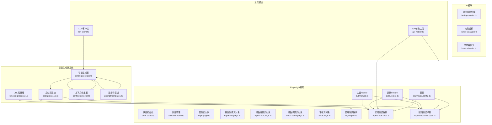
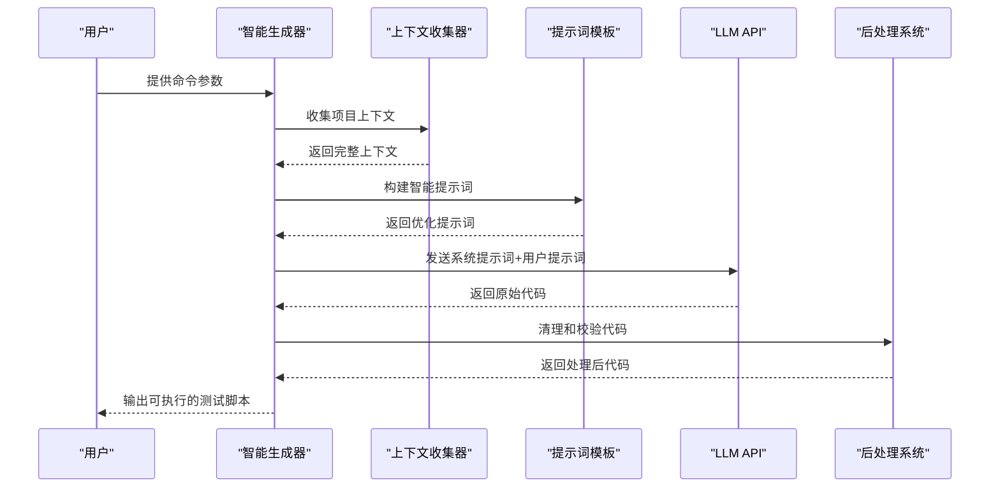
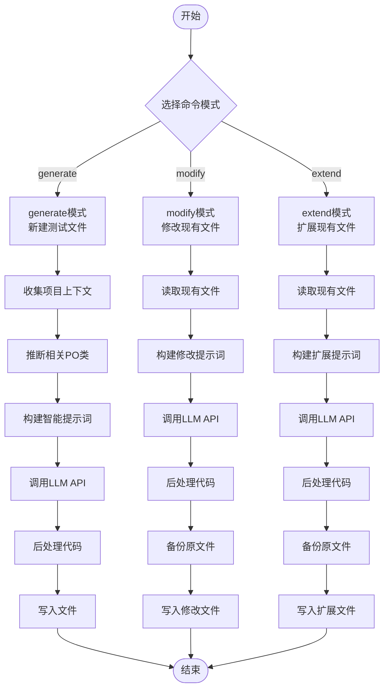
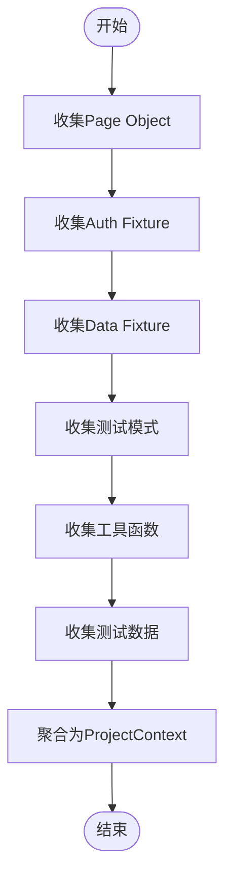
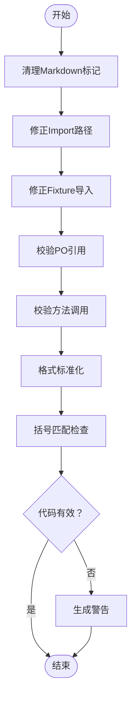
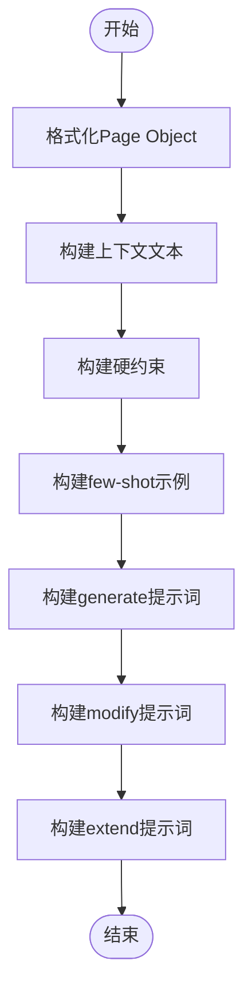
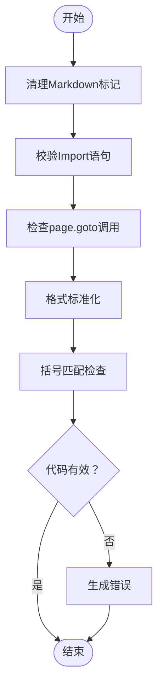
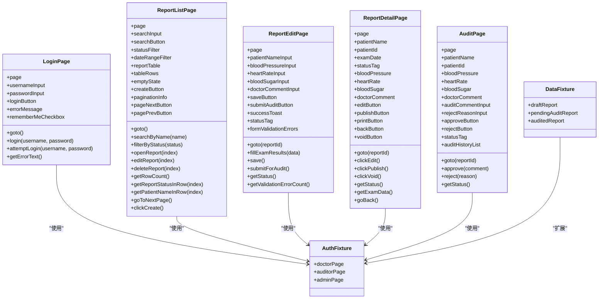
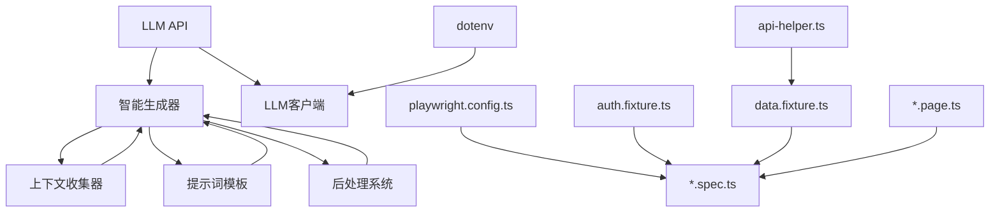

# AI测试脚本生成器

<cite>
**本文档引用的文件**
- [smart-generator.ts](file://e2e-tests/ai/smart-generator.ts)
- [post-processor.ts](file://e2e-tests/ai/post-processor.ts)
- [context-collector.ts](file://e2e-tests/ai/context-collector.ts)
- [prompt-templates.ts](file://e2e-tests/ai/prompt-templates.ts)
- [url-post-processor.ts](file://e2e-tests/ai/url-post-processor.ts)
- [types.ts](file://e2e-tests/ai/types.ts)
- [llm-client.ts](file://e2e-tests/ai/llm-client.ts)
- [test-generator.ts](file://e2e-tests/ai/test-generator.ts)
- [script-generator.ts](file://e2e-tests/ai/script-generator.ts)
- [failure-analyzer.ts](file://e2e-tests/ai/failure-analyzer.ts)
- [locator-healer.ts](file://e2e-tests/ai/locator-healer.ts)
- [playwright.config.ts](file://e2e-tests/playwright.config.ts)
- [auth.fixture.ts](file://e2e-tests/fixtures/auth.fixture.ts)
- [data.fixture.ts](file://e2e-tests/fixtures/data.fixture.ts)
- [auth.setup.ts](file://e2e-tests/fixtures/auth.setup.ts)
- [auth.teardown.ts](file://e2e-tests/fixtures/auth.teardown.ts)
- [login.page.ts](file://e2e-tests/pages/login.page.ts)
- [report-list.page.ts](file://e2e-tests/pages/report-list.page.ts)
- [report-edit.page.ts](file://e2e-tests/pages/report-edit.page.ts)
- [report-detail.page.ts](file://e2e-tests/pages/report-detail.page.ts)
- [audit.page.ts](file://e2e-tests/pages/audit.page.ts)
- [api-helper.ts](file://e2e-tests/utils/api-helper.ts)
- [login.spec.ts](file://e2e-tests/tests/smoke/login.spec.ts)
- [report-edit.spec.ts](file://e2e-tests/tests/smoke/report-edit.spec.ts)
- [report-workflow.spec.ts](file://e2e-tests/tests/regression/report-workflow.spec.ts)
- [package.json](file://e2e-tests/package.json)
</cite>

## 更新摘要
**变更内容**
- 新增智能生成器引擎，支持多命令模式（generate、modify、extend）
- 引入完整的项目上下文收集系统，自动分析Page Object、Fixture和工具函数
- 实现强大的代码后处理器，提供语法校验、导入修复和代码质量保证
- 增强提示词模板系统，支持few-shot学习和硬约束控制
- 新增URL分析专用后处理器，针对URL场景生成测试脚本
- 优化LLM客户端，支持重试机制和格式提取工具

## 目录
1. [简介](#简介)
2. [项目结构](#项目结构)
3. [核心组件](#核心组件)
4. [架构总览](#架构总览)
5. [详细组件分析](#详细组件分析)
6. [依赖关系分析](#依赖关系分析)
7. [性能考虑](#性能考虑)
8. [故障排查指南](#故障排查指南)
9. [结论](#结论)
10. [附录](#附录)

## 简介
本项目是一个基于AI的端到端测试脚本生成器，现已升级为智能测试生成系统，能够将自然语言描述的测试用例自动转换为可执行的Playwright TypeScript测试脚本。系统包含以下增强能力：
- **智能生成器引擎**：支持generate、modify、extend三种命令模式，提供完整的测试生命周期管理
- **项目上下文收集**：自动分析项目结构，收集Page Object、Fixture、工具函数和测试模式
- **智能后处理系统**：提供代码清理、导入修复、语法校验和质量保证
- **增强的提示词模板**：支持few-shot学习、硬约束控制和风格参考
- **多场景适配**：支持普通测试生成和URL分析两种模式
- **失败分析与定位器修复**：继续提供智能的失败分析和定位器修复能力

## 项目结构
整体采用"智能生成器 + 上下文收集 + 后处理系统"的分层设计：
- **智能生成器**：核心编排引擎，负责命令分发、上下文收集和流程控制
- **上下文收集器**：自动分析项目结构，收集所有可用资源
- **后处理系统**：提供代码质量保证和格式标准化
- **提示词模板**：管理不同场景的提示词模板和约束
- **Playwright测试框架**：包含页面对象、Fixture、测试脚本、配置文件
- **工具模块**：API辅助工具，用于准备测试数据和清理环境

**图表来源**
- [smart-generator.ts:1-272](file://e2e-tests/ai/smart-generator.ts#L1-L272)
- [post-processor.ts:1-232](file://e2e-tests/ai/post-processor.ts#L1-L232)
- [url-post-processor.ts:1-137](file://e2e-tests/ai/url-post-processor.ts#L1-L137)
- [context-collector.ts:1-370](file://e2e-tests/ai/context-collector.ts#L1-L370)
- [prompt-templates.ts:1-192](file://e2e-tests/ai/prompt-templates.ts#L1-L192)
- [llm-client.ts:1-120](file://e2e-tests/ai/llm-client.ts#L1-L120)

**章节来源**
- [playwright.config.ts:1-68](file://e2e-tests/playwright.config.ts#L1-L68)
- [package.json:1-27](file://e2e-tests/package.json#L1-L27)

## 核心组件
- **智能生成器引擎**：提供generate、modify、extend三种命令模式，自动收集项目上下文，调用LLM生成代码并通过后处理系统进行质量保证。
- **上下文收集器**：自动分析项目结构，收集Page Object类、Fixture、工具函数和测试模式，为生成器提供完整的项目信息。
- **后处理系统**：对LLM生成的代码进行清理、导入修复、语法校验和格式标准化，确保生成的代码质量。
- **提示词模板系统**：管理不同场景的提示词模板，支持few-shot学习、硬约束控制和风格参考。
- **智能后处理器**：针对URL分析场景提供专门的代码处理和校验机制。
- **LLM客户端**：提供统一的LLM API调用接口，支持重试机制和格式提取工具。

**章节来源**
- [smart-generator.ts:97-164](file://e2e-tests/ai/smart-generator.ts#L97-L164)
- [context-collector.ts:360-370](file://e2e-tests/ai/context-collector.ts#L360-L370)
- [post-processor.ts:8-45](file://e2e-tests/ai/post-processor.ts#L8-L45)
- [prompt-templates.ts:102-132](file://e2e-tests/ai/prompt-templates.ts#L102-L132)
- [url-post-processor.ts:9-38](file://e2e-tests/ai/url-post-processor.ts#L9-L38)
- [llm-client.ts:21-87](file://e2e-tests/ai/llm-client.ts#L21-L87)

## 架构总览
智能生成器通过LLM API与Playwright测试框架解耦，遵循以下增强工作流：
- **输入**：测试用例描述、Page Object接口、Fixture清单、工具函数、项目上下文
- **处理**：自动收集项目上下文 → 构建智能提示词 → 调用LLM API → 后处理代码 → 生成最终测试脚本
- **输出**：可直接运行的测试脚本，包含质量保证和格式标准化

**图表来源**
- [smart-generator.ts:97-164](file://e2e-tests/ai/smart-generator.ts#L97-L164)
- [context-collector.ts:360-370](file://e2e-tests/ai/context-collector.ts#L360-L370)
- [prompt-templates.ts:102-132](file://e2e-tests/ai/prompt-templates.ts#L102-L132)
- [post-processor.ts:8-45](file://e2e-tests/ai/post-processor.ts#L8-L45)

## 详细组件分析

### 智能生成器引擎
- **功能**：提供generate、modify、extend三种命令模式，自动收集项目上下文，调用LLM生成代码并通过后处理系统进行质量保证。
- **关键点**：
  - **命令模式**：generate（新建）、modify（修改）、extend（扩展）三种模式，每种模式有不同的处理逻辑
  - **上下文收集**：自动分析项目结构，收集Page Object、Fixture、工具函数和测试模式
  - **智能推断**：根据功能描述推断相关的Page Object类，支持关键词映射
  - **文件生成**：自动生成合适的文件名，支持smoke和regression两种测试类型
  - **质量保证**：集成后处理系统，确保生成代码的质量和可执行性

**图表来源**
- [smart-generator.ts:97-164](file://e2e-tests/ai/smart-generator.ts#L97-L164)
- [smart-generator.ts:169-216](file://e2e-tests/ai/smart-generator.ts#L169-L216)
- [smart-generator.ts:221-271](file://e2e-tests/ai/smart-generator.ts#L221-L271)

**章节来源**
- [smart-generator.ts:97-164](file://e2e-tests/ai/smart-generator.ts#L97-L164)
- [smart-generator.ts:169-216](file://e2e-tests/ai/smart-generator.ts#L169-L216)
- [smart-generator.ts:221-271](file://e2e-tests/ai/smart-generator.ts#L221-L271)

### 上下文收集器
- **功能**：自动分析项目结构，收集Page Object类、Fixture、工具函数和测试模式，为生成器提供完整的项目信息。
- **关键点**：
  - **Page Object收集**：解析.ts文件，提取类名、定位器和方法信息
  - **Fixture收集**：分析auth.fixture和data.fixture，提取可用的Fixture信息
  - **测试模式收集**：分析现有测试文件，提取导入、Fixture使用和Page Object使用模式
  - **工具函数收集**：解析utils目录下的工具函数，提取签名和描述
  - **数据Schema收集**：分析data目录下的JSON文件，提取测试数据结构

**图表来源**
- [context-collector.ts:18-84](file://e2e-tests/ai/context-collector.ts#L18-L84)
- [context-collector.ts:89-133](file://e2e-tests/ai/context-collector.ts#L89-L133)
- [context-collector.ts:138-187](file://e2e-tests/ai/context-collector.ts#L138-L187)
- [context-collector.ts:192-252](file://e2e-tests/ai/context-collector.ts#L192-L252)
- [context-collector.ts:320-355](file://e2e-tests/ai/context-collector.ts#L320-L355)

**章节来源**
- [context-collector.ts:18-84](file://e2e-tests/ai/context-collector.ts#L18-L84)
- [context-collector.ts:89-133](file://e2e-tests/ai/context-collector.ts#L89-L133)
- [context-collector.ts:138-187](file://e2e-tests/ai/context-collector.ts#L138-L187)
- [context-collector.ts:192-252](file://e2e-tests/ai/context-collector.ts#L192-L252)
- [context-collector.ts:320-355](file://e2e-tests/ai/context-collector.ts#L320-L355)

### 后处理系统
- **功能**：对LLM生成的代码进行清理、导入修复、语法校验和格式标准化，确保生成的代码质量。
- **关键点**：
  - **代码清理**：移除Markdown标记、修正导入路径、修复Fixture导入
  - **语法校验**：检查括号匹配、验证Page Object引用和方法调用
  - **格式标准化**：添加AI生成标记、确保文件格式正确
  - **智能修复**：自动修复常见的导入错误和路径问题

**图表来源**
- [post-processor.ts:8-45](file://e2e-tests/ai/post-processor.ts#L8-L45)
- [post-processor.ts:48-69](file://e2e-tests/ai/post-processor.ts#L48-L69)
- [post-processor.ts:74-108](file://e2e-tests/ai/post-processor.ts#L74-L108)
- [post-processor.ts:113-128](file://e2e-tests/ai/post-processor.ts#L113-L128)
- [post-processor.ts:133-149](file://e2e-tests/ai/post-processor.ts#L133-L149)
- [post-processor.ts:154-184](file://e2e-tests/ai/post-processor.ts#L154-L184)
- [post-processor.ts:189-204](file://e2e-tests/ai/post-processor.ts#L189-L204)
- [post-processor.ts:209-231](file://e2e-tests/ai/post-processor.ts#L209-L231)

**章节来源**
- [post-processor.ts:8-45](file://e2e-tests/ai/post-processor.ts#L8-L45)
- [post-processor.ts:48-69](file://e2e-tests/ai/post-processor.ts#L48-L69)
- [post-processor.ts:74-108](file://e2e-tests/ai/post-processor.ts#L74-L108)
- [post-processor.ts:113-128](file://e2e-tests/ai/post-processor.ts#L113-L128)
- [post-processor.ts:133-149](file://e2e-tests/ai/post-processor.ts#L133-L149)
- [post-processor.ts:154-184](file://e2e-tests/ai/post-processor.ts#L154-L184)
- [post-processor.ts:189-204](file://e2e-tests/ai/post-processor.ts#L189-L204)
- [post-processor.ts:209-231](file://e2e-tests/ai/post-processor.ts#L209-L231)

### 提示词模板系统
- **功能**：管理不同场景的提示词模板，支持few-shot学习、硬约束控制和风格参考。
- **关键点**：
  - **通用System Prompt**：定义AI助手的角色和输出要求
  - **Page Object格式化**：将结构化信息格式化为可读的文本描述
  - **硬约束构建**：根据不同测试类型构建严格的约束条件
  - **few-shot学习**：参考现有测试文件的风格和模式
  - **场景适配**：支持generate、modify、extend三种不同场景

**图表来源**
- [prompt-templates.ts:13-24](file://e2e-tests/ai/prompt-templates.ts#L13-L24)
- [prompt-templates.ts:29-75](file://e2e-tests/ai/prompt-templates.ts#L29-L75)
- [prompt-templates.ts:80-97](file://e2e-tests/ai/prompt-templates.ts#L80-L97)
- [prompt-templates.ts:102-132](file://e2e-tests/ai/prompt-templates.ts#L102-L132)
- [prompt-templates.ts:137-161](file://e2e-tests/ai/prompt-templates.ts#L137-L161)
- [prompt-templates.ts:166-191](file://e2e-tests/ai/prompt-templates.ts#L166-L191)

**章节来源**
- [prompt-templates.ts:13-24](file://e2e-tests/ai/prompt-templates.ts#L13-L24)
- [prompt-templates.ts:29-75](file://e2e-tests/ai/prompt-templates.ts#L29-L75)
- [prompt-templates.ts:80-97](file://e2e-tests/ai/prompt-templates.ts#L80-L97)
- [prompt-templates.ts:102-132](file://e2e-tests/ai/prompt-templates.ts#L102-L132)
- [prompt-templates.ts:137-161](file://e2e-tests/ai/prompt-templates.ts#L137-L161)
- [prompt-templates.ts:166-191](file://e2e-tests/ai/prompt-templates.ts#L166-L191)

### URL分析专用后处理器
- **功能**：针对URL分析场景提供专门的代码处理和校验机制，不进行Page Object引用校验。
- **关键点**：
  - **URL场景适配**：专门为URL分析生成测试脚本而设计
  - **导入校验**：检查@playwright/test导入，避免误用PO和Fixture导入
  - **导航检查**：确保代码中包含page.goto()调用
  - **格式标准化**：自动添加必要的导入语句和注释标记

**图表来源**
- [url-post-processor.ts:9-38](file://e2e-tests/ai/url-post-processor.ts#L9-L38)
- [url-post-processor.ts:43-58](file://e2e-tests/ai/url-post-processor.ts#L43-L58)
- [url-post-processor.ts:63-82](file://e2e-tests/ai/url-post-processor.ts#L63-L82)
- [url-post-processor.ts:87-110](file://e2e-tests/ai/url-post-processor.ts#L87-L110)
- [url-post-processor.ts:115-137](file://e2e-tests/ai/url-post-processor.ts#L115-L137)

**章节来源**
- [url-post-processor.ts:9-38](file://e2e-tests/ai/url-post-processor.ts#L9-L38)
- [url-post-processor.ts:43-58](file://e2e-tests/ai/url-post-processor.ts#L43-L58)
- [url-post-processor.ts:63-82](file://e2e-tests/ai/url-post-processor.ts#L63-L82)
- [url-post-processor.ts:87-110](file://e2e-tests/ai/url-post-processor.ts#L87-L110)
- [url-post-processor.ts:115-137](file://e2e-tests/ai/url-post-processor.ts#L115-L137)

### LLM客户端增强
- **功能**：提供统一的LLM API调用接口，支持重试机制和格式提取工具。
- **关键点**：
  - **统一接口**：提供callLLM函数，支持systemPrompt、temperature、maxTokens参数
  - **重试机制**：最多重试2次，首次失败后等待3秒再重试
  - **格式提取**：提供extractJSON、extractJSONArray、extractCodeBlock三个格式提取工具
  - **错误处理**：完善的错误处理和超时控制

**章节来源**
- [llm-client.ts:21-87](file://e2e-tests/ai/llm-client.ts#L21-L87)
- [llm-client.ts:92-120](file://e2e-tests/ai/llm-client.ts#L92-L120)

### Page Object接口映射与Fixture使用
- **Page Object接口映射**：
  - **LoginPage**：登录页的所有定位器和方法封装，如goto、login、attemptLogin、getErrorText
  - **ReportListPage**：报告列表页的所有定位器和方法封装，如searchByName、filterByStatus、openReport、editReport、deleteReport、getRowCount、getReportStatusInRow、getPatientNameInRow、goToNextPage、clickCreate
  - **ReportEditPage**：报告编辑页的所有定位器和方法封装，如goto、fillExamResults、save、submitForAudit、getStatus、getValidationErrorCount
  - **ReportDetailPage**：报告详情页的所有定位器和方法封装，如goto、clickEdit、clickPublish、clickVoid、getStatus、getExamData、goBack
  - **AuditPage**：审核页的所有定位器和方法封装，如goto、approve、reject、getStatus
- **Fixture使用**：
  - **认证Fixture**：提供不同角色的Page实例（doctorPage、auditorPage、adminPage），基于storageState加载预登录状态
  - **数据Fixture**：自动创建和清理测试报告，提供draftReport、pendingAuditReport、auditedReport等fixture
  - **认证初始化与清理**：通过setup和teardown脚本生成storageState文件并在测试结束后清理

**图表来源**
- [login.page.ts:3-51](file://e2e-tests/pages/login.page.ts#L3-L51)
- [report-list.page.ts:3-129](file://e2e-tests/pages/report-list.page.ts#L3-L129)
- [report-edit.page.ts:3-93](file://e2e-tests/pages/report-edit.page.ts#L3-L93)
- [report-detail.page.ts:3-111](file://e2e-tests/pages/report-detail.page.ts#L3-L111)
- [audit.page.ts:3-72](file://e2e-tests/pages/audit.page.ts#L3-L72)
- [auth.fixture.ts:10-37](file://e2e-tests/fixtures/auth.fixture.ts#L10-L37)
- [data.fixture.ts:13-32](file://e2e-tests/fixtures/data.fixture.ts#L13-L32)

**章节来源**
- [login.page.ts:1-52](file://e2e-tests/pages/login.page.ts#L1-L52)
- [report-list.page.ts:1-130](file://e2e-tests/pages/report-list.page.ts#L1-L130)
- [report-edit.page.ts:1-94](file://e2e-tests/pages/report-edit.page.ts#L1-L94)
- [report-detail.page.ts:1-111](file://e2e-tests/pages/report-detail.page.ts#L1-L111)
- [audit.page.ts:1-72](file://e2e-tests/pages/audit.page.ts#L1-L72)
- [auth.fixture.ts:1-40](file://e2e-tests/fixtures/auth.fixture.ts#L1-L40)
- [data.fixture.ts:1-32](file://e2e-tests/fixtures/data.fixture.ts#L1-L32)

### 测试脚本结构、命名约定与代码质量保证
- **测试脚本结构**：
  - 使用test.describe组织测试套件，清晰表达测试目的和编号
  - 使用fixture获取登录态，避免重复登录逻辑
  - 使用beforeEach准备数据，afterEach清理数据，确保测试隔离
  - 断言统一使用expect，提高一致性
- **命名约定**：
  - 测试文件：按功能域划分目录（smoke、regression），文件名以.spec.ts结尾
  - Page Object类名：以Page结尾，如ReportListPage
  - Fixture变量：以小驼峰命名，如draftReport
- **代码质量保证**：
  - 通过Playwright配置启用严格模式（forbidOnly）、重试策略（CI环境）
  - 使用TypeScript类型约束，确保参数和返回值类型安全
  - 使用data-testid作为首选定位器，提升定位器稳定性
  - 智能后处理系统确保生成代码的质量和可执行性

**章节来源**
- [report-edit.spec.ts:1-61](file://e2e-tests/tests/smoke/report-edit.spec.ts#L1-L61)
- [report-workflow.spec.ts:1-138](file://e2e-tests/tests/regression/report-workflow.spec.ts#L1-L138)
- [playwright.config.ts:1-68](file://e2e-tests/playwright.config.ts#L1-L68)

## 依赖关系分析
- **智能生成器依赖**：
  - **上下文收集器**：自动分析项目结构，提供完整的项目信息
  - **提示词模板**：管理不同场景的提示词模板
  - **后处理系统**：确保生成代码的质量和可执行性
  - **LLM客户端**：提供统一的LLM API调用接口
- **LLM模块依赖**：
  - LLM API：通过环境变量配置，调用/chat/completions接口
  - dotenv：读取环境变量（LLM_API_URL、LLM_API_KEY、LLM_MODEL）
- **Playwright模块依赖**：
  - playwright.config.ts：定义测试目录、超时、并发、报告器、项目配置
  - Fixture：认证和数据Fixture依赖API辅助工具
  - Page Object：依赖Playwright的Page和Locator类型
- **工具模块依赖**：
  - API辅助工具：通过Playwright request创建带Token的API上下文，支持创建、删除、更新报告状态、批量清理等

**图表来源**
- [smart-generator.ts:1-272](file://e2e-tests/ai/smart-generator.ts#L1-L272)
- [context-collector.ts:1-370](file://e2e-tests/ai/context-collector.ts#L1-L370)
- [prompt-templates.ts:1-192](file://e2e-tests/ai/prompt-templates.ts#L1-L192)
- [post-processor.ts:1-232](file://e2e-tests/ai/post-processor.ts#L1-L232)
- [llm-client.ts:1-120](file://e2e-tests/ai/llm-client.ts#L1-L120)
- [playwright.config.ts:1-68](file://e2e-tests/playwright.config.ts#L1-L68)
- [auth.fixture.ts:1-40](file://e2e-tests/fixtures/auth.fixture.ts#L1-L40)
- [data.fixture.ts:1-32](file://e2e-tests/fixtures/data.fixture.ts#L1-L32)
- [api-helper.ts:1-172](file://e2e-tests/utils/api-helper.ts#L1-L172)

**章节来源**
- [package.json:1-27](file://e2e-tests/package.json#L1-L27)

## 性能考虑
- **LLM调用优化**：
  - 控制temperature降低随机性，提高输出稳定性
  - 合理设置提示词长度，避免超出模型上下文限制
  - 支持重试机制，提高调用成功率
- **智能生成器优化**：
  - 自动推断相关Page Object类，减少不必要的上下文信息
  - 支持dry-run模式，避免实际文件写入
  - 智能文件名生成，减少人工干预
- **后处理优化**：
  - 并行处理多个校验规则，提高处理效率
  - 智能缓存机制，避免重复计算
  - 精确的错误定位，帮助快速修复问题
- **Playwright测试优化**：
  - 使用fullyParallel并行执行，提升CI效率
  - 适当调整timeout和expect.timeout，平衡稳定性与速度
  - 在CI环境启用重试策略，减少偶发失败影响
- **数据准备优化**：
  - API辅助工具使用单例API上下文，避免重复认证开销
  - 批量清理测试数据，缩短测试执行时间

## 故障排查指南
- **LLM API配置问题**：
  - 确认LLM_API_URL、LLM_API_KEY、LLM_MODEL环境变量已正确设置
  - 检查网络连通性和API密钥有效性
  - 查看重试日志，确认是否发生重试
- **智能生成器问题**：
  - 检查项目上下文收集是否成功，确认所有文件都可访问
  - 验证提示词模板是否正确构建
  - 查看后处理警告，确认代码质量问题
- **测试失败根因分析**：
  - 使用failure-analyzer分析失败原因，重点关注定位器失效、逻辑变更、环境问题、数据问题
  - 根据修复建议更新Page Object或测试脚本
- **定位器失效修复**：
  - 使用locator-healer获取DOM快照并推荐新定位器
  - 批量修复多个失效定位器，提升测试稳定性
- **认证状态管理**：
  - 确认auth.setup生成storageState文件
  - 测试结束后执行auth.teardown清理认证状态

**章节来源**
- [llm-client.ts:25-27](file://e2e-tests/ai/llm-client.ts#L25-L27)
- [smart-generator.ts:129-131](file://e2e-tests/ai/smart-generator.ts#L129-L131)
- [post-processor.ts:13-44](file://e2e-tests/ai/post-processor.ts#L13-L44)
- [failure-analyzer.ts:12-41](file://e2e-tests/ai/failure-analyzer.ts#L12-L41)
- [locator-healer.ts:13-45](file://e2e-tests/ai/locator-healer.ts#L13-L45)
- [auth.setup.ts:17-26](file://e2e-tests/fixtures/auth.setup.ts#L17-L26)
- [auth.teardown.ts:7-17](file://e2e-tests/fixtures/auth.teardown.ts#L7-L17)

## 结论
本AI测试脚本生成器通过LLM与Playwright框架的有机结合，现已升级为智能测试生成系统，实现了从自然语言测试用例到可执行测试脚本的自动化转换。其核心优势在于：
- **智能生成器引擎**：支持多种命令模式，提供完整的测试生命周期管理
- **强大的上下文收集系统**：自动分析项目结构，提供丰富的项目信息
- **完善的后处理机制**：确保生成代码的质量和可执行性
- **灵活的提示词模板**：支持few-shot学习和硬约束控制
- **增强的代码质量保证**：通过多层校验确保生成代码的准确性
- **清晰的Page Object与Fixture设计**：便于维护和扩展

## 附录

### 代码示例：从测试用例到测试脚本的转换过程
- **步骤1**：使用智能生成器收集项目上下文
  - 自动分析Page Object、Fixture、工具函数和测试模式
  - 生成完整的ProjectContext对象
- **步骤2**：构建智能提示词
  - 格式化上下文信息为可读文本
  - 构建硬约束和few-shot示例
  - 选择合适的命令模式（generate/modify/extend）
- **步骤3**：调用LLM生成代码
  - 发送系统提示词和用户提示词
  - 获取原始代码响应
- **步骤4**：后处理和质量保证
  - 清理Markdown标记
  - 修正导入路径和Fixture导入
  - 校验语法和引用
  - 格式标准化
- **步骤5**：生成最终测试脚本
  - 写入文件系统
  - 输出进度信息和运行建议

**章节来源**
- [smart-generator.ts:97-164](file://e2e-tests/ai/smart-generator.ts#L97-L164)
- [context-collector.ts:360-370](file://e2e-tests/ai/context-collector.ts#L360-L370)
- [prompt-templates.ts:102-132](file://e2e-tests/ai/prompt-templates.ts#L102-L132)
- [post-processor.ts:8-45](file://e2e-tests/ai/post-processor.ts#L8-L45)

### 模板定制指南
- **自定义系统提示词**：
  - 在智能生成器中调整systemPrompt，添加特定业务约束或编码规范
  - 通过提示词模板系统进行定制
- **扩展Page Object接口**：
  - 在上下文收集器中添加新的Page Object解析规则
  - 更新类型定义以支持新的结构化信息
- **定制Fixture**：
  - 在上下文收集器中添加新的Fixture解析逻辑
  - 更新类型定义以支持新的Fixture信息
- **智能推断增强**：
  - 在智能生成器中扩展关键词映射表
  - 添加新的功能描述推断规则

**章节来源**
- [prompt-templates.ts:5-8](file://e2e-tests/ai/prompt-templates.ts#L5-L8)
- [context-collector.ts:22-48](file://e2e-tests/ai/context-collector.ts#L22-L48)
- [smart-generator.ts:22-48](file://e2e-tests/ai/smart-generator.ts#L22-L48)

### 代码格式化规则与最佳实践
- **代码格式化**：
  - 使用TypeScript类型约束，确保类型安全
  - 统一使用data-testid作为定位器，提升稳定性
  - 断言统一使用expect，保持一致性
  - 智能后处理系统确保生成代码的格式正确
- **最佳实践**：
  - 使用beforeEach/afterEach管理测试数据，确保测试隔离
  - 将复杂操作封装为Page Object方法，提升可读性
  - 在CI环境中启用重试和并行执行，提升效率
  - 利用智能生成器的dry-run功能进行预览和验证
  - 定期更新上下文信息，确保生成代码的准确性

**章节来源**
- [report-edit.spec.ts:1-61](file://e2e-tests/tests/smoke/report-edit.spec.ts#L1-L61)
- [report-workflow.spec.ts:1-138](file://e2e-tests/tests/regression/report-workflow.spec.ts#L1-L138)
- [playwright.config.ts:1-68](file://e2e-tests/playwright.config.ts#L1-L68)
- [post-processor.ts:189-204](file://e2e-tests/ai/post-processor.ts#L189-L204)