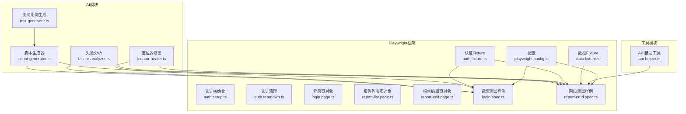
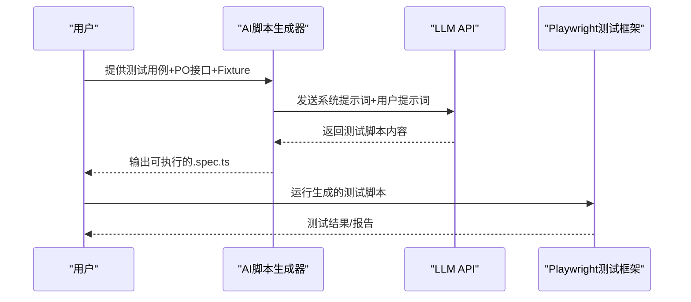
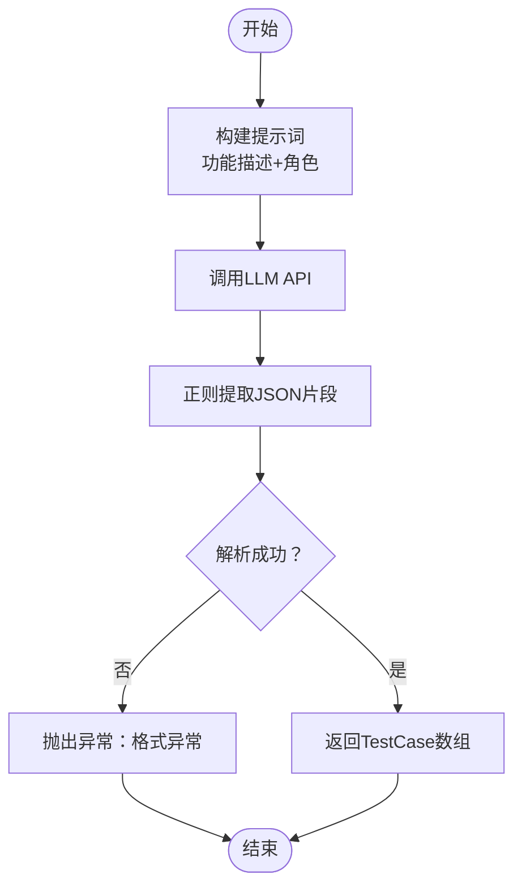
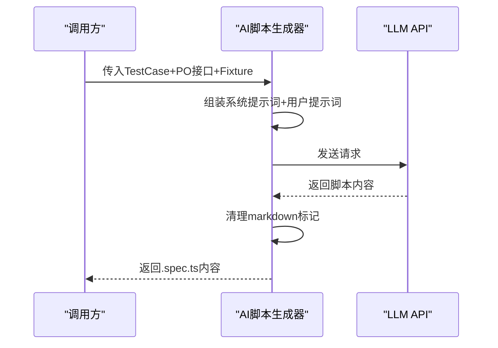
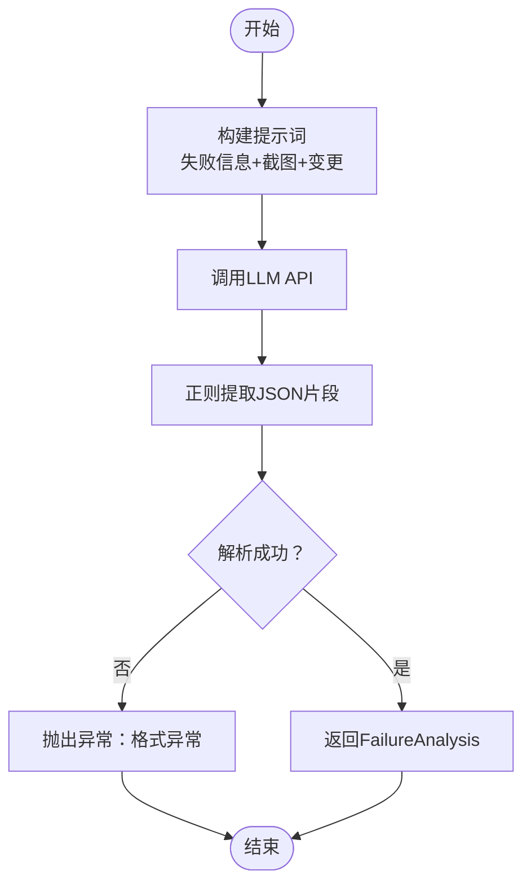
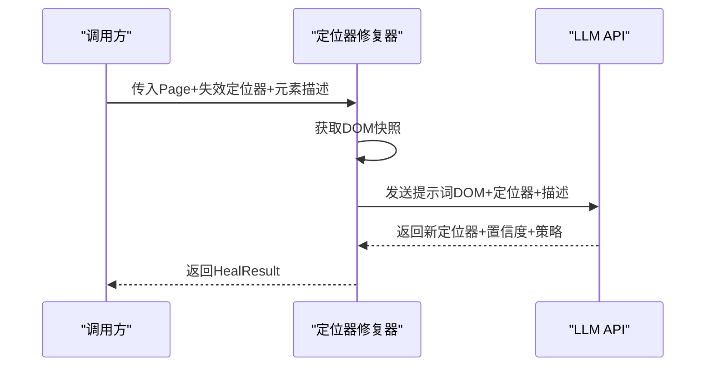
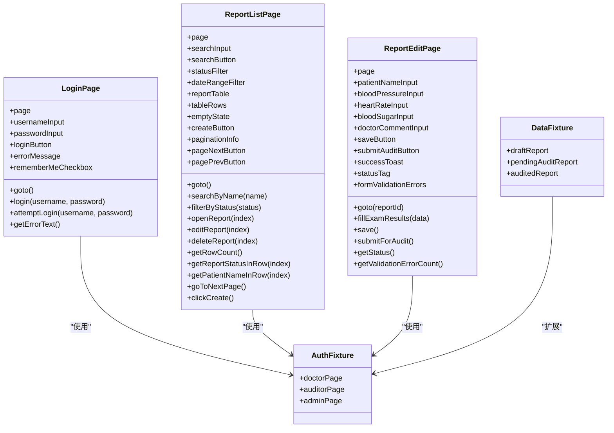
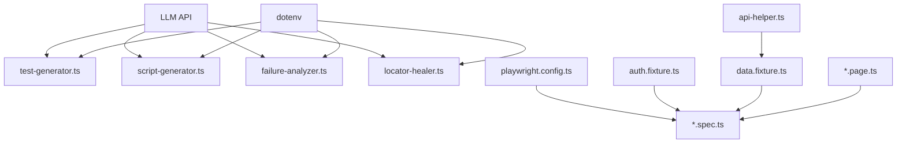

# AI测试脚本生成器

<cite>
**本文档引用的文件**
- [script-generator.ts](file://e2e-tests/ai/script-generator.ts)
- [test-generator.ts](file://e2e-tests/ai/test-generator.ts)
- [failure-analyzer.ts](file://e2e-tests/ai/failure-analyzer.ts)
- [locator-healer.ts](file://e2e-tests/ai/locator-healer.ts)
- [playwright.config.ts](file://e2e-tests/playwright.config.ts)
- [auth.fixture.ts](file://e2e-tests/fixtures/auth.fixture.ts)
- [data.fixture.ts](file://e2e-tests/fixtures/data.fixture.ts)
- [auth.setup.ts](file://e2e-tests/fixtures/auth.setup.ts)
- [auth.teardown.ts](file://e2e-tests/fixtures/auth.teardown.ts)
- [login.page.ts](file://e2e-tests/pages/login.page.ts)
- [report-list.page.ts](file://e2e-tests/pages/report-list.page.ts)
- [report-edit.page.ts](file://e2e-tests/pages/report-edit.page.ts)
- [api-helper.ts](file://e2e-tests/utils/api-helper.ts)
- [login.spec.ts](file://e2e-tests/tests/smoke/login.spec.ts)
- [report-crud.spec.ts](file://e2e-tests/tests/regression/report-crud.spec.ts)
- [package.json](file://e2e-tests/package.json)
</cite>

## 目录
1. [简介](#简介)
2. [项目结构](#项目结构)
3. [核心组件](#核心组件)
4. [架构总览](#架构总览)
5. [详细组件分析](#详细组件分析)
6. [依赖关系分析](#依赖关系分析)
7. [性能考虑](#性能考虑)
8. [故障排查指南](#故障排查指南)
9. [结论](#结论)
10. [附录](#附录)

## 简介
本项目是一个基于AI的端到端测试脚本生成器，目标是将自然语言描述的测试用例自动转换为可执行的Playwright TypeScript测试脚本。系统包含以下能力：
- 将自然语言测试用例结构化为JSON格式的测试用例集合
- 将测试用例与Page Object接口、Fixture结合，生成完整的.spec.ts测试脚本
- 对失败测试进行根因分析，并给出修复建议
- 在定位器失效时，基于页面DOM快照智能推荐新的定位器
- 提供定位器批量修复能力，提升测试稳定性

## 项目结构
整体采用“AI模块 + Playwright测试框架”的分层设计：
- AI模块：负责与大模型交互，生成测试用例、测试脚本、分析失败、修复定位器
- Playwright测试框架：包含页面对象、Fixture、测试脚本、配置文件
- 工具模块：API辅助工具，用于准备测试数据和清理环境

**图表来源**
- [playwright.config.ts:1-68](file://e2e-tests/playwright.config.ts#L1-L68)
- [auth.fixture.ts:1-40](file://e2e-tests/fixtures/auth.fixture.ts#L1-L40)
- [data.fixture.ts:1-57](file://e2e-tests/fixtures/data.fixture.ts#L1-L57)
- [auth.setup.ts:1-28](file://e2e-tests/fixtures/auth.setup.ts#L1-L28)
- [auth.teardown.ts:1-18](file://e2e-tests/fixtures/auth.teardown.ts#L1-L18)
- [login.page.ts:1-52](file://e2e-tests/pages/login.page.ts#L1-L52)
- [report-list.page.ts:1-130](file://e2e-tests/pages/report-list.page.ts#L1-L130)
- [report-edit.page.ts:1-94](file://e2e-tests/pages/report-edit.page.ts#L1-L94)
- [login.spec.ts:1-25](file://e2e-tests/tests/smoke/login.spec.ts#L1-L25)
- [report-crud.spec.ts:1-122](file://e2e-tests/tests/regression/report-crud.spec.ts#L1-L122)
- [api-helper.ts:1-172](file://e2e-tests/utils/api-helper.ts#L1-L172)
- [test-generator.ts:1-107](file://e2e-tests/ai/test-generator.ts#L1-L107)
- [script-generator.ts:1-110](file://e2e-tests/ai/script-generator.ts#L1-L110)
- [failure-analyzer.ts:1-112](file://e2e-tests/ai/failure-analyzer.ts#L1-L112)
- [locator-healer.ts:1-131](file://e2e-tests/ai/locator-healer.ts#L1-L131)

**章节来源**
- [playwright.config.ts:1-68](file://e2e-tests/playwright.config.ts#L1-L68)
- [package.json:1-27](file://e2e-tests/package.json#L1-L27)

## 核心组件
- AI测试用例生成器：将自然语言功能描述转化为结构化的测试用例数组，覆盖正向、逆向、边界、权限四类场景，并标注优先级。
- AI脚本生成器：接收测试用例和Page Object接口描述，结合可用Fixture和工具函数，输出完整的.spec.ts测试脚本。
- 失败分析器：对测试失败进行根因分类（定位器、逻辑、环境、数据），并提供修复建议和可选的修复代码。
- 定位器修复器：在定位器失效时，基于页面DOM快照分析并推荐新的定位器，支持批量修复。

**章节来源**
- [test-generator.ts:67-106](file://e2e-tests/ai/test-generator.ts#L67-L106)
- [script-generator.ts:63-109](file://e2e-tests/ai/script-generator.ts#L63-L109)
- [failure-analyzer.ts:69-111](file://e2e-tests/ai/failure-analyzer.ts#L69-L111)
- [locator-healer.ts:62-130](file://e2e-tests/ai/locator-healer.ts#L62-L130)

## 架构总览
AI生成器通过LLM API与Playwright测试框架解耦，遵循以下工作流：
- 输入：测试用例描述、Page Object接口、Fixture清单、工具函数
- 处理：构建系统提示词和用户提示词，调用LLM API，解析返回内容
- 输出：可直接运行的测试脚本或分析报告

**图表来源**
- [script-generator.ts:13-42](file://e2e-tests/ai/script-generator.ts#L13-L42)
- [script-generator.ts:63-109](file://e2e-tests/ai/script-generator.ts#L63-L109)
- [playwright.config.ts:1-68](file://e2e-tests/playwright.config.ts#L1-L68)

## 详细组件分析

### AI测试用例生成器
- 功能：将功能名称、描述和角色信息转换为结构化测试用例数组，包含用例ID、名称、前置条件、步骤、预期结果、优先级和类别。
- 关键点：
  - 使用系统提示词约束输出格式为JSON数组
  - 通过正则匹配提取JSON片段并解析
  - 覆盖正向、逆向、边界、权限四类场景
  - 优先级定义：P0核心流程、P1重要功能、P2边界/异常

**图表来源**
- [test-generator.ts:12-41](file://e2e-tests/ai/test-generator.ts#L12-L41)
- [test-generator.ts:67-106](file://e2e-tests/ai/test-generator.ts#L67-L106)

**章节来源**
- [test-generator.ts:67-106](file://e2e-tests/ai/test-generator.ts#L67-L106)

### AI脚本生成器
- 功能：将测试用例与Page Object接口、Fixture和工具函数结合，生成完整的.spec.ts测试脚本。
- 关键点：
  - 系统提示词约束：使用test.describe组织、使用fixture获取登录态、使用beforeEach准备数据、断言使用expect
  - 输出纯代码，自动清理markdown代码块标记
  - 支持传入多个Page Object接口和Fixture列表

**图表来源**
- [script-generator.ts:63-109](file://e2e-tests/ai/script-generator.ts#L63-L109)

**章节来源**
- [script-generator.ts:63-109](file://e2e-tests/ai/script-generator.ts#L63-L109)

### 失败分析器
- 功能：对测试失败进行根因分析，输出分类、原因描述、修复建议和可选修复代码。
- 关键点：
  - 支持定位器失效、业务逻辑变更、环境问题、数据问题四类根因
  - 通过正则匹配提取JSON片段并解析
  - 可选附带最近代码变更信息

**图表来源**
- [failure-analyzer.ts:69-111](file://e2e-tests/ai/failure-analyzer.ts#L69-L111)

**章节来源**
- [failure-analyzer.ts:69-111](file://e2e-tests/ai/failure-analyzer.ts#L69-L111)

### 定位器修复器
- 功能：在定位器失效时，基于页面DOM快照分析并推荐新的定位器，支持批量修复。
- 关键点：
  - 截取页面DOM片段（限制长度）
  - 优先使用data-testid，其次role+name，最后文本或CSS选择器
  - 支持单个修复和批量修复两种模式

**图表来源**
- [locator-healer.ts:62-103](file://e2e-tests/ai/locator-healer.ts#L62-L103)

**章节来源**
- [locator-healer.ts:62-130](file://e2e-tests/ai/locator-healer.ts#L62-L130)

### Page Object接口映射与Fixture使用
- Page Object接口映射：
  - LoginPage：登录页的所有定位器和方法封装，如goto、login、attemptLogin、getErrorText
  - ReportListPage：报告列表页的所有定位器和方法封装，如searchByName、filterByStatus、openReport、editReport、deleteReport、getRowCount、getReportStatusInRow、getPatientNameInRow、goToNextPage、clickCreate
  - ReportEditPage：报告编辑页的所有定位器和方法封装，如goto、fillExamResults、save、submitForAudit、getStatus、getValidationErrorCount
- Fixture使用：
  - 认证Fixture：提供不同角色的Page实例（doctorPage、auditorPage、adminPage），基于storageState加载预登录状态
  - 数据Fixture：自动创建和清理测试报告，提供draftReport、pendingAuditReport、auditedReport等fixture
  - 认证初始化与清理：通过setup和teardown脚本生成storageState文件并在测试结束后清理

**图表来源**
- [login.page.ts:3-51](file://e2e-tests/pages/login.page.ts#L3-L51)
- [report-list.page.ts:3-129](file://e2e-tests/pages/report-list.page.ts#L3-L129)
- [report-edit.page.ts:3-93](file://e2e-tests/pages/report-edit.page.ts#L3-L93)
- [auth.fixture.ts:10-37](file://e2e-tests/fixtures/auth.fixture.ts#L10-L37)
- [data.fixture.ts:13-54](file://e2e-tests/fixtures/data.fixture.ts#L13-L54)

**章节来源**
- [login.page.ts:1-52](file://e2e-tests/pages/login.page.ts#L1-L52)
- [report-list.page.ts:1-130](file://e2e-tests/pages/report-list.page.ts#L1-L130)
- [report-edit.page.ts:1-94](file://e2e-tests/pages/report-edit.page.ts#L1-L94)
- [auth.fixture.ts:1-40](file://e2e-tests/fixtures/auth.fixture.ts#L1-L40)
- [data.fixture.ts:1-57](file://e2e-tests/fixtures/data.fixture.ts#L1-L57)

### 测试脚本结构、命名约定与代码质量保证
- 测试脚本结构：
  - 使用test.describe组织测试套件，清晰表达测试目的和编号
  - 使用fixture获取登录态，避免重复登录逻辑
  - 使用beforeEach准备数据，afterEach清理数据，确保测试隔离
  - 断言统一使用expect，提高一致性
- 命名约定：
  - 测试文件：按功能域划分目录（smoke、regression），文件名以.spec.ts结尾
  - Page Object类名：以Page结尾，如ReportListPage
  - Fixture变量：以小驼峰命名，如draftReport
- 代码质量保证：
  - 通过Playwright配置启用严格模式（forbidOnly）、重试策略（CI环境）
  - 使用TypeScript类型约束，确保参数和返回值类型安全
  - 使用data-testid作为首选定位器，提升定位器稳定性

**章节来源**
- [login.spec.ts:1-25](file://e2e-tests/tests/smoke/login.spec.ts#L1-L25)
- [report-crud.spec.ts:1-122](file://e2e-tests/tests/regression/report-crud.spec.ts#L1-L122)
- [playwright.config.ts:1-68](file://e2e-tests/playwright.config.ts#L1-L68)

## 依赖关系分析
- AI模块依赖：
  - LLM API：通过环境变量配置，调用/chat/completions接口
  - dotenv：读取环境变量（LLM_API_URL、LLM_API_KEY、LLM_MODEL）
- Playwright模块依赖：
  - playwright.config.ts：定义测试目录、超时、并发、报告器、项目配置
  - Fixture：认证和数据Fixture依赖API辅助工具
  - Page Object：依赖Playwright的Page和Locator类型
- 工具模块依赖：
  - API辅助工具：通过Playwright request创建带Token的API上下文，支持创建、删除、更新报告状态、批量清理等

**图表来源**
- [test-generator.ts:1-107](file://e2e-tests/ai/test-generator.ts#L1-L107)
- [script-generator.ts:1-110](file://e2e-tests/ai/script-generator.ts#L1-L110)
- [failure-analyzer.ts:1-112](file://e2e-tests/ai/failure-analyzer.ts#L1-L112)
- [locator-healer.ts:1-131](file://e2e-tests/ai/locator-healer.ts#L1-L131)
- [playwright.config.ts:1-68](file://e2e-tests/playwright.config.ts#L1-L68)
- [auth.fixture.ts:1-40](file://e2e-tests/fixtures/auth.fixture.ts#L1-L40)
- [data.fixture.ts:1-57](file://e2e-tests/fixtures/data.fixture.ts#L1-L57)
- [api-helper.ts:1-172](file://e2e-tests/utils/api-helper.ts#L1-L172)

**章节来源**
- [package.json:1-27](file://e2e-tests/package.json#L1-L27)

## 性能考虑
- LLM调用优化：
  - 控制temperature降低随机性，提高输出稳定性
  - 合理设置提示词长度，避免超出模型上下文限制
- Playwright测试优化：
  - 使用fullyParallel并行执行，提升CI效率
  - 适当调整timeout和expect.timeout，平衡稳定性与速度
  - 在CI环境启用重试策略，减少偶发失败影响
- 数据准备优化：
  - API辅助工具使用单例API上下文，避免重复认证开销
  - 批量清理测试数据，缩短测试执行时间

## 故障排查指南
- LLM API配置问题：
  - 确认LLM_API_URL、LLM_API_KEY、LLM_MODEL环境变量已正确设置
  - 检查网络连通性和API密钥有效性
- 测试失败根因分析：
  - 使用failure-analyzer分析失败原因，重点关注定位器失效、逻辑变更、环境问题、数据问题
  - 根据修复建议更新Page Object或测试脚本
- 定位器失效修复：
  - 使用locator-healer获取DOM快照并推荐新定位器
  - 批量修复多个失效定位器，提升测试稳定性
- 认证状态管理：
  - 确认auth.setup生成storageState文件
  - 测试结束后执行auth.teardown清理认证状态

**章节来源**
- [failure-analyzer.ts:12-41](file://e2e-tests/ai/failure-analyzer.ts#L12-L41)
- [locator-healer.ts:13-45](file://e2e-tests/ai/locator-healer.ts#L13-L45)
- [auth.setup.ts:17-26](file://e2e-tests/fixtures/auth.setup.ts#L17-L26)
- [auth.teardown.ts:7-17](file://e2e-tests/fixtures/auth.teardown.ts#L7-L17)

## 结论
本AI测试脚本生成器通过LLM与Playwright框架的有机结合，实现了从自然语言测试用例到可执行测试脚本的自动化转换。其核心优势在于：
- 强大的提示词工程，确保输出符合Playwright规范
- 完整的测试生命周期管理，从数据准备到清理
- 智能的失败分析与定位器修复能力，提升测试稳定性
- 清晰的Page Object与Fixture设计，便于维护和扩展

## 附录

### 代码示例：从测试用例到测试脚本的转换过程
- 步骤1：使用AI测试用例生成器生成结构化测试用例
  - 输入：功能名称、描述、角色
  - 输出：TestCase数组
- 步骤2：使用AI脚本生成器生成测试脚本
  - 输入：TestCase、Page Object接口、Fixture列表、工具函数
  - 输出：.spec.ts文件内容
- 步骤3：运行生成的测试脚本
  - 使用Playwright配置执行测试，生成报告

**章节来源**
- [test-generator.ts:67-106](file://e2e-tests/ai/test-generator.ts#L67-L106)
- [script-generator.ts:63-109](file://e2e-tests/ai/script-generator.ts#L63-L109)
- [playwright.config.ts:1-68](file://e2e-tests/playwright.config.ts#L1-L68)

### 模板定制指南
- 自定义系统提示词：
  - 在AI脚本生成器中调整systemPrompt，添加特定业务约束或编码规范
- 扩展Page Object接口：
  - 在输入参数中传入新增的Page Object接口描述
- 定制Fixture：
  - 在输入参数中传入自定义Fixture名称，确保测试脚本中可使用

**章节来源**
- [script-generator.ts:63-109](file://e2e-tests/ai/script-generator.ts#L63-L109)

### 代码格式化规则与最佳实践
- 代码格式化：
  - 使用TypeScript类型约束，确保类型安全
  - 统一使用data-testid作为定位器，提升稳定性
  - 断言统一使用expect，保持一致性
- 最佳实践：
  - 使用beforeEach/afterEach管理测试数据，确保测试隔离
  - 将复杂操作封装为Page Object方法，提升可读性
  - 在CI环境中启用重试和并行执行，提升效率

**章节来源**
- [login.spec.ts:1-25](file://e2e-tests/tests/smoke/login.spec.ts#L1-L25)
- [report-crud.spec.ts:1-122](file://e2e-tests/tests/regression/report-crud.spec.ts#L1-L122)
- [playwright.config.ts:1-68](file://e2e-tests/playwright.config.ts#L1-L68)