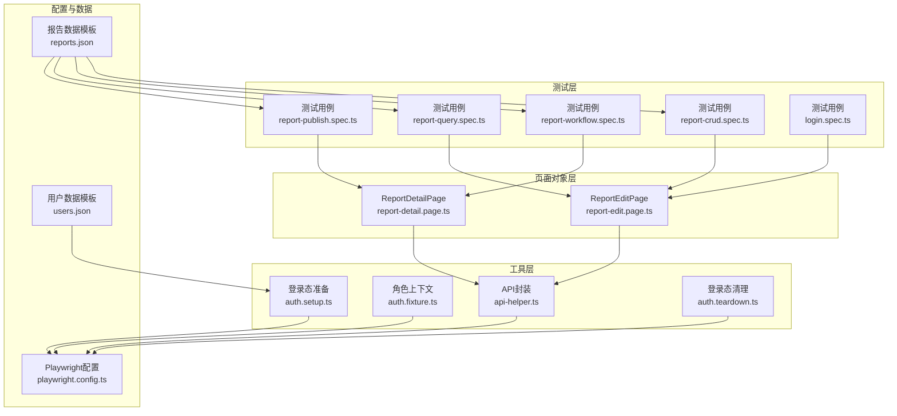
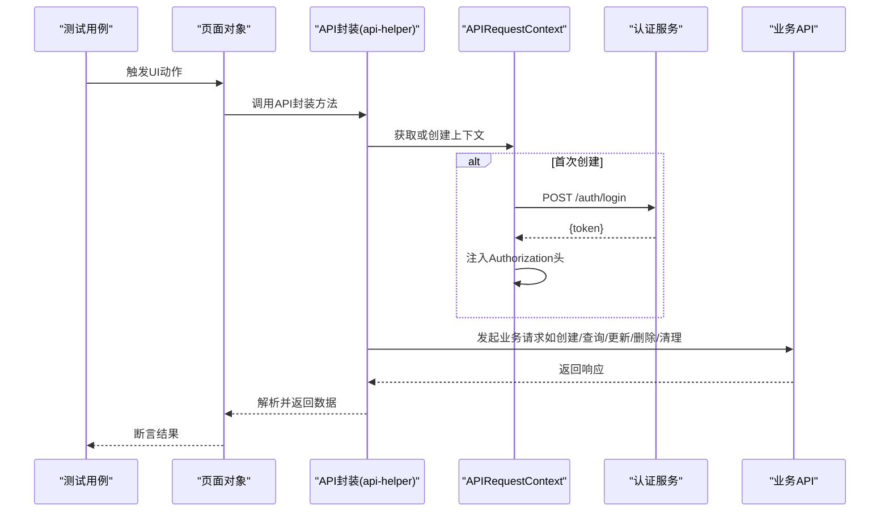
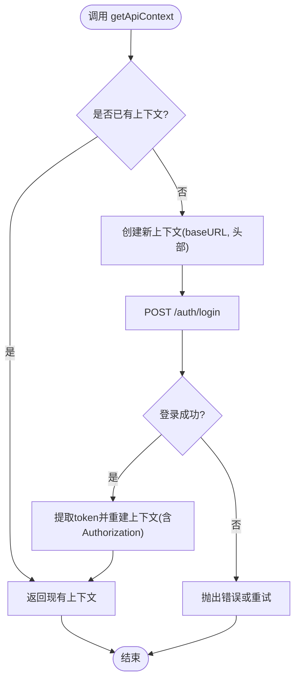
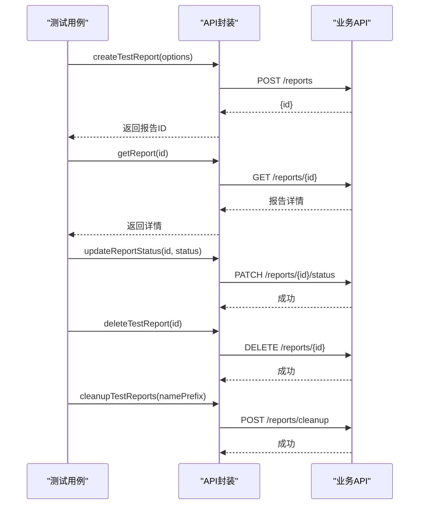
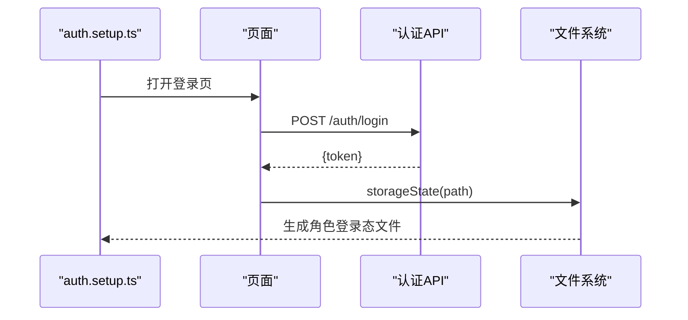
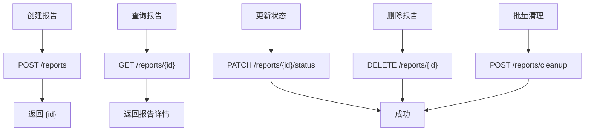
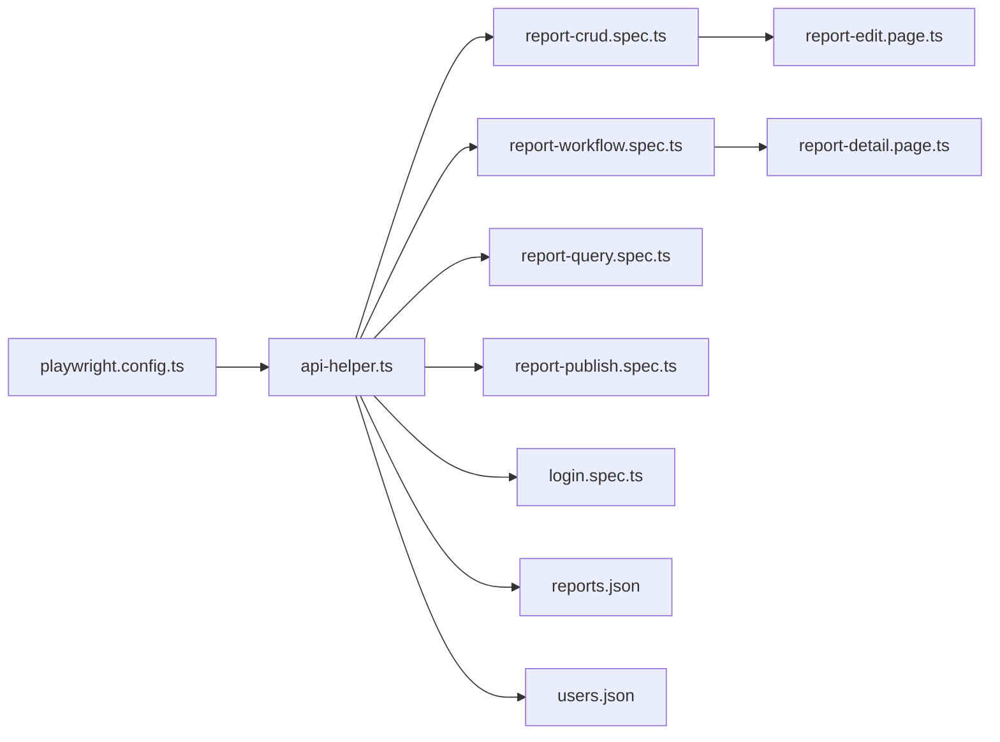

# API调用封装

<cite>
**本文档引用的文件**
- [api-helper.ts](file://e2e-tests/utils/api-helper.ts)
- [auth.fixture.ts](file://e2e-tests/fixtures/auth.fixture.ts)
- [auth.setup.ts](file://e2e-tests/fixtures/auth.setup.ts)
- [auth.teardown.ts](file://e2e-tests/fixtures/auth.teardown.ts)
- [playwright.config.ts](file://e2e-tests/playwright.config.ts)
- [report-crud.spec.ts](file://e2e-tests/tests/regression/report-crud.spec.ts)
- [report-workflow.spec.ts](file://e2e-tests/tests/regression/report-workflow.spec.ts)
- [report-query.spec.ts](file://e2e-tests/tests/regression/report-query.spec.ts)
- [report-publish.spec.ts](file://e2e-tests/tests/regression/report-publish.spec.ts)
- [login.spec.ts](file://e2e-tests/tests/smoke/login.spec.ts)
- [report-edit.page.ts](file://e2e-tests/pages/report-edit.page.ts)
- [report-detail.page.ts](file://e2e-tests/pages/report-detail.page.ts)
- [reports.json](file://e2e-tests/data/reports.json)
- [users.json](file://e2e-tests/data/users.json)
- [package.json](file://e2e-tests/package.json)
</cite>

## 目录
1. [简介](#简介)
2. [项目结构](#项目结构)
3. [核心组件](#核心组件)
4. [架构总览](#架构总览)
5. [详细组件分析](#详细组件分析)
6. [依赖关系分析](#依赖关系分析)
7. [性能考虑](#性能考虑)
8. [故障排查指南](#故障排查指南)
9. [结论](#结论)
10. [附录](#附录)

## 简介
本文件面向API调用封装模块，重点解析 e2e-tests/utils/api-helper.ts 中的API请求上下文创建与管理、报告管理API的实现、用户认证API的封装、API调用示例、重试与超时配置、并发控制、RESTful设计原则与最佳实践，以及与后端服务的集成模式。文档同时结合测试用例与页面对象，帮助读者快速理解从测试脚本到后端接口的完整调用链路。

**更新** 本次更新反映了API调用封装的重构，增强了数据操作能力，新增了批量清理功能，并改进了认证流程的健壮性。

## 项目结构
围绕API封装的核心目录与文件如下：
- utils/api-helper.ts：统一的API请求上下文与报告管理API封装
- fixtures/auth.fixture.ts：基于storageState的角色页面上下文
- fixtures/auth.setup.ts：登录态准备与storageState生成
- fixtures/auth.teardown.ts：登录态清理
- tests/*：业务场景测试，演示API封装的使用
- pages/*：页面对象，展示前端交互如何驱动后端API
- data/*：测试数据模板
- playwright.config.ts：Playwright全局配置（超时、并发、报告等）

**图表来源**
- [api-helper.ts:1-206](file://e2e-tests/utils/api-helper.ts#L1-L206)
- [auth.fixture.ts:1-52](file://e2e-tests/fixtures/auth.fixture.ts#L1-L52)
- [auth.setup.ts:1-116](file://e2e-tests/fixtures/auth.setup.ts#L1-L116)
- [auth.teardown.ts:1-26](file://e2e-tests/fixtures/auth.teardown.ts#L1-L26)
- [playwright.config.ts:1-54](file://e2e-tests/playwright.config.ts#L1-L54)
- [report-crud.spec.ts:1-122](file://e2e-tests/tests/regression/report-crud.spec.ts#L1-L122)
- [report-workflow.spec.ts:1-138](file://e2e-tests/tests/regression/report-workflow.spec.ts#L1-L138)
- [report-query.spec.ts:1-122](file://e2e-tests/tests/regression/report-query.spec.ts#L1-L122)
- [report-publish.spec.ts:1-100](file://e2e-tests/tests/regression/report-publish.spec.ts#L1-L100)
- [login.spec.ts:1-25](file://e2e-tests/tests/smoke/login.spec.ts#L1-L25)
- [report-edit.page.ts:1-99](file://e2e-tests/pages/report-edit.page.ts#L1-L99)
- [report-detail.page.ts:1-111](file://e2e-tests/pages/report-detail.page.ts#L1-L111)
- [reports.json:1-78](file://e2e-tests/data/reports.json#L1-L78)
- [users.json:1-30](file://e2e-tests/data/users.json#L1-L30)

**章节来源**
- [playwright.config.ts:1-54](file://e2e-tests/playwright.config.ts#L1-L54)
- [package.json:1-27](file://e2e-tests/package.json#L1-L27)

## 核心组件
- API请求上下文（单例）：通过延迟初始化与一次性认证，确保后续所有API调用自动携带Authorization头，避免重复登录开销。
- 报告管理API：
  - 创建报告：支持自定义患者信息、检查日期、初始状态、体检项目与医生备注。
  - 删除报告：按ID删除。
  - 更新状态：直接更新报告状态（用于准备前置数据）。
  - 查询报告：按ID获取报告详情。
  - 批量清理：按患者名前缀批量清理测试数据。
- 用户认证API封装：通过管理员账户登录获取token，并在上下文中注入Authorization头；同时提供销毁上下文方法，便于全局收尾。
- 测试数据与模板：通过JSON数据模板与用户配置，支撑测试用例的数据准备与断言。

**更新** 新增批量清理功能，支持按患者名前缀批量删除测试数据，提高了测试环境的清理效率。

**章节来源**
- [api-helper.ts:40-77](file://e2e-tests/utils/api-helper.ts#L40-L77)
- [api-helper.ts:104-155](file://e2e-tests/utils/api-helper.ts#L104-L155)
- [api-helper.ts:160-176](file://e2e-tests/utils/api-helper.ts#L160-L176)
- [api-helper.ts:178-185](file://e2e-tests/utils/api-helper.ts#L178-L185)
- [api-helper.ts:187-195](file://e2e-tests/utils/api-helper.ts#L187-L195)
- [api-helper.ts:197-205](file://e2e-tests/utils/api-helper.ts#L197-L205)
- [reports.json:1-78](file://e2e-tests/data/reports.json#L1-L78)
- [users.json:1-30](file://e2e-tests/data/users.json#L1-L30)

## 架构总览
API封装采用"请求上下文单例 + 授权注入"的架构，统一管理基础URL、请求头与认证信息。测试用例通过页面对象触发UI操作，页面对象内部调用API封装完成数据准备与断言，最终形成"UI -> 页面对象 -> API封装 -> 后端服务"的清晰链路。

**图表来源**
- [api-helper.ts:45-77](file://e2e-tests/utils/api-helper.ts#L45-L77)
- [api-helper.ts:104-155](file://e2e-tests/utils/api-helper.ts#L104-L155)
- [api-helper.ts:160-176](file://e2e-tests/utils/api-helper.ts#L160-L176)
- [api-helper.ts:178-185](file://e2e-tests/utils/api-helper.ts#L178-L185)
- [api-helper.ts:187-195](file://e2e-tests/utils/api-helper.ts#L187-L195)

## 详细组件分析

### API请求上下文与单例模式
- 单例实现：通过私有变量缓存APIRequestContext，首次调用时创建并登录获取token，随后复用该上下文。
- 认证流程：先以管理员身份登录获取token，再重建带Authorization头的上下文，确保后续请求均具备权限。
- 全局销毁：提供销毁方法，在测试结束后释放资源，避免连接泄漏。

**图表来源**
- [api-helper.ts:45-77](file://e2e-tests/utils/api-helper.ts#L45-L77)

**章节来源**
- [api-helper.ts:40-77](file://e2e-tests/utils/api-helper.ts#L40-L77)

### 报告管理API
- 创建报告：根据传入选项生成唯一患者标识、默认日期与状态，填充固定体检项目集合，返回报告ID。
- 删除报告：按ID删除。
- 更新状态：直接PATCH更新状态，便于前置数据准备。
- 查询报告：GET报告详情。
- 批量清理：按患者名前缀清理测试数据。

**图表来源**
- [api-helper.ts:104-155](file://e2e-tests/utils/api-helper.ts#L104-L155)
- [api-helper.ts:160-176](file://e2e-tests/utils/api-helper.ts#L160-L176)
- [api-helper.ts:178-185](file://e2e-tests/utils/api-helper.ts#L178-L185)
- [api-helper.ts:187-195](file://e2e-tests/utils/api-helper.ts#L187-L195)

**章节来源**
- [api-helper.ts:104-155](file://e2e-tests/utils/api-helper.ts#L104-L155)
- [api-helper.ts:160-176](file://e2e-tests/utils/api-helper.ts#L160-L176)
- [api-helper.ts:178-185](file://e2e-tests/utils/api-helper.ts#L178-L185)
- [api-helper.ts:187-195](file://e2e-tests/utils/api-helper.ts#L187-L195)

### 用户认证API封装
- 管理员登录：封装内部登录逻辑，自动注入Authorization头。
- 角色上下文：通过storageState加载不同角色的登录态，避免重复登录。
- 登录态准备与清理：在setup阶段生成storageState，在teardown阶段清理，保证环境干净。

**图表来源**
- [auth.setup.ts:17-26](file://e2e-tests/fixtures/auth.setup.ts#L17-L26)
- [auth.fixture.ts:10-37](file://e2e-tests/fixtures/auth.fixture.ts#L10-L37)
- [auth.teardown.ts:7-17](file://e2e-tests/fixtures/auth.teardown.ts#L7-L17)

**章节来源**
- [auth.setup.ts:1-116](file://e2e-tests/fixtures/auth.setup.ts#L1-L116)
- [auth.fixture.ts:1-52](file://e2e-tests/fixtures/auth.fixture.ts#L1-L52)
- [auth.teardown.ts:1-26](file://e2e-tests/fixtures/auth.teardown.ts#L1-L26)

### API调用示例（请求参数、响应处理、错误处理）
- 创建报告
  - 请求：POST /reports，Body包含患者信息、检查日期、初始状态、体检项目数组与医生备注。
  - 响应：返回包含报告ID的对象。
  - 错误处理：捕获异常并在测试用例中忽略删除失败，避免影响主流程。
- 查询报告
  - 请求：GET /reports/{id}。
  - 响应：返回报告详情对象。
- 更新状态
  - 请求：PATCH /reports/{id}/status，Body包含目标状态字符串。
- 删除报告
  - 请求：DELETE /reports/{id}。
- 批量清理
  - 请求：POST /reports/cleanup，Body包含namePrefix。

**图表来源**
- [api-helper.ts:110-155](file://e2e-tests/utils/api-helper.ts#L110-L155)
- [api-helper.ts:180-185](file://e2e-tests/utils/api-helper.ts#L180-L185)
- [api-helper.ts:168-176](file://e2e-tests/utils/api-helper.ts#L168-L176)
- [api-helper.ts:161-163](file://e2e-tests/utils/api-helper.ts#L161-L163)
- [api-helper.ts:189-195](file://e2e-tests/utils/api-helper.ts#L189-L195)

**章节来源**
- [api-helper.ts:104-155](file://e2e-tests/utils/api-helper.ts#L104-L155)
- [api-helper.ts:160-176](file://e2e-tests/utils/api-helper.ts#L160-L176)
- [api-helper.ts:178-185](file://e2e-tests/utils/api-helper.ts#L178-L185)
- [api-helper.ts:187-195](file://e2e-tests/utils/api-helper.ts#L187-L195)

### 与后端服务的集成模式
- 基础URL与头部：统一设置baseURL与Content-Type，认证通过Authorization头传递。
- 状态流转：通过直接更新状态接口准备前置数据，避免复杂UI步骤。
- 数据模板：使用JSON模板快速生成测试数据，提升可维护性与一致性。

**章节来源**
- [api-helper.ts:6](file://e2e-tests/utils/api-helper.ts#L6)
- [api-helper.ts:48-73](file://e2e-tests/utils/api-helper.ts#L48-L73)
- [reports.json:1-78](file://e2e-tests/data/reports.json#L1-L78)

## 依赖关系分析
- 组件耦合
  - API封装对Playwright的APIRequestContext强依赖，但通过单例与延迟初始化降低耦合度。
  - 页面对象依赖API封装进行数据准备与断言，保持UI与数据层分离。
- 外部依赖
  - Playwright测试框架、dotenv环境变量、MySQL数据库（通过db-helper.ts间接体现）。
- 并发与超时
  - Playwright全局配置控制超时、重试与工作进程数，API封装本身不重复设置超时。

**图表来源**
- [playwright.config.ts:1-54](file://e2e-tests/playwright.config.ts#L1-L54)
- [api-helper.ts:1-206](file://e2e-tests/utils/api-helper.ts#L1-L206)
- [report-crud.spec.ts:1-122](file://e2e-tests/tests/regression/report-crud.spec.ts#L1-L122)
- [report-workflow.spec.ts:1-138](file://e2e-tests/tests/regression/report-workflow.spec.ts#L1-L138)
- [report-query.spec.ts:1-122](file://e2e-tests/tests/regression/report-query.spec.ts#L1-L122)
- [report-publish.spec.ts:1-100](file://e2e-tests/tests/regression/report-publish.spec.ts#L1-L100)
- [login.spec.ts:1-25](file://e2e-tests/tests/smoke/login.spec.ts#L1-L25)
- [report-edit.page.ts:1-99](file://e2e-tests/pages/report-edit.page.ts#L1-L99)
- [report-detail.page.ts:1-111](file://e2e-tests/pages/report-detail.page.ts#L1-L111)
- [reports.json:1-78](file://e2e-tests/data/reports.json#L1-L78)
- [users.json:1-30](file://e2e-tests/data/users.json#L1-L30)

**章节来源**
- [playwright.config.ts:1-54](file://e2e-tests/playwright.config.ts#L1-L54)
- [package.json:1-27](file://e2e-tests/package.json#L1-L27)

## 性能考虑
- 单例上下文：避免重复登录与连接建立，显著降低请求延迟与服务器压力。
- 批量清理：通过名称前缀批量清理，减少多次请求次数。
- 并发控制：通过Playwright的workers与fullyParallel配置控制并发，API封装不额外引入并发限制。
- 超时与重试：由Playwright全局配置统一管理，API封装不覆盖其行为。

**更新** 批量清理功能显著提升了测试环境的清理效率，特别是在大规模测试场景下，可以快速清理大量测试数据。

**章节来源**
- [playwright.config.ts:12-15](file://e2e-tests/playwright.config.ts#L12-L15)
- [api-helper.ts:187-195](file://e2e-tests/utils/api-helper.ts#L187-L195)

## 故障排查指南
- 认证失败
  - 现象：后续API返回401或被拒绝。
  - 排查：确认管理员账号与密码正确；检查环境变量API_BASE_URL；确认登录流程成功并成功注入Authorization头。
- 请求超时
  - 现象：API调用抛出超时异常。
  - 排查：检查Playwright全局超时配置；确认后端服务可用；适当调整超时时间。
- 并发冲突
  - 现象：多线程测试出现竞态条件导致数据污染。
  - 排查：使用名称前缀隔离测试数据；在测试结束后调用批量清理或逐条删除；必要时降低workers数量。
- 状态更新无效
  - 现象：直接更新状态未生效。
  - 排查：确认目标状态合法且符合业务规则；确认传入的reportId有效。
- 批量清理失败
  - 现象：批量清理无法删除预期的测试数据。
  - 排查：确认namePrefix格式正确；检查后端清理接口的实现；验证测试数据的命名规范。

**更新** 新增批量清理功能的故障排查指南，包括namePrefix格式验证和后端接口检查。

**章节来源**
- [playwright.config.ts:8-15](file://e2e-tests/playwright.config.ts#L8-L15)
- [api-helper.ts:45-77](file://e2e-tests/utils/api-helper.ts#L45-L77)
- [api-helper.ts:168-176](file://e2e-tests/utils/api-helper.ts#L168-L176)
- [api-helper.ts:187-195](file://e2e-tests/utils/api-helper.ts#L187-L195)

## 结论
API调用封装通过"请求上下文单例 + 授权注入"的模式，实现了高效、稳定的后端交互；结合页面对象与测试用例，形成了清晰的端到端测试链路。配合Playwright的全局配置与数据模板，能够满足冒烟与回归测试的性能与稳定性需求。本次重构增强了数据操作能力，特别是批量清理功能，进一步提升了测试效率。建议在生产环境中进一步完善错误重试、超时与并发控制策略，并持续优化数据模板与清理流程。

**更新** 重构后的API封装在保持原有功能的基础上，新增了批量清理能力，显著提升了测试环境管理的效率和可靠性。

## 附录

### RESTful API设计原则与最佳实践
- 资源命名：使用名词复数形式，如/reports、/reports/{id}。
- 方法语义：GET读取、POST创建、PATCH更新、DELETE删除。
- 状态码：遵循HTTP标准，明确错误类型与含义。
- 请求体：结构化、字段明确，支持部分字段更新。
- 版本控制：通过URL路径或头部进行版本管理（建议）。

### 与后端服务的集成要点
- 统一认证：集中管理token与Authorization头，避免分散处理。
- 前置数据：通过直接更新状态或批量清理，减少UI步骤，提升效率。
- 数据隔离：使用名称前缀与worker索引区分不同测试实例的数据。
- 可观测性：记录关键请求与响应，便于问题定位与回归分析。
- 批量操作：合理使用批量清理功能，避免单个请求处理过多数据。