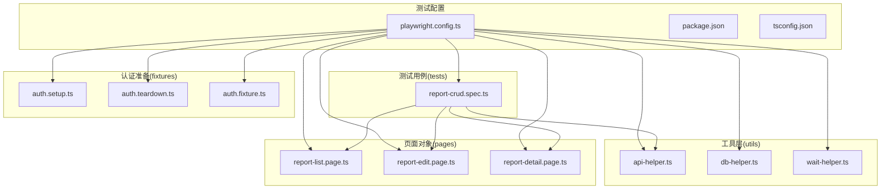
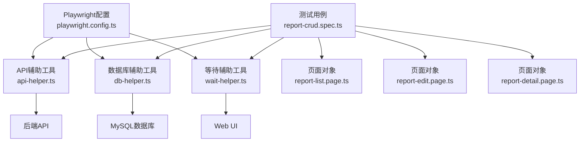
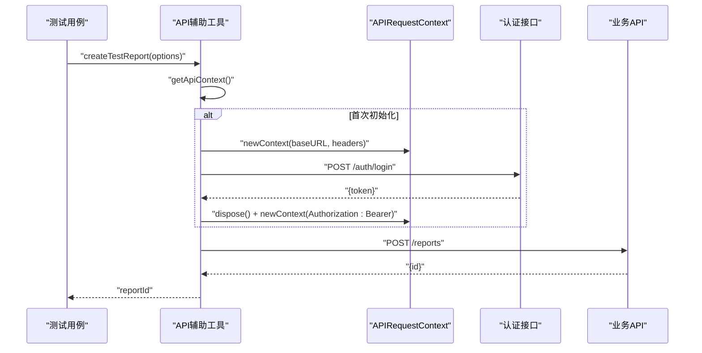
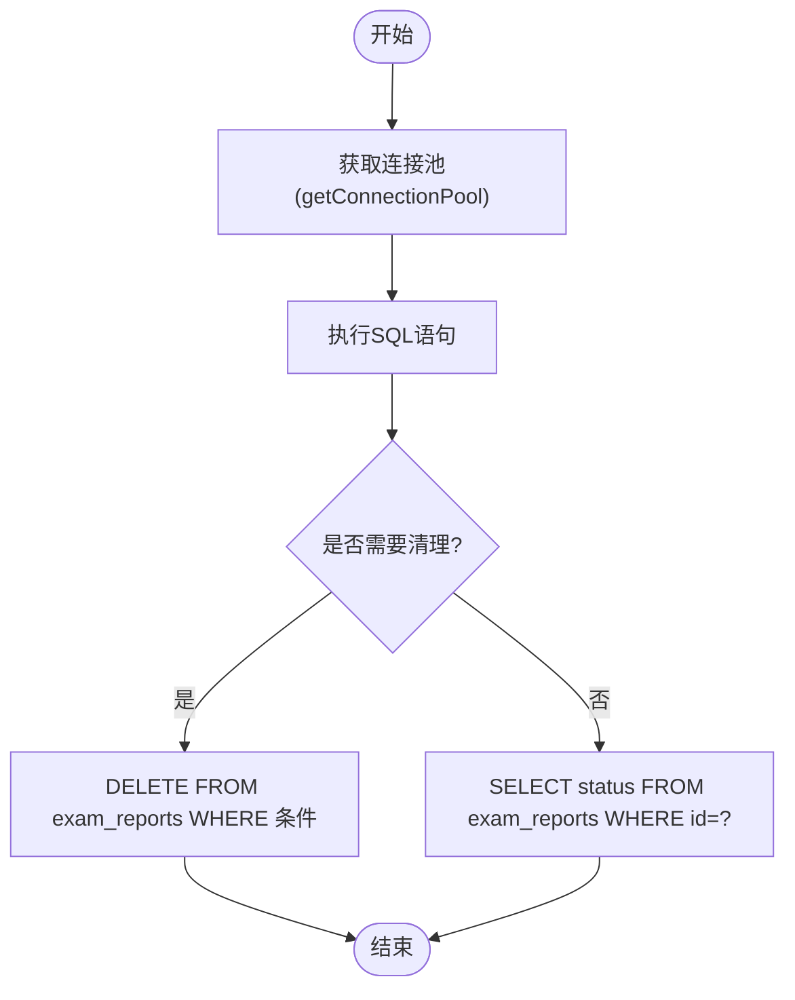
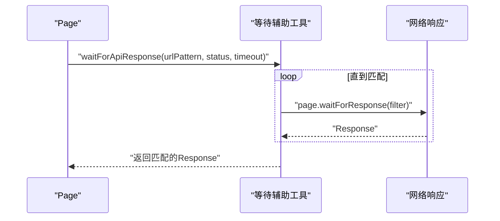
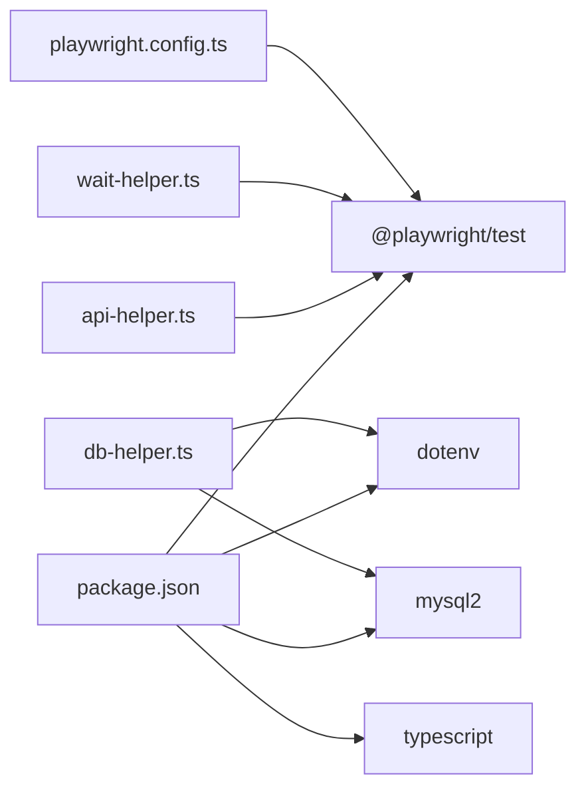

# API辅助工具

<cite>
**本文引用的文件**
- [api-helper.ts](file://e2e-tests/utils/api-helper.ts)
- [db-helper.ts](file://e2e-tests/utils/db-helper.ts)
- [wait-helper.ts](file://e2e-tests/utils/wait-helper.ts)
- [playwright.config.ts](file://e2e-tests/playwright.config.ts)
- [package.json](file://e2e-tests/package.json)
- [report-crud.spec.ts](file://e2e-tests/tests/regression/report-crud.spec.ts)
- [auth.setup.ts](file://e2e-tests/fixtures/auth.setup.ts)
- [auth.teardown.ts](file://e2e-tests/fixtures/auth.teardown.ts)
- [auth.fixture.ts](file://e2e-tests/fixtures/auth.fixture.ts)
- [report-list.page.ts](file://e2e-tests/pages/report-list.page.ts)
- [report-edit.page.ts](file://e2e-tests/pages/report-edit.page.ts)
- [report-detail.page.ts](file://e2e-tests/pages/report-detail.page.ts)
- [tsconfig.json](file://e2e-tests/tsconfig.json)
</cite>

## 目录
1. [简介](#简介)
2. [项目结构](#项目结构)
3. [核心组件](#核心组件)
4. [架构总览](#架构总览)
5. [详细组件分析](#详细组件分析)
6. [依赖关系分析](#依赖关系分析)
7. [性能考虑](#性能考虑)
8. [故障排查指南](#故障排查指南)
9. [结论](#结论)
10. [附录](#附录)

## 简介
本技术参考文档聚焦于端到端测试中的API辅助工具，涵盖以下方面：
- API调用封装：报告管理API、用户认证API与数据清理API的使用方法与最佳实践
- 数据库辅助工具：连接池管理、查询封装与数据一致性保障
- 等待辅助工具：策略实现与超时处理机制
- 错误处理策略与性能优化建议
- 扩展与自定义开发指南

该工具集基于Playwright框架，结合TypeScript与MySQL2，为测试提供稳定、可复用的基础设施。

## 项目结构
项目采用“功能模块+页面对象+测试用例”的组织方式，核心辅助工具位于utils目录，页面对象位于pages目录，测试用例位于tests目录，认证状态准备位于fixtures目录。

图表来源
- [playwright.config.ts:1-68](file://e2e-tests/playwright.config.ts#L1-L68)
- [api-helper.ts:1-172](file://e2e-tests/utils/api-helper.ts#L1-L172)
- [db-helper.ts:1-91](file://e2e-tests/utils/db-helper.ts#L1-L91)
- [wait-helper.ts:1-107](file://e2e-tests/utils/wait-helper.ts#L1-L107)
- [report-crud.spec.ts:1-122](file://e2e-tests/tests/regression/report-crud.spec.ts#L1-L122)
- [auth.setup.ts:1-30](file://e2e-tests/fixtures/auth.setup.ts#L1-L30)
- [auth.teardown.ts:1-18](file://e2e-tests/fixtures/auth.teardown.ts#L1-L18)
- [auth.fixture.ts:1-40](file://e2e-tests/fixtures/auth.fixture.ts#L1-L40)
- [report-list.page.ts:1-130](file://e2e-tests/pages/report-list.page.ts#L1-L130)
- [report-edit.page.ts:1-94](file://e2e-tests/pages/report-edit.page.ts#L1-L94)
- [report-detail.page.ts:1-107](file://e2e-tests/pages/report-detail.page.ts#L1-L107)

章节来源
- [playwright.config.ts:1-68](file://e2e-tests/playwright.config.ts#L1-L68)
- [package.json:1-27](file://e2e-tests/package.json#L1-L27)
- [tsconfig.json:1-25](file://e2e-tests/tsconfig.json#L1-L25)

## 核心组件
- API辅助工具(api-helper.ts)：提供报告管理、认证上下文、批量清理等API封装
- 数据库辅助工具(db-helper.ts)：提供连接池、数据清理、状态查询等数据库操作封装
- 等待辅助工具(wait-helper.ts)：提供表格加载、Toast提示、API响应、导航完成、重试包装与文本等待等策略

章节来源
- [api-helper.ts:1-172](file://e2e-tests/utils/api-helper.ts#L1-L172)
- [db-helper.ts:1-91](file://e2e-tests/utils/db-helper.ts#L1-L91)
- [wait-helper.ts:1-107](file://e2e-tests/utils/wait-helper.ts#L1-L107)

## 架构总览
整体架构围绕“测试配置驱动工具层，工具层服务页面对象，页面对象驱动测试用例”的模式展开。API与数据库工具通过单例模式确保资源复用与一致性；等待工具统一处理前端交互与异步响应的同步化。

图表来源
- [playwright.config.ts:1-68](file://e2e-tests/playwright.config.ts#L1-L68)
- [api-helper.ts:1-172](file://e2e-tests/utils/api-helper.ts#L1-L172)
- [db-helper.ts:1-91](file://e2e-tests/utils/db-helper.ts#L1-L91)
- [wait-helper.ts:1-107](file://e2e-tests/utils/wait-helper.ts#L1-L107)
- [report-crud.spec.ts:1-122](file://e2e-tests/tests/regression/report-crud.spec.ts#L1-L122)

## 详细组件分析

### API辅助工具
- 单例上下文管理：通过延迟初始化与一次性认证，避免重复登录与上下文切换开销
- 报告管理API封装：创建、删除、状态更新、详情获取、批量清理
- 认证流程：先以管理员身份登录获取token，再以Bearer头重建上下文
- 测试数据命名规范：支持worker索引后缀，便于并发隔离

图表来源
- [api-helper.ts:45-77](file://e2e-tests/utils/api-helper.ts#L45-L77)
- [api-helper.ts:83-121](file://e2e-tests/utils/api-helper.ts#L83-L121)

章节来源
- [api-helper.ts:1-172](file://e2e-tests/utils/api-helper.ts#L1-L172)

### 数据库辅助工具
- 连接池配置：支持主机、端口、用户名、密码、数据库、连接限制、队列限制等参数
- 数据清理：按命名前缀批量删除，支持重置测试数据
- 状态查询：直接从数据库读取报告状态，用于断言与一致性校验
- 生命周期管理：提供关闭连接池的方法，配合全局清理钩子使用

图表来源
- [db-helper.ts:11-27](file://e2e-tests/utils/db-helper.ts#L11-L27)
- [db-helper.ts:33-43](file://e2e-tests/utils/db-helper.ts#L33-L43)
- [db-helper.ts:48-54](file://e2e-tests/utils/db-helper.ts#L48-L54)
- [db-helper.ts:59-67](file://e2e-tests/utils/db-helper.ts#L59-L67)

章节来源
- [db-helper.ts:1-91](file://e2e-tests/utils/db-helper.ts#L1-L91)

### 等待辅助工具
- 表格加载等待：等待表格容器可见、骨架屏隐藏、首行数据出现
- Toast提示等待：根据文本等待提示出现
- API响应等待：按URL模式与状态码过滤响应
- 导航完成等待：等待网络空闲
- 操作重试包装：对不稳定操作进行有限次数重试
- 文本内容等待：等待元素包含期望文本

图表来源
- [wait-helper.ts:41-58](file://e2e-tests/utils/wait-helper.ts#L41-L58)

章节来源
- [wait-helper.ts:1-107](file://e2e-tests/utils/wait-helper.ts#L1-L107)

### 页面对象与API工具集成
- 报告列表页：封装搜索、筛选、分页、删除等操作，并在关键交互后等待API响应
- 报告编辑页：封装填写体检数据、保存、提交审核等操作，并等待成功提示
- 报告详情页：封装状态读取、发布/作废等操作，并处理确认弹窗

章节来源
- [report-list.page.ts:1-130](file://e2e-tests/pages/report-list.page.ts#L1-L130)
- [report-edit.page.ts:1-94](file://e2e-tests/pages/report-edit.page.ts#L1-L94)
- [report-detail.page.ts:1-107](file://e2e-tests/pages/report-detail.page.ts#L1-L107)

### 测试用例示例与API工具使用
- 报告CRUD测试：展示如何使用API辅助工具创建报告、编辑报告、删除报告，并在前后置钩子中清理测试数据
- 认证准备：通过fixtures生成不同角色的认证上下文，供测试用例使用

章节来源
- [report-crud.spec.ts:1-122](file://e2e-tests/tests/regression/report-crud.spec.ts#L1-L122)
- [auth.setup.ts:1-30](file://e2e-tests/fixtures/auth.setup.ts#L1-L30)
- [auth.teardown.ts:1-18](file://e2e-tests/fixtures/auth.teardown.ts#L1-L18)
- [auth.fixture.ts:1-40](file://e2e-tests/fixtures/auth.fixture.ts#L1-L40)

## 依赖关系分析
- 工具层依赖：API与数据库工具依赖dotenv进行环境变量注入；等待工具依赖Playwright的Page/Response/Locator类型
- 配置层依赖：Playwright配置控制测试超时、重试、并行度与报告输出格式
- 测试层依赖：测试用例依赖页面对象与工具层API，形成稳定的测试金字塔

图表来源
- [package.json:1-27](file://e2e-tests/package.json#L1-L27)
- [api-helper.ts:1](file://e2e-tests/utils/api-helper.ts#L1)
- [db-helper.ts:1](file://e2e-tests/utils/db-helper.ts#L1)
- [wait-helper.ts:1](file://e2e-tests/utils/wait-helper.ts#L1)
- [playwright.config.ts:1](file://e2e-tests/playwright.config.ts#L1)

章节来源
- [package.json:1-27](file://e2e-tests/package.json#L1-L27)
- [playwright.config.ts:1-68](file://e2e-tests/playwright.config.ts#L1-L68)

## 性能考虑
- 并发与重试：Playwright配置启用并行与重试，等待工具提供重试包装，有助于提升稳定性与吞吐量
- 连接池：数据库连接池限制最大连接数，避免资源耗尽；合理设置队列长度以平衡延迟与吞吐
- 超时策略：统一默认超时时间，针对不同场景调整超时值，避免过长或过短导致的不稳定
- 缓存与单例：API上下文与数据库连接池采用单例，减少重复初始化成本

章节来源
- [playwright.config.ts:8-15](file://e2e-tests/playwright.config.ts#L8-L15)
- [wait-helper.ts:3](file://e2e-tests/utils/wait-helper.ts#L3)
- [db-helper.ts:20-23](file://e2e-tests/utils/db-helper.ts#L20-L23)
- [api-helper.ts:45-77](file://e2e-tests/utils/api-helper.ts#L45-L77)

## 故障排查指南
- API认证失败：检查环境变量与管理员凭据；确认API上下文已使用Bearer Token重建
- 数据库连接异常：核对数据库主机、端口、用户名、密码与数据库名称；观察连接池配置
- 等待超时：调整等待工具的超时参数；检查UI选择器与状态标识符；必要时增加重试包装
- 并发冲突：为测试数据添加worker索引后缀；在全局清理阶段统一清理命名前缀
- 页面导航问题：使用导航完成等待；在关键交互后等待API响应

章节来源
- [api-helper.ts:56-74](file://e2e-tests/utils/api-helper.ts#L56-L74)
- [db-helper.ts:14-26](file://e2e-tests/utils/db-helper.ts#L14-L26)
- [wait-helper.ts:17-22](file://e2e-tests/utils/wait-helper.ts#L17-L22)
- [report-crud.spec.ts:33-43](file://e2e-tests/tests/regression/report-crud.spec.ts#L33-L43)

## 结论
本API辅助工具通过单例上下文、连接池与统一等待策略，为端到端测试提供了高效、稳定且可扩展的基础能力。结合页面对象与测试用例，能够覆盖从报告创建、编辑、删除到状态验证的完整流程。建议在实际项目中进一步完善错误日志、监控与可观测性，以提升工具的可维护性与可诊断性。

## 附录

### API请求使用示例（路径指引）
- 创建测试报告：[createTestReport:83-121](file://e2e-tests/utils/api-helper.ts#L83-L121)
- 删除测试报告：[deleteTestReport:126-129](file://e2e-tests/utils/api-helper.ts#L126-L129)
- 更新报告状态：[updateReportStatus:134-142](file://e2e-tests/utils/api-helper.ts#L134-L142)
- 获取报告详情：[getReport:147-151](file://e2e-tests/utils/api-helper.ts#L147-L151)
- 批量清理测试数据：[cleanupTestReports:156-161](file://e2e-tests/utils/api-helper.ts#L156-L161)
- 销毁API上下文：[disposeApiContext:166-171](file://e2e-tests/utils/api-helper.ts#L166-L171)

### 数据库操作使用示例（路径指引）
- 获取连接池：[getConnectionPool:11-27](file://e2e-tests/utils/db-helper.ts#L11-L27)
- 重置测试数据：[resetTestData:33-43](file://e2e-tests/utils/db-helper.ts#L33-L43)
- 按前缀清理报告：[cleanupReportsByPrefix:48-54](file://e2e-tests/utils/db-helper.ts#L48-L54)
- 从数据库读取状态：[getReportStatusFromDB:59-67](file://e2e-tests/utils/db-helper.ts#L59-L67)
- 统计报告数量：[getReportCountByPatient:72-80](file://e2e-tests/utils/db-helper.ts#L72-L80)
- 关闭连接池：[closeConnectionPool:85-90](file://e2e-tests/utils/db-helper.ts#L85-L90)

### 等待策略使用示例（路径指引）
- 等待表格加载：[waitForTableLoaded:8-23](file://e2e-tests/utils/wait-helper.ts#L8-L23)
- 等待Toast提示：[waitForToast:28-36](file://e2e-tests/utils/wait-helper.ts#L28-L36)
- 等待API响应：[waitForApiResponse:41-58](file://e2e-tests/utils/wait-helper.ts#L41-L58)
- 等待导航完成：[waitForNavigationComplete:63-68](file://e2e-tests/utils/wait-helper.ts#L63-L68)
- 操作重试包装：[retryAction:74-92](file://e2e-tests/utils/wait-helper.ts#L74-L92)
- 等待文本内容：[waitForTextContent:97-106](file://e2e-tests/utils/wait-helper.ts#L97-L106)

### 错误处理策略
- API上下文重建：在认证成功后立即dispose旧上下文并以Bearer头重建，确保后续请求具备权限
- 等待超时容错：等待骨架屏隐藏时捕获超时并忽略，避免阻塞流程
- 删除操作兜底：在afterEach中使用catch防止清理失败影响主流程
- 数据库连接安全：提供关闭连接池方法，配合全局清理钩子统一释放资源

章节来源
- [api-helper.ts:66-74](file://e2e-tests/utils/api-helper.ts#L66-L74)
- [wait-helper.ts:18](file://e2e-tests/utils/wait-helper.ts#L18)
- [report-crud.spec.ts:42](file://e2e-tests/tests/regression/report-crud.spec.ts#L42)
- [db-helper.ts:85-90](file://e2e-tests/utils/db-helper.ts#L85-L90)

### 性能优化建议
- 合理设置连接池大小与队列长度，避免过度并发导致数据库压力过大
- 将等待超时与重试次数参数化，根据不同环境动态调整
- 在测试用例中尽量使用批量清理，减少多次往返
- 对高频API调用进行幂等设计，避免重复创建相同测试数据

章节来源
- [db-helper.ts:20-23](file://e2e-tests/utils/db-helper.ts#L20-L23)
- [wait-helper.ts:3](file://e2e-tests/utils/wait-helper.ts#L3)
- [report-crud.spec.ts:33-43](file://e2e-tests/tests/regression/report-crud.spec.ts#L33-L43)

### 扩展与自定义开发指南
- 新增API封装：遵循现有接口定义与单例上下文模式，新增函数前先获取上下文并处理错误
- 新增数据库查询：在db-helper中新增查询函数，注意参数化SQL与返回值类型
- 新增等待策略：在wait-helper中新增等待函数，统一超时与错误处理
- 配置管理：通过dotenv集中管理环境变量，避免硬编码
- 页面对象扩展：在pages目录新增页面类，复用等待工具与API工具

章节来源
- [api-helper.ts:8-20](file://e2e-tests/utils/api-helper.ts#L8-L20)
- [db-helper.ts:14-26](file://e2e-tests/utils/db-helper.ts#L14-L26)
- [wait-helper.ts:3](file://e2e-tests/utils/wait-helper.ts#L3)
- [tsconfig.json:14-20](file://e2e-tests/tsconfig.json#L14-L20)