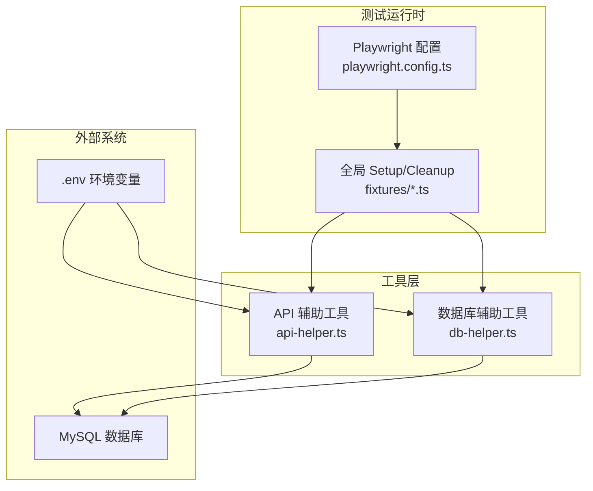
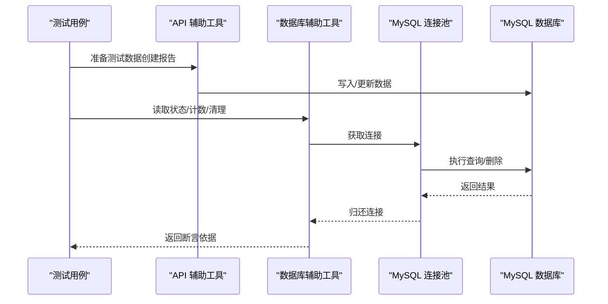
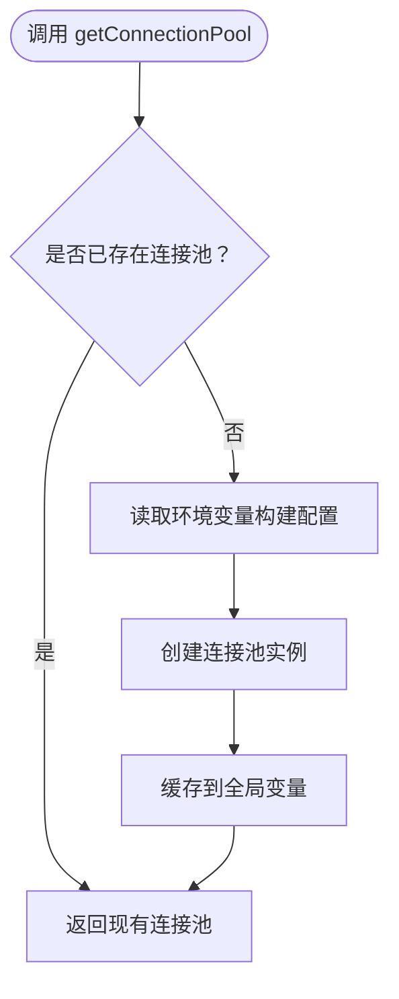
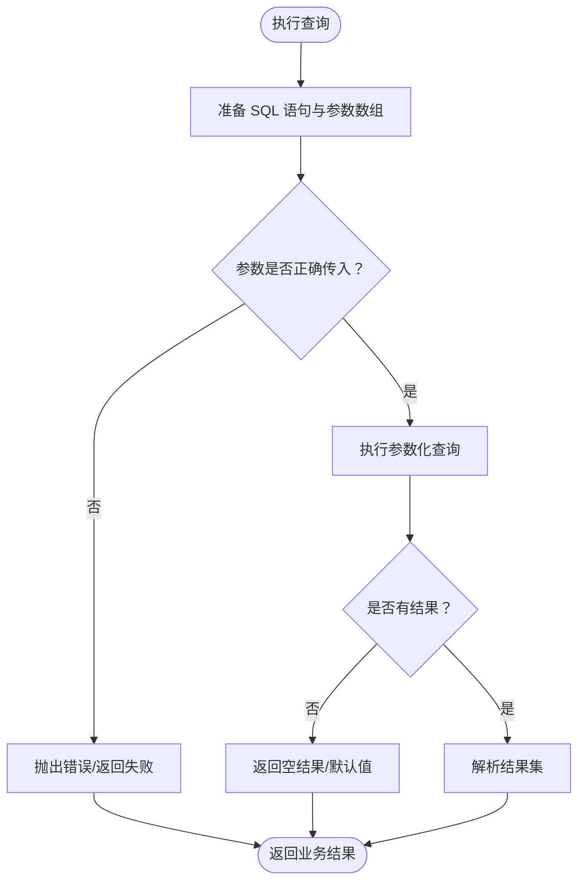
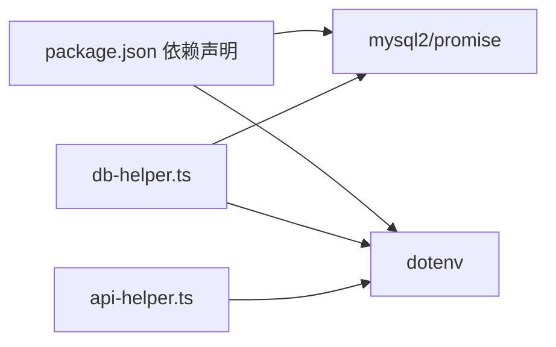

# 数据库辅助工具

<cite>
**本文引用的文件**
- [db-helper.ts](file://e2e-tests/utils/db-helper.ts)
- [api-helper.ts](file://e2e-tests/utils/api-helper.ts)
- [package.json](file://e2e-tests/package.json)
- [playwright.config.ts](file://e2e-tests/playwright.config.ts)
- [.gitignore](file://e2e-tests/.gitignore)
- [report-crud.spec.ts](file://e2e-tests/tests/regression/report-crud.spec.ts)
- [report-query.spec.ts](file://e2e-tests/tests/regression/report-query.spec.ts)
</cite>

## 目录
1. [简介](#简介)
2. [项目结构](#项目结构)
3. [核心组件](#核心组件)
4. [架构总览](#架构总览)
5. [详细组件分析](#详细组件分析)
6. [依赖关系分析](#依赖关系分析)
7. [性能考虑](#性能考虑)
8. [故障排查指南](#故障排查指南)
9. [结论](#结论)
10. [附录](#附录)

## 简介
本文件为数据库辅助工具模块的技术文档，聚焦于 e2e-tests/utils/db-helper.ts 的实现与使用，涵盖以下主题：
- 连接池配置、连接生命周期管理与资源释放策略
- 查询封装（CRUD 通用实现、参数化查询与 SQL 注入防护）
- 事务处理机制说明（当前实现未使用事务，建议与最佳实践）
- 完整示例场景（批量数据清理、复杂条件查询、状态校验）
- 性能优化策略（连接复用、查询缓存、索引优化）
- 数据一致性与迁移脚本管理建议

## 项目结构
数据库辅助工具位于 e2e-tests/utils/db-helper.ts，配合环境变量加载与测试运行配置共同工作。主要文件与职责如下：
- db-helper.ts：提供 MySQL 连接池、数据清理、状态查询等能力
- api-helper.ts：提供 API 访问上下文与测试数据准备/清理接口（间接影响数据库一致性）
- package.json：声明 mysql2 依赖与 Node 版本要求
- playwright.config.ts：定义测试项目与全局生命周期钩子（setup/cleanup）
- .gitignore：忽略 .env 等敏感文件
- 测试文件（如 report-crud.spec.ts、report-query.spec.ts）展示如何结合 API 与数据库进行端到端验证

**图表来源**
- [playwright.config.ts:1-68](file://e2e-tests/playwright.config.ts#L1-L68)
- [api-helper.ts:1-172](file://e2e-tests/utils/api-helper.ts#L1-L172)
- [db-helper.ts:1-91](file://e2e-tests/utils/db-helper.ts#L1-L91)

**章节来源**
- [playwright.config.ts:1-68](file://e2e-tests/playwright.config.ts#L1-L68)
- [package.json:1-27](file://e2e-tests/package.json#L1-L27)
- [.gitignore:1-10](file://e2e-tests/.gitignore#L1-L10)

## 核心组件
- 单例连接池：延迟初始化、可重复使用，避免频繁创建销毁连接
- 数据清理：支持按前缀清理、重置测试数据
- 查询封装：提供状态读取、计数统计等常用查询
- 资源释放：在全局 teardown 中关闭连接池，确保进程退出时资源回收

关键实现要点：
- 连接池配置来源于环境变量，包含主机、端口、用户、密码、数据库、等待队列与连接上限
- 所有查询均采用参数化占位符，有效防止 SQL 注入
- 提供关闭连接池函数，便于在测试结束时统一释放资源

**章节来源**
- [db-helper.ts:11-27](file://e2e-tests/utils/db-helper.ts#L11-L27)
- [db-helper.ts:33-43](file://e2e-tests/utils/db-helper.ts#L33-L43)
- [db-helper.ts:48-54](file://e2e-tests/utils/db-helper.ts#L48-L54)
- [db-helper.ts:59-67](file://e2e-tests/utils/db-helper.ts#L59-L67)
- [db-helper.ts:72-80](file://e2e-tests/utils/db-helper.ts#L72-L80)
- [db-helper.ts:85-90](file://e2e-tests/utils/db-helper.ts#L85-L90)

## 架构总览
数据库辅助工具在测试生命周期内与 API 辅助工具协同工作，通过连接池直接访问数据库，同时通过 API 接口准备/清理测试数据，确保端到端验证的一致性。

**图表来源**
- [api-helper.ts:83-121](file://e2e-tests/utils/api-helper.ts#L83-L121)
- [db-helper.ts:33-43](file://e2e-tests/utils/db-helper.ts#L33-L43)
- [db-helper.ts:59-67](file://e2e-tests/utils/db-helper.ts#L59-L67)
- [db-helper.ts:72-80](file://e2e-tests/utils/db-helper.ts#L72-L80)

## 详细组件分析

### 连接池与生命周期管理
- 单例模式：首次调用时创建连接池，后续复用，避免重复初始化开销
- 配置项：主机、端口、用户、密码、数据库、等待队列、连接上限等
- 生命周期：在全局 teardown 中调用关闭函数，确保连接池优雅终止
- 环境变量：通过 dotenv 加载，支持本地与 CI 环境灵活配置

**图表来源**
- [db-helper.ts:11-27](file://e2e-tests/utils/db-helper.ts#L11-L27)

**章节来源**
- [db-helper.ts:11-27](file://e2e-tests/utils/db-helper.ts#L11-L27)
- [db-helper.ts:85-90](file://e2e-tests/utils/db-helper.ts#L85-L90)

### 查询封装与 SQL 注入防护
- 参数化查询：所有查询均使用占位符与参数数组，避免字符串拼接引发注入风险
- 常用查询：
  - 按前缀清理：支持按患者姓名前缀批量删除
  - 重置测试数据：清理冒烟/回归测试相关数据
  - 状态读取：根据报告 ID 查询状态
  - 计数统计：按患者名统计报告数量

**图表来源**
- [db-helper.ts:33-43](file://e2e-tests/utils/db-helper.ts#L33-L43)
- [db-helper.ts:48-54](file://e2e-tests/utils/db-helper.ts#L48-L54)
- [db-helper.ts:59-67](file://e2e-tests/utils/db-helper.ts#L59-L67)
- [db-helper.ts:72-80](file://e2e-tests/utils/db-helper.ts#L72-L80)

**章节来源**
- [db-helper.ts:33-43](file://e2e-tests/utils/db-helper.ts#L33-L43)
- [db-helper.ts:48-54](file://e2e-tests/utils/db-helper.ts#L48-L54)
- [db-helper.ts:59-67](file://e2e-tests/utils/db-helper.ts#L59-L67)
- [db-helper.ts:72-80](file://e2e-tests/utils/db-helper.ts#L72-L80)

### 事务处理机制
- 当前实现：未使用显式事务（begin/commit/rollback）。所有操作为单条查询或简单删除
- 建议实践：
  - 对需要强一致性的复合操作（如批量插入后关联更新），应引入事务包裹
  - 在事务块内捕获异常并回滚，确保原子性
  - 将事务控制封装为独立函数，便于复用与测试
- 注意：事务会占用连接，需配合连接池合理配置与超时设置

[本节为概念性说明，不直接分析具体文件，故无“章节来源”]

### 示例场景与最佳实践

- 批量数据清理
  - 场景：按前缀批量删除测试数据，避免残留影响后续测试
  - 实现：调用按前缀清理函数，内部执行参数化 DELETE
  - 参考路径：[db-helper.ts:48-54](file://e2e-tests/utils/db-helper.ts#L48-L54)

- 复杂查询与状态校验
  - 场景：验证报告状态是否符合预期（如从数据库直接读取）
  - 实现：通过参数化查询读取状态字段，返回给测试断言
  - 参考路径：[db-helper.ts:59-67](file://e2e-tests/utils/db-helper.ts#L59-L67)

- 数据一致性保障
  - 场景：端到端测试中，先通过 API 写入数据，再通过数据库工具读取验证
  - 实现：API 辅助工具负责创建/更新，数据库工具负责读取/清理
  - 参考路径：
    - [api-helper.ts:83-121](file://e2e-tests/utils/api-helper.ts#L83-L121)
    - [db-helper.ts:59-67](file://e2e-tests/utils/db-helper.ts#L59-L67)

**章节来源**
- [db-helper.ts:48-54](file://e2e-tests/utils/db-helper.ts#L48-L54)
- [db-helper.ts:59-67](file://e2e-tests/utils/db-helper.ts#L59-L67)
- [api-helper.ts:83-121](file://e2e-tests/utils/api-helper.ts#L83-L121)

## 依赖关系分析
- 运行时依赖：mysql2/promise 提供异步连接池；dotenv 支持环境变量加载
- 版本要求：Node >= 18；mysql2 ^3.9.0
- 项目集成：通过 playwright.config.ts 的全局 setup/cleanup 与 fixtures 控制数据库工具的生命周期

**图表来源**
- [package.json:17-25](file://e2e-tests/package.json#L17-L25)
- [db-helper.ts:1](file://e2e-tests/utils/db-helper.ts#L1)
- [api-helper.ts:1](file://e2e-tests/utils/api-helper.ts#L1)

**章节来源**
- [package.json:17-25](file://e2e-tests/package.json#L17-L25)
- [playwright.config.ts:31-66](file://e2e-tests/playwright.config.ts#L31-L66)

## 性能考虑
- 连接复用：使用单例连接池，避免频繁创建/销毁连接带来的开销
- 并发控制：合理设置连接上限与等待队列，避免请求堆积导致超时
- 查询优化：
  - 为高频查询字段建立合适索引（如 patient_name、id、status）
  - 使用参数化查询减少解析与编译成本
- 缓存策略：对稳定不变的静态数据可考虑应用层缓存，但需注意与数据库一致性权衡
- I/O 优化：批量清理与查询尽量合并为单条语句，减少往返次数

[本节为通用性能指导，不直接分析具体文件，故无“章节来源”]

## 故障排查指南
- 连接失败
  - 检查环境变量是否正确加载（主机、端口、用户、密码、数据库）
  - 确认连接池未被提前关闭（全局 teardown 后不应再次使用）
  - 参考路径：[db-helper.ts:14-23](file://e2e-tests/utils/db-helper.ts#L14-L23)，[db-helper.ts:85-90](file://e2e-tests/utils/db-helper.ts#L85-L90)

- 查询异常
  - 确认 SQL 语句与参数数组一一对应，避免参数缺失或类型不匹配
  - 对返回结果进行空值检查后再访问字段
  - 参考路径：[db-helper.ts:59-67](file://e2e-tests/utils/db-helper.ts#L59-L67)，[db-helper.ts:72-80](file://e2e-tests/utils/db-helper.ts#L72-L80)

- 资源泄漏
  - 确保在全局 teardown 中调用关闭连接池函数
  - 参考路径：[db-helper.ts:85-90](file://e2e-tests/utils/db-helper.ts#L85-L90)

**章节来源**
- [db-helper.ts:14-23](file://e2e-tests/utils/db-helper.ts#L14-L23)
- [db-helper.ts:59-67](file://e2e-tests/utils/db-helper.ts#L59-L67)
- [db-helper.ts:72-80](file://e2e-tests/utils/db-helper.ts#L72-L80)
- [db-helper.ts:85-90](file://e2e-tests/utils/db-helper.ts#L85-L90)

## 结论
数据库辅助工具以单例连接池为核心，提供轻量级的数据清理与查询能力，配合 API 工具实现端到端验证。当前实现强调参数化查询与资源释放，具备良好的安全性和可维护性。建议在需要强一致性的场景引入事务封装，并结合索引与缓存策略进一步提升性能与稳定性。

[本节为总结性内容，不直接分析具体文件，故无“章节来源”]

## 附录

### 环境变量与配置
- 环境变量加载：通过 dotenv.config() 从 .env 文件读取
- 常用变量：DB_HOST、DB_PORT、DB_USER、DB_PASSWORD、DB_NAME
- 参考路径：[db-helper.ts:4](file://e2e-tests/utils/db-helper.ts#L4)，[db-helper.ts:14-19](file://e2e-tests/utils/db-helper.ts#L14-L19)

**章节来源**
- [db-helper.ts:4](file://e2e-tests/utils/db-helper.ts#L4)
- [db-helper.ts:14-19](file://e2e-tests/utils/db-helper.ts#L14-L19)

### 测试生命周期与数据准备
- 全局 setup/cleanup：通过 playwright.config.ts 的项目配置与 fixtures 控制
- 数据准备：API 辅助工具负责创建测试数据，数据库工具负责清理与验证
- 参考路径：
  - [playwright.config.ts:31-66](file://e2e-tests/playwright.config.ts#L31-L66)
  - [api-helper.ts:83-121](file://e2e-tests/utils/api-helper.ts#L83-L121)
  - [report-crud.spec.ts:33-43](file://e2e-tests/tests/regression/report-crud.spec.ts#L33-L43)
  - [report-query.spec.ts:8-42](file://e2e-tests/tests/regression/report-query.spec.ts#L8-L42)

**章节来源**
- [playwright.config.ts:31-66](file://e2e-tests/playwright.config.ts#L31-L66)
- [api-helper.ts:83-121](file://e2e-tests/utils/api-helper.ts#L83-L121)
- [report-crud.spec.ts:33-43](file://e2e-tests/tests/regression/report-crud.spec.ts#L33-L43)
- [report-query.spec.ts:8-42](file://e2e-tests/tests/regression/report-query.spec.ts#L8-L42)