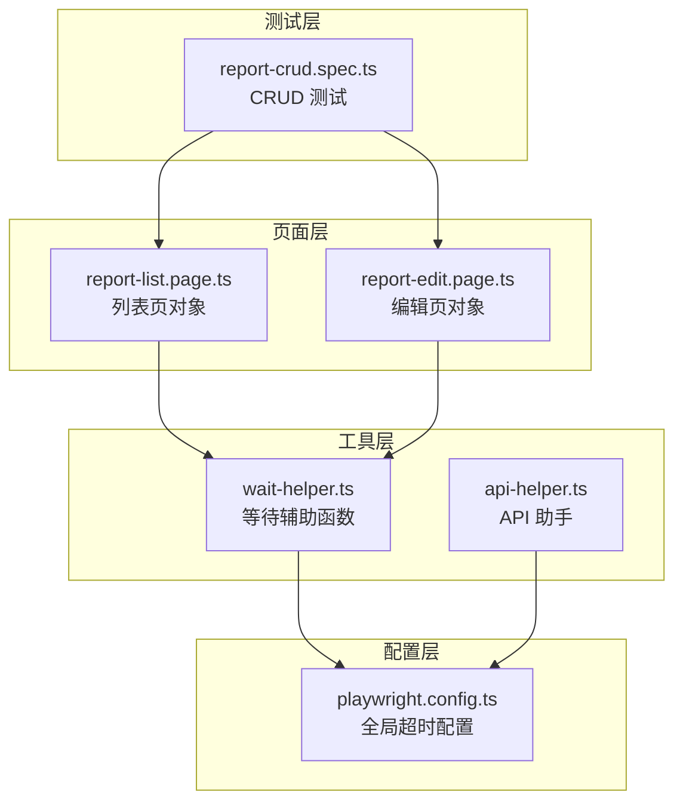
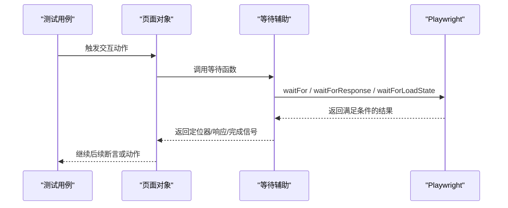
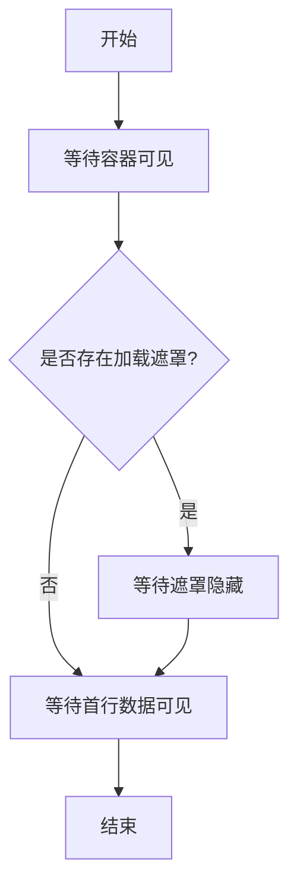
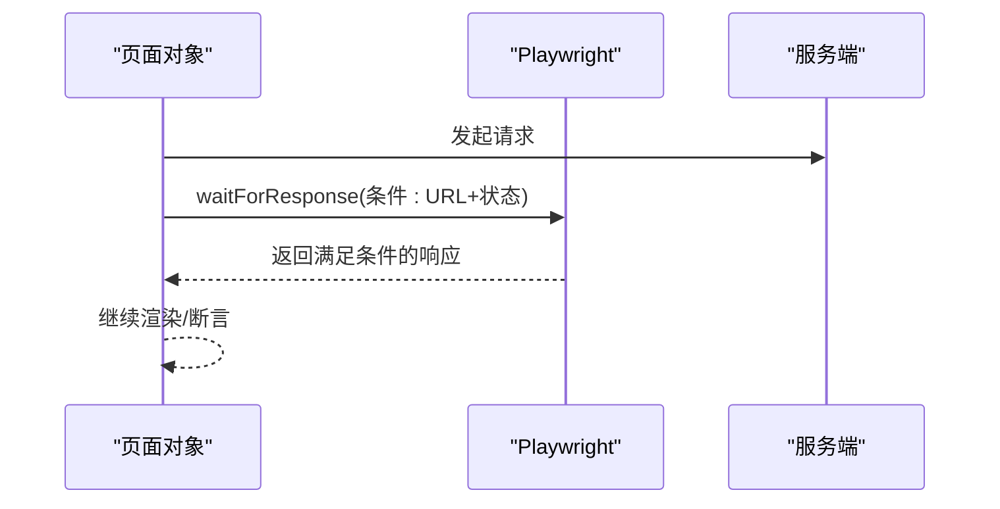
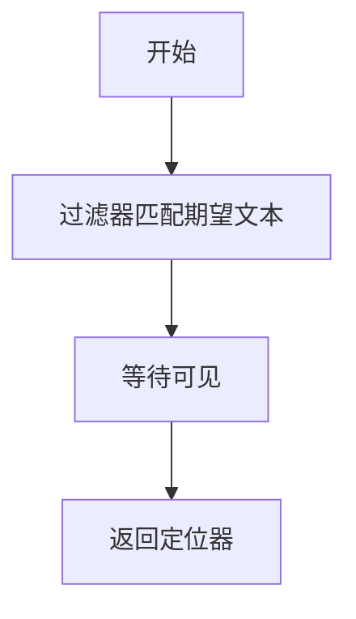
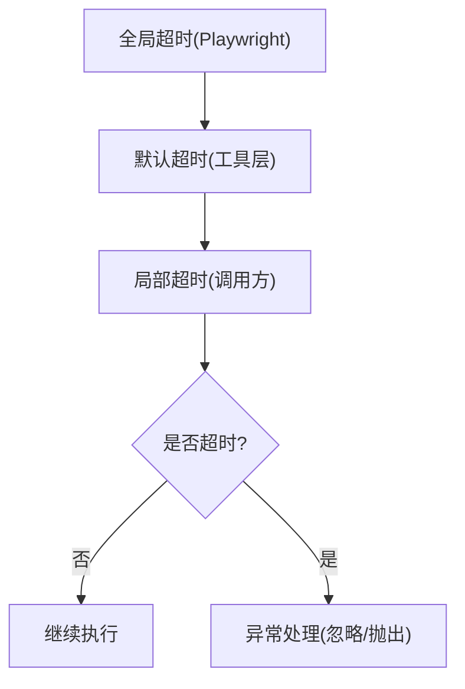
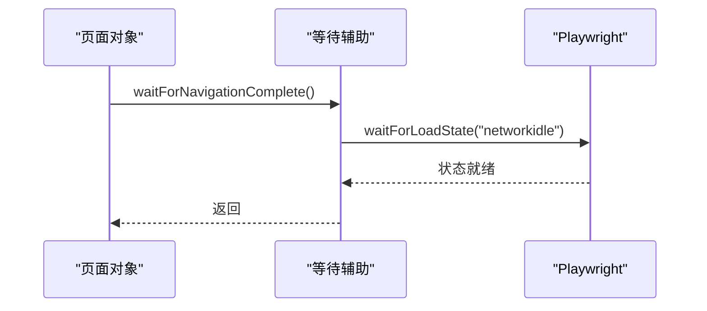
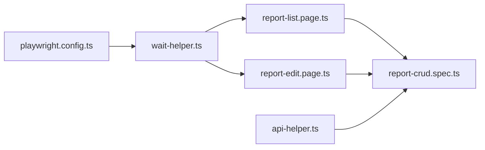

# 等待辅助工具

<cite>
**本文引用的文件**
- [wait-helper.ts](file://e2e-tests/utils/wait-helper.ts)
- [report-list.page.ts](file://e2e-tests/pages/report-list.page.ts)
- [report-edit.page.ts](file://e2e-tests/pages/report-edit.page.ts)
- [report-crud.spec.ts](file://e2e-tests/tests/regression/report-crud.spec.ts)
- [playwright.config.ts](file://e2e-tests/playwright.config.ts)
- [api-helper.ts](file://e2e-tests/utils/api-helper.ts)
</cite>

## 目录
1. [简介](#简介)
2. [项目结构](#项目结构)
3. [核心组件](#核心组件)
4. [架构总览](#架构总览)
5. [详细组件分析](#详细组件分析)
6. [依赖关系分析](#依赖关系分析)
7. [性能考量](#性能考量)
8. [故障排查指南](#故障排查指南)
9. [结论](#结论)
10. [附录](#附录)

## 简介
本文件面向等待辅助工具模块，系统性解析 wait-helper.ts 中等待策略的实现与最佳实践，覆盖同步等待、异步等待与条件等待三类策略；详解超时处理机制（全局与局部）、超时异常处理；阐述动态等待（元素可见性、页面加载状态、网络请求）的实现要点；给出显式等待、隐式等待与自适应等待的使用范式；并从性能与可维护性角度提出优化建议与扩展指南。

## 项目结构
等待辅助工具位于 utils 目录，配套页面对象与测试用例在 pages 与 tests 目录中广泛使用。Playwright 全局超时配置在 playwright.config.ts 中集中管理。

图表来源
- [wait-helper.ts:1-107](file://e2e-tests/utils/wait-helper.ts#L1-L107)
- [report-list.page.ts:1-130](file://e2e-tests/pages/report-list.page.ts#L1-L130)
- [report-edit.page.ts:1-94](file://e2e-tests/pages/report-edit.page.ts#L1-L94)
- [report-crud.spec.ts:1-122](file://e2e-tests/tests/regression/report-crud.spec.ts#L1-L122)
- [playwright.config.ts:1-68](file://e2e-tests/playwright.config.ts#L1-L68)
- [api-helper.ts:1-172](file://e2e-tests/utils/api-helper.ts#L1-L172)

章节来源
- [playwright.config.ts:1-68](file://e2e-tests/playwright.config.ts#L1-L68)

## 核心组件
- 表格加载完成等待：基于容器可见、加载遮罩隐藏、首行数据可见的多阶段等待。
- Toast/消息提示等待：基于文本可见的显式等待。
- API 响应等待：基于响应 URL 匹配与状态码过滤的条件等待。
- SPA 导航完成等待：基于网络空闲的页面加载状态等待。
- 操作重试包装器：对不稳定操作进行有限次数的延迟重试。
- 文本内容等待：基于过滤器匹配的元素可见等待。
- 默认超时常量：统一的默认超时值，便于全局一致性。

章节来源
- [wait-helper.ts:1-107](file://e2e-tests/utils/wait-helper.ts#L1-L107)

## 架构总览
等待辅助工具围绕 Playwright 的 waitFor、waitForResponse、waitForLoadState 等原语构建，形成“显式等待 + 条件等待 + 重试”的组合策略，贯穿页面对象与测试用例，确保端到端流程的稳定性与可重复性。

图表来源
- [wait-helper.ts:1-107](file://e2e-tests/utils/wait-helper.ts#L1-L107)
- [report-list.page.ts:1-130](file://e2e-tests/pages/report-list.page.ts#L1-L130)
- [report-edit.page.ts:1-94](file://e2e-tests/pages/report-edit.page.ts#L1-L94)

## 详细组件分析

### 同步等待策略
- 表格加载完成等待：先等待表格容器可见，再尝试等待加载遮罩隐藏（若存在），最后等待首行数据可见。该策略通过“可见性 + 可见性”保证 DOM 结构稳定与数据呈现。
- 页面导航等待：等待页面达到 networkidle 状态，确保 SPA 路由切换与资源加载完成。
- 文本内容等待：通过过滤器匹配目标文本并等待其可见，适合断言动态文案出现。

图表来源
- [wait-helper.ts:8-23](file://e2e-tests/utils/wait-helper.ts#L8-L23)

章节来源
- [wait-helper.ts:8-23](file://e2e-tests/utils/wait-helper.ts#L8-L23)

### 异步等待策略
- API 响应等待：基于 URL 模式匹配与状态码过滤，等待特定接口返回。该策略避免盲目 sleep，精准等待网络请求完成。
- 页面对象中的 API 等待：在搜索、筛选、翻页等交互后，等待对应 API 返回，确保 UI 与后端数据一致。

图表来源
- [wait-helper.ts:41-58](file://e2e-tests/utils/wait-helper.ts#L41-L58)
- [report-list.page.ts:42-49](file://e2e-tests/pages/report-list.page.ts#L42-L49)
- [report-list.page.ts:54-60](file://e2e-tests/pages/report-list.page.ts#L54-L60)
- [report-list.page.ts:116-121](file://e2e-tests/pages/report-list.page.ts#L116-L121)

章节来源
- [wait-helper.ts:41-58](file://e2e-tests/utils/wait-helper.ts#L41-L58)
- [report-list.page.ts:34-49](file://e2e-tests/pages/report-list.page.ts#L34-L49)
- [report-list.page.ts:54-60](file://e2e-tests/pages/report-list.page.ts#L54-L60)
- [report-list.page.ts:116-121](file://e2e-tests/pages/report-list.page.ts#L116-L121)

### 条件等待策略
- Toast/消息提示等待：基于文本可见的条件等待，确保用户反馈及时出现。
- 文本内容等待：通过过滤器匹配期望文本并等待可见，适合断言动态内容更新。

图表来源
- [wait-helper.ts:28-36](file://e2e-tests/utils/wait-helper.ts#L28-L36)
- [wait-helper.ts:97-106](file://e2e-tests/utils/wait-helper.ts#L97-L106)

章节来源
- [wait-helper.ts:28-36](file://e2e-tests/utils/wait-helper.ts#L28-L36)
- [wait-helper.ts:97-106](file://e2e-tests/utils/wait-helper.ts#L97-L106)

### 超时处理机制
- 全局超时配置：Playwright 全局测试超时与 expect 超时在配置文件中集中设定，作为默认兜底。
- 局部超时设置：等待辅助函数均支持传入 timeout 参数，实现细粒度控制。
- 超时异常处理：部分等待（如加载遮罩）采用 catch 忽略超时，避免误报；其余等待在超时时抛出异常，促使上层处理。

图表来源
- [playwright.config.ts:8-11](file://e2e-tests/playwright.config.ts#L8-L11)
- [wait-helper.ts:3](file://e2e-tests/utils/wait-helper.ts#L3)
- [wait-helper.ts:18](file://e2e-tests/utils/wait-helper.ts#L18)

章节来源
- [playwright.config.ts:8-11](file://e2e-tests/playwright.config.ts#L8-L11)
- [wait-helper.ts:3](file://e2e-tests/utils/wait-helper.ts#L3)
- [wait-helper.ts:18](file://e2e-tests/utils/wait-helper.ts#L18)

### 动态等待实现
- 元素可见性检测：通过 waitFor({ state: 'visible' }) 等原语等待元素进入可见状态。
- 页面加载状态监控：通过 waitForLoadState('networkidle') 等待网络空闲，适配 SPA 路由切换。
- 网络请求完成判断：通过 waitForResponse 过滤 URL 与状态码，确保关键请求完成后再继续。

图表来源
- [wait-helper.ts:63-68](file://e2e-tests/utils/wait-helper.ts#L63-L68)
- [report-list.page.ts:34](file://e2e-tests/pages/report-list.page.ts#L34)

章节来源
- [wait-helper.ts:63-68](file://e2e-tests/utils/wait-helper.ts#L63-L68)
- [report-list.page.ts:34](file://e2e-tests/pages/report-list.page.ts#L34)

### 等待策略使用示例
- 显式等待：在页面对象中直接等待定位器可见，如列表页等待表格容器可见。
- 隐式等待：通过全局超时与默认超时，为所有等待提供统一的兜底时间。
- 自适应等待：结合 API 响应等待与页面加载等待，针对不同场景选择合适策略。

章节来源
- [report-list.page.ts:34-37](file://e2e-tests/pages/report-list.page.ts#L34-L37)
- [report-edit.page.ts:66-69](file://e2e-tests/pages/report-edit.page.ts#L66-L69)
- [report-crud.spec.ts:83](file://e2e-tests/tests/regression/report-crud.spec.ts#L83)

### 等待工具扩展与自定义
- 新增条件等待：参考 API 响应等待的模式，基于 URL/状态/响应体字段构造自定义过滤条件。
- 新增页面状态等待：参考导航完成等待，扩展更多 loadState 场景（如 domcontentloaded）。
- 新增重试策略：在现有重试包装器基础上，增加指数退避、并发控制等高级特性。

章节来源
- [wait-helper.ts:41-58](file://e2e-tests/utils/wait-helper.ts#L41-L58)
- [wait-helper.ts:63-68](file://e2e-tests/utils/wait-helper.ts#L63-L68)
- [wait-helper.ts:74-92](file://e2e-tests/utils/wait-helper.ts#L74-L92)

## 依赖关系分析
- 工具层依赖 Playwright 的等待原语，向上提供稳定的等待 API。
- 页面对象依赖等待工具与 Playwright 定位器，向下封装业务交互。
- 测试用例依赖页面对象，间接使用等待工具。
- 配置层提供全局超时，影响所有等待行为。

图表来源
- [playwright.config.ts:1-68](file://e2e-tests/playwright.config.ts#L1-L68)
- [wait-helper.ts:1-107](file://e2e-tests/utils/wait-helper.ts#L1-L107)
- [report-list.page.ts:1-130](file://e2e-tests/pages/report-list.page.ts#L1-L130)
- [report-edit.page.ts:1-94](file://e2e-tests/pages/report-edit.page.ts#L1-L94)
- [report-crud.spec.ts:1-122](file://e2e-tests/tests/regression/report-crud.spec.ts#L1-L122)
- [api-helper.ts:1-172](file://e2e-tests/utils/api-helper.ts#L1-L172)

章节来源
- [playwright.config.ts:1-68](file://e2e-tests/playwright.config.ts#L1-L68)
- [wait-helper.ts:1-107](file://e2e-tests/utils/wait-helper.ts#L1-L107)
- [report-list.page.ts:1-130](file://e2e-tests/pages/report-list.page.ts#L1-L130)
- [report-edit.page.ts:1-94](file://e2e-tests/pages/report-edit.page.ts#L1-L94)
- [report-crud.spec.ts:1-122](file://e2e-tests/tests/regression/report-crud.spec.ts#L1-L122)
- [api-helper.ts:1-172](file://e2e-tests/utils/api-helper.ts#L1-L172)

## 性能考量
- 合理设置等待时间：优先使用条件等待替代固定 sleep，减少不必要的等待；对长耗时场景使用局部超时参数。
- 等待轮询效率：尽量使用更精确的条件（如 API 响应）而非宽泛的页面状态；在高频交互场景中合并等待步骤。
- 重试策略权衡：重试次数与延迟需平衡稳定性与执行时长；对幂等操作可放宽重试，对非幂等操作谨慎重试。
- 并发与隔离：避免多个等待同时竞争同一资源；必要时使用独立上下文或隔离环境。

## 故障排查指南
- 超时异常：检查全局与局部超时设置是否过短；确认等待条件是否过于严格；必要时扩大超时或放宽条件。
- 间歇性失败：引入重试包装器；对不稳定步骤（如点击确认弹窗）增加重试与容错。
- 条件不匹配：核对 URL 模式、状态码与响应体字段；确保正则表达式或字符串匹配逻辑正确。
- 页面状态不一致：在路由切换后使用导航完成等待；在数据刷新后使用 API 响应等待。

章节来源
- [wait-helper.ts:74-92](file://e2e-tests/utils/wait-helper.ts#L74-L92)
- [report-crud.spec.ts:83](file://e2e-tests/tests/regression/report-crud.spec.ts#L83)

## 结论
等待辅助工具通过“显式 + 条件 + 重试”的策略组合，有效提升了端到端测试的稳定性与可维护性。配合 Playwright 的原生等待能力与合理的超时配置，能够在保证质量的同时兼顾执行效率。建议在实际项目中根据场景选择合适的等待策略，并持续优化等待条件与重试策略，以获得更好的测试体验。

## 附录
- 使用建议清单
  - 优先使用 API 响应等待与导航完成等待，避免固定 sleep。
  - 对易失败的交互步骤增加重试包装器。
  - 在页面对象中封装常用等待，保持测试用例简洁。
  - 定期评估全局与局部超时，避免过长或过短。
- 扩展清单
  - 新增更多条件等待（如下载完成、上传进度）。
  - 支持更灵活的重试策略（指数退避、取消重试）。
  - 封装常见等待模式（如“列表刷新完成”“弹窗关闭”）。