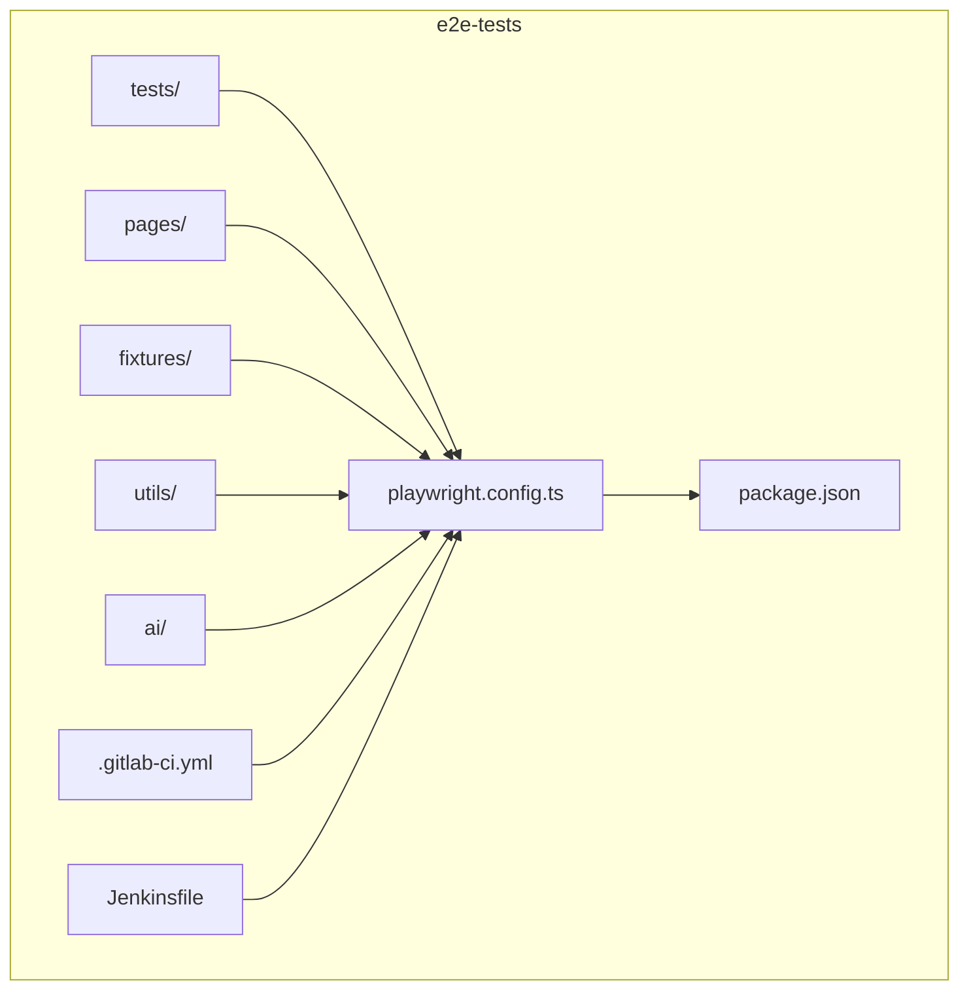
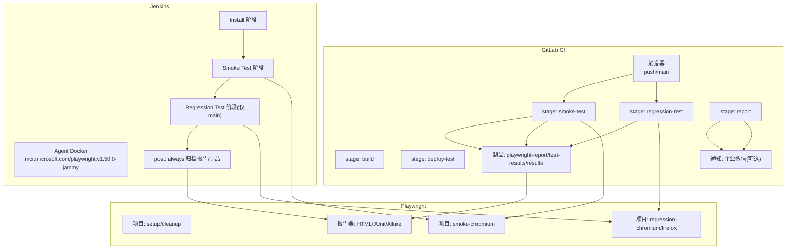
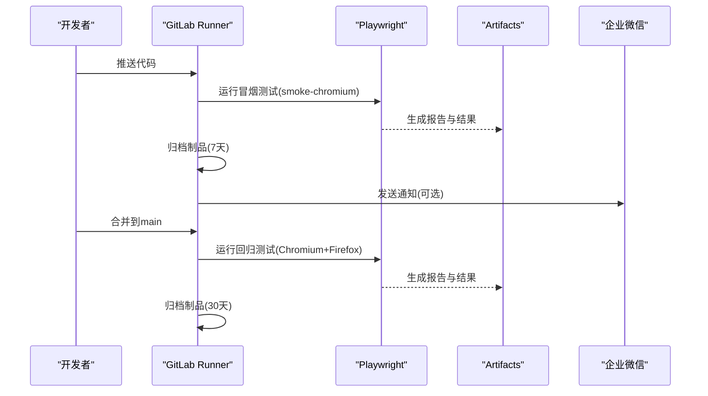
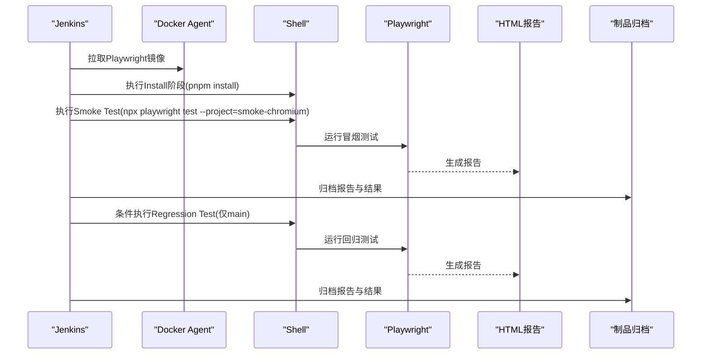
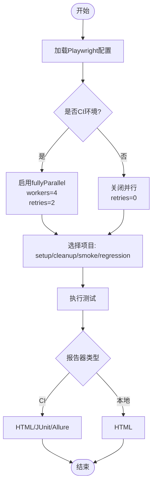
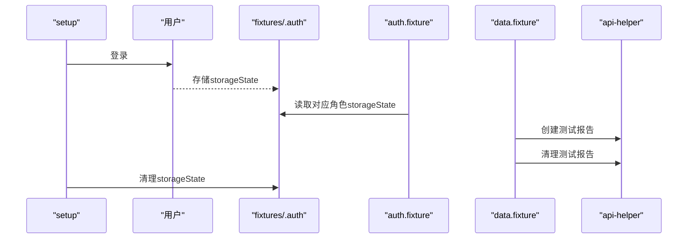
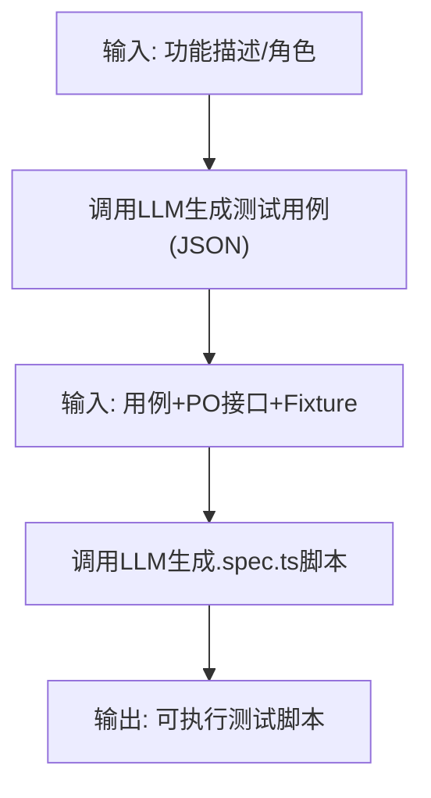
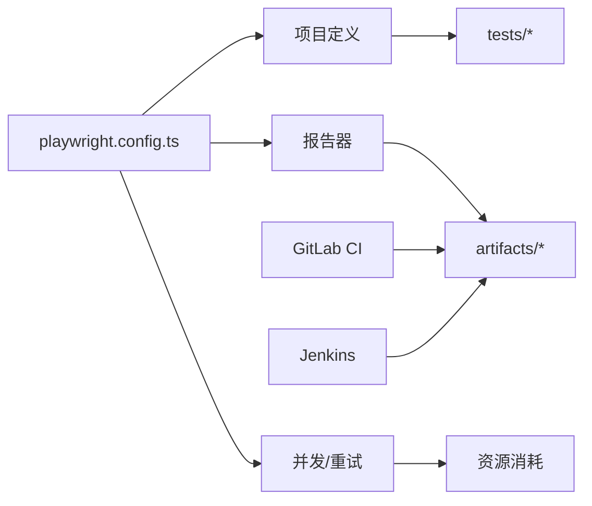

# CI/CD集成

<cite>
**本文引用的文件**
- [.gitlab-ci.yml](file://e2e-tests/.gitlab-ci.yml)
- [Jenkinsfile](file://e2e-tests/Jenkinsfile)
- [package.json](file://e2e-tests/package.json)
- [playwright.config.ts](file://e2e-tests/playwright.config.ts)
- [login.spec.ts](file://e2e-tests/tests/smoke/login.spec.ts)
- [auth.setup.ts](file://e2e-tests/fixtures/auth.setup.ts)
- [auth.fixture.ts](file://e2e-tests/fixtures/auth.fixture.ts)
- [api-helper.ts](file://e2e-tests/utils/api-helper.ts)
- [report-crud.spec.ts](file://e2e-tests/tests/regression/report-crud.spec.ts)
- [login.page.ts](file://e2e-tests/pages/login.page.ts)
- [data.fixture.ts](file://e2e-tests/fixtures/data.fixture.ts)
- [tsconfig.json](file://e2e-tests/tsconfig.json)
- [script-generator.ts](file://e2e-tests/ai/script-generator.ts)
- [test-generator.ts](file://e2e-tests/ai/test-generator.ts)
- [auth.teardown.ts](file://e2e-tests/fixtures/auth.teardown.ts)
</cite>

## 目录
1. [简介](#简介)
2. [项目结构](#项目结构)
3. [核心组件](#核心组件)
4. [架构总览](#架构总览)
5. [详细组件分析](#详细组件分析)
6. [依赖关系分析](#依赖关系分析)
7. [性能考量](#性能考量)
8. [故障排除指南](#故障排除指南)
9. [结论](#结论)
10. [附录](#附录)

## 简介
本指南面向DevOps工程师与测试工程师，提供基于GitLab CI与Jenkins的端到端自动化测试（E2E）CI/CD集成实施指南。文档围绕以下目标展开：
- GitLab CI流水线设计：构建、冒烟测试、回归测试、报告归档与通知
- Jenkins集成：阶段化安装、冒烟与回归测试、报告与制品归档
- Playwright测试调度、并行执行与资源管理
- 测试数据准备与清理、API辅助工具与环境变量管理
- 密钥安全与部署策略建议
- 监控、故障排除与性能优化

## 项目结构
本仓库采用“特性+层”混合组织方式，核心目录与职责如下：
- e2e-tests：端到端测试工程，包含测试用例、页面对象、夹具、工具与CI配置
  - tests：按套件组织的测试用例（smoke与regression）
  - pages：页面对象封装
  - fixtures：登录态夹具与数据夹具
  - utils：API辅助工具
  - ai：AI驱动的测试用例与脚本生成工具
  - playwright.config.ts：Playwright配置（项目、报告器、并发与重试等）
  - package.json：脚本与依赖
  - .gitlab-ci.yml：GitLab流水线
  - Jenkinsfile：Jenkins流水线

图表来源
- [playwright.config.ts:1-68](file://e2e-tests/playwright.config.ts#L1-L68)
- [.gitlab-ci.yml:1-67](file://e2e-tests/.gitlab-ci.yml#L1-L67)
- [Jenkinsfile:1-59](file://e2e-tests/Jenkinsfile#L1-L59)

章节来源
- [playwright.config.ts:1-68](file://e2e-tests/playwright.config.ts#L1-L68)
- [.gitlab-ci.yml:1-67](file://e2e-tests/.gitlab-ci.yml#L1-L67)
- [Jenkinsfile:1-59](file://e2e-tests/Jenkinsfile#L1-L59)

## 核心组件
- Playwright配置与项目
  - 项目定义：setup、cleanup、smoke-chromium、regression-chromium、regression-firefox
  - 并发与重试：CI环境下启用并行与重试，本地开发关闭
  - 报告器：CI环境下输出HTML、JUnit与Allure；本地仅HTML
  - 基础URL：从环境变量读取，支持不同环境
- 测试用例与页面对象
  - 冒烟测试：登录场景验证
  - 回归测试：CRUD与工作流场景
  - 页面对象：Login、Report等页面交互封装
- 夹具与数据准备
  - 登录态夹具：按角色注入storageState
  - 数据夹具：自动创建/清理测试数据
- API辅助工具
  - 管理员身份认证上下文、报告创建/更新/删除、批量清理
- CI配置
  - GitLab：多阶段流水线、制品归档、通知
  - Jenkins：Docker Agent、阶段化执行、报告与制品归档

章节来源
- [playwright.config.ts:31-66](file://e2e-tests/playwright.config.ts#L31-L66)
- [login.spec.ts:1-25](file://e2e-tests/tests/smoke/login.spec.ts#L1-L25)
- [report-crud.spec.ts:1-122](file://e2e-tests/tests/regression/report-crud.spec.ts#L1-L122)
- [login.page.ts:1-52](file://e2e-tests/pages/login.page.ts#L1-L52)
- [auth.fixture.ts:1-40](file://e2e-tests/fixtures/auth.fixture.ts#L1-L40)
- [data.fixture.ts:1-57](file://e2e-tests/fixtures/data.fixture.ts#L1-L57)
- [api-helper.ts:1-172](file://e2e-tests/utils/api-helper.ts#L1-L172)
- [.gitlab-ci.yml:1-67](file://e2e-tests/.gitlab-ci.yml#L1-L67)
- [Jenkinsfile:1-59](file://e2e-tests/Jenkinsfile#L1-L59)

## 架构总览
下图展示CI/CD在GitLab与Jenkins中的执行路径、测试运行与报告产出。

图表来源
- [.gitlab-ci.yml:1-67](file://e2e-tests/.gitlab-ci.yml#L1-L67)
- [Jenkinsfile:1-59](file://e2e-tests/Jenkinsfile#L1-L59)
- [playwright.config.ts:31-66](file://e2e-tests/playwright.config.ts#L31-L66)

## 详细组件分析

### GitLab CI流水线设计
- 阶段划分
  - build：镜像拉取与准备（由Playwright镜像完成）
  - deploy-test：部署测试环境（占位，当前未实现具体步骤）
  - smoke-test：冒烟测试（Chromium）
  - regression-test：回归测试（Chromium + Firefox）
  - report：报告归档与通知
- 触发规则
  - 冒烟测试：push事件触发
  - 回归测试：main分支触发
- 制品归档
  - playwright-report、test-results、results
  - 归档保留期：冒烟7天，回归30天
- 通知机制
  - 通过Webhook发送Markdown消息至企业微信（可配置）

图表来源
- [.gitlab-ci.yml:11-67](file://e2e-tests/.gitlab-ci.yml#L11-L67)
- [playwright.config.ts:16-22](file://e2e-tests/playwright.config.ts#L16-L22)

章节来源
- [.gitlab-ci.yml:1-67](file://e2e-tests/.gitlab-ci.yml#L1-L67)

### Jenkins流水线设计
- Agent与环境
  - Docker Agent：mcr.microsoft.com/playwright:v1.50.0-jammy
  - 环境变量：BASE_URL
- 阶段
  - Install：安装依赖（pnpm）
  - Smoke Test：执行smoke-chromium
  - Regression Test：仅main分支执行regression-chromium与regression-firefox
- 结果处理
  - post.always：发布HTML报告、归档test-results与results
  - post.failure：失败时输出日志（可扩展钉钉/企业微信通知）

图表来源
- [Jenkinsfile:1-59](file://e2e-tests/Jenkinsfile#L1-L59)
- [playwright.config.ts:16-22](file://e2e-tests/playwright.config.ts#L16-L22)

章节来源
- [Jenkinsfile:1-59](file://e2e-tests/Jenkinsfile#L1-L59)

### Playwright测试调度与并行执行
- 项目与依赖
  - setup/cleanup：准备与清理登录态
  - smoke-chromium：冒烟测试专用
  - regression-chromium/firefox：跨浏览器回归
- 并发与重试
  - CI环境：fullyParallel开启，workers=4，retries=2
  - 本地：关闭并行与重试，便于调试
- 报告器
  - CI：HTML、JUnit、Allure；本地：HTML
- 基础URL
  - 从BASE_URL读取，支持不同环境

图表来源
- [playwright.config.ts:12-22](file://e2e-tests/playwright.config.ts#L12-L22)
- [playwright.config.ts:31-66](file://e2e-tests/playwright.config.ts#L31-L66)

章节来源
- [playwright.config.ts:12-22](file://e2e-tests/playwright.config.ts#L12-L22)
- [playwright.config.ts:31-66](file://e2e-tests/playwright.config.ts#L31-L66)

### 测试数据准备与清理
- 登录态准备
  - auth.setup.ts：按角色登录并存储storageState到fixtures/.auth
  - auth.teardown.ts：清理storageState文件
  - auth.fixture.ts：为doctor/auditor/admin注入已登录上下文
- 数据夹具
  - data.fixture.ts：自动创建不同状态的报告并在用例后清理
- API辅助
  - api-helper.ts：统一API上下文（含管理员鉴权）、创建/更新/删除/查询/清理

图表来源
- [auth.setup.ts:1-30](file://e2e-tests/fixtures/auth.setup.ts#L1-L30)
- [auth.teardown.ts:1-18](file://e2e-tests/fixtures/auth.teardown.ts#L1-L18)
- [auth.fixture.ts:1-40](file://e2e-tests/fixtures/auth.fixture.ts#L1-L40)
- [data.fixture.ts:1-57](file://e2e-tests/fixtures/data.fixture.ts#L1-L57)
- [api-helper.ts:1-172](file://e2e-tests/utils/api-helper.ts#L1-L172)

章节来源
- [auth.setup.ts:1-30](file://e2e-tests/fixtures/auth.setup.ts#L1-L30)
- [auth.teardown.ts:1-18](file://e2e-tests/fixtures/auth.teardown.ts#L1-L18)
- [auth.fixture.ts:1-40](file://e2e-tests/fixtures/auth.fixture.ts#L1-L40)
- [data.fixture.ts:1-57](file://e2e-tests/fixtures/data.fixture.ts#L1-L57)
- [api-helper.ts:1-172](file://e2e-tests/utils/api-helper.ts#L1-L172)

### AI驱动的测试用例与脚本生成
- test-generator.ts：输入功能描述，输出结构化测试用例JSON
- script-generator.ts：输入测试用例+PO接口+Fixture，输出可执行的.spec.ts脚本
- 依赖LLM：需配置LLM_API_URL、LLM_API_KEY、LLM_MODEL

图表来源
- [test-generator.ts:67-106](file://e2e-tests/ai/test-generator.ts#L67-L106)
- [script-generator.ts:63-109](file://e2e-tests/ai/script-generator.ts#L63-L109)

章节来源
- [test-generator.ts:1-107](file://e2e-tests/ai/test-generator.ts#L1-L107)
- [script-generator.ts:1-110](file://e2e-tests/ai/script-generator.ts#L1-L110)

## 依赖关系分析
- Playwright配置对测试与报告的影响
  - 项目定义决定测试集划分与执行顺序
  - 报告器影响制品与可视化
  - 并发与重试影响资源占用与稳定性
- CI配置对执行的影响
  - GitLab：阶段化与制品保留策略
  - Jenkins：Docker Agent与阶段化执行
- 工具链依赖
  - Playwright镜像版本固定，确保一致性
  - pnpm锁定依赖，保证可重复性

图表来源
- [playwright.config.ts:16-22](file://e2e-tests/playwright.config.ts#L16-L22)
- [.gitlab-ci.yml:19-46](file://e2e-tests/.gitlab-ci.yml#L19-L46)
- [Jenkinsfile:41-50](file://e2e-tests/Jenkinsfile#L41-L50)

章节来源
- [playwright.config.ts:16-22](file://e2e-tests/playwright.config.ts#L16-L22)
- [.gitlab-ci.yml:19-46](file://e2e-tests/.gitlab-ci.yml#L19-L46)
- [Jenkinsfile:41-50](file://e2e-tests/Jenkinsfile#L41-L50)

## 性能考量
- 并行与重试
  - CI环境启用并行与重试可提升稳定性，但会增加资源消耗
  - 建议根据Runner资源调整workers数量与retries
- 报告器选择
  - HTML适合快速定位问题；JUnit/Allure适合持续集成报告聚合
- 制品归档
  - 控制保留期，避免磁盘压力
- 网络与外部服务
  - LLM调用需考虑超时与重试；API调用需考虑鉴权与幂等
- 缓存与依赖
  - pnpm锁定文件与Playwright镜像缓存可显著缩短构建时间

## 故障排除指南
- 环境变量缺失
  - BASE_URL未设置导致页面访问失败
  - LLM相关变量未配置导致AI功能不可用
- 登录态问题
  - storageState过期或缺失导致用例失败
  - 确保setup与cleanup流程正确执行
- 报告与制品
  - Jenkins：确认HTML报告发布与制品归档步骤执行
  - GitLab：检查制品保留期与通知Webhook配置
- 并发冲突
  - 多浏览器并行时注意共享资源竞争（数据库、文件系统）
- API调用失败
  - 检查API_BASE_URL、鉴权头与网络连通性
  - 对幂等性不足的操作增加重试或去重逻辑

章节来源
- [playwright.config.ts:24-29](file://e2e-tests/playwright.config.ts#L24-L29)
- [api-helper.ts:45-77](file://e2e-tests/utils/api-helper.ts#L45-L77)
- [auth.setup.ts:18-28](file://e2e-tests/fixtures/auth.setup.ts#L18-L28)
- [auth.teardown.ts:7-17](file://e2e-tests/fixtures/auth.teardown.ts#L7-L17)
- [.gitlab-ci.yml:51-66](file://e2e-tests/.gitlab-ci.yml#L51-L66)
- [Jenkinsfile:41-56](file://e2e-tests/Jenkinsfile#L41-L56)

## 结论
本项目通过GitLab CI与Jenkins实现了端到端测试的自动化流水线，结合Playwright的项目化与报告器体系，提供了稳定可重复的测试执行与结果可视化。配合登录态与数据夹具、API辅助工具以及AI驱动的测试生成能力，能够高效支撑日常冒烟与回归测试，并为后续扩展（如更多浏览器、更多环境、更多报告器）提供良好基础。

## 附录

### 环境变量与密钥管理
- 必要变量
  - BASE_URL：前端或后端服务地址
  - API_BASE_URL：后端API地址（用于api-helper）
  - WECHAT_WEBHOOK_URL：企业微信通知Webhook（GitLab）
  - LLM_API_URL/LLM_API_KEY/LLM_MODEL：AI生成测试用例与脚本所需
- 安全建议
  - 将敏感变量配置在CI系统的受保护变量中
  - 限制Webhook URL的访问范围与权限
  - 定期轮换密钥与令牌

章节来源
- [playwright.config.ts:24-25](file://e2e-tests/playwright.config.ts#L24-L25)
- [api-helper.ts](file://e2e-tests/utils/api-helper.ts#L6)
- [.gitlab-ci.yml:55-63](file://e2e-tests/.gitlab-ci.yml#L55-L63)
- [test-generator.ts:5-7](file://e2e-tests/ai/test-generator.ts#L5-L7)
- [script-generator.ts:6-8](file://e2e-tests/ai/script-generator.ts#L6-L8)

### 部署策略与最佳实践
- GitLab
  - 将deploy-test阶段用于部署测试环境（占位，当前未实现）
  - 使用制品归档与通知机制闭环反馈
- Jenkins
  - 使用Docker Agent隔离环境
  - 在post阶段统一发布报告与归档制品
- 最佳实践
  - 明确冒烟与回归的触发策略
  - 控制并发度与重试次数，平衡速度与稳定性
  - 使用路径别名与模块化组织代码，提升可维护性

章节来源
- [.gitlab-ci.yml:1-67](file://e2e-tests/.gitlab-ci.yml#L1-L67)
- [Jenkinsfile:1-59](file://e2e-tests/Jenkinsfile#L1-L59)
- [tsconfig.json:14-20](file://e2e-tests/tsconfig.json#L14-L20)