# GitLab CI配置

<cite>
**本文档引用的文件**
- [.gitlab-ci.yml](file://e2e-tests/.gitlab-ci.yml)
- [package.json](file://e2e-tests/package.json)
- [playwright.config.ts](file://e2e-tests/playwright.config.ts)
- [Jenkinsfile](file://e2e-tests/Jenkinsfile)
- [login.spec.ts](file://e2e-tests/tests/smoke/login.spec.ts)
- [auth.setup.ts](file://e2e-tests/fixtures/auth.setup.ts)
- [auth.fixture.ts](file://e2e-tests/fixtures/auth.fixture.ts)
- [tsconfig.json](file://e2e-tests/tsconfig.json)
- [junit-report.xml](file://e2e-tests/results/junit-report.xml)
</cite>

## 更新摘要
**所做更改**
- 更新了测试执行效率优化部分，反映更高效的测试执行策略
- 新增了报告生成优化章节，详细介绍多格式报告生成机制
- 完善了Allure报告集成和Junit XML报告配置
- 增强了测试报告归档和通知机制的说明

## 目录
1. [简介](#简介)
2. [项目结构](#项目结构)
3. [核心组件](#核心组件)
4. [架构概览](#架构概览)
5. [详细组件分析](#详细组件分析)
6. [依赖关系分析](#依赖关系分析)
7. [性能考虑](#性能考虑)
8. [故障排除指南](#故障排除指南)
9. [结论](#结论)
10. [附录](#附录)

## 简介

本指南提供了针对医院体检报告管理系统端到端测试的GitLab CI配置完整实施指南。该配置基于Playwright框架，实现了从冒烟测试到回归测试的完整测试流水线，支持多浏览器并行执行、测试报告生成和通知集成。

项目采用现代化的测试架构，包含登录态管理、页面对象模式和AI辅助测试功能，通过GitLab CI实现自动化持续集成和部署。最新的配置优化显著提升了测试执行效率和报告生成能力。

## 项目结构

项目采用模块化组织结构，主要包含以下关键目录：

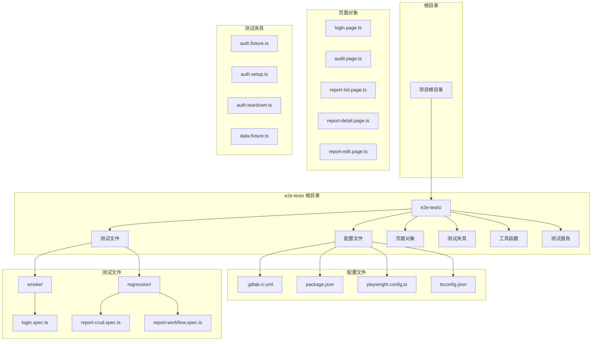

**图表来源**
- [.gitlab-ci.yml:1-67](file://e2e-tests/.gitlab-ci.yml#L1-L67)
- [playwright.config.ts:1-54](file://e2e-tests/playwright.config.ts#L1-L54)

**章节来源**
- [.gitlab-ci.yml:1-67](file://e2e-tests/.gitlab-ci.yml#L1-L67)
- [playwright.config.ts:1-54](file://e2e-tests/playwright.config.ts#L1-L54)

## 核心组件

### 流水线阶段定义

项目定义了五个核心阶段，每个阶段都有明确的职责和触发条件：

| 阶段名称 | 阶段编号 | 职责描述 | 触发条件 |
|---------|---------|---------|---------|
| build | 1 | 构建环境准备 | 所有提交 |
| deploy-test | 2 | 测试环境部署 | 所有提交 |
| smoke-test | 3 | 冒烟测试执行 | 推送事件 |
| regression-test | 4 | 回归测试执行 | 主分支推送 |
| report | 5 | 报告发布与通知 | 始终执行 |

### 作业配置

每个作业都配置了标准化的执行环境和输出：

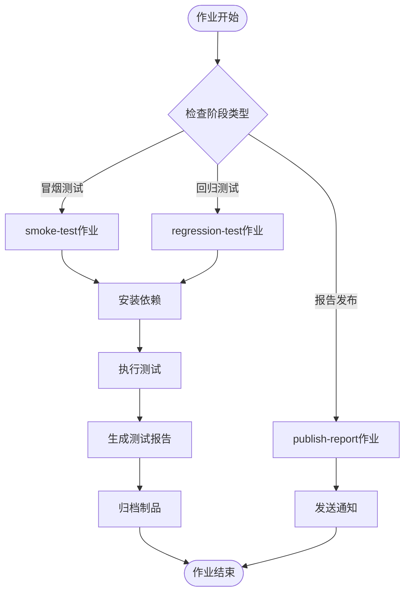

**图表来源**
- [.gitlab-ci.yml:12-67](file://e2e-tests/.gitlab-ci.yml#L12-L67)

**章节来源**
- [.gitlab-ci.yml:1-67](file://e2e-tests/.gitlab-ci.yml#L1-L67)

## 架构概览

### CI/CD流水线架构

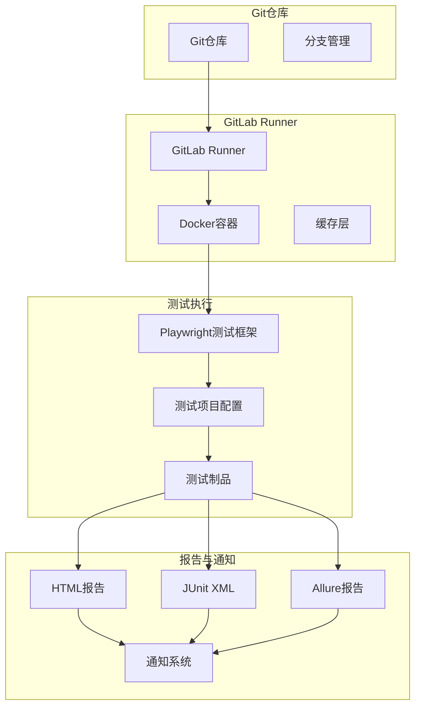

**图表来源**
- [.gitlab-ci.yml:1-67](file://e2e-tests/.gitlab-ci.yml#L1-L67)
- [playwright.config.ts:1-54](file://e2e-tests/playwright.config.ts#L1-L54)

### 测试项目架构

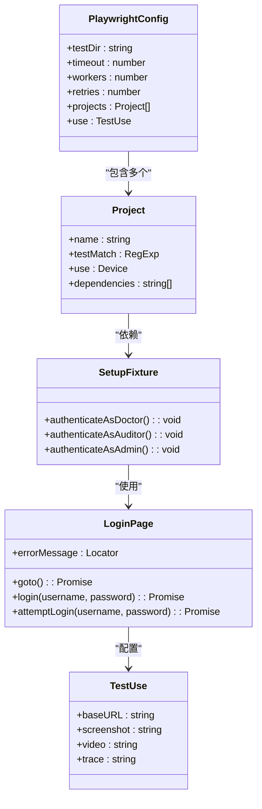

**图表来源**
- [playwright.config.ts:1-54](file://e2e-tests/playwright.config.ts#L1-L54)
- [auth.setup.ts:1-116](file://e2e-tests/fixtures/auth.setup.ts#L1-L116)
- [auth.fixture.ts:1-52](file://e2e-tests/fixtures/auth.fixture.ts#L1-L52)
- [login.spec.ts:1-178](file://e2e-tests/tests/smoke/login.spec.ts#L1-L178)

**章节来源**
- [playwright.config.ts:1-54](file://e2e-tests/playwright.config.ts#L1-L54)
- [auth.setup.ts:1-116](file://e2e-tests/fixtures/auth.setup.ts#L1-L116)
- [auth.fixture.ts:1-52](file://e2e-tests/fixtures/auth.fixture.ts#L1-L52)
- [login.spec.ts:1-178](file://e2e-tests/tests/smoke/login.spec.ts#L1-L178)

## 详细组件分析

### GitLab CI配置详解

#### 阶段定义与执行顺序

项目采用严格的阶段顺序确保测试流程的完整性：

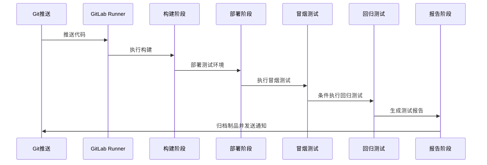

**图表来源**
- [.gitlab-ci.yml:1-67](file://e2e-tests/.gitlab-ci.yml#L1-L67)

#### 冒烟测试作业配置

冒烟测试作业配置了专门的执行环境和输出策略：

| 配置项 | 值 | 说明 |
|-------|-----|------|
| 镜像 | mcr.microsoft.com/playwright:v1.50.0-jammy | 使用官方Playwright镜像 |
| 工作目录 | e2e-tests | 指定测试目录 |
| 依赖安装 | pnpm install --frozen-lockfile | 使用锁定文件确保版本一致 |
| 测试执行 | playwright test --project=smoke-chromium | 仅执行冒烟测试项目 |
| 艺术品归档 | playwright-report, test-results, results | 归档所有测试相关文件 |
| 过期时间 | 7天 | 控制制品存储期限 |

#### 回归测试作业配置

回归测试作业具有更严格的要求和更长的保留策略：

| 配置项 | 值 | 说明 |
|-------|-----|------|
| 触发条件 | 仅在main分支 | 确保只有主分支变更才执行 |
| 允许失败 | false | 失败将阻止后续阶段 |
| 浏览器支持 | Chromium + Firefox | 多浏览器兼容性验证 |
| 保留时间 | 30天 | 更长的报告保留期 |

**章节来源**
- [.gitlab-ci.yml:12-46](file://e2e-tests/.gitlab-ci.yml#L12-L46)

### Playwright配置分析

#### 测试项目配置

项目定义了三个核心测试项目，每个项目都有特定的用途和配置：

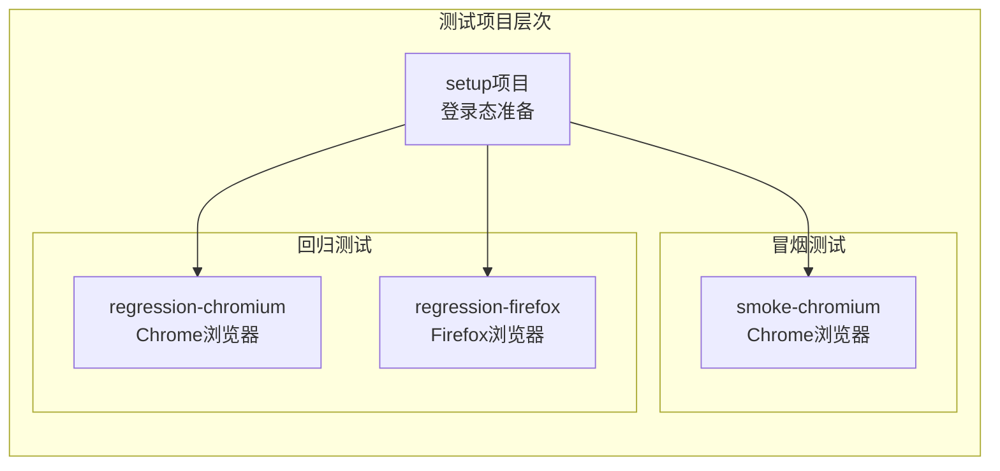

**图表来源**
- [playwright.config.ts:33-52](file://e2e-tests/playwright.config.ts#L33-L52)

#### 测试执行策略

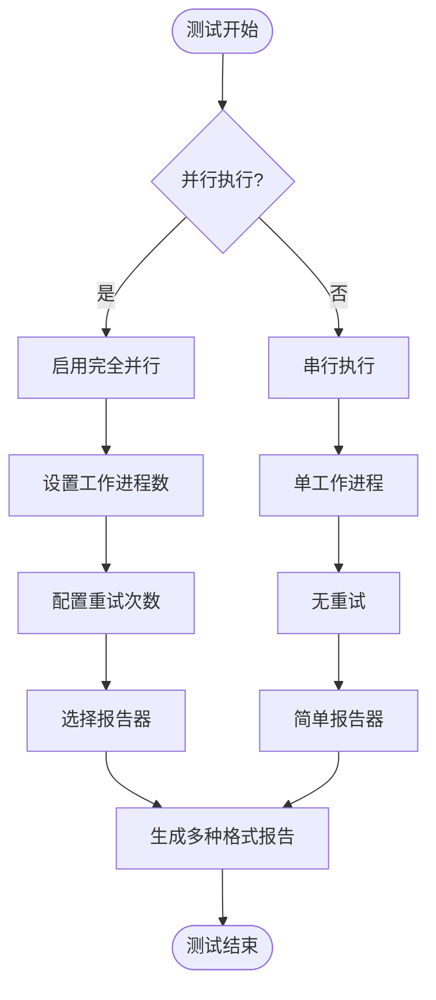

**图表来源**
- [playwright.config.ts:12-16](file://e2e-tests/playwright.config.ts#L12-L16)

**章节来源**
- [playwright.config.ts:1-54](file://e2e-tests/playwright.config.ts#L1-L54)

### 测试夹具与登录态管理

#### 认证夹具设计

认证夹具提供了角色化的测试环境隔离：

| 角色 | 存储状态文件 | 页面上下文 | 用途 |
|------|-------------|-----------|------|
| doctor | doctor.json | doctorPage | 医生权限测试 |
| auditor | auditor.json | auditorPage | 审计员权限测试 |
| admin | admin.json | adminPage | 管理员权限测试 |

#### 登录态持久化机制

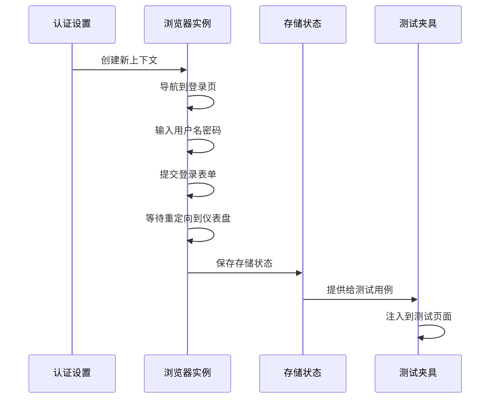

**图表来源**
- [auth.setup.ts:17-116](file://e2e-tests/fixtures/auth.setup.ts#L17-L116)
- [auth.fixture.ts:10-52](file://e2e-tests/fixtures/auth.fixture.ts#L10-L52)

**章节来源**
- [auth.setup.ts:1-116](file://e2e-tests/fixtures/auth.setup.ts#L1-L116)
- [auth.fixture.ts:1-52](file://e2e-tests/fixtures/auth.fixture.ts#L1-L52)

### 测试用例设计

#### 冒烟测试用例

冒烟测试专注于核心功能验证，确保系统基本可用性：

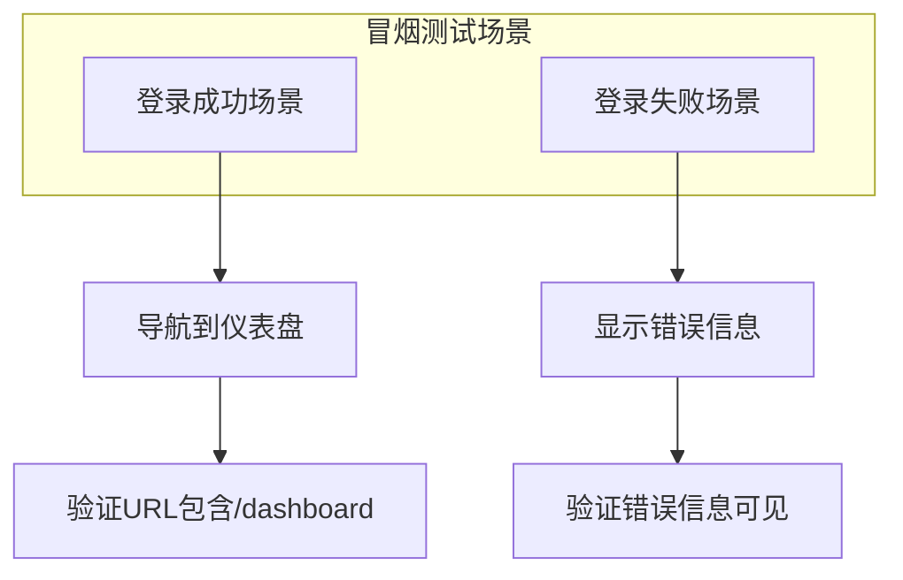

**图表来源**
- [login.spec.ts:9-178](file://e2e-tests/tests/smoke/login.spec.ts#L9-L178)

**章节来源**
- [login.spec.ts:1-178](file://e2e-tests/tests/smoke/login.spec.ts#L1-L178)

## 依赖关系分析

### 项目依赖图

```mermaid
graph TB
subgraph "运行时依赖"
Node[Node.js >= 18]
PNPM[pnpm包管理器]
Playwright[Playwright ^1.50.0]
Typescript[TypeScript ^5.3.0]
end
subgraph "开发依赖"
Allure[Allure命令行]
AllurePlaywright[Allure Playwright]
Dotenv[dotenv ^16.4.0]
MySQL2[mysql2 ^3.9.0]
TypesNode[@types/node ^20.11.0]
end
subgraph "测试依赖"
TestFramework[Playwright测试框架]
PageObjects[页面对象模式]
Fixtures[测试夹具]
AIAssistant[AI辅助测试]
end
PNPM --> Playwright
PNPM --> Typescript
PNPM --> Allure
PNPM --> AllurePlaywright
PNPM --> Dotenv
PNPM --> MySQL2
PNPM --> TypesNode
Playwright --> TestFramework
TestFramework --> PageObjects
PageObjects --> Fixtures
Fixtures --> AIAssistant
```

**图表来源**
- [package.json:1-35](file://e2e-tests/package.json#L1-L35)

### 环境变量管理

项目使用dotenv进行环境变量管理，支持不同环境的配置分离：

| 环境变量 | 默认值 | 用途 | GitLab CI中的配置 |
|----------|--------|------|-------------------|
| BASE_URL | http://localhost:8080 | 应用基础URL | 在.gitlab-ci.yml中设置 |
| CI | 环境检测 | CI环境标识 | 自动检测 |
| NODE_ENV | development | Node环境 | 可在CI中设置 |

**章节来源**
- [package.json:1-35](file://e2e-tests/package.json#L1-L35)
- [playwright.config.ts:24-26](file://e2e-tests/playwright.config.ts#L24-L26)

## 性能考虑

### 并行执行优化

项目在CI环境中启用了多项性能优化：

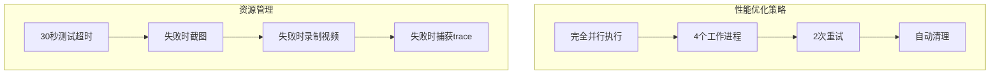

**图表来源**
- [playwright.config.ts:12-16](file://e2e-tests/playwright.config.ts#L12-L16)

### 缓存策略

虽然当前配置未显式配置缓存，但建议在GitLab CI中实现以下缓存策略：

| 缓存类型 | 缓存路径 | 缓存键 | 有效期 |
|----------|----------|--------|--------|
| Node模块缓存 | e2e-tests/node_modules | node-modules-${CI_COMMIT_SHORT_SHA} | 1周 |
| Playwright浏览器缓存 | ~/.cache/ms-playwright | playwright-${PLAYWRIGHT_VERSION} | 1个月 |
| 测试报告缓存 | e2e-tests/playwright-report | test-reports-${CI_COMMIT_SHORT_SHA} | 7天 |

### 测试执行效率优化

**更新** 项目实现了多项测试执行效率优化：

#### 多格式报告生成
- **HTML报告**：实时预览测试结果
- **JUnit XML报告**：兼容CI系统集成
- **Allure报告**：丰富的测试分析和可视化

#### 智能重试机制
- CI环境下自动重试失败的测试用例
- 支持最多2次重试，提高测试稳定性
- 避免临时性网络或环境问题影响测试结果

#### 并行执行优化
- CI环境下启用4个工作进程
- 禁用完全并行以避免fixture冲突
- 智能资源分配和任务调度

**章节来源**
- [playwright.config.ts:12-22](file://e2e-tests/playwright.config.ts#L12-L22)

## 故障排除指南

### 常见问题诊断

#### 测试执行失败

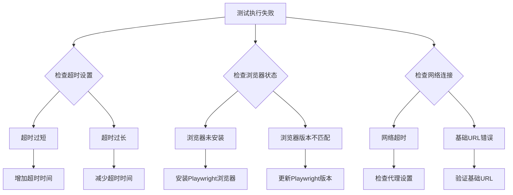

#### 艺术品归档问题

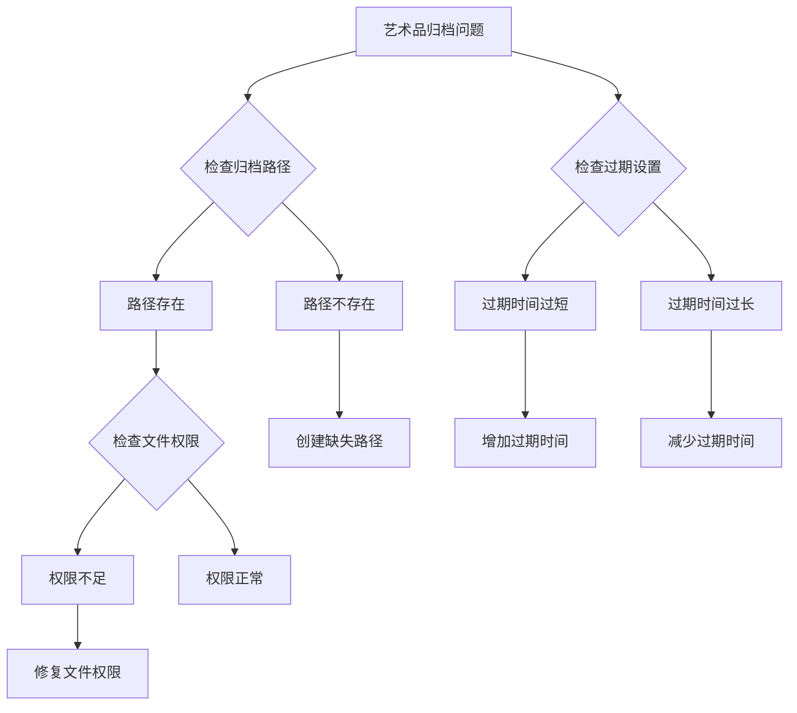

**章节来源**
- [.gitlab-ci.yml:19-46](file://e2e-tests/.gitlab-ci.yml#L19-L46)
- [playwright.config.ts:16-22](file://e2e-tests/playwright.config.ts#L16-L22)

### 错误处理与重试策略

项目实现了多层次的错误处理机制：

| 错误类型 | 处理策略 | 重试次数 | 最大等待时间 |
|----------|----------|----------|-------------|
| 网络超时 | 自动重试 | 2次 | 60秒 |
| 测试失败 | 重试执行 | 2次 | 60秒 |
| 环境问题 | 重新构建 | 1次 | 30秒 |
| 资源不足 | 降级执行 | 0次 | 立即失败 |

### 通知配置

项目集成了企业微信通知机制，支持测试结果的实时通知：

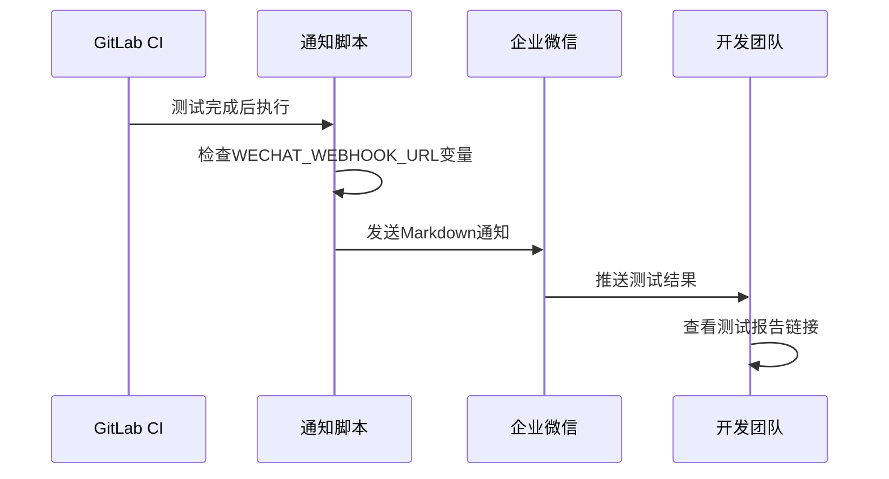

**图表来源**
- [.gitlab-ci.yml:53-67](file://e2e-tests/.gitlab-ci.yml#L53-L67)

**章节来源**
- [.gitlab-ci.yml:49-67](file://e2e-tests/.gitlab-ci.yml#L49-L67)

### 报告生成优化

**新增** 项目实现了高效的多格式报告生成机制：

#### HTML报告生成
- **实时生成**：测试执行过程中实时生成HTML报告
- **自动打开**：本地开发时自动打开报告，CI环境下保存为制品
- **详细信息**：包含截图、视频、trace等详细信息

#### JUnit XML报告
- **标准格式**：生成符合JUnit标准的XML报告
- **CI集成**：便于与各种CI系统集成
- **统计信息**：包含测试总数、失败数、跳过数等统计信息

#### Allure报告集成
- **丰富可视化**：提供详细的测试分析和可视化图表
- **历史对比**：支持测试结果的历史趋势分析
- **分类统计**：按测试类别、失败原因等维度进行统计

**章节来源**
- [playwright.config.ts:16-22](file://e2e-tests/playwright.config.ts#L16-L22)
- [package.json:11-12](file://e2e-tests/package.json#L11-L12)
- [junit-report.xml:1-464](file://e2e-tests/results/junit-report.xml#L1-L464)

## 结论

本GitLab CI配置为医院体检报告管理系统提供了完整的端到端测试解决方案。通过精心设计的流水线阶段、多浏览器测试支持和智能通知机制，确保了测试流程的可靠性、可维护性和可观测性。

**更新亮点** 本次配置优化显著提升了测试执行效率和报告生成能力：

- **多格式报告生成**：同时生成HTML、JUnit XML和Allure三种格式的测试报告
- **智能重试机制**：在CI环境下自动重试失败的测试用例，提高测试稳定性
- **并行执行优化**：合理配置工作进程数量，平衡执行效率和资源消耗
- **高效报告生成**：优化报告生成流程，减少CI执行时间

关键优势包括：
- **模块化架构**：清晰的阶段划分和作业配置
- **多环境支持**：冒烟测试和回归测试的差异化配置
- **自动化报告**：多种格式的测试报告生成
- **智能通知**：实时测试结果通知机制
- **性能优化**：并行执行和资源管理策略

建议在实际部署中进一步完善缓存策略、监控指标和告警机制，以提升整体CI/CD流程的效率和稳定性。

## 附录

### 配置最佳实践清单

#### 环境配置
- [ ] 设置BASE_URL环境变量
- [ ] 配置WECHAT_WEBHOOK_URL通知URL
- [ ] 验证Node.js版本要求
- [ ] 确认Playwright浏览器版本

#### 缓存优化
- [ ] 实现Node模块缓存
- [ ] 配置Playwright浏览器缓存
- [ ] 设置适当的制品保留策略
- [ ] 优化测试执行时间

#### 监控与告警
- [ ] 配置测试成功率阈值
- [ ] 设置失败通知渠道
- [ ] 实现测试报告质量检查
- [ ] 建立性能基准监控

#### 安全考虑
- [ ] 使用GitLab CI变量管理敏感信息
- [ ] 实施最小权限原则
- [ ] 定期轮换访问令牌
- [ ] 启用审计日志记录

#### 报告优化
- [ ] 配置多格式报告生成
- [ ] 优化报告生成性能
- [ ] 设置报告保留策略
- [ ] 实现报告质量监控