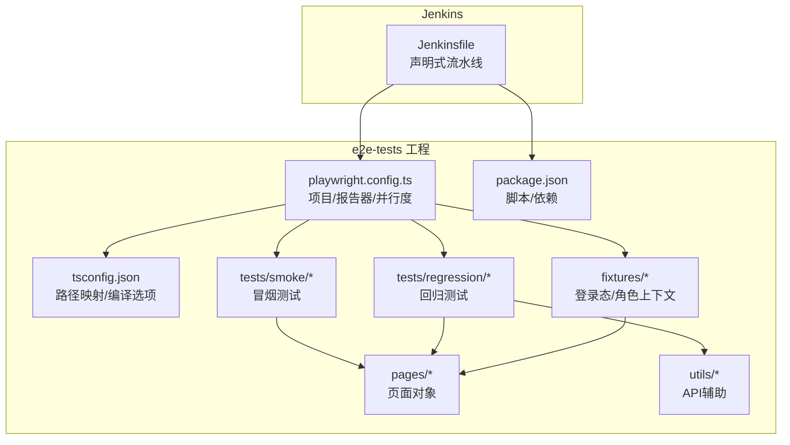
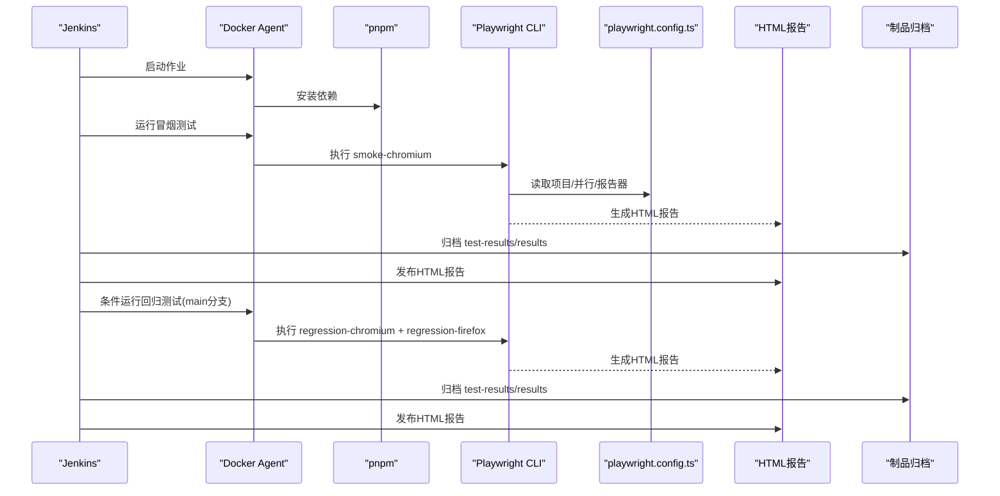
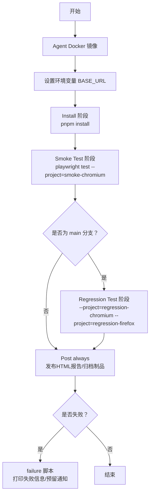
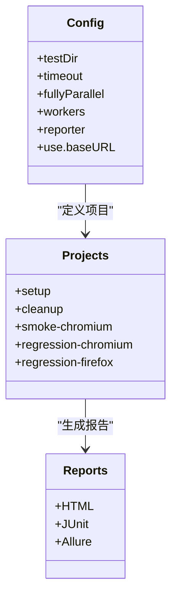
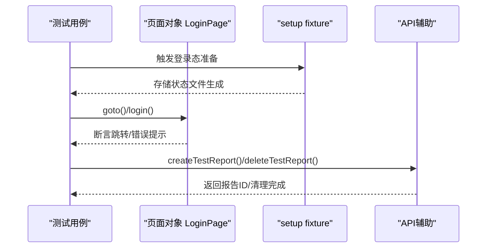
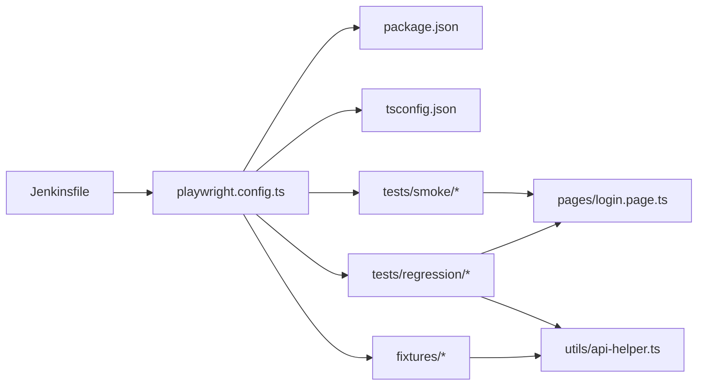

# Jenkins集成

<cite>
**本文引用的文件**
- [Jenkinsfile](file://e2e-tests/Jenkinsfile)
- [package.json](file://e2e-tests/package.json)
- [playwright.config.ts](file://e2e-tests/playwright.config.ts)
- [.gitlab-ci.yml](file://e2e-tests/.gitlab-ci.yml)
- [login.spec.ts](file://e2e-tests/tests/smoke/login.spec.ts)
- [report-crud.spec.ts](file://e2e-tests/tests/regression/report-crud.spec.ts)
- [auth.setup.ts](file://e2e-tests/fixtures/auth.setup.ts)
- [auth.fixture.ts](file://e2e-tests/fixtures/auth.fixture.ts)
- [login.page.ts](file://e2e-tests/pages/login.page.ts)
- [api-helper.ts](file://e2e-tests/utils/api-helper.ts)
- [tsconfig.json](file://e2e-tests/tsconfig.json)
</cite>

## 目录
1. [简介](#简介)
2. [项目结构](#项目结构)
3. [核心组件](#核心组件)
4. [架构总览](#架构总览)
5. [详细组件分析](#详细组件分析)
6. [依赖关系分析](#依赖关系分析)
7. [性能考量](#性能考量)
8. [故障排查指南](#故障排查指南)
9. [结论](#结论)
10. [附录](#附录)

## 简介
本指南面向Jenkins管理员与测试工程师，提供基于Playwright的端到端测试在Jenkins中的完整实施方法。内容涵盖：
- Jenkinsfile声明式流水线的阶段划分、步骤定义与参数配置
- Playwright测试策略、测试执行顺序与结果处理机制
- 与Jenkins的集成方式（报告发布、制品归档、通知）
- 插件配置、构建环境设置与资源管理建议
- 并行执行、负载均衡与性能监控实践
- 优化与故障诊断实用指南

## 项目结构
该仓库采用“前端测试工程”组织形式，核心目录与文件如下：
- e2e-tests：端到端测试工程，包含Playwright配置、测试用例、页面对象、工具函数与报告产物
- 核心文件：
  - Jenkinsfile：Jenkins声明式流水线
  - playwright.config.ts：Playwright测试配置（含项目、报告器、并行度等）
  - package.json：脚本与依赖
  - tsconfig.json：TypeScript路径映射与编译选项
  - tests：冒烟与回归测试用例
  - fixtures：登录态准备与角色上下文
  - pages：页面对象封装
  - utils：API辅助工具（测试数据准备与清理）

图表来源
- [Jenkinsfile:1-59](file://e2e-tests/Jenkinsfile#L1-L59)
- [playwright.config.ts:1-68](file://e2e-tests/playwright.config.ts#L1-L68)
- [package.json:1-27](file://e2e-tests/package.json#L1-L27)
- [tsconfig.json:1-25](file://e2e-tests/tsconfig.json#L1-L25)

章节来源
- [Jenkinsfile:1-59](file://e2e-tests/Jenkinsfile#L1-L59)
- [playwright.config.ts:1-68](file://e2e-tests/playwright.config.ts#L1-L68)
- [package.json:1-27](file://e2e-tests/package.json#L1-L27)
- [tsconfig.json:1-25](file://e2e-tests/tsconfig.json#L1-L25)

## 核心组件
- Jenkins声明式流水线
  - 使用Docker Agent运行，镜像包含Playwright运行时
  - 环境变量BASE_URL指向测试服务器
  - 阶段：安装依赖、冒烟测试、回归测试（仅主分支）
  - 结果处理：发布HTML报告、归档测试产物
- Playwright配置
  - 项目：setup/cleanup（登录态准备）、smoke-chromium、regression-chromium、regression-firefox
  - 报告器：CI环境下输出HTML、JUnit、Allure；本地开发仅HTML
  - 并行：CI环境4 worker，重试策略与只允许CI模式
- 测试工程
  - 冒烟测试：登录功能正反向断言
  - 回归测试：报告CRUD、状态流转、数据持久化
  - 登录态fixture：按角色注入带存储状态的浏览器上下文
  - API辅助：统一的API请求上下文、认证与测试数据管理

章节来源
- [Jenkinsfile:1-59](file://e2e-tests/Jenkinsfile#L1-L59)
- [playwright.config.ts:31-66](file://e2e-tests/playwright.config.ts#L31-L66)
- [login.spec.ts:1-25](file://e2e-tests/tests/smoke/login.spec.ts#L1-L25)
- [report-crud.spec.ts:1-122](file://e2e-tests/tests/regression/report-crud.spec.ts#L1-L122)
- [auth.setup.ts:1-28](file://e2e-tests/fixtures/auth.setup.ts#L1-L28)
- [auth.fixture.ts:1-40](file://e2e-tests/fixtures/auth.fixture.ts#L1-L40)
- [api-helper.ts:1-172](file://e2e-tests/utils/api-helper.ts#L1-L172)

## 架构总览
Jenkins流水线在Docker容器中执行，按阶段顺序运行安装、冒烟与回归测试，并在后置阶段发布报告与归档制品。Playwright根据配置选择项目并并行执行，生成多格式报告与测试结果。

图表来源
- [Jenkinsfile:1-59](file://e2e-tests/Jenkinsfile#L1-L59)
- [playwright.config.ts:16-22](file://e2e-tests/playwright.config.ts#L16-L22)

## 详细组件分析

### Jenkinsfile声明式流水线
- 执行模型
  - Agent：Docker镜像包含Playwright运行时，确保跨平台一致性
  - Environment：设置BASE_URL，供Playwright use.baseURL与测试用例使用
  - Stages：
    - Install：在e2e-tests目录下执行pnpm安装，锁定依赖版本
    - Smoke Test：执行smoke-chromium项目
    - Regression Test：仅在main分支触发，执行Chromium与Firefox两个项目
  - Post：
    - always：发布HTML报告、归档test-results与results目录
    - failure：打印失败信息，预留钉钉/企业微信通知位置
- 参数配置
  - 通过Jenkins参数可控制分支策略与通知开关（建议在Jenkins中新增参数以支持动态配置）

图表来源
- [Jenkinsfile:1-59](file://e2e-tests/Jenkinsfile#L1-L59)

章节来源
- [Jenkinsfile:1-59](file://e2e-tests/Jenkinsfile#L1-L59)

### Playwright测试配置与执行策略
- 项目划分
  - setup/cleanup：准备与清理登录态，不启动浏览器
  - smoke-chromium：冒烟测试，仅Chromium
  - regression-chromium/firefox：回归测试，Chromium与Firefox双浏览器
- 执行顺序
  - 通过dependencies保证setup先于业务测试执行
  - fullyParallel启用全并行，workers在CI为4
- 报告与结果
  - CI环境输出HTML、JUnit与Allure；本地仅HTML
  - HTML报告输出到playwright-report，JUnit输出到results/junit-report.xml
- 并行与重试
  - workers=4（CI）；retries=2（CI）；forbidOnly仅在CI启用
- 页面对象与断言
  - 页面对象集中定位器与操作，提升可维护性
  - 断言集中在用例中，确保可读性与可追踪性

图表来源
- [playwright.config.ts:6-66](file://e2e-tests/playwright.config.ts#L6-L66)

章节来源
- [playwright.config.ts:1-68](file://e2e-tests/playwright.config.ts#L1-L68)

### 测试用例与页面对象
- 冒烟测试
  - 登录页对象封装了输入框、按钮与错误提示定位器
  - 正向：用户名密码正确，断言跳转到仪表盘
  - 反向：错误密码，断言错误提示可见
- 回归测试
  - 使用auth.fixture按角色注入带存储状态的浏览器上下文
  - 通过API辅助创建/删除测试数据，保证测试隔离与幂等
  - 断言覆盖创建、编辑、删除、草稿保存等关键路径

图表来源
- [login.spec.ts:1-25](file://e2e-tests/tests/smoke/login.spec.ts#L1-L25)
- [login.page.ts:1-52](file://e2e-tests/pages/login.page.ts#L1-L52)
- [auth.setup.ts:1-28](file://e2e-tests/fixtures/auth.setup.ts#L1-L28)
- [auth.fixture.ts:1-40](file://e2e-tests/fixtures/auth.fixture.ts#L1-L40)
- [api-helper.ts:83-121](file://e2e-tests/utils/api-helper.ts#L83-L121)

章节来源
- [login.spec.ts:1-25](file://e2e-tests/tests/smoke/login.spec.ts#L1-L25)
- [login.page.ts:1-52](file://e2e-tests/pages/login.page.ts#L1-L52)
- [report-crud.spec.ts:1-122](file://e2e-tests/tests/regression/report-crud.spec.ts#L1-L122)
- [auth.setup.ts:1-28](file://e2e-tests/fixtures/auth.setup.ts#L1-L28)
- [auth.fixture.ts:1-40](file://e2e-tests/fixtures/auth.fixture.ts#L1-L40)
- [api-helper.ts:1-172](file://e2e-tests/utils/api-helper.ts#L1-L172)

### 结果处理与报告发布
- HTML报告
  - Jenkins post always发布playwright-report/index.html
  - Playwright CI环境输出HTML报告至playwright-report
- 制品归档
  - 归档test-results与results目录，便于问题复现与分析
- JUnit报告
  - CI环境输出results/junit-report.xml，可用于Jenkins JUnit插件统计
- Allure（可选）
  - Playwright配置包含allure-playwright，可在CI中生成Allure报告并结合Jenkins Allure插件展示

章节来源
- [Jenkinsfile:43-49](file://e2e-tests/Jenkinsfile#L43-L49)
- [playwright.config.ts:16-22](file://e2e-tests/playwright.config.ts#L16-L22)

## 依赖关系分析
- Jenkinsfile依赖playwright.config.ts中的项目定义与报告输出路径
- 测试用例依赖页面对象与fixture，fixture依赖setup生成的存储状态
- API辅助依赖环境变量API_BASE_URL与认证流程，确保测试数据隔离与清理

图表来源
- [Jenkinsfile:1-59](file://e2e-tests/Jenkinsfile#L1-L59)
- [playwright.config.ts:1-68](file://e2e-tests/playwright.config.ts#L1-L68)
- [package.json:1-27](file://e2e-tests/package.json#L1-L27)
- [tsconfig.json:1-25](file://e2e-tests/tsconfig.json#L1-L25)

章节来源
- [Jenkinsfile:1-59](file://e2e-tests/Jenkinsfile#L1-L59)
- [playwright.config.ts:1-68](file://e2e-tests/playwright.config.ts#L1-L68)
- [package.json:1-27](file://e2e-tests/package.json#L1-L27)
- [tsconfig.json:1-25](file://e2e-tests/tsconfig.json#L1-L25)

## 性能考量
- 并行执行
  - workers=4（CI），充分利用多核CPU；如需更高吞吐，可按节点资源调整
  - fullyParallel开启，避免串行瓶颈
- 资源管理
  - Docker Agent镜像固定版本，避免运行时差异导致的不稳定
  - pnpm安装锁定版本，确保依赖一致性
- 报告与制品
  - HTML报告与JUnit报告分离，便于不同工具链消费
  - 归档test-results与results，缩短问题定位时间
- 监控与日志
  - 建议在Jenkins中启用构建日志轮转与超时控制
  - 在post failure中增加通知，快速响应失败

[本节为通用性能建议，无需特定文件引用]

## 故障排查指南
- 浏览器启动失败
  - 检查Docker镜像是否包含必要依赖；确认DISPLAY或headless配置
  - 查看HTML报告与视频/截图，定位失败步骤
- 登录态失效
  - 确认setup项目已成功生成存储状态文件
  - 检查BASE_URL与API_BASE_URL是否一致
- 数据污染
  - 确保每个测试前后使用API辅助创建/清理测试数据
  - 在globalTeardown中调用disposeApiContext释放上下文
- 报告缺失
  - 确认CI环境变量与reporter配置一致
  - 检查Jenkins post阶段是否执行成功
- 通知未发送
  - 在Jenkins中配置Webhook参数并在post failure中启用对应逻辑

章节来源
- [auth.setup.ts:1-28](file://e2e-tests/fixtures/auth.setup.ts#L1-L28)
- [api-helper.ts:166-172](file://e2e-tests/utils/api-helper.ts#L166-L172)
- [Jenkinsfile:51-56](file://e2e-tests/Jenkinsfile#L51-L56)

## 结论
本指南提供了从Jenkins流水线到Playwright测试的完整实施路径。通过明确的阶段划分、稳定的执行环境、完善的报告与制品归档，以及可扩展的通知机制，能够有效支撑持续集成与交付。建议在生产环境中进一步完善参数化配置、负载均衡与性能监控，以获得更稳健的自动化测试体系。

[本节为总结性内容，无需特定文件引用]

## 附录

### Jenkins插件与配置建议
- 必备插件
  - Publish Over HTML Reports：发布HTML报告
  - JUnit Attachments：消费JUnit报告
  - Pipeline Utility Steps：辅助归档与条件判断
- 可选插件
  - Allure Test Results：展示Allure报告
  - Email Extension：邮件通知
  - DingTalk/企业微信：消息通知
- 参数化作业
  - 新增参数：BASE_URL、API_BASE_URL、通知Webhook等，便于不同环境切换

[本节为通用配置建议，无需特定文件引用]

### 构建环境设置
- Docker镜像
  - 使用官方Playwright镜像，确保Node与浏览器版本一致
- Node与包管理
  - 使用pnpm并锁定版本，避免依赖漂移
- Playwright配置
  - CI环境启用重试与并行，本地开发关闭重试与并行
- 环境变量
  - BASE_URL：前端服务地址
  - API_BASE_URL：后端API地址
  - CI：仅在CI环境启用严格模式与重试

章节来源
- [Jenkinsfile:8-10](file://e2e-tests/Jenkinsfile#L8-L10)
- [playwright.config.ts:14-15](file://e2e-tests/playwright.config.ts#L14-L15)
- [api-helper.ts](file://e2e-tests/utils/api-helper.ts#L6)

### 负载均衡与性能监控
- 负载均衡
  - 多Jenkins Agent节点并行执行不同项目（如smoke与regression拆分）
  - 使用Jenkins Blue Ocean或Pipeline视图可视化执行进度
- 性能监控
  - 收集HTML报告与JUnit统计，结合Jenkins趋势图观察质量趋势
  - 对慢用例进行标记与隔离，逐步优化

[本节为通用实践建议，无需特定文件引用]