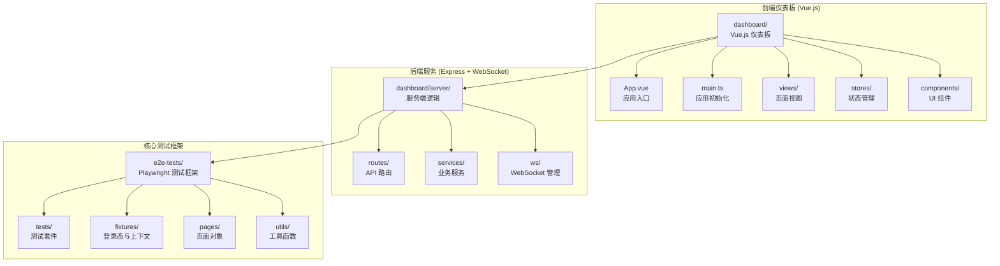
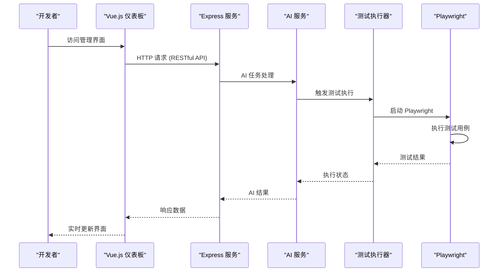
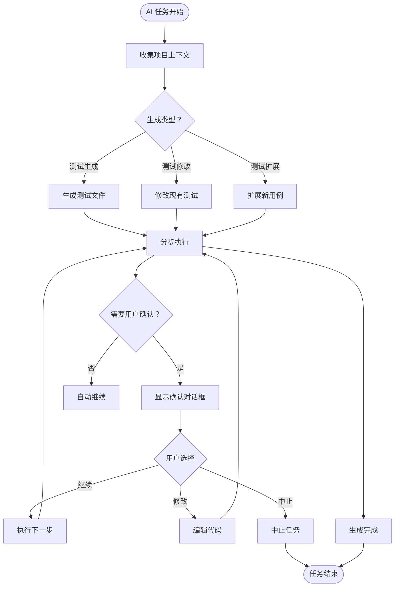
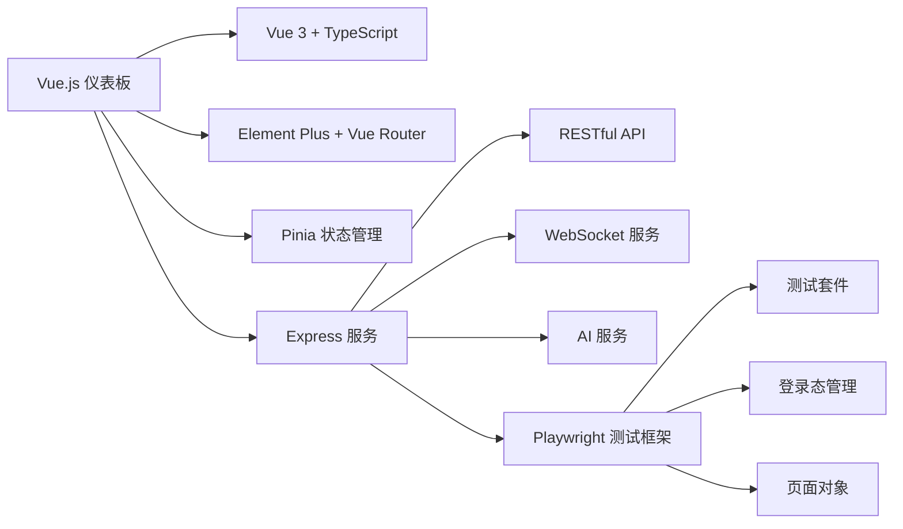

# 开发环境设置

<cite>
**本文档引用的文件**
- [package.json](file://e2e-tests/package.json)
- [playwright.config.ts](file://e2e-tests/playwright.config.ts)
- [tsconfig.json](file://e2e-tests/tsconfig.json)
- [.gitlab-ci.yml](file://e2e-tests/.gitlab-ci.yml)
- [Jenkinsfile](file://e2e-tests/Jenkinsfile)
- [auth.setup.ts](file://e2e-tests/fixtures/auth.setup.ts)
- [auth.fixture.ts](file://e2e-tests/fixtures/auth.fixture.ts)
- [db-helper.ts](file://e2e-tests/utils/db-helper.ts)
- [api-helper.ts](file://e2e-tests/utils/api-helper.ts)
- [dashboard/package.json](file://e2e-tests/dashboard/package.json)
- [dashboard/vite.config.ts](file://e2e-tests/dashboard/vite.config.ts)
- [dashboard/src/App.vue](file://e2e-tests/dashboard/src/App.vue)
- [dashboard/src/main.ts](file://e2e-tests/dashboard/src/main.ts)
- [dashboard/server/index.ts](file://e2e-tests/dashboard/server/index.ts)
- [dashboard/server/routes/ai.routes.ts](file://e2e-tests/dashboard/server/routes/ai.routes.ts)
- [dashboard/server/routes/runner.routes.ts](file://e2e-tests/dashboard/server/routes/runner.routes.ts)
- [dashboard/server/routes/tests.routes.ts](file://e2e-tests/dashboard/server/routes/tests.routes.ts)
- [dashboard/server/services/ai.service.ts](file://e2e-tests/dashboard/server/services/ai.service.ts)
- [dashboard/server/services/runner.service.ts](file://e2e-tests/dashboard/server/services/runner.service.ts)
- [dashboard/src/views/AiGenerateView.vue](file://e2e-tests/dashboard/src/views/AiGenerateView.vue)
- [dashboard/src/views/AiModifyView.vue](file://e2e-tests/dashboard/src/views/AiModifyView.vue)
- [dashboard/src/views/TestRunnerView.vue](file://e2e-tests/dashboard/src/views/TestRunnerView.vue)
- [dashboard/src/stores/ai.store.ts](file://e2e-tests/dashboard/src/stores/ai.store.ts)
- [dashboard/src/stores/runner.store.ts](file://e2e-tests/dashboard/src/stores/runner.store.ts)
</cite>

## 更新摘要
**所做更改**
- 新增 Vue.js 仪表板架构分析和部署指南
- 添加 AI 测试系统核心组件说明和交互式工作流
- 更新测试执行服务和 WebSocket 通信机制
- 新增 Vue 组件生态和状态管理配置
- 扩展开发环境设置以支持前后端一体化开发

## 目录
1. [简介](#简介)
2. [项目结构](#项目结构)
3. [核心组件](#核心组件)
4. [架构概览](#架构概览)
5. [详细组件分析](#详细组件分析)
6. [依赖分析](#依赖分析)
7. [性能考虑](#性能考虑)
8. [故障排除指南](#故障排除指南)
9. [结论](#结论)
10. [附录](#附录)

## 简介
本指南面向开发者，提供基于 Vue.js 和 Playwright 的现代化端到端测试环境完整设置方案。内容涵盖 Node.js 版本要求、依赖安装、环境变量配置、TypeScript 编译配置与路径别名、Vue.js 仪表板开发、AI 测试系统集成、Playwright 测试框架安装与配置、浏览器驱动管理、IDE 配置建议、调试工具设置、代码格式化规则、本地开发服务器启动、测试环境配置以及数据库连接设置。文档同时提供跨平台安装与配置步骤，确保开发环境的一致性与可重复性。

## 项目结构
项目采用前后端分离架构，包含三个主要部分：
- e2e-tests 核心测试框架：基于 Playwright 的端到端测试套件
- dashboard 仪表板：Vue.js + TypeScript + Element Plus 构建的测试管理界面
- AI 测试系统：智能测试生成和修改的 AI 驱动组件

**图表来源**
- [dashboard/src/App.vue:1-50](file://e2e-tests/dashboard/src/App.vue#L1-L50)
- [dashboard/src/main.ts:1-22](file://e2e-tests/dashboard/src/main.ts#L1-L22)
- [dashboard/server/index.ts:1-75](file://e2e-tests/dashboard/server/index.ts#L1-L75)
- [dashboard/server/routes/ai.routes.ts:1-159](file://e2e-tests/dashboard/server/routes/ai.routes.ts#L1-L159)

**章节来源**
- [dashboard/package.json:1-38](file://e2e-tests/dashboard/package.json#L1-L38)
- [dashboard/vite.config.ts:1-25](file://e2e-tests/dashboard/vite.config.ts#L1-L25)
- [dashboard/server/index.ts:1-75](file://e2e-tests/dashboard/server/index.ts#L1-L75)

## 核心组件
- **Node.js 运行时与包管理器**：项目要求 Node.js 版本不低于 18；推荐使用 pnpm 作为包管理器，以获得更快的安装速度与更小的磁盘占用。
- **Vue.js 仪表板**：基于 Vue 3 + TypeScript + Vite 构建，使用 Element Plus UI 框架，提供测试管理、AI 生成、执行监控等功能。
- **AI 测试系统**：集成智能测试生成、修改和扩展功能，支持交互式分步确认和实时进度反馈。
- **Playwright 测试框架**：负责浏览器自动化、截图、视频录制与 Trace 调试信息收集。
- **Express + WebSocket 服务**：提供 RESTful API 和实时通信能力，支持测试执行监控和 AI 任务状态推送。
- **TypeScript 编译器**：启用严格模式、ESNext 模块解析、JSON 模块解析等选项，并通过路径别名提升模块导入可读性。
- **数据库与 API 辅助**：提供 MySQL 连接池、API 认证上下文与测试数据清理能力。
- **CI/CD 集成**：GitLab CI 与 Jenkins Pipeline 基于官方 Playwright Docker 镜像运行测试，生成 HTML 报告与 JUnit 结果。

**章节来源**
- [dashboard/package.json:11-36](file://e2e-tests/dashboard/package.json#L11-L36)
- [dashboard/server/services/ai.service.ts:41-239](file://e2e-tests/dashboard/server/services/ai.service.ts#L41-L239)
- [dashboard/server/services/runner.service.ts:25-131](file://e2e-tests/dashboard/server/services/runner.service.ts#L25-L131)
- [package.json:14-25](file://e2e-tests/package.json#L14-L25)
- [playwright.config.ts:6-29](file://e2e-tests/playwright.config.ts#L6-L29)

## 架构概览
下图展示了完整的开发环境架构：从前端 Vue.js 仪表板到后端 Express 服务，再到 Playwright 测试框架的完整链路。

**图表来源**
- [dashboard/server/index.ts:25-75](file://e2e-tests/dashboard/server/index.ts#L25-L75)
- [dashboard/server/services/ai.service.ts:125-239](file://e2e-tests/dashboard/server/services/ai.service.ts#L125-L239)
- [dashboard/server/services/runner.service.ts:36-118](file://e2e-tests/dashboard/server/services/runner.service.ts#L36-L118)

**章节来源**
- [dashboard/server/index.ts:1-75](file://e2e-tests/dashboard/server/index.ts#L1-L75)
- [dashboard/server/services/ai.service.ts:1-239](file://e2e-tests/dashboard/server/services/ai.service.ts#L1-L239)
- [dashboard/server/services/runner.service.ts:1-131](file://e2e-tests/dashboard/server/services/runner.service.ts#L1-L131)

## 详细组件分析

### Vue.js 仪表板开发环境设置
- **技术栈**：Vue 3 + TypeScript + Vite + Element Plus + Pinia + Vue Router
- **开发服务器**：使用 Vite 提供热重载和快速构建，支持 TypeScript 和 Vue SFC
- **路径别名**：配置 @ 为 src 目录的别名，简化模块导入
- **代理配置**：开发环境下将 /api 代理到后端服务，/ws 代理到 WebSocket 服务
- **构建配置**：生产环境构建到 dist 目录，支持 SPA 路由

**章节来源**
- [dashboard/package.json:17-36](file://e2e-tests/dashboard/package.json#L17-L36)
- [dashboard/vite.config.ts:5-25](file://e2e-tests/dashboard/vite.config.ts#L5-L25)
- [dashboard/src/main.ts:1-22](file://e2e-tests/dashboard/src/main.ts#L1-L22)

### AI 测试系统核心组件
- **AI 服务层**：提供智能测试生成、修改和扩展功能，支持交互式分步确认
- **会话管理**：维护 AI 任务的生命周期，支持多步骤工作流和用户确认
- **WebSocket 集成**：实时推送生成进度、调试日志和任务状态
- **上下文收集**：自动分析项目结构，包括页面对象、认证夹具、数据夹具等
- **交互式模式**：允许用户逐步骤确认 AI 生成的各个阶段

**图表来源**
- [dashboard/server/services/ai.service.ts:78-121](file://e2e-tests/dashboard/server/services/ai.service.ts#L78-L121)
- [dashboard/src/views/AiGenerateView.vue:107-174](file://e2e-tests/dashboard/src/views/AiGenerateView.vue#L107-L174)

**章节来源**
- [dashboard/server/services/ai.service.ts:1-239](file://e2e-tests/dashboard/server/services/ai.service.ts#L1-L239)
- [dashboard/server/routes/ai.routes.ts:1-159](file://e2e-tests/dashboard/server/routes/ai.routes.ts#L1-L159)
- [dashboard/src/views/AiGenerateView.vue:1-181](file://e2e-tests/dashboard/src/views/AiGenerateView.vue#L1-L181)

### 测试执行服务与 WebSocket 通信
- **进程管理**：使用 child_process.spawn 启动 Playwright 测试，支持 Windows 兼容性
- **实时日志**：通过 WebSocket 推送测试执行过程中的 stdout 和 stderr 输出
- **状态监控**：维护当前运行状态，支持停止正在执行的测试
- **结果汇总**：测试完成后推送退出码和统计信息
- **跨平台支持**：Windows 环境使用 npx 命令，支持 taskkill 作为进程终止后备方案

**章节来源**
- [dashboard/server/services/runner.service.ts:1-131](file://e2e-tests/dashboard/server/services/runner.service.ts#L1-L131)
- [dashboard/server/routes/runner.routes.ts:1-41](file://e2e-tests/dashboard/server/routes/runner.routes.ts#L1-L41)
- [dashboard/src/views/TestRunnerView.vue:1-138](file://e2e-tests/dashboard/src/views/TestRunnerView.vue#L1-L138)

### Node.js 与包管理器设置
- **Node.js 版本要求**：引擎声明要求 Node.js >= 18，建议使用 LTS 版本以获得稳定支持
- **包管理器选择**：推荐使用 pnpm，其优势包括更快的安装速度、严格的依赖隔离与更小的磁盘占用
- **安装步骤**：
  1) 安装 Node.js（版本 ≥ 18）
  2) 安装 pnpm（如未安装）
  3) 在 e2e-tests 目录执行 pnpm install --frozen-lockfile
  4) 在 dashboard 目录执行 pnpm install --frozen-lockfile
- **开发环境启动**：
  - 前端开发：在 dashboard 目录执行 pnpm run dev
  - 后端服务：在 dashboard/server 目录执行 tsx index.ts
  - 测试框架：在 e2e-tests 目录执行 pnpm run test:smoke

**章节来源**
- [package.json:14-16](file://e2e-tests/package.json#L14-L16)
- [dashboard/package.json:6-10](file://e2e-tests/dashboard/package.json#L6-L10)

### Playwright 安装与配置
- **安装依赖**：项目已包含 @playwright/test 与相关类型定义，安装后自动完成浏览器驱动下载
- **配置要点**：
  - testDir：测试目录为 ./tests
  - timeout：整体超时 30 秒，expect 超时 5 秒
  - 并行策略：fullyParallel=true，CI 环境下 workers=4，本地 workers=1
  - 重试策略：CI 环境 retries=2，本地 retries=0
  - 报告器：CI 环境输出 HTML/JUnit/Allure，本地仅 HTML
  - 基础 URL：默认 http://localhost:8080，可通过环境变量覆盖
  - 截图/视频/Trace：失败时自动保留
  - 项目划分：setup/cleanup 无浏览器执行；smoke-chromium；regression-chromium/firefox
- **浏览器驱动管理**：首次运行时自动下载对应浏览器驱动；CI 环境使用官方 Playwright Docker 镜像，避免本地驱动差异

**章节来源**
- [playwright.config.ts:6-66](file://e2e-tests/playwright.config.ts#L6-L66)
- [.gitlab-ci.yml:14-18](file://e2e-tests/.gitlab-ci.yml#L14-L18)

### TypeScript 编译配置与路径别名
- **前端配置**：Vue.js 仪表板使用 Vite + TypeScript，配置 @ 为 src 目录别名
- **后端配置**：Express 服务使用 tsx 运行 TypeScript 文件，支持模块解析
- **路径别名**：前端使用 @/components、@/views、@/stores 等别名
- **严格模式**：启用严格检查，提升类型安全
- **模块解析**：支持 ESNext 模块解析和 JSON 模块导入

**章节来源**
- [dashboard/vite.config.ts:7-11](file://e2e-tests/dashboard/vite.config.ts#L7-L11)
- [dashboard/src/main.ts:1-22](file://e2e-tests/dashboard/src/main.ts#L1-L22)
- [tsconfig.json:1-25](file://e2e-tests/tsconfig.json#L1-L25)

### 环境变量配置
- **必需变量**：
  - BASE_URL：测试目标应用的基础地址，默认 http://localhost:8080
  - API_BASE_URL：API 基础地址，默认 http://localhost:8080/api
  - DASHBOARD_PORT：仪表板服务端口，默认 3200
  - DATABASE_URL：数据库连接字符串
- **数据库变量**（用于 db-helper）：
  - DB_HOST：数据库主机，默认 localhost
  - DB_PORT：数据库端口，默认 3306
  - DB_USER：数据库用户，默认 test_user
  - DB_PASSWORD：数据库密码
  - DB_NAME：数据库名，默认 hospital_exam
- **AI 配置**：支持温度参数、最大令牌数等 LLM 参数配置

**章节来源**
- [playwright.config.ts:24-25](file://e2e-tests/playwright.config.ts#L24-L25)
- [dashboard/server/index.ts:22-23](file://e2e-tests/dashboard/server/index.ts#L22-L23)
- [api-helper.ts](file://e2e-tests/utils/api-helper.ts#L6)
- [db-helper.ts:14-19](file://e2e-tests/utils/db-helper.ts#L14-L19)

### 登录态与角色化上下文
- **登录态准备**：auth.setup.ts 会为不同角色（如 admin）执行登录流程，并将 storageState 写入 fixtures/.auth 目录
- **角色化页面**：auth.fixture.ts 通过 test.extend 提供 doctorPage/auditorPage/adminPage，分别注入对应角色的 storageState
- **使用方式**：在测试中引入该 fixture，即可直接使用带登录态的页面对象

**章节来源**
- [auth.setup.ts:1-28](file://e2e-tests/fixtures/auth.setup.ts#L1-L28)
- [auth.fixture.ts:1-40](file://e2e-tests/fixtures/auth.fixture.ts#L1-L40)

### 数据库连接与 API 辅助
- **数据库连接池**：db-helper.ts 提供单例连接池，支持按环境变量动态配置；包含测试数据重置与清理方法
- **API 助手**：api-helper.ts 提供认证上下文创建、报告创建/删除/状态更新、报告查询与批量清理等接口
- **典型用法**：在测试前通过 API 准备数据，在测试后清理数据，保证测试隔离性

**章节来源**
- [db-helper.ts:1-91](file://e2e-tests/utils/db-helper.ts#L1-L91)
- [api-helper.ts:1-172](file://e2e-tests/utils/api-helper.ts#L1-L172)

### CI/CD 集成（GitLab CI 与 Jenkins）
- **GitLab CI**：
  - 使用官方 Playwright Docker 镜像，确保浏览器驱动一致性
  - 支持冒烟测试与回归测试阶段，产物归档至制品库
  - 可选通知：通过企业微信 Webhook 发送测试报告链接
- **Jenkins**：
  - 使用相同镜像，按项目执行冒烟与回归测试
  - 归档 HTML 报告与测试结果，便于回溯

**章节来源**
- [.gitlab-ci.yml:1-67](file://e2e-tests/.gitlab-ci.yml#L1-L67)
- [Jenkinsfile:1-59](file://e2e-tests/Jenkinsfile#L1-L59)

## 依赖分析
- **前端依赖关系**：
  - Vue.js 3 + TypeScript + Vite 提供现代化前端开发体验
  - Element Plus + Vue Router + Pinia 构建完整的前端应用生态
  - WebSocket 客户端支持实时通信
- **后端依赖关系**：
  - Express 提供 RESTful API 服务
  - WebSocket 服务支持实时状态推送
  - AI 服务集成智能测试生成功能
- **核心依赖**：
  - Playwright 官方 Docker 镜像确保跨平台浏览器驱动一致性
  - pnpm 作为包管理器，加速依赖安装与缓存复用
  - TypeScript 提供静态类型检查和更好的开发体验

**图表来源**
- [dashboard/package.json:17-36](file://e2e-tests/dashboard/package.json#L17-L36)
- [dashboard/server/index.ts:15-21](file://e2e-tests/dashboard/server/index.ts#L15-L21)
- [package.json:14-25](file://e2e-tests/package.json#L14-L25)

**章节来源**
- [dashboard/package.json:1-38](file://e2e-tests/dashboard/package.json#L1-L38)
- [dashboard/server/index.ts:1-75](file://e2e-tests/dashboard/server/index.ts#L1-L75)
- [package.json:1-27](file://e2e-tests/package.json#L1-L27)

## 性能考虑
- **前端性能优化**：
  - Vite 提供快速的热重载和构建速度
  - 按需加载组件和路由，减少初始包大小
  - Element Plus 图标按需注册，避免全量引入
- **后端性能优化**：
  - WebSocket 连接池管理，支持多客户端并发
  - AI 任务异步执行，避免阻塞主线程
  - 进程管理器支持 Windows 兼容性
- **测试性能优化**：
  - 本地开发建议关闭并行与重试，提升调试效率
  - CI 环境开启以充分利用资源
  - 工作线程：本地 workers=1，CI workers=4
- **依赖安装优化**：
  - 使用 pnpm 并启用缓存，缩短安装时间
  - 分离前端和后端依赖管理

## 故障排除指南
- **Node.js 版本不匹配**：根据 engines 字段升级 Node.js 至 18+；确认全局与项目使用的版本一致
- **浏览器驱动问题**：首次运行自动下载；若失败，检查网络与代理设置；CI 环境统一使用官方镜像
- **环境变量缺失**：确保 .env 文件包含 BASE_URL、API_BASE_URL、DASHBOARD_PORT、数据库相关变量；运行前检查 dotenv 是否正确加载
- **Vue.js 仪表板启动失败**：检查 Vite 配置和端口占用情况；确认依赖安装完整
- **WebSocket 连接问题**：检查后端服务是否正常启动；确认代理配置正确
- **AI 任务执行异常**：检查 AI 服务状态；查看会话管理器日志
- **测试执行失败**：检查 Playwright 配置；确认目标应用服务正常运行
- **CI 报告无法访问**：检查 artifacts 配置与制品库权限；确认报告目录路径正确

**章节来源**
- [package.json:14-16](file://e2e-tests/package.json#L14-L16)
- [dashboard/server/index.ts:64-68](file://e2e-tests/dashboard/server/index.ts#L64-L68)
- [dashboard/server/services/ai.service.ts:87-111](file://e2e-tests/dashboard/server/services/ai.service.ts#L87-L111)
- [playwright.config.ts:24-29](file://e2e-tests/playwright.config.ts#L24-L29)

## 结论
通过遵循本指南，开发者可以在本地与 CI 环境中快速搭建一致且可重复的现代化测试开发环境。新架构整合了 Vue.js 仪表板、AI 测试系统和传统 Playwright 测试框架，提供了从测试设计、生成、执行到监控的完整解决方案。关键在于满足 Node.js 版本要求、正确安装依赖、合理配置环境变量与路径别名、利用 Vue.js 前端生态和 AI 服务提升开发效率，并结合 CI/CD 配置实现自动化测试和报告生成。

## 附录

### 本地开发服务器启动
- **前端开发服务器**：在 dashboard 目录执行 `pnpm run dev`，启动 Vue.js 仪表板
- **后端服务**：在 dashboard/server 目录执行 `tsx index.ts`，启动 Express + WebSocket 服务
- **测试框架**：在 e2e-tests 目录执行 `pnpm run test:smoke` 或 `pnpm run test:regression`
- **完整开发环境**：同时启动前端、后端和测试服务，确保端口不冲突

**章节来源**
- [dashboard/package.json:6-10](file://e2e-tests/dashboard/package.json#L6-L10)
- [dashboard/server/index.ts:25-75](file://e2e-tests/dashboard/server/index.ts#L25-L75)

### 测试环境配置
- **冒烟测试**：`pnpm run test:smoke`
- **回归测试**：`pnpm run test:regression`
- **全量测试**：`pnpm run test:all`
- **列出测试**：`pnpm run test:list`
- **查看报告**：`pnpm run report:html`
- **Allure 报告**：`pnpm run report:allure`

**章节来源**
- [package.json:6-12](file://e2e-tests/package.json#L6-L12)

### IDE 配置建议
- **VSCode 插件**：Vue Language Features (Volar)、TypeScript Importer、ESLint、Prettier、DotENV、Playwright Test
- **前端配置**：启用 Vue SFC 支持、TypeScript 与 import/no-unresolved 规则，保持路径别名解析一致
- **后端配置**：启用 TypeScript 导入解析，配置 tsx 支持
- **调试配置**：为 Vue.js 仪表板和 Express 服务添加调试任务，便于断点调试

### 代码格式化规则
- **缩进**：4 空格
- **引号**：双引号
- **行尾**：LF
- **最大行长**：120
- **禁止尾随空格**
- **Vue SFC**：模板、脚本、样式分离，保持一致的缩进

### 不同操作系统安装步骤

#### Windows
- **安装 Node.js**（版本 ≥ 18）
- **安装 pnpm**（如未安装）
- **安装依赖**：
  - 在 e2e-tests 目录执行 `pnpm install --frozen-lockfile`
  - 在 dashboard 目录执行 `pnpm install --frozen-lockfile`
- **开发环境**：
  - 前端：`cd dashboard && pnpm run dev`
  - 后端：`cd dashboard/server && tsx index.ts`
- **如遇权限问题**，以管理员身份打开终端
- **设置环境变量**：BASE_URL、API_BASE_URL、DASHBOARD_PORT、数据库相关变量

#### macOS
- **使用 Homebrew 安装 Node.js**（版本 ≥ 18）
- **安装 pnpm**：`brew install pnpm`
- **安装依赖**：在 e2e-tests 和 dashboard 目录分别执行 `pnpm install --frozen-lockfile`
- **开发环境**：使用并行终端启动前端和后端服务
- **若网络受限**，配置 npm registry 或使用代理

#### Linux（Ubuntu/Debian）
- **使用 NodeSource 仓库安装 Node.js**（版本 ≥ 18）
- **安装 pnpm**：`npm install -g pnpm`
- **安装依赖**：在 e2e-tests 和 dashboard 目录分别执行 `pnpm install --frozen-lockfile`
- **开发环境**：使用 tmux 或 screen 管理多个开发服务
- **CI 环境使用官方 Playwright Docker 镜像**，确保浏览器驱动一致性

### Vue.js 仪表板开发指南
- **项目结构**：
  - `src/components/`：可复用 UI 组件
  - `src/views/`：页面视图组件
  - `src/stores/`：Pinia 状态管理
  - `src/router/`：Vue Router 配置
  - `src/composables/`：可复用逻辑组合式函数
- **开发规范**：
  - 使用 Composition API 和 TypeScript
  - 组件命名采用 PascalCase
  - 状态管理使用 Pinia Store
  - 路由使用 Vue Router 4.x
- **构建部署**：
  - 开发：`pnpm run dev`
  - 构建：`pnpm run build`
  - 预览：`pnpm run preview`
  - 生产部署：构建产物部署到静态服务器

**章节来源**
- [dashboard/src/App.vue:1-50](file://e2e-tests/dashboard/src/App.vue#L1-L50)
- [dashboard/src/main.ts:1-22](file://e2e-tests/dashboard/src/main.ts#L1-L22)
- [dashboard/src/views/AiGenerateView.vue:1-181](file://e2e-tests/dashboard/src/views/AiGenerateView.vue#L1-L181)
- [dashboard/src/stores/ai.store.ts:1-143](file://e2e-tests/dashboard/src/stores/ai.store.ts#L1-L143)