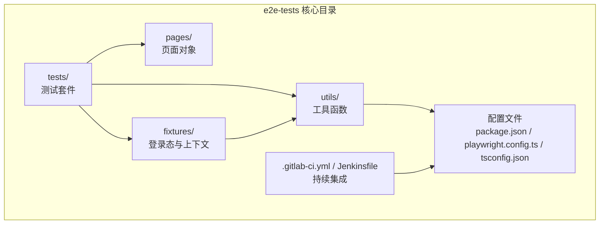
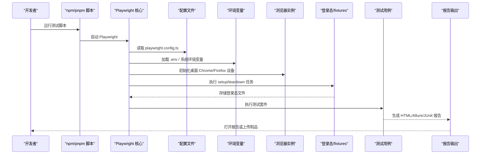
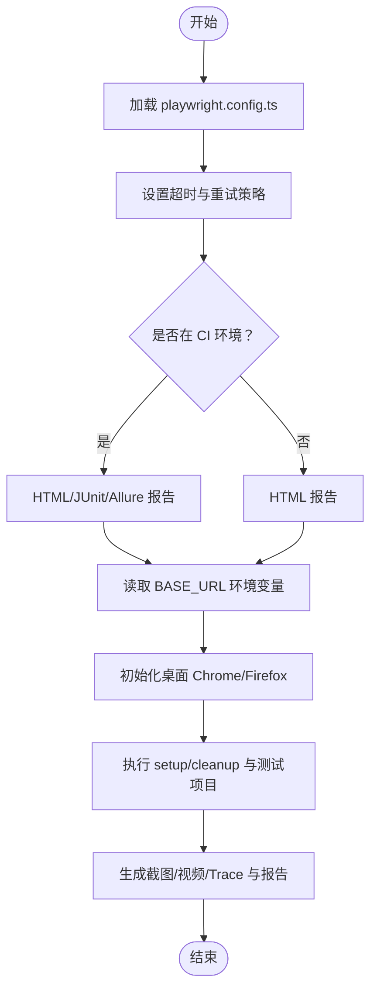
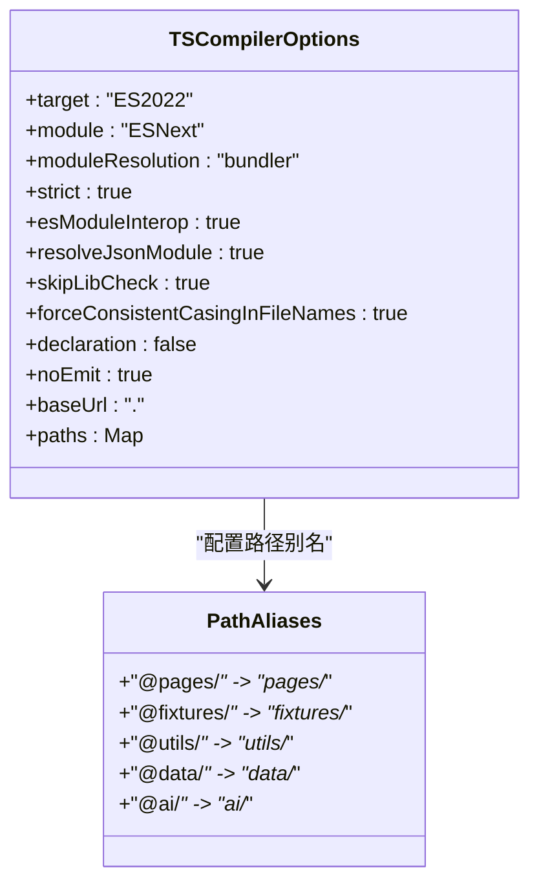
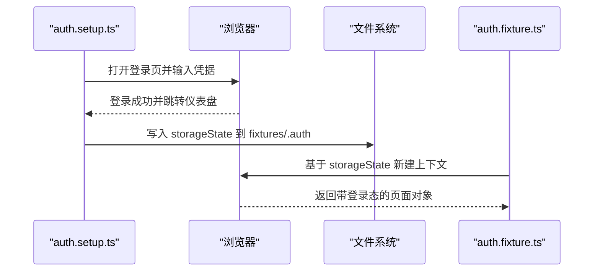
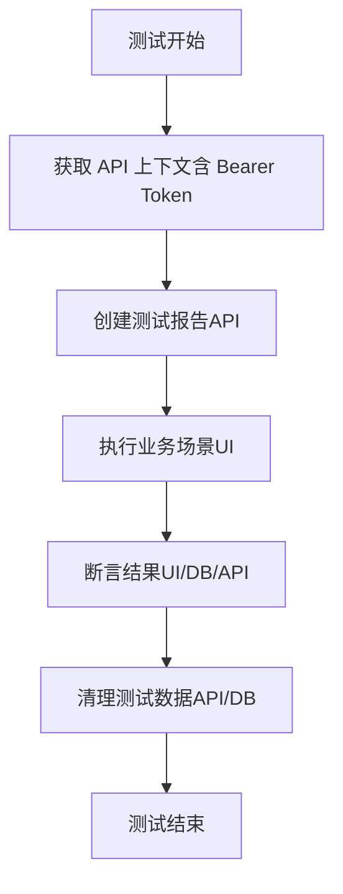
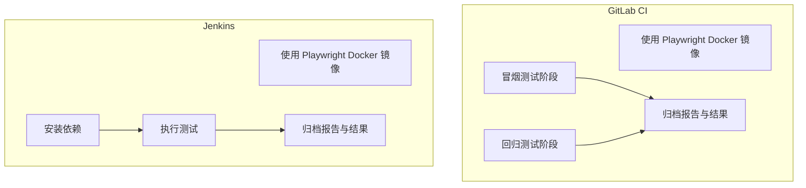
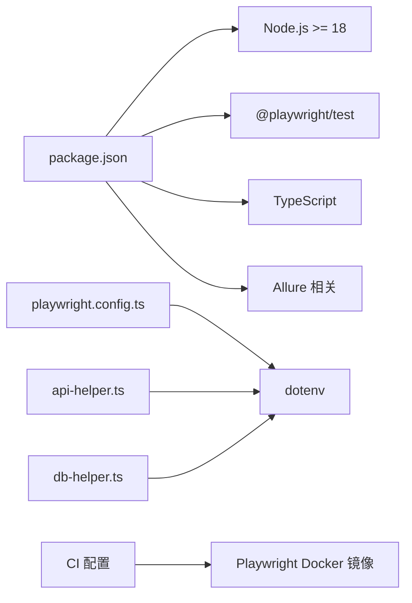

# 开发环境设置

<cite>
**本文档引用的文件**
- [package.json](file://e2e-tests/package.json)
- [playwright.config.ts](file://e2e-tests/playwright.config.ts)
- [tsconfig.json](file://e2e-tests/tsconfig.json)
- [.gitlab-ci.yml](file://e2e-tests/.gitlab-ci.yml)
- [Jenkinsfile](file://e2e-tests/Jenkinsfile)
- [auth.setup.ts](file://e2e-tests/fixtures/auth.setup.ts)
- [auth.fixture.ts](file://e2e-tests/fixtures/auth.fixture.ts)
- [db-helper.ts](file://e2e-tests/utils/db-helper.ts)
- [api-helper.ts](file://e2e-tests/utils/api-helper.ts)
</cite>

## 目录
1. [简介](#简介)
2. [项目结构](#项目结构)
3. [核心组件](#核心组件)
4. [架构概览](#架构概览)
5. [详细组件分析](#详细组件分析)
6. [依赖分析](#依赖分析)
7. [性能考虑](#性能考虑)
8. [故障排除指南](#故障排除指南)
9. [结论](#结论)
10. [附录](#附录)

## 简介
本指南面向开发者，提供基于 Playwright 的端到端测试环境完整设置方案。内容涵盖 Node.js 版本要求、依赖安装、环境变量配置、TypeScript 编译配置与路径别名、Playwright 测试框架安装与配置、浏览器驱动管理、IDE 配置建议、调试工具设置、代码格式化规则、本地开发服务器启动、测试环境配置以及数据库连接设置。文档同时提供跨平台安装与配置步骤，确保开发环境的一致性与可重复性。

## 项目结构
e2e-tests 目录是本次自动化测试的核心工作区，包含测试用例、页面对象、辅助工具、配置文件与 CI/CD 集成文件。关键目录与文件职责如下：
- tests：按冒烟测试与回归测试分类组织的测试套件
- fixtures：登录态准备与清理、角色化页面上下文扩展
- pages：页面对象模型（POM）
- utils：数据库操作助手、API 助手、等待辅助工具
- 配置文件：package.json、playwright.config.ts、tsconfig.json
- CI/CD：.gitlab-ci.yml、Jenkinsfile

**图表来源**
- [package.json:1-27](file://e2e-tests/package.json#L1-L27)
- [playwright.config.ts:1-68](file://e2e-tests/playwright.config.ts#L1-L68)
- [tsconfig.json:1-25](file://e2e-tests/tsconfig.json#L1-L25)

**章节来源**
- [package.json:1-27](file://e2e-tests/package.json#L1-L27)
- [playwright.config.ts:1-68](file://e2e-tests/playwright.config.ts#L1-L68)
- [tsconfig.json:1-25](file://e2e-tests/tsconfig.json#L1-L25)

## 核心组件
- Node.js 运行时与包管理器：项目要求 Node.js 版本不低于 18；推荐使用 pnpm 作为包管理器，以获得更快的安装速度与更小的磁盘占用。
- Playwright 测试框架：负责浏览器自动化、截图、视频录制与 Trace 调试信息收集。
- TypeScript 编译器：启用严格模式、ESNext 模块解析、JSON 模块解析等选项，并通过路径别名提升模块导入可读性。
- 数据库与 API 辅助：提供 MySQL 连接池、API 认证上下文与测试数据清理能力。
- CI/CD 集成：GitLab CI 与 Jenkins Pipeline 基于官方 Playwright Docker 镜像运行测试，生成 HTML 报告与 JUnit 结果。

**章节来源**
- [package.json:14-25](file://e2e-tests/package.json#L14-L25)
- [playwright.config.ts:6-29](file://e2e-tests/playwright.config.ts#L6-L29)
- [tsconfig.json:2-24](file://e2e-tests/tsconfig.json#L2-L24)
- [db-helper.ts:1-91](file://e2e-tests/utils/db-helper.ts#L1-L91)
- [api-helper.ts:1-172](file://e2e-tests/utils/api-helper.ts#L1-L172)
- [.gitlab-ci.yml:1-67](file://e2e-tests/.gitlab-ci.yml#L1-L67)
- [Jenkinsfile:1-59](file://e2e-tests/Jenkinsfile#L1-L59)

## 架构概览
下图展示了本地与 CI 环境中测试执行的关键流程：从脚本命令触发 Playwright，加载配置与环境变量，初始化浏览器设备与登录态，执行测试用例，收集截图/视频/Trace 并生成报告。

**图表来源**
- [playwright.config.ts:6-66](file://e2e-tests/playwright.config.ts#L6-L66)
- [package.json:6-12](file://e2e-tests/package.json#L6-L12)
- [auth.setup.ts:16-27](file://e2e-tests/fixtures/auth.setup.ts#L16-L27)

**章节来源**
- [playwright.config.ts:1-68](file://e2e-tests/playwright.config.ts#L1-L68)
- [package.json:6-12](file://e2e-tests/package.json#L6-L12)

## 详细组件分析

### Node.js 与包管理器设置
- Node.js 版本要求：引擎声明要求 Node.js >= 18，建议使用 LTS 版本以获得稳定支持。
- 包管理器选择：推荐使用 pnpm，其优势包括更快的安装速度、严格的依赖隔离与更小的磁盘占用。
- 安装步骤（通用）：
  1) 安装 Node.js（版本 ≥ 18）
  2) 安装 pnpm（如未安装）
  3) 在 e2e-tests 目录执行 pnpm install --frozen-lockfile
- Windows 特定提示：若遇到权限问题，请以管理员身份打开终端；若网络受限，可配置 pnpm registry 或使用代理。

**章节来源**
- [package.json:14-16](file://e2e-tests/package.json#L14-L16)
- [package.json:17-25](file://e2e-tests/package.json#L17-L25)

### Playwright 安装与配置
- 安装依赖：项目已包含 @playwright/test 与相关类型定义，安装后自动完成浏览器驱动下载。
- 配置要点：
  - testDir：测试目录为 ./tests
  - timeout：整体超时 30 秒，expect 超时 5 秒
  - 并行策略：fullyParallel=true，CI 环境下 workers=4，本地 workers=1
  - 重试策略：CI 环境 retries=2，本地 retries=0
  - 报告器：CI 环境输出 HTML/JUnit/Allure，本地仅 HTML
  - 基础 URL：默认 http://localhost:8080，可通过环境变量覆盖
  - 截图/视频/Trace：失败时自动保留
  - 项目划分：setup/cleanup 无浏览器执行；smoke-chromium；regression-chromium/firefox
- 浏览器驱动管理：首次运行时自动下载对应浏览器驱动；CI 环境使用官方 Playwright Docker 镜像，避免本地驱动差异。

**图表来源**
- [playwright.config.ts:6-66](file://e2e-tests/playwright.config.ts#L6-L66)

**章节来源**
- [playwright.config.ts:6-66](file://e2e-tests/playwright.config.ts#L6-L66)
- [.gitlab-ci.yml:14-18](file://e2e-tests/.gitlab-ci.yml#L14-L18)
- [Jenkinsfile](file://e2e-tests/Jenkinsfile#L4)

### TypeScript 编译配置与路径别名
- 编译目标：ES2022，模块系统 ESNext，bundler 解析器
- 严格模式：开启严格检查，提升类型安全
- JSON 模块：允许直接导入 .json 文件
- 路径别名：baseUrl 为当前目录，映射 @pages/@fixtures/@utils/@data/@ai 到对应子目录
- include/exclude：包含所有 .ts 文件，排除 node_modules

**图表来源**
- [tsconfig.json:2-20](file://e2e-tests/tsconfig.json#L2-L20)

**章节来源**
- [tsconfig.json:1-25](file://e2e-tests/tsconfig.json#L1-L25)

### 环境变量配置
- 必需变量：
  - BASE_URL：测试目标应用的基础地址，默认 http://localhost:8080
  - API_BASE_URL：API 基础地址，默认 http://localhost:8080/api
- 数据库变量（用于 db-helper）：
  - DB_HOST：数据库主机，默认 localhost
  - DB_PORT：数据库端口，默认 3306
  - DB_USER：数据库用户，默认 test_user
  - DB_PASSWORD：数据库密码
  - DB_NAME：数据库名，默认 hospital_exam
- 推荐做法：在项目根目录创建 .env 文件，将上述变量写入；dotenv 将在运行时自动加载。

**章节来源**
- [playwright.config.ts:24-25](file://e2e-tests/playwright.config.ts#L24-L25)
- [api-helper.ts](file://e2e-tests/utils/api-helper.ts#L6)
- [db-helper.ts:14-19](file://e2e-tests/utils/db-helper.ts#L14-L19)

### 登录态与角色化上下文
- 登录态准备：auth.setup.ts 会为不同角色（如 admin）执行登录流程，并将 storageState 写入 fixtures/.auth 目录
- 角色化页面：auth.fixture.ts 通过 test.extend 提供 doctorPage/auditorPage/adminPage，分别注入对应角色的 storageState
- 使用方式：在测试中引入该 fixture，即可直接使用带登录态的页面对象

**图表来源**
- [auth.setup.ts:16-27](file://e2e-tests/fixtures/auth.setup.ts#L16-L27)
- [auth.fixture.ts:10-37](file://e2e-tests/fixtures/auth.fixture.ts#L10-L37)

**章节来源**
- [auth.setup.ts:1-28](file://e2e-tests/fixtures/auth.setup.ts#L1-L28)
- [auth.fixture.ts:1-40](file://e2e-tests/fixtures/auth.fixture.ts#L1-L40)

### 数据库连接与 API 辅助
- 数据库连接池：db-helper.ts 提供单例连接池，支持按环境变量动态配置；包含测试数据重置与清理方法
- API 助手：api-helper.ts 提供认证上下文创建、报告创建/删除/状态更新、报告查询与批量清理等接口
- 典型用法：在测试前通过 API 准备数据，在测试后清理数据，保证测试隔离性

**图表来源**
- [api-helper.ts:45-77](file://e2e-tests/utils/api-helper.ts#L45-L77)
- [db-helper.ts:33-43](file://e2e-tests/utils/db-helper.ts#L33-L43)

**章节来源**
- [db-helper.ts:1-91](file://e2e-tests/utils/db-helper.ts#L1-L91)
- [api-helper.ts:1-172](file://e2e-tests/utils/api-helper.ts#L1-L172)

### CI/CD 集成（GitLab CI 与 Jenkins）
- GitLab CI：
  - 使用官方 Playwright Docker 镜像，确保浏览器驱动一致性
  - 支持冒烟测试与回归测试阶段，产物归档至制品库
  - 可选通知：通过企业微信 Webhook 发送测试报告链接
- Jenkins：
  - 使用相同镜像，按项目执行冒烟与回归测试
  - 归档 HTML 报告与测试结果，便于回溯

**图表来源**
- [.gitlab-ci.yml:14-18](file://e2e-tests/.gitlab-ci.yml#L14-L18)
- [.gitlab-ci.yml:32-36](file://e2e-tests/.gitlab-ci.yml#L32-L36)
- [Jenkinsfile](file://e2e-tests/Jenkinsfile#L4)
- [Jenkinsfile:24-36](file://e2e-tests/Jenkinsfile#L24-L36)

**章节来源**
- [.gitlab-ci.yml:1-67](file://e2e-tests/.gitlab-ci.yml#L1-L67)
- [Jenkinsfile:1-59](file://e2e-tests/Jenkinsfile#L1-L59)

## 依赖分析
- 直接依赖关系：
  - playwright.config.ts 依赖 dotenv 读取环境变量
  - api-helper.ts 与 db-helper.ts 依赖 dotenv 读取环境变量
  - package.json 定义了脚本命令与 Node.js 版本约束
- 外部依赖：
  - Playwright 官方 Docker 镜像确保跨平台浏览器驱动一致性
  - pnpm 作为包管理器，加速依赖安装与缓存复用

**图表来源**
- [package.json:14-25](file://e2e-tests/package.json#L14-L25)
- [playwright.config.ts:2-4](file://e2e-tests/playwright.config.ts#L2-L4)
- [api-helper.ts:2-4](file://e2e-tests/utils/api-helper.ts#L2-L4)
- [db-helper.ts:2-4](file://e2e-tests/utils/db-helper.ts#L2-L4)
- [.gitlab-ci.yml:14-18](file://e2e-tests/.gitlab-ci.yml#L14-L18)
- [Jenkinsfile](file://e2e-tests/Jenkinsfile#L4)

**章节来源**
- [package.json:1-27](file://e2e-tests/package.json#L1-L27)
- [playwright.config.ts:1-68](file://e2e-tests/playwright.config.ts#L1-L68)
- [api-helper.ts:1-172](file://e2e-tests/utils/api-helper.ts#L1-L172)
- [db-helper.ts:1-91](file://e2e-tests/utils/db-helper.ts#L1-L91)
- [.gitlab-ci.yml:1-67](file://e2e-tests/.gitlab-ci.yml#L1-L67)
- [Jenkinsfile:1-59](file://e2e-tests/Jenkinsfile#L1-L59)

## 性能考虑
- 并行与重试：本地开发建议关闭并行与重试，提升调试效率；CI 环境开启以充分利用资源
- 工作线程：本地 workers=1，CI workers=4，避免资源争用
- 截图/视频/Trace：仅在失败时保留，减少磁盘占用；可在本地调试时临时开启更多日志
- 依赖安装：使用 pnpm 并启用缓存，缩短安装时间

## 故障排除指南
- Node.js 版本不匹配：根据 engines 字段升级 Node.js 至 18+；确认全局与项目使用的版本一致
- 浏览器驱动问题：首次运行自动下载；若失败，检查网络与代理设置；CI 环境统一使用官方镜像
- 环境变量缺失：确保 .env 文件包含 BASE_URL、API_BASE_URL、数据库相关变量；运行前检查 dotenv 是否正确加载
- 登录态失效：删除 fixtures/.auth 下的存储文件，重新执行 setup 任务
- 数据库连接失败：核对 DB_HOST/DB_PORT/DB_USER/DB_PASSWORD/DB_NAME；确认数据库服务可用
- CI 报告无法访问：检查 artifacts 配置与制品库权限；确认报告目录路径正确

**章节来源**
- [package.json:14-16](file://e2e-tests/package.json#L14-L16)
- [playwright.config.ts:24-29](file://e2e-tests/playwright.config.ts#L24-L29)
- [auth.setup.ts:9-14](file://e2e-tests/fixtures/auth.setup.ts#L9-L14)
- [db-helper.ts:14-23](file://e2e-tests/utils/db-helper.ts#L14-L23)
- [.gitlab-ci.yml:19-25](file://e2e-tests/.gitlab-ci.yml#L19-L25)
- [Jenkinsfile:42-50](file://e2e-tests/Jenkinsfile#L42-L50)

## 结论
通过遵循本指南，开发者可以在本地与 CI 环境中快速搭建一致且可重复的 Playwright 自动化测试环境。关键在于满足 Node.js 版本要求、正确安装依赖、合理配置环境变量与路径别名、利用登录态与 API/DB 辅助工具提升测试稳定性，并结合 CI/CD 配置实现自动化报告与制品归档。

## 附录

### 本地开发服务器启动
- 应用服务：确保目标应用已在 http://localhost:8080 启动；如需自定义端口，请同步更新 BASE_URL 环境变量
- 启动命令：在项目根目录执行应用启动脚本（由被测系统提供）

### 测试环境配置
- 冒烟测试：pnpm run test:smoke
- 回归测试：pnpm run test:regression
- 全量测试：pnpm run test:all
- 列出测试：pnpm run test:list
- 查看报告：pnpm run report:html
- Allure 报告：pnpm run report:allure

**章节来源**
- [package.json:6-12](file://e2e-tests/package.json#L6-L12)

### IDE 配置建议
- VSCode 插件：TypeScript Importer、ESLint、Prettier、DotENV、Playwright Test
- ESLint：启用 TypeScript 与 import/no-unresolved 规则，保持路径别名解析一致
- Prettier：统一缩进与引号风格，与项目 TypeScript 配置保持兼容
- 调试配置：为 playwright.config.ts 添加调试任务，便于断点调试

### 代码格式化规则
- 缩进：4 空格
- 引号：双引号
- 行尾：LF
- 最大行长：120
- 禁止尾随空格

### 不同操作系统安装步骤

#### Windows
- 安装 Node.js（版本 ≥ 18）
- 安装 pnpm（如未安装）
- 在 e2e-tests 目录执行 pnpm install --frozen-lockfile
- 如遇权限问题，以管理员身份打开终端
- 设置环境变量：BASE_URL、API_BASE_URL、数据库相关变量

#### macOS
- 使用 Homebrew 安装 Node.js（版本 ≥ 18）
- 安装 pnpm：brew install pnpm
- 在 e2e-tests 目录执行 pnpm install --frozen-lockfile
- 若网络受限，配置 npm registry 或使用代理

#### Linux（Ubuntu/Debian）
- 使用 NodeSource 仓库安装 Node.js（版本 ≥ 18）
- 安装 pnpm：npm install -g pnpm
- 在 e2e-tests 目录执行 pnpm install --frozen-lockfile
- CI 环境使用官方 Playwright Docker 镜像，确保浏览器驱动一致性