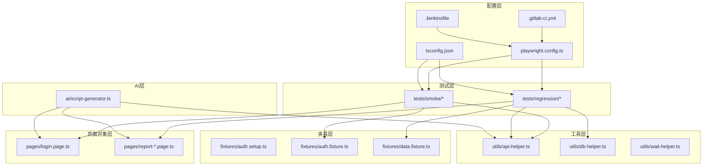
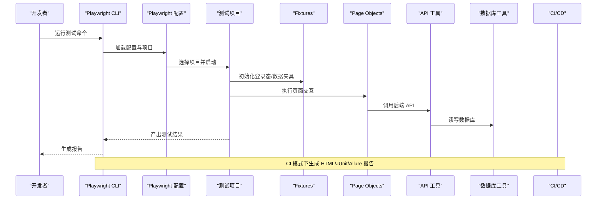
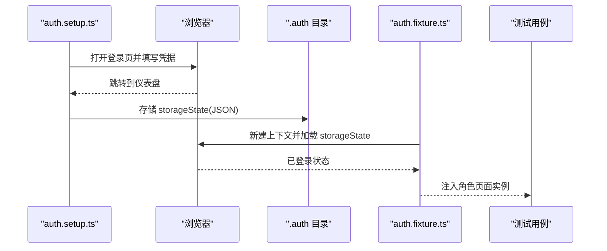
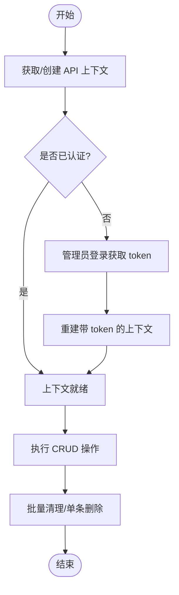
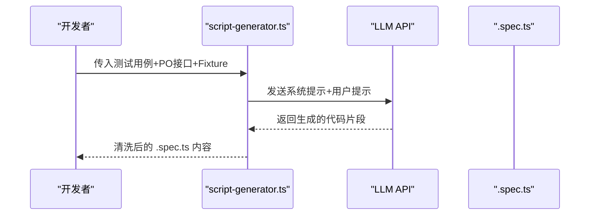
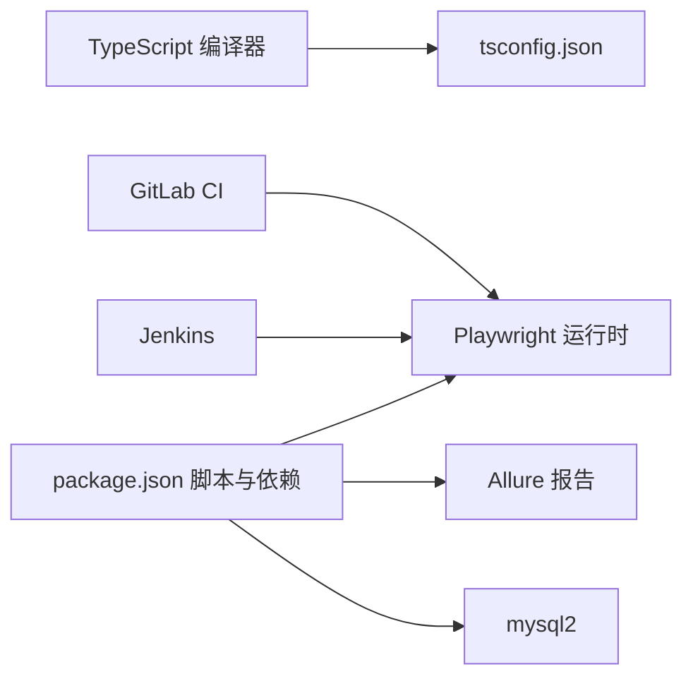

# 开发者指南

<cite>
**本文引用的文件**
- [package.json](file://e2e-tests/package.json)
- [playwright.config.ts](file://e2e-tests/playwright.config.ts)
- [tsconfig.json](file://e2e-tests/tsconfig.json)
- [.gitlab-ci.yml](file://e2e-tests/.gitlab-ci.yml)
- [Jenkinsfile](file://e2e-tests/Jenkinsfile)
- [login.spec.ts](file://e2e-tests/tests/smoke/login.spec.ts)
- [auth.setup.ts](file://e2e-tests/fixtures/auth.setup.ts)
- [auth.fixture.ts](file://e2e-tests/fixtures/auth.fixture.ts)
- [data.fixture.ts](file://e2e-tests/fixtures/data.fixture.ts)
- [api-helper.ts](file://e2e-tests/utils/api-helper.ts)
- [db-helper.ts](file://e2e-tests/utils/db-helper.ts)
- [login.page.ts](file://e2e-tests/pages/login.page.ts)
- [report-crud.spec.ts](file://e2e-tests/tests/regression/report-crud.spec.ts)
- [script-generator.ts](file://e2e-tests/ai/script-generator.ts)
</cite>

## 目录
1. [简介](#简介)
2. [项目结构](#项目结构)
3. [核心组件](#核心组件)
4. [架构总览](#架构总览)
5. [详细组件分析](#详细组件分析)
6. [依赖关系分析](#依赖关系分析)
7. [性能考虑](#性能考虑)
8. [故障排查指南](#故障排查指南)
9. [结论](#结论)
10. [附录](#附录)

## 简介
本指南面向希望参与“医院体检报告管理系统”端到端测试自动化开发的贡献者，覆盖开发环境搭建、本地调试、测试运行、CI/CD 集成、AI 辅助脚本生成、API 扩展与系统集成、代码规范与最佳实践、性能优化与安全注意事项等。目标是帮助你在最短时间内上手并高质量交付测试自动化能力。

## 项目结构
该仓库为独立的 e2e 测试子工程，采用 Playwright 进行跨浏览器端到端测试，并通过 fixtures、page objects、API 工具与数据库工具形成清晰的分层结构。整体组织如下：
- tests：按冒烟与回归两类场景组织测试用例
- fixtures：登录态准备与数据准备 fixtures
- pages：页面对象封装
- utils：API 与数据库辅助工具
- ai：基于 LLM 的测试脚本生成器
- 配置：package.json、playwright.config.ts、tsconfig.json、CI/CD 配置

图表来源
- [playwright.config.ts:1-68](file://e2e-tests/playwright.config.ts#L1-L68)
- [tsconfig.json:1-25](file://e2e-tests/tsconfig.json#L1-L25)
- [.gitlab-ci.yml:1-67](file://e2e-tests/.gitlab-ci.yml#L1-L67)
- [Jenkinsfile:1-59](file://e2e-tests/Jenkinsfile#L1-L59)

章节来源
- [playwright.config.ts:1-68](file://e2e-tests/playwright.config.ts#L1-L68)
- [tsconfig.json:1-25](file://e2e-tests/tsconfig.json#L1-L25)

## 核心组件
- Playwright 配置与运行时
  - 通过 projects 将“登录态准备”“冒烟测试”“回归测试”解耦，支持多浏览器并行执行
  - CI 下启用 HTML/JUnit/Allure 报告与重试策略
- Fixtures
  - auth.setup.ts：生成各角色登录态快照，供后续项目复用
  - auth.fixture.ts：为不同角色注入独立的浏览器上下文
  - data.fixture.ts：自动创建不同状态的测试报告并在用例后清理
- Page Objects
  - login.page.ts：封装登录页交互与断言
- 工具
  - api-helper.ts：统一 API 认证上下文、报告 CRUD、批量清理
  - db-helper.ts：数据库连接池、测试数据清理与状态校验
- AI 脚本生成
  - script-generator.ts：基于 LLM 将测试用例描述转换为可执行的 .spec.ts

章节来源
- [playwright.config.ts:31-66](file://e2e-tests/playwright.config.ts#L31-L66)
- [auth.setup.ts:1-30](file://e2e-tests/fixtures/auth.setup.ts#L1-L30)
- [auth.fixture.ts:1-40](file://e2e-tests/fixtures/auth.fixture.ts#L1-L40)
- [data.fixture.ts:1-57](file://e2e-tests/fixtures/data.fixture.ts#L1-L57)
- [login.page.ts:1-52](file://e2e-tests/pages/login.page.ts#L1-L52)
- [api-helper.ts:1-172](file://e2e-tests/utils/api-helper.ts#L1-L172)
- [db-helper.ts:1-91](file://e2e-tests/utils/db-helper.ts#L1-L91)
- [script-generator.ts:1-110](file://e2e-tests/ai/script-generator.ts#L1-L110)

## 架构总览
下图展示从测试执行到报告产出的关键路径，包括本地与 CI 两种运行模式：

图表来源
- [playwright.config.ts:16-22](file://e2e-tests/playwright.config.ts#L16-L22)
- [auth.setup.ts:18-28](file://e2e-tests/fixtures/auth.setup.ts#L18-L28)
- [api-helper.ts:45-77](file://e2e-tests/utils/api-helper.ts#L45-L77)
- [db-helper.ts:11-27](file://e2e-tests/utils/db-helper.ts#L11-L27)
- [.gitlab-ci.yml:14-18](file://e2e-tests/.gitlab-ci.yml#L14-L18)
- [Jenkinsfile:21-36](file://e2e-tests/Jenkinsfile#L21-L36)

## 详细组件分析

### Playwright 配置与项目管理
- 多项目解耦
  - setup/cleanup：无浏览器执行，仅生成登录态快照
  - smoke-chromium：冒烟测试，Chromium
  - regression-chromium/firefox：回归测试，双浏览器
- 并行与重试
  - fullyParallel、retries、workers 在 CI 与本地差异配置
- 报告策略
  - CI：HTML/JUnit/Allure；本地：仅 HTML
- 基础地址与录制
  - baseURL、screenshot/video/trace 默认策略

章节来源
- [playwright.config.ts:6-66](file://e2e-tests/playwright.config.ts#L6-L66)

### 登录态准备与复用
- auth.setup.ts
  - 遍历用户角色，访问登录页，输入凭据，等待跳转至仪表盘，存储 storageState 至 .auth 目录
- auth.fixture.ts
  - 为 doctor/auditor/admin 注入带 storageState 的浏览器上下文，确保测试在已登录状态下执行
- data.fixture.ts
  - 基于 API 自动创建不同状态的报告，用例结束后自动清理

图表来源
- [auth.setup.ts:18-28](file://e2e-tests/fixtures/auth.setup.ts#L18-L28)
- [auth.fixture.ts:10-37](file://e2e-tests/fixtures/auth.fixture.ts#L10-L37)

章节来源
- [auth.setup.ts:1-30](file://e2e-tests/fixtures/auth.setup.ts#L1-L30)
- [auth.fixture.ts:1-40](file://e2e-tests/fixtures/auth.fixture.ts#L1-L40)
- [data.fixture.ts:1-57](file://e2e-tests/fixtures/data.fixture.ts#L1-L57)

### 页面对象与断言
- login.page.ts
  - 定义常用定位器与登录流程方法，提供“完整登录”和“尝试登录”两种场景
  - 断言使用 expect，确保页面跳转与错误提示可见性

章节来源
- [login.page.ts:1-52](file://e2e-tests/pages/login.page.ts#L1-L52)
- [login.spec.ts:1-25](file://e2e-tests/tests/smoke/login.spec.ts#L1-L25)

### API 工具与数据库工具
- api-helper.ts
  - 单例 API 上下文：首次使用管理员登录获取 token，随后请求自动携带 Authorization
  - 提供创建/删除/更新状态/查询报告、批量清理等能力
- db-helper.ts
  - 数据库连接池单例，提供测试数据重置、按前缀清理、状态查询、计数统计
  - 支持在 globalTeardown 中关闭连接池

图表来源
- [api-helper.ts:45-77](file://e2e-tests/utils/api-helper.ts#L45-L77)
- [api-helper.ts:83-121](file://e2e-tests/utils/api-helper.ts#L83-L121)
- [api-helper.ts:156-161](file://e2e-tests/utils/api-helper.ts#L156-L161)

章节来源
- [api-helper.ts:1-172](file://e2e-tests/utils/api-helper.ts#L1-L172)
- [db-helper.ts:1-91](file://e2e-tests/utils/db-helper.ts#L1-L91)

### AI 脚本生成器
- script-generator.ts
  - 通过 LLM API 生成 Playwright 测试脚本，支持传入测试用例、Page Object 接口与可用 Fixture/工具
  - 对缺失 LLM 配置进行显式报错，避免静默失败
  - 输出纯 TS 代码，去除可能的 markdown 代码块标记

图表来源
- [script-generator.ts:63-109](file://e2e-tests/ai/script-generator.ts#L63-L109)

章节来源
- [script-generator.ts:1-110](file://e2e-tests/ai/script-generator.ts#L1-L110)

### 典型测试用例：报告 CRUD
- report-crud.spec.ts
  - 使用 data.fixture.ts 自动创建/清理报告
  - 覆盖创建、编辑、删除、保存草稿等场景
  - 结合 API 与页面对象，验证 UI 行为与数据持久化

章节来源
- [report-crud.spec.ts:1-122](file://e2e-tests/tests/regression/report-crud.spec.ts#L1-L122)

## 依赖关系分析
- 语言与构建
  - TypeScript ESNext 模块解析，严格模式，路径别名映射到 @pages/@fixtures/@utils/@data/@ai
- 运行时依赖
  - Playwright v1.50.0，Node >= 18
  - Allure 报告、dotenv、mysql2、typescript
- CI/CD
  - GitLab CI：多阶段流水线，冒烟/回归测试，产物归档与通知
  - Jenkins：Docker Playwright 镜像，冒烟/回归阶段，报告归档

图表来源
- [tsconfig.json:14-20](file://e2e-tests/tsconfig.json#L14-L20)
- [package.json:6-25](file://e2e-tests/package.json#L6-L25)
- [.gitlab-ci.yml:14-18](file://e2e-tests/.gitlab-ci.yml#L14-L18)
- [Jenkinsfile:3-6](file://e2e-tests/Jenkinsfile#L3-L6)

章节来源
- [package.json:1-27](file://e2e-tests/package.json#L1-L27)
- [tsconfig.json:1-25](file://e2e-tests/tsconfig.json#L1-L25)
- [.gitlab-ci.yml:1-67](file://e2e-tests/.gitlab-ci.yml#L1-L67)
- [Jenkinsfile:1-59](file://e2e-tests/Jenkinsfile#L1-L59)

## 性能考虑
- 并行与资源
  - CI 下启用 fullyParallel、retries 与多 workers，提升吞吐；本地默认串行以便调试
- 录制与报告
  - 失败时录制截图/视频/trace，便于回溯但会增加磁盘占用；可在本地调整策略
- 数据清理
  - 使用 API 批量清理与数据库按前缀清理，避免脏数据影响后续用例
- LLM 调用
  - 脚本生成器应避免频繁调用，必要时缓存中间产物或合并请求

章节来源
- [playwright.config.ts:12-15](file://e2e-tests/playwright.config.ts#L12-L15)
- [playwright.config.ts:24-29](file://e2e-tests/playwright.config.ts#L24-L29)
- [api-helper.ts:156-161](file://e2e-tests/utils/api-helper.ts#L156-L161)
- [db-helper.ts:48-54](file://e2e-tests/utils/db-helper.ts#L48-L54)

## 故障排查指南
- LLM 配置缺失
  - 现象：调用 LLM API 抛出配置错误
  - 处理：在环境变量中设置 LLM_API_URL、LLM_API_KEY、LLM_MODEL
- 登录态失效
  - 现象：测试在登录后无法跳转或鉴权失败
  - 处理：重新运行 auth.setup.ts 生成 storageState；确认 baseURL 与登录页路由
- 报告状态不一致
  - 现象：UI 与数据库状态不符
  - 处理：使用 db-helper 查询真实状态，核对 API 更新逻辑
- CI 报告未生成
  - 现象：CI 成功但无报告
  - 处理：检查 CI 配置中的报告输出路径与制品归档

章节来源
- [script-generator.ts:13-16](file://e2e-tests/ai/script-generator.ts#L13-L16)
- [auth.setup.ts:18-28](file://e2e-tests/fixtures/auth.setup.ts#L18-L28)
- [db-helper.ts:59-67](file://e2e-tests/utils/db-helper.ts#L59-L67)
- [.gitlab-ci.yml:18-25](file://e2e-tests/.gitlab-ci.yml#L18-L25)
- [Jenkinsfile:42-50](file://e2e-tests/Jenkinsfile#L42-L50)

## 结论
本项目以 Playwright 为核心，结合 fixtures、page objects、API 与数据库工具，形成了可维护、可扩展的端到端测试体系。通过 CI/CD 自动化与 AI 脚本生成，能够快速扩展测试覆盖面并降低重复劳动。建议在新增功能时遵循现有分层与命名约定，优先使用 fixtures 与工具函数，确保测试稳定与可读性。

## 附录

### 开发环境设置与本地调试
- 环境要求
  - Node 版本：>= 18
  - 包管理：推荐 pnpm（CI 使用 frozen-lockfile）
- 本地安装与运行
  - 安装依赖：在 e2e-tests 目录执行安装
  - 运行冒烟测试：使用 smoke 项目
  - 运行回归测试：使用 regression 项目
  - 查看报告：本地 HTML 报告在 playwright-report 目录
- 环境变量
  - BASE_URL：目标应用地址
  - API_BASE_URL：后端 API 地址
  - DB_*：数据库连接参数
  - LLM_*：AI 脚本生成所需参数

章节来源
- [package.json:14-16](file://e2e-tests/package.json#L14-L16)
- [playwright.config.ts:24-26](file://e2e-tests/playwright.config.ts#L24-L26)
- [api-helper.ts:6](file://e2e-tests/utils/api-helper.ts#L6)
- [db-helper.ts:14-23](file://e2e-tests/utils/db-helper.ts#L14-L23)
- [script-generator.ts:6-8](file://e2e-tests/ai/script-generator.ts#L6-L8)

### 新功能开发流程与代码规范
- 流程建议
  - 设计测试用例 → 编写 Page Object → 实现 API/数据库工具 → 编写测试用例 → 集成 fixtures → CI 验证
- 规范要点
  - 使用 describe/it 分组组织用例，断言使用 expect
  - 页面交互集中在 page 对象，避免在用例中直接操作 DOM
  - 使用 fixtures 管理登录态与测试数据，确保用例独立性
  - API 工具统一认证与错误处理，避免分散逻辑

章节来源
- [login.page.ts:28-43](file://e2e-tests/pages/login.page.ts#L28-L43)
- [api-helper.ts:45-77](file://e2e-tests/utils/api-helper.ts#L45-L77)
- [data.fixture.ts:13-54](file://e2e-tests/fixtures/data.fixture.ts#L13-L54)

### 插件开发与扩展接口
- 扩展点
  - 新增 Page Object：在 pages 目录下新增类并导出
  - 新增 API 工具：在 utils 下新增函数并导出
  - 新增数据库校验：在 db-helper 中新增查询/清理方法
  - 新增 AI 脚本生成：在 ai 目录下新增生成器并接入调用入口
- 集成方式
  - 在 playwright.config.ts 中注册新的项目或夹具
  - 在测试中引入并使用

章节来源
- [login.page.ts:1-52](file://e2e-tests/pages/login.page.ts#L1-L52)
- [api-helper.ts:1-172](file://e2e-tests/utils/api-helper.ts#L1-L172)
- [db-helper.ts:1-91](file://e2e-tests/utils/db-helper.ts#L1-L91)
- [script-generator.ts:1-110](file://e2e-tests/ai/script-generator.ts#L1-L110)
- [playwright.config.ts:31-66](file://e2e-tests/playwright.config.ts#L31-L66)

### 测试要求与文档规范
- 测试覆盖率
  - 建议至少覆盖核心业务路径（登录、报告 CRUD、状态流转）
- 文档与注释
  - 用例命名清晰，步骤与断言明确
  - 工具函数与接口需提供简要说明
- 报告与归档
  - 本地与 CI 均应保留报告产物，便于问题追踪

章节来源
- [report-crud.spec.ts:1-122](file://e2e-tests/tests/regression/report-crud.spec.ts#L1-L122)
- [playwright.config.ts:16-22](file://e2e-tests/playwright.config.ts#L16-L22)
- [.gitlab-ci.yml:18-25](file://e2e-tests/.gitlab-ci.yml#L18-L25)
- [Jenkinsfile:42-50](file://e2e-tests/Jenkinsfile#L42-L50)

### 安全与兼容性
- 安全
  - 不在代码中硬编码敏感信息，使用环境变量与 CI 变量管理
  - API 认证使用 Bearer Token，避免明文传输
- 兼容性
  - 通过 projects 同时覆盖 Chromium 与 Firefox
  - CI 使用官方 Playwright Docker 镜像，确保环境一致性

章节来源
- [api-helper.ts:66-74](file://e2e-tests/utils/api-helper.ts#L66-L74)
- [playwright.config.ts:53-65](file://e2e-tests/playwright.config.ts#L53-L65)
- [.gitlab-ci.yml:14](file://e2e-tests/.gitlab-ci.yml#L14)
- [Jenkinsfile:3-6](file://e2e-tests/Jenkinsfile#L3-L6)