# 扩展开发

<cite>
**本文引用的文件**
- [package.json](file://e2e-tests/package.json)
- [playwright.config.ts](file://e2e-tests/playwright.config.ts)
- [tsconfig.json](file://e2e-tests/tsconfig.json)
- [api-helper.ts](file://e2e-tests/utils/api-helper.ts)
- [db-helper.ts](file://e2e-tests/utils/db-helper.ts)
- [wait-helper.ts](file://e2e-tests/utils/wait-helper.ts)
- [llm-client.ts](file://e2e-tests/ai/llm-client.ts)
- [prompt-templates.ts](file://e2e-tests/ai/prompt-templates.ts)
- [context-collector.ts](file://e2e-tests/ai/context-collector.ts)
- [smart-generator.ts](file://e2e-tests/ai/smart-generator.ts)
- [post-processor.ts](file://e2e-tests/ai/post-processor.ts)
- [cli.ts](file://e2e-tests/ai/cli.ts)
- [page-analyzer.ts](file://e2e-tests/ai/page-analyzer.ts)
- [.env](file://e2e-tests/.env)
- [url-prompt-templates.ts](file://e2e-tests/ai/url-prompt-templates.ts)
- [test-generator.ts](file://e2e-tests/ai/test-generator.ts)
- [script-generator.ts](file://e2e-tests/ai/script-generator.ts)
- [failure-analyzer.ts](file://e2e-tests/ai/failure-analyzer.ts)
- [locator-healer.ts](file://e2e-tests/ai/locator-healer.ts)
- [login.page.ts](file://e2e-tests/pages/login.page.ts)
- [login.spec.ts](file://e2e-tests/tests/smoke/login.spec.ts)
- [auth.fixture.ts](file://e2e-tests/fixtures/auth.fixture.ts)
- [auth.setup.ts](file://e2e-tests/fixtures/auth.setup.ts)
- [auth.teardown.ts](file://e2e-tests/fixtures/auth.teardown.ts)
</cite>

## 更新摘要
**所做更改**
- 新增AI测试系统扩展开发章节，详细介绍AI测试生成器的增强功能
- 更新LLM客户端集成和Prompt模板管理机制
- 新增智能生成器编排引擎和上下文收集器的详细说明
- 增强AI测试系统的定制开发能力说明
- 完善AI测试生成器的扩展接口和自定义算法实现指南

## 目录
1. [简介](#简介)
2. [项目结构](#项目结构)
3. [核心组件](#核心组件)
4. [架构总览](#架构总览)
5. [详细组件分析](#详细组件分析)
6. [AI测试系统扩展开发](#aitest系统扩展开发)
7. [依赖关系分析](#依赖关系分析)
8. [性能考虑](#性能考虑)
9. [故障排查指南](#故障排查指南)
10. [结论](#结论)
11. [附录](#附录)

## 简介
本指南面向希望在现有端到端测试体系上进行扩展开发的工程师，涵盖新功能开发流程、代码架构设计与模块化原则；AI 测试生成器的扩展方法、LLM API 集成与自定义算法实现；Page Object 模式的扩展指南、页面元素定位策略与交互逻辑封装；API 辅助工具的扩展接口、数据库连接管理与数据操作封装；插件开发规范、接口设计原则与向后兼容性保证；代码审查标准、单元测试与集成测试策略；以及系统集成方法、第三方服务接入与 API 扩展接口。

**更新** 本版本重点增强了AI测试系统的扩展开发能力，支持更灵活的测试生成、定制化的Prompt模板和智能化的上下文收集。

## 项目结构
项目采用基于功能域的组织方式，核心目录如下：
- ai：AI 测试生成器与故障分析模块，包含LLM客户端、Prompt模板、智能生成器等
- utils：API 辅助工具、数据库辅助工具、等待与重试工具
- pages：Page Object 页面模型
- tests：测试用例，按 smoke/regression 划分
- fixtures：认证夹具与全局 setup/teardown
- 配置文件：package.json、playwright.config.ts、tsconfig.json

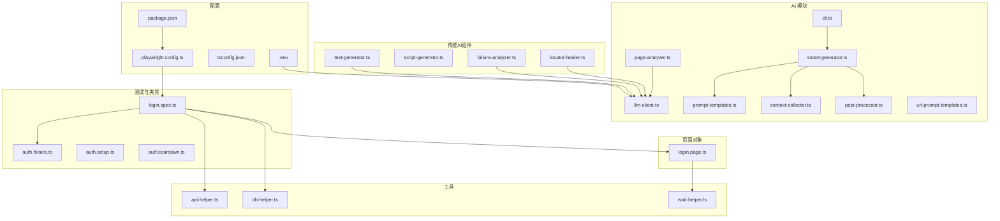

**图表来源**
- [llm-client.ts:1-120](file://e2e-tests/ai/llm-client.ts#L1-L120)
- [prompt-templates.ts:1-192](file://e2e-tests/ai/prompt-templates.ts#L1-L192)
- [context-collector.ts:1-370](file://e2e-tests/ai/context-collector.ts#L1-L370)
- [smart-generator.ts:1-272](file://e2e-tests/ai/smart-generator.ts#L1-L272)
- [post-processor.ts:1-232](file://e2e-tests/ai/post-processor.ts#L1-L232)
- [cli.ts:1-77](file://e2e-tests/ai/cli.ts#L1-L77)
- [page-analyzer.ts:1-415](file://e2e-tests/ai/page-analyzer.ts#L1-L415)
- [.env:1-21](file://e2e-tests/.env#L1-L21)

**章节来源**
- [playwright.config.ts:1-68](file://e2e-tests/playwright.config.ts#L1-L68)
- [tsconfig.json:1-25](file://e2e-tests/tsconfig.json#L1-L25)
- [cli.ts:1-77](file://e2e-tests/ai/cli.ts#L1-L77)

## 核心组件
- AI 测试生成器：提供测试用例生成、脚本生成、失败分析与定位器自愈能力，支持通过 LLM API 扩展与定制。
- 智能生成器编排引擎：基于项目上下文自动推断相关Page Object，生成高质量测试代码。
- Prompt模板管理系统：提供可扩展的模板系统，支持不同测试类型的定制化Prompt构建。
- 上下文收集器：自动扫描项目结构，收集Page Object、Fixture、工具函数等上下文信息。
- LLM客户端：统一的LLM API调用接口，支持重试机制和多种输出解析。
- 传统AI组件：包括测试生成器、脚本生成器、失败分析器和定位器修复器。
- API 辅助工具：统一管理 API 认证上下文、创建/删除/更新报告、批量清理与上下文销毁。
- 数据库辅助工具：提供连接池、测试数据重置、按前缀清理、状态查询与连接池关闭。
- 等待与重试工具：封装表格加载、Toast 显示、API 响应、SPA 导航完成与操作重试。
- Page Object：以 LoginPage 为代表的页面模型，封装定位器与交互逻辑。
- 夹具与认证：基于 storageState 的角色化登录上下文，支持 setup/teardown 生命周期。
- 配置与脚本：Playwright 配置、TypeScript 路径映射、测试脚本命令。

**章节来源**
- [llm-client.ts:1-120](file://e2e-tests/ai/llm-client.ts#L1-L120)
- [prompt-templates.ts:1-192](file://e2e-tests/ai/prompt-templates.ts#L1-L192)
- [context-collector.ts:1-370](file://e2e-tests/ai/context-collector.ts#L1-L370)
- [smart-generator.ts:1-272](file://e2e-tests/ai/smart-generator.ts#L1-L272)
- [post-processor.ts:1-232](file://e2e-tests/ai/post-processor.ts#L1-L232)
- [api-helper.ts:1-172](file://e2e-tests/utils/api-helper.ts#L1-L172)
- [db-helper.ts:1-91](file://e2e-tests/utils/db-helper.ts#L1-L91)
- [wait-helper.ts:1-107](file://e2e-tests/utils/wait-helper.ts#L1-L107)
- [login.page.ts:1-52](file://e2e-tests/pages/login.page.ts#L1-L52)
- [auth.fixture.ts:1-40](file://e2e-tests/fixtures/auth.fixture.ts#L1-L40)
- [auth.setup.ts:1-28](file://e2e-tests/fixtures/auth.setup.ts#L1-L28)
- [auth.teardown.ts:1-18](file://e2e-tests/fixtures/auth.teardown.ts#L1-L18)

## 架构总览
整体架构围绕 Playwright 运行时，结合 AI 辅助与 API/DB 工具，形成"测试用例驱动 + Page Object 封装 + 工具链支撑"的闭环。

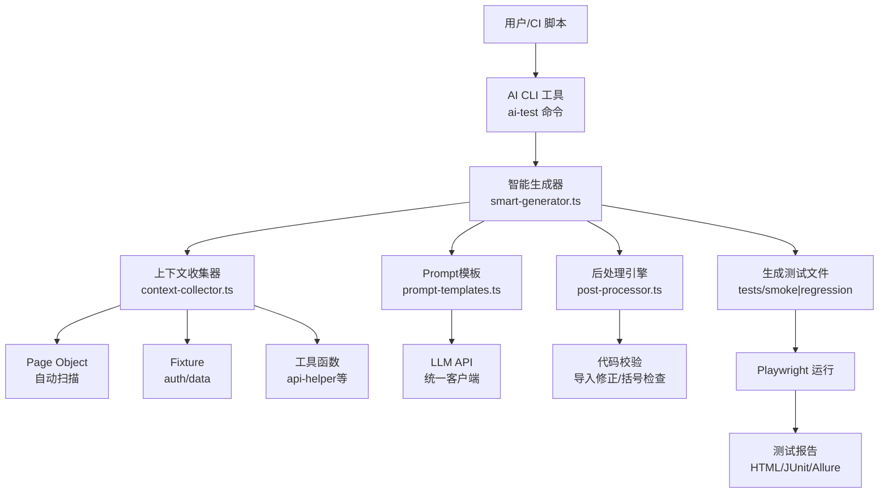

**图表来源**
- [cli.ts:1-77](file://e2e-tests/ai/cli.ts#L1-L77)
- [smart-generator.ts:1-272](file://e2e-tests/ai/smart-generator.ts#L1-L272)
- [context-collector.ts:1-370](file://e2e-tests/ai/context-collector.ts#L1-L370)
- [prompt-templates.ts:1-192](file://e2e-tests/ai/prompt-templates.ts#L1-L192)
- [post-processor.ts:1-232](file://e2e-tests/ai/post-processor.ts#L1-L232)
- [llm-client.ts:1-120](file://e2e-tests/ai/llm-client.ts#L1-L120)

## 详细组件分析

### AI 测试生成器扩展指南
- 测试用例生成：输入功能描述与角色，输出结构化测试用例数组，支持优先级与分类覆盖。
- 脚本生成：输入测试用例与 Page Object 接口、Fixture 列表，输出可直接运行的 .spec.ts 脚本。
- 失败分析：输入失败信息与上下文，输出根因分类、描述、修复建议与可选修复代码。
- 定位器自愈：基于 DOM 快照与元素描述，推荐新定位器并给出置信度与策略说明。
- LLM 集成：通过环境变量配置 LLM API 地址、密钥与模型，统一调用 OpenAI 兼容接口。
- 自定义算法：可在对应模块中扩展 prompt、消息结构与输出解析逻辑，保持接口一致。

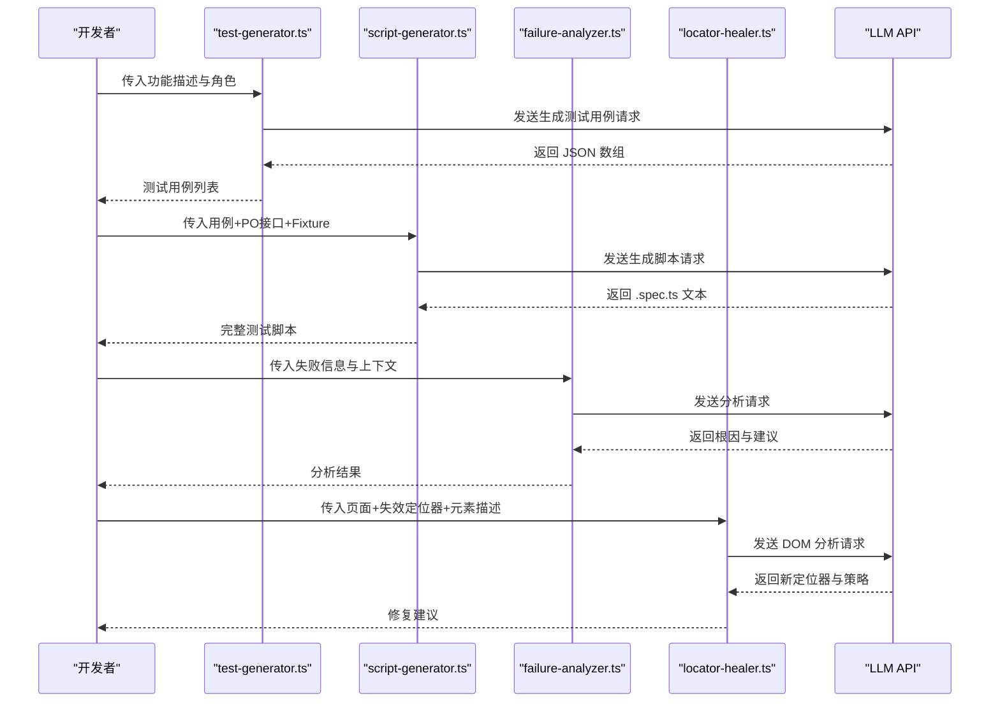

**图表来源**
- [test-generator.ts:1-61](file://e2e-tests/ai/test-generator.ts#L1-L61)
- [script-generator.ts:1-66](file://e2e-tests/ai/script-generator.ts#L1-L66)
- [failure-analyzer.ts:1-66](file://e2e-tests/ai/failure-analyzer.ts#L1-L66)
- [locator-healer.ts:1-90](file://e2e-tests/ai/locator-healer.ts#L1-L90)

**章节来源**
- [test-generator.ts:1-61](file://e2e-tests/ai/test-generator.ts#L1-L61)
- [script-generator.ts:1-66](file://e2e-tests/ai/script-generator.ts#L1-L66)
- [failure-analyzer.ts:1-66](file://e2e-tests/ai/failure-analyzer.ts#L1-L66)
- [locator-healer.ts:1-90](file://e2e-tests/ai/locator-healer.ts#L1-L90)

### API 辅助工具扩展接口
- 单例 API 上下文：自动登录获取 Token 并复用，支持销毁。
- 报告生命周期：创建、删除、状态更新、详情查询、按前缀批量清理。
- 扩展点：新增业务实体时，遵循现有接口风格，补充 CRUD 方法与清理逻辑；注意统一错误处理与上下文管理。

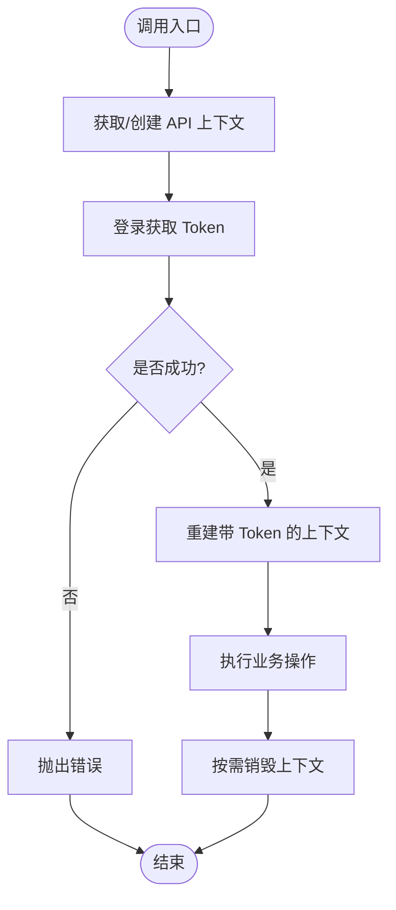

**图表来源**
- [api-helper.ts:45-77](file://e2e-tests/utils/api-helper.ts#L45-L77)

**章节来源**
- [api-helper.ts:1-172](file://e2e-tests/utils/api-helper.ts#L1-L172)

### 数据库辅助工具与数据操作封装
- 单例连接池：集中管理连接参数与并发限制。
- 测试数据治理：重置与按前缀清理，保障测试隔离。
- 数据验证：从数据库层校验状态与计数，确保断言一致性。
- 扩展点：新增实体时，补充对应的清理与查询方法，保持命名与参数风格一致。

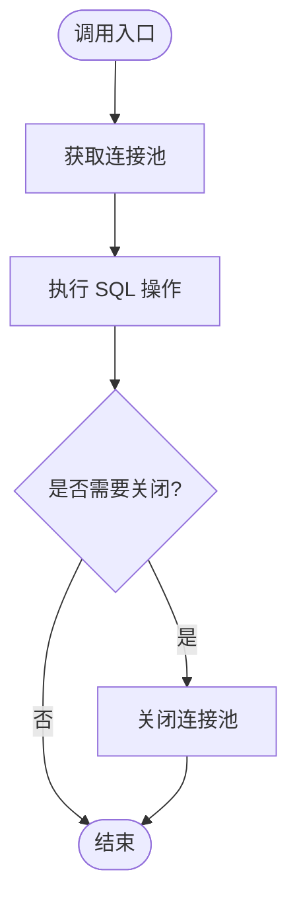

**图表来源**
- [db-helper.ts:11-27](file://e2e-tests/utils/db-helper.ts#L11-L27)
- [db-helper.ts:85-90](file://e2e-tests/utils/db-helper.ts#L85-L90)

**章节来源**
- [db-helper.ts:1-91](file://e2e-tests/utils/db-helper.ts#L1-L91)

### Page Object 模式扩展指南
- 定位策略：优先使用 data-testid，其次 role+name，最后文本或 CSS 选择器；保持稳定且语义明确。
- 交互封装：将常用流程封装为方法，如登录、提交、筛选等；对外暴露清晰的语义化接口。
- 与工具协作：在 Page 对象中调用 wait-helper 与 api-helper，确保时序与数据一致性。
- 示例参考：LoginPage 将输入框、按钮、错误提示封装为属性，并提供 goto、login、attemptLogin、getErrorText 等方法。

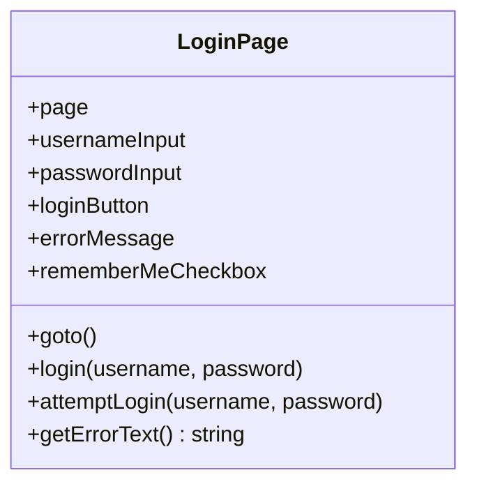

**图表来源**
- [login.page.ts:1-52](file://e2e-tests/pages/login.page.ts#L1-L52)

**章节来源**
- [login.page.ts:1-52](file://e2e-tests/pages/login.page.ts#L1-L52)

### 等待与重试工具
- 表格加载：等待容器可见、骨架屏隐藏、首行数据出现。
- Toast 显示：等待指定文本出现并返回定位器。
- API 响应：按 URL 模式与状态码等待响应。
- SPA 导航：等待 networkidle。
- 操作重试：对易抖动的操作进行有限次数重试。
- 扩展点：新增等待场景时，遵循统一超时与错误处理策略。

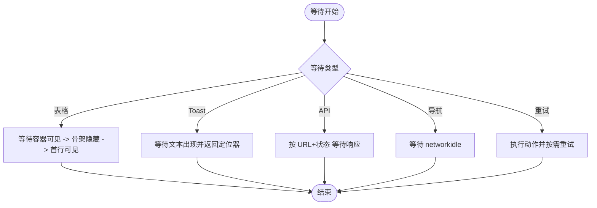

**图表来源**
- [wait-helper.ts:8-23](file://e2e-tests/utils/wait-helper.ts#L8-L23)
- [wait-helper.ts:28-36](file://e2e-tests/utils/wait-helper.ts#L28-L36)
- [wait-helper.ts:41-58](file://e2e-tests/utils/wait-helper.ts#L41-L58)
- [wait-helper.ts:63-68](file://e2e-tests/utils/wait-helper.ts#L63-L68)
- [wait-helper.ts:74-92](file://e2e-tests/utils/wait-helper.ts#L74-L92)

**章节来源**
- [wait-helper.ts:1-107](file://e2e-tests/utils/wait-helper.ts#L1-L107)

### 夹具与认证生命周期
- 角色化上下文：基于 storageState 为不同角色提供独立 Page 实例。
- setup：登录并持久化 storageState 至 .auth 目录。
- teardown：清理 .auth 目录下的状态文件。
- 扩展点：新增角色时，复制并调整 setup 流程，确保路径与文件名一致。

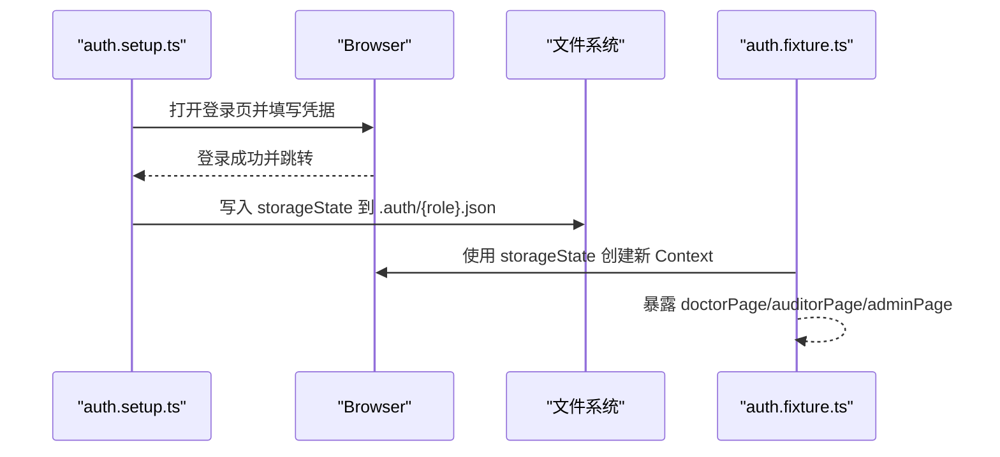

**图表来源**
- [auth.setup.ts:1-28](file://e2e-tests/fixtures/auth.setup.ts#L1-L28)
- [auth.fixture.ts:1-40](file://e2e-tests/fixtures/auth.fixture.ts#L1-L40)
- [auth.teardown.ts:1-18](file://e2e-tests/fixtures/auth.teardown.ts#L1-L18)

**章节来源**
- [auth.fixture.ts:1-40](file://e2e-tests/fixtures/auth.fixture.ts#L1-L40)
- [auth.setup.ts:1-28](file://e2e-tests/fixtures/auth.setup.ts#L1-L28)
- [auth.teardown.ts:1-18](file://e2e-tests/fixtures/auth.teardown.ts#L1-L18)

### 测试用例与运行流程
- 用例组织：使用 test.describe 分组，test 作为用例单元。
- 断言：统一使用 expect，结合 Page Object 与工具方法。
- 运行配置：多项目并行、超时与重试策略、报告输出。
- 扩展点：新增测试时，遵循现有命名与断言风格，必要时引入等待与 API/DB 工具。

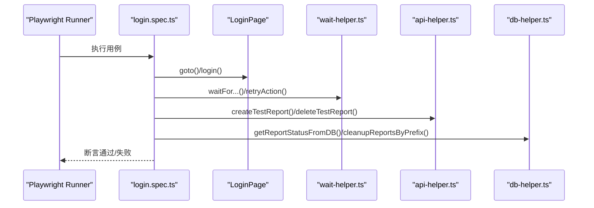

**图表来源**
- [login.spec.ts:1-25](file://e2e-tests/tests/smoke/login.spec.ts#L1-L25)
- [login.page.ts:1-52](file://e2e-tests/pages/login.page.ts#L1-L52)
- [wait-helper.ts:1-107](file://e2e-tests/utils/wait-helper.ts#L1-L107)
- [api-helper.ts:1-172](file://e2e-tests/utils/api-helper.ts#L1-L172)
- [db-helper.ts:1-91](file://e2e-tests/utils/db-helper.ts#L1-L91)

**章节来源**
- [login.spec.ts:1-25](file://e2e-tests/tests/smoke/login.spec.ts#L1-L25)

## AI测试系统扩展开发

### 智能生成器编排引擎
智能生成器是AI测试系统的核心编排组件，负责协调各个子模块完成测试文件的生成、修改和扩展。

- **上下文收集**：自动扫描项目结构，收集Page Object、Fixture、工具函数等上下文信息
- **关键字推断**：基于功能描述自动推断相关的Page Object类名
- **文件生成**：根据测试类型生成相应的测试文件名和输出路径
- **代码处理**：对生成的代码进行后处理和校验

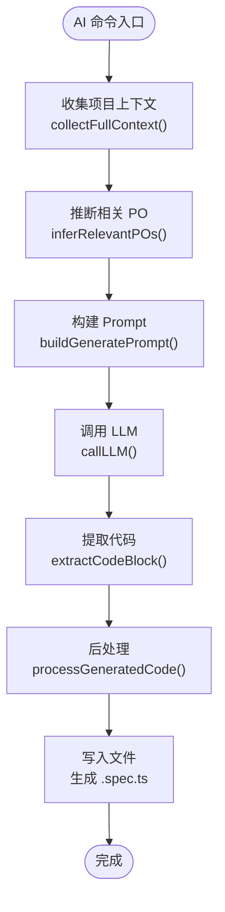

**图表来源**
- [smart-generator.ts:97-164](file://e2e-tests/ai/smart-generator.ts#L97-L164)
- [context-collector.ts:360-370](file://e2e-tests/ai/context-collector.ts#L360-L370)
- [prompt-templates.ts:102-132](file://e2e-tests/ai/prompt-templates.ts#L102-L132)
- [post-processor.ts:8-45](file://e2e-tests/ai/post-processor.ts#L8-L45)

**章节来源**
- [smart-generator.ts:1-272](file://e2e-tests/ai/smart-generator.ts#L1-L272)

### Prompt模板管理系统
Prompt模板系统提供了可扩展的模板构建机制，支持不同测试类型的定制化Prompt生成。

- **通用模板**：提供基础的System Prompt和约束条件
- **代码风格参考**：基于现有测试文件提供代码风格参考
- **硬约束定义**：严格定义输出格式和使用规则
- **场景化模板**：支持generate、modify、extend三种场景

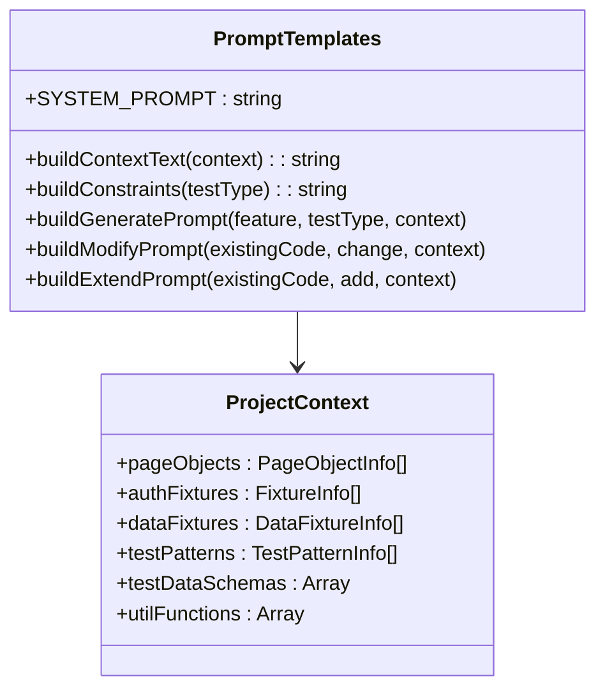

**图表来源**
- [prompt-templates.ts:5-75](file://e2e-tests/ai/prompt-templates.ts#L5-L75)
- [prompt-templates.ts:102-192](file://e2e-tests/ai/prompt-templates.ts#L102-L192)
- [types.ts:42-54](file://e2e-tests/ai/types.ts#L42-L54)

**章节来源**
- [prompt-templates.ts:1-192](file://e2e-tests/ai/prompt-templates.ts#L1-L192)
- [types.ts:1-180](file://e2e-tests/ai/types.ts#L1-L180)

### 上下文收集器
上下文收集器负责自动扫描项目结构，收集所有可用的Page Object、Fixture、工具函数等信息。

- **Page Object收集**：解析.ts文件，提取类名、定位器和方法信息
- **Fixture收集**：识别认证和数据Fixture，提取类型和描述信息
- **测试模式收集**：分析现有测试文件，提供代码风格参考
- **工具函数收集**：提取utils目录下的工具函数签名和描述

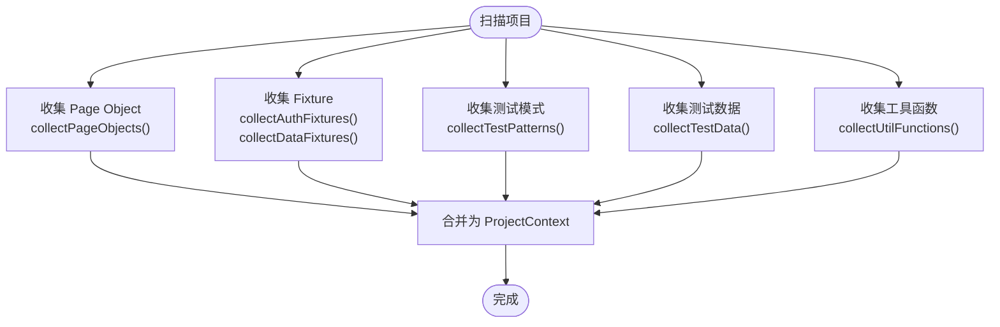

**图表来源**
- [context-collector.ts:18-84](file://e2e-tests/ai/context-collector.ts#L18-L84)
- [context-collector.ts:89-187](file://e2e-tests/ai/context-collector.ts#L89-L187)
- [context-collector.ts:192-252](file://e2e-tests/ai/context-collector.ts#L192-L252)
- [context-collector.ts:257-315](file://e2e-tests/ai/context-collector.ts#L257-L315)
- [context-collector.ts:320-355](file://e2e-tests/ai/context-collector.ts#L320-L355)

**章节来源**
- [context-collector.ts:1-370](file://e2e-tests/ai/context-collector.ts#L1-L370)

### LLM客户端与后处理引擎
LLM客户端提供统一的API调用接口，支持重试机制和多种输出解析。

- **统一调用接口**：支持OpenAI兼容的/chat/completions端点
- **重试机制**：最多重试2次，首次失败后等待3秒
- **输出解析**：支持JSON对象、JSON数组和代码块提取
- **后处理引擎**：对生成代码进行格式修正和校验

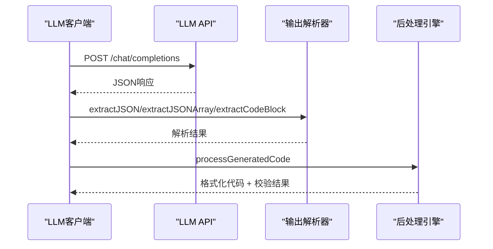

**图表来源**
- [llm-client.ts:21-87](file://e2e-tests/ai/llm-client.ts#L21-L87)
- [llm-client.ts:92-120](file://e2e-tests/ai/llm-client.ts#L92-L120)
- [post-processor.ts:8-45](file://e2e-tests/ai/post-processor.ts#L8-L45)

**章节来源**
- [llm-client.ts:1-120](file://e2e-tests/ai/llm-client.ts#L1-L120)
- [post-processor.ts:1-232](file://e2e-tests/ai/post-processor.ts#L1-L232)

### CLI工具与扩展接口
AI测试系统提供完整的CLI工具，支持生成、修改和扩展测试文件。

- **generate命令**：根据功能描述生成新的测试文件
- **modify命令**：修改现有测试文件
- **extend命令**：在现有测试文件中追加测试用例
- **参数验证**：严格的参数验证和错误处理

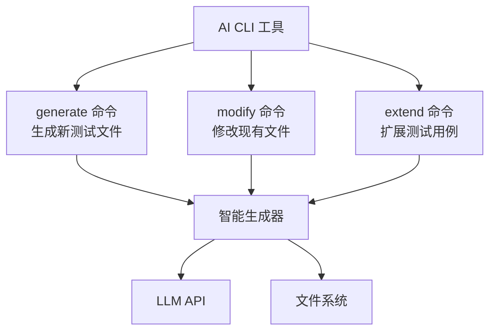

**图表来源**
- [cli.ts:14-77](file://e2e-tests/ai/cli.ts#L14-L77)
- [smart-generator.ts:97-272](file://e2e-tests/ai/smart-generator.ts#L97-L272)

**章节来源**
- [cli.ts:1-77](file://e2e-tests/ai/cli.ts#L1-L77)
- [smart-generator.ts:1-272](file://e2e-tests/ai/smart-generator.ts#L1-L272)

### URL分析与通用测试生成
系统还支持对任意URL进行页面分析，生成通用的Playwright测试。

- **页面分析**：使用Playwright浏览器实际访问页面，提取DOM结构
- **元素识别**：自动识别表单、按钮、导航链接、表格等交互元素
- **类型推断**：根据页面特征推断页面类型（登录页、列表页、表单页等）
- **测试建议**：为不同页面类型生成相应的测试建议

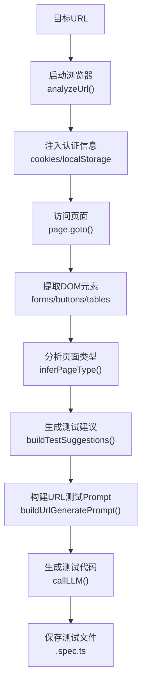

**图表来源**
- [page-analyzer.ts:20-415](file://e2e-tests/ai/page-analyzer.ts#L20-L415)
- [url-prompt-templates.ts:23-179](file://e2e-tests/ai/url-prompt-templates.ts#L23-L179)

**章节来源**
- [page-analyzer.ts:1-415](file://e2e-tests/ai/page-analyzer.ts#L1-L415)
- [url-prompt-templates.ts:1-291](file://e2e-tests/ai/url-prompt-templates.ts#L1-L291)

## 依赖关系分析
- 配置层：package.json 定义脚本与依赖；playwright.config.ts 定义项目与报告；tsconfig.json 提供路径别名；.env 提供AI服务配置。
- 运行层：tests 依赖 pages、fixtures、utils；utils 依赖 dotenv 与外部服务（API/DB/LLM）。
- AI扩展层：smart-generator 依赖 context-collector、prompt-templates、post-processor；llm-client 提供统一API调用。
- 扩展耦合：AI 模块与 LLM API 强耦合；API/DB 工具与后端/数据库强耦合；Page Object 与前端 DOM 强耦合。

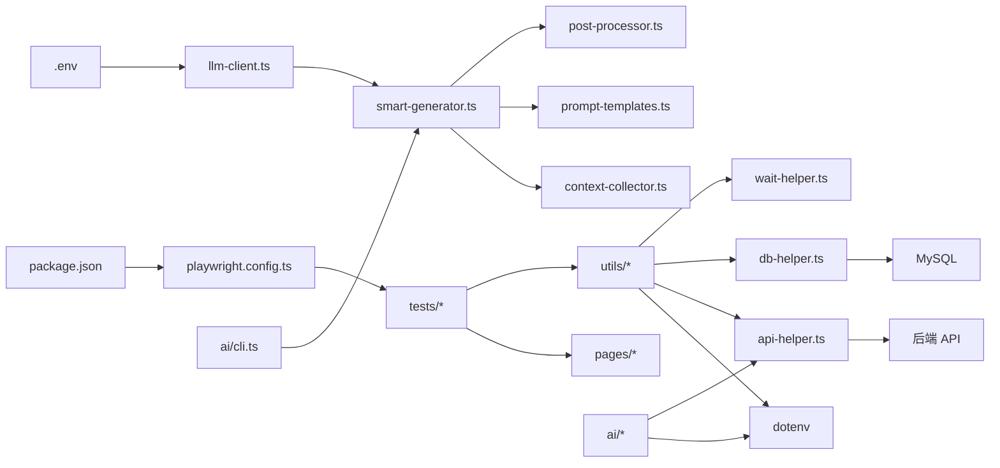

**图表来源**
- [package.json:1-27](file://e2e-tests/package.json#L1-L27)
- [playwright.config.ts:1-68](file://e2e-tests/playwright.config.ts#L1-L68)
- [tsconfig.json:1-25](file://e2e-tests/tsconfig.json#L1-L25)
- [llm-client.ts:1-120](file://e2e-tests/ai/llm-client.ts#L1-L120)
- [smart-generator.ts:1-272](file://e2e-tests/ai/smart-generator.ts#L1-L272)
- [context-collector.ts:1-370](file://e2e-tests/ai/context-collector.ts#L1-L370)
- [prompt-templates.ts:1-192](file://e2e-tests/ai/prompt-templates.ts#L1-L192)
- [post-processor.ts:1-232](file://e2e-tests/ai/post-processor.ts#L1-L232)
- [.env:1-21](file://e2e-tests/.env#L1-L21)

**章节来源**
- [package.json:1-27](file://e2e-tests/package.json#L1-L27)
- [playwright.config.ts:1-68](file://e2e-tests/playwright.config.ts#L1-L68)
- [tsconfig.json:1-25](file://e2e-tests/tsconfig.json#L1-L25)

## 性能考虑
- 并行与重试：CI 环境启用并行与重试，本地开发适度降低 workers 与 retries。
- 超时与等待：合理设置默认超时，避免过长等待；对不稳定操作使用重试包装。
- 连接池：数据库连接池限制并发，避免资源争用；API 上下文复用减少重复登录。
- 报告与产物：HTML/JUnit/Allure 报告按 CI 条件输出，避免本地开发产生大量中间文件。
- LLM调用优化：合理设置temperature和maxTokens，避免过度消耗API配额。
- 缓存策略：智能生成器可以缓存上下文信息，减少重复扫描开销。

## 故障排查指南
- LLM API 未配置：检查 .env 是否设置 LLM_API_URL、LLM_API_KEY、LLM_MODEL。
- API 认证失败：确认 API_BASE_URL 与管理员凭据；查看上下文初始化与 Token 注入。
- 数据库连接失败：核对 DB_* 环境变量；检查连接池参数与服务可达性。
- 定位器失效：使用 locator-healer 获取新定位器；结合 DOM 变更与稳定性策略。
- 失败根因分析：通过 failure-analyzer 获取分类与修复建议，优先处理定位器与环境问题。
- AI生成失败：检查LLM返回格式，确认JSON解析和代码块提取功能正常。
- 上下文收集错误：验证项目结构，确保Page Object文件命名规范。

**章节来源**
- [llm-client.ts:25-27](file://e2e-tests/ai/llm-client.ts#L25-L27)
- [prompt-templates.ts:5-8](file://e2e-tests/ai/prompt-templates.ts#L5-L8)
- [context-collector.ts:360-370](file://e2e-tests/ai/context-collector.ts#L360-L370)
- [post-processor.ts:36-42](file://e2e-tests/ai/post-processor.ts#L36-L42)

## 结论
本项目提供了完善的端到端测试基础设施：稳定的 Page Object 模式、可扩展的工具链、AI 辅助的测试生成与分析、以及基于夹具的角色化认证。扩展开发应遵循模块化、接口一致与向后兼容原则，充分利用现有工具与配置，确保测试质量与可维护性。

**更新** 新版本的AI测试系统显著增强了扩展开发能力，提供了更灵活的测试生成、定制化的Prompt模板和智能化的上下文收集，为开发者提供了更强大的AI测试生成工具。

## 附录
- 新功能开发流程建议
  - 设计阶段：使用 AI 测试生成器输出用例草稿，评审并通过后进入实现阶段。
  - 实现阶段：新增 Page Object 方法与等待逻辑，必要时扩展 API/DB 工具。
  - 验证阶段：编写测试用例，运行冒烟与回归测试，收集报告并分析失败。
  - 收敛阶段：使用失败分析与定位器自愈工具修复问题，完善文档与规范。
- 插件开发规范
  - 接口设计：保持方法签名与返回值一致，提供清晰的错误信息。
  - 向后兼容：新增参数时提供默认值，避免破坏既有调用方。
  - 配置管理：通过环境变量与 dotenv 管理外部依赖，避免硬编码。
- 代码审查标准
  - 可读性：命名清晰、注释充分、模块职责单一。
  - 可靠性：错误处理完备、超时与重试策略合理、断言覆盖关键路径。
  - 可维护性：遵循现有风格与约定，避免重复代码与魔法数字。
- 单元测试与集成测试策略
  - 单测：针对工具函数与算法模块，覆盖正常/异常分支。
  - 集成：通过 fixtures 与真实 API/DB 验证端到端流程，关注时序与并发。
- 系统集成方法
  - 第三方服务：通过环境变量注入，提供降级与熔断策略。
  - API 扩展：遵循现有上下文与认证模式，统一错误处理与日志记录。
- AI测试系统扩展开发指南
  - Prompt模板定制：基于prompt-templates.ts扩展新的模板类型
  - 上下文收集扩展：在context-collector.ts中添加新的收集逻辑
  - LLM集成：通过llm-client.ts扩展新的API适配器
  - 后处理增强：在post-processor.ts中添加新的代码校验规则
  - CLI命令扩展：在cli.ts中添加新的命令行选项和处理逻辑