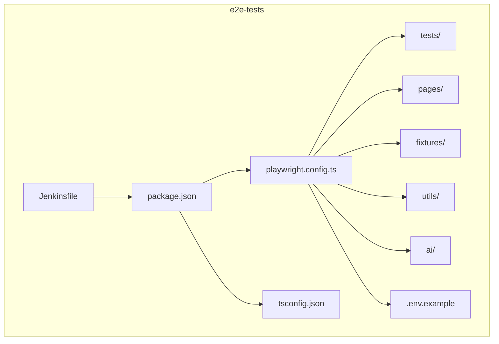
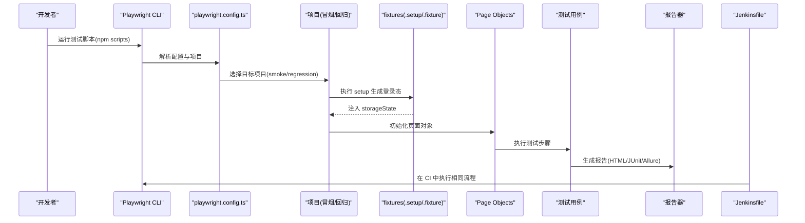
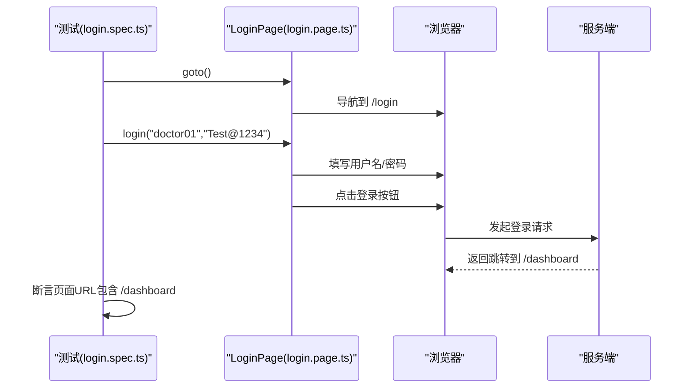
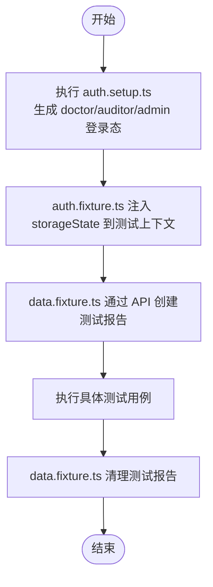
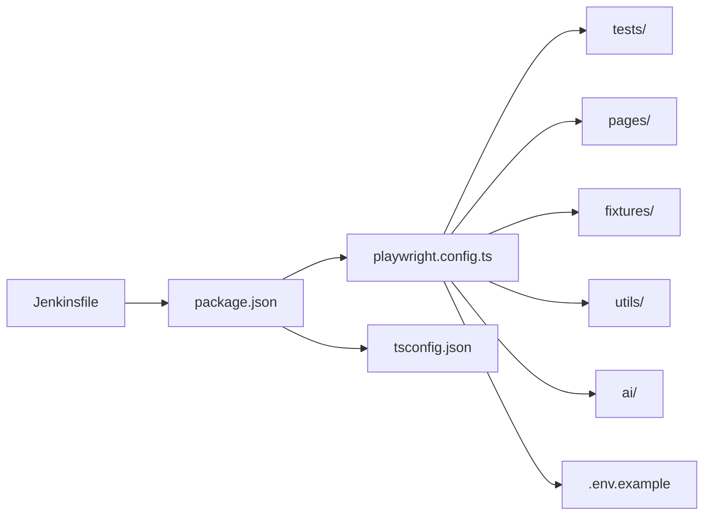

# 快速开始

<cite>
**本文引用的文件**
- [package.json](file://e2e-tests/package.json)
- [playwright.config.ts](file://e2e-tests/playwright.config.ts)
- [tsconfig.json](file://e2e-tests/tsconfig.json)
- [login.spec.ts](file://e2e-tests/tests/smoke/login.spec.ts)
- [login.page.ts](file://e2e-tests/pages/login.page.ts)
- [.env.example](file://e2e-tests/.env.example)
- [auth.setup.ts](file://e2e-tests/fixtures/auth.setup.ts)
- [auth.fixture.ts](file://e2e-tests/fixtures/auth.fixture.ts)
- [data.fixture.ts](file://e2e-tests/fixtures/data.fixture.ts)
- [wait-helper.ts](file://e2e-tests/utils/wait-helper.ts)
- [api-helper.ts](file://e2e-tests/utils/api-helper.ts)
- [script-generator.ts](file://e2e-tests/ai/script-generator.ts)
- [Jenkinsfile](file://e2e-tests/Jenkinsfile)
</cite>

## 目录
1. [简介](#简介)
2. [项目结构](#项目结构)
3. [核心组件](#核心组件)
4. [架构总览](#架构总览)
5. [详细组件分析](#详细组件分析)
6. [依赖关系分析](#依赖关系分析)
7. [性能与稳定性考虑](#性能与稳定性考虑)
8. [故障排查指南](#故障排查指南)
9. [结论](#结论)
10. [附录](#附录)

## 简介
本指南面向首次接触 AutoTestQoder 项目的开发者，帮助你在约 30 分钟内完成从零到一的环境搭建、依赖安装、基础配置与第一个测试运行。项目基于 Playwright 测试框架，采用 Page Object 模式组织页面层，结合 fixtures 实现登录态与测试数据管理，并内置 AI 辅助脚本生成能力，便于快速扩展测试覆盖。

## 项目结构
e2e-tests 子目录是本次快速开始的核心工作区，包含测试用例、页面对象、辅助工具、AI 能力与配置文件等模块。下图展示了关键目录与文件的关系：

图表来源
- [playwright.config.ts:1-68](file://e2e-tests/playwright.config.ts#L1-L68)
- [package.json:1-27](file://e2e-tests/package.json#L1-L27)
- [tsconfig.json:1-25](file://e2e-tests/tsconfig.json#L1-L25)
- [Jenkinsfile:1-59](file://e2e-tests/Jenkinsfile#L1-L59)

章节来源
- [playwright.config.ts:1-68](file://e2e-tests/playwright.config.ts#L1-L68)
- [package.json:1-27](file://e2e-tests/package.json#L1-L27)
- [tsconfig.json:1-25](file://e2e-tests/tsconfig.json#L1-L25)

## 核心组件
- Playwright 配置与项目结构
  - 通过 playwright.config.ts 定义测试目录、超时、并发策略、报告器以及多项目（setup、smoke、regression）。
  - 支持 CI 与本地两种模式，CI 下启用 HTML、JUnit、Allure 报告；本地默认仅在失败时打开报告。
- 页面对象与测试用例
  - 使用 Page Object 模式封装页面交互逻辑，login.page.ts 提供登录页定位器与常用操作。
  - tests/smoke/login.spec.ts 展示了冒烟测试的典型写法：导航、登录、断言跳转。
- 登录态与数据夹具
  - fixtures/auth.setup.ts 自动生成 doctor/auditor/admin 的登录态快照，保存至 .auth 目录。
  - fixtures/auth.fixture.ts 将登录态注入到测试上下文中，供各用例直接使用。
  - fixtures/data.fixture.ts 通过 API 助手创建/清理测试报告数据，保证测试隔离。
- 工具与辅助
  - utils/wait-helper.ts 提供等待表格加载、Toast 显示、API 响应、路由完成与重试包装等通用等待逻辑。
  - utils/api-helper.ts 提供统一的 API 认证上下文、创建/删除/更新报告、批量清理等能力。
- AI 脚本生成
  - ai/script-generator.ts 通过 LLM API 将测试用例描述与 Page Object 接口转换为可执行的 .spec.ts 脚本，支持自定义系统提示词与模型参数。

章节来源
- [playwright.config.ts:1-68](file://e2e-tests/playwright.config.ts#L1-L68)
- [login.page.ts:1-52](file://e2e-tests/pages/login.page.ts#L1-L52)
- [login.spec.ts:1-25](file://e2e-tests/tests/smoke/login.spec.ts#L1-L25)
- [auth.setup.ts:1-30](file://e2e-tests/fixtures/auth.setup.ts#L1-L30)
- [auth.fixture.ts:1-40](file://e2e-tests/fixtures/auth.fixture.ts#L1-L40)
- [data.fixture.ts:1-57](file://e2e-tests/fixtures/data.fixture.ts#L1-L57)
- [wait-helper.ts:1-107](file://e2e-tests/utils/wait-helper.ts#L1-L107)
- [api-helper.ts:1-172](file://e2e-tests/utils/api-helper.ts#L1-L172)
- [script-generator.ts:1-110](file://e2e-tests/ai/script-generator.ts#L1-L110)

## 架构总览
下图展示了从命令行到测试执行、报告生成与 CI 集成的整体流程：

图表来源
- [playwright.config.ts:31-66](file://e2e-tests/playwright.config.ts#L31-L66)
- [auth.setup.ts:18-28](file://e2e-tests/fixtures/auth.setup.ts#L18-L28)
- [auth.fixture.ts:10-37](file://e2e-tests/fixtures/auth.fixture.ts#L10-L37)
- [login.page.ts:22-43](file://e2e-tests/pages/login.page.ts#L22-L43)
- [login.spec.ts:4-23](file://e2e-tests/tests/smoke/login.spec.ts#L4-L23)
- [Jenkinsfile:1-59](file://e2e-tests/Jenkinsfile#L1-L59)

## 详细组件分析

### 环境要求与安装
- Node.js 版本要求
  - 项目明确要求 Node.js >= 18，确保使用较新的 ES 特性与包管理器兼容性。
- 依赖安装
  - 使用 pnpm 安装（推荐），或 npm/yarn。安装后会自动下载 Playwright 浏览器二进制。
- 本地运行
  - 通过 npm scripts 运行冒烟测试或全量测试，查看 HTML 报告或 Allure 报告。

章节来源
- [package.json:14-16](file://e2e-tests/package.json#L14-L16)
- [package.json:6-12](file://e2e-tests/package.json#L6-L12)

### 基础配置与环境变量
- 基础 URL 与 API 地址
  - 通过 .env.example 设置被测系统地址、后端 API 地址、数据库连接信息与 LLM 配置。
- Playwright 基本配置
  - testDir、timeout、expect.timeout、fullyParallel、retries/workers、reporter、use.baseURL 等。
- 项目划分
  - setup/cleanup：准备与清理登录态
  - smoke-chromium：冒烟测试，仅 Chromium
  - regression-chromium/firefox：回归测试，Chromium+Firefox

章节来源
- [.env.example:1-21](file://e2e-tests/.env.example#L1-L21)
- [playwright.config.ts:6-29](file://e2e-tests/playwright.config.ts#L6-L29)
- [playwright.config.ts:31-66](file://e2e-tests/playwright.config.ts#L31-L66)

### 第一个测试：登录冒烟用例
- 页面对象 LoginPage
  - 提供用户名、密码、登录按钮、错误提示等定位器与方法：goto、login、attemptLogin、getErrorText。
- 测试用例 login.spec.ts
  - 正确凭据登录后断言跳转到仪表盘
  - 错误密码登录后断言错误提示可见
- 执行方式
  - 使用 npm 脚本运行冒烟测试，观察报告

图表来源
- [login.spec.ts:4-23](file://e2e-tests/tests/smoke/login.spec.ts#L4-L23)
- [login.page.ts:22-43](file://e2e-tests/pages/login.page.ts#L22-L43)

章节来源
- [login.spec.ts:1-25](file://e2e-tests/tests/smoke/login.spec.ts#L1-L25)
- [login.page.ts:1-52](file://e2e-tests/pages/login.page.ts#L1-L52)

### 登录态与数据夹具
- 登录态准备
  - auth.setup.ts 自动登录 doctor/auditor/admin，保存 storageState 到 .auth 目录，供后续项目复用。
- 登录态注入
  - auth.fixture.ts 将不同角色的 storageState 注入到测试上下文，简化权限相关测试。
- 测试数据准备与清理
  - data.fixture.ts 通过 API 助手创建/删除测试报告，确保每条用例前后数据干净。

图表来源
- [auth.setup.ts:18-28](file://e2e-tests/fixtures/auth.setup.ts#L18-L28)
- [auth.fixture.ts:10-37](file://e2e-tests/fixtures/auth.fixture.ts#L10-L37)
- [data.fixture.ts:13-54](file://e2e-tests/fixtures/data.fixture.ts#L13-L54)

章节来源
- [auth.setup.ts:1-30](file://e2e-tests/fixtures/auth.setup.ts#L1-L30)
- [auth.fixture.ts:1-40](file://e2e-tests/fixtures/auth.fixture.ts#L1-L40)
- [data.fixture.ts:1-57](file://e2e-tests/fixtures/data.fixture.ts#L1-L57)

### 等待与稳定性工具
- 等待表格加载、Toast 显示、API 响应、路由完成
- 操作重试包装器，降低时序抖动导致的间歇性失败
- 通用等待工具提升测试健壮性与可维护性

章节来源
- [wait-helper.ts:1-107](file://e2e-tests/utils/wait-helper.ts#L1-L107)

### API 助手与数据管理
- 统一的 API 认证上下文（管理员身份）
- 创建/删除/更新报告、获取报告详情、批量清理测试数据
- 为 fixtures 与测试用例提供稳定的数据支撑

章节来源
- [api-helper.ts:1-172](file://e2e-tests/utils/api-helper.ts#L1-L172)

### AI 脚本生成
- 通过 LLM API 将测试用例描述与 Page Object 接口转换为可执行的 .spec.ts
- 支持自定义系统提示词与模型参数，便于团队规范与扩展

章节来源
- [script-generator.ts:1-110](file://e2e-tests/ai/script-generator.ts#L1-L110)

### CI 集成（Jenkins）
- 使用官方 Playwright Docker 镜像，确保跨平台一致性
- 安装依赖、执行冒烟测试与回归测试，并发布报告与归档产物

章节来源
- [Jenkinsfile:1-59](file://e2e-tests/Jenkinsfile#L1-L59)

## 依赖关系分析
下图展示 Playwright 配置与项目结构之间的依赖关系：

图表来源
- [playwright.config.ts:1-68](file://e2e-tests/playwright.config.ts#L1-L68)
- [package.json:1-27](file://e2e-tests/package.json#L1-L27)
- [tsconfig.json:1-25](file://e2e-tests/tsconfig.json#L1-L25)
- [Jenkinsfile:1-59](file://e2e-tests/Jenkinsfile#L1-L59)

章节来源
- [playwright.config.ts:1-68](file://e2e-tests/playwright.config.ts#L1-L68)
- [package.json:1-27](file://e2e-tests/package.json#L1-L27)
- [tsconfig.json:1-25](file://e2e-tests/tsconfig.json#L1-L25)

## 性能与稳定性考虑
- 并发与重试
  - 本地：单 worker，无重试；CI：4 worker，重试 2 次，提升吞吐与稳定性。
- 报告策略
  - CI：HTML/JUnit/Allure 多格式报告；本地：仅在失败时打开 HTML 报告。
- 等待策略
  - 使用专用等待工具减少硬编码 sleep，提高稳定性与可读性。
- 登录态复用
  - 通过 storageState 避免重复登录，缩短测试执行时间。

章节来源
- [playwright.config.ts:12-22](file://e2e-tests/playwright.config.ts#L12-L22)

## 故障排查指南
- Node.js 版本过低
  - 症状：安装失败或运行时报错
  - 处理：升级 Node.js 至 18+，重新安装依赖
- 未设置环境变量
  - 症状：BASE_URL/API_BASE_URL/LLM 配置缺失导致测试失败
  - 处理：复制 .env.example 为 .env，按需填写对应值
- 浏览器二进制缺失
  - 症状：首次运行报错或无法启动浏览器
  - 处理：执行安装命令以下载 Playwright 浏览器二进制
- 登录态失效
  - 症状：测试中出现需要登录
  - 处理：重新执行 setup 生成 .auth 下的登录态文件
- 报告未生成或无法打开
  - 症状：本地无报告或 CI 报告未上传
  - 处理：检查 reporter 配置与输出路径，确认 CI 归档策略
- API 调用失败
  - 症状：数据夹具创建/删除失败
  - 处理：检查 API_BASE_URL 与网络连通性，确认后端服务可用

章节来源
- [.env.example:1-21](file://e2e-tests/.env.example#L1-L21)
- [playwright.config.ts:16-22](file://e2e-tests/playwright.config.ts#L16-L22)
- [auth.setup.ts:18-28](file://e2e-tests/fixtures/auth.setup.ts#L18-L28)
- [api-helper.ts:45-77](file://e2e-tests/utils/api-helper.ts#L45-L77)

## 结论
通过本快速开始指南，你可以在 30 分钟内完成环境搭建、依赖安装、基础配置与第一个测试的运行。项目提供了完善的配置、稳定的等待工具、登录态与数据夹具以及 AI 脚本生成功能，能够帮助你高效扩展测试覆盖面并保持测试质量。

## 附录

### 从零开始的完整流程
- 克隆仓库并进入 e2e-tests 目录
- 安装依赖（推荐 pnpm）
- 复制 .env.example 为 .env 并填写必要配置
- 运行登录冒烟测试
- 查看报告并验证测试结果

章节来源
- [package.json:6-12](file://e2e-tests/package.json#L6-L12)
- [.env.example:1-21](file://e2e-tests/.env.example#L1-L21)
- [login.spec.ts:1-25](file://e2e-tests/tests/smoke/login.spec.ts#L1-L25)