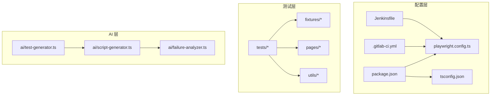
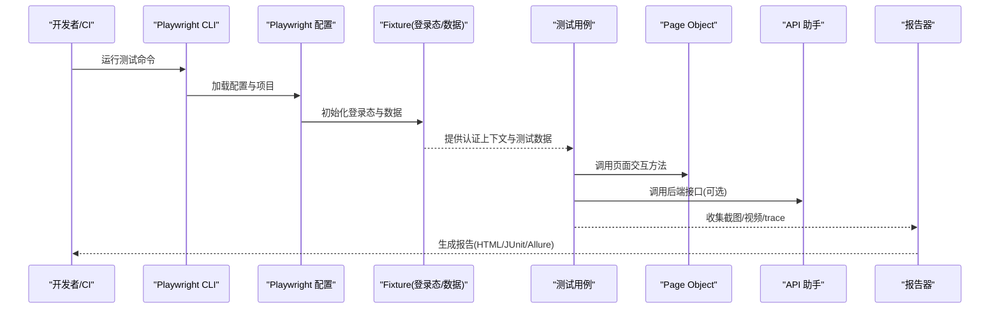
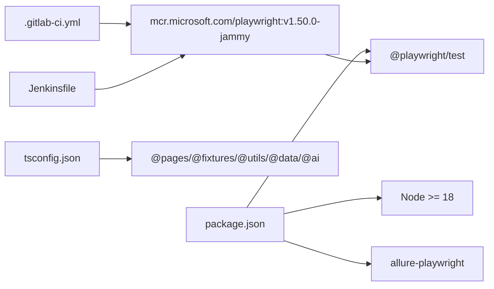
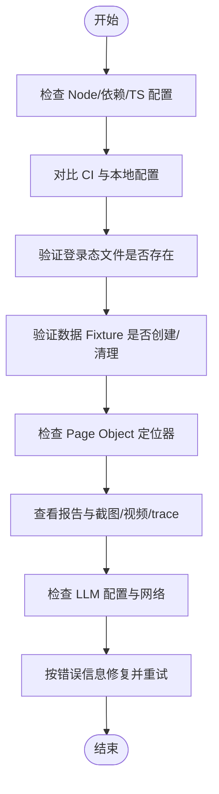

# 故障排除和FAQ

<cite>
**本文引用的文件**
- [package.json](file://e2e-tests/package.json)
- [playwright.config.ts](file://e2e-tests/playwright.config.ts)
- [tsconfig.json](file://e2e-tests/tsconfig.json)
- [.gitlab-ci.yml](file://e2e-tests/.gitlab-ci.yml)
- [Jenkinsfile](file://e2e-tests/Jenkinsfile)
- [failure-analyzer.ts](file://e2e-tests/ai/failure-analyzer.ts)
- [script-generator.ts](file://e2e-tests/ai/script-generator.ts)
- [test-generator.ts](file://e2e-tests/ai/test-generator.ts)
- [auth.setup.ts](file://e2e-tests/fixtures/auth.setup.ts)
- [auth.teardown.ts](file://e2e-tests/fixtures/auth.teardown.ts)
- [data.fixture.ts](file://e2e-tests/fixtures/data.fixture.ts)
- [login.spec.ts](file://e2e-tests/tests/smoke/login.spec.ts)
- [login.page.ts](file://e2e-tests/pages/login.page.ts)
- [api-helper.ts](file://e2e-tests/utils/api-helper.ts)
</cite>

## 目录
1. [简介](#简介)
2. [项目结构](#项目结构)
3. [核心组件](#核心组件)
4. [架构总览](#架构总览)
5. [详细组件分析](#详细组件分析)
6. [依赖关系分析](#依赖关系分析)
7. [性能考虑](#性能考虑)
8. [故障排除指南](#故障排除指南)
9. [结论](#结论)
10. [附录](#附录)

## 简介
本指南面向使用 Playwright 与 AI 辅助能力进行端到端测试的团队，聚焦于环境配置、测试执行、AI 生成与分析三大类问题的诊断与解决。文档提供常见错误信息、原因分析、修复步骤、性能优化建议、调试工具与日志分析技巧，并明确系统限制、兼容性与已知问题，帮助用户自助排障并高效定位问题。

## 项目结构
该仓库采用“按功能域分层”的组织方式：
- 配置层：Playwright 配置、TypeScript 编译配置、CI/CD 配置
- 测试层：冒烟与回归测试用例、Page Object 页面模型、Fixture 数据与登录态
- 工具层：API 助手、等待辅助、数据库辅助
- AI 层：测试用例生成、脚本生成、失败分析

图表来源
- [playwright.config.ts:1-68](file://e2e-tests/playwright.config.ts#L1-L68)
- [package.json:1-27](file://e2e-tests/package.json#L1-L27)
- [tsconfig.json:1-25](file://e2e-tests/tsconfig.json#L1-L25)
- [.gitlab-ci.yml:1-67](file://e2e-tests/.gitlab-ci.yml#L1-L67)
- [Jenkinsfile:1-59](file://e2e-tests/Jenkinsfile#L1-L59)

章节来源
- [playwright.config.ts:1-68](file://e2e-tests/playwright.config.ts#L1-L68)
- [package.json:1-27](file://e2e-tests/package.json#L1-L27)
- [tsconfig.json:1-25](file://e2e-tests/tsconfig.json#L1-L25)
- [.gitlab-ci.yml:1-67](file://e2e-tests/.gitlab-ci.yml#L1-L67)
- [Jenkinsfile:1-59](file://e2e-tests/Jenkinsfile#L1-L59)

## 核心组件
- Playwright 配置：定义测试目录、超时、并行度、重试、报告器、项目划分与设备配置
- Fixture：登录态准备与清理、测试数据自动创建与销毁
- Page Object：封装页面交互与断言，降低定位器耦合
- API 助手：统一管理 API 认证上下文、创建/删除/更新/查询报告等
- AI 组件：测试用例生成、脚本生成、失败分析，均依赖外部 LLM API

章节来源
- [playwright.config.ts:31-66](file://e2e-tests/playwright.config.ts#L31-L66)
- [auth.setup.ts:1-30](file://e2e-tests/fixtures/auth.setup.ts#L1-L30)
- [auth.teardown.ts:1-18](file://e2e-tests/fixtures/auth.teardown.ts#L1-L18)
- [data.fixture.ts:1-57](file://e2e-tests/fixtures/data.fixture.ts#L1-L57)
- [login.page.ts:1-52](file://e2e-tests/pages/login.page.ts#L1-L52)
- [api-helper.ts:1-172](file://e2e-tests/utils/api-helper.ts#L1-L172)
- [test-generator.ts:1-107](file://e2e-tests/ai/test-generator.ts#L1-L107)
- [script-generator.ts:1-110](file://e2e-tests/ai/script-generator.ts#L1-L110)
- [failure-analyzer.ts:1-112](file://e2e-tests/ai/failure-analyzer.ts#L1-L112)

## 架构总览
整体执行链路从 CI/本地命令触发 Playwright，经由项目配置选择目标浏览器与设备，加载 Fixture 准备登录态与测试数据，运行测试用例，收集截图/视频/trace 作为证据，最终生成 HTML/JUnit/Allure 报告。

图表来源
- [playwright.config.ts:31-66](file://e2e-tests/playwright.config.ts#L31-L66)
- [auth.setup.ts:1-30](file://e2e-tests/fixtures/auth.setup.ts#L1-L30)
- [data.fixture.ts:1-57](file://e2e-tests/fixtures/data.fixture.ts#L1-L57)
- [login.spec.ts:1-25](file://e2e-tests/tests/smoke/login.spec.ts#L1-L25)
- [login.page.ts:1-52](file://e2e-tests/pages/login.page.ts#L1-L52)
- [api-helper.ts:1-172](file://e2e-tests/utils/api-helper.ts#L1-L172)

## 详细组件分析

### Playwright 配置与项目划分
- 测试目录与超时：testDir、timeout、expect.timeout 控制执行节奏与断言等待
- 并行与重试：fullyParallel、retries、workers 在 CI 与本地差异配置
- 报告器：CI 环境输出 HTML/JUnit/Allure；本地仅 HTML
- 项目划分：setup/cleanup 无浏览器执行；smoke 仅 Chromium；regression 多浏览器
- use 配置：baseURL、截图/视频/trace 策略

章节来源
- [playwright.config.ts:6-29](file://e2e-tests/playwright.config.ts#L6-L29)
- [playwright.config.ts:31-66](file://e2e-tests/playwright.config.ts#L31-L66)

### Fixture：登录态与测试数据
- 登录态准备：auth.setup.ts 按角色登录并持久化 storageState 到 .auth 目录
- 清理：auth.teardown.ts 删除 .auth 下的 JSON 文件
- 数据 Fixture：基于 API 助手自动创建/销毁测试报告，确保用例隔离

章节来源
- [auth.setup.ts:1-30](file://e2e-tests/fixtures/auth.setup.ts#L1-L30)
- [auth.teardown.ts:1-18](file://e2e-tests/fixtures/auth.teardown.ts#L1-L18)
- [data.fixture.ts:1-57](file://e2e-tests/fixtures/data.fixture.ts#L1-L57)

### Page Object：登录页
- 封装定位器与常用交互：goto、login、attemptLogin、getErrorText
- 断言集中在用例中，便于复用与维护

章节来源
- [login.page.ts:1-52](file://e2e-tests/pages/login.page.ts#L1-L52)

### API 助手：统一认证与数据管理
- 单例 API 上下文：首次以管理员登录获取 token，后续请求携带 Authorization
- 常用操作：创建报告、删除报告、更新状态、查询报告、批量清理
- 错误处理：清理失败不阻断测试，disposeApiContext 用于全局清理

章节来源
- [api-helper.ts:40-77](file://e2e-tests/utils/api-helper.ts#L40-L77)
- [api-helper.ts:83-121](file://e2e-tests/utils/api-helper.ts#L83-L121)
- [api-helper.ts:126-142](file://e2e-tests/utils/api-helper.ts#L126-L142)
- [api-helper.ts:147-161](file://e2e-tests/utils/api-helper.ts#L147-L161)
- [api-helper.ts:166-172](file://e2e-tests/utils/api-helper.ts#L166-L172)

### AI 组件：测试用例/脚本/失败分析
- 测试用例生成：输入功能描述与角色，输出结构化用例数组
- 脚本生成：输入用例+Page Object 接口+Fixture，输出可执行 .spec.ts
- 失败分析：输入测试名/错误信息/截图/变更，输出根因分类与修复建议

章节来源
- [test-generator.ts:67-106](file://e2e-tests/ai/test-generator.ts#L67-L106)
- [script-generator.ts:63-109](file://e2e-tests/ai/script-generator.ts#L63-L109)
- [failure-analyzer.ts:69-111](file://e2e-tests/ai/failure-analyzer.ts#L69-L111)

## 依赖关系分析
- 脚本与工具：package.json 定义测试脚本、Node 版本要求与依赖
- 编译路径别名：tsconfig.json 配置 @pages/@fixtures/@utils/@data/@ai
- CI/CD：GitLab CI 与 Jenkins 使用官方 Playwright Docker 镜像，安装依赖并执行测试

图表来源
- [package.json:14-25](file://e2e-tests/package.json#L14-L25)
- [tsconfig.json:14-20](file://e2e-tests/tsconfig.json#L14-L20)
- [.gitlab-ci.yml:14-14](file://e2e-tests/.gitlab-ci.yml#L14-L14)
- [Jenkinsfile:4-4](file://e2e-tests/Jenkinsfile#L4-L4)

章节来源
- [package.json:1-27](file://e2e-tests/package.json#L1-L27)
- [tsconfig.json:1-25](file://e2e-tests/tsconfig.json#L1-L25)
- [.gitlab-ci.yml:1-67](file://e2e-tests/.gitlab-ci.yml#L1-L67)
- [Jenkinsfile:1-59](file://e2e-tests/Jenkinsfile#L1-L59)

## 性能考虑
- 测试执行优化
  - 合理设置 workers：本地 1，CI 4；避免过度并行导致资源争用
  - fullyParallel：启用跨用例并行，减少串行等待
  - retries：CI 开启重试，降低偶发失败影响
- 内存使用优化
  - 仅在失败时生成截图/视频/trace，避免磁盘与内存压力
  - API 助手使用单例上下文，减少重复连接开销
- 并发执行优化
  - 项目间依赖 setup，避免重复登录态准备
  - 数据 Fixture 在 use 前后自动创建/清理，减少手工负担
- 日志与报告
  - CI 环境输出 HTML/JUnit/Allure，便于持续集成分析
  - 本地仅 HTML，便于快速定位问题

章节来源
- [playwright.config.ts:12-22](file://e2e-tests/playwright.config.ts#L12-L22)
- [playwright.config.ts:24-29](file://e2e-tests/playwright.config.ts#L24-L29)
- [api-helper.ts:40-77](file://e2e-tests/utils/api-helper.ts#L40-L77)

## 故障排除指南

### 一、环境配置问题
- 症状：命令无法执行、找不到模块、类型检查报错
  - 检查 Node 版本是否满足要求
  - 确认依赖安装完成
  - 检查 tsconfig.json 中的路径别名是否被正确解析
- 症状：CI/本地行为不一致
  - 对比 CI 与本地 playwright.config.ts 的 workers/retries/reporter 设置
  - 确认 CI 使用官方 Playwright Docker 镜像
- 症状：LLM 相关功能报错
  - 检查 LLM_API_URL/LLM_API_KEY 是否在 .env 中配置
  - 确认 LLM 模型可用且网络可达

章节来源
- [package.json:14-16](file://e2e-tests/package.json#L14-L16)
- [tsconfig.json:14-20](file://e2e-tests/tsconfig.json#L14-L20)
- [.gitlab-ci.yml:14-14](file://e2e-tests/.gitlab-ci.yml#L14-L14)
- [Jenkinsfile:4-4](file://e2e-tests/Jenkinsfile#L4-L4)
- [failure-analyzer.ts:12-15](file://e2e-tests/ai/failure-analyzer.ts#L12-L15)
- [script-generator.ts:13-15](file://e2e-tests/ai/script-generator.ts#L13-L15)
- [test-generator.ts:12-14](file://e2e-tests/ai/test-generator.ts#L12-L14)

### 二、测试执行问题
- 症状：登录态失效或无法复用
  - 检查 auth.setup.ts 是否成功生成 .auth/*.json
  - 确认项目依赖 setup，避免未登录态直接访问受保护页面
- 症状：测试数据污染或竞态
  - 使用 data.fixture.ts 提供隔离的数据作用域
  - 确保每个用例结束后清理测试数据
- 症状：页面交互不稳定
  - 使用 Page Object 封装交互，减少对 DOM 的直接依赖
  - 适当增加 expect 超时或使用等待辅助
- 症状：CI 报告缺失或不完整
  - 确认 CI artifacts 路径包含 playwright-report/test-results/results
  - 检查 CI 环境变量 BASE_URL 是否正确

章节来源
- [auth.setup.ts:18-28](file://e2e-tests/fixtures/auth.setup.ts#L18-L28)
- [auth.teardown.ts:7-16](file://e2e-tests/fixtures/auth.teardown.ts#L7-L16)
- [data.fixture.ts:13-54](file://e2e-tests/fixtures/data.fixture.ts#L13-L54)
- [login.page.ts:28-43](file://e2e-tests/pages/login.page.ts#L28-L43)
- [.gitlab-ci.yml:19-25](file://e2e-tests/.gitlab-ci.yml#L19-L25)
- [.gitlab-ci.yml:37-43](file://e2e-tests/.gitlab-ci.yml#L37-L43)
- [Jenkinsfile:42-50](file://e2e-tests/Jenkinsfile#L42-L50)

### 三、AI 生成问题
- 症状：LLM API 调用失败
  - 检查 LLM_API_URL/LLM_API_KEY 是否配置
  - 确认模型名称与 API 兼容
- 症状：AI 返回格式异常
  - 测试用例生成与失败分析会尝试提取 JSON 片段，若无法解析会抛出异常
  - 建议在本地先用小规模输入验证输出格式
- 症状：生成的脚本不可直接运行
  - 确保传入的 Page Object 接口与实际实现一致
  - 检查生成脚本是否包含多余 markdown 代码块标记（脚本生成内部已清理）

章节来源
- [failure-analyzer.ts:12-15](file://e2e-tests/ai/failure-analyzer.ts#L12-L15)
- [failure-analyzer.ts:105-108](file://e2e-tests/ai/failure-analyzer.ts#L105-L108)
- [script-generator.ts:13-15](file://e2e-tests/ai/script-generator.ts#L13-L15)
- [script-generator.ts:105-108](file://e2e-tests/ai/script-generator.ts#L105-L108)
- [test-generator.ts:99-103](file://e2e-tests/ai/test-generator.ts#L99-L103)

### 四、常见错误信息与修复步骤
- “LLM_API_URL 和 LLM_API_KEY 未配置”
  - 修复：在 .env 中设置 LLM_API_URL、LLM_API_KEY、LLM_MODEL
- “LLM API 调用失败: …”
  - 修复：检查网络连通性、鉴权头、模型可用性
- “无法解析失败分析/测试用例”
  - 修复：调整提示词或模型参数，确保输出符合 JSON 格式
- “登录态文件不存在”
  - 修复：确认 setup 项目已执行，.auth 目录存在且有对应 JSON
- “截图/视频/trace 未生成”
  - 修复：检查 playwright.config.ts 中的截图/视频/trace 策略
- “CI 报告未归档”
  - 修复：检查 artifacts 路径与 CI 环境变量

章节来源
- [failure-analyzer.ts:12-15](file://e2e-tests/ai/failure-analyzer.ts#L12-L15)
- [failure-analyzer.ts:35-37](file://e2e-tests/ai/failure-analyzer.ts#L35-L37)
- [failure-analyzer.ts:105-108](file://e2e-tests/ai/failure-analyzer.ts#L105-L108)
- [script-generator.ts:13-15](file://e2e-tests/ai/script-generator.ts#L13-L15)
- [test-generator.ts:99-103](file://e2e-tests/ai/test-generator.ts#L99-L103)
- [auth.setup.ts:11-16](file://e2e-tests/fixtures/auth.setup.ts#L11-L16)
- [playwright.config.ts:24-29](file://e2e-tests/playwright.config.ts#L24-L29)
- [.gitlab-ci.yml:19-25](file://e2e-tests/.gitlab-ci.yml#L19-L25)
- [.gitlab-ci.yml:37-43](file://e2e-tests/.gitlab-ci.yml#L37-L43)
- [Jenkinsfile:42-50](file://e2e-tests/Jenkinsfile#L42-L50)

### 五、调试工具与日志分析
- 截图/视频/Trace
  - 仅在失败时保留，便于回溯问题
- HTML 报告
  - 本地与 CI 均可打开，查看测试步骤与资源
- JUnit/Allure
  - CI 环境输出，便于持续集成平台展示
- 日志与网络
  - 使用 API 助手的请求上下文，结合后端日志定位接口问题
- 本地调试
  - 在 playwright.config.ts 中临时关闭并行或增加超时，缩小问题范围

章节来源
- [playwright.config.ts:16-22](file://e2e-tests/playwright.config.ts#L16-L22)
- [playwright.config.ts:24-29](file://e2e-tests/playwright.config.ts#L24-L29)
- [api-helper.ts:40-77](file://e2e-tests/utils/api-helper.ts#L40-L77)

### 六、系统限制与兼容性
- Node 版本：要求 Node >= 18
- 浏览器：默认使用 Desktop Chrome/Firefox 设备，需确保容器镜像包含对应浏览器
- CI 镜像：使用官方 Playwright Docker 镜像，避免本地与 CI 环境差异
- LLM API：需与 OpenAI 兼容的 chat/completions 接口

章节来源
- [package.json:14-16](file://e2e-tests/package.json#L14-L16)
- [.gitlab-ci.yml:14-14](file://e2e-tests/.gitlab-ci.yml#L14-L14)
- [Jenkinsfile:4-4](file://e2e-tests/Jenkinsfile#L4-L4)
- [test-generator.ts:22-33](file://e2e-tests/ai/test-generator.ts#L22-L33)

### 七、已知问题
- AI 输出格式依赖性强：若模型输出不符合预期 JSON，将导致解析失败
- CI 报告归档：需确保 artifacts 路径与 CI 配置一致
- 登录态文件清理：需在 CI/本地均执行 teardown，避免残留

章节来源
- [failure-analyzer.ts:105-108](file://e2e-tests/ai/failure-analyzer.ts#L105-L108)
- [auth.teardown.ts:7-16](file://e2e-tests/fixtures/auth.teardown.ts#L7-L16)
- [.gitlab-ci.yml:19-25](file://e2e-tests/.gitlab-ci.yml#L19-L25)
- [.gitlab-ci.yml:37-43](file://e2e-tests/.gitlab-ci.yml#L37-L43)
- [Jenkinsfile:42-50](file://e2e-tests/Jenkinsfile#L42-L50)

### 八、自助排障流程图

## 结论
通过规范的环境配置、合理的 Playwright 项目设计、完善的 Fixture 与 Page Object、以及 AI 辅助的用例与脚本生成，可以显著提升测试稳定性与效率。遇到问题时，建议按“环境—执行—AI—报告”顺序排查，并结合本指南提供的优化策略与调试技巧，快速定位并解决问题。

## 附录
- 联系支持：如遇 LLM 服务或 CI 平台问题，请联系平台技术支持或在项目内提交 Issue
- 参考文件
  - [playwright.config.ts:1-68](file://e2e-tests/playwright.config.ts#L1-L68)
  - [package.json:1-27](file://e2e-tests/package.json#L1-L27)
  - [tsconfig.json:1-25](file://e2e-tests/tsconfig.json#L1-L25)
  - [.gitlab-ci.yml:1-67](file://e2e-tests/.gitlab-ci.yml#L1-L67)
  - [Jenkinsfile:1-59](file://e2e-tests/Jenkinsfile#L1-L59)
  - [failure-analyzer.ts:1-112](file://e2e-tests/ai/failure-analyzer.ts#L1-L112)
  - [script-generator.ts:1-110](file://e2e-tests/ai/script-generator.ts#L1-L110)
  - [test-generator.ts:1-107](file://e2e-tests/ai/test-generator.ts#L1-L107)
  - [auth.setup.ts:1-30](file://e2e-tests/fixtures/auth.setup.ts#L1-L30)
  - [auth.teardown.ts:1-18](file://e2e-tests/fixtures/auth.teardown.ts#L1-L18)
  - [data.fixture.ts:1-57](file://e2e-tests/fixtures/data.fixture.ts#L1-L57)
  - [login.spec.ts:1-25](file://e2e-tests/tests/smoke/login.spec.ts#L1-L25)
  - [login.page.ts:1-52](file://e2e-tests/pages/login.page.ts#L1-L52)
  - [api-helper.ts:1-172](file://e2e-tests/utils/api-helper.ts#L1-L172)