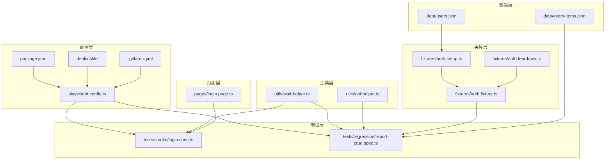
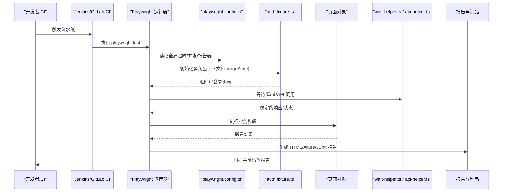
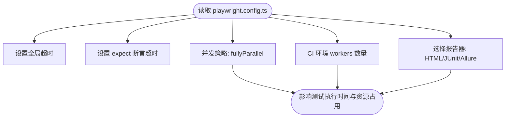
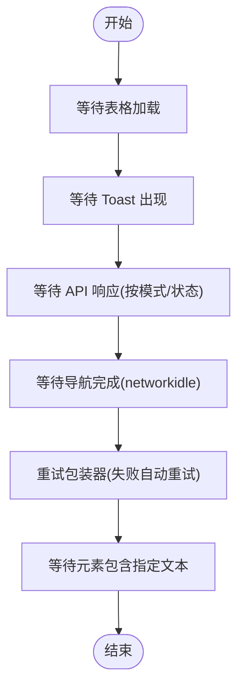
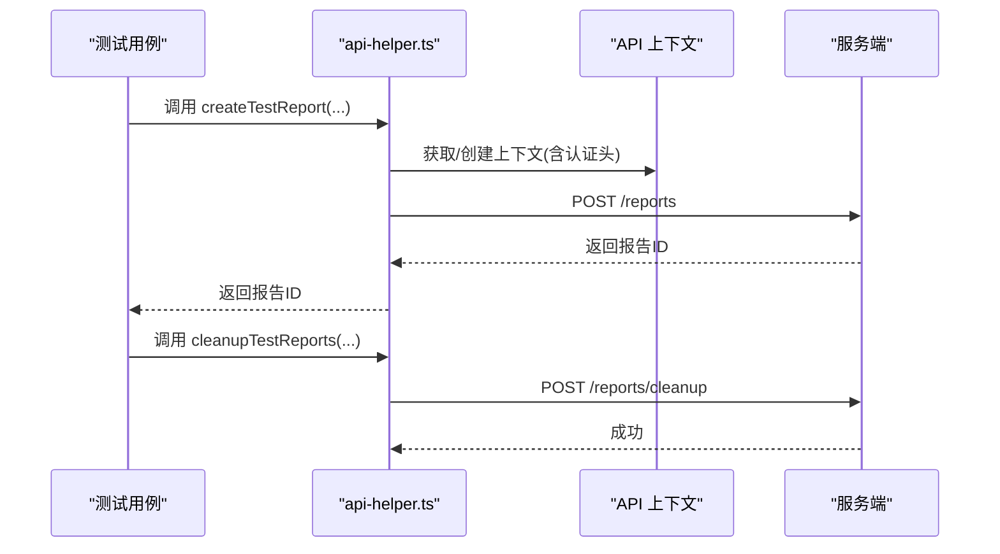
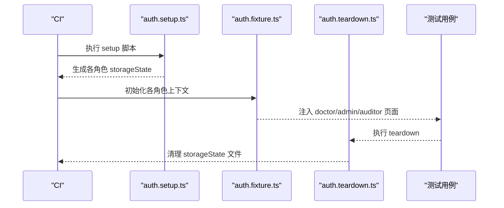
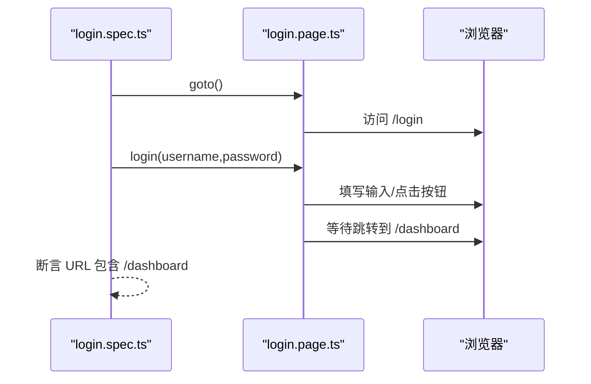
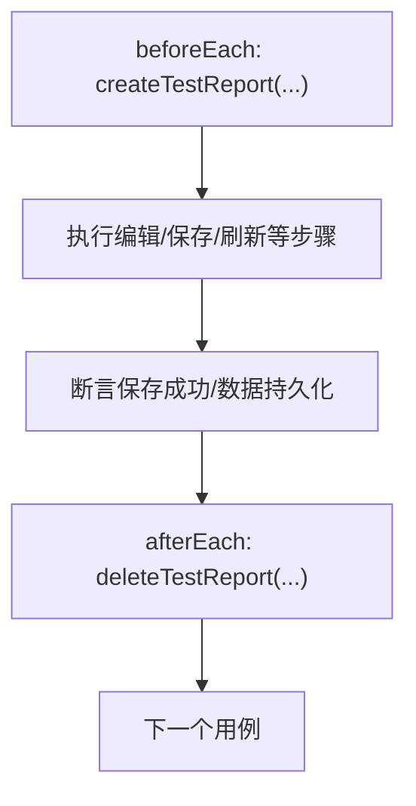
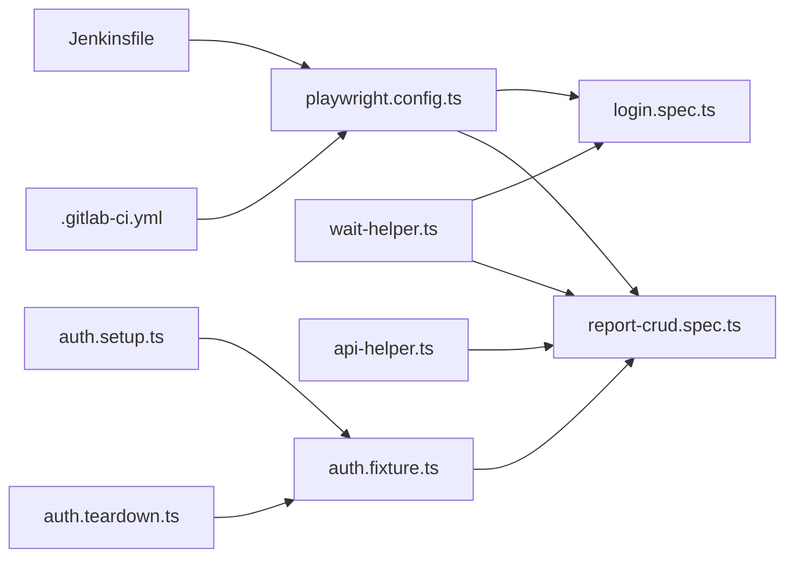

# 性能监控

<cite>
**本文引用的文件**   
- [playwright.config.ts](file://e2e-tests/playwright.config.ts)
- [package.json](file://e2e-tests/package.json)
- [Jenkinsfile](file://e2e-tests/Jenkinsfile)
- [.gitlab-ci.yml](file://e2e-tests/.gitlab-ci.yml)
- [wait-helper.ts](file://e2e-tests/utils/wait-helper.ts)
- [api-helper.ts](file://e2e-tests/utils/api-helper.ts)
- [auth.setup.ts](file://e2e-tests/fixtures/auth.setup.ts)
- [auth.fixture.ts](file://e2e-tests/fixtures/auth.fixture.ts)
- [auth.teardown.ts](file://e2e-tests/fixtures/auth.teardown.ts)
- [login.spec.ts](file://e2e-tests/tests/smoke/login.spec.ts)
- [report-crud.spec.ts](file://e2e-tests/tests/regression/report-crud.spec.ts)
- [login.page.ts](file://e2e-tests/pages/login.page.ts)
- [users.json](file://e2e-tests/data/users.json)
- [exam-items.json](file://e2e-tests/data/exam-items.json)
</cite>

## 目录
1. [简介](#简介)
2. [项目结构](#项目结构)
3. [核心组件](#核心组件)
4. [架构总览](#架构总览)
5. [详细组件分析](#详细组件分析)
6. [依赖分析](#依赖分析)
7. [性能考虑](#性能考虑)
8. [故障排查指南](#故障排查指南)
9. [结论](#结论)
10. [附录](#附录)

## 简介
本技术文档围绕端到端性能监控体系进行系统化说明，重点覆盖以下方面：
- 测试执行时间监控：全局超时设置、断言超时配置、测试用例级性能指标采集路径
- 资源使用监控：内存、CPU、网络请求的观测与分析方法
- 性能基准与回归：如何建立基线与在回归中识别回归
- 性能优化最佳实践：并发执行策略、资源清理、测试环境调优
- 性能数据采集、存储与分析：报告生成与解读

当前仓库以 Playwright 为基础，结合 CI（Jenkins/GitLab CI）与内置报告能力，形成可复现、可观测的自动化测试流水线。本文将从配置、工具、页面对象、测试脚本等维度，给出可落地的性能监控方案。

## 项目结构
端到端测试工程采用“配置-工具-页面-夹具-测试-数据-报告”的分层组织方式，便于在不同阶段注入性能观测点。

图表来源
- [playwright.config.ts:1-68](file://e2e-tests/playwright.config.ts#L1-L68)
- [package.json:1-27](file://e2e-tests/package.json#L1-L27)
- [Jenkinsfile:1-59](file://e2e-tests/Jenkinsfile#L1-L59)
- [.gitlab-ci.yml:1-67](file://e2e-tests/.gitlab-ci.yml#L1-L67)
- [wait-helper.ts:1-107](file://e2e-tests/utils/wait-helper.ts#L1-L107)
- [api-helper.ts:1-172](file://e2e-tests/utils/api-helper.ts#L1-L172)
- [auth.setup.ts:1-28](file://e2e-tests/fixtures/auth.setup.ts#L1-L28)
- [auth.fixture.ts:1-40](file://e2e-tests/fixtures/auth.fixture.ts#L1-L40)
- [auth.teardown.ts:1-18](file://e2e-tests/fixtures/auth.teardown.ts#L1-L18)
- [login.page.ts:1-52](file://e2e-tests/pages/login.page.ts#L1-L52)
- [login.spec.ts:1-25](file://e2e-tests/tests/smoke/login.spec.ts#L1-L25)
- [report-crud.spec.ts:1-122](file://e2e-tests/tests/regression/report-crud.spec.ts#L1-L122)
- [users.json:1-29](file://e2e-tests/data/users.json#L1-L29)
- [exam-items.json:1-60](file://e2e-tests/data/exam-items.json#L1-L60)

章节来源
- [playwright.config.ts:1-68](file://e2e-tests/playwright.config.ts#L1-L68)
- [package.json:1-27](file://e2e-tests/package.json#L1-L27)

## 核心组件
- 全局与断言超时配置：集中于 Playwright 配置文件，定义测试整体超时、expect 断言超时、并发与工作进程数等
- 等待与重试工具：封装表格加载、API 响应、导航完成、文本匹配与重试逻辑，降低不稳定因素对性能测量的影响
- API 辅助工具：统一管理 API 上下文、认证、批量清理与销毁，支撑测试数据准备与回收
- 夹具与登录态：通过 storageState 预登录，避免重复登录开销；支持多角色上下文隔离
- 页面对象：封装定位器与交互流程，提升稳定性与可维护性
- CI 集成：Jenkins/GitLab CI 将报告产物归档，便于后续分析

章节来源
- [playwright.config.ts:6-29](file://e2e-tests/playwright.config.ts#L6-L29)
- [wait-helper.ts:1-107](file://e2e-tests/utils/wait-helper.ts#L1-L107)
- [api-helper.ts:40-77](file://e2e-tests/utils/api-helper.ts#L40-L77)
- [auth.fixture.ts:10-37](file://e2e-tests/fixtures/auth.fixture.ts#L10-L37)
- [auth.setup.ts:16-26](file://e2e-tests/fixtures/auth.setup.ts#L16-L26)
- [login.page.ts:22-34](file://e2e-tests/pages/login.page.ts#L22-L34)
- [Jenkinsfile:12-38](file://e2e-tests/Jenkinsfile#L12-L38)
- [.gitlab-ci.yml:11-46](file://e2e-tests/.gitlab-ci.yml#L11-L46)

## 架构总览
下图展示从 CI 触发到报告产出的端到端流程，以及性能观测的关键节点。

图表来源
- [playwright.config.ts:6-29](file://e2e-tests/playwright.config.ts#L6-L29)
- [auth.fixture.ts:10-37](file://e2e-tests/fixtures/auth.fixture.ts#L10-L37)
- [wait-helper.ts:8-23](file://e2e-tests/utils/wait-helper.ts#L8-L23)
- [api-helper.ts:83-121](file://e2e-tests/utils/api-helper.ts#L83-L121)
- [Jenkinsfile:41-57](file://e2e-tests/Jenkinsfile#L41-L57)
- [.gitlab-ci.yml:49-67](file://e2e-tests/.gitlab-ci.yml#L49-L67)

## 详细组件分析

### 全局超时与并发配置
- 全局测试超时：控制整条测试链路的最长等待时间，避免长时间卡死
- expect 断言超时：缩短断言等待，提高失败反馈速度
- 并发策略：fullyParallel 开启全并行；CI 环境 workers 数量更大，提升吞吐
- 报告器：CI 环境输出 HTML/JUnit/Allure，本地仅 HTML

图表来源
- [playwright.config.ts:8-15](file://e2e-tests/playwright.config.ts#L8-L15)
- [playwright.config.ts:16-22](file://e2e-tests/playwright.config.ts#L16-L22)

章节来源
- [playwright.config.ts:6-29](file://e2e-tests/playwright.config.ts#L6-L29)

### 等待与重试工具（稳定性能测量）
- 表格加载等待：等待容器可见、骨架屏隐藏、首行数据出现
- Toast/消息等待：基于文本可见性断言
- API 响应等待：按 URL 模式与状态码筛选响应
- 导航完成等待：等待 networkidle
- 操作重试包装器：在不稳定场景自动重试，降低抖动
- 文本内容等待：等待元素包含期望文本

图表来源
- [wait-helper.ts:8-23](file://e2e-tests/utils/wait-helper.ts#L8-L23)
- [wait-helper.ts:28-36](file://e2e-tests/utils/wait-helper.ts#L28-L36)
- [wait-helper.ts:41-58](file://e2e-tests/utils/wait-helper.ts#L41-L58)
- [wait-helper.ts:63-68](file://e2e-tests/utils/wait-helper.ts#L63-L68)
- [wait-helper.ts:74-92](file://e2e-tests/utils/wait-helper.ts#L74-L92)
- [wait-helper.ts:97-106](file://e2e-tests/utils/wait-helper.ts#L97-L106)

章节来源
- [wait-helper.ts:1-107](file://e2e-tests/utils/wait-helper.ts#L1-L107)

### API 辅助工具（数据层性能观测）
- 单例 API 上下文：首次登录获取 token 后重建带认证头的上下文，减少重复鉴权开销
- 创建/删除/更新/查询报告：统一接口，便于在测试前后进行数据准备与清理
- 批量清理：按前缀清理测试数据，避免脏数据影响后续用例
- 上下文销毁：在全局 teardown 中释放资源

图表来源
- [api-helper.ts:45-77](file://e2e-tests/utils/api-helper.ts#L45-L77)
- [api-helper.ts:83-121](file://e2e-tests/utils/api-helper.ts#L83-L121)
- [api-helper.ts:156-161](file://e2e-tests/utils/api-helper.ts#L156-L161)
- [api-helper.ts:166-171](file://e2e-tests/utils/api-helper.ts#L166-L171)

章节来源
- [api-helper.ts:1-172](file://e2e-tests/utils/api-helper.ts#L1-172)

### 登录态夹具与资源清理
- 多角色上下文：通过 storageState 预登录，避免重复登录流程
- setup/teardown：登录态目录清理，确保每次运行环境干净
- 测试用例数据清理：在 beforeEach/afterEach 中创建/删除测试数据

图表来源
- [auth.setup.ts:16-26](file://e2e-tests/fixtures/auth.setup.ts#L16-L26)
- [auth.fixture.ts:10-37](file://e2e-tests/fixtures/auth.fixture.ts#L10-L37)
- [auth.teardown.ts:7-17](file://e2e-tests/fixtures/auth.teardown.ts#L7-L17)

章节来源
- [auth.setup.ts:1-28](file://e2e-tests/fixtures/auth.setup.ts#L1-L28)
- [auth.fixture.ts:1-40](file://e2e-tests/fixtures/auth.fixture.ts#L1-L40)
- [auth.teardown.ts:1-18](file://e2e-tests/fixtures/auth.teardown.ts#L1-L18)

### 页面对象与测试用例（登录流程）
- 页面对象封装定位器与交互流程，保证断言与等待逻辑一致
- 测试用例聚焦业务目标，断言结果与 URL 跳转

图表来源
- [login.spec.ts:4-13](file://e2e-tests/tests/smoke/login.spec.ts#L4-L13)
- [login.page.ts:22-34](file://e2e-tests/pages/login.page.ts#L22-L34)

章节来源
- [login.spec.ts:1-25](file://e2e-tests/tests/smoke/login.spec.ts#L1-L25)
- [login.page.ts:1-52](file://e2e-tests/pages/login.page.ts#L1-L52)

### 回归测试用例（CRUD 场景）
- 用例在 beforeEach/afterEach 中准备/清理测试数据
- 通过 API 辅助工具创建报告，断言保存、持久化与删除行为

图表来源
- [report-crud.spec.ts:33-43](file://e2e-tests/tests/regression/report-crud.spec.ts#L33-L43)
- [report-crud.spec.ts:74-86](file://e2e-tests/tests/regression/report-crud.spec.ts#L74-L86)
- [report-crud.spec.ts:99-101](file://e2e-tests/tests/regression/report-crud.spec.ts#L99-L101)
- [api-helper.ts:83-121](file://e2e-tests/utils/api-helper.ts#L83-L121)
- [api-helper.ts:126-129](file://e2e-tests/utils/api-helper.ts#L126-L129)

章节来源
- [report-crud.spec.ts:1-122](file://e2e-tests/tests/regression/report-crud.spec.ts#L1-L122)
- [api-helper.ts:1-172](file://e2e-tests/utils/api-helper.ts#L1-L172)

## 依赖分析
- 配置依赖：playwright.config.ts 是全局入口，被 CI、测试脚本、工具函数共同依赖
- 工具依赖：测试脚本依赖 wait-helper.ts 与 api-helper.ts；页面对象依赖 Playwright 的 Page/Locator
- 夹具依赖：auth.fixture.ts 依赖 auth.setup.ts 生成的 storageState；teardown 清理这些文件
- CI 依赖：Jenkins/GitLab CI 依赖 playwright.config.ts 的 workers 与 reporter 设置，并归档报告

图表来源
- [playwright.config.ts:6-29](file://e2e-tests/playwright.config.ts#L6-L29)
- [login.spec.ts:1-25](file://e2e-tests/tests/smoke/login.spec.ts#L1-L25)
- [report-crud.spec.ts:1-122](file://e2e-tests/tests/regression/report-crud.spec.ts#L1-L122)
- [wait-helper.ts:1-107](file://e2e-tests/utils/wait-helper.ts#L1-L107)
- [api-helper.ts:1-172](file://e2e-tests/utils/api-helper.ts#L1-L172)
- [auth.fixture.ts:1-40](file://e2e-tests/fixtures/auth.fixture.ts#L1-L40)
- [auth.setup.ts:1-28](file://e2e-tests/fixtures/auth.setup.ts#L1-L28)
- [auth.teardown.ts:1-18](file://e2e-tests/fixtures/auth.teardown.ts#L1-L18)
- [Jenkinsfile:12-38](file://e2e-tests/Jenkinsfile#L12-L38)
- [.gitlab-ci.yml:11-46](file://e2e-tests/.gitlab-ci.yml#L11-L46)

章节来源
- [playwright.config.ts:1-68](file://e2e-tests/playwright.config.ts#L1-L68)
- [package.json:1-27](file://e2e-tests/package.json#L1-L27)

## 性能考虑
- 全局超时与断言超时
  - 全局超时过短可能导致网络波动或服务延迟引发误判；过长则拖慢整体吞吐
  - expect 断言超时过短会频繁失败；过长则掩盖不稳定问题
  - 建议：在本地调试期适当放宽全局超时，CI 环境保持合理上限
- 并发与工作进程
  - fullyParallel 与 workers 数量直接影响 CPU 与内存占用峰值
  - 建议：根据 CI 节点资源与浏览器实例数量动态调整 workers，避免 OOM
- 等待策略
  - 使用更精确的等待条件（如 API 响应、导航 idle）替代固定 sleep
  - 对易抖动的操作使用重试包装器，减少重复执行带来的噪声
- API 上下文与认证
  - 单例上下文与认证头复用可显著降低重复登录成本
  - 批量清理与销毁上下文，避免连接泄漏
- 报告与制品
  - CI 环境启用 HTML/JUnit/Allure，便于性能趋势与回归分析
  - 归档报告与测试结果，支持离线分析与对比

章节来源
- [playwright.config.ts:8-15](file://e2e-tests/playwright.config.ts#L8-L15)
- [wait-helper.ts:74-92](file://e2e-tests/utils/wait-helper.ts#L74-L92)
- [api-helper.ts:45-77](file://e2e-tests/utils/api-helper.ts#L45-L77)
- [Jenkinsfile:41-57](file://e2e-tests/Jenkinsfile#L41-L57)
- [.gitlab-ci.yml:49-67](file://e2e-tests/.gitlab-ci.yml#L49-L67)

## 故障排查指南
- 登录态失效或不稳定
  - 检查 storageState 是否生成与路径是否正确
  - 确认 teardown 是否清理了 .auth 目录
- API 调用失败或超时
  - 核对 API_BASE_URL 与认证头是否生效
  - 使用等待 API 响应工具确认服务端返回
- 报告无法打开或缺失
  - 确认 CI 是否输出并归档报告目录
  - 检查报告器配置与文件权限
- 并发导致的资源不足
  - 降低 workers 数量或关闭 fullyParallel
  - 优化等待策略，减少不必要的等待

章节来源
- [auth.setup.ts:16-26](file://e2e-tests/fixtures/auth.setup.ts#L16-L26)
- [auth.teardown.ts:7-17](file://e2e-tests/fixtures/auth.teardown.ts#L7-L17)
- [api-helper.ts:63-74](file://e2e-tests/utils/api-helper.ts#L63-L74)
- [wait-helper.ts:41-58](file://e2e-tests/utils/wait-helper.ts#L41-L58)
- [Jenkinsfile:41-57](file://e2e-tests/Jenkinsfile#L41-L57)
- [.gitlab-ci.yml:49-67](file://e2e-tests/.gitlab-ci.yml#L49-L67)

## 结论
本项目以 Playwright 为核心，结合 CI 报告与等待/重试工具，形成了可扩展的端到端性能监控基础。通过合理的全局超时、断言超时、并发策略与 API 上下文管理，能够在保证稳定性的同时获得可靠的性能观测数据。建议在现有基础上引入更细粒度的性能指标采集（如自定义计时、网络分析、内存快照）与趋势分析，持续完善性能基线与回归检测。

## 附录
- 关键配置与脚本位置
  - Playwright 配置：[playwright.config.ts:1-68](file://e2e-tests/playwright.config.ts#L1-L68)
  - 项目脚本：[package.json:6-12](file://e2e-tests/package.json#L6-L12)
  - Jenkins 流水线：[Jenkinsfile:1-59](file://e2e-tests/Jenkinsfile#L1-L59)
  - GitLab CI 流水线：[.gitlab-ci.yml:1-67](file://e2e-tests/.gitlab-ci.yml#L1-L67)
- 数据与页面
  - 用户数据：[users.json:1-29](file://e2e-tests/data/users.json#L1-L29)
  - 检查项目数据：[exam-items.json:1-60](file://e2e-tests/data/exam-items.json#L1-L60)
  - 登录页对象：[login.page.ts:1-52](file://e2e-tests/pages/login.page.ts#L1-L52)
  - 登录测试用例：[login.spec.ts:1-25](file://e2e-tests/tests/smoke/login.spec.ts#L1-L25)
  - CRUD 回归用例：[report-crud.spec.ts:1-122](file://e2e-tests/tests/regression/report-crud.spec.ts#L1-L122)