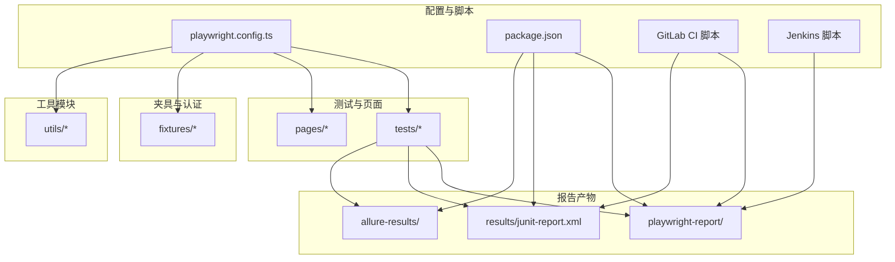
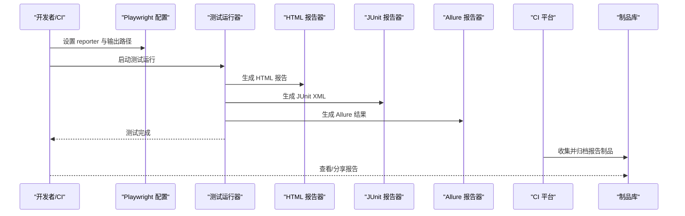
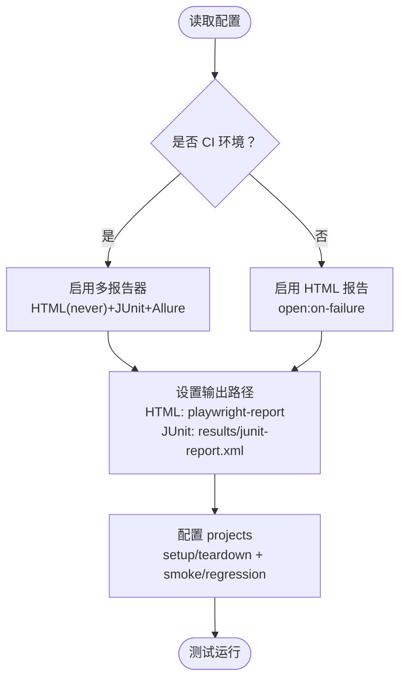
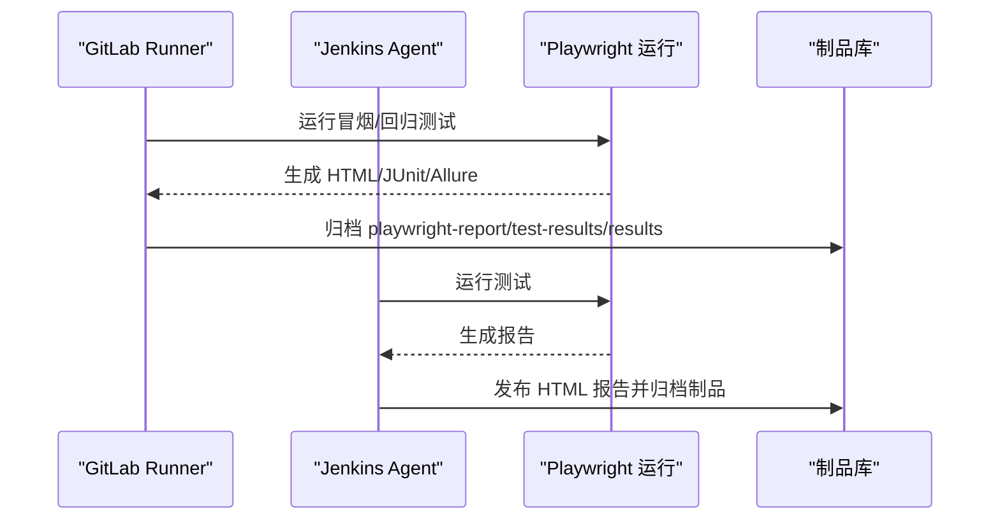
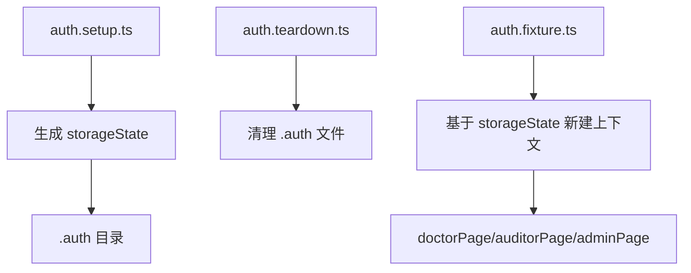
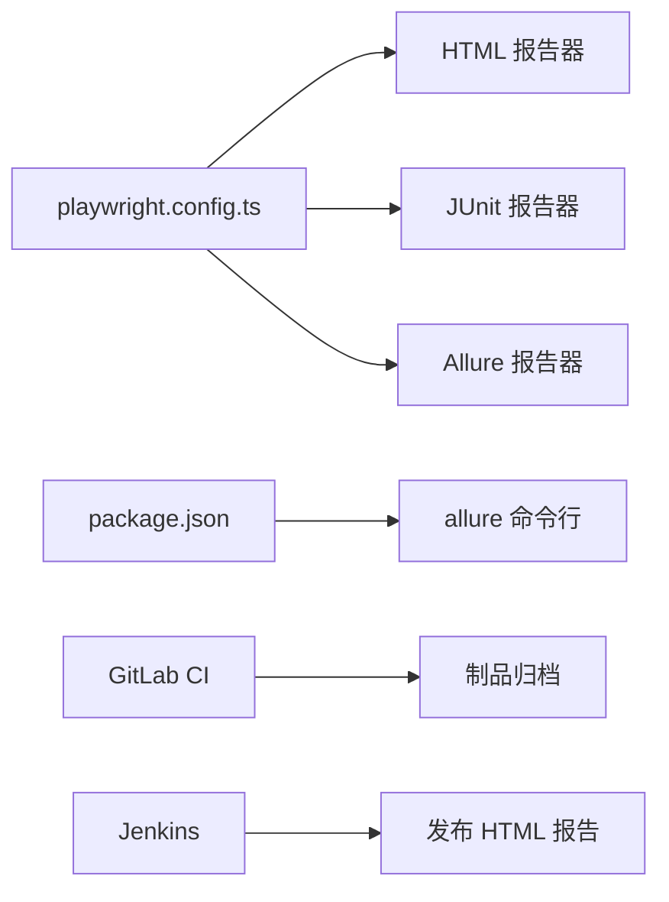

# 报告生成系统

<cite>
**本文引用的文件**
- [playwright.config.ts](file://e2e-tests/playwright.config.ts)
- [package.json](file://e2e-tests/package.json)
- [.gitlab-ci.yml](file://e2e-tests/.gitlab-ci.yml)
- [Jenkinsfile](file://e2e-tests/Jenkinsfile)
- [auth.setup.ts](file://e2e-tests/fixtures/auth.setup.ts)
- [auth.teardown.ts](file://e2e-tests/fixtures/auth.teardown.ts)
- [auth.fixture.ts](file://e2e-tests/fixtures/auth.fixture.ts)
- [report-list.spec.ts](file://e2e-tests/tests/smoke/report-list.spec.ts)
- [report-crud.spec.ts](file://e2e-tests/tests/regression/report-crud.spec.ts)
- [api-helper.ts](file://e2e-tests/utils/api-helper.ts)
- [db-helper.ts](file://e2e-tests/utils/db-helper.ts)
- [junit-report.xml](file://e2e-tests/results/junit-report.xml)
</cite>

## 目录
1. [简介](#简介)
2. [项目结构](#项目结构)
3. [核心组件](#核心组件)
4. [架构总览](#架构总览)
5. [详细组件分析](#详细组件分析)
6. [依赖关系分析](#依赖关系分析)
7. [性能考虑](#性能考虑)
8. [故障排查指南](#故障排查指南)
9. [结论](#结论)
10. [附录](#附录)

## 简介
本报告生成系统基于 Playwright 构建，集成了 HTML 报告、JUnit XML 输出与 Allure 报告三类输出格式，覆盖本地开发与 CI 环境下的多样化需求。系统通过配置文件动态选择报告器、控制输出路径与打开策略，并在 CI 中自动归档与发布报告制品。本文档将深入解析报告生成器的配置选项、不同报告格式的特点与适用场景、报告存储与版本管理策略，以及如何在 CI 中进行多报告器配置与报告分享。

## 项目结构
e2e-tests 目录组织清晰，围绕测试、页面对象、夹具与工具模块划分：
- 配置与脚本：playwright.config.ts、package.json、.gitlab-ci.yml、Jenkinsfile
- 测试与页面对象：tests、pages
- 夹具与认证：fixtures（含 auth.setup、auth.teardown、auth.fixture）
- 工具模块：utils（api-helper、db-helper）
- 报告产物：playwright-report（HTML）、results（JUnit XML）、allure-results（Allure）

图表来源
- [playwright.config.ts:1-68](file://e2e-tests/playwright.config.ts#L1-L68)
- [package.json:1-27](file://e2e-tests/package.json#L1-L27)
- [.gitlab-ci.yml:1-67](file://e2e-tests/.gitlab-ci.yml#L1-L67)
- [Jenkinsfile:1-59](file://e2e-tests/Jenkinsfile#L1-L59)

章节来源
- [playwright.config.ts:1-68](file://e2e-tests/playwright.config.ts#L1-L68)
- [package.json:1-27](file://e2e-tests/package.json#L1-L27)

## 核心组件
- 报告生成器配置（Playwright）：根据 CI 环境动态启用多报告器，控制 HTML 报告输出路径与打开策略，以及 JUnit 输出文件路径。
- 报告器集合：HTML 报告（交互式）、JUnit XML（标准化）、Allure（可视化与趋势）。
- CI 集成：GitLab CI 与 Jenkins 将报告制品归档并提供访问链接；Jenkins 还将 HTML 报告发布为可浏览的制品。
- 认证与夹具：通过 setup/teardown 生成登录态快照，供各项目复用，确保报告中可重现的上下文。
- 工具模块：API 辅助与数据库辅助，支撑测试数据准备与清理，间接影响报告质量与一致性。

章节来源
- [playwright.config.ts:16-22](file://e2e-tests/playwright.config.ts#L16-L22)
- [package.json:6-12](file://e2e-tests/package.json#L6-L12)
- [.gitlab-ci.yml:19-46](file://e2e-tests/.gitlab-ci.yml#L19-L46)
- [Jenkinsfile:42-50](file://e2e-tests/Jenkinsfile#L42-L50)

## 架构总览
系统采用“配置驱动 + CI 归档”的架构：配置文件决定报告器与输出位置；测试运行时生成多种格式的报告；CI 负责收集制品并对外发布。

图表来源
- [playwright.config.ts:16-22](file://e2e-tests/playwright.config.ts#L16-L22)
- [package.json:11-12](file://e2e-tests/package.json#L11-L12)
- [.gitlab-ci.yml:19-46](file://e2e-tests/.gitlab-ci.yml#L19-L46)
- [Jenkinsfile:42-50](file://e2e-tests/Jenkinsfile#L42-L50)

## 详细组件分析

### Playwright 报告生成器配置
- CI 条件选择：当处于 CI 环境时启用多报告器（HTML、JUnit、Allure），否则仅启用 HTML 报告并在失败时打开。
- 输出路径：
  - HTML：outputFolder 指向 playwright-report。
  - JUnit：outputFile 指向 results/junit-report.xml。
- 打开模式：本地开发默认 on-failure，CI 设为 never。
- 项目化测试：通过 projects 字段拆分 smoke 与 regression，并依赖 setup 生成登录态。

图表来源
- [playwright.config.ts:13-22](file://e2e-tests/playwright.config.ts#L13-L22)
- [playwright.config.ts:31-66](file://e2e-tests/playwright.config.ts#L31-L66)

章节来源
- [playwright.config.ts:6-29](file://e2e-tests/playwright.config.ts#L6-L29)
- [playwright.config.ts:31-66](file://e2e-tests/playwright.config.ts#L31-L66)

### HTML 报告（交互式）
- 特点：可交互、可查看截图、视频、trace、网络日志等，便于定位问题。
- 生成与打开策略：由配置中的 open 选项控制；CI 下不自动打开，避免阻塞流水线。
- 存储位置：playwright-report/index.html。

章节来源
- [playwright.config.ts:16-22](file://e2e-tests/playwright.config.ts#L16-L22)

### JUnit XML 报告（标准化）
- 特点：符合 JUnit 标准格式，便于 CI 平台解析测试统计、失败用例与跳过用例。
- 生成与存储：由 JUnit 报告器生成至 results/junit-report.xml。
- 在 CI 中作为制品归档，便于后续分析与通知。

章节来源
- [playwright.config.ts:18-19](file://e2e-tests/playwright.config.ts#L18-L19)
- [junit-report.xml:266-292](file://e2e-tests/results/junit-report.xml#L266-L292)

### Allure 报告（可视化与趋势）
- 特点：支持分类统计、趋势图、标签与严重度、环境信息等，适合团队协作与长期追踪。
- 集成方式：通过 allure-playwright 插件生成 allure-results，再由命令行生成静态报告。
- 本地命令：package.json 提供一键生成与打开 Allure 报告的脚本。

章节来源
- [playwright.config.ts:20](file://e2e-tests/playwright.config.ts#L20)
- [package.json:12](file://e2e-tests/package.json#L12)

### CI 环境下的多报告器配置
- GitLab CI：
  - 冒烟测试与回归测试阶段分别运行，并归档 playwright-report、test-results、results。
  - 归档保留期：冒烟测试 7 天，回归测试 30 天。
- Jenkins：
  - 使用 publishHTML 将 HTML 报告发布为可浏览制品。
  - 归档 test-results 与 results，便于回溯。

图表来源
- [.gitlab-ci.yml:19-46](file://e2e-tests/.gitlab-ci.yml#L19-L46)
- [Jenkinsfile:42-50](file://e2e-tests/Jenkinsfile#L42-L50)

章节来源
- [.gitlab-ci.yml:11-46](file://e2e-tests/.gitlab-ci.yml#L11-L46)
- [Jenkinsfile:21-50](file://e2e-tests/Jenkinsfile#L21-L50)

### 认证与夹具（影响报告上下文）
- setup：登录并生成 storageState 快照，确保后续测试在已登录上下文中运行。
- teardown：清理 .auth 目录下的快照，避免污染。
- auth.fixture：基于 storageState 创建带角色的 Page 实例，保证报告中可复现的用户上下文。

图表来源
- [auth.setup.ts:16-26](file://e2e-tests/fixtures/auth.setup.ts#L16-L26)
- [auth.teardown.ts:7-17](file://e2e-tests/fixtures/auth.teardown.ts#L7-L17)
- [auth.fixture.ts:10-37](file://e2e-tests/fixtures/auth.fixture.ts#L10-L37)

章节来源
- [auth.setup.ts:1-28](file://e2e-tests/fixtures/auth.setup.ts#L1-L28)
- [auth.teardown.ts:1-18](file://e2e-tests/fixtures/auth.teardown.ts#L1-L18)
- [auth.fixture.ts:1-40](file://e2e-tests/fixtures/auth.fixture.ts#L1-L40)

### 测试用例与报告关联
- 冒烟测试：如 report-list.spec.ts 展示列表加载与关键列断言，失败时可结合 HTML 报告的 trace 与截图定位。
- 回归测试：如 report-crud.spec.ts 涵盖创建、编辑、删除、保存草稿等流程，适合生成 Allure 趋势与分类统计。

章节来源
- [report-list.spec.ts:1-28](file://e2e-tests/tests/smoke/report-list.spec.ts#L1-L28)
- [report-crud.spec.ts:1-122](file://e2e-tests/tests/regression/report-crud.spec.ts#L1-L122)

### 工具模块（间接影响报告质量）
- API 辅助：统一创建/删除/更新报告，确保测试数据一致，提升报告稳定性。
- 数据库辅助：重置/清理测试数据，避免历史数据干扰报告统计。

章节来源
- [api-helper.ts:83-121](file://e2e-tests/utils/api-helper.ts#L83-L121)
- [db-helper.ts:33-43](file://e2e-tests/utils/db-helper.ts#L33-L43)

## 依赖关系分析
- 配置文件依赖：playwright.config.ts 决定 reporter、outputFolder、outputFile、projects 等。
- 脚本依赖：package.json 的脚本依赖 allure-playwright 与 allure-commandline。
- CI 依赖：GitLab CI 与 Jenkins 依赖 Docker Playwright 镜像与制品归档能力。

图表来源
- [playwright.config.ts:16-22](file://e2e-tests/playwright.config.ts#L16-L22)
- [package.json:17-25](file://e2e-tests/package.json#L17-L25)
- [.gitlab-ci.yml:19-46](file://e2e-tests/.gitlab-ci.yml#L19-L46)
- [Jenkinsfile:42-49](file://e2e-tests/Jenkinsfile#L42-L49)

章节来源
- [playwright.config.ts:16-22](file://e2e-tests/playwright.config.ts#L16-L22)
- [package.json:17-25](file://e2e-tests/package.json#L17-L25)
- [.gitlab-ci.yml:19-46](file://e2e-tests/.gitlab-ci.yml#L19-L46)
- [Jenkinsfile:42-49](file://e2e-tests/Jenkinsfile#L42-L49)

## 性能考虑
- CI 并行：workers 与 retries 在 CI 下启用，提高吞吐并增强稳定性。
- 截图/视频/Trace：仅在失败时保留，降低存储压力。
- 报告器选择：CI 下启用多报告器，但 HTML 不自动打开，避免阻塞。

章节来源
- [playwright.config.ts:13-15](file://e2e-tests/playwright.config.ts#L13-L15)
- [playwright.config.ts:24-29](file://e2e-tests/playwright.config.ts#L24-L29)

## 故障排查指南
- HTML 报告无法打开或找不到文件
  - 检查 outputFolder 是否正确，确认 CI 是否将 playwright-report 归档。
  - 参考：[playwright.config.ts:18](file://e2e-tests/playwright.config.ts#L18)
- JUnit 报告为空或缺失
  - 确认 JUnit 报告器已启用且 outputFile 路径有效。
  - 参考：[playwright.config.ts:19](file://e2e-tests/playwright.config.ts#L19)
- Allure 报告未生成
  - 确认 allure-playwright 已安装，且 CI 中执行了 allure 生成与打开命令。
  - 参考：[package.json:20-21](file://e2e-tests/package.json#L20-L21)
- CI 归档失败
  - 检查 GitLab CI 或 Jenkins 的 artifacts/publishHTML 配置与路径。
  - 参考：[.gitlab-ci.yml:22-24](file://e2e-tests/.gitlab-ci.yml#L22-L24), [Jenkinsfile:43-47](file://e2e-tests/Jenkinsfile#L43-L47)
- 登录态失效导致报告上下文异常
  - 确认 setup/teardown 正常生成与清理 .auth 目录。
  - 参考：[auth.setup.ts:16-26](file://e2e-tests/fixtures/auth.setup.ts#L16-L26), [auth.teardown.ts:7-17](file://e2e-tests/fixtures/auth.teardown.ts#L7-L17)

章节来源
- [playwright.config.ts:18-20](file://e2e-tests/playwright.config.ts#L18-L20)
- [package.json:20-21](file://e2e-tests/package.json#L20-L21)
- [.gitlab-ci.yml:22-24](file://e2e-tests/.gitlab-ci.yml#L22-L24)
- [Jenkinsfile:43-47](file://e2e-tests/Jenkinsfile#L43-L47)
- [auth.setup.ts:16-26](file://e2e-tests/fixtures/auth.setup.ts#L16-L26)
- [auth.teardown.ts:7-17](file://e2e-tests/fixtures/auth.teardown.ts#L7-L17)

## 结论
该报告生成系统通过 Playwright 的灵活配置，在本地与 CI 环境下实现了 HTML、JUnit 与 Allure 三类报告的统一输出。CI 层面的制品归档与发布机制保障了报告的可访问性与可分享性。配合认证夹具与工具模块，报告具备良好的可复现性与稳定性。建议在团队内统一报告查看与分享流程，并根据项目规模调整 CI 并行度与保留周期。

## 附录

### 报告格式特点与适用场景
- HTML 报告：适合本地调试与快速定位问题，交互性强。
- JUnit 报告：适合 CI 平台解析与通知，便于自动化处理。
- Allure 报告：适合团队协作与长期趋势追踪，可视化丰富。

### 自定义配置与模板定制
- 报告器参数：可在配置文件中调整 HTML 的 open 模式与 outputFolder，以及 JUnit 的 outputFile。
- Allure 模板：可通过 allure-commandline 的静态报告生成能力进行定制（需在 CI 中扩展）。
- 本地命令：使用 package.json 中的脚本快速生成与打开 Allure 报告。

章节来源
- [playwright.config.ts:16-22](file://e2e-tests/playwright.config.ts#L16-L22)
- [package.json:11-12](file://e2e-tests/package.json#L11-L12)

### 报告存储策略、版本管理与历史对比
- 存储策略：CI 将 HTML、JUnit、Allure 产物归档，设置不同保留期以平衡成本与可追溯性。
- 版本管理：通过分支/标签区分不同版本的报告；建议在制品库中按时间命名目录。
- 历史对比：Allure 支持多轮次报告对比与趋势分析，适合长期演进追踪。

章节来源
- [.gitlab-ci.yml:25-26](file://e2e-tests/.gitlab-ci.yml#L25-L26)
- [.gitlab-ci.yml:43-44](file://e2e-tests/.gitlab-ci.yml#L43-L44)