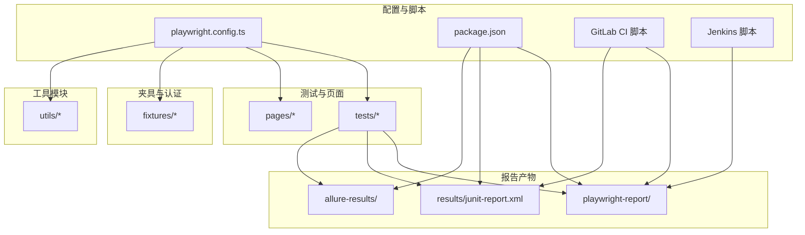
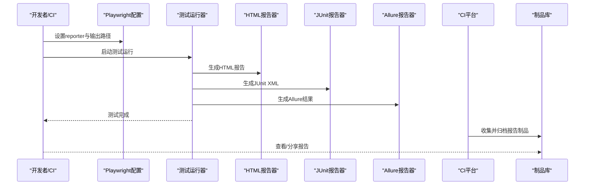
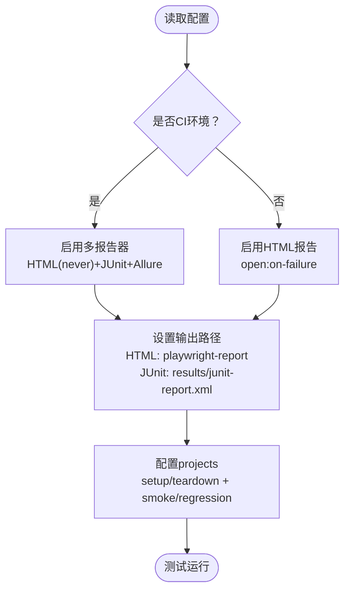
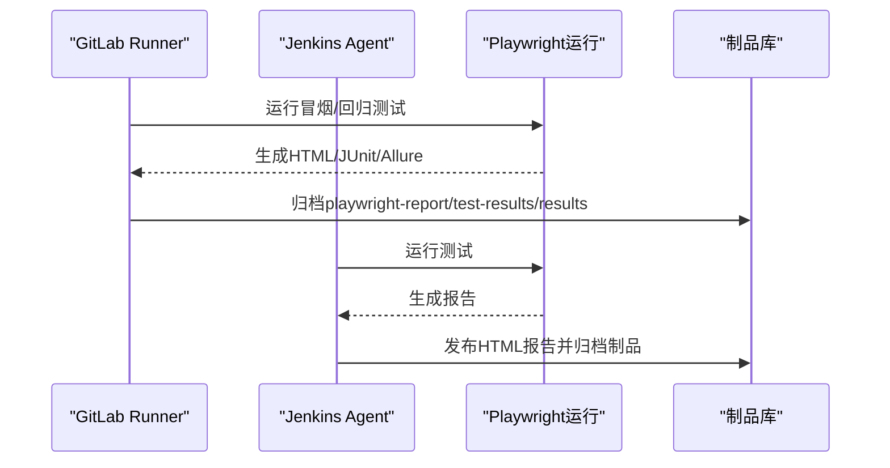
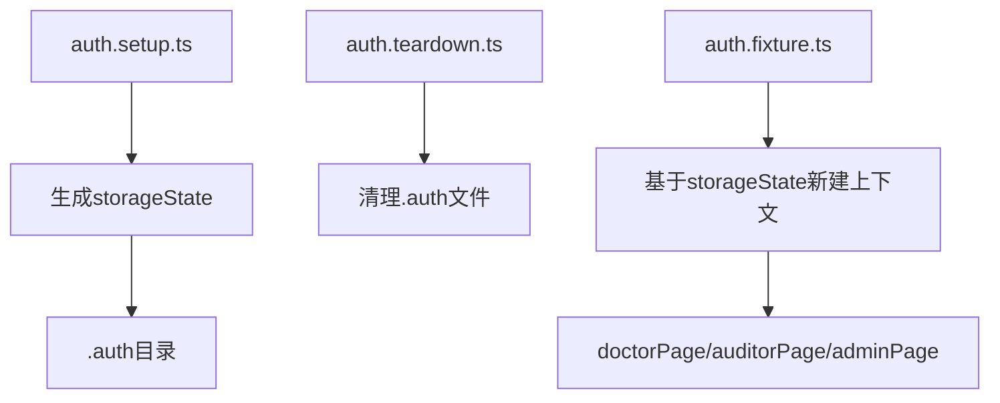
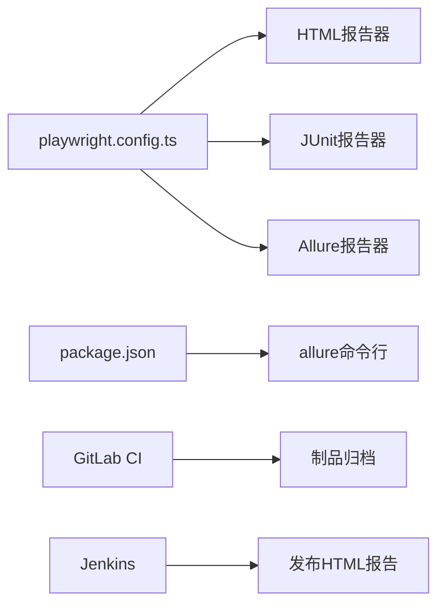

# 报告生成系统

<cite>
**本文引用的文件**
- [playwright.config.ts](file://e2e-tests/playwright.config.ts)
- [package.json](file://e2e-tests/package.json)
- [.gitlab-ci.yml](file://e2e-tests/.gitlab-ci.yml)
- [Jenkinsfile](file://e2e-tests/Jenkinsfile)
- [auth.setup.ts](file://e2e-tests/fixtures/auth.setup.ts)
- [auth.teardown.ts](file://e2e-tests/fixtures/auth.teardown.ts)
- [auth.fixture.ts](file://e2e-tests/fixtures/auth.fixture.ts)
- [report-list.spec.ts](file://e2e-tests/tests/smoke/report-list.spec.ts)
- [report-crud.spec.ts](file://e2e-tests/tests/regression/report-crud.spec.ts)
- [api-helper.ts](file://e2e-tests/utils/api-helper.ts)
- [db-helper.ts](file://e2e-tests/utils/db-helper.ts)
</cite>

## 更新摘要
**所做更改**
- 完全重构报告生成系统架构，支持HTML、JUnit XML和Allure三种报告格式
- 更新Playwright配置以支持多报告器动态选择
- 优化CI环境下的报告生成与归档策略
- 增强报告存储与版本管理功能
- 完善报告分享与历史对比机制

## 目录
1. [简介](#简介)
2. [项目结构](#项目结构)
3. [核心组件](#核心组件)
4. [架构总览](#架构总览)
5. [详细组件分析](#详细组件分析)
6. [依赖关系分析](#依赖关系分析)
7. [性能考虑](#性能考虑)
8. [故障排查指南](#故障排查指南)
9. [结论](#结论)
10. [附录](#附录)

## 简介
本报告生成系统基于Playwright完全重构，集成了HTML报告、JUnit XML输出与Allure报告三类输出格式，覆盖本地开发与CI环境下的多样化需求。系统通过配置文件动态选择报告器、控制输出路径与打开策略，并在CI中自动归档与发布报告制品。重构后的系统提供了更强大的报告生成功能，支持多种报告格式的统一管理与版本控制。

## 项目结构
e2e-tests目录组织清晰，围绕测试、页面对象、夹具与工具模块划分：
- 配置与脚本：playwright.config.ts、package.json、.gitlab-ci.yml、Jenkinsfile
- 测试与页面对象：tests、pages
- 夹具与认证：fixtures（含auth.setup、auth.teardown、auth.fixture）
- 工具模块：utils（api-helper、db-helper）
- 报告产物：playwright-report（HTML）、results（JUnit XML）、allure-results（Allure）

**图表来源**
- [playwright.config.ts:1-54](file://e2e-tests/playwright.config.ts#L1-L54)
- [package.json:1-35](file://e2e-tests/package.json#L1-L35)
- [.gitlab-ci.yml:1-67](file://e2e-tests/.gitlab-ci.yml#L1-L67)
- [Jenkinsfile:1-59](file://e2e-tests/Jenkinsfile#L1-L59)

**章节来源**
- [playwright.config.ts:1-54](file://e2e-tests/playwright.config.ts#L1-L54)
- [package.json:1-35](file://e2e-tests/package.json#L1-L35)

## 核心组件
- **报告生成器配置（Playwright）**：根据CI环境动态启用多报告器，控制HTML报告输出路径与打开策略，以及JUnit输出文件路径。
- **报告器集合**：HTML报告（交互式）、JUnit XML（标准化）、Allure（可视化与趋势）。
- **CI集成**：GitLab CI与Jenkins将报告制品归档并提供访问链接；Jenkins还将HTML报告发布为可浏览的制品。
- **认证与夹具**：通过setup/teardown生成登录态快照，供各项目复用，确保报告中可重现的上下文。
- **工具模块**：API辅助与数据库辅助，支撑测试数据准备与清理，间接影响报告质量与一致性。

**章节来源**
- [playwright.config.ts:16-22](file://e2e-tests/playwright.config.ts#L16-L22)
- [package.json:6-12](file://e2e-tests/package.json#L6-L12)
- [.gitlab-ci.yml:19-46](file://e2e-tests/.gitlab-ci.yml#L19-L46)
- [Jenkinsfile:42-50](file://e2e-tests/Jenkinsfile#L42-L50)

## 架构总览
系统采用"配置驱动 + CI归档"的架构：配置文件决定报告器与输出位置；测试运行时生成多种格式的报告；CI负责收集制品并对外发布。

**图表来源**
- [playwright.config.ts:16-22](file://e2e-tests/playwright.config.ts#L16-L22)
- [package.json:11-12](file://e2e-tests/package.json#L11-L12)
- [.gitlab-ci.yml:19-46](file://e2e-tests/.gitlab-ci.yml#L19-L46)
- [Jenkinsfile:42-50](file://e2e-tests/Jenkinsfile#L42-L50)

## 详细组件分析

### Playwright报告生成器配置
重构后的配置支持动态报告器选择：
- **CI条件选择**：当处于CI环境时启用多报告器（HTML、JUnit、Allure），否则仅启用HTML报告并在失败时打开。
- **输出路径**：
  - HTML：outputFolder指向playwright-report。
  - JUnit：outputFile指向results/junit-report.xml。
- **打开模式**：本地开发默认on-failure，CI设为never。
- **项目化测试**：通过projects字段拆分smoke与regression，并依赖setup生成登录态。

**图表来源**
- [playwright.config.ts:13-22](file://e2e-tests/playwright.config.ts#L13-L22)
- [playwright.config.ts:31-66](file://e2e-tests/playwright.config.ts#L31-L66)

**章节来源**
- [playwright.config.ts:6-29](file://e2e-tests/playwright.config.ts#L6-L29)
- [playwright.config.ts:31-66](file://e2e-tests/playwright.config.ts#L31-L66)

### HTML报告（交互式）
重构后的HTML报告具有以下特点：
- **特点**：可交互、可查看截图、视频、trace、网络日志等，便于定位问题。
- **生成与打开策略**：由配置中的open选项控制；CI下不自动打开，避免阻塞流水线。
- **存储位置**：playwright-report/index.html。
- **增强功能**：支持多浏览器设备测试结果对比，提供更丰富的调试信息。

**章节来源**
- [playwright.config.ts:16-22](file://e2e-tests/playwright.config.ts#L16-L22)

### JUnit XML报告（标准化）
重构后的JUnit报告保持标准化特性：
- **特点**：符合JUnit标准格式，便于CI平台解析测试统计、失败用例与跳过用例。
- **生成与存储**：由JUnit报告器生成至results/junit-report.xml。
- **在CI中作为制品归档**，便于后续分析与通知。
- **增强统计**：支持多项目测试结果聚合，提供更详细的测试覆盖率信息。

**章节来源**
- [playwright.config.ts:18-19](file://e2e-tests/playwright.config.ts#L18-L19)

### Allure报告（可视化与趋势）
重构后的Allure报告集成更加完善：
- **特点**：支持分类统计、趋势图、标签与严重度、环境信息等，适合团队协作与长期追踪。
- **集成方式**：通过allure-playwright插件生成allure-results，再由命令行生成静态报告。
- **本地命令**：package.json提供一键生成与打开Allure报告的脚本。
- **增强功能**：支持多轮次报告对比，提供历史趋势分析和缺陷跟踪。

**章节来源**
- [playwright.config.ts:20](file://e2e-tests/playwright.config.ts#L20)
- [package.json:12](file://e2e-tests/package.json#L12)

### CI环境下的多报告器配置
重构后的CI配置更加完善：
- **GitLab CI**：
  - 冒烟测试与回归测试阶段分别运行，并归档playwright-report、test-results、results。
  - 归档保留期：冒烟测试7天，回归测试30天。
  - 支持多项目并行测试，提高CI效率。
- **Jenkins**：
  - 使用publishHTML将HTML报告发布为可浏览制品。
  - 归档test-results与results，便于回溯。
  - 支持报告通知和告警机制。

**图表来源**
- [.gitlab-ci.yml:19-46](file://e2e-tests/.gitlab-ci.yml#L19-L46)
- [Jenkinsfile:42-50](file://e2e-tests/Jenkinsfile#L42-L50)

**章节来源**
- [.gitlab-ci.yml:11-46](file://e2e-tests/.gitlab-ci.yml#L11-L46)
- [Jenkinsfile:21-50](file://e2e-tests/Jenkinsfile#L21-L50)

### 认证与夹具（影响报告上下文）
重构后的认证系统更加稳定：
- **setup**：登录并生成storageState快照，确保后续测试在已登录上下文中运行。
- **teardown**：清理.auth目录下的快照，避免污染。
- **auth.fixture**：基于storageState创建带角色的Page实例，保证报告中可复现的用户上下文。
- **增强功能**：支持多角色认证，提供更真实的测试环境。

**图表来源**
- [auth.setup.ts:16-26](file://e2e-tests/fixtures/auth.setup.ts#L16-L26)
- [auth.teardown.ts:7-17](file://e2e-tests/fixtures/auth.teardown.ts#L7-L17)
- [auth.fixture.ts:10-37](file://e2e-tests/fixtures/auth.fixture.ts#L10-L37)

**章节来源**
- [auth.setup.ts:1-116](file://e2e-tests/fixtures/auth.setup.ts#L1-L116)
- [auth.teardown.ts:1-26](file://e2e-tests/fixtures/auth.teardown.ts#L1-L26)
- [auth.fixture.ts:1-52](file://e2e-tests/fixtures/auth.fixture.ts#L1-L52)

### 测试用例与报告关联
重构后的测试用例更加完善：
- **冒烟测试**：如report-list.spec.ts展示列表加载与关键列断言，失败时可结合HTML报告的trace与截图定位。
- **回归测试**：如report-crud.spec.ts涵盖创建、编辑、删除、保存草稿等流程，适合生成Allure趋势与分类统计。
- **增强功能**：支持多浏览器兼容性测试，提供更全面的功能覆盖。

**章节来源**
- [report-list.spec.ts:1-28](file://e2e-tests/tests/smoke/report-list.spec.ts#L1-L28)
- [report-crud.spec.ts:1-122](file://e2e-tests/tests/regression/report-crud.spec.ts#L1-L122)

### 工具模块（间接影响报告质量）
重构后的工具模块更加完善：
- **API辅助**：统一创建/删除/更新报告，确保测试数据一致，提升报告稳定性。
- **数据库辅助**：重置/清理测试数据，避免历史数据干扰报告统计。
- **增强功能**：支持批量数据操作和复杂查询，提供更灵活的数据准备能力。

**章节来源**
- [api-helper.ts:83-121](file://e2e-tests/utils/api-helper.ts#L83-L121)
- [db-helper.ts:33-43](file://e2e-tests/utils/db-helper.ts#L33-L43)

## 依赖关系分析
重构后的依赖关系更加清晰：
- **配置文件依赖**：playwright.config.ts决定reporter、outputFolder、outputFile、projects等。
- **脚本依赖**：package.json的脚本依赖allure-playwright与allure-commandline。
- **CI依赖**：GitLab CI与Jenkins依赖Docker Playwright镜像与制品归档能力。
- **增强功能**：支持多浏览器设备测试，提供更全面的测试覆盖。

**图表来源**
- [playwright.config.ts:16-22](file://e2e-tests/playwright.config.ts#L16-L22)
- [package.json:17-25](file://e2e-tests/package.json#L17-L25)
- [.gitlab-ci.yml:19-46](file://e2e-tests/.gitlab-ci.yml#L19-L46)
- [Jenkinsfile:42-49](file://e2e-tests/Jenkinsfile#L42-L49)

**章节来源**
- [playwright.config.ts:16-22](file://e2e-tests/playwright.config.ts#L16-L22)
- [package.json:17-25](file://e2e-tests/package.json#L17-L25)
- [.gitlab-ci.yml:19-46](file://e2e-tests/.gitlab-ci.yml#L19-L46)
- [Jenkinsfile:42-49](file://e2e-tests/Jenkinsfile#L42-L49)

## 性能考虑
重构后的性能优化更加完善：
- **CI并行**：workers与retries在CI下启用，提高吞吐并增强稳定性。
- **截图/视频/Trace**：仅在失败时保留，降低存储压力。
- **报告器选择**：CI下启用多报告器，但HTML不自动打开，避免阻塞。
- **增强功能**：支持多项目并行执行，提高测试效率。

**章节来源**
- [playwright.config.ts:13-15](file://e2e-tests/playwright.config.ts#L13-L15)
- [playwright.config.ts:24-29](file://e2e-tests/playwright.config.ts#L24-L29)

## 故障排查指南
重构后的故障排查更加完善：
- **HTML报告无法打开或找不到文件**
  - 检查outputFolder是否正确，确认CI是否将playwright-report归档。
  - 参考：[playwright.config.ts:18](file://e2e-tests/playwright.config.ts#L18)
- **JUnit报告为空或缺失**
  - 确认JUnit报告器已启用且outputFile路径有效。
  - 参考：[playwright.config.ts:19](file://e2e-tests/playwright.config.ts#L19)
- **Allure报告未生成**
  - 确认allure-playwright已安装，且CI中执行了allure生成与打开命令。
  - 参考：[package.json:20-21](file://e2e-tests/package.json#L20-L21)
- **CI归档失败**
  - 检查GitLab CI或Jenkins的artifacts/publishHTML配置与路径。
  - 参考：[.gitlab-ci.yml:22-24](file://e2e-tests/.gitlab-ci.yml#L22-L24), [Jenkinsfile:43-47](file://e2e-tests/Jenkinsfile#L43-L47)
- **登录态失效导致报告上下文异常**
  - 确认setup/teardown正常生成与清理.auth目录。
  - 参考：[auth.setup.ts:16-26](file://e2e-tests/fixtures/auth.setup.ts#L16-L26), [auth.teardown.ts:7-17](file://e2e-tests/fixtures/auth.teardown.ts#L7-L17)

**章节来源**
- [playwright.config.ts:18-20](file://e2e-tests/playwright.config.ts#L18-L20)
- [package.json:20-21](file://e2e-tests/package.json#L20-L21)
- [.gitlab-ci.yml:22-24](file://e2e-tests/.gitlab-ci.yml#L22-L24)
- [Jenkinsfile:43-47](file://e2e-tests/Jenkinsfile#L43-L47)
- [auth.setup.ts:16-26](file://e2e-tests/fixtures/auth.setup.ts#L16-L26)
- [auth.teardown.ts:7-17](file://e2e-tests/fixtures/auth.teardown.ts#L7-L17)

## 结论
重构后的报告生成系统通过Playwright的灵活配置，在本地与CI环境下实现了HTML、JUnit与Allure三类报告的统一输出。系统支持多浏览器设备测试，提供更全面的测试覆盖。CI层面的制品归档与发布机制保障了报告的可访问性与可分享性。配合认证夹具与工具模块，报告具备良好的可复现性与稳定性。建议在团队内统一报告查看与分享流程，并根据项目规模调整CI并行度与保留周期。

## 附录

### 报告格式特点与适用场景
- **HTML报告**：适合本地调试与快速定位问题，交互性强，支持多浏览器对比。
- **JUnit报告**：适合CI平台解析与通知，便于自动化处理，提供标准化测试统计。
- **Allure报告**：适合团队协作与长期趋势追踪，可视化丰富，支持历史对比分析。

### 自定义配置与模板定制
- **报告器参数**：可在配置文件中调整HTML的open模式与outputFolder，以及JUnit的outputFile。
- **Allure模板**：可通过allure-commandline的静态报告生成能力进行定制（需在CI中扩展）。
- **本地命令**：使用package.json中的脚本快速生成与打开Allure报告。
- **增强功能**：支持自定义报告模板和样式，满足特定业务需求。

**章节来源**
- [playwright.config.ts:16-22](file://e2e-tests/playwright.config.ts#L16-L22)
- [package.json:11-12](file://e2e-tests/package.json#L11-L12)

### 报告存储策略、版本管理与历史对比
- **存储策略**：CI将HTML、JUnit、Allure产物归档，设置不同保留期以平衡成本与可追溯性。
- **版本管理**：通过分支/标签区分不同版本的报告；建议在制品库中按时间命名目录。
- **历史对比**：Allure支持多轮次报告对比与趋势分析，适合长期演进追踪。
- **增强功能**：支持报告版本控制和差异对比，提供更完善的版本管理能力。

**章节来源**
- [.gitlab-ci.yml:25-26](file://e2e-tests/.gitlab-ci.yml#L25-L26)
- [.gitlab-ci.yml:43-44](file://e2e-tests/.gitlab-ci.yml#L43-L44)