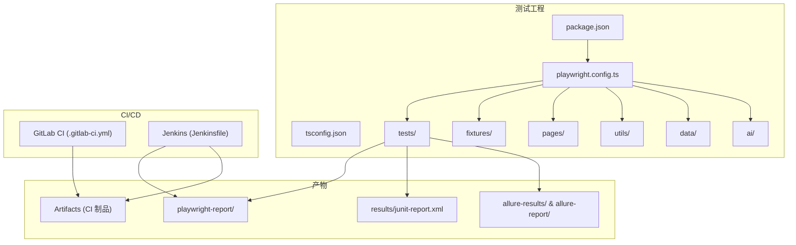
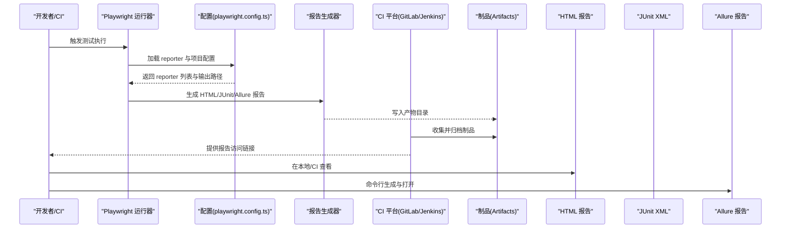
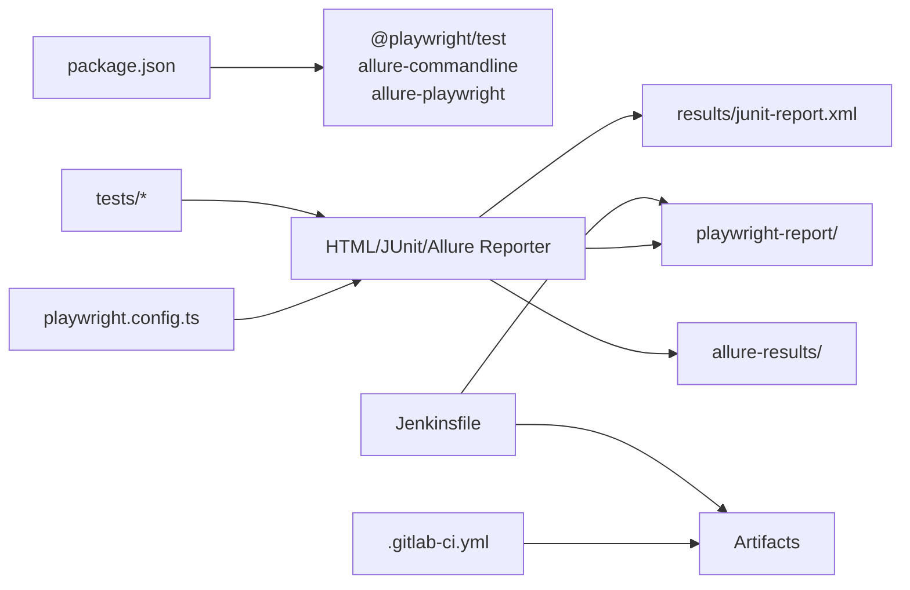

# 测试报告和监控

<cite>
**本文引用的文件**
- [package.json](file://e2e-tests/package.json)
- [playwright.config.ts](file://e2e-tests/playwright.config.ts)
- [.gitlab-ci.yml](file://e2e-tests/.gitlab-ci.yml)
- [Jenkinsfile](file://e2e-tests/Jenkinsfile)
- [tsconfig.json](file://e2e-tests/tsconfig.json)
- [report-list.spec.ts](file://e2e-tests/tests/smoke/report-list.spec.ts)
- [report-crud.spec.ts](file://e2e-tests/tests/regression/report-crud.spec.ts)
- [auth.setup.ts](file://e2e-tests/fixtures/auth.setup.ts)
- [auth.fixture.ts](file://e2e-tests/fixtures/auth.fixture.ts)
- [data.fixture.ts](file://e2e-tests/fixtures/data.fixture.ts)
- [report-list.page.ts](file://e2e-tests/pages/report-list.page.ts)
- [api-helper.ts](file://e2e-tests/utils/api-helper.ts)
- [script-generator.ts](file://e2e-tests/ai/script-generator.ts)
- [failure-analyzer.ts](file://e2e-tests/ai/failure-analyzer.ts)
- [reports.json](file://e2e-tests/data/reports.json)
- [users.json](file://e2e-tests/data/users.json)
</cite>

## 目录
1. [简介](#简介)
2. [项目结构](#项目结构)
3. [核心组件](#核心组件)
4. [架构总览](#架构总览)
5. [详细组件分析](#详细组件分析)
6. [依赖关系分析](#依赖关系分析)
7. [性能考量](#性能考量)
8. [故障排查指南](#故障排查指南)
9. [结论](#结论)
10. [附录](#附录)

## 简介
本技术文档面向质量管理团队，系统性阐述本项目的测试报告与监控体系，涵盖：
- HTML 报告配置与本地/CI 展示
- Allure 报告集成与命令行生成流程
- JUnit XML 输出与 CI 制品归档
- 测试执行时间监控、资源使用与性能基线
- 报告生成配置项、自定义模板与报告分享机制
- 测试结果分析方法、趋势监控与质量度量指标
- 报告存储策略、版本管理与历史对比
- 最佳实践与定制化方案

## 项目结构
本项目采用 Playwright 端到端测试框架，结合 GitLab CI 与 Jenkins 实现跨平台持续集成与报告发布；同时引入 AI 辅助脚本生成与失败分析能力，提升测试开发效率与问题定位速度。

图表来源
- [playwright.config.ts:1-68](file://e2e-tests/playwright.config.ts#L1-L68)
- [package.json:1-27](file://e2e-tests/package.json#L1-L27)
- [.gitlab-ci.yml:1-67](file://e2e-tests/.gitlab-ci.yml#L1-L67)
- [Jenkinsfile:1-59](file://e2e-tests/Jenkinsfile#L1-L59)

章节来源
- [playwright.config.ts:1-68](file://e2e-tests/playwright.config.ts#L1-L68)
- [package.json:1-27](file://e2e-tests/package.json#L1-L27)
- [.gitlab-ci.yml:1-67](file://e2e-tests/.gitlab-ci.yml#L1-L67)
- [Jenkinsfile:1-59](file://e2e-tests/Jenkinsfile#L1-L59)
- [tsconfig.json:1-25](file://e2e-tests/tsconfig.json#L1-L25)

## 核心组件
- 报告生成器
  - Playwright HTML 报告：在 CI 中禁用自动打开，本地按失败自动打开；产物目录可配置。
  - JUnit XML：统一输出到 results/junit-report.xml，便于 CI 平台聚合。
  - Allure：通过 allure-playwright 插件生成，支持命令行生成与打开。
- 测试执行与项目矩阵
  - 项目：setup/cleanup、smoke-chromium、regression-chromium、regression-firefox。
  - 重试与并行：CI 环境启用重试与多工作进程，本地环境简化以便调试。
- CI 集成
  - GitLab CI：冒烟/回归阶段产出报告制品，过期策略不同；发布阶段发送通知。
  - Jenkins：安装依赖 → 冒烟/回归测试 → 归档 test-results 与 results 制品 → HTML 报告发布。
- 页面对象与夹具
  - 页面对象封装 UI 定位与交互，夹具负责登录态注入与测试数据准备。
- AI 辅助
  - 脚本生成：基于测试用例与页面对象接口生成可执行 spec。
  - 失败分析：对失败日志进行根因分类与修复建议输出。

章节来源
- [playwright.config.ts:16-22](file://e2e-tests/playwright.config.ts#L16-L22)
- [playwright.config.ts:31-66](file://e2e-tests/playwright.config.ts#L31-L66)
- [package.json:6-13](file://e2e-tests/package.json#L6-L13)
- [.gitlab-ci.yml:11-46](file://e2e-tests/.gitlab-ci.yml#L11-L46)
- [Jenkinsfile:21-50](file://e2e-tests/Jenkinsfile#L21-L50)
- [auth.setup.ts:1-30](file://e2e-tests/fixtures/auth.setup.ts#L1-L30)
- [auth.fixture.ts:10-37](file://e2e-tests/fixtures/auth.fixture.ts#L10-L37)
- [data.fixture.ts:13-54](file://e2e-tests/fixtures/data.fixture.ts#L13-L54)
- [api-helper.ts:45-77](file://e2e-tests/utils/api-helper.ts#L45-L77)
- [script-generator.ts:63-109](file://e2e-tests/ai/script-generator.ts#L63-L109)
- [failure-analyzer.ts:69-111](file://e2e-tests/ai/failure-analyzer.ts#L69-L111)

## 架构总览
下图展示从测试执行到报告产出与发布的整体流程，包括 CI/CD 与本地两种场景。

图表来源
- [playwright.config.ts:16-22](file://e2e-tests/playwright.config.ts#L16-L22)
- [package.json:11-12](file://e2e-tests/package.json#L11-L12)
- [.gitlab-ci.yml:19-43](file://e2e-tests/.gitlab-ci.yml#L19-L43)
- [Jenkinsfile:42-50](file://e2e-tests/Jenkinsfile#L42-L50)

## 详细组件分析

### HTML 报告配置与本地/CI 行为
- CI 环境
  - reporter: html 输出至 playwright-report，且 open 设置为 never，避免 CI 环境启动浏览器。
- 本地环境
  - reporter: html open 设为 on-failure，仅在失败时自动打开，便于快速定位问题。
- 产物位置
  - playwright-report 目录包含 index.html 与相关静态资源，可在 CI 制品中下载或在本地直接查看。

章节来源
- [playwright.config.ts:16-22](file://e2e-tests/playwright.config.ts#L16-L22)

### Allure 报告集成与命令行生成
- 插件
  - 使用 allure-playwright 插件，自动采集测试元数据与附件。
- 生成流程
  - 命令行生成 allure-results，清理旧报告，生成新报告目录，并打开浏览器预览。
- 产物
  - allure-results 与 allure-report 目录，支持历史版本对比与分享。

章节来源
- [playwright.config.ts:20](file://e2e-tests/playwright.config.ts#L20)
- [package.json:12](file://e2e-tests/package.json#L12)

### JUnit XML 输出与 CI 制品归档
- 输出路径
  - results/junit-report.xml，便于 CI 平台聚合测试结果。
- CI 归档
  - GitLab CI：冒烟/回归阶段归档 playwright-report、test-results、results。
  - Jenkins：post 阶段归档 test-results/** 与 results/**，并发布 HTML 报告。

章节来源
- [playwright.config.ts:19](file://e2e-tests/playwright.config.ts#L19)
- [.gitlab-ci.yml:19-43](file://e2e-tests/.gitlab-ci.yml#L19-L43)
- [Jenkinsfile:48-49](file://e2e-tests/Jenkinsfile#L48-L49)

### 测试执行时间监控、资源使用与性能基线
- 执行时间
  - Playwright 配置包含全局 timeout 与 expect.timeout，可作为单用例上限参考。
  - 通过 CI 日志与报告中的用时统计进行趋势分析。
- 资源使用
  - workers 与 fullyParallel 控制并发，CI 环境默认更高并发以缩短总耗时。
- 性能基线
  - 建议在稳定分支建立“平均用例时长”基线，结合 Allure 的趋势图进行对比。

章节来源
- [playwright.config.ts:8-15](file://e2e-tests/playwright.config.ts#L8-L15)
- [playwright.config.ts:12-15](file://e2e-tests/playwright.config.ts#L12-L15)

### 报告生成配置选项与自定义模板
- 配置项
  - HTML reporter.outputFolder：自定义 HTML 报告输出目录。
  - HTML reporter.open：控制是否自动打开浏览器。
  - JUnit reporter.outputFile：自定义 JUnit XML 输出路径。
  - Allure reporter：由 allure-playwright 插件处理，无需额外配置。
- 自定义模板
  - Playwright HTML 报告为内置模板，不支持直接替换；可通过 CI 将报告制品上传至外部平台进行二次渲染或分享。

章节来源
- [playwright.config.ts:16-22](file://e2e-tests/playwright.config.ts#L16-L22)

### 报告分享机制
- GitLab CI
  - 通过制品库访问报告链接，支持 Markdown 通知发送报告地址。
- Jenkins
  - 使用 publishHTML 插件发布 HTML 报告，便于团队成员直接访问。

章节来源
- [.gitlab-ci.yml:49-66](file://e2e-tests/.gitlab-ci.yml#L49-L66)
- [Jenkinsfile:43-47](file://e2e-tests/Jenkinsfile#L43-L47)

### 测试结果分析方法、趋势监控与质量度量指标
- 分析方法
  - 使用 HTML 报告查看失败用例、截图与视频；结合 JUnit XML 导入 CI 平台进行趋势统计。
  - 使用 Allure 报告进行分类统计与历史对比。
- 趋势监控
  - 基于 CI 日志与 Allure 报告中的通过率、失败率、用时分布进行趋势分析。
- 质量度量指标
  - 通过率、失败率、平均用例时长、P95/P99 时长、重试次数占比等。

章节来源
- [playwright.config.ts:16-22](file://e2e-tests/playwright.config.ts#L16-L22)
- [package.json:12](file://e2e-tests/package.json#L12)

### 报告存储策略、版本管理与历史对比
- 存储策略
  - GitLab CI：冒烟报告 7 天过期，回归报告 30 天过期；建议保留关键分支的报告。
  - Jenkins：归档 test-results 与 results，便于后续分析。
- 版本管理
  - 建议在 CI 中按分支/提交号命名报告目录，形成可追溯的历史记录。
- 历史对比
  - Allure 支持多版本对比，便于观察回归与改进趋势。

章节来源
- [.gitlab-ci.yml:20-25](file://e2e-tests/.gitlab-ci.yml#L20-L25)
- [.gitlab-ci.yml:40-43](file://e2e-tests/.gitlab-ci.yml#L40-L43)
- [Jenkinsfile:48-49](file://e2e-tests/Jenkinsfile#L48-L49)

### 最佳实践与定制化方案
- 最佳实践
  - 本地开发使用 open: on-failure 快速定位失败；CI 禁用自动打开，确保稳定性。
  - 合理设置 workers 与 retries，在速度与稳定性间平衡。
  - 将报告制品上传至制品库或内部平台，统一对外分享。
- 定制化方案
  - 如需自定义报告样式，可在 CI 中将 HTML 报告制品上传至外部平台进行二次渲染。
  - 对于复杂趋势分析，建议结合 Allure 的历史对比与 CI 平台的统计面板。

章节来源
- [playwright.config.ts:12-22](file://e2e-tests/playwright.config.ts#L12-L22)
- [.gitlab-ci.yml:49-66](file://e2e-tests/.gitlab-ci.yml#L49-L66)
- [Jenkinsfile:43-47](file://e2e-tests/Jenkinsfile#L43-L47)

## 依赖关系分析
下图展示测试配置、脚本与产物之间的依赖关系。

图表来源
- [package.json:17-25](file://e2e-tests/package.json#L17-L25)
- [playwright.config.ts:16-22](file://e2e-tests/playwright.config.ts#L16-L22)
- [.gitlab-ci.yml:19-43](file://e2e-tests/.gitlab-ci.yml#L19-L43)
- [Jenkinsfile:42-50](file://e2e-tests/Jenkinsfile#L42-L50)

章节来源
- [package.json:17-25](file://e2e-tests/package.json#L17-L25)
- [playwright.config.ts:16-22](file://e2e-tests/playwright.config.ts#L16-L22)
- [.gitlab-ci.yml:19-43](file://e2e-tests/.gitlab-ci.yml#L19-L43)
- [Jenkinsfile:42-50](file://e2e-tests/Jenkinsfile#L42-L50)

## 性能考量
- 并发与重试
  - CI 环境启用 workers 与 retries，可显著缩短总耗时并提高稳定性。
- 报告生成成本
  - HTML 与 Allure 会生成大量附件与索引，建议在 CI 中清理旧报告并限制保留周期。
- 用例设计
  - 合理拆分用例，避免单用例过长；必要时拆分为子用例并记录独立结果。

章节来源
- [playwright.config.ts:12-15](file://e2e-tests/playwright.config.ts#L12-L15)

## 故障排查指南
- 报告无法打开或路径错误
  - 检查 HTML 报告输出目录与 CI 制品归档路径是否一致。
  - 确认 CI 是否正确发布 HTML 报告。
- Allure 报告为空
  - 确认 allure-playwright 插件已安装并启用；检查 allure-results 是否生成。
- JUnit 报告缺失
  - 确认 JUnit reporter.outputFile 路径正确；检查 CI 是否归档 results 目录。
- 失败用例定位困难
  - 使用 HTML 报告中的截图、视频与 trace；结合 AI 失败分析工具进行根因分类与修复建议。

章节来源
- [playwright.config.ts:16-22](file://e2e-tests/playwright.config.ts#L16-L22)
- [package.json:12](file://e2e-tests/package.json#L12)
- [Jenkinsfile:43-47](file://e2e-tests/Jenkinsfile#L43-L47)
- [failure-analyzer.ts:69-111](file://e2e-tests/ai/failure-analyzer.ts#L69-L111)

## 结论
本项目通过 Playwright 的多 reporter 配置与 CI/CD 集成，实现了从测试执行到报告产出与分享的完整闭环。配合 Allure 的历史对比与趋势分析，以及 AI 辅助的脚本生成与失败分析，能够有效支撑质量管理团队进行持续的质量监控与改进。建议在现有基础上完善报告版本化与历史对比策略，并结合团队流程优化报告访问与通知机制。

## 附录

### 测试用例与页面对象示例
- 冒烟测试：验证报告列表加载与关键列显示。
- 回归测试：覆盖报告 CRUD 场景，结合 API 工具准备与清理测试数据。

章节来源
- [report-list.spec.ts:4-27](file://e2e-tests/tests/smoke/report-list.spec.ts#L4-L27)
- [report-crud.spec.ts:8-121](file://e2e-tests/tests/regression/report-crud.spec.ts#L8-L121)
- [report-list.page.ts:34-129](file://e2e-tests/pages/report-list.page.ts#L34-L129)
- [api-helper.ts:83-121](file://e2e-tests/utils/api-helper.ts#L83-L121)

### 登录态与数据夹具
- 登录态准备：通过 auth.setup.ts 生成 doctor/auditor/admin 的 storageState 文件。
- 数据夹具：自动创建/清理草稿、待审核、已审核报告，确保测试隔离与幂等。

章节来源
- [auth.setup.ts:18-29](file://e2e-tests/fixtures/auth.setup.ts#L18-L29)
- [auth.fixture.ts:10-37](file://e2e-tests/fixtures/auth.fixture.ts#L10-L37)
- [data.fixture.ts:13-54](file://e2e-tests/fixtures/data.fixture.ts#L13-L54)

### AI 辅助能力
- 脚本生成：基于测试用例与页面对象接口生成可执行 spec。
- 失败分析：对失败日志进行根因分类与修复建议输出。

章节来源
- [script-generator.ts:63-109](file://e2e-tests/ai/script-generator.ts#L63-L109)
- [failure-analyzer.ts:69-111](file://e2e-tests/ai/failure-analyzer.ts#L69-L111)