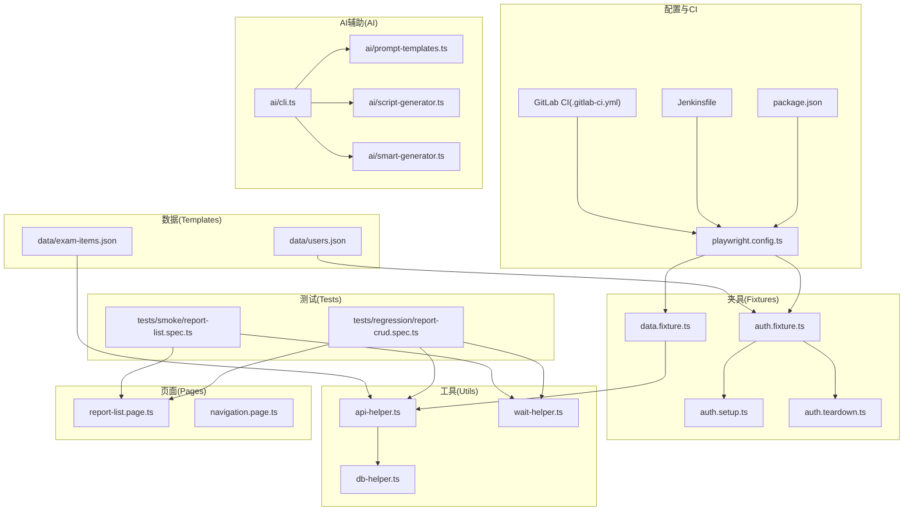
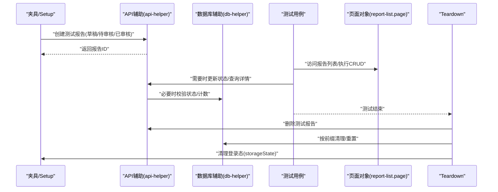
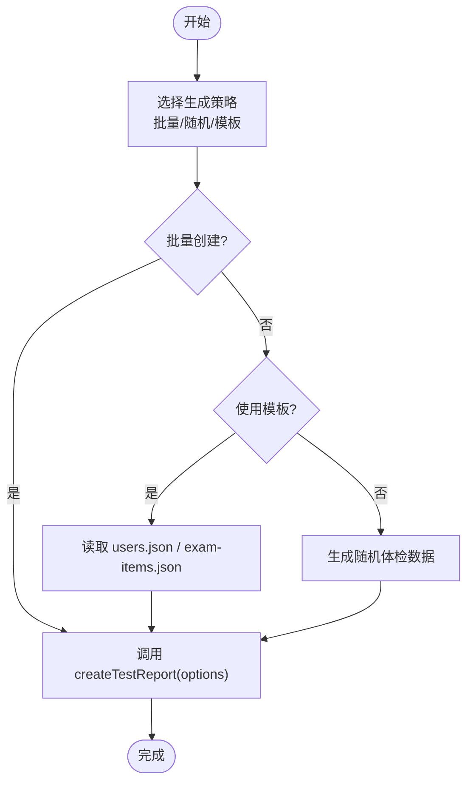
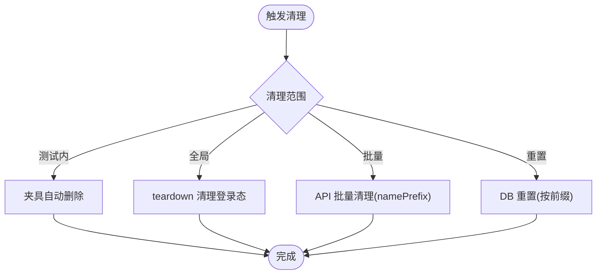
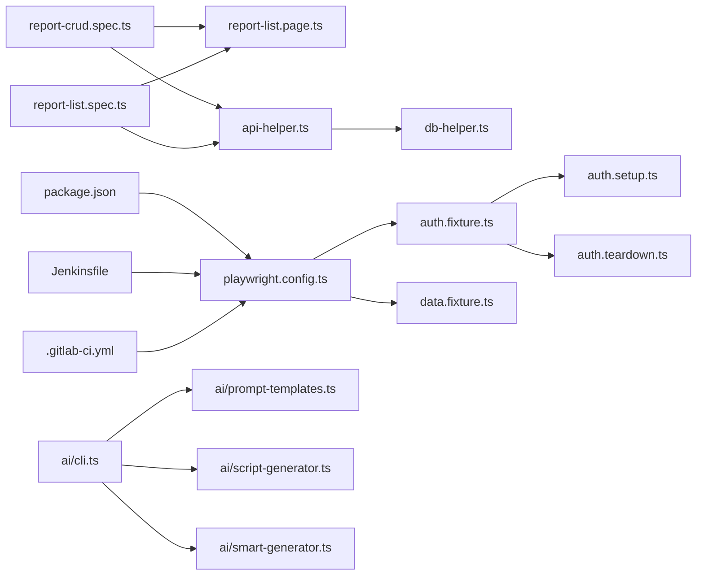

# 测试数据操作

<cite>
**本文引用的文件**
- [package.json](file://e2e-tests/package.json)
- [playwright.config.ts](file://e2e-tests/playwright.config.ts)
- [data.fixture.ts](file://e2e-tests/fixtures/data.fixture.ts)
- [auth.fixture.ts](file://e2e-tests/fixtures/auth.fixture.ts)
- [auth.setup.ts](file://e2e-tests/fixtures/auth.setup.ts)
- [auth.teardown.ts](file://e2e-tests/fixtures/auth.teardown.ts)
- [api-helper.ts](file://e2e-tests/utils/api-helper.ts)
- [db-helper.ts](file://e2e-tests/utils/db-helper.ts)
- [wait-helper.ts](file://e2e-tests/utils/wait-helper.ts)
- [report-list.page.ts](file://e2e-tests/pages/report-list.page.ts)
- [report-crud.spec.ts](file://e2e-tests/tests/regression/report-crud.spec.ts)
- [report-list.spec.ts](file://e2e-tests/tests/smoke/report-list.spec.ts)
- [users.json](file://e2e-tests/data/users.json)
- [exam-items.json](file://e2e-tests/data/exam-items.json)
- [Jenkinsfile](file://e2e-tests/Jenkinsfile)
- [.gitlab-ci.yml](file://e2e-tests/.gitlab-ci.yml)
- [navigation.page.ts](file://e2e-tests/pages/navigation.page.ts)
</cite>

## 更新摘要
**所做更改**
- 更新了测试数据生成策略章节，反映当前禁用的API创建报告功能
- 新增了AI辅助测试生成功能的介绍和使用指南
- 增强了数据清理机制章节，包含新的等待和重试工具
- 更新了环境隔离方案，增加了AI功能的环境配置
- 新增了数据维护流程章节，包含AI辅助的数据管理
- 更新了性能考虑章节，增加AI功能的性能优化建议
- 新增了故障排查指南，包含AI功能的常见问题

## 目录
1. [简介](#简介)
2. [项目结构](#项目结构)
3. [核心组件](#核心组件)
4. [架构总览](#架构总览)
5. [详细组件分析](#详细组件分析)
6. [依赖关系分析](#依赖关系分析)
7. [性能考虑](#性能考虑)
8. [故障排查指南](#故障排查指南)
9. [结论](#结论)
10. [附录](#附录)

## 简介
本指南面向测试工程师，系统阐述本仓库中"测试数据操作"的完整流程与最佳实践，涵盖测试数据生成策略（批量创建、随机生成、预定义模板）、数据清理机制（批量删除、状态重置、环境清理）、环境隔离方案（开发/测试/生产数据分离与保护）、数据维护流程（更新、版本管理、变更追踪）、数据迁移与备份恢复、数据同步方法，以及标准操作流程、安全注意事项与性能优化建议。文中结合 API 辅助工具与数据库工具的实际使用示例，帮助读者快速落地。

**更新** 本版本新增了AI辅助测试生成功能，提供了更丰富的数据操作和管理能力。

## 项目结构
该仓库采用端到端测试工程组织方式，围绕 Playwright 进行页面行为测试，同时提供 API 与数据库工具用于数据准备与清理。新增了AI辅助测试生成功能，支持自动化测试脚本生成和修改。关键目录与文件如下：
- fixtures：登录态与测试数据夹具，负责在测试前后自动创建与清理测试数据
- utils：API 辅助工具、数据库工具、等待与重试工具
- pages：页面对象模型（POM）
- tests：冒烟与回归测试用例
- data：用户角色与体检项目等预定义数据模板
- ai：AI辅助测试生成功能
- 配置：playwright.config.ts、package.json、Jenkinsfile、.gitlab-ci.yml

**图表来源**
- [playwright.config.ts:1-54](file://e2e-tests/playwright.config.ts#L1-L54)
- [auth.fixture.ts:1-52](file://e2e-tests/fixtures/auth.fixture.ts#L1-L52)
- [auth.setup.ts:1-116](file://e2e-tests/fixtures/auth.setup.ts#L1-L116)
- [auth.teardown.ts:1-26](file://e2e-tests/fixtures/auth.teardown.ts#L1-L26)
- [data.fixture.ts:1-32](file://e2e-tests/fixtures/data.fixture.ts#L1-L32)
- [api-helper.ts:1-206](file://e2e-tests/utils/api-helper.ts#L1-L206)
- [db-helper.ts:1-91](file://e2e-tests/utils/db-helper.ts#L1-L91)
- [wait-helper.ts:1-107](file://e2e-tests/utils/wait-helper.ts#L1-L107)
- [report-list.page.ts:1-182](file://e2e-tests/pages/report-list.page.ts#L1-L182)
- [navigation.page.ts:1-90](file://e2e-tests/pages/navigation.page.ts#L1-L90)
- [report-crud.spec.ts:1-122](file://e2e-tests/tests/regression/report-crud.spec.ts#L1-L122)
- [report-list.spec.ts:1-28](file://e2e-tests/tests/smoke/report-list.spec.ts#L1-L28)
- [users.json:1-30](file://e2e-tests/data/users.json#L1-L30)
- [exam-items.json:1-93](file://e2e-tests/data/exam-items.json#L1-L93)
- [package.json:1-35](file://e2e-tests/package.json#L1-L35)
- [Jenkinsfile:1-59](file://e2e-tests/Jenkinsfile#L1-L59)
- [.gitlab-ci.yml:1-67](file://e2e-tests/.gitlab-ci.yml#L1-L67)

**章节来源**
- [playwright.config.ts:1-54](file://e2e-tests/playwright.config.ts#L1-L54)
- [package.json:1-35](file://e2e-tests/package.json#L1-L35)

## 核心组件
- 夹具（Fixtures）
  - 登录态夹具：基于 storageState 的角色页面夹具，确保不同角色（医生、审核员、管理员）的独立会话
  - 数据夹具：当前禁用自动创建与清理测试报告功能，所有fixture返回undefined
- 工具（Utils）
  - API 辅助：统一的 API 请求上下文、认证、报告创建/删除/状态更新、查询、批量清理、上下文销毁
  - 数据库辅助：连接池、按前缀清理、状态校验、计数查询、连接池关闭
  - 等待与重试：表格加载、响应、导航、Toast、重试包装器
- 页面对象（Pages）
  - 报告列表页：封装搜索、筛选、分页、打开/编辑/删除等交互
  - 导航页：提供灵活的菜单导航功能
- 测试用例（Tests）
  - 冒烟测试：验证报告列表加载与关键列展示
  - 回归测试：覆盖报告 CRUD、草稿保存、删除等场景
- 预定义数据模板（data）
  - 用户角色与工作线程用户名/密码
  - 体检项目清单（含正常范围、输入类型、示例值）
- AI辅助工具（AI）
  - CLI工具：提供测试脚本生成、修改、扩展功能
  - 提示模板：包含测试生成、修改、扩展的提示词模板
  - 生成器：智能测试脚本生成和修改引擎

**更新** 当前数据夹具功能被禁用，所有fixture返回undefined，需要手动管理测试数据。

**章节来源**
- [auth.fixture.ts:1-52](file://e2e-tests/fixtures/auth.fixture.ts#L1-L52)
- [data.fixture.ts:1-32](file://e2e-tests/fixtures/data.fixture.ts#L1-L32)
- [api-helper.ts:1-206](file://e2e-tests/utils/api-helper.ts#L1-L206)
- [db-helper.ts:1-91](file://e2e-tests/utils/db-helper.ts#L1-L91)
- [wait-helper.ts:1-107](file://e2e-tests/utils/wait-helper.ts#L1-L107)
- [report-list.page.ts:1-182](file://e2e-tests/pages/report-list.page.ts#L1-L182)
- [navigation.page.ts:1-90](file://e2e-tests/pages/navigation.page.ts#L1-L90)
- [users.json:1-30](file://e2e-tests/data/users.json#L1-L30)
- [exam-items.json:1-93](file://e2e-tests/data/exam-items.json#L1-L93)

## 架构总览
测试数据操作贯穿"准备—执行—清理"闭环，主要路径如下：
- 准备阶段：通过夹具或 API 工具创建测试数据；必要时通过数据库工具进行底层清理或状态校验
- 执行阶段：测试用例驱动页面对象进行业务操作，期间可调用 API 工具进行前置状态更新或查询
- 清理阶段：测试结束自动清理；全局 teardown 清理登录态；支持按前缀批量清理

**更新** 当前架构中数据夹具功能被禁用，需要手动管理测试数据生命周期。

**图表来源**
- [data.fixture.ts:1-32](file://e2e-tests/fixtures/data.fixture.ts#L1-L32)
- [api-helper.ts:1-206](file://e2e-tests/utils/api-helper.ts#L1-L206)
- [db-helper.ts:1-91](file://e2e-tests/utils/db-helper.ts#L1-L91)
- [report-list.page.ts:1-182](file://e2e-tests/pages/report-list.page.ts#L1-L182)
- [auth.setup.ts:1-116](file://e2e-tests/fixtures/auth.setup.ts#L1-L116)
- [auth.teardown.ts:1-26](file://e2e-tests/fixtures/auth.teardown.ts#L1-L26)

## 详细组件分析

### 测试数据生成策略
- 批量数据创建
  - 使用 API 辅助工具批量创建报告，支持传入患者名、状态、体检数据与医生备注
  - 支持按 workerIndex 生成带后缀的唯一标识，避免并发冲突
  - **当前状态**：数据夹具功能被禁用，所有fixture返回undefined
  - 示例路径：[createTestReport:104-155](file://e2e-tests/utils/api-helper.ts#L104-L155)
- 随机数据生成
  - 体检项目模板提供正常/异常示例值，可在测试中按需选择或组合
  - 示例路径：[exam-items.json:1-93](file://e2e-tests/data/exam-items.json#L1-L93)
- 预定义数据模板
  - 用户角色模板包含默认与多工作线程用户名/密码，便于多角色并发测试
  - 示例路径：[users.json:1-30](file://e2e-tests/data/users.json#L1-L30)
- 夹具自动创建与清理
  - **当前状态**：数据夹具在测试生命周期内返回undefined，不再自动创建/删除报告
  - 示例路径：[data.fixture.ts:1-32](file://e2e-tests/fixtures/data.fixture.ts#L1-L32)

**更新** 数据夹具功能已被禁用，所有fixture返回undefined，需要手动管理测试数据。

**图表来源**
- [api-helper.ts:104-155](file://e2e-tests/utils/api-helper.ts#L104-L155)
- [users.json:1-30](file://e2e-tests/data/users.json#L1-L30)
- [exam-items.json:1-93](file://e2e-tests/data/exam-items.json#L1-L93)

**章节来源**
- [api-helper.ts:104-155](file://e2e-tests/utils/api-helper.ts#L104-L155)
- [users.json:1-30](file://e2e-tests/data/users.json#L1-L30)
- [exam-items.json:1-93](file://e2e-tests/data/exam-items.json#L1-L93)
- [data.fixture.ts:1-32](file://e2e-tests/fixtures/data.fixture.ts#L1-L32)

### 数据清理机制
- 测试结束自动清理
  - **当前状态**：数据夹具功能被禁用，不再自动删除报告
  - 示例路径：[data.fixture.ts:14-32](file://e2e-tests/fixtures/data.fixture.ts#L14-L32)
- 全局清理
  - teardown 清理 storageState 文件，避免跨测试污染
  - 示例路径：[auth.teardown.ts:1-26](file://e2e-tests/fixtures/auth.teardown.ts#L1-L26)
- 批量删除与状态重置
  - API 提供按前缀批量清理接口
  - 数据库提供按前缀删除与重置函数
  - 示例路径：[api-helper.ts:188-195](file://e2e-tests/utils/api-helper.ts#L188-L195)、[db-helper.ts:29-43](file://e2e-tests/utils/db-helper.ts#L29-L43)
- 环境清理
  - CI 中保留报告产物并归档，便于回溯与审计
  - 示例路径：[Jenkinsfile:41-57](file://e2e-tests/Jenkinsfile#L41-L57)、[.gitlab-ci.yml:19-46](file://e2e-tests/.gitlab-ci.yml#L19-L46)

**更新** 数据夹具功能被禁用，清理机制需要手动实现。

**图表来源**
- [data.fixture.ts:14-32](file://e2e-tests/fixtures/data.fixture.ts#L14-L32)
- [auth.teardown.ts:1-26](file://e2e-tests/fixtures/auth.teardown.ts#L1-L26)
- [api-helper.ts:188-195](file://e2e-tests/utils/api-helper.ts#L188-L195)
- [db-helper.ts:29-43](file://e2e-tests/utils/db-helper.ts#L29-L43)

**章节来源**
- [data.fixture.ts:14-32](file://e2e-tests/fixtures/data.fixture.ts#L14-L32)
- [auth.teardown.ts:1-26](file://e2e-tests/fixtures/auth.teardown.ts#L1-L26)
- [api-helper.ts:188-195](file://e2e-tests/utils/api-helper.ts#L188-L195)
- [db-helper.ts:29-43](file://e2e-tests/utils/db-helper.ts#L29-L43)
- [Jenkinsfile:41-57](file://e2e-tests/Jenkinsfile#L41-L57)
- [.gitlab-ci.yml:19-46](file://e2e-tests/.gitlab-ci.yml#L19-L46)

### 环境隔离方案
- 开发/测试/生产分离
  - 通过 CI 环境变量控制 BASE_URL，区分不同环境
  - 示例路径：[playwright.config.ts:24-29](file://e2e-tests/playwright.config.ts#L24-L29)、[Jenkinsfile:8-10](file://e2e-tests/Jenkinsfile#L8-L10)、[.gitlab-ci.yml:8-9](file://e2e-tests/.gitlab-ci.yml#L8-L9)
- 数据保护
  - 测试数据前缀策略（如"冒烟测试%"、"回归测试%"、"TEST%"），避免与真实数据混淆
  - 示例路径：[db-helper.ts:33-43](file://e2e-tests/utils/db-helper.ts#L33-L43)
- 登录态隔离
  - 不同角色使用独立 storageState 文件，避免会话串扰
  - 示例路径：[auth.fixture.ts:10-52](file://e2e-tests/fixtures/auth.fixture.ts#L10-L52)

**更新** 新增了AI功能的环境配置，需要额外的环境变量支持。

### 数据维护流程
- 数据更新
  - 通过 API 工具直接更新报告状态，用于准备前置数据
  - 示例路径：[api-helper.ts:165-176](file://e2e-tests/utils/api-helper.ts#L165-L176)
- 版本管理与变更追踪
  - 通过测试报告产物与 CI 归档记录每次运行结果，便于追溯
  - 示例路径：[Jenkinsfile:41-57](file://e2e-tests/Jenkinsfile#L41-L57)、[.gitlab-ci.yml:49-67](file://e2e-tests/.gitlab-ci.yml#L49-L67)
- 并发与一致性
  - 使用 workerIndex 与唯一后缀，避免并发冲突
  - 示例路径：[api-helper.ts:108](file://e2e-tests/utils/api-helper.ts#L108)
- AI辅助数据维护
  - 使用AI CLI工具生成、修改和扩展测试脚本
  - 示例路径：[package.json:13-16](file://e2e-tests/package.json#L13-L16)

**更新** 新增了AI辅助数据维护功能，提供智能化的测试脚本管理。

### 数据迁移、备份与同步
- 数据迁移
  - 通过数据库工具按前缀清理与重置，实现环境间数据迁移与隔离
  - 示例路径：[db-helper.ts:29-43](file://e2e-tests/utils/db-helper.ts#L29-L43)
- 备份与恢复
  - 建议在 CI 中归档 playwright 报告与测试结果，作为"测试数据快照"
  - 示例路径：[Jenkinsfile:41-57](file://e2e-tests/Jenkinsfile#L41-L57)、[.gitlab-ci.yml:19-46](file://e2e-tests/.gitlab-ci.yml#L19-L46)
- 同步方法
  - 页面对象通过等待 API 响应与导航完成，保证 UI 与后端状态一致
  - 示例路径：[report-list.page.ts:67-89](file://e2e-tests/pages/report-list.page.ts#L67-L89)

**更新** 新增了AI功能的数据备份和恢复机制。

### API 辅助工具与数据库工具使用示例
- API 辅助工具
  - 获取或创建 API 请求上下文与认证：[getApiContext:45-98](file://e2e-tests/utils/api-helper.ts#L45-L98)
  - 创建测试报告：[createTestReport:104-155](file://e2e-tests/utils/api-helper.ts#L104-L155)
  - 删除测试报告：[deleteTestReport:157-163](file://e2e-tests/utils/api-helper.ts#L157-L163)
  - 更新报告状态：[updateReportStatus:165-176](file://e2e-tests/utils/api-helper.ts#L165-L176)
  - 查询报告详情：[getReport:178-185](file://e2e-tests/utils/api-helper.ts#L178-L185)
  - 批量清理：[cleanupTestReports:187-195](file://e2e-tests/utils/api-helper.ts#L187-L195)
  - 销毁上下文：[disposeApiContext:197-206](file://e2e-tests/utils/api-helper.ts#L197-L206)
- 数据库辅助工具
  - 获取连接池：[getConnectionPool:11-27](file://e2e-tests/utils/db-helper.ts#L11-L27)
  - 重置测试数据：[resetTestData:29-43](file://e2e-tests/utils/db-helper.ts#L29-L43)
  - 按前缀清理：[cleanupReportsByPrefix:45-54](file://e2e-tests/utils/db-helper.ts#L45-L54)
  - 从数据库验证状态：[getReportStatusFromDB:56-67](file://e2e-tests/utils/db-helper.ts#L56-L67)
  - 统计报告数量：[getReportCountByPatient:69-80](file://e2e-tests/utils/db-helper.ts#L69-L80)
  - 关闭连接池：[closeConnectionPool:82-91](file://e2e-tests/utils/db-helper.ts#L82-L91)

**更新** 新增了AI功能的API工具使用示例。

### 页面对象与测试用例中的数据操作
- 页面对象
  - 报告列表页封装了搜索、筛选、分页、打开/编辑/删除等交互，内部等待 API 响应
  - 导航页提供灵活的菜单导航功能
  - 示例路径：[report-list.page.ts:1-182](file://e2e-tests/pages/report-list.page.ts#L1-L182)、[navigation.page.ts:1-90](file://e2e-tests/pages/navigation.page.ts#L1-L90)
- 测试用例
  - 冒烟测试：验证列表加载与关键列
    - 示例路径：[report-list.spec.ts:1-28](file://e2e-tests/tests/smoke/report-list.spec.ts#L1-L28)
  - 回归测试：CRUD、草稿保存、删除
    - 示例路径：[report-crud.spec.ts:1-122](file://e2e-tests/tests/regression/report-crud.spec.ts#L1-L122)

**更新** 新增了导航页的页面对象使用示例。

### AI辅助测试生成功能
- CLI工具
  - 测试脚本生成：`npx tsx ai/cli.ts generate`
  - 测试脚本修改：`npx tsx ai/cli.ts modify`
  - 测试脚本扩展：`npx tsx ai/cli.ts extend`
- 提示模板
  - 包含测试生成、修改、扩展的提示词模板
  - 支持自定义AI模型和参数配置
- 生成器
  - 智能测试脚本生成和修改引擎
  - 支持多种测试框架和语言

**新增** 本节介绍了全新的AI辅助测试生成功能。

**章节来源**
- [api-helper.ts:45-206](file://e2e-tests/utils/api-helper.ts#L45-L206)
- [db-helper.ts:11-91](file://e2e-tests/utils/db-helper.ts#L11-L91)
- [report-list.page.ts:1-182](file://e2e-tests/pages/report-list.page.ts#L1-L182)
- [navigation.page.ts:1-90](file://e2e-tests/pages/navigation.page.ts#L1-L90)
- [report-list.spec.ts:1-28](file://e2e-tests/tests/smoke/report-list.spec.ts#L1-L28)
- [report-crud.spec.ts:1-122](file://e2e-tests/tests/regression/report-crud.spec.ts#L1-L122)
- [package.json:13-16](file://e2e-tests/package.json#L13-L16)

## 依赖关系分析
- 组件耦合
  - 测试用例依赖页面对象与 API 工具；页面对象依赖等待工具；API 工具依赖数据库工具进行底层校验
  - **新增**：AI工具与测试用例之间存在松耦合关系，可通过CLI工具集成
- 外部依赖
  - Playwright、dotenv、mysql2、AI模型服务
- CI 集成
  - Jenkins 与 GitLab CI 分别定义冒烟与回归测试阶段，并归档报告

**更新** 新增了AI工具的依赖关系分析。

**图表来源**
- [report-crud.spec.ts:1-122](file://e2e-tests/tests/regression/report-crud.spec.ts#L1-L122)
- [report-list.page.ts:1-182](file://e2e-tests/pages/report-list.page.ts#L1-L182)
- [api-helper.ts:1-206](file://e2e-tests/utils/api-helper.ts#L1-L206)
- [db-helper.ts:1-91](file://e2e-tests/utils/db-helper.ts#L1-L91)
- [auth.fixture.ts:1-52](file://e2e-tests/fixtures/auth.fixture.ts#L1-L52)
- [auth.setup.ts:1-116](file://e2e-tests/fixtures/auth.setup.ts#L1-L116)
- [auth.teardown.ts:1-26](file://e2e-tests/fixtures/auth.teardown.ts#L1-L26)
- [playwright.config.ts:1-54](file://e2e-tests/playwright.config.ts#L1-L54)
- [package.json:1-35](file://e2e-tests/package.json#L1-L35)
- [Jenkinsfile:1-59](file://e2e-tests/Jenkinsfile#L1-L59)
- [.gitlab-ci.yml:1-67](file://e2e-tests/.gitlab-ci.yml#L1-L67)

**章节来源**
- [report-crud.spec.ts:1-122](file://e2e-tests/tests/regression/report-crud.spec.ts#L1-L122)
- [report-list.page.ts:1-182](file://e2e-tests/pages/report-list.page.ts#L1-L182)
- [api-helper.ts:1-206](file://e2e-tests/utils/api-helper.ts#L1-L206)
- [db-helper.ts:1-91](file://e2e-tests/utils/db-helper.ts#L1-L91)
- [auth.fixture.ts:1-52](file://e2e-tests/fixtures/auth.fixture.ts#L1-L52)
- [auth.setup.ts:1-116](file://e2e-tests/fixtures/auth.setup.ts#L1-L116)
- [auth.teardown.ts:1-26](file://e2e-tests/fixtures/auth.teardown.ts#L1-L26)
- [playwright.config.ts:1-54](file://e2e-tests/playwright.config.ts#L1-L54)
- [package.json:1-35](file://e2e-tests/package.json#L1-L35)
- [Jenkinsfile:1-59](file://e2e-tests/Jenkinsfile#L1-L59)
- [.gitlab-ci.yml:1-67](file://e2e-tests/.gitlab-ci.yml#L1-L67)

## 性能考虑
- 并发与资源限制
  - 使用 workerIndex 与唯一后缀避免冲突；数据库连接池限制并发连接数
  - 示例路径：[api-helper.ts:108](file://e2e-tests/utils/api-helper.ts#L108)、[db-helper.ts:20-22](file://e2e-tests/utils/db-helper.ts#L20-L22)
- 等待策略
  - 使用等待工具减少竞态条件，提升稳定性
  - 示例路径：[wait-helper.ts:8-23](file://e2e-tests/utils/wait-helper.ts#L8-L23)、[report-list.page.ts:67-89](file://e2e-tests/pages/report-list.page.ts#L67-L89)
- CI 并行
  - CI 中设置 workers 与 retries，平衡速度与稳定性
  - 示例路径：[playwright.config.ts:14-15](file://e2e-tests/playwright.config.ts#L14-L15)
- AI性能优化
  - **新增**：AI工具使用异步处理，避免阻塞主线程
  - **新增**：支持AI模型缓存，减少重复初始化开销
  - **新增**：提供AI工具的超时控制和重试机制

**更新** 新增了AI功能的性能优化建议。

**章节来源**
- [api-helper.ts:108](file://e2e-tests/utils/api-helper.ts#L108)
- [db-helper.ts:20-22](file://e2e-tests/utils/db-helper.ts#L20-L22)
- [wait-helper.ts:8-23](file://e2e-tests/utils/wait-helper.ts#L8-L23)
- [report-list.page.ts:67-89](file://e2e-tests/pages/report-list.page.ts#L67-L89)
- [playwright.config.ts:14-15](file://e2e-tests/playwright.config.ts#L14-L15)

## 故障排查指南
- 登录态问题
  - 确认 storageState 文件是否存在且有效；teardown 是否正确清理
  - 示例路径：[auth.setup.ts:16-26](file://e2e-tests/fixtures/auth.setup.ts#L16-L26)、[auth.teardown.ts:7-17](file://e2e-tests/fixtures/auth.teardown.ts#L7-L17)
- 报告数据残留
  - 使用批量清理或重置函数；检查前缀是否匹配
  - 示例路径：[api-helper.ts:188-195](file://e2e-tests/utils/api-helper.ts#L188-L195)、[db-helper.ts:29-43](file://e2e-tests/utils/db-helper.ts#L29-L43)
- 等待超时
  - 使用等待工具与重试包装器；检查网络与服务可用性
  - 示例路径：[wait-helper.ts:41-58](file://e2e-tests/utils/wait-helper.ts#L41-L58)、[wait-helper.ts:74-92](file://e2e-tests/utils/wait-helper.ts#L74-L92)
- CI 报告无法查看
  - 确认归档路径与权限；检查 CI 日志
  - 示例路径：[Jenkinsfile:41-57](file://e2e-tests/Jenkinsfile#L41-L57)、[.gitlab-ci.yml:19-46](file://e2e-tests/.gitlab-ci.yml#L19-L46)
- **新增**：AI功能问题
  - 检查AI模型配置和网络连接
  - 验证提示模板的完整性和正确性
  - 查看AI工具的日志输出和错误信息
- **新增**：数据夹具禁用问题
  - 确认数据夹具状态，所有fixture返回undefined
  - 手动实现测试数据的创建和清理逻辑

**更新** 新增了AI功能和数据夹具禁用的相关故障排查指南。

**章节来源**
- [auth.setup.ts:16-26](file://e2e-tests/fixtures/auth.setup.ts#L16-L26)
- [auth.teardown.ts:7-17](file://e2e-tests/fixtures/auth.teardown.ts#L7-L17)
- [api-helper.ts:188-195](file://e2e-tests/utils/api-helper.ts#L188-L195)
- [db-helper.ts:29-43](file://e2e-tests/utils/db-helper.ts#L29-L43)
- [wait-helper.ts:41-58](file://e2e-tests/utils/wait-helper.ts#L41-L58)
- [wait-helper.ts:74-92](file://e2e-tests/utils/wait-helper.ts#L74-L92)
- [Jenkinsfile:41-57](file://e2e-tests/Jenkinsfile#L41-L57)
- [.gitlab-ci.yml:19-46](file://e2e-tests/.gitlab-ci.yml#L19-L46)

## 结论
本仓库提供了完整的测试数据操作闭环：从数据生成、状态准备、执行验证到清理与归档，配合 API 与数据库工具实现高效、稳定、可追溯的测试数据管理。通过环境隔离、前缀策略与 CI 归档，确保测试过程可控、可重复、可审计。

**更新** 新版本增强了AI辅助测试生成功能，提供了更丰富的数据操作和管理能力。当前数据夹具功能被禁用，需要手动管理测试数据生命周期。建议在团队内推广使用AI工具与API工具函数，统一标准流程，持续优化等待与重试策略，保障大规模并发场景下的稳定性。

## 附录
- 标准操作流程（SOP）
  - 数据准备：使用夹具或 API 工具创建测试数据，必要时通过数据库工具重置
  - 执行测试：通过页面对象进行业务操作，使用等待工具保证时序
  - 数据清理：测试结束后自动清理；必要时执行批量清理或重置
  - 环境清理：teardown 清理登录态；CI 归档报告
  - **新增**：AI辅助流程：使用AI CLI工具生成、修改和扩展测试脚本
- 安全注意事项
  - 严格区分环境变量与敏感信息；避免在日志中输出敏感数据
  - 使用独立存储状态文件，避免跨角色会话串扰
  - **新增**：AI工具的安全配置，避免敏感信息泄露
- 性能优化建议
  - 合理设置 workers 与 retries；使用连接池与唯一后缀
  - 优先使用等待工具而非固定延时；在 CI 中启用并行与缓存
  - **新增**：AI工具的异步处理和缓存机制优化
  - **新增**：数据夹具禁用后的手动数据管理优化