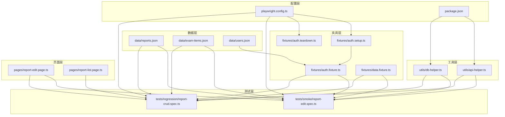
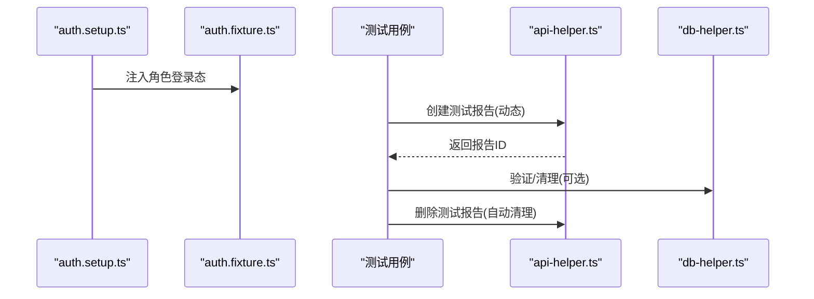
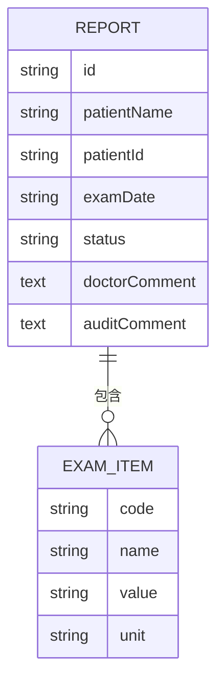
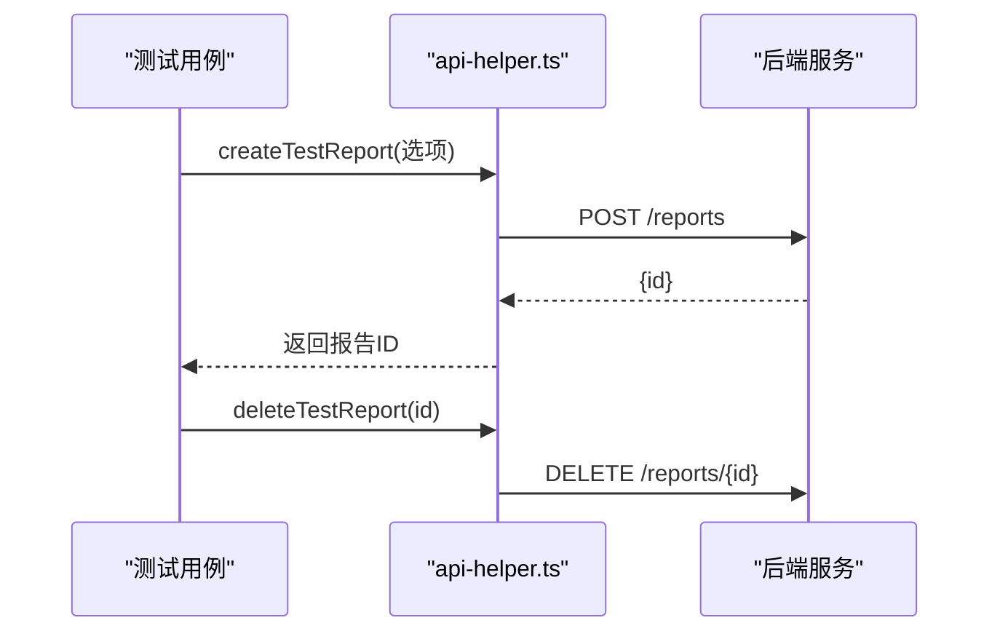
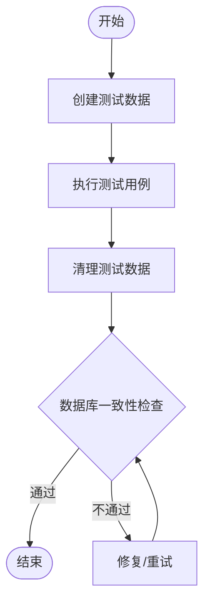
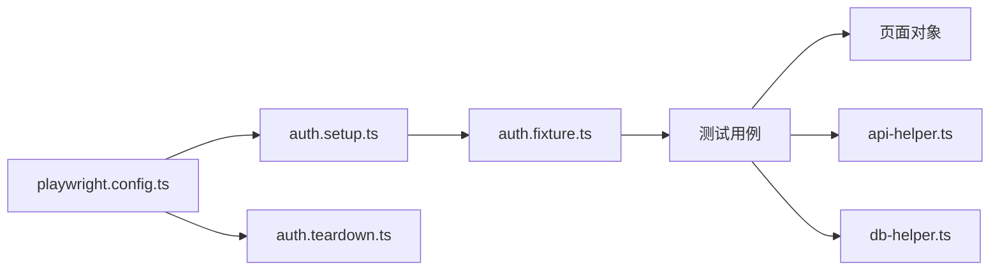

# 测试数据管理

<cite>
**本文引用的文件**
- [reports.json](file://e2e-tests/data/reports.json)
- [exam-items.json](file://e2e-tests/data/exam-items.json)
- [users.json](file://e2e-tests/data/users.json)
- [data.fixture.ts](file://e2e-tests/fixtures/data.fixture.ts)
- [auth.fixture.ts](file://e2e-tests/fixtures/auth.fixture.ts)
- [auth.setup.ts](file://e2e-tests/fixtures/auth.setup.ts)
- [auth.teardown.ts](file://e2e-tests/fixtures/auth.teardown.ts)
- [api-helper.ts](file://e2e-tests/utils/api-helper.ts)
- [db-helper.ts](file://e2e-tests/utils/db-helper.ts)
- [report-edit.page.ts](file://e2e-tests/pages/report-edit.page.ts)
- [report-list.page.ts](file://e2e-tests/pages/report-list.page.ts)
- [report-crud.spec.ts](file://e2e-tests/tests/regression/report-crud.spec.ts)
- [report-edit.spec.ts](file://e2e-tests/tests/smoke/report-edit.spec.ts)
- [playwright.config.ts](file://e2e-tests/playwright.config.ts)
- [package.json](file://e2e-tests/package.json)
</cite>

## 目录
1. [简介](#简介)
2. [项目结构](#项目结构)
3. [核心组件](#核心组件)
4. [架构总览](#架构总览)
5. [详细组件分析](#详细组件分析)
6. [依赖关系分析](#依赖关系分析)
7. [性能考量](#性能考量)
8. [故障排查指南](#故障排查指南)
9. [结论](#结论)
10. [附录](#附录)

## 简介
本指南面向测试工程师，系统性阐述本仓库中“测试数据管理”的设计与实践，覆盖以下主题：
- 测试数据结构与数据模型：报告数据模型、检查项目数据、用户数据模型
- 数据生成策略：基于 API 的动态生成与基于 JSON 的静态模板
- 数据清理机制：测试后自动清理与数据库级清理
- 环境隔离方案：登录态隔离与项目化运行配置
- JSON 数据文件格式规范与验证规则
- 维护流程、版本管理与批量操作
- 数据迁移策略、备份恢复机制与性能优化建议
- 标准流程与最佳实践

## 项目结构
测试数据管理涉及以下关键目录与文件：
- data：存放静态 JSON 数据模板（报告、检查项目、用户）
- fixtures：Playwright 测试夹具，负责登录态与测试数据生命周期管理
- utils：API 与数据库辅助工具，负责动态数据生成与清理
- pages：页面对象，封装 UI 交互与数据绑定
- tests：冒烟与回归测试用例，展示数据使用方式
- playwright.config.ts：项目化配置，定义登录态准备与清理流程

图表来源
- [playwright.config.ts:1-68](file://e2e-tests/playwright.config.ts#L1-L68)
- [auth.fixture.ts:1-40](file://e2e-tests/fixtures/auth.fixture.ts#L1-L40)
- [data.fixture.ts:1-57](file://e2e-tests/fixtures/data.fixture.ts#L1-L57)
- [api-helper.ts:1-172](file://e2e-tests/utils/api-helper.ts#L1-L172)
- [db-helper.ts:1-91](file://e2e-tests/utils/db-helper.ts#L1-L91)
- [report-edit.page.ts:1-94](file://e2e-tests/pages/report-edit.page.ts#L1-L94)
- [report-list.page.ts:1-130](file://e2e-tests/pages/report-list.page.ts#L1-L130)
- [report-edit.spec.ts:1-61](file://e2e-tests/tests/smoke/report-edit.spec.ts#L1-L61)
- [report-crud.spec.ts:1-122](file://e2e-tests/tests/regression/report-crud.spec.ts#L1-L122)
- [reports.json:1-78](file://e2e-tests/data/reports.json#L1-L78)
- [exam-items.json:1-93](file://e2e-tests/data/exam-items.json#L1-L93)
- [users.json:1-30](file://e2e-tests/data/users.json#L1-L30)

章节来源
- [playwright.config.ts:1-68](file://e2e-tests/playwright.config.ts#L1-L68)
- [package.json:1-27](file://e2e-tests/package.json#L1-L27)

## 核心组件
- 数据模型与模板
  - 报告数据模型：包含患者信息、检查项目数组、状态、评论等字段
  - 检查项目数据：定义检查项的编码、名称、单位、正常范围、输入类型、是否必填等
  - 用户数据模型：角色维度的默认账号与工作线程账号集合
- 动态数据生成与清理
  - 通过 API 辅助工具创建/删除/更新报告，支持按前缀批量清理
  - 通过数据库辅助工具进行数据库级清理与状态验证
- 登录态隔离与环境准备
  - 通过项目化配置与 setup/teardown 流程，确保不同角色的独立登录态
- 页面对象与测试用例
  - 页面对象封装 UI 交互；测试用例展示数据使用与断言

章节来源
- [reports.json:1-78](file://e2e-tests/data/reports.json#L1-L78)
- [exam-items.json:1-93](file://e2e-tests/data/exam-items.json#L1-L93)
- [users.json:1-30](file://e2e-tests/data/users.json#L1-L30)
- [api-helper.ts:1-172](file://e2e-tests/utils/api-helper.ts#L1-L172)
- [db-helper.ts:1-91](file://e2e-tests/utils/db-helper.ts#L1-L91)
- [auth.fixture.ts:1-40](file://e2e-tests/fixtures/auth.fixture.ts#L1-L40)
- [auth.setup.ts:1-30](file://e2e-tests/fixtures/auth.setup.ts#L1-L30)
- [auth.teardown.ts:1-18](file://e2e-tests/fixtures/auth.teardown.ts#L1-L18)
- [report-edit.page.ts:1-94](file://e2e-tests/pages/report-edit.page.ts#L1-L94)
- [report-list.page.ts:1-130](file://e2e-tests/pages/report-list.page.ts#L1-L130)
- [report-edit.spec.ts:1-61](file://e2e-tests/tests/smoke/report-edit.spec.ts#L1-L61)
- [report-crud.spec.ts:1-122](file://e2e-tests/tests/regression/report-crud.spec.ts#L1-L122)

## 架构总览
测试数据管理采用“模板驱动 + 动态生成 + 生命周期管理”的架构：
- 模板层：JSON 文件提供标准化的数据结构与示例值
- 夹具层：Playwright 夹具负责登录态注入与测试数据生命周期（创建/清理）
- 工具层：API 与数据库工具负责与后端服务与数据库交互
- 页面层：页面对象封装 UI 行为，测试用例组织业务场景
- 配置层：项目化配置定义执行计划、报告输出与清理流程

图表来源
- [auth.setup.ts:1-30](file://e2e-tests/fixtures/auth.setup.ts#L1-L30)
- [auth.fixture.ts:1-40](file://e2e-tests/fixtures/auth.fixture.ts#L1-L40)
- [report-edit.spec.ts:1-61](file://e2e-tests/tests/smoke/report-edit.spec.ts#L1-L61)
- [api-helper.ts:1-172](file://e2e-tests/utils/api-helper.ts#L1-L172)
- [db-helper.ts:1-91](file://e2e-tests/utils/db-helper.ts#L1-L91)

## 详细组件分析

### 报告数据模型
- 字段构成
  - 患者信息：姓名、ID、检查日期
  - 状态：草稿、待审核、已审核、已发布
  - 检查项目数组：每项包含编码、名称、数值、单位
  - 评论字段：医生意见、审核意见（可选）
- 数据来源
  - 测试用例直接通过 API 创建报告
  - 静态模板用于示例与参考

图表来源
- [api-helper.ts:22-38](file://e2e-tests/utils/api-helper.ts#L22-L38)
- [report-edit.spec.ts:10-13](file://e2e-tests/tests/smoke/report-edit.spec.ts#L10-L13)

章节来源
- [api-helper.ts:1-172](file://e2e-tests/utils/api-helper.ts#L1-L172)
- [report-edit.spec.ts:1-61](file://e2e-tests/tests/smoke/report-edit.spec.ts#L1-L61)

### 检查项目数据模型
- 字段构成
  - 编码、名称、单位、正常范围
  - 输入类型：文本/数字/多行文本
  - 是否必填
  - 正常/异常示例值
- 用途
  - 作为 UI 输入约束与断言依据
  - 为测试用例提供标准输入值

章节来源
- [exam-items.json:1-93](file://e2e-tests/data/exam-items.json#L1-L93)
- [report-edit.page.ts:39-61](file://e2e-tests/pages/report-edit.page.ts#L39-L61)

### 用户数据模型
- 角色维度
  - 医生、审核员、管理员
  - 每个角色包含默认账号与多个工作线程账号
- 登录态隔离
  - 通过不同 storageState 文件实现角色隔离
  - setup 脚本自动生成各角色登录态文件

章节来源
- [users.json:1-30](file://e2e-tests/data/users.json#L1-L30)
- [auth.fixture.ts:1-40](file://e2e-tests/fixtures/auth.fixture.ts#L1-L40)
- [auth.setup.ts:1-30](file://e2e-tests/fixtures/auth.setup.ts#L1-L30)

### 数据生成策略
- 动态生成
  - 通过 API 辅助工具创建报告，支持随机/带后缀的患者名、默认日期、状态与检查项
  - 支持在测试前后自动清理，避免数据污染
- 静态模板
  - JSON 模板用于示例与参考，便于快速理解字段结构
- 状态推进
  - 通过 API 更新报告状态，模拟真实业务流转

图表来源
- [api-helper.ts:83-121](file://e2e-tests/utils/api-helper.ts#L83-L121)
- [report-crud.spec.ts:33-43](file://e2e-tests/tests/regression/report-crud.spec.ts#L33-L43)

章节来源
- [api-helper.ts:1-172](file://e2e-tests/utils/api-helper.ts#L1-L172)
- [report-crud.spec.ts:1-122](file://e2e-tests/tests/regression/report-crud.spec.ts#L1-L122)

### 数据清理机制
- 测试内清理
  - beforeEach/beforeAll 创建数据，afterEach/afterAll 删除
  - 失败不阻断测试，保证执行稳定性
- 批量清理
  - 支持按患者名前缀批量清理
  - 数据库级清理，确保环境干净
- 登录态清理
  - teardown 阶段删除 .auth 目录下所有 storageState 文件

图表来源
- [data.fixture.ts:14-53](file://e2e-tests/fixtures/data.fixture.ts#L14-L53)
- [auth.teardown.ts:7-17](file://e2e-tests/fixtures/auth.teardown.ts#L7-L17)
- [db-helper.ts:33-43](file://e2e-tests/utils/db-helper.ts#L33-L43)

章节来源
- [data.fixture.ts:1-57](file://e2e-tests/fixtures/data.fixture.ts#L1-L57)
- [auth.teardown.ts:1-18](file://e2e-tests/fixtures/auth.teardown.ts#L1-L18)
- [db-helper.ts:1-91](file://e2e-tests/utils/db-helper.ts#L1-L91)

### 环境隔离方案
- 角色隔离
  - 不同角色使用独立 storageState 文件，互不干扰
- 项目化执行
  - 通过 playwright.config.ts 的 projects 定义不同执行环境（冒烟/回归、Chromium/Firefox）
- 并发安全
  - worker 数量与重试策略在 CI/本地环境下差异化配置

章节来源
- [auth.fixture.ts:1-40](file://e2e-tests/fixtures/auth.fixture.ts#L1-L40)
- [playwright.config.ts:31-66](file://e2e-tests/playwright.config.ts#L31-L66)

### JSON 数据文件格式规范与验证规则
- reports.json
  - 分类：冒烟/回归
  - 每个报告包含：患者姓名、ID、检查日期、状态、检查项目数组、可选评论
  - 检查项目数组：每项包含编码、名称、值、单位
- exam-items.json
  - 每项包含：编码、名称、单位、正常范围、输入类型、是否必填、正常/异常示例值
- users.json
  - 每个角色包含：default 账号与 workers 列表（含 workerIndex）

章节来源
- [reports.json:1-78](file://e2e-tests/data/reports.json#L1-L78)
- [exam-items.json:1-93](file://e2e-tests/data/exam-items.json#L1-L93)
- [users.json:1-30](file://e2e-tests/data/users.json#L1-L30)

### 维护流程、版本管理与批量操作
- 维护流程
  - 变更 JSON 模板后，同步更新测试用例中的期望值
  - 新增检查项目时，同时更新 exam-items.json 与页面对象的输入逻辑
- 版本管理
  - 使用 Git 管理模板与脚本变更，配合 CI 进行回归验证
- 批量操作
  - 通过 API 批量清理接口按前缀清理
  - 通过数据库清理函数按前缀删除

章节来源
- [api-helper.ts:155-161](file://e2e-tests/utils/api-helper.ts#L155-L161)
- [db-helper.ts:48-54](file://e2e-tests/utils/db-helper.ts#L48-L54)

### 数据迁移策略、备份恢复机制
- 迁移策略
  - 通过 API 辅助工具批量创建历史数据，或在数据库侧导入/导出
- 备份恢复
  - 数据库层面定期备份；测试前重置到初始状态
  - 使用批量清理函数快速恢复干净环境

章节来源
- [db-helper.ts:33-43](file://e2e-tests/utils/db-helper.ts#L33-L43)

## 依赖关系分析
- 组件耦合
  - 测试用例依赖页面对象与 API/数据库工具
  - 夹具负责登录态注入，降低重复登录成本
- 外部依赖
  - Playwright 测试框架、后端 API、MySQL 数据库
- 循环依赖
  - 未发现循环依赖；模块职责清晰

图表来源
- [report-edit.spec.ts:1-61](file://e2e-tests/tests/smoke/report-edit.spec.ts#L1-L61)
- [report-crud.spec.ts:1-122](file://e2e-tests/tests/regression/report-crud.spec.ts#L1-L122)
- [report-edit.page.ts:1-94](file://e2e-tests/pages/report-edit.page.ts#L1-L94)
- [api-helper.ts:1-172](file://e2e-tests/utils/api-helper.ts#L1-L172)
- [db-helper.ts:1-91](file://e2e-tests/utils/db-helper.ts#L1-L91)
- [auth.fixture.ts:1-40](file://e2e-tests/fixtures/auth.fixture.ts#L1-L40)
- [auth.setup.ts:1-30](file://e2e-tests/fixtures/auth.setup.ts#L1-L30)
- [auth.teardown.ts:1-18](file://e2e-tests/fixtures/auth.teardown.ts#L1-L18)
- [playwright.config.ts:1-68](file://e2e-tests/playwright.config.ts#L1-L68)

章节来源
- [playwright.config.ts:1-68](file://e2e-tests/playwright.config.ts#L1-L68)

## 性能考量
- 并发执行
  - 合理设置 workers 数量，避免数据库连接池过载
- 连接池管理
  - 数据库连接池限制与队列参数需根据并发需求调整
- 接口幂等
  - 清理与创建接口应具备幂等性，避免重复数据
- 缓存与重试
  - 在 CI 环境中启用重试，提升稳定性

[本节为通用指导，无需特定文件引用]

## 故障排查指南
- 登录态问题
  - 确认 .auth 目录存在且包含对应角色的 storageState 文件
  - 如需重建登录态，运行 setup 测试并检查登录页元素定位
- 数据污染
  - 检查测试用例是否正确调用清理函数
  - 使用数据库清理函数按前缀清理残留数据
- 状态不一致
  - 通过数据库查询验证报告状态
  - 使用 API 获取报告详情核对字段值

章节来源
- [auth.setup.ts:1-30](file://e2e-tests/fixtures/auth.setup.ts#L1-L30)
- [auth.teardown.ts:1-18](file://e2e-tests/fixtures/auth.teardown.ts#L1-L18)
- [db-helper.ts:59-67](file://e2e-tests/utils/db-helper.ts#L59-L67)
- [api-helper.ts:147-151](file://e2e-tests/utils/api-helper.ts#L147-L151)

## 结论
本仓库通过“模板 + 动态生成 + 生命周期管理”的测试数据体系，实现了高可维护性与强隔离性的 E2E 测试环境。结合项目化配置与自动化清理机制，能够在不同环境中稳定复现业务场景，并为后续扩展与维护提供清晰路径。

[本节为总结性内容，无需特定文件引用]

## 附录

### 最佳实践清单
- 使用夹具统一管理登录态，避免重复登录
- 测试用例中优先使用 API 动态生成数据，必要时使用 JSON 模板作为参考
- 明确清理边界，确保每个测试用例前后环境一致
- 对关键状态变更进行数据库与接口双重验证
- 在 CI 环境中合理配置重试与并发，平衡速度与稳定性

[本节为通用指导，无需特定文件引用]