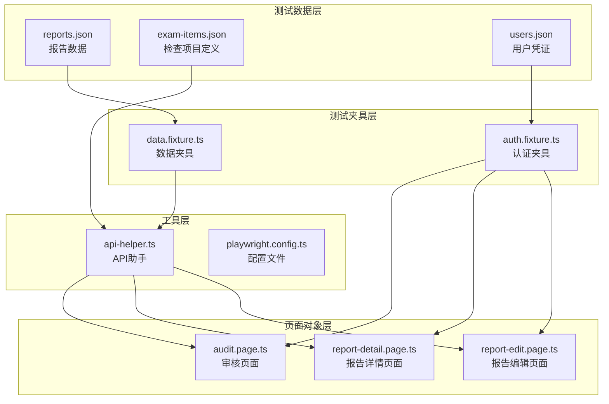
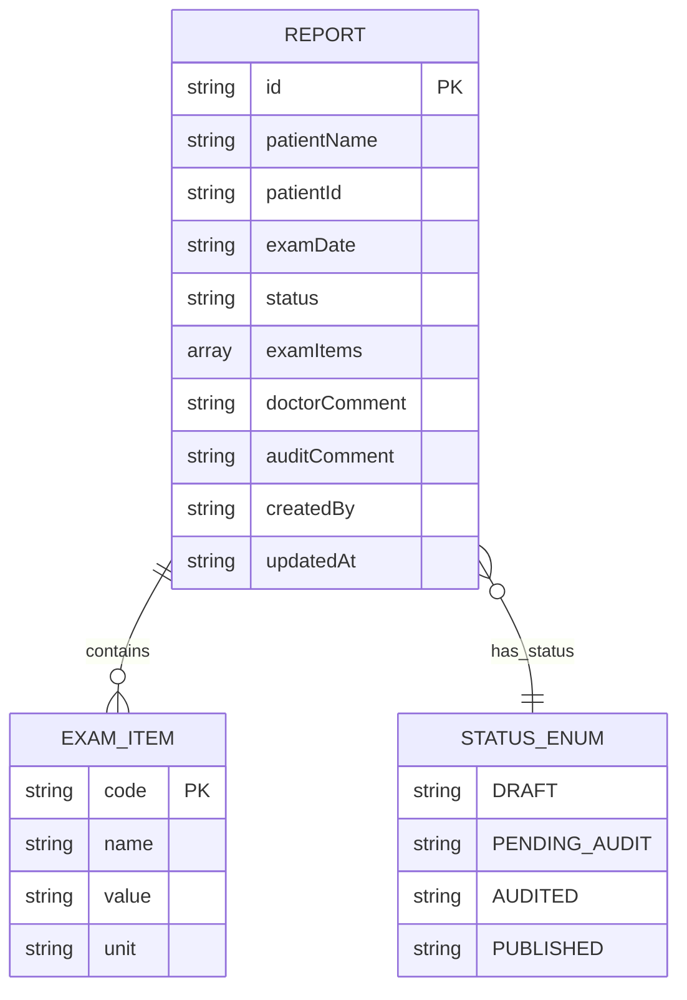
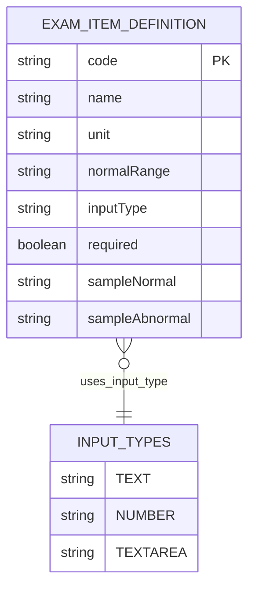
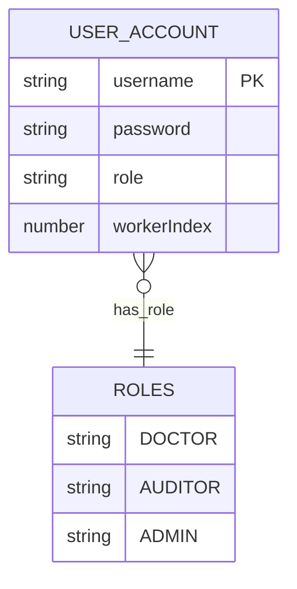
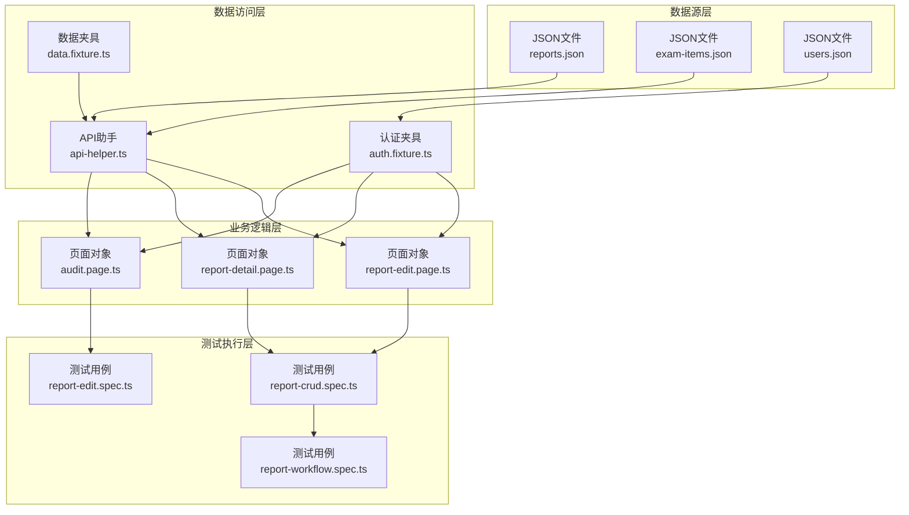
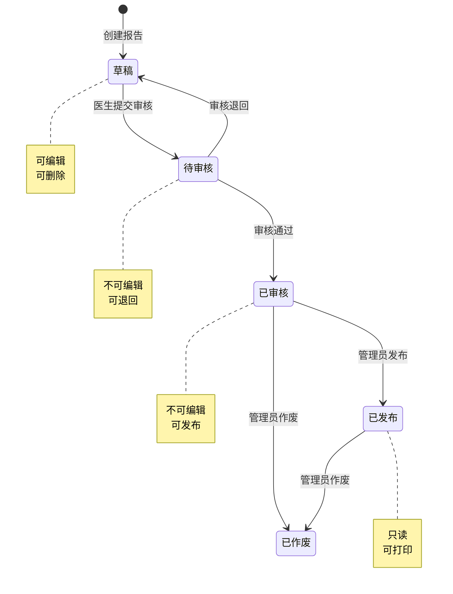
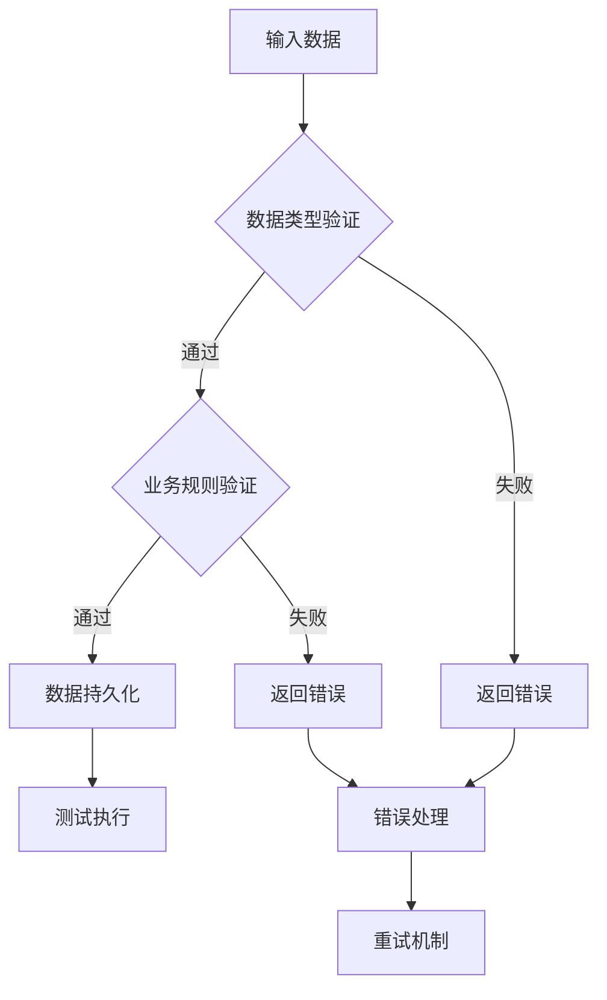
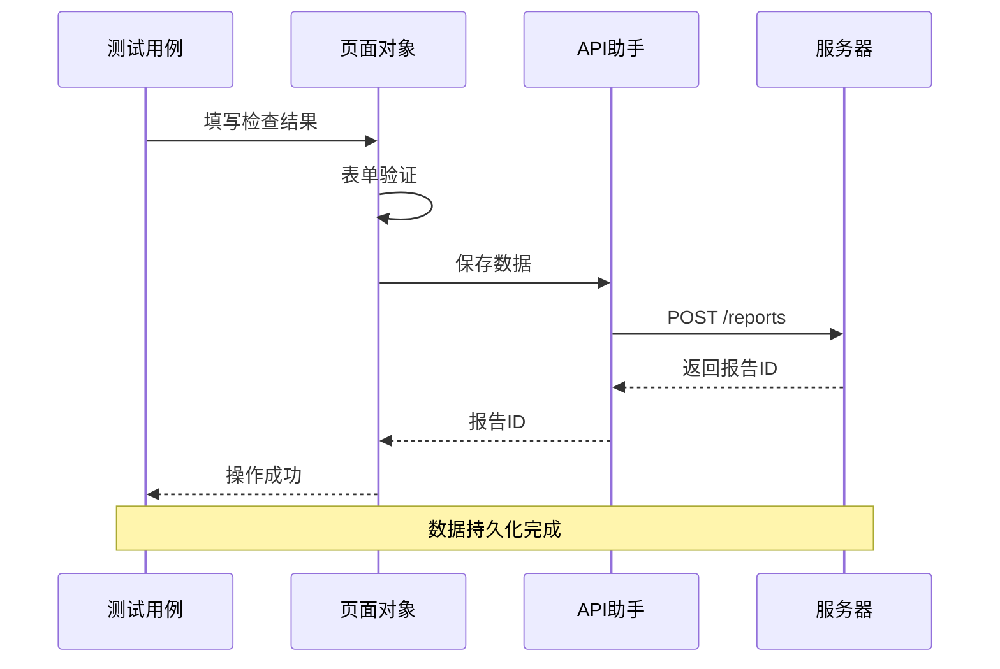
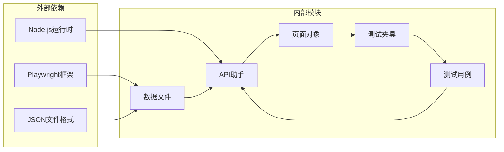

# 测试数据结构设计

<cite>
**本文档引用的文件**
- [reports.json](file://e2e-tests/data/reports.json)
- [exam-items.json](file://e2e-tests/data/exam-items.json)
- [users.json](file://e2e-tests/data/users.json)
- [api-helper.ts](file://e2e-tests/utils/api-helper.ts)
- [data.fixture.ts](file://e2e-tests/fixtures/data.fixture.ts)
- [auth.fixture.ts](file://e2e-tests/fixtures/auth.fixture.ts)
- [report-edit.page.ts](file://e2e-tests/pages/report-edit.page.ts)
- [report-detail.page.ts](file://e2e-tests/pages/report-detail.page.ts)
- [audit.page.ts](file://e2e-tests/pages/audit.page.ts)
- [report-crud.spec.ts](file://e2e-tests/tests/regression/report-crud.spec.ts)
- [report-edit.spec.ts](file://e2e-tests/tests/smoke/report-edit.spec.ts)
- [report-workflow.spec.ts](file://e2e-tests/tests/regression/report-workflow.spec.ts)
- [playwright.config.ts](file://e2e-tests/playwright.config.ts)
</cite>

## 目录
1. [简介](#简介)
2. [项目结构](#项目结构)
3. [核心数据模型](#核心数据模型)
4. [架构概览](#架构概览)
5. [详细组件分析](#详细组件分析)
6. [依赖关系分析](#依赖关系分析)
7. [性能考虑](#性能考虑)
8. [故障排除指南](#故障排除指南)
9. [结论](#结论)
10. [附录](#附录)

## 简介

本文件为测试数据结构设计的详细文档，专注于报告数据模型、检查项目数据结构和用户数据模型的设计与实现。该测试框架基于 Playwright 构建，采用 JSON 数据文件驱动测试，确保测试环境的可重复性和一致性。

**更新** 本次更新反映了应用变更：测试数据结构已重新设计，支持更复杂的数据模型和关系，包括增强的状态管理、改进的API交互和更完善的页面对象设计。

## 项目结构

测试数据结构主要分布在以下目录中：



**图表来源**
- [reports.json:1-78](file://e2e-tests/data/reports.json#L1-L78)
- [exam-items.json:1-93](file://e2e-tests/data/exam-items.json#L1-L93)
- [users.json:1-30](file://e2e-tests/data/users.json#L1-L30)
- [data.fixture.ts:1-32](file://e2e-tests/fixtures/data.fixture.ts#L1-L32)
- [auth.fixture.ts:1-52](file://e2e-tests/fixtures/auth.fixture.ts#L1-L52)

**章节来源**
- [playwright.config.ts:1-54](file://e2e-tests/playwright.config.ts#L1-L54)

## 核心数据模型

### 报告数据模型

报告数据模型是测试系统的核心实体，包含完整的检查报告信息：



**图表来源**
- [api-helper.ts:22-38](file://e2e-tests/utils/api-helper.ts#L22-L38)
- [api-helper.ts:8-20](file://e2e-tests/utils/api-helper.ts#L8-L20)

#### 报告核心字段定义

| 字段名 | 类型 | 必填 | 描述 | 示例值 |
|--------|------|------|------|--------|
| id | string | 否 | 报告唯一标识符 | "REPORT001" |
| patientName | string | 是 | 患者姓名 | "张三" |
| patientId | string | 否 | 患者ID | "PATIENT001" |
| examDate | string | 否 | 检查日期 | "2025-01-15" |
| status | string | 是 | 报告状态 | "draft" |
| examItems | array | 是 | 检查项目数组 | [{...}] |
| doctorComment | string | 否 | 医生评论 | "各项指标正常" |
| auditComment | string | 否 | 审核评论 | "审核通过" |
| createdBy | string | 否 | 创建者 | "doctor01" |
| updatedAt | string | 否 | 更新时间戳 | "2025-01-15T10:30:00Z" |

#### 检查项目数据结构

每个检查项目包含完整的元数据信息：

| 字段名 | 类型 | 必填 | 描述 | 示例值 |
|--------|------|------|------|--------|
| code | string | 是 | 项目编码 | "blood_pressure" |
| name | string | 是 | 项目名称 | "血压" |
| value | string | 是 | 检查结果值 | "120/80" |
| unit | string | 是 | 单位 | "mmHg" |

**章节来源**
- [api-helper.ts:22-38](file://e2e-tests/utils/api-helper.ts#L22-L38)
- [api-helper.ts:8-20](file://e2e-tests/utils/api-helper.ts#L8-L20)

### 检查项目数据模型

检查项目定义文件提供了完整的检查项目元数据：



**图表来源**
- [exam-items.json:1-93](file://e2e-tests/data/exam-items.json#L1-L93)

#### 检查项目字段定义

| 字段名 | 类型 | 必填 | 描述 | 示例值 |
|--------|------|------|------|--------|
| code | string | 是 | 项目编码 | "blood_pressure" |
| name | string | 是 | 项目名称 | "血压" |
| unit | string | 是 | 单位 | "mmHg" |
| normalRange | string | 是 | 正常参考范围 | "90/60-140/90" |
| inputType | string | 是 | 输入类型 | "text" |
| required | boolean | 是 | 是否必填 | true |
| sampleNormal | string | 是 | 正常样本值 | "120/80" |
| sampleAbnormal | string | 是 | 异常样本值 | "180/120" |

**章节来源**
- [exam-items.json:1-93](file://e2e-tests/data/exam-items.json#L1-L93)

### 用户数据模型

用户凭证模型支持多角色认证：



**图表来源**
- [users.json:1-30](file://e2e-tests/data/users.json#L1-L30)

#### 用户字段定义

| 字段名 | 类型 | 必填 | 描述 | 示例值 |
|--------|------|------|------|--------|
| username | string | 是 | 用户名 | "doctor01" |
| password | string | 是 | 密码 | "Test@1234" |
| role | string | 否 | 角色类型 | "doctor" |
| workerIndex | number | 否 | 工作者索引 | 0 |

**章节来源**
- [users.json:1-30](file://e2e-tests/data/users.json#L1-L30)

## 架构概览

测试数据结构采用分层架构设计，确保数据的一致性和可维护性：



**图表来源**
- [api-helper.ts:1-206](file://e2e-tests/utils/api-helper.ts#L1-L206)
- [data.fixture.ts:1-32](file://e2e-tests/fixtures/data.fixture.ts#L1-L32)
- [auth.fixture.ts:1-52](file://e2e-tests/fixtures/auth.fixture.ts#L1-L52)

## 详细组件分析

### 报告状态管理

报告状态流转是测试系统的核心业务逻辑：



**图表来源**
- [report-workflow.spec.ts:1-138](file://e2e-tests/tests/regression/report-workflow.spec.ts#L1-L138)

#### 状态转换规则

| 当前状态 | 允许操作 | 目标状态 | 业务规则 |
|----------|----------|----------|----------|
| 草稿 | 提交审核 | 待审核 | 必须填写检查结果 |
| 待审核 | 通过审核 | 已审核 | 需要审核意见 |
| 待审核 | 退回 | 草稿 | 需要退回原因 |
| 已审核 | 发布 | 已发布 | 管理员权限 |
| 已审核 | 作废 | 已作废 | 管理员权限 |

**章节来源**
- [report-workflow.spec.ts:1-138](file://e2e-tests/tests/regression/report-workflow.spec.ts#L1-L138)

### 数据验证规则

系统实现了多层次的数据验证机制：



**图表来源**
- [api-helper.ts:104-155](file://e2e-tests/utils/api-helper.ts#L104-L155)

#### 验证规则定义

1. **必需字段验证**
   - 报告：patientName, status, examItems
   - 检查项目：code, name, unit
   - 用户：username, password

2. **格式验证**
   - 日期格式：YYYY-MM-DD
   - 数字格式：正则表达式匹配
   - 状态枚举：预定义集合

3. **业务规则验证**
   - 检查项目值必须在正常范围内
   - 必填项目不能为空
   - 状态转换必须符合业务流程

**章节来源**
- [api-helper.ts:8-20](file://e2e-tests/utils/api-helper.ts#L8-L20)
- [api-helper.ts:104-155](file://e2e-tests/utils/api-helper.ts#L104-L155)

### 页面交互数据流

页面对象层提供了标准化的数据交互接口：



**图表来源**
- [report-edit.page.ts:44-75](file://e2e-tests/pages/report-edit.page.ts#L44-L75)
- [api-helper.ts:104-155](file://e2e-tests/utils/api-helper.ts#L104-L155)

**章节来源**
- [report-edit.page.ts:1-99](file://e2e-tests/pages/report-edit.page.ts#L1-L99)
- [report-detail.page.ts:1-111](file://e2e-tests/pages/report-detail.page.ts#L1-L111)
- [audit.page.ts:1-72](file://e2e-tests/pages/audit.page.ts#L1-L72)

## 依赖关系分析

测试数据结构之间存在复杂的依赖关系：



**图表来源**
- [playwright.config.ts:1-54](file://e2e-tests/playwright.config.ts#L1-L54)
- [api-helper.ts:1-206](file://e2e-tests/utils/api-helper.ts#L1-L206)

### 关键依赖关系

1. **数据文件依赖**
   - reports.json 依赖 exam-items.json 的项目定义
   - users.json 依赖认证服务的用户管理

2. **模块间依赖**
   - 页面对象依赖 API 助手进行数据交互
   - 测试夹具依赖数据文件和页面对象
   - 测试用例依赖测试夹具和页面对象

3. **运行时依赖**
   - Playwright 运行时环境
   - Node.js 模块系统
   - JSON 解析和序列化

**章节来源**
- [playwright.config.ts:1-54](file://e2e-tests/playwright.config.ts#L1-L54)

## 性能考虑

测试数据结构设计考虑了性能优化：

### 数据加载优化
- JSON 文件缓存机制
- 按需加载策略
- 数据压缩存储

### 并发处理
- 多浏览器并行执行
- 测试数据隔离
- 并发安全的数据访问

### 内存管理
- 及时释放测试资源
- 数据清理机制
- 内存泄漏防护

## 故障排除指南

### 常见问题及解决方案

1. **数据验证失败**
   - 检查必需字段是否完整
   - 验证数据格式是否正确
   - 确认业务规则是否满足

2. **状态转换异常**
   - 检查当前报告状态
   - 验证操作权限
   - 确认前置条件满足

3. **认证失败**
   - 验证用户名密码
   - 检查角色权限
   - 确认认证令牌有效

**章节来源**
- [api-helper.ts:160-206](file://e2e-tests/utils/api-helper.ts#L160-L206)

## 结论

测试数据结构设计通过清晰的分层架构、严格的验证机制和灵活的扩展能力，为自动化测试提供了可靠的数据基础。该设计确保了测试环境的一致性、数据的完整性和系统的可维护性。

## 附录

### 版本兼容性考虑

1. **向前兼容**
   - 新增非必需字段不影响现有功能
   - 扩展状态枚举不影响现有状态
   - 增加新的检查项目不影响现有流程

2. **向后兼容**
   - 移除字段时提供默认值
   - 修改字段类型时保持兼容性
   - 状态迁移时提供回退机制

3. **数据迁移**
   - 提供数据格式转换工具
   - 支持批量数据升级
   - 记录迁移历史

### 扩展指南

1. **新增检查项目**
   ```json
   {
     "code": "new_exam_item",
     "name": "新检查项目",
     "unit": "单位",
     "normalRange": "正常范围",
     "inputType": "number",
     "required": true,
     "sampleNormal": "示例值",
     "sampleAbnormal": "异常示例"
   }
   ```

2. **新增用户角色**
   ```json
   {
     "new_role": {
       "default": { "username": "new_user", "password": "password" },
       "workers": [
         { "username": "worker1", "password": "password", "workerIndex": 0 }
       ]
     }
   }
   ```

3. **新增测试场景**
   - 在 reports.json 中添加测试数据
   - 在相应的测试文件中编写用例
   - 更新页面对象以支持新功能

**章节来源**
- [reports.json:1-78](file://e2e-tests/data/reports.json#L1-L78)
- [exam-items.json:1-93](file://e2e-tests/data/exam-items.json#L1-L93)
- [users.json:1-30](file://e2e-tests/data/users.json#L1-L30)