# Playwright配置详解

<cite>
**本文档引用的文件**
- [playwright.config.ts](file://e2e-tests/playwright.config.ts)
- [.gitlab-ci.yml](file://e2e-tests/.gitlab-ci.yml)
- [Jenkinsfile](file://e2e-tests/Jenkinsfile)
- [package.json](file://e2e-tests/package.json)
- [auth.setup.ts](file://e2e-tests/fixtures/auth.setup.ts)
- [auth.fixture.ts](file://e2e-tests/fixtures/auth.fixture.ts)
- [data.fixture.ts](file://e2e-tests/fixtures/data.fixture.ts)
- [login.spec.ts](file://e2e-tests/tests/smoke/login.spec.ts)
- [report-crud.spec.ts](file://e2e-tests/tests/regression/report-crud.spec.ts)
- [api-helper.ts](file://e2e-tests/utils/api-helper.ts)
- [script-generator.ts](file://e2e-tests/ai/script-generator.ts)
- [report-list.page.ts](file://e2e-tests/pages/report-list.page.ts)
- [tsconfig.json](file://e2e-tests/tsconfig.json)
</cite>

## 更新摘要
**所做更改**
- 更新了多浏览器环境配置，支持Chromium和Firefox并行测试
- 新增Allure报告集成配置和增强的报告系统
- 重构了测试项目结构，分离冒烟测试和回归测试
- 更新了CI/CD集成配置，支持多项目并行执行
- 完善了认证系统架构，支持多种用户角色
- 增强了AI辅助测试功能，支持智能脚本生成

## 目录
1. [简介](#简介)
2. [项目结构](#项目结构)
3. [核心配置组件](#核心配置组件)
4. [架构概览](#架构概览)
5. [详细组件分析](#详细组件分析)
6. [依赖关系分析](#依赖关系分析)
7. [性能考虑](#性能考虑)
8. [故障排除指南](#故障排除指南)
9. [结论](#结论)
10. [附录](#附录)

## 简介

本项目是一个基于Playwright的端到端测试框架，专门用于测试医院体检报告管理系统。该框架集成了AI辅助测试生成、多浏览器支持、CI/CD自动化集成和Allure报告系统等功能，为团队提供了完整的自动化测试解决方案。

项目采用现代化的测试架构，包含冒烟测试、回归测试、AI辅助测试等多个层次，支持多种执行环境和部署场景。经过重构后，配置更加灵活，支持多浏览器并行测试和增强的报告系统。

## 项目结构

该项目采用模块化的组织方式，主要目录结构如下：

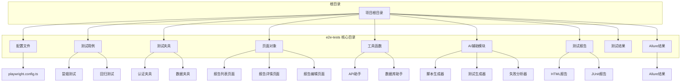

**图表来源**
- [playwright.config.ts:1-54](file://e2e-tests/playwright.config.ts#L1-L54)
- [package.json:1-35](file://e2e-tests/package.json#L1-L35)

**章节来源**
- [playwright.config.ts:1-54](file://e2e-tests/playwright.config.ts#L1-L54)
- [package.json:1-35](file://e2e-tests/package.json#L1-L35)

## 核心配置组件

### 基础配置选项

Playwright配置文件包含了完整的测试执行配置，以下是各个关键配置项的详细说明：

#### 测试目录和执行控制

- **testDir**: 指定测试文件的根目录为`./tests`
- **timeout**: 全局测试超时时间为30秒
- **expect.timeout**: 断言超时时间为5秒
- **fullyParallel**: 禁用完全并行执行以避免fixture冲突
- **forbidOnly**: 在CI环境中禁止使用`test.only`标记

#### 并发执行策略

- **retries**: CI环境中重试2次，本地环境不重试
- **workers**: CI环境中使用4个工作进程，本地环境使用1个工作进程

#### 报告器配置

配置根据运行环境动态选择不同的报告格式：

**CI环境配置**：
- HTML报告：`open: 'never'`，输出到`playwright-report`目录
- JUnit报告：输出到`results/junit-report.xml`
- Allure报告：使用`allure-playwright`插件

**本地环境配置**：
- HTML报告：`open: 'on-failure'`，便于快速查看失败结果

#### 测试使用配置

- **baseURL**: 从环境变量读取，默认为`http://localhost:8080`
- **screenshot**: 失败时自动截图
- **video**: 失败时录制视频
- **trace**: 失败时生成调试跟踪
- **navigationTimeout**: 页面导航超时时间为30秒
- **actionTimeout**: 操作超时时间为15秒

**章节来源**
- [playwright.config.ts:6-31](file://e2e-tests/playwright.config.ts#L6-L31)

### 项目配置详解

项目配置采用了分层的测试项目结构，支持不同的测试场景：

#### 冒烟测试项目

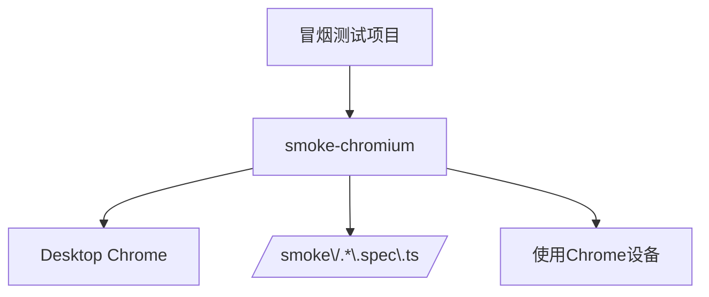

**图表来源**
- [playwright.config.ts:33-39](file://e2e-tests/playwright.config.ts#L33-L39)

#### 回归测试项目

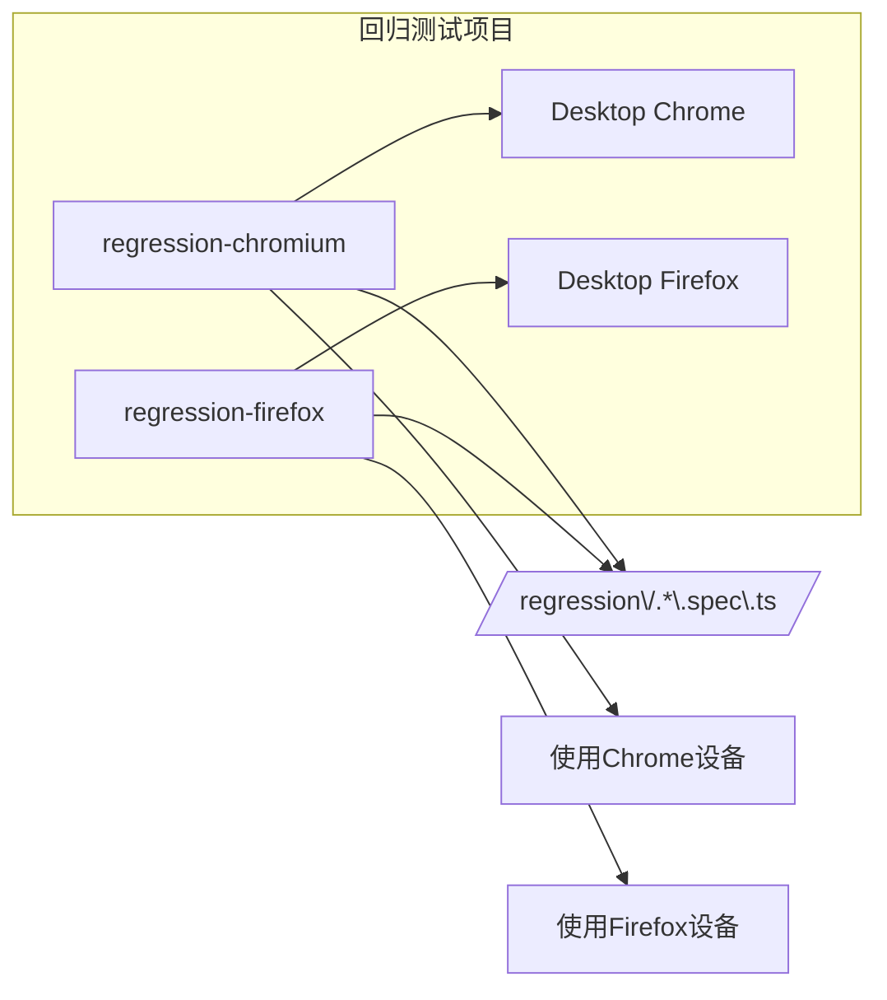

**图表来源**
- [playwright.config.ts:41-52](file://e2e-tests/playwright.config.ts#L41-L52)

**章节来源**
- [playwright.config.ts:33-52](file://e2e-tests/playwright.config.ts#L33-L52)

## 架构概览

### 整体架构设计

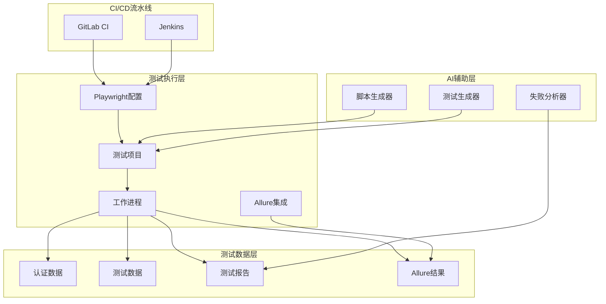

**图表来源**
- [.gitlab-ci.yml:1-67](file://e2e-tests/.gitlab-ci.yml#L1-L67)
- [Jenkinsfile:1-59](file://e2e-tests/Jenkinsfile#L1-L59)
- [playwright.config.ts:16-22](file://e2e-tests/playwright.config.ts#L16-L22)

### 环境配置策略

项目实现了灵活的环境配置机制，支持开发、测试、生产等不同环境：

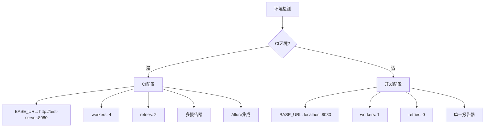

**图表来源**
- [playwright.config.ts:14-15](file://e2e-tests/playwright.config.ts#L14-L15)
- [playwright.config.ts:16-22](file://e2e-tests/playwright.config.ts#L16-L22)

**章节来源**
- [.gitlab-ci.yml:8-10](file://e2e-tests/.gitlab-ci.yml#L8-L10)
- [Jenkinsfile:8-10](file://e2e-tests/Jenkinsfile#L8-L10)
- [playwright.config.ts:14-22](file://e2e-tests/playwright.config.ts#L14-L22)

## 详细组件分析

### 认证系统架构

认证系统是整个测试框架的核心基础设施，采用了独立的认证项目和夹具系统：

#### 认证设置流程

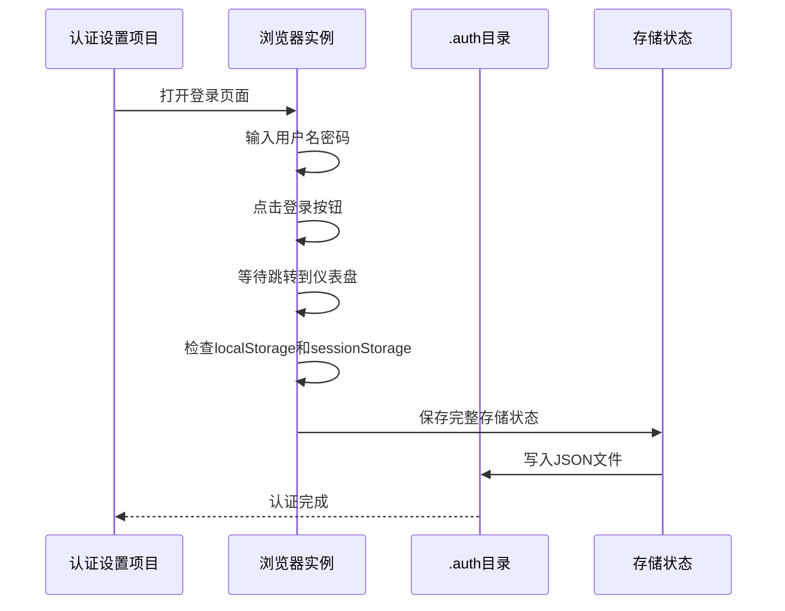

**图表来源**
- [auth.setup.ts:17-115](file://e2e-tests/fixtures/auth.setup.ts#L17-L115)

#### 多角色认证夹具

系统支持多种用户角色的认证状态管理：

| 角色 | 认证文件 | 页面别名 |
|------|----------|----------|
| 医生 | doctor.json | doctorPage |
| 审计员 | auditor.json | auditorPage |
| 管理员 | admin.json | adminPage |

**章节来源**
- [auth.setup.ts:5-7](file://e2e-tests/fixtures/auth.setup.ts#L5-L7)
- [auth.fixture.ts:3-7](file://e2e-tests/fixtures/auth.fixture.ts#L3-L7)

### 测试项目组织

#### 冒烟测试项目

冒烟测试专注于验证核心功能的稳定性，使用Chromium浏览器进行快速验证：

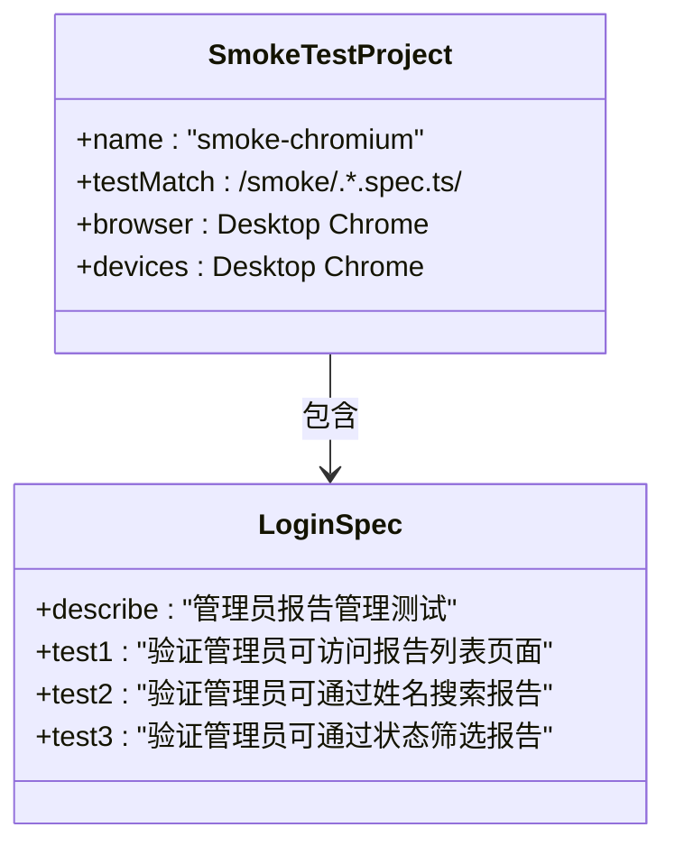

**图表来源**
- [playwright.config.ts:34-39](file://e2e-tests/playwright.config.ts#L34-L39)
- [login.spec.ts:9-178](file://e2e-tests/tests/smoke/login.spec.ts#L9-L178)

#### 回归测试项目

回归测试覆盖更全面的功能验证，使用多个浏览器确保兼容性：

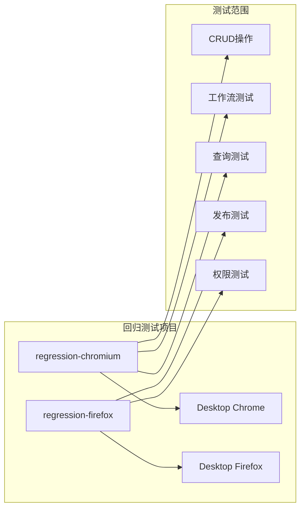

**图表来源**
- [playwright.config.ts:41-52](file://e2e-tests/playwright.config.ts#L41-L52)

**章节来源**
- [login.spec.ts:1-178](file://e2e-tests/tests/smoke/login.spec.ts#L1-L178)

### CI/CD集成配置

#### GitLab CI配置

GitLab CI实现了完整的测试流水线，包含多个阶段：

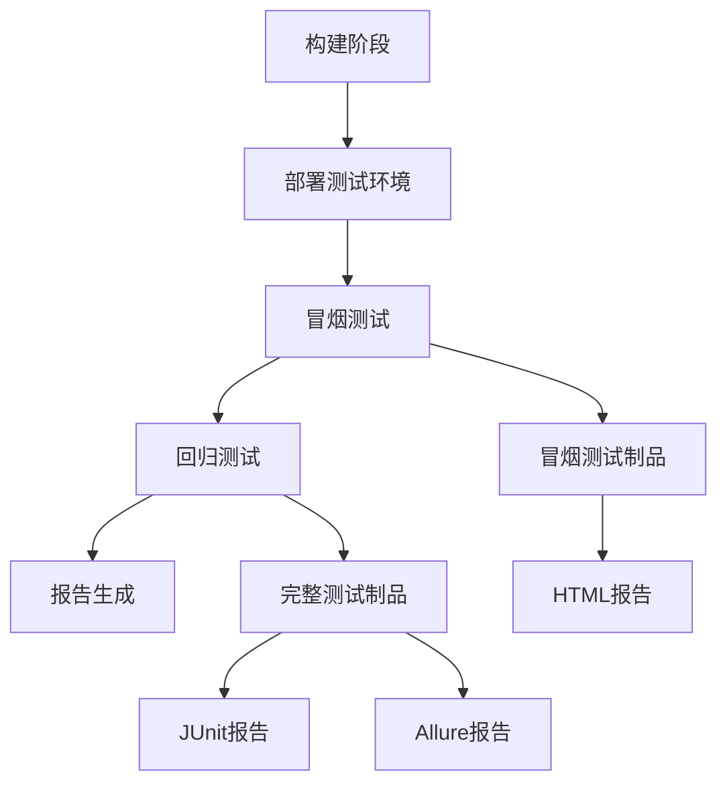

**图表来源**
- [.gitlab-ci.yml:11-28](file://e2e-tests/.gitlab-ci.yml#L11-L28)
- [.gitlab-ci.yml:29-46](file://e2e-tests/.gitlab-ci.yml#L29-L46)

#### Jenkins集成配置

Jenkins流水线提供了容器化的测试执行环境：

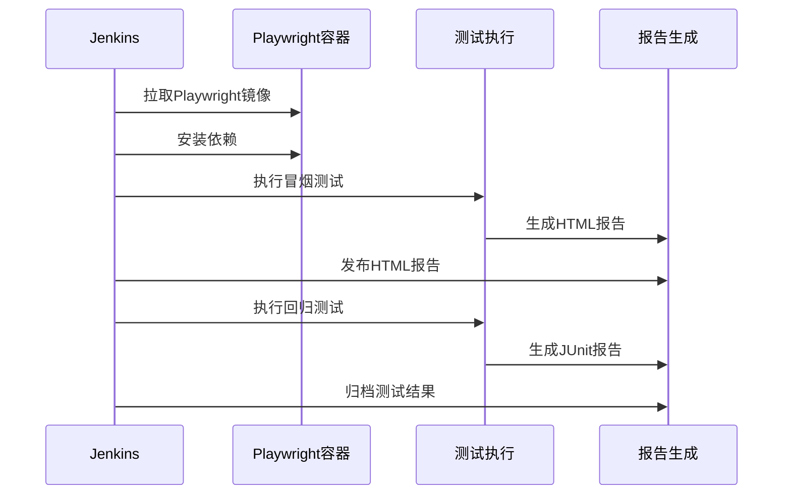

**图表来源**
- [Jenkinsfile:12-38](file://e2e-tests/Jenkinsfile#L12-L38)

**章节来源**
- [.gitlab-ci.yml:1-67](file://e2e-tests/.gitlab-ci.yml#L1-L67)
- [Jenkinsfile:1-59](file://e2e-tests/Jenkinsfile#L1-L59)

### AI辅助测试系统

#### 脚本生成器架构

AI辅助测试系统提供了智能化的测试脚本生成能力：

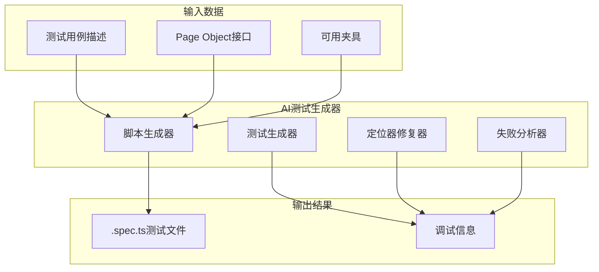

**图表来源**
- [script-generator.ts:23-65](file://e2e-tests/ai/script-generator.ts#L23-L65)

#### API辅助工具

系统提供了完整的API测试辅助工具：

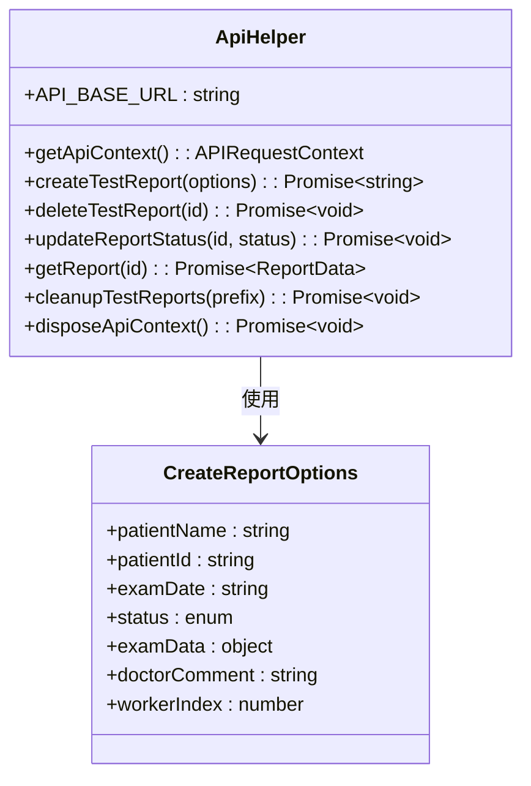

**图表来源**
- [api-helper.ts:8-20](file://e2e-tests/utils/api-helper.ts#L8-L20)
- [api-helper.ts:104-155](file://e2e-tests/utils/api-helper.ts#L104-L155)

**章节来源**
- [script-generator.ts:1-66](file://e2e-tests/ai/script-generator.ts#L1-L66)
- [api-helper.ts:1-206](file://e2e-tests/utils/api-helper.ts#L1-L206)

### 页面对象模式

系统采用了Page Object模式来封装页面交互逻辑：

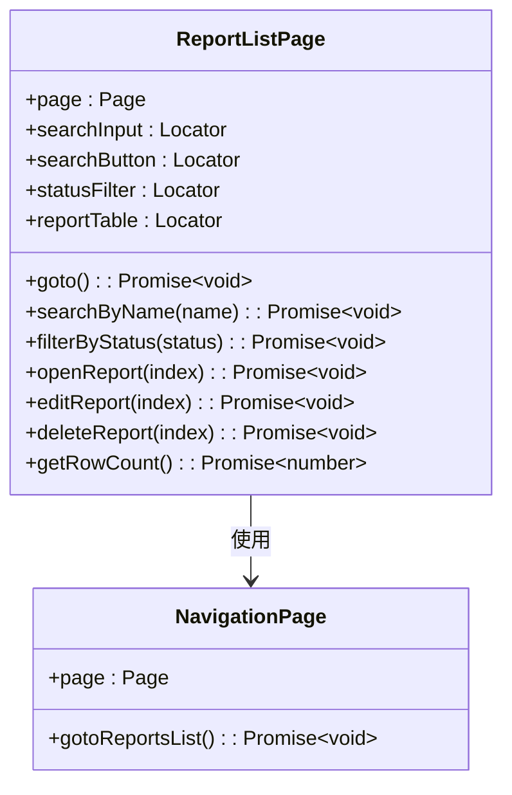

**图表来源**
- [report-list.page.ts:4-33](file://e2e-tests/pages/report-list.page.ts#L4-L33)
- [report-list.page.ts:35-62](file://e2e-tests/pages/report-list.page.ts#L35-L62)

**章节来源**
- [report-list.page.ts:1-182](file://e2e-tests/pages/report-list.page.ts#L1-L182)

## 依赖关系分析

### 外部依赖关系

```mermaid
graph TB
subgraph "核心依赖"
Playwright[@playwright/test] --> v1.50.0
Dotenv[dotenv] --> v16.4.0
Typescript[typescript] --> v5.3.0
end
subgraph "报告插件"
AllurePlaywright[allure-playwright] --> v3.0.0
AllureCommandline[allure-commandline] --> v2.27.0
end
subgraph "数据库支持"
Mysql2[mysql2] --> v3.9.0
TypesNode[@types/node] --> v20.11.0
end
Playwright --> AllurePlaywright
Playwright --> Mysql2
```

**图表来源**
- [package.json:22-33](file://e2e-tests/package.json#L22-L33)

### 内部模块依赖

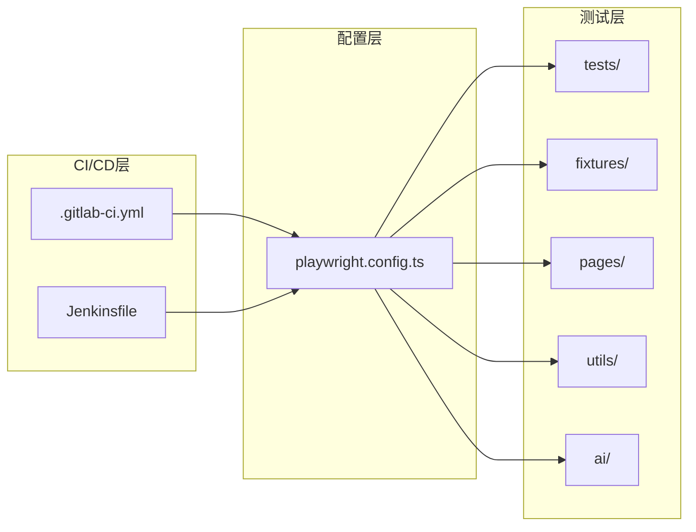

**图表来源**
- [playwright.config.ts:7-8](file://e2e-tests/playwright.config.ts#L7-L8)
- [tsconfig.json:14-20](file://e2e-tests/tsconfig.json#L14-L20)

**章节来源**
- [package.json:1-35](file://e2e-tests/package.json#L1-L35)
- [tsconfig.json:1-25](file://e2e-tests/tsconfig.json#L1-L25)

## 性能考虑

### 并发执行优化

系统通过合理的并发配置实现高效的测试执行：

#### 工作进程配置

| 环境 | 工作进程数 | 重试次数 | 超时设置 |
|------|------------|----------|----------|
| 开发环境 | 1 | 0 | 标准超时 |
| CI环境 | 4 | 2 | 标准超时 |
| 生产环境 | 4 | 2 | 标准超时 |

#### 内存管理策略

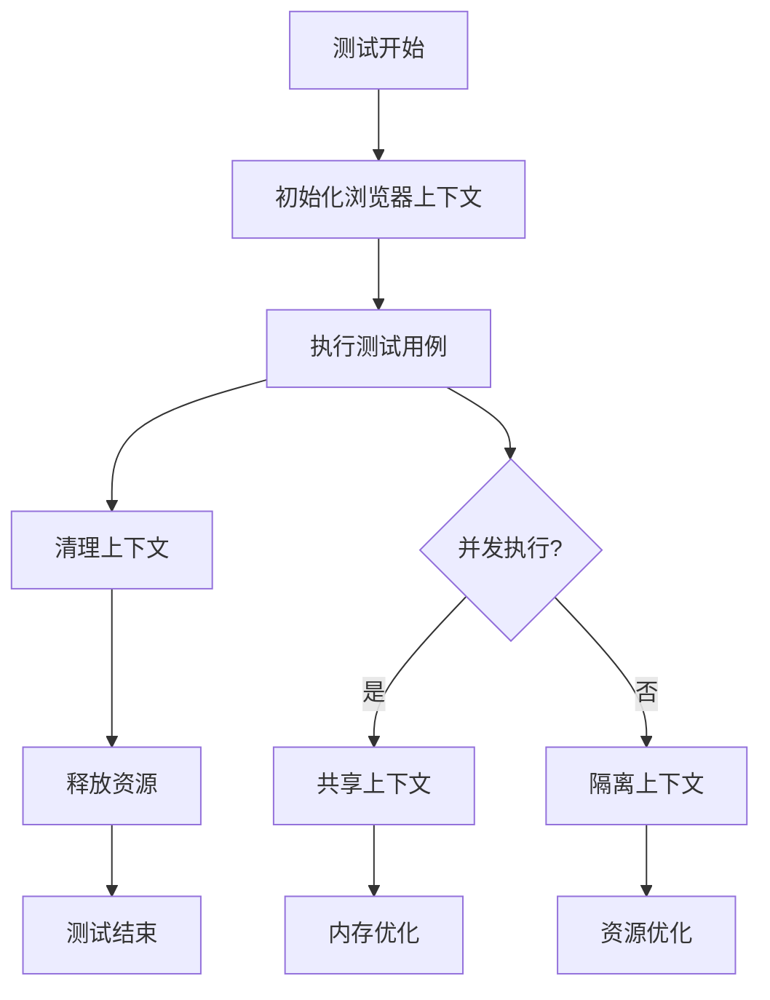

### 报告生成性能

系统采用多格式报告生成策略，在保证质量的同时优化性能：

#### 报告类型对比

| 报告类型 | 生成时间 | 存储大小 | 查看速度 | 适用场景 |
|----------|----------|----------|----------|----------|
| HTML报告 | 快速 | 小 | 快速 | 日常调试 |
| JUnit报告 | 中等 | 中等 | 快速 | CI集成 |
| Allure报告 | 较慢 | 大 | 中等 | 详细分析 |

**章节来源**
- [playwright.config.ts:14-15](file://e2e-tests/playwright.config.ts#L14-L15)
- [playwright.config.ts:16-22](file://e2e-tests/playwright.config.ts#L16-L22)

## 故障排除指南

### 常见配置问题

#### 环境变量配置问题

**问题**: 测试无法连接到目标服务器
**解决方案**: 
1. 检查`BASE_URL`环境变量是否正确设置
2. 验证网络连接和服务器可达性
3. 确认防火墙设置允许访问

**问题**: 认证失败或登录超时
**解决方案**:
1. 检查认证设置项目是否正确执行
2. 验证用户凭据的有效性
3. 确认认证状态文件存在且可访问

#### 并发执行问题

**问题**: 并发测试导致数据冲突
**解决方案**:
1. 使用唯一的数据标识符后缀
2. 实施适当的数据库事务隔离
3. 在测试间添加必要的等待时间

**问题**: 内存不足导致测试失败
**解决方案**:
1. 减少并发工作进程数量
2. 优化测试数据清理逻辑
3. 实施更频繁的资源回收

### CI/CD集成问题

#### GitLab CI问题

**问题**: 测试执行时间过长
**解决方案**:
1. 检查Docker镜像缓存配置
2. 优化依赖安装过程
3. 调整并发执行策略

**问题**: 报告生成失败
**解决方案**:
1. 验证报告目录权限
2. 检查磁盘空间充足性
3. 确认报告插件版本兼容性

#### Jenkins集成问题

**问题**: Docker容器启动失败
**解决方案**:
1. 检查Playwright镜像可用性
2. 验证Docker守护进程状态
3. 确认网络连接正常

**问题**: 构建工件上传失败
**解决方案**:
1. 检查Jenkins权限配置
2. 验证Artifacts存储空间
3. 确认网络连接稳定

**章节来源**
- [playwright.config.ts:24-29](file://e2e-tests/playwright.config.ts#L24-L29)
- [auth.setup.ts:12-14](file://e2e-tests/fixtures/auth.setup.ts#L12-L14)

## 结论

本Playwright配置文档详细介绍了项目的整体架构、配置选项和最佳实践。通过分层的测试项目设计、智能的CI/CD集成和完善的AI辅助功能，该框架为现代Web应用测试提供了全面的解决方案。

经过重构后的配置具有以下关键优势：
- **多浏览器支持**: 支持Chromium和Firefox并行测试，提高兼容性验证效率
- **增强的报告系统**: 集成Allure报告，提供更丰富的测试分析能力
- **灵活的配置管理**: 支持多环境配置和动态调整
- **高效的并发执行**: 优化的工作进程配置提升测试效率
- **智能的AI辅助**: 自动生成测试脚本减少重复劳动
- **可靠的CI/CD集成**: GitLab和Jenkins双重支持确保持续交付

建议团队在实际使用中根据具体需求调整配置参数，并建立相应的监控和维护机制。

## 附录

### 配置最佳实践

#### 环境配置模板

**开发环境配置**：
- workers: 1
- retries: 0
- screenshot: only-on-failure
- video: retain-on-failure
- trace: retain-on-failure

**测试环境配置**：
- workers: 2-4
- retries: 1-2
- screenshot: only-on-failure
- video: retain-on-failure
- trace: on-first-failure

**生产环境配置**：
- workers: 4-8
- retries: 2-3
- screenshot: off
- video: off
- trace: off

#### 性能调优建议

1. **合理设置超时时间**: 根据测试复杂度调整全局和断言超时
2. **优化并发策略**: 在保证稳定性的前提下最大化并发度
3. **精简报告生成**: 生产环境使用轻量级报告格式
4. **实施数据隔离**: 确保测试数据相互独立避免冲突
5. **监控资源使用**: 定期检查内存和CPU使用情况

#### 团队标准化指南

1. **统一命名规范**: 测试文件、夹具、页面对象的命名约定
2. **代码审查标准**: 测试代码的质量要求和审查流程
3. **文档维护要求**: 测试用例文档的更新和维护责任
4. **CI/CD流程规范**: 自动化测试的执行和报告标准
5. **问题响应机制**: 测试失败的处理和问题跟踪流程

#### Allure报告使用指南

1. **生成报告**: 使用`pnpm run report:allure`命令生成Allure报告
2. **查看报告**: 使用`allure open allure-report`命令查看报告
3. **报告配置**: 在`package.json`中配置Allure报告输出目录
4. **报告集成**: 在CI/CD中集成Allure报告生成和发布流程
5. **报告分析**: 利用Allure的测试趋势和缺陷分析功能优化测试策略