# TypeScript配置

<cite>
**本文档引用的文件**
- [tsconfig.json](file://e2e-tests/tsconfig.json)
- [package.json](file://e2e-tests/package.json)
- [playwright.config.ts](file://e2e-tests/playwright.config.ts)
- [dashboard/tsconfig.json](file://e2e-tests/dashboard/tsconfig.json)
- [dashboard/package.json](file://e2e-tests/dashboard/package.json)
- [dashboard/vite.config.ts](file://e2e-tests/dashboard/vite.config.ts)
- [dashboard/vite-env.d.ts](file://e2e-tests/dashboard/vite-env.d.ts)
- [dashboard/src/main.ts](file://e2e-tests/dashboard/src/main.ts)
- [dashboard/src/router/index.ts](file://e2e-tests/dashboard/src/router/index.ts)
- [dashboard/src/stores/tests.store.ts](file://e2e-tests/dashboard/src/stores/tests.store.ts)
- [login.spec.ts](file://e2e-tests/tests/smoke/login.spec.ts)
- [login.page.ts](file://e2e-tests/pages/login.page.ts)
- [auth.fixture.ts](file://e2e-tests/fixtures/auth.fixture.ts)
- [api-helper.ts](file://e2e-tests/utils/api-helper.ts)
- [script-generator.ts](file://e2e-tests/ai/script-generator.ts)
- [auth.setup.ts](file://e2e-tests/fixtures/auth.setup.ts)
- [auth.teardown.ts](file://e2e-tests/fixtures/auth.teardown.ts)
- [.gitignore](file://e2e-tests/.gitignore)
</cite>

## 更新摘要
**变更内容**
- 新增Vue.js仪表板的TypeScript配置分析
- 更新双tsconfig配置系统的说明
- 添加Vite集成和模块解析配置
- 扩展路径别名和模块解析规则
- 增加Vue组件和Pinia状态管理的配置说明

## 目录
1. [简介](#简介)
2. [项目结构](#项目结构)
3. [核心组件](#核心组件)
4. [架构概览](#架构概览)
5. [详细组件分析](#详细组件分析)
6. [依赖关系分析](#依赖关系分析)
7. [性能考虑](#性能考虑)
8. [故障排除指南](#故障排除指南)
9. [结论](#结论)
10. [附录](#附录)

## 简介

本文档深入解析了基于Playwright的TypeScript端到端测试项目的配置体系，现已扩展支持Vue.js仪表板的TypeScript集成。该项目采用现代化的TypeScript配置，结合AI辅助的测试脚本生成能力和Vue.js前端管理界面，为医院体检报告管理系统提供了完整的自动化测试解决方案。

项目的核心特点包括：
- 基于Playwright的跨浏览器端到端测试框架
- 模块化的设计模式，支持路径别名和严格的类型检查
- AI驱动的测试脚本自动生成机制
- Vue.js仪表板的TypeScript集成和状态管理
- 完善的测试夹具（fixtures）和页面对象模型（Page Objects）
- 多环境配置管理和CI/CD集成

## 项目结构

该测试项目采用功能模块化的目录结构，现在包含主测试项目和Vue.js仪表板两个主要部分：

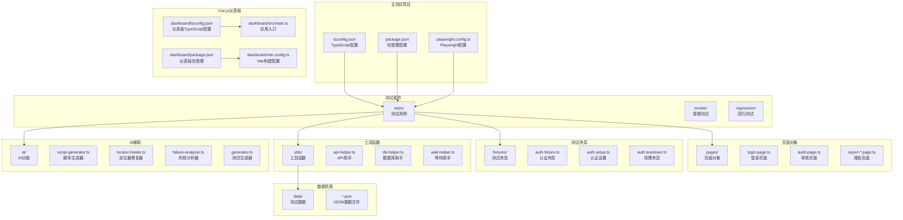

**图表来源**
- [tsconfig.json:1-25](file://e2e-tests/tsconfig.json#L1-L25)
- [dashboard/tsconfig.json:1-27](file://e2e-tests/dashboard/tsconfig.json#L1-L27)
- [playwright.config.ts:1-68](file://e2e-tests/playwright.config.ts#L1-L68)

**章节来源**
- [tsconfig.json:1-25](file://e2e-tests/tsconfig.json#L1-L25)
- [dashboard/tsconfig.json:1-27](file://e2e-tests/dashboard/tsconfig.json#L1-L27)
- [playwright.config.ts:1-68](file://e2e-tests/playwright.config.ts#L1-L68)

## 核心组件

### 主项目TypeScript编译配置

项目采用高度优化的TypeScript配置，专为Playwright端到端测试场景设计：

#### 编译目标和模块系统
- **目标版本**: ES2022，确保现代JavaScript特性的完整支持
- **模块系统**: ESNext，与Playwright的原生模块解析兼容
- **模块解析**: bundler，提供更精确的模块解析行为

#### 严格类型检查
启用全面的严格模式，包括：
- `strict`: 启用所有严格类型检查选项
- `esModuleInterop`: 改善CommonJS互操作性
- `resolveJsonModule`: 支持JSON模块导入
- `skipLibCheck`: 跳过库文件的类型检查，提升编译速度
- `forceConsistentCasingInFileNames`: 强制文件名大小写一致性

#### 路径别名配置
项目使用精心设计的路径别名系统，提升代码可读性和维护性：

| 别名 | 映射路径 | 用途 |
|------|----------|------|
| `@pages/*` | `pages/*` | 页面对象模块 |
| `@fixtures/*` | `fixtures/*` | 测试夹具模块 |
| `@utils/*` | `utils/*` | 工具函数模块 |
| `@data/*` | `data/*` | 测试数据文件 |
| `@ai/*` | `ai/*` | AI辅助功能 |

#### 输出配置
- `declaration`: false，禁用类型声明文件生成
- `noEmit`: true，仅进行类型检查，不生成JavaScript文件
- `baseUrl`: ".", 设置基础路径为项目根目录

**章节来源**
- [tsconfig.json:1-25](file://e2e-tests/tsconfig.json#L1-L25)

### Vue.js仪表板TypeScript配置

仪表板采用专门的TypeScript配置，支持Vue.js组件开发和TypeScript类型检查：

#### 编译目标和模块系统
- **目标版本**: ES2022，确保现代JavaScript特性的完整支持
- **模块系统**: ESNext，与Vue.js的原生模块解析兼容
- **模块解析**: bundler，提供更精确的模块解析行为

#### Vue.js特定配置
- **JSX支持**: `jsx: "preserve"`，保留Vue组件的JSX语法
- **JSON模块解析**: `resolveJsonModule: true`，支持JSON文件导入
- **严格类型检查**: 启用全面的严格模式

#### 路径别名配置
仪表板使用统一的路径别名系统：
- **`@/*`**: 映射到 `src/*`，简化Vue组件导入

#### 包含和排除配置
- **包含**: `src/**/*.ts`, `src/**/*.vue`, `server/**/*.ts`, `vite-env.d.ts`
- **排除**: `node_modules`, `dist`

**章节来源**
- [dashboard/tsconfig.json:1-27](file://e2e-tests/dashboard/tsconfig.json#L1-L27)

### Playwright集成配置

Playwright配置文件提供了完整的测试运行时环境：

#### 测试执行策略
- **完全并行**: `fullyParallel: true`，最大化测试执行效率
- **超时配置**: 全局超时30秒，断言超时5秒
- **重试机制**: CI环境中重试2次，本地环境不重试

#### 报告配置
- **CI环境**: HTML报告、JUnit XML报告和Allure报告
- **本地环境**: 仅HTML报告，失败时自动打开
- **报告输出**: `playwright-report`目录，便于持续集成

#### 测试项目配置
项目分为多个测试项目，支持不同的测试场景：
- **setup**: 认证状态准备，无浏览器执行
- **cleanup**: 认证状态清理
- **smoke-chromium**: 冒烟测试，仅Chromium浏览器
- **regression-chromium**: 回归测试，Chromium浏览器
- **regression-firefox**: 回归测试，Firefox浏览器

**章节来源**
- [playwright.config.ts:1-68](file://e2e-tests/playwright.config.ts#L1-L68)

### 包管理配置

package.json定义了完整的开发和测试环境：

#### 主项目脚本命令
- `test:smoke`: 运行冒烟测试（Chromium）
- `test:regression`: 运行回归测试（Chromium + Firefox）
- `test:all`: 运行所有测试
- `test:list`: 列出所有测试
- `report:html`: 查看HTML报告
- `report:allure`: 生成并打开Allure报告
- `ai:generate`: AI测试脚本生成
- `ai:modify`: AI测试脚本修改
- `ai:extend`: AI测试脚本扩展
- `ui`: 启动Vue.js仪表板
- `ui:install`: 安装仪表板依赖

#### 仪表板包管理配置
- **运行时依赖**: Express服务器、CORS、WS等
- **开发依赖**: Vue.js、Vite、Element Plus、TypeScript等
- **构建工具**: Vite作为前端构建工具

**章节来源**
- [package.json:1-35](file://e2e-tests/package.json#L1-L35)
- [dashboard/package.json:1-38](file://e2e-tests/dashboard/package.json#L1-L38)

## 架构概览

项目采用分层架构设计，从底层的AI辅助到顶层的测试执行，现在还包括Vue.js仪表板：

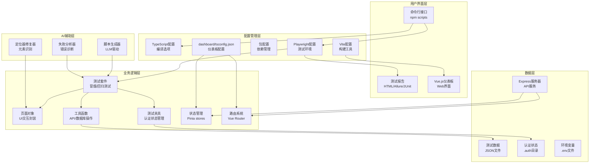

**图表来源**
- [playwright.config.ts:1-68](file://e2e-tests/playwright.config.ts#L1-L68)
- [tsconfig.json:1-25](file://e2e-tests/tsconfig.json#L1-L25)
- [dashboard/tsconfig.json:1-27](file://e2e-tests/dashboard/tsconfig.json#L1-L27)
- [dashboard/vite.config.ts:1-25](file://e2e-tests/dashboard/vite.config.ts#L1-L25)
- [package.json:1-35](file://e2e-tests/package.json#L1-L35)

## 详细组件分析

### 路径别名系统

路径别名系统是项目架构的重要组成部分，提供了清晰的模块组织和灵活的导入机制：

#### 主项目路径别名解析流程

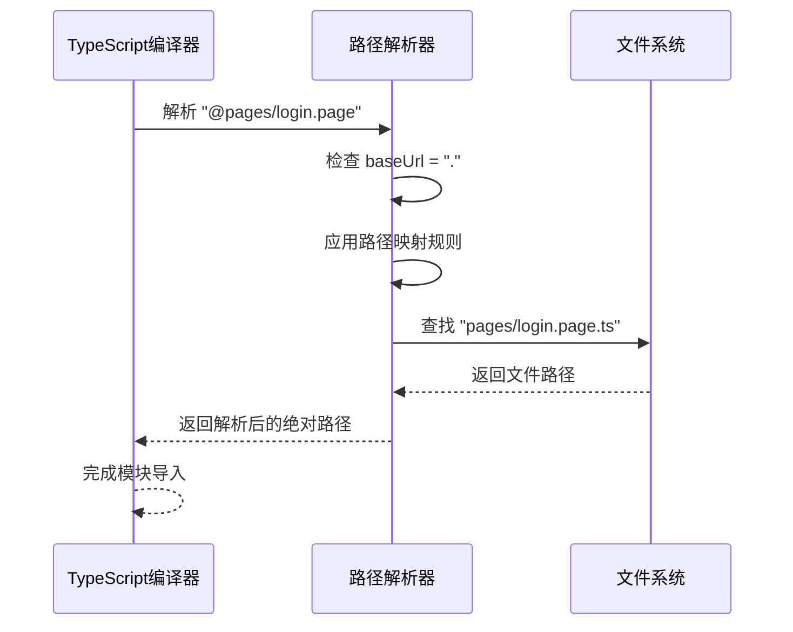

**图表来源**
- [tsconfig.json:14-20](file://e2e-tests/tsconfig.json#L14-L20)

#### 仪表板路径别名解析流程

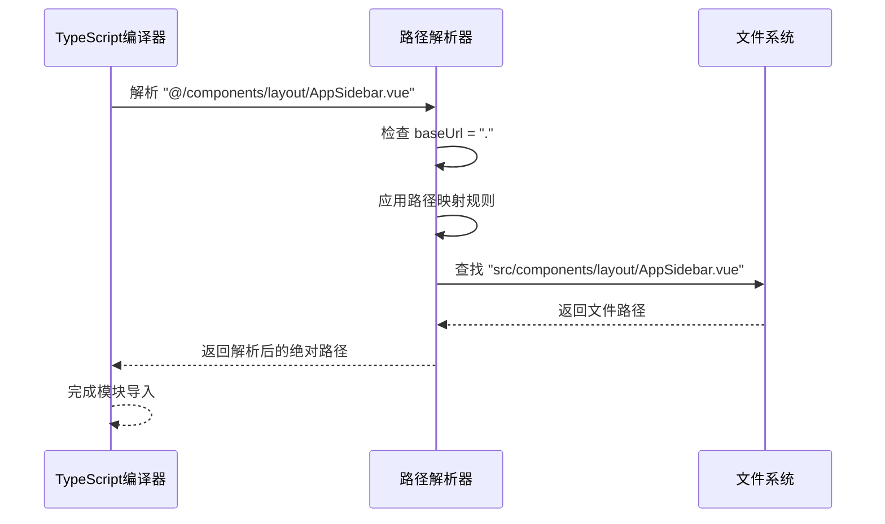

**图表来源**
- [dashboard/tsconfig.json:15-17](file://e2e-tests/dashboard/tsconfig.json#L15-L17)

#### 模块导入示例

在实际代码中，路径别名的使用方式如下：

- **主项目页面对象导入**: `import { LoginPage } from '@pages/login.page'`
- **主项目测试夹具导入**: `import { test } from '@fixtures/auth.fixture'`
- **主项目工具函数导入**: `import { createTestReport } from '@utils/api-helper'`
- **仪表板组件导入**: `import AppSidebar from '@/components/layout/AppSidebar.vue'`
- **仪表板路由导入**: `import { router } from '@/router'`

这种设计的优势：
1. **可移植性**: 即使目录结构调整，路径别名保持不变
2. **可读性**: 明确的模块标识符
3. **维护性**: 集中的路径配置管理
4. **区分性**: 主项目和仪表板使用不同的别名前缀

**章节来源**
- [tsconfig.json:14-20](file://e2e-tests/tsconfig.json#L14-L20)
- [dashboard/tsconfig.json:15-17](file://e2e-tests/dashboard/tsconfig.json#L15-L17)

### Vue.js仪表板架构

Vue.js仪表板提供了完整的Web界面，支持测试管理、AI辅助等功能：

#### 应用入口和依赖注入

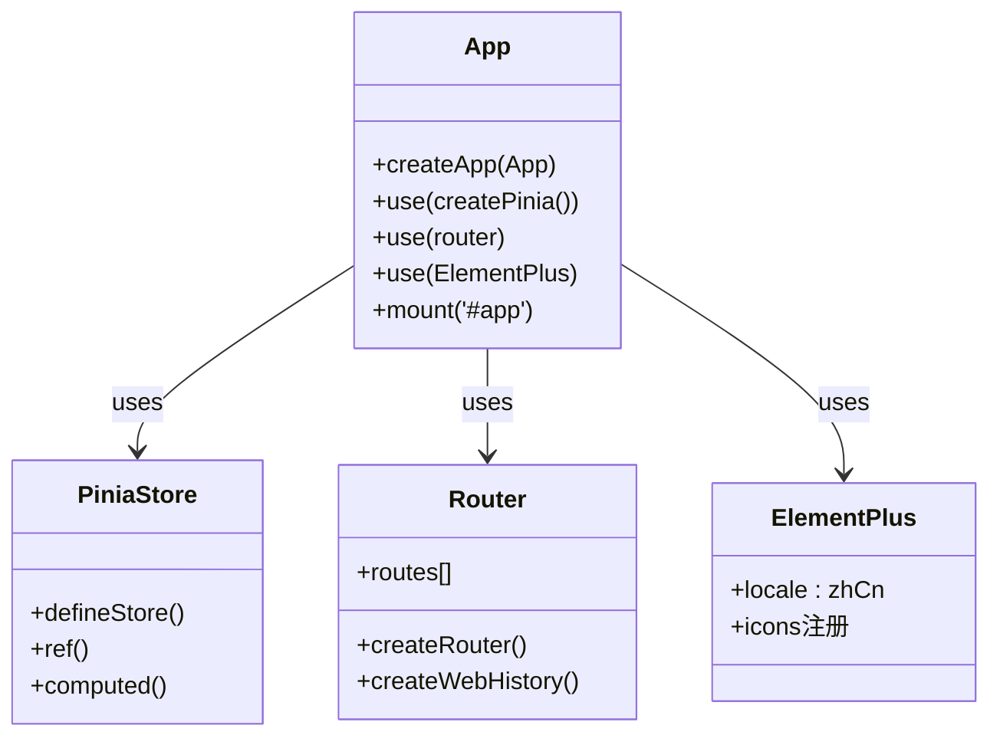

**图表来源**
- [dashboard/src/main.ts:1-22](file://e2e-tests/dashboard/src/main.ts#L1-L22)

#### 路由系统架构

```mermaid
classDiagram
class Router {
+history : createWebHistory()
+routes : [
{ path : '/', redirect : '/ai/generate' }
{ path : '/ai/generate', component : AiGenerateView }
{ path : '/ai/modify', component : AiModifyView }
{ path : '/visual/builder', component : VisualTestBuilderView }
{ path : '/tests', component : TestManagerView }
{ path : '/tests/explorer', component : TestExplorerView }
{ path : '/runner', component : TestRunnerView }
{ path : '/config', component : ConfigView }
]
}
```

**图表来源**
- [dashboard/src/router/index.ts:1-17](file://e2e-tests/dashboard/src/router/index.ts#L1-L17)

#### 状态管理架构

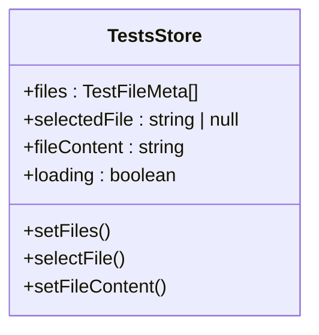

**图表来源**
- [dashboard/src/stores/tests.store.ts:1-25](file://e2e-tests/dashboard/src/stores/tests.store.ts#L1-L25)

**章节来源**
- [dashboard/src/main.ts:1-22](file://e2e-tests/dashboard/src/main.ts#L1-L22)
- [dashboard/src/router/index.ts:1-17](file://e2e-tests/dashboard/src/router/index.ts#L1-L17)
- [dashboard/src/stores/tests.store.ts:1-25](file://e2e-tests/dashboard/src/stores/tests.store.ts#L1-L25)

### 测试夹具系统

测试夹具提供了强大的认证状态管理能力，支持多角色用户模拟：

#### 认证夹具架构

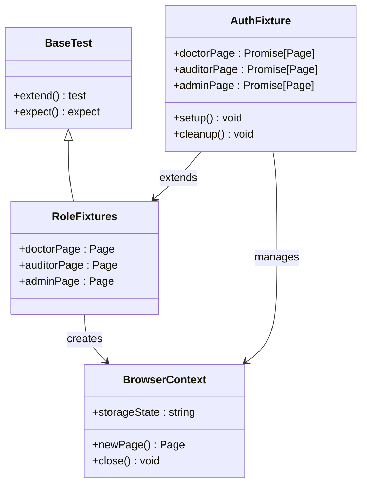

**图表来源**
- [auth.fixture.ts:1-40](file://e2e-tests/fixtures/auth.fixture.ts#L1-L40)

#### 认证状态生命周期

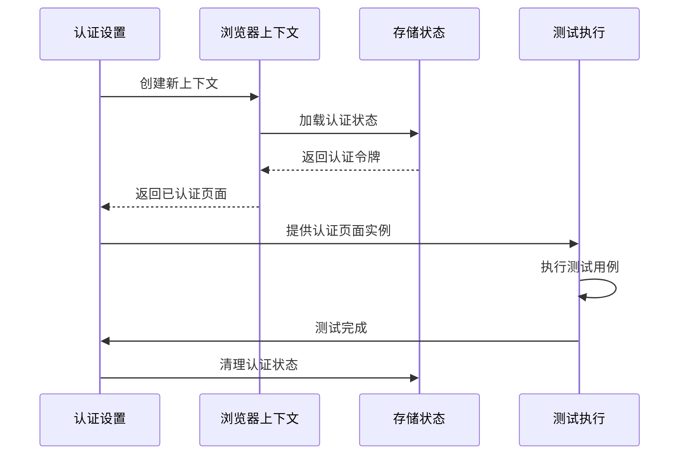

**图表来源**
- [auth.setup.ts:1-28](file://e2e-tests/fixtures/auth.setup.ts#L1-L28)
- [auth.teardown.ts:1-18](file://e2e-tests/fixtures/auth.teardown.ts#L1-L18)

**章节来源**
- [auth.fixture.ts:1-40](file://e2e-tests/fixtures/auth.fixture.ts#L1-L40)
- [auth.setup.ts:1-28](file://e2e-tests/fixtures/auth.setup.ts#L1-L28)
- [auth.teardown.ts:1-18](file://e2e-tests/fixtures/auth.teardown.ts#L1-L18)

### AI辅助测试生成

项目集成了AI驱动的测试脚本生成能力，显著提升了测试开发效率：

#### 脚本生成工作流

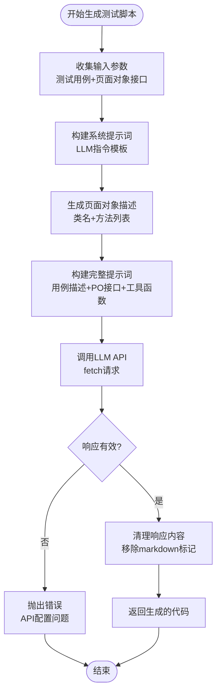

**图表来源**
- [script-generator.ts:13-42](file://e2e-tests/ai/script-generator.ts#L13-L42)
- [script-generator.ts:63-109](file://e2e-tests/ai/script-generator.ts#L63-L109)

#### AI集成配置

AI功能的配置要点：
- **环境变量**: `LLM_API_URL`、`LLM_API_KEY`、`LLM_MODEL`
- **温度参数**: 0.2，确保输出稳定性和准确性
- **模型选择**: 默认GPT-4，可根据需要调整
- **错误处理**: 完整的API调用错误检测和处理

**章节来源**
- [script-generator.ts:1-110](file://e2e-tests/ai/script-generator.ts#L1-L110)

### 页面对象模式

页面对象模式提供了清晰的UI交互抽象层：

#### 页面对象设计

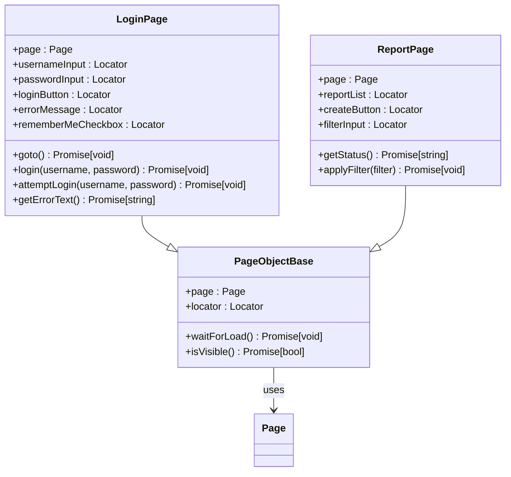

**图表来源**
- [login.page.ts:3-52](file://e2e-tests/pages/login.page.ts#L3-L52)

**章节来源**
- [login.page.ts:1-52](file://e2e-tests/pages/login.page.ts#L1-L52)

## 依赖关系分析

项目采用松耦合的模块化设计，各组件之间的依赖关系清晰明确：

```mermaid
graph TB
subgraph "核心依赖"
PLAYWRIGHT[@playwright/test] --> TEST_SUITE[Test Suite]
TYPESCRIPT[typescript] --> COMPILER[TypeScript Compiler]
NODE_TYPES[@types/node] --> COMPILER
end
subgraph "测试依赖"
ALLURE_PLAYWRIGHT[allure-playwright] --> REPORTING[报告生成]
ALLURE_CMD[allure-commandline] --> REPORTING
DOTENV[dotenv] --> CONFIG[配置管理]
end
subgraph "业务模块"
TEST_SUITE --> PAGE_OBJECTS[Page Objects]
TEST_SUITE --> FIXTURES[Test Fixtures]
TEST_SUITE --> UTILS[Utility Functions]
UTILS --> API_HELPER[API Helper]
UTILS --> DB_HELPER[DB Helper]
UTILS --> WAIT_HELPER[Wait Helper]
end
subgraph "AI模块"
SCRIPT_GEN[Script Generator] --> TEST_SUITE
LOCATOR_HEALER[Locator Healer] --> PAGE_OBJECTS
FAILURE_ANALYZER[Failure Analyzer] --> TEST_SUITE
end
subgraph "配置模块"
TS_CONFIG[tsconfig.json] --> COMPILER
PW_CONFIG[playwright.config.ts] --> TEST_SUITE
PKG_CONFIG[package.json] --> DEPENDENCIES[依赖管理]
DASH_TS[dashboard/tsconfig.json] --> DASH_APP[Dashboard App]
DASH_VITE[vite.config.ts] --> DASH_BUILD[Build Process]
end
subgraph "Vue.js仪表板"
DASH_APP --> DASH_ROUTER[Vue Router]
DASH_APP --> DASH_PINIA[Pinia Store]
DASH_APP --> DASH_ELEMENT[Element Plus]
DASH_ROUTER --> DASH_VIEWS[Vue Views]
DASH_PINIA --> DASH_STORES[State Management]
end
```

**图表来源**
- [package.json:22-33](file://e2e-tests/package.json#L22-L33)
- [dashboard/package.json:17-36](file://e2e-tests/dashboard/package.json#L17-L36)
- [tsconfig.json:2-12](file://e2e-tests/tsconfig.json#L2-L12)
- [dashboard/tsconfig.json:2-18](file://e2e-tests/dashboard/tsconfig.json#L2-L18)
- [playwright.config.ts:1-68](file://e2e-tests/playwright.config.ts#L1-L68)

### 模块导入关系

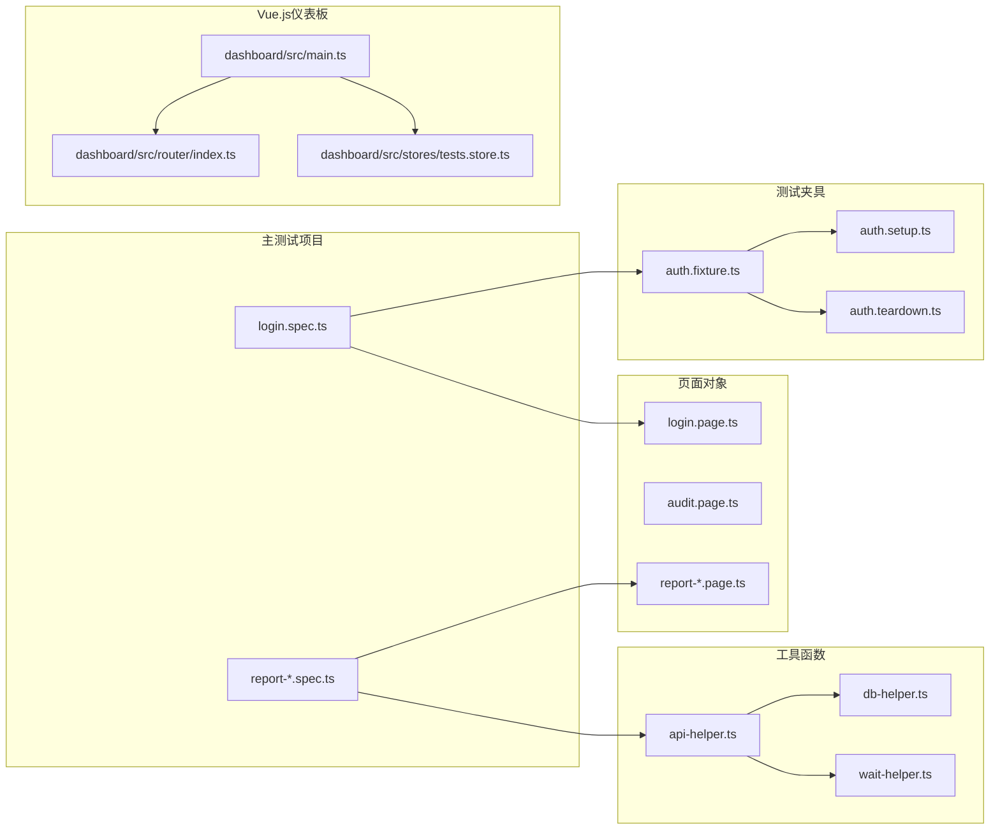

**图表来源**
- [login.spec.ts:1-25](file://e2e-tests/tests/smoke/login.spec.ts#L1-L25)
- [login.page.ts:1-52](file://e2e-tests/pages/login.page.ts#L1-L52)
- [auth.fixture.ts:1-40](file://e2e-tests/fixtures/auth.fixture.ts#L1-L40)
- [api-helper.ts:1-172](file://e2e-tests/utils/api-helper.ts#L1-L172)
- [dashboard/src/main.ts:1-22](file://e2e-tests/dashboard/src/main.ts#L1-L22)
- [dashboard/src/router/index.ts:1-17](file://e2e-tests/dashboard/src/router/index.ts#L1-L17)
- [dashboard/src/stores/tests.store.ts:1-25](file://e2e-tests/dashboard/src/stores/tests.store.ts#L1-L25)

**章节来源**
- [login.spec.ts:1-25](file://e2e-tests/tests/smoke/login.spec.ts#L1-L25)
- [auth.fixture.ts:1-40](file://e2e-tests/fixtures/auth.fixture.ts#L1-L40)
- [dashboard/src/main.ts:1-22](file://e2e-tests/dashboard/src/main.ts#L1-L22)

## 性能考虑

### 编译性能优化

项目在TypeScript配置中采用了多项性能优化策略：

#### 主项目编译选项优化
- **模块解析**: 使用 `bundler` 模式，提供更精确的模块解析
- **类型检查**: `skipLibCheck: true`，跳过库文件类型检查，显著提升编译速度
- **输出控制**: `noEmit: true`，仅进行类型检查，避免不必要的文件生成
- **严格模式**: 启用全面的严格类型检查，在保证类型安全的同时保持良好性能

#### 仪表板编译选项优化
- **JSX保留**: `jsx: "preserve"`，保留Vue组件的JSX语法，避免额外转换开销
- **JSON模块**: `resolveJsonModule: true`，直接支持JSON文件导入
- **模块解析**: 使用 `bundler` 模式，提供更精确的模块解析
- **类型检查**: `skipLibCheck: true`，跳过库文件类型检查

#### 运行时性能优化
- **并行执行**: `fullyParallel: true`，充分利用多核CPU资源
- **智能缓存**: Playwright的测试缓存机制减少重复执行时间
- **条件加载**: 根据环境变量动态配置测试参数
- **Vite热重载**: 仪表板使用Vite提供快速的开发体验

### 测试执行优化

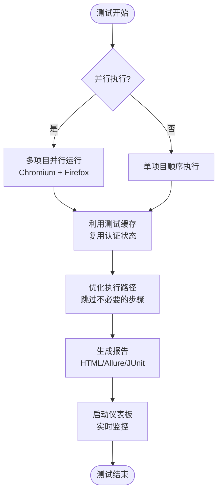

## 故障排除指南

### 常见编译错误及解决方案

#### 路径解析错误
**问题**: `Cannot find module '@pages/login.page'`
**原因**: 路径别名配置不正确或模块不存在
**解决方案**:
1. 检查 `tsconfig.json` 中的 `baseUrl` 和 `paths` 配置
2. 确认模块文件的实际路径
3. 验证文件扩展名是否正确

#### Vue.js组件导入错误
**问题**: `Cannot find module '@/components/layout/AppSidebar.vue'`
**原因**: 仪表板路径别名配置不正确或组件文件不存在
**解决方案**:
1. 检查 `dashboard/tsconfig.json` 中的 `@/*` 路径映射
2. 确认组件文件位于 `src/components/layout/` 目录
3. 验证文件扩展名是否为 `.vue`

#### 类型定义错误
**问题**: Playwright类型相关错误
**原因**: 缺少必要的类型定义或版本不兼容
**解决方案**:
1. 确保安装了 `@types/node` 和 `@playwright/test`
2. 检查TypeScript版本兼容性
3. 验证Playwright版本与类型定义匹配

#### 环境变量配置错误
**问题**: LLM API调用失败
**原因**: 缺少必要的环境变量配置
**解决方案**:
1. 在 `.env` 文件中设置 `LLM_API_URL`、`LLM_API_KEY`、`LLM_MODEL`
2. 确保环境变量在运行时可用
3. 检查API访问权限和配额限制

### 运行时问题排查

#### 测试执行失败
**问题**: 测试在特定浏览器上失败
**原因**: 浏览器兼容性或页面元素变化
**解决方案**:
1. 检查页面元素定位器是否稳定
2. 调整等待策略和超时设置
3. 使用 `trace: 'retain-on-failure'` 生成调试信息

#### 认证状态问题
**问题**: 认证状态失效或无法加载
**原因**: 存储状态文件损坏或过期
**解决方案**:
1. 运行 `auth.setup.ts` 重新生成认证状态
2. 检查 `.auth` 目录权限
3. 验证用户凭据的有效性

#### 仪表板启动问题
**问题**: Vue.js仪表板无法启动
**原因**: 依赖安装或配置问题
**解决方案**:
1. 运行 `npm run ui:install` 安装仪表板依赖
2. 检查 `dashboard/package.json` 中的依赖版本
3. 验证端口占用情况（默认3200）

**章节来源**
- [tsconfig.json:14-20](file://e2e-tests/tsconfig.json#L14-L20)
- [dashboard/tsconfig.json:15-17](file://e2e-tests/dashboard/tsconfig.json#L15-L17)
- [script-generator.ts:13-42](file://e2e-tests/ai/script-generator.ts#L13-L42)
- [auth.setup.ts:16-26](file://e2e-tests/fixtures/auth.setup.ts#L16-L26)

## 结论

本TypeScript配置项目展现了现代端到端测试的最佳实践，通过精心设计的架构和优化的配置，为复杂的Web应用测试提供了可靠的技术基础。项目现已扩展支持Vue.js仪表板的TypeScript集成，形成了完整的测试生态系统。

项目的主要优势包括：
- **模块化设计**: 清晰的目录结构和路径别名系统
- **双配置系统**: 主项目和仪表板分别优化的TypeScript配置
- **AI集成**: 智能化的测试脚本生成能力
- **Vue.js仪表板**: 完整的Web界面支持测试管理
- **多环境支持**: 完善的开发、测试和生产环境配置
- **性能优化**: 多层次的编译和执行性能优化
- **可维护性**: 良好的代码组织和文档化

建议在实际项目中继续关注：
- 持续改进AI辅助功能的准确性和效率
- 扩展测试覆盖范围和深度
- 优化CI/CD流水线的执行效率
- 建立完善的监控和报告机制
- 完善Vue.js仪表板的功能和用户体验

## 附录

### 开发环境配置模板

#### 主项目基础开发环境
```json
{
  "compilerOptions": {
    "target": "ES2022",
    "module": "ESNext",
    "moduleResolution": "bundler",
    "strict": true,
    "esModuleInterop": true,
    "resolveJsonModule": true,
    "skipLibCheck": true,
    "forceConsistentCasingInFileNames": true,
    "baseUrl": ".",
    "paths": {
      "@pages/*": ["pages/*"],
      "@fixtures/*": ["fixtures/*"],
      "@utils/*": ["utils/*"],
      "@data/*": ["data/*"],
      "@ai/*": ["ai/*"]
    }
  },
  "include": ["**/*.ts"],
  "exclude": ["node_modules"]
}
```

#### Vue.js仪表板开发环境
```json
{
  "compilerOptions": {
    "target": "ES2022",
    "module": "ESNext",
    "moduleResolution": "bundler",
    "strict": true,
    "esModuleInterop": true,
    "resolveJsonModule": true,
    "skipLibCheck": true,
    "forceConsistentCasingInFileNames": true,
    "declaration": false,
    "noEmit": true,
    "baseUrl": ".",
    "jsx": "preserve",
    "paths": {
      "@/*": ["src/*"]
    }
  },
  "include": [
    "src/**/*.ts",
    "src/**/*.vue",
    "server/**/*.ts",
    "vite-env.d.ts"
  ],
  "exclude": ["node_modules", "dist"]
}
```

#### 生产环境配置
```json
{
  "compilerOptions": {
    "target": "ES2022",
    "module": "ESNext",
    "moduleResolution": "bundler",
    "strict": true,
    "skipLibCheck": true,
    "noEmit": true,
    "baseUrl": ".",
    "paths": {
      "@pages/*": ["pages/*"],
      "@fixtures/*": ["fixtures/*"],
      "@utils/*": ["utils/*"],
      "@data/*": ["data/*"],
      "@ai/*": ["ai/*"],
      "@/*": ["src/*"]
    }
  },
  "include": ["**/*.ts"],
  "exclude": ["node_modules", "tests/", "ai/", "dashboard/"]
}
```

### 最佳实践清单

#### TypeScript配置最佳实践
- 使用路径别名提升代码可读性
- 启用严格类型检查确保代码质量
- 配置适当的模块解析策略
- 优化编译选项提升开发体验
- 分离主项目和仪表板的不同配置需求

#### Playwright集成最佳实践
- 合理使用测试夹具管理认证状态
- 采用页面对象模式封装UI交互
- 实施适当的等待策略和重试机制
- 建立完善的报告和监控体系

#### Vue.js仪表板最佳实践
- 使用统一的路径别名系统
- 合理组织组件结构和状态管理
- 实施适当的TypeScript类型检查
- 配置合适的构建和开发工具链

#### AI辅助测试最佳实践
- 提供清晰的测试用例描述
- 维护稳定的页面对象接口
- 建立可靠的环境变量配置
- 实施适当的错误处理和日志记录

#### 双项目协作最佳实践
- 明确区分主项目和仪表板的职责边界
- 统一开发工具链和依赖管理
- 建立有效的代码共享和复用机制
- 实施适当的版本控制和发布流程