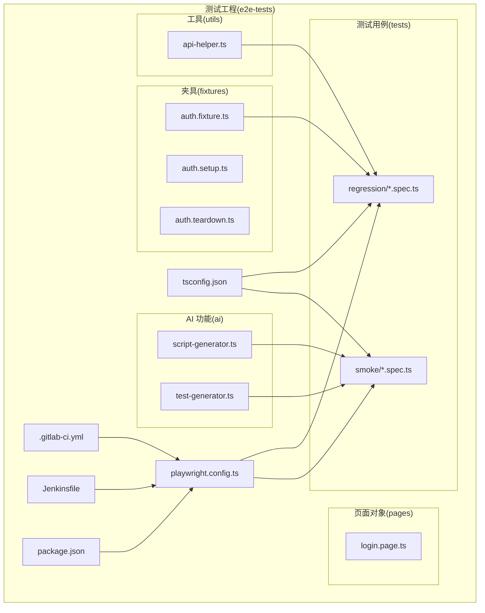
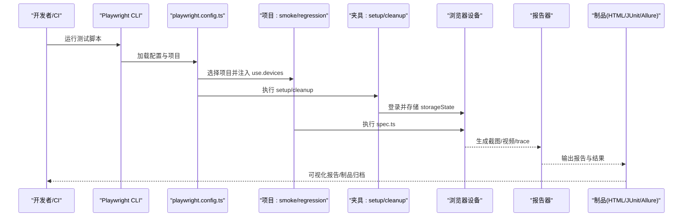
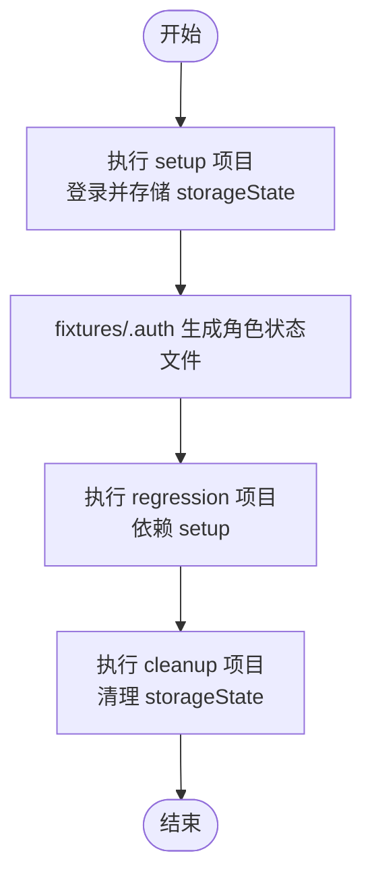
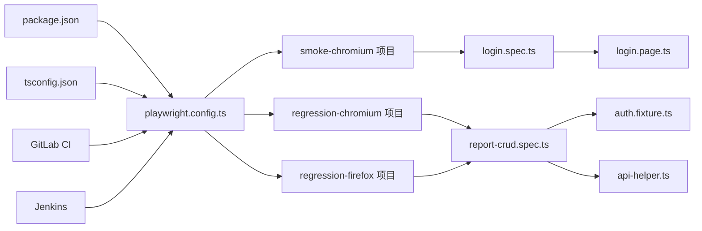

# 测试框架配置

<cite>
**本文引用的文件**
- [playwright.config.ts](file://e2e-tests/playwright.config.ts)
- [tsconfig.json](file://e2e-tests/tsconfig.json)
- [package.json](file://e2e-tests/package.json)
- [.gitlab-ci.yml](file://e2e-tests/.gitlab-ci.yml)
- [Jenkinsfile](file://e2e-tests/Jenkinsfile)
- [auth.setup.ts](file://e2e-tests/fixtures/auth.setup.ts)
- [auth.teardown.ts](file://e2e-tests/fixtures/auth.teardown.ts)
- [auth.fixture.ts](file://e2e-tests/fixtures/auth.fixture.ts)
- [login.spec.ts](file://e2e-tests/tests/smoke/login.spec.ts)
- [report-crud.spec.ts](file://e2e-tests/tests/regression/report-crud.spec.ts)
- [login.page.ts](file://e2e-tests/pages/login.page.ts)
- [api-helper.ts](file://e2e-tests/utils/api-helper.ts)
- [script-generator.ts](file://e2e-tests/ai/script-generator.ts)
- [test-generator.ts](file://e2e-tests/ai/test-generator.ts)
</cite>

## 目录
1. [简介](#简介)
2. [项目结构](#项目结构)
3. [核心组件](#核心组件)
4. [架构总览](#架构总览)
5. [详细组件分析](#详细组件分析)
6. [依赖关系分析](#依赖关系分析)
7. [性能考虑](#性能考虑)
8. [故障排查指南](#故障排查指南)
9. [结论](#结论)
10. [附录](#附录)

## 简介
本文件面向团队提供端到端测试框架的配置与最佳实践文档，重点围绕 Playwright 配置、TypeScript 编译配置、脚本命令与依赖管理、CI/CD 集成、并发与报告策略、以及 AI 辅助测试生成能力进行系统性说明。文档同时给出不同环境下的配置示例、性能优化建议与常见问题排查方法，帮助团队快速落地标准化的测试配置。

## 项目结构
该仓库采用“按功能域划分”的组织方式，核心目录与职责如下：
- e2e-tests：测试工程根目录
  - ai：AI 辅助测试生成模块（测试用例与脚本生成）
  - data：测试数据资源（JSON）
  - fixtures：测试夹具与登录态准备/清理
  - pages：页面对象（Page Objects）
  - tests：测试用例（smoke 与 regression）
  - utils：通用工具（API/数据库/等待辅助）
  - 配置文件：playwright.config.ts、tsconfig.json、package.json、.gitlab-ci.yml、Jenkinsfile

图表来源
- [playwright.config.ts:1-68](file://e2e-tests/playwright.config.ts#L1-L68)
- [.gitlab-ci.yml:1-67](file://e2e-tests/.gitlab-ci.yml#L1-L67)
- [Jenkinsfile:1-59](file://e2e-tests/Jenkinsfile#L1-L59)
- [auth.fixture.ts:1-40](file://e2e-tests/fixtures/auth.fixture.ts#L1-L40)
- [api-helper.ts:1-172](file://e2e-tests/utils/api-helper.ts#L1-L172)

章节来源
- [playwright.config.ts:1-68](file://e2e-tests/playwright.config.ts#L1-L68)
- [tsconfig.json:1-25](file://e2e-tests/tsconfig.json#L1-L25)
- [package.json:1-27](file://e2e-tests/package.json#L1-L27)
- [.gitlab-ci.yml:1-67](file://e2e-tests/.gitlab-ci.yml#L1-L67)
- [Jenkinsfile:1-59](file://e2e-tests/Jenkinsfile#L1-L59)

## 核心组件
本节从配置视角拆解 Playwright、TypeScript、脚本与依赖的关键设置，帮助快速理解整体运行机制。

- Playwright 配置要点
  - 测试目录与超时：testDir、timeout、expect.timeout
  - 并发与重试：fullyParallel、retries、workers、forbidOnly
  - 报告器：CI 环境启用 HTML/JUnit/Allure；本地仅 HTML
  - 通用 use：baseURL、截图/视频/追踪策略
  - 项目化执行：setup/cleanup、smoke-chromium、regression-chromium/firefox
  - 设备与浏览器：devices['Desktop Chrome/Firefox']
- TypeScript 编译配置
  - 目标与模块：ES2022、ESNext、bundler
  - 严格模式：strict、skipLibCheck、forceConsistentCasingInFileNames
  - 模块解析：bundler
  - 路径别名：@pages/@fixtures/@utils/@data/@ai
  - 输出：noEmit（仅类型检查）
- 脚本与依赖
  - 测试脚本：test:smoke、test:regression、test:all、test:list、report:html、report:allure
  - 引擎与依赖：Node >= 18、@playwright/test、typescript、dotenv、allure-playwright 等

章节来源
- [playwright.config.ts:6-68](file://e2e-tests/playwright.config.ts#L6-L68)
- [tsconfig.json:2-24](file://e2e-tests/tsconfig.json#L2-L24)
- [package.json:6-25](file://e2e-tests/package.json#L6-L25)

## 架构总览
下图展示从命令到执行再到报告产出的端到端流程，涵盖本地与 CI 环境差异、项目化执行与 AI 辅助生成。

图表来源
- [playwright.config.ts:31-66](file://e2e-tests/playwright.config.ts#L31-L66)
- [auth.setup.ts:1-30](file://e2e-tests/fixtures/auth.setup.ts#L1-L30)
- [auth.teardown.ts:1-18](file://e2e-tests/fixtures/auth.teardown.ts#L1-L18)
- [.gitlab-ci.yml:14-46](file://e2e-tests/.gitlab-ci.yml#L14-L46)
- [Jenkinsfile:13-38](file://e2e-tests/Jenkinsfile#L13-L38)

## 详细组件分析

### Playwright 配置详解
- 测试项目配置
  - testDir：统一测试入口目录
  - timeout/expect.timeout：整体与断言超时控制
  - fullyParallel：启用完全并行
  - forbidOnly/retries/workers：CI 环境限制与重试、并发工作进程
- 浏览器设备设置
  - devices['Desktop Chrome/Firefox']：桌面端设备预设
  - 项目依赖：setup → 保证登录态可用
- 报告器配置
  - CI 环境：HTML/JUnit/Allure 多格式输出
  - 本地环境：仅 HTML（失败时打开）
- 并发执行策略
  - workers=4（CI）vs 1（本地）
  - fullyParallel=true 提升吞吐
- use 配置
  - baseURL 来自环境变量，默认本地开发地址
  - 截图/视频/trace：失败时保留，便于回溯

章节来源
- [playwright.config.ts:6-29](file://e2e-tests/playwright.config.ts#L6-L29)
- [playwright.config.ts:31-66](file://e2e-tests/playwright.config.ts#L31-L66)

### TypeScript 编译配置详解
- 目标与模块
  - target: ES2022、module: ESNext、moduleResolution: bundler
- 严格类型检查
  - strict: true、skipLibCheck: true、forceConsistentCasingInFileNames: true
- 模块解析与路径别名
  - baseUrl: "."、paths: @pages/@fixtures/@utils/@data/@ai 映射到对应目录
- 输出与包含范围
  - noEmit、include: "**/*.ts"、exclude: "node_modules"

章节来源
- [tsconfig.json:2-24](file://e2e-tests/tsconfig.json#L2-L24)

### 脚本命令与依赖管理
- 脚本命令
  - test:smoke：仅执行 smoke-chromium
  - test:regression：执行 chromium 与 firefox 两个项目
  - test:all：全量执行
  - test:list：列出测试
  - report:html：打开 HTML 报告
  - report:allure：生成并打开 Allure 报告
- 引擎与依赖
  - engines.node: >= 18
  - devDependencies：@playwright/test、typescript、dotenv、allure-playwright、mysql2、@types/node

章节来源
- [package.json:6-25](file://e2e-tests/package.json#L6-L25)

### CI/CD 集成
- GitLab CI
  - stages：build → deploy-test → smoke-test → regression-test → report
  - 变量：BASE_URL
  - 冒烟测试：使用官方 Playwright 镜像，安装依赖并执行 smoke-chromium
  - 回归测试：在 main 分支执行 chromium+firefox，归档报告制品
- Jenkins
  - Docker 镜像：mcr.microsoft.com/playwright:v1.50.0-jammy
  - 环境变量：BASE_URL
  - 阶段：Install → Smoke Test → Regression Test
  - 结果发布：HTML 报告、test-results、results 归档

章节来源
- [.gitlab-ci.yml:1-67](file://e2e-tests/.gitlab-ci.yml#L1-L67)
- [Jenkinsfile:1-59](file://e2e-tests/Jenkinsfile#L1-L59)

### 项目化执行与夹具体系
- setup/cleanup 项目
  - setup：登录并存储 storageState 到 fixtures/.auth
  - cleanup：清理 .auth 下的 JSON 文件
- auth.fixture.ts
  - 为 doctor/auditor/admin 角色创建独立上下文与页面
- regression 测试依赖 setup
  - 通过 dependencies: ['setup'] 确保登录态就绪

图表来源
- [auth.setup.ts:1-30](file://e2e-tests/fixtures/auth.setup.ts#L1-L30)
- [auth.teardown.ts:1-18](file://e2e-tests/fixtures/auth.teardown.ts#L1-L18)
- [auth.fixture.ts:10-37](file://e2e-tests/fixtures/auth.fixture.ts#L10-L37)
- [playwright.config.ts:31-43](file://e2e-tests/playwright.config.ts#L31-L43)

章节来源
- [auth.setup.ts:1-30](file://e2e-tests/fixtures/auth.setup.ts#L1-L30)
- [auth.teardown.ts:1-18](file://e2e-tests/fixtures/auth.teardown.ts#L1-L18)
- [auth.fixture.ts:1-40](file://e2e-tests/fixtures/auth.fixture.ts#L1-L40)
- [playwright.config.ts:31-66](file://e2e-tests/playwright.config.ts#L31-L66)

### 页面对象与测试用例
- 页面对象 LoginPage
  - 定义常用定位器与方法（goto、login、attemptLogin、getErrorText）
- 冒烟测试 login.spec.ts
  - 验证正确凭据登录跳转与错误密码提示可见
- 回归测试 report-crud.spec.ts
  - 使用 auth.fixture.ts 注入 doctorPage
  - 通过 api-helper.ts 创建/删除测试报告
  - 覆盖创建、编辑、删除、保存草稿等场景

章节来源
- [login.page.ts:1-52](file://e2e-tests/pages/login.page.ts#L1-L52)
- [login.spec.ts:1-25](file://e2e-tests/tests/smoke/login.spec.ts#L1-L25)
- [report-crud.spec.ts:1-122](file://e2e-tests/tests/regression/report-crud.spec.ts#L1-L122)
- [api-helper.ts:1-172](file://e2e-tests/utils/api-helper.ts#L1-L172)

### AI 辅助测试生成
- test-generator.ts
  - 将功能描述转换为结构化测试用例数组（支持 P0/P1/P2 与分类）
- script-generator.ts
  - 基于测试用例与 Page Object 接口生成可执行的 .spec.ts 脚本
- 环境变量
  - LLM_API_URL、LLM_API_KEY、LLM_MODEL（默认 gpt-4）

章节来源
- [test-generator.ts:1-107](file://e2e-tests/ai/test-generator.ts#L1-L107)
- [script-generator.ts:1-110](file://e2e-tests/ai/script-generator.ts#L1-L110)

## 依赖关系分析
- 配置层
  - playwright.config.ts 依赖 devices、dotenv、项目内 fixtures/pages/utils
  - tsconfig.json 为所有 .ts 文件提供编译与路径别名解析
  - package.json 定义脚本与引擎版本
- 执行层
  - smoke/regression 项目依赖 setup 项目提供的登录态
  - regression 项目依赖 auth.fixture.ts 注入的角色页面
  - 回归测试通过 api-helper.ts 访问后端 API
- CI 层
  - GitLab/Jenkins 使用官方 Playwright 镜像，确保浏览器与驱动一致性

图表来源
- [playwright.config.ts:6-68](file://e2e-tests/playwright.config.ts#L6-L68)
- [login.spec.ts:1-25](file://e2e-tests/tests/smoke/login.spec.ts#L1-L25)
- [report-crud.spec.ts:1-122](file://e2e-tests/tests/regression/report-crud.spec.ts#L1-L122)
- [auth.fixture.ts:1-40](file://e2e-tests/fixtures/auth.fixture.ts#L1-L40)
- [api-helper.ts:1-172](file://e2e-tests/utils/api-helper.ts#L1-L172)
- [.gitlab-ci.yml:14-46](file://e2e-tests/.gitlab-ci.yml#L14-L46)
- [Jenkinsfile:13-38](file://e2e-tests/Jenkinsfile#L13-L38)

章节来源
- [playwright.config.ts:1-68](file://e2e-tests/playwright.config.ts#L1-L68)
- [login.spec.ts:1-25](file://e2e-tests/tests/smoke/login.spec.ts#L1-L25)
- [report-crud.spec.ts:1-122](file://e2e-tests/tests/regression/report-crud.spec.ts#L1-L122)
- [auth.fixture.ts:1-40](file://e2e-tests/fixtures/auth.fixture.ts#L1-L40)
- [api-helper.ts:1-172](file://e2e-tests/utils/api-helper.ts#L1-L172)
- [.gitlab-ci.yml:1-67](file://e2e-tests/.gitlab-ci.yml#L1-L67)
- [Jenkinsfile:1-59](file://e2e-tests/Jenkinsfile#L1-L59)

## 性能考虑
- 并发与重试
  - workers=4（CI）提升吞吐；本地 workers=1 控制资源占用
  - CI 环境 retries=2，降低偶发失败影响
- 截图/视频/追踪
  - 失败时保留截图/视频/trace，平衡诊断成本与存储开销
- 设备与浏览器
  - 优先使用 Desktop Chrome/Firefox，覆盖主流桌面端体验
- 路径别名与模块解析
  - bundler + 路径别名减少导入层级，提升编译与查找效率
- CI 镜像与缓存
  - 使用官方 Playwright 镜像，避免驱动与浏览器兼容问题
  - pnpm install --frozen-lockfile 保证依赖一致性与速度

[本节为通用性能建议，无需特定文件引用]

## 故障排查指南
- 环境变量缺失
  - baseURL 未设置导致访问错误；确认 .env 或 CI 变量
  - LLM 相关变量未配置导致 AI 生成失败
- 登录态问题
  - setup 未执行或 storageState 未生成；检查 setup 项目是否先于 regression 执行
  - cleanup 未清理导致后续用例状态污染
- 报告与制品
  - CI 环境未生成 JUnit/Allure；确认 reporter 配置与 artifacts 设置
  - 本地 report:html 无法打开；确认 HTML 报告输出目录
- 并发与超时
  - 并发过高导致资源争用；适当降低 workers 或增加 timeout
  - expect.timeout 过短导致断言不稳定；根据页面复杂度调整
- 路径别名与导入
  - 路径别名无效或模块解析失败；核对 tsconfig.json 的 baseUrl 与 paths

章节来源
- [playwright.config.ts:24-29](file://e2e-tests/playwright.config.ts#L24-L29)
- [auth.setup.ts:18-28](file://e2e-tests/fixtures/auth.setup.ts#L18-L28)
- [auth.teardown.ts:7-17](file://e2e-tests/fixtures/auth.teardown.ts#L7-L17)
- [package.json:6-12](file://e2e-tests/package.json#L6-L12)
- [tsconfig.json:13-20](file://e2e-tests/tsconfig.json#L13-L20)

## 结论
本配置以 Playwright 为核心，结合项目化执行、夹具体系与路径别名，形成可扩展、可维护的端到端测试框架。通过 CI/CD 集成与多格式报告，实现跨平台、跨浏览器的稳定回归与冒烟测试。配合 AI 辅助生成，进一步提升测试设计与脚本编写的效率。建议团队遵循本文档的脚本、配置与最佳实践，确保在不同环境下的一致性与可靠性。

[本节为总结性内容，无需特定文件引用]

## 附录

### 不同环境下的配置示例
- 开发环境
  - workers=1、retries=0、reporter=HTML（失败时打开）、baseURL 指向本地服务
- 预发/测试环境
  - workers=2~4、retries=1、baseURL 指向预发服务
- 生产/主分支
  - workers=4、retries=2、启用 HTML/JUnit/Allure、归档 artifacts

章节来源
- [playwright.config.ts:13-22](file://e2e-tests/playwright.config.ts#L13-L22)
- [.gitlab-ci.yml:8-46](file://e2e-tests/.gitlab-ci.yml#L8-L46)
- [Jenkinsfile:8-38](file://e2e-tests/Jenkinsfile#L8-L38)

### 标准化配置模板与最佳实践
- 配置模板
  - playwright.config.ts：按需复制项目化结构与 reporter/workers/retries
  - tsconfig.json：保留 strict、bundler、路径别名
  - package.json：统一脚本命名与 engines.node
- 最佳实践
  - 使用 setup/cleanup 管理登录态，避免在每个用例中重复登录
  - 用 beforeEach/afterEach 在回归测试中准备/清理测试数据
  - 为关键页面抽象 Page Object，集中定位器与交互逻辑
  - 在 CI 中开启 Allure 报告，便于团队协作与趋势分析
  - 使用 AI 生成测试用例与脚本，但需人工复核与完善断言

[本节为概念性内容，无需特定文件引用]