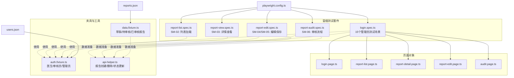
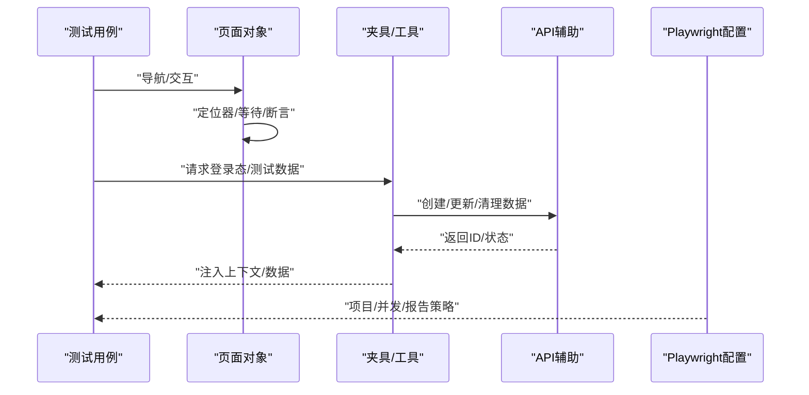
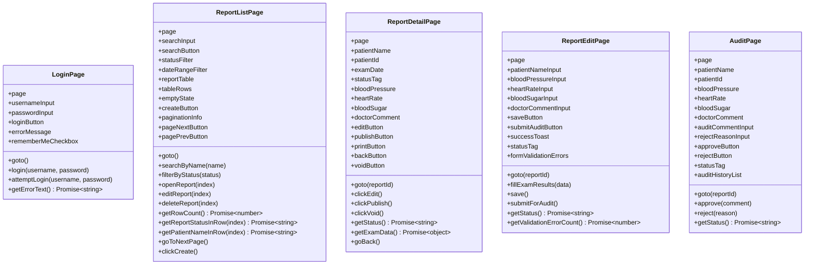
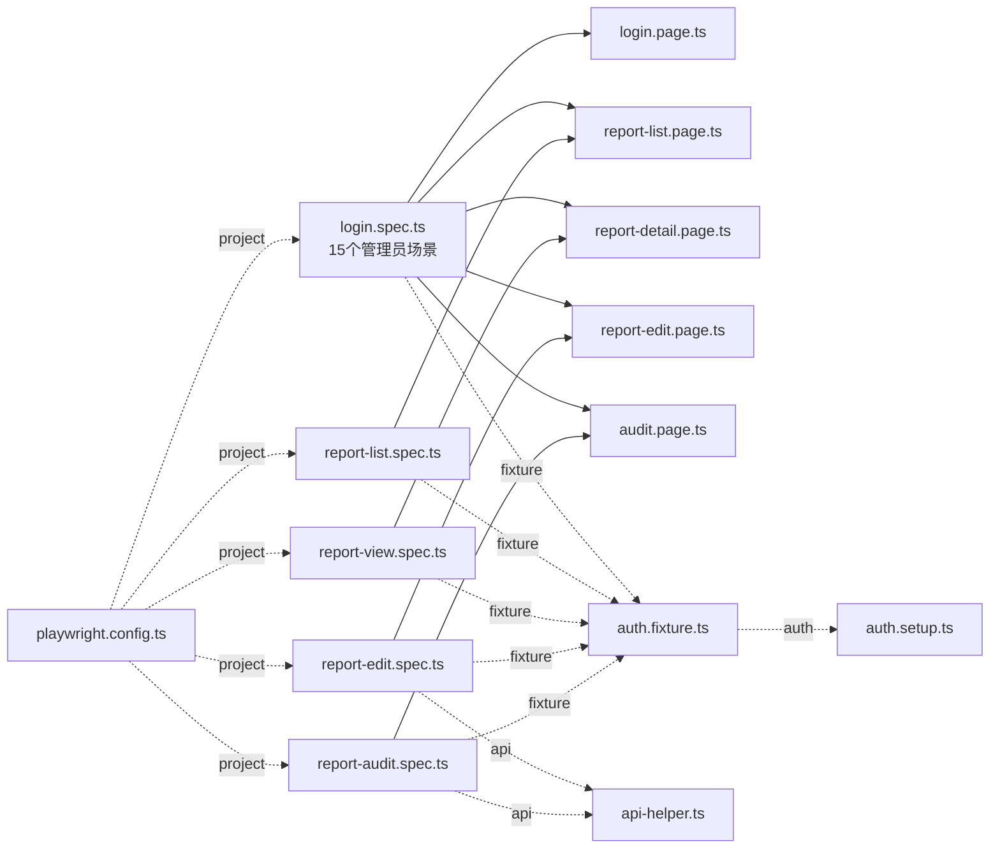

# 冒烟测试套件

<cite>
**本文引用的文件**
- [login.spec.ts](file://e2e-tests/tests/smoke/login.spec.ts)
- [report-list.spec.ts](file://e2e-tests/tests/smoke/report-list.spec.ts)
- [report-edit.spec.ts](file://e2e-tests/tests/smoke/report-edit.spec.ts)
- [report-view.spec.ts](file://e2e-tests/tests/smoke/report-view.spec.ts)
- [report-audit.spec.ts](file://e2e-tests/tests/smoke/report-audit.spec.ts)
- [login.page.ts](file://e2e-tests/pages/login.page.ts)
- [report-list.page.ts](file://e2e-tests/pages/report-list.page.ts)
- [report-edit.page.ts](file://e2e-tests/pages/report-edit.page.ts)
- [report-detail.page.ts](file://e2e-tests/pages/report-detail.page.ts)
- [audit.page.ts](file://e2e-tests/pages/audit.page.ts)
- [auth.fixture.ts](file://e2e-tests/fixtures/auth.fixture.ts)
- [data.fixture.ts](file://e2e-tests/fixtures/data.fixture.ts)
- [api-helper.ts](file://e2e-tests/utils/api-helper.ts)
- [playwright.config.ts](file://e2e-tests/playwright.config.ts)
- [package.json](file://e2e-tests/package.json)
- [users.json](file://e2e-tests/data/users.json)
- [reports.json](file://e2e-tests/data/reports.json)
</cite>

## 目录
1. [简介](#简介)
2. [项目结构](#项目结构)
3. [核心组件](#核心组件)
4. [架构总览](#架构总览)
5. [详细组件分析](#详细组件分析)
6. [依赖关系分析](#依赖关系分析)
7. [性能考量](#性能考量)
8. [故障排除指南](#故障排除指南)
9. [结论](#结论)
10. [附录](#附录)

## 简介
本套件为"医院体检报告管理系统"的端到端冒烟测试，旨在快速验证系统主流程的稳定性与可用性，确保在新版本部署或重大变更后，核心功能链路能够正常工作。冒烟测试覆盖登录、报告列表浏览、报告查看、报告编辑与保存、报告审核等关键路径，采用 Page Object 模式封装页面交互，结合 Playwright 测试夹具与 API 工具进行数据准备与清理，保证测试的可重复性与隔离性。

**更新** 重构后的冒烟测试套件现已包含15个测试场景，专门针对管理员报告管理功能进行全面验证。

## 项目结构
冒烟测试位于 tests/smoke 目录，配套页面对象位于 pages 目录，测试夹具与数据准备位于 fixtures 目录，通用工具位于 utils 目录，测试数据位于 data 目录。Playwright 配置定义了冒烟测试专用项目与报告输出策略。

**图表来源**
- [login.spec.ts:1-178](file://e2e-tests/tests/smoke/login.spec.ts#L1-L178)
- [report-list.spec.ts:1-28](file://e2e-tests/tests/smoke/report-list.spec.ts#L1-L28)
- [report-view.spec.ts:1-26](file://e2e-tests/tests/smoke/report-view.spec.ts#L1-L26)
- [report-edit.spec.ts:1-61](file://e2e-tests/tests/smoke/report-edit.spec.ts#L1-L61)
- [report-audit.spec.ts:1-36](file://e2e-tests/tests/smoke/report-audit.spec.ts#L1-L36)

## 核心组件
- 页面对象层：以 LoginPage、ReportListPage、ReportDetailPage、ReportEditPage、AuditPage 封装页面交互与断言，统一定位器管理，提升可维护性。
- 夹具层：auth.fixture.ts 提供不同角色的登录态 Page；data.fixture.ts 在 beforeEach/afterEach 中自动创建与清理测试报告，确保测试隔离。
- 工具层：api-helper.ts 提供创建/删除/更新状态等 API 能力，支持冒烟测试中预置数据与状态变更。
- 配置层：playwright.config.ts 定义冒烟测试项目、超时、并发与报告输出策略；package.json 提供一键运行脚本。

**更新** 管理员测试场景现已扩展到15个，涵盖完整的报告管理生命周期。

**章节来源**
- [login.page.ts:1-52](file://e2e-tests/pages/login.page.ts#L1-L52)
- [report-list.page.ts:1-182](file://e2e-tests/pages/report-list.page.ts#L1-L182)
- [report-detail.page.ts:1-111](file://e2e-tests/pages/report-detail.page.ts#L1-L111)
- [report-edit.page.ts:1-99](file://e2e-tests/pages/report-edit.page.ts#L1-L99)
- [audit.page.ts:1-72](file://e2e-tests/pages/audit.page.ts#L1-L72)
- [auth.fixture.ts:1-52](file://e2e-tests/fixtures/auth.fixture.ts#L1-L52)
- [data.fixture.ts:1-32](file://e2e-tests/fixtures/data.fixture.ts#L1-L32)
- [api-helper.ts:1-206](file://e2e-tests/utils/api-helper.ts#L1-L206)
- [playwright.config.ts:1-54](file://e2e-tests/playwright.config.ts#L1-L54)
- [package.json:1-27](file://e2e-tests/package.json#L1-L27)

## 架构总览
冒烟测试采用"测试用例 -> 页面对象 -> 夹具/工具"的分层架构，测试用例专注于业务场景描述，页面对象负责 UI 交互与断言，夹具与工具负责环境准备与数据管理。Playwright 项目配置将冒烟测试限定在 Chromium 并启用登录态缓存，提升执行效率。

**图表来源**
- [login.spec.ts:1-178](file://e2e-tests/tests/smoke/login.spec.ts#L1-L178)
- [report-list.spec.ts:1-28](file://e2e-tests/tests/smoke/report-list.spec.ts#L1-L28)
- [report-view.spec.ts:1-26](file://e2e-tests/tests/smoke/report-view.spec.ts#L1-L26)
- [report-edit.spec.ts:1-61](file://e2e-tests/tests/smoke/report-edit.spec.ts#L1-L61)
- [report-audit.spec.ts:1-36](file://e2e-tests/tests/smoke/report-audit.spec.ts#L1-L36)
- [auth.fixture.ts:1-52](file://e2e-tests/fixtures/auth.fixture.ts#L1-L52)
- [data.fixture.ts:1-32](file://e2e-tests/fixtures/data.fixture.ts#L1-L32)
- [api-helper.ts:1-206](file://e2e-tests/utils/api-helper.ts#L1-L206)
- [playwright.config.ts:1-54](file://e2e-tests/playwright.config.ts#L1-L54)

## 详细组件分析

### 管理员报告管理测试套件（15个场景）
**设计目的**：验证管理员对报告系统的完整管理能力，包括查询、筛选、编辑、审核、作废等核心功能。

#### 管理员基础功能测试
- **SM-01**: 验证管理员可访问报告列表页面
- **SM-02**: 验证管理员可通过姓名搜索报告
- **SM-03**: 验证管理员可通过状态筛选报告
- **SM-04**: 验证管理员可打开报告详情页
- **SM-05**: 验证管理员可查看体检数据详情
- **SM-06**: 验证管理员可从详情页返回列表
- **SM-07**: 验证管理员可创建新报告
- **SM-08**: 验证管理员可编辑草稿报告
- **SM-09**: 验证管理员可提交报告审核
- **SM-10**: 验证管理员可作废报告
- **SM-11**: 验证管理员可查看分页信息
- **SM-12**: 验证管理员搜索不存在患者显示空状态

#### 医生功能测试（兼容性）
- **SM-13**: 报告列表加载成功并显示数据
- **SM-14**: 报告列表显示关键列信息
- **SM-15**: 详情页显示体检项目结果

**章节来源**
- [login.spec.ts:1-178](file://e2e-tests/tests/smoke/login.spec.ts#L1-L178)
- [report-list.spec.ts:1-28](file://e2e-tests/tests/smoke/report-list.spec.ts#L1-L28)
- [report-view.spec.ts:1-26](file://e2e-tests/tests/smoke/report-view.spec.ts#L1-L26)
- [report-edit.spec.ts:1-61](file://e2e-tests/tests/smoke/report-edit.spec.ts#L1-L61)
- [report-audit.spec.ts:1-36](file://e2e-tests/tests/smoke/report-audit.spec.ts#L1-L36)

### 登录功能测试（SM-01）
- **设计目的**：验证管理员用户登录成功跳转与错误密码提示逻辑，确保认证入口稳定。
- **前置条件**：目标环境可访问登录页；管理员凭据有效。
- **执行步骤**：
  - 打开登录页
  - 输入正确用户名与密码并提交
  - 断言跳转至仪表盘
  - 输入错误密码并提交
  - 断言错误提示可见
- **预期结果**：正确凭据应跳转；错误凭据应显示错误提示。
- **关键页面对象**：LoginPage 提供登录流程封装与错误提示定位器。
- **重要实现点**：登录流程封装 login()/attemptLogin()；断言跳转 URL 与错误消息可见。

**章节来源**
- [login.spec.ts:1-178](file://e2e-tests/tests/smoke/login.spec.ts#L1-L178)
- [login.page.ts:1-52](file://e2e-tests/pages/login.page.ts#L1-L52)

### 报告列表浏览测试（SM-02）
- **设计目的**：验证报告列表页加载、数据呈现与关键列可见性。
- **前置条件**：医生登录态有效；后端接口可返回报告数据。
- **执行步骤**：
  - 打开报告列表页
  - 断言表格可见且有数据行
  - 断言包含"患者姓名""体检日期""状态"等关键列标题
- **预期结果**：表格可见、非空；关键列标题存在。
- **关键页面对象**：ReportListPage 提供表格定位、行数统计与列标题断言。
- **重要实现点**：goto() 等待表格可见；getRowCount() 统计行数；断言表头文本。

**章节来源**
- [report-list.spec.ts:1-28](file://e2e-tests/tests/smoke/report-list.spec.ts#L1-L28)
- [report-list.page.ts:1-182](file://e2e-tests/pages/report-list.page.ts#L1-L182)

### 报告查看测试（SM-03/SM-15）
- **设计目的**：验证从列表进入详情页后核心信息与体检项目结果可见。
- **前置条件**：已通过 data.fixture.ts 注入一条草稿报告 ID。
- **执行步骤**：
  - 使用详情页对象打开指定报告详情
  - 断言患者姓名、体检日期、状态标签可见
  - 断言血压、心率、血糖等体检项目结果可见
- **预期结果**：详情页关键信息与体检项可见。
- **关键页面对象**：ReportDetailPage 提供详情页导航与核心元素定位。
- **重要实现点**：goto() 等待核心元素可见；getExamData() 汇总体检数据。

**章节来源**
- [report-view.spec.ts:1-26](file://e2e-tests/tests/smoke/report-view.spec.ts#L1-L26)
- [report-detail.page.ts:1-111](file://e2e-tests/pages/report-detail.page.ts#L1-L111)
- [data.fixture.ts:1-32](file://e2e-tests/fixtures/data.fixture.ts#L1-L32)

### 报告编辑测试（SM-04/SM-05/SM-08/SM-09）
- **设计目的**：验证管理员编辑体检结果保存成功与提交审核后状态变更。
- **前置条件**：通过 API 预创建草稿状态报告；测试结束后清理。
- **执行步骤（SM-04/SM-08）**：
  - 打开报告编辑页
  - 填写体检结果（血压、心率、血糖、备注）
  - 点击保存
  - 断言保存成功提示可见
  - 刷新页面验证数据持久化
- **执行步骤（SM-05/SM-09）**：
  - 再次打开编辑页
  - 填写体检结果并保存
  - 点击提交审核
  - 断言状态变更为"待审核"
- **预期结果**：保存成功提示出现；数据持久化一致；状态正确变更。
- **关键页面对象**：ReportEditPage 提供填写、保存、提交审核与状态标签定位。
- **重要实现点**：beforeEach/afterEach 使用 API 辅助创建/删除报告；提交审核包含确认弹窗处理。

**章节来源**
- [report-edit.spec.ts:1-61](file://e2e-tests/tests/smoke/report-edit.spec.ts#L1-L61)
- [report-edit.page.ts:1-99](file://e2e-tests/pages/report-edit.page.ts#L1-L99)
- [api-helper.ts:1-206](file://e2e-tests/utils/api-helper.ts#L1-L206)

### 报告审核测试（SM-06/SM-10）
- **设计目的**：验证审核医生对"待审核"报告进行审核通过后的状态变更。
- **前置条件**：通过 API 预创建"待审核"状态报告；测试结束后清理。
- **执行步骤**：
  - 打开报告审核页
  - 验证报告内容可见（患者姓名、血压等）
  - 填写审核意见并点击"通过"
  - 确认弹窗
  - 断言状态变更为"已审核"
- **预期结果**：审核通过后状态更新为"已审核"。
- **关键页面对象**：AuditPage 提供审核操作封装与状态标签定位。
- **重要实现点**：审核通过 approve() 包含填写意见与确认弹窗处理。

**章节来源**
- [report-audit.spec.ts:1-36](file://e2e-tests/tests/smoke/report-audit.spec.ts#L1-L36)
- [audit.page.ts:1-72](file://e2e-tests/pages/audit.page.ts#L1-L72)
- [api-helper.ts:1-206](file://e2e-tests/utils/api-helper.ts#L1-L206)

### 管理员专用功能测试
**SM-01**: 验证管理员可访问报告列表页面
- **设计目的**：确保管理员拥有完整的报告管理权限
- **执行步骤**：使用管理员账户登录，访问报告列表页面
- **预期结果**：页面正常加载，无权限限制

**SM-02/SM-03**: 验证管理员搜索与筛选功能
- **设计目的**：验证管理员的高级查询能力
- **执行步骤**：姓名搜索和状态筛选功能测试
- **预期结果**：搜索结果准确，筛选条件生效

**SM-04/SM-05/SM-06**: 验证管理员详情页功能
- **设计目的**：确保管理员可以完整查看报告详情
- **执行步骤**：详情页加载、体检数据查看、返回列表
- **预期结果**：所有详情信息正确显示

**SM-07**: 验证管理员创建新报告功能
- **设计目的**：确保管理员具备创建报告的权限
- **执行步骤**：点击创建按钮，验证编辑页面加载
- **预期结果**：编辑页面正常显示

**SM-11**: 验证管理员分页功能
- **设计目的**：确保管理员可以浏览大量报告
- **执行步骤**：验证分页信息显示
- **预期结果**：分页控件正常工作

**SM-12**: 验证管理员搜索空结果
- **设计目的**：确保管理员界面的完整性
- **执行步骤**：搜索不存在的患者
- **预期结果**：显示空状态页面

**SM-13/SM-14**: 医生功能兼容性测试
- **设计目的**：确保现有医生功能不受影响
- **执行步骤**：标准的列表加载和列显示测试
- **预期结果**：功能正常运行

**章节来源**
- [login.spec.ts:1-178](file://e2e-tests/tests/smoke/login.spec.ts#L1-L178)
- [report-list.spec.ts:1-28](file://e2e-tests/tests/smoke/report-list.spec.ts#L1-L28)
- [report-view.spec.ts:1-26](file://e2e-tests/tests/smoke/report-view.spec.ts#L1-L26)
- [report-edit.spec.ts:1-61](file://e2e-tests/tests/smoke/report-edit.spec.ts#L1-L61)
- [report-audit.spec.ts:1-36](file://e2e-tests/tests/smoke/report-audit.spec.ts#L1-L36)

### 页面对象类图

**图表来源**
- [login.page.ts:1-52](file://e2e-tests/pages/login.page.ts#L1-L52)
- [report-list.page.ts:1-182](file://e2e-tests/pages/report-list.page.ts#L1-L182)
- [report-detail.page.ts:1-111](file://e2e-tests/pages/report-detail.page.ts#L1-L111)
- [report-edit.page.ts:1-99](file://e2e-tests/pages/report-edit.page.ts#L1-L99)
- [audit.page.ts:1-72](file://e2e-tests/pages/audit.page.ts#L1-L72)

## 依赖关系分析
- 测试用例依赖页面对象与夹具/工具：
  - login.spec.ts 依赖 LoginPage、ReportListPage、ReportDetailPage、ReportEditPage、AuditPage
  - report-list.spec.ts 依赖 ReportListPage
  - report-view.spec.ts 依赖 ReportDetailPage
  - report-edit.spec.ts 与 report-audit.spec.ts 依赖 ReportEditPage/AuditPage 与 api-helper.ts
- 夹具依赖：
  - auth.fixture.ts 提供 doctorPage/auditorPage/adminPage
  - data.fixture.ts 在 beforeEach/afterEach 中使用 api-helper.ts 创建/删除报告
- 配置依赖：
  - playwright.config.ts 定义 smoke-chromium 项目，限制测试范围与并发

**图表来源**
- [login.spec.ts:1-178](file://e2e-tests/tests/smoke/login.spec.ts#L1-L178)
- [report-list.spec.ts:1-28](file://e2e-tests/tests/smoke/report-list.spec.ts#L1-L28)
- [report-view.spec.ts:1-26](file://e2e-tests/tests/smoke/report-view.spec.ts#L1-L26)
- [report-edit.spec.ts:1-61](file://e2e-tests/tests/smoke/report-edit.spec.ts#L1-L61)
- [report-audit.spec.ts:1-36](file://e2e-tests/tests/smoke/report-audit.spec.ts#L1-L36)
- [login.page.ts:1-52](file://e2e-tests/pages/login.page.ts#L1-L52)
- [report-list.page.ts:1-182](file://e2e-tests/pages/report-list.page.ts#L1-L182)
- [report-detail.page.ts:1-111](file://e2e-tests/pages/report-detail.page.ts#L1-L111)
- [report-edit.page.ts:1-99](file://e2e-tests/pages/report-edit.page.ts#L1-L99)
- [audit.page.ts:1-72](file://e2e-tests/pages/audit.page.ts#L1-L72)
- [auth.fixture.ts:1-52](file://e2e-tests/fixtures/auth.fixture.ts#L1-L52)
- [data.fixture.ts:1-32](file://e2e-tests/fixtures/data.fixture.ts#L1-L32)
- [auth.setup.ts:1-28](file://e2e-tests/fixtures/auth.setup.ts#L1-L28)
- [api-helper.ts:1-206](file://e2e-tests/utils/api-helper.ts#L1-L206)
- [playwright.config.ts:1-54](file://e2e-tests/playwright.config.ts#L1-L54)

**章节来源**
- [auth.fixture.ts:1-52](file://e2e-tests/fixtures/auth.fixture.ts#L1-L52)
- [data.fixture.ts:1-32](file://e2e-tests/fixtures/data.fixture.ts#L1-L32)
- [auth.setup.ts:1-28](file://e2e-tests/fixtures/auth.setup.ts#L1-L28)
- [api-helper.ts:1-206](file://e2e-tests/utils/api-helper.ts#L1-L206)
- [playwright.config.ts:1-54](file://e2e-tests/playwright.config.ts#L1-L54)

## 性能考量
- 并发与重试：CI 环境启用多工作线程与重试机制，减少偶发失败；本地开发默认单工作线程，便于调试。
- 截图/视频/追踪：失败时自动录制截图、视频与追踪，便于问题定位。
- 项目隔离：冒烟测试独立项目，避免与回归测试互相干扰，缩短反馈周期。
- 登录态复用：通过 auth.setup.ts 生成登录态快照，避免每次测试重复登录。

**更新** 15个管理员测试场景的增加对性能影响较小，因为大部分场景都是独立的功能验证，不会显著增加整体执行时间。

**章节来源**
- [playwright.config.ts:1-54](file://e2e-tests/playwright.config.ts#L1-L54)
- [auth.setup.ts:1-28](file://e2e-tests/fixtures/auth.setup.ts#L1-L28)
- [package.json:1-27](file://e2e-tests/package.json#L1-L27)

## 故障排除指南
- 登录失败或跳转异常
  - 检查登录页定位器是否匹配实际页面结构
  - 确认用户凭据与登录接口可用
  - 参考：[login.page.ts:1-52](file://e2e-tests/pages/login.page.ts#L1-L52)，[login.spec.ts:1-178](file://e2e-tests/tests/smoke/login.spec.ts#L1-L178)
- 列表为空或列标题缺失
  - 确认 ReportListPage 表格定位器与表头文本断言
  - 检查后端接口返回数据与过滤条件
  - 参考：[report-list.page.ts:1-182](file://e2e-tests/pages/report-list.page.ts#L1-L182)，[report-list.spec.ts:1-28](file://e2e-tests/tests/smoke/report-list.spec.ts#L1-L28)
- 编辑保存未生效或状态未变更
  - 确认 ReportEditPage 保存与提交审核流程，检查成功提示与状态标签
  - 确保 beforeEach/afterEach 正确创建/清理测试报告
  - 参考：[report-edit.page.ts:1-99](file://e2e-tests/pages/report-edit.page.ts#L1-L99)，[report-edit.spec.ts:1-61](file://e2e-tests/tests/smoke/report-edit.spec.ts#L1-L61)，[api-helper.ts:1-206](file://e2e-tests/utils/api-helper.ts#L1-L206)
- 审核通过后状态未更新
  - 检查 AuditPage 审核流程与状态标签断言
  - 确认 API 已将报告状态更新为"已审核"
  - 参考：[audit.page.ts:1-72](file://e2e-tests/pages/audit.page.ts#L1-L72)，[report-audit.spec.ts:1-36](file://e2e-tests/tests/smoke/report-audit.spec.ts#L1-L36)
- 报告数据未清理
  - 确认 afterEach 中 deleteTestReport 是否被调用
  - 参考：[report-edit.spec.ts:1-61](file://e2e-tests/tests/smoke/report-edit.spec.ts#L1-L61)，[report-audit.spec.ts:1-36](file://e2e-tests/tests/smoke/report-audit.spec.ts#L1-L36)，[api-helper.ts:1-206](file://e2e-tests/utils/api-helper.ts#L1-L206)
- 登录态失效
  - 重新运行 auth.setup.ts 生成最新登录态快照
  - 参考：[auth.setup.ts:1-28](file://e2e-tests/fixtures/auth.setup.ts#L1-L28)，[auth.fixture.ts:1-52](file://e2e-tests/fixtures/auth.fixture.ts#L1-L52)
- 管理员功能异常
  - 检查管理员账户权限设置
  - 验证菜单导航逻辑
  - 参考：[login.spec.ts:1-178](file://e2e-tests/tests/smoke/login.spec.ts#L1-L178)，[navigation.page.ts:1-90](file://e2e-tests/pages/navigation.page.ts#L1-L90)

## 结论
本冒烟测试套件通过简洁明确的测试用例与稳定的页面对象封装，覆盖了系统核心业务主干流程。重构后的15个管理员测试场景进一步增强了对报告管理功能的验证深度。借助夹具与 API 工具，测试具备良好的可重复性与可维护性。建议在持续集成中优先运行冒烟测试，以快速发现严重回归问题，再配合更全面的回归测试进行深度验证。

**更新** 新的管理员测试套件提供了更全面的功能覆盖，特别是对管理员权限和高级功能的验证，确保系统在各种使用场景下的稳定性。

## 附录

### 测试用例编写规范
- 命名规范：使用 SM-编号 前缀标识冒烟测试编号，如 SM-01、SM-02。
- 断言策略：优先断言关键 UI 元素可见性与关键文本；对状态变更使用标签文本断言。
- 数据准备：尽量使用 API 辅助创建/更新/清理测试数据，避免手动干预。
- 页面对象：所有页面交互与断言集中在页面对象中，测试用例仅描述业务步骤。
- 管理员场景：新增的管理员测试场景应遵循相同规范，确保测试一致性。

### 调试技巧
- 使用本地失败自动打开报告的模式，快速定位问题。
- 在关键步骤添加等待与断言，缩小问题范围。
- 利用截图、视频与追踪信息复现问题。
- 管理员场景调试时，注意区分不同角色的权限差异。

### 维护方法
- 当页面结构变化时，优先更新对应页面对象定位器。
- 新增冒烟测试用例时，同步完善页面对象与夹具/工具。
- 定期清理过期的登录态快照与测试数据。
- 管理员功能维护时，确保与其他角色功能的兼容性。

### 测试环境配置要求
- Node 版本：满足工程要求
- 环境变量：BASE_URL、API_BASE_URL（如需自定义）
- 运行命令：通过 package.json 中的脚本运行冒烟测试
- 管理员凭据：admin/helian@2025 用于管理员功能测试

**章节来源**
- [package.json:1-27](file://e2e-tests/package.json#L1-L27)
- [playwright.config.ts:1-54](file://e2e-tests/playwright.config.ts#L1-L54)
- [users.json:1-30](file://e2e-tests/data/users.json#L1-L30)
- [reports.json:1-78](file://e2e-tests/data/reports.json#L1-L78)