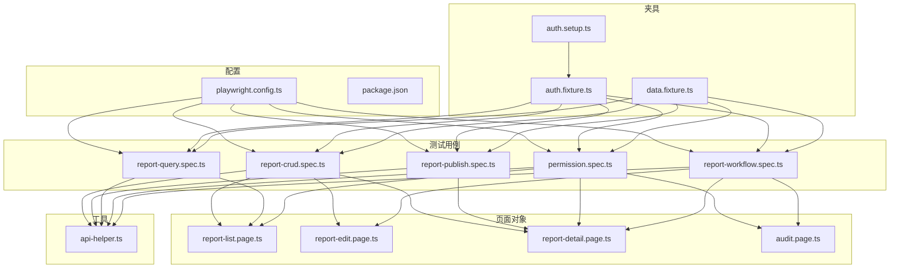
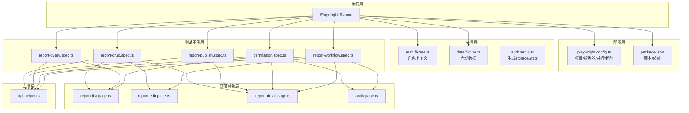
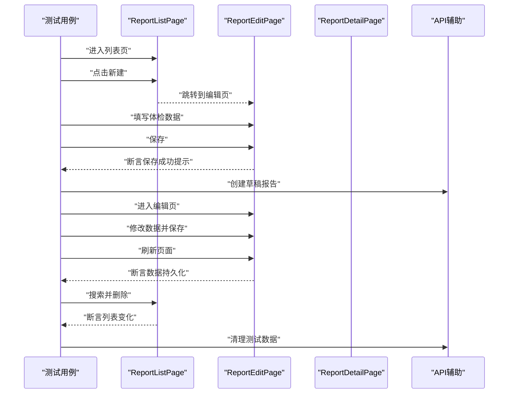
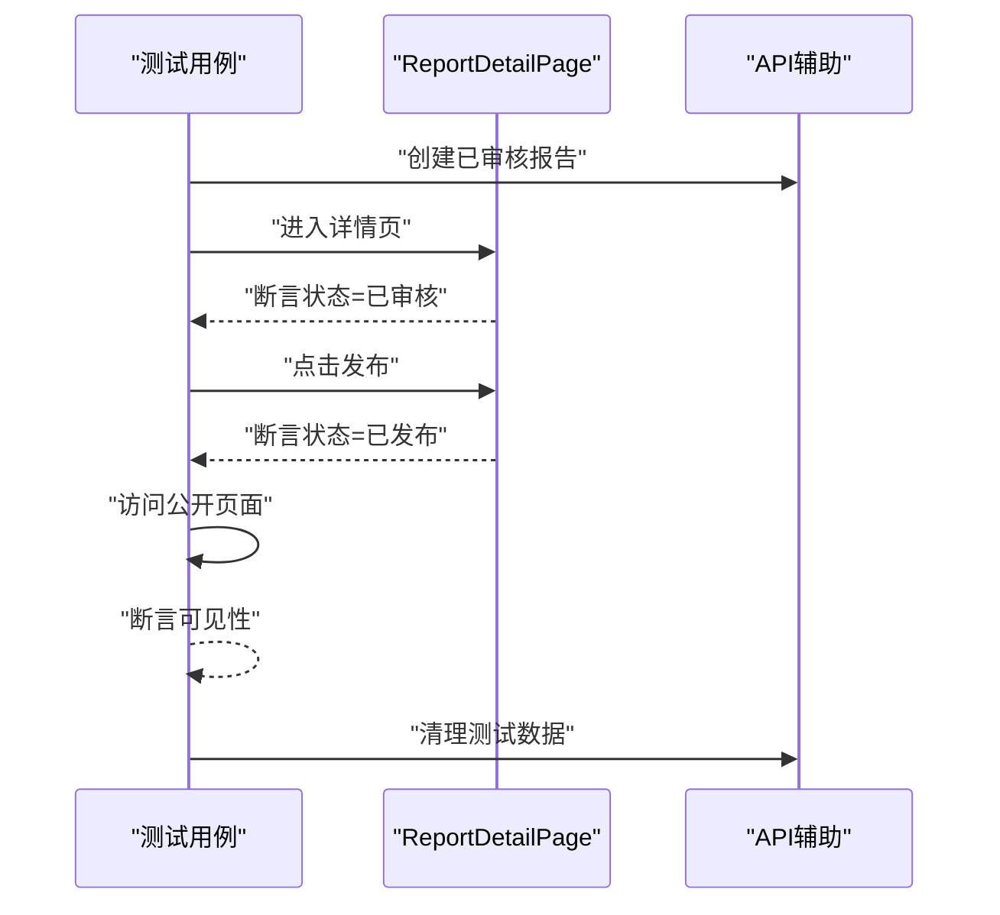
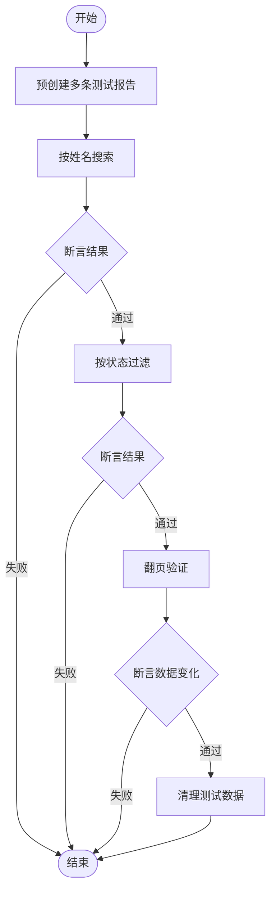
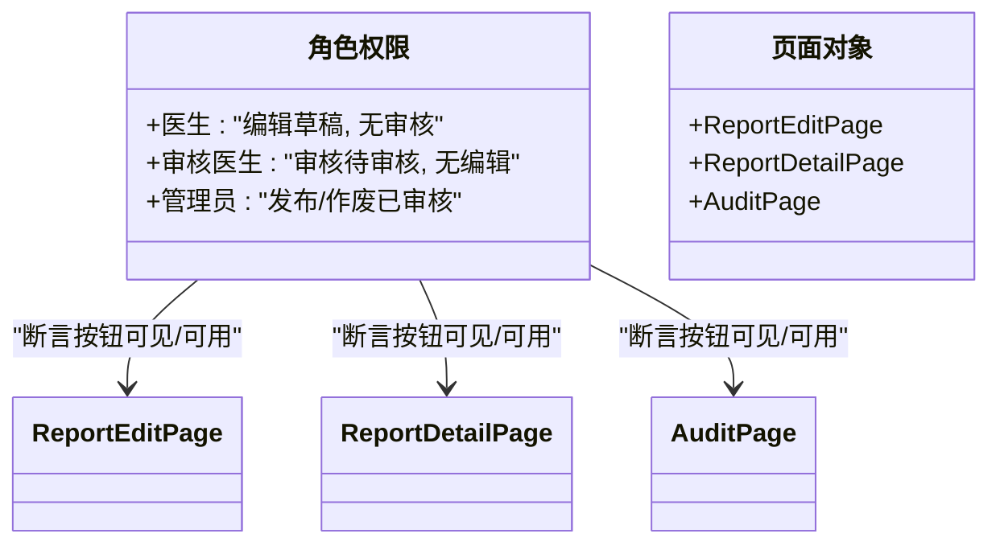
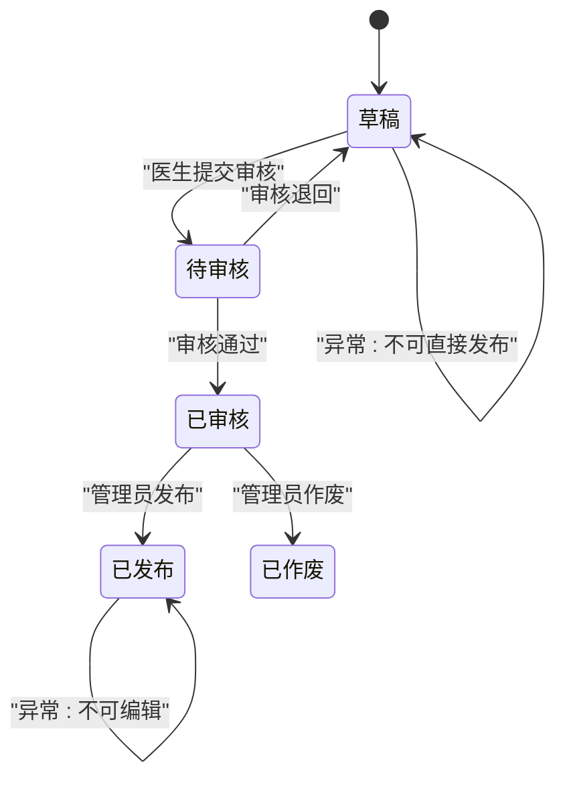
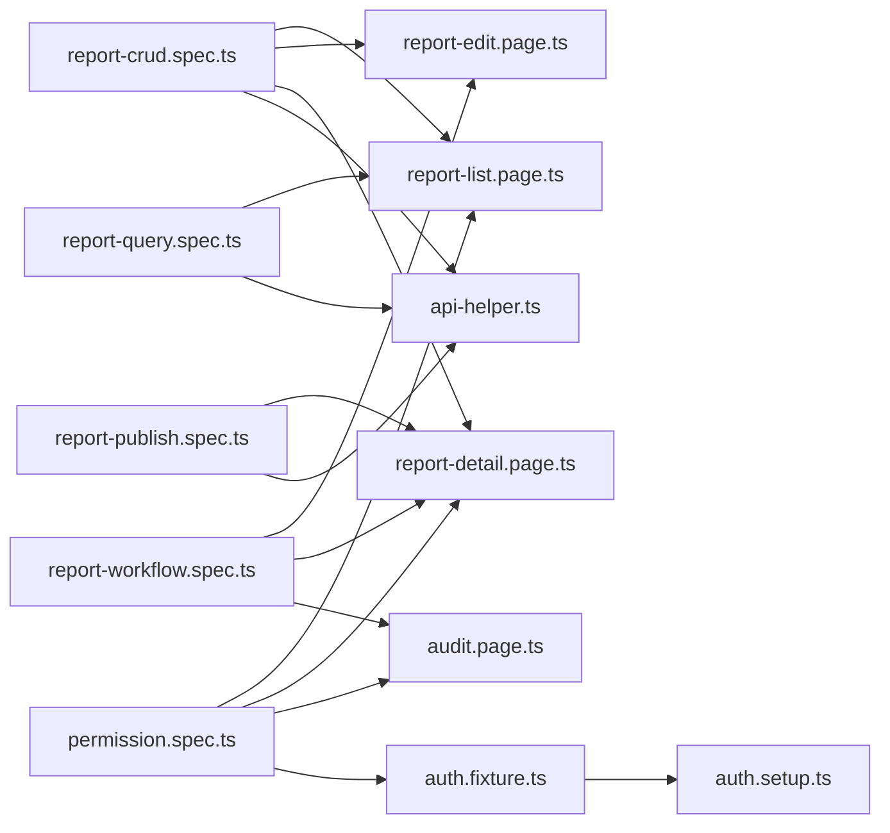

# 回归测试套件

<cite>
**本文档引用的文件**
- [playwright.config.ts](file://e2e-tests/playwright.config.ts)
- [package.json](file://e2e-tests/package.json)
- [report-crud.spec.ts](file://e2e-tests/tests/regression/report-crud.spec.ts)
- [report-publish.spec.ts](file://e2e-tests/tests/regression/report-publish.spec.ts)
- [report-query.spec.ts](file://e2e-tests/tests/regression/report-query.spec.ts)
- [permission.spec.ts](file://e2e-tests/tests/regression/permission.spec.ts)
- [report-workflow.spec.ts](file://e2e-tests/tests/regression/report-workflow.spec.ts)
- [auth.fixture.ts](file://e2e-tests/fixtures/auth.fixture.ts)
- [data.fixture.ts](file://e2e-tests/fixtures/data.fixture.ts)
- [auth.setup.ts](file://e2e-tests/fixtures/auth.setup.ts)
- [api-helper.ts](file://e2e-tests/utils/api-helper.ts)
- [report-list.page.ts](file://e2e-tests/pages/report-list.page.ts)
- [report-edit.page.ts](file://e2e-tests/pages/report-edit.page.ts)
- [report-detail.page.ts](file://e2e-tests/pages/report-detail.page.ts)
- [audit.page.ts](file://e2e-tests/pages/audit.page.ts)
</cite>

## 目录
1. [简介](#简介)
2. [项目结构](#项目结构)
3. [核心组件](#核心组件)
4. [架构总览](#架构总览)
5. [详细组件分析](#详细组件分析)
6. [依赖分析](#依赖分析)
7. [性能考虑](#性能考虑)
8. [故障排查指南](#故障排查指南)
9. [结论](#结论)
10. [附录](#附录)

## 简介
本文件系统性梳理回归测试套件的设计理念、覆盖范围与实现细节，重点围绕以下五个维度展开：
- 报告 CRUD 操作测试：涵盖创建、编辑、删除、保存草稿等核心流程
- 报告发布流程测试：覆盖发布与公开查看的端到端验证
- 报告查询功能测试：包括按姓名搜索、状态过滤、分页等
- 权限控制测试：验证不同角色对报告的不同操作能力
- 报告工作流测试：验证从草稿到发布的正向与逆向状态流转

同时，文档解释测试用例之间的依赖关系与执行优先级，提供测试数据准备、环境配置与结果分析方法，并总结最佳实践与性能优化建议。

## 项目结构
回归测试采用 Playwright 测试框架，按“测试用例 + 页面对象 + 夹具 + 工具函数”的分层组织方式：
- tests/regression：回归测试用例集合，按功能域划分具体 spec 文件
- pages：页面对象模型（POM），封装页面交互与断言
- fixtures：登录态夹具与数据夹具，统一注入不同角色的页面上下文
- utils：API 辅助工具，负责测试数据准备与清理
- playwright.config.ts：全局配置，定义项目、报告器、超时与并行策略

图表来源
- [playwright.config.ts:1-68](file://e2e-tests/playwright.config.ts#L1-L68)
- [report-crud.spec.ts:1-122](file://e2e-tests/tests/regression/report-crud.spec.ts#L1-L122)
- [report-publish.spec.ts:1-100](file://e2e-tests/tests/regression/report-publish.spec.ts#L1-L100)
- [report-query.spec.ts:1-122](file://e2e-tests/tests/regression/report-query.spec.ts#L1-L122)
- [permission.spec.ts:1-102](file://e2e-tests/tests/regression/permission.spec.ts#L1-L102)
- [report-workflow.spec.ts:1-138](file://e2e-tests/tests/regression/report-workflow.spec.ts#L1-L138)
- [auth.fixture.ts:1-40](file://e2e-tests/fixtures/auth.fixture.ts#L1-L40)
- [data.fixture.ts:1-57](file://e2e-tests/fixtures/data.fixture.ts#L1-L57)
- [auth.setup.ts:1-28](file://e2e-tests/fixtures/auth.setup.ts#L1-L28)
- [api-helper.ts:1-172](file://e2e-tests/utils/api-helper.ts#L1-L172)
- [report-list.page.ts:1-130](file://e2e-tests/pages/report-list.page.ts#L1-L130)
- [report-edit.page.ts:1-94](file://e2e-tests/pages/report-edit.page.ts#L1-L94)
- [report-detail.page.ts:1-107](file://e2e-tests/pages/report-detail.page.ts#L1-L107)
- [audit.page.ts:1-72](file://e2e-tests/pages/audit.page.ts#L1-L72)

章节来源
- [playwright.config.ts:1-68](file://e2e-tests/playwright.config.ts#L1-L68)
- [package.json:1-27](file://e2e-tests/package.json#L1-L27)

## 核心组件
- 测试配置与项目管理
  - 通过 playwright.config.ts 定义测试目录、超时、并行度、报告器与项目划分
  - package.json 提供脚本命令与依赖声明
- 页面对象模型（POM）
  - report-list.page.ts：封装列表页搜索、过滤、分页、删除等交互
  - report-edit.page.ts：封装编辑页填写体检数据、保存、提交审核等交互
  - report-detail.page.ts：封装详情页状态、发布、作废等交互
  - audit.page.ts：封装审核页通过/退回、状态变更等交互
- 夹具
  - auth.fixture.ts：为不同角色（医生、审核医生、管理员）注入独立的浏览器上下文与登录态
  - data.fixture.ts：自动创建并清理不同状态的测试报告，简化用例编写
  - auth.setup.ts：登录并生成各角色的 storageState 文件，供后续项目复用
- 工具函数
  - api-helper.ts：提供创建/删除/更新状态/查询报告等 API 封装，统一认证与请求上下文

章节来源
- [playwright.config.ts:1-68](file://e2e-tests/playwright.config.ts#L1-L68)
- [auth.fixture.ts:1-40](file://e2e-tests/fixtures/auth.fixture.ts#L1-L40)
- [data.fixture.ts:1-57](file://e2e-tests/fixtures/data.fixture.ts#L1-L57)
- [auth.setup.ts:1-28](file://e2e-tests/fixtures/auth.setup.ts#L1-L28)
- [api-helper.ts:1-172](file://e2e-tests/utils/api-helper.ts#L1-L172)
- [report-list.page.ts:1-130](file://e2e-tests/pages/report-list.page.ts#L1-L130)
- [report-edit.page.ts:1-94](file://e2e-tests/pages/report-edit.page.ts#L1-L94)
- [report-detail.page.ts:1-107](file://e2e-tests/pages/report-detail.page.ts#L1-L107)
- [audit.page.ts:1-72](file://e2e-tests/pages/audit.page.ts#L1-L72)

## 架构总览
回归测试整体采用“配置驱动 + POM + 夹具 + API 工具”的架构，确保：
- 可维护性：页面交互与断言集中在 POM，降低重复代码
- 可扩展性：新增页面只需扩展对应 POM，测试用例无需改动定位器
- 可靠性：通过 API 工具统一准备/清理测试数据，避免 UI 干扰
- 可重复性：夹具保证不同角色的登录态一致且可复用

图表来源
- [playwright.config.ts:1-68](file://e2e-tests/playwright.config.ts#L1-L68)
- [package.json:1-27](file://e2e-tests/package.json#L1-L27)
- [auth.fixture.ts:1-40](file://e2e-tests/fixtures/auth.fixture.ts#L1-L40)
- [data.fixture.ts:1-57](file://e2e-tests/fixtures/data.fixture.ts#L1-L57)
- [auth.setup.ts:1-28](file://e2e-tests/fixtures/auth.setup.ts#L1-L28)
- [report-crud.spec.ts:1-122](file://e2e-tests/tests/regression/report-crud.spec.ts#L1-L122)
- [report-publish.spec.ts:1-100](file://e2e-tests/tests/regression/report-publish.spec.ts#L1-L100)
- [report-query.spec.ts:1-122](file://e2e-tests/tests/regression/report-query.spec.ts#L1-L122)
- [permission.spec.ts:1-102](file://e2e-tests/tests/regression/permission.spec.ts#L1-L102)
- [report-workflow.spec.ts:1-138](file://e2e-tests/tests/regression/report-workflow.spec.ts#L1-L138)
- [api-helper.ts:1-172](file://e2e-tests/utils/api-helper.ts#L1-L172)
- [report-list.page.ts:1-130](file://e2e-tests/pages/report-list.page.ts#L1-L130)
- [report-edit.page.ts:1-94](file://e2e-tests/pages/report-edit.page.ts#L1-L94)
- [report-detail.page.ts:1-107](file://e2e-tests/pages/report-detail.page.ts#L1-L107)
- [audit.page.ts:1-72](file://e2e-tests/pages/audit.page.ts#L1-L72)

## 详细组件分析

### 报告 CRUD 操作测试
- 设计理念
  - 以“医生”角色为主线，覆盖创建、编辑、删除、保存草稿等典型场景
  - 通过 beforeEach/afterEach 在每个子测试前后自动准备/清理测试数据，确保隔离性
- 关键流程
  - 创建：进入列表页 → 点击新建 → 填写体检数据 → 保存 → 断言成功提示
  - 编辑：通过 API 创建草稿 → 进入编辑页 → 修改部分数据 → 保存 → 刷新验证持久化
  - 删除：搜索目标患者 → 点击删除 → 确认 → 断言列表行数变化或空状态
  - 保存草稿：仅填写部分项目 → 保存 → 断言成功与未填项为空
- 依赖关系
  - 依赖 report-list.page.ts、report-edit.page.ts、report-detail.page.ts
  - 依赖 api-helper.ts 的 createTestReport/deleteTestReport
- 执行优先级
  - 各子测试相互独立，可并行执行；但同一测试组内存在 before/after 钩子顺序约束

图表来源
- [report-crud.spec.ts:1-122](file://e2e-tests/tests/regression/report-crud.spec.ts#L1-L122)
- [report-list.page.ts:1-130](file://e2e-tests/pages/report-list.page.ts#L1-L130)
- [report-edit.page.ts:1-94](file://e2e-tests/pages/report-edit.page.ts#L1-L94)
- [report-detail.page.ts:1-107](file://e2e-tests/pages/report-detail.page.ts#L1-L107)
- [api-helper.ts:1-172](file://e2e-tests/utils/api-helper.ts#L1-L172)

章节来源
- [report-crud.spec.ts:1-122](file://e2e-tests/tests/regression/report-crud.spec.ts#L1-L122)
- [report-edit.page.ts:1-94](file://e2e-tests/pages/report-edit.page.ts#L1-L94)
- [report-list.page.ts:1-130](file://e2e-tests/pages/report-list.page.ts#L1-L130)
- [api-helper.ts:1-172](file://e2e-tests/utils/api-helper.ts#L1-L172)

### 报告发布流程测试
- 设计理念
  - 验证“已审核 → 已发布”的发布流程与公开页面的可见性
  - 区分已发布与未发布报告在公开页面的访问行为
- 关键流程
  - 发布：进入详情页 → 状态为“已审核” → 点击发布 → 断言状态变更为“已发布”
  - 查看：访问公开链接 → 断言患者信息与体检数据可见
  - 不可访问：访问未发布报告的公开链接 → 断言 403/404 或不可访问提示
- 依赖关系
  - 依赖 report-detail.page.ts 与公开页面路由
  - 依赖 api-helper.ts 的 createTestReport/deleteTestReport

图表来源
- [report-publish.spec.ts:1-100](file://e2e-tests/tests/regression/report-publish.spec.ts#L1-L100)
- [report-detail.page.ts:1-107](file://e2e-tests/pages/report-detail.page.ts#L1-L107)
- [api-helper.ts:1-172](file://e2e-tests/utils/api-helper.ts#L1-L172)

章节来源
- [report-publish.spec.ts:1-100](file://e2e-tests/tests/regression/report-publish.spec.ts#L1-L100)
- [report-detail.page.ts:1-107](file://e2e-tests/pages/report-detail.page.ts#L1-L107)
- [api-helper.ts:1-172](file://e2e-tests/utils/api-helper.ts#L1-L172)

### 报告查询功能测试
- 设计理念
  - 通过预创建多条不同状态/姓名的报告，验证搜索、过滤与分页的正确性
- 关键流程
  - 搜索：输入姓名关键字 → 断言结果集均包含关键字
  - 过滤：选择状态选项 → 断言结果集中状态一致
  - 分页：记录第一页首行 → 点击下一页 → 断言首行变化
- 依赖关系
  - 依赖 report-list.page.ts 的搜索、过滤、分页接口
  - 依赖 api-helper.ts 的批量创建与清理

图表来源
- [report-query.spec.ts:1-122](file://e2e-tests/tests/regression/report-query.spec.ts#L1-L122)
- [report-list.page.ts:1-130](file://e2e-tests/pages/report-list.page.ts#L1-L130)
- [api-helper.ts:1-172](file://e2e-tests/utils/api-helper.ts#L1-L172)

章节来源
- [report-query.spec.ts:1-122](file://e2e-tests/tests/regression/report-query.spec.ts#L1-L122)
- [report-list.page.ts:1-130](file://e2e-tests/pages/report-list.page.ts#L1-L130)
- [api-helper.ts:1-172](file://e2e-tests/utils/api-helper.ts#L1-L172)

### 权限控制测试
- 设计理念
  - 验证不同角色对报告的操作权限差异：医生、审核医生、管理员
- 关键流程
  - 医生：可编辑自己创建的草稿；无审核按钮
  - 审核医生：可审核待审核报告；编辑按钮不可用
  - 管理员：可发布/作废已审核报告
- 依赖关系
  - 依赖 auth.fixture.ts 注入的角色上下文
  - 依赖 report-edit.page.ts、report-detail.page.ts、audit.page.ts 的按钮可见性/可用性断言

图表来源
- [permission.spec.ts:1-102](file://e2e-tests/tests/regression/permission.spec.ts#L1-L102)
- [auth.fixture.ts:1-40](file://e2e-tests/fixtures/auth.fixture.ts#L1-L40)
- [report-edit.page.ts:1-94](file://e2e-tests/pages/report-edit.page.ts#L1-L94)
- [report-detail.page.ts:1-107](file://e2e-tests/pages/report-detail.page.ts#L1-L107)
- [audit.page.ts:1-72](file://e2e-tests/pages/audit.page.ts#L1-L72)

章节来源
- [permission.spec.ts:1-102](file://e2e-tests/tests/regression/permission.spec.ts#L1-L102)
- [auth.fixture.ts:1-40](file://e2e-tests/fixtures/auth.fixture.ts#L1-L40)
- [report-edit.page.ts:1-94](file://e2e-tests/pages/report-edit.page.ts#L1-L94)
- [report-detail.page.ts:1-107](file://e2e-tests/pages/report-detail.page.ts#L1-L107)
- [audit.page.ts:1-72](file://e2e-tests/pages/audit.page.ts#L1-L72)

### 报告工作流测试
- 设计理念
  - 验证正向与逆向状态流转：草稿 → 待审核 → 已审核 → 已发布；以及退回与作废
  - 异常场景：禁止直接发布草稿、已发布不可编辑
- 关键流程
  - 正向：医生提交审核 → 审核医生通过 → 管理员发布
  - 逆向：审核退回至草稿；管理员作废至已作废
  - 异常：断言按钮不可见或禁用
- 依赖关系
  - 依赖 report-edit.page.ts、report-detail.page.ts、audit.page.ts 的状态标签与按钮断言

图表来源
- [report-workflow.spec.ts:1-138](file://e2e-tests/tests/regression/report-workflow.spec.ts#L1-L138)
- [report-edit.page.ts:1-94](file://e2e-tests/pages/report-edit.page.ts#L1-L94)
- [report-detail.page.ts:1-107](file://e2e-tests/pages/report-detail.page.ts#L1-L107)
- [audit.page.ts:1-72](file://e2e-tests/pages/audit.page.ts#L1-L72)

章节来源
- [report-workflow.spec.ts:1-138](file://e2e-tests/tests/regression/report-workflow.spec.ts#L1-L138)
- [report-edit.page.ts:1-94](file://e2e-tests/pages/report-edit.page.ts#L1-L94)
- [report-detail.page.ts:1-107](file://e2e-tests/pages/report-detail.page.ts#L1-L107)
- [audit.page.ts:1-72](file://e2e-tests/pages/audit.page.ts#L1-L72)

## 依赖分析
- 组件耦合与内聚
  - 测试用例与页面对象强内聚，通过 POM 解耦 UI 变更对用例的影响
  - 夹具与工具函数提供高内聚的数据准备与登录态注入
- 直接与间接依赖
  - 测试用例直接依赖 POM 与工具函数
  - POM 依赖 Playwright Page/Locator，间接依赖 DOM 结构
  - 夹具依赖 auth.setup.ts 生成的 storageState
- 执行依赖
  - playwright.config.ts 的 projects 定义了“setup”前置任务，所有回归项目依赖该任务完成登录态准备

图表来源
- [playwright.config.ts:31-66](file://e2e-tests/playwright.config.ts#L31-L66)
- [report-crud.spec.ts:1-122](file://e2e-tests/tests/regression/report-crud.spec.ts#L1-L122)
- [report-publish.spec.ts:1-100](file://e2e-tests/tests/regression/report-publish.spec.ts#L1-L100)
- [report-query.spec.ts:1-122](file://e2e-tests/tests/regression/report-query.spec.ts#L1-L122)
- [permission.spec.ts:1-102](file://e2e-tests/tests/regression/permission.spec.ts#L1-L102)
- [report-workflow.spec.ts:1-138](file://e2e-tests/tests/regression/report-workflow.spec.ts#L1-L138)
- [auth.fixture.ts:1-40](file://e2e-tests/fixtures/auth.fixture.ts#L1-L40)
- [auth.setup.ts:1-28](file://e2e-tests/fixtures/auth.setup.ts#L1-L28)
- [api-helper.ts:1-172](file://e2e-tests/utils/api-helper.ts#L1-L172)
- [report-list.page.ts:1-130](file://e2e-tests/pages/report-list.page.ts#L1-L130)
- [report-edit.page.ts:1-94](file://e2e-tests/pages/report-edit.page.ts#L1-L94)
- [report-detail.page.ts:1-107](file://e2e-tests/pages/report-detail.page.ts#L1-L107)
- [audit.page.ts:1-72](file://e2e-tests/pages/audit.page.ts#L1-L72)

章节来源
- [playwright.config.ts:31-66](file://e2e-tests/playwright.config.ts#L31-L66)

## 性能考虑
- 并行执行
  - 通过 playwright.config.ts 的 fullyParallel 与 workers 控制并发，CI 环境默认启用更高并发
- 超时与等待
  - 全局 timeout 与 expect.timeout 合理设置，避免过长等待影响吞吐
  - 使用 waitForResponse 等显式等待替代固定 sleep，提升稳定性与速度
- 数据准备
  - 使用 API 批量创建/清理测试数据，减少 UI 交互带来的不稳定因素
- 报告与追踪
  - CI 环境输出 HTML/JUnit/Allure 报告，便于快速定位问题与统计趋势

章节来源
- [playwright.config.ts:8-22](file://e2e-tests/playwright.config.ts#L8-L22)
- [report-list.page.ts:46-48](file://e2e-tests/pages/report-list.page.ts#L46-L48)
- [report-list.page.ts:57-59](file://e2e-tests/pages/report-list.page.ts#L57-L59)
- [report-list.page.ts:118-120](file://e2e-tests/pages/report-list.page.ts#L118-L120)

## 故障排查指南
- 登录态问题
  - 确认 auth.setup.ts 已生成各角色 storageState 文件，且 playwright.config.ts 的项目依赖 setup
- 等待与断言失败
  - 检查页面元素定位是否稳定（使用 data-testid），必要时增加 waitForResponse 显式等待
- 数据污染
  - 确保每个测试用例使用 beforeEach/afterEach 或 data.fixture.ts 自动清理
- 权限相关失败
  - 核对 auth.fixture.ts 注入的角色上下文是否与用例期望一致
- 公开页面访问异常
  - 核对报告状态与公开页面路由规则，断言 403/404 或提示文本

章节来源
- [auth.setup.ts:1-28](file://e2e-tests/fixtures/auth.setup.ts#L1-L28)
- [playwright.config.ts:31-43](file://e2e-tests/playwright.config.ts#L31-L43)
- [report-list.page.ts:42-49](file://e2e-tests/pages/report-list.page.ts#L42-L49)
- [report-list.page.ts:54-60](file://e2e-tests/pages/report-list.page.ts#L54-L60)
- [report-publish.spec.ts:88-97](file://e2e-tests/tests/regression/report-publish.spec.ts#L88-L97)

## 结论
本回归测试套件通过清晰的分层架构与严格的依赖管理，实现了对报告全生命周期的关键功能验证。测试覆盖 CRUD、发布、查询、权限与工作流五大领域，具备良好的可维护性与可扩展性。建议在持续集成中启用并行执行与多浏览器验证，结合 Allure 报告进行质量度量与趋势分析。

## 附录
- 测试数据准备
  - 使用 api-helper.ts 的 createTestReport/deleteTestReport/updateReportStatus 准备/清理数据
  - data.fixture.ts 提供自动化的“草稿/待审核/已审核”报告夹具
- 环境配置
  - 通过 playwright.config.ts 设置 baseURL、超时、并行度与报告器
  - package.json 提供一键执行脚本与 Allure 报告生成命令
- 执行优先级与依赖
  - 所有回归项目依赖 setup 项目生成登录态
  - 各测试用例内部按 before/after 钩子顺序执行，跨用例可并行

章节来源
- [api-helper.ts:83-142](file://e2e-tests/utils/api-helper.ts#L83-L142)
- [data.fixture.ts:13-54](file://e2e-tests/fixtures/data.fixture.ts#L13-L54)
- [playwright.config.ts:6-29](file://e2e-tests/playwright.config.ts#L6-L29)
- [package.json:6-12](file://e2e-tests/package.json#L6-L12)