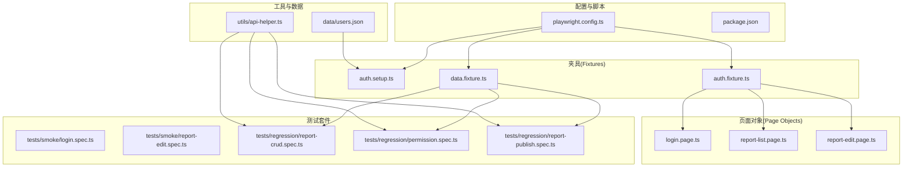
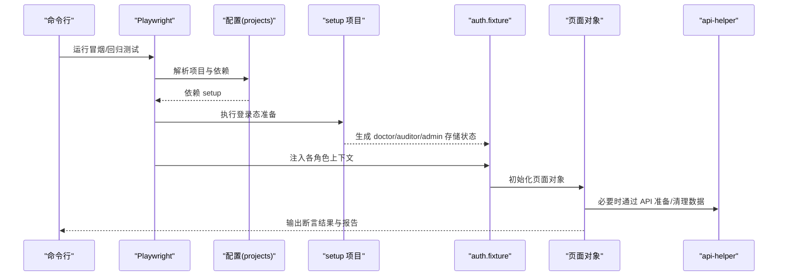
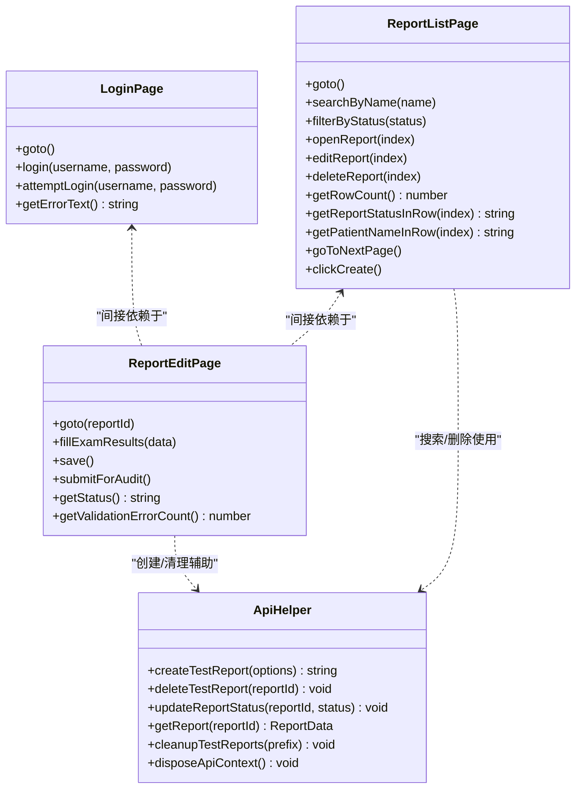
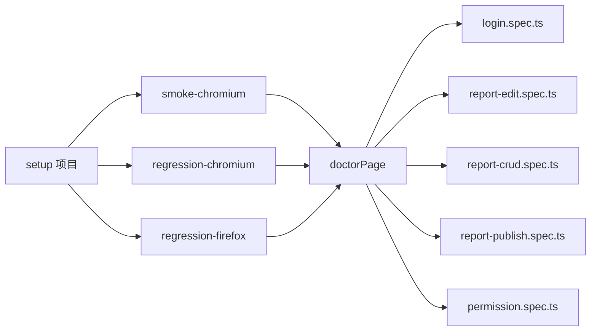

# 测试用例设计

<cite>
**本文引用的文件**
- [playwright.config.ts](file://e2e-tests/playwright.config.ts)
- [package.json](file://e2e-tests/package.json)
- [auth.setup.ts](file://e2e-tests/fixtures/auth.setup.ts)
- [auth.fixture.ts](file://e2e-tests/fixtures/auth.fixture.ts)
- [data.fixture.ts](file://e2e-tests/fixtures/data.fixture.ts)
- [login.page.ts](file://e2e-tests/pages/login.page.ts)
- [report-list.page.ts](file://e2e-tests/pages/report-list.page.ts)
- [report-edit.page.ts](file://e2e-tests/pages/report-edit.page.ts)
- [login.spec.ts](file://e2e-tests/tests/smoke/login.spec.ts)
- [report-edit.spec.ts](file://e2e-tests/tests/smoke/report-edit.spec.ts)
- [report-crud.spec.ts](file://e2e-tests/tests/regression/report-crud.spec.ts)
- [permission.spec.ts](file://e2e-tests/tests/regression/permission.spec.ts)
- [report-publish.spec.ts](file://e2e-tests/tests/regression/report-publish.spec.ts)
- [api-helper.ts](file://e2e-tests/utils/api-helper.ts)
- [users.json](file://e2e-tests/data/users.json)
</cite>

## 目录
1. [引言](#引言)
2. [项目结构](#项目结构)
3. [核心组件](#核心组件)
4. [架构总览](#架构总览)
5. [详细组件分析](#详细组件分析)
6. [依赖分析](#依赖分析)
7. [性能考虑](#性能考虑)
8. [故障排查指南](#故障排查指南)
9. [结论](#结论)
10. [附录](#附录)

## 引言
本指南面向测试工程师，系统阐述本仓库中端到端测试用例的设计理念、覆盖范围与实现逻辑，重点涵盖：
- 冒烟测试套件与回归测试套件的目标与范围
- 登录功能测试、报告浏览/编辑/CRUD、报告发布流程、报告查询、权限控制与工作流测试
- 测试用例间的依赖关系与执行顺序
- 测试数据管理策略与测试环境隔离方案
- 维护指南、扩展方法与性能优化技巧

## 项目结构
该仓库采用“按功能域划分”的组织方式，结合 Playwright 的项目化配置，将冒烟与回归测试分别置于独立目录，并通过 fixtures 实现角色化的登录态注入与数据准备。

图表来源
- [playwright.config.ts:1-68](file://e2e-tests/playwright.config.ts#L1-L68)
- [auth.setup.ts:1-30](file://e2e-tests/fixtures/auth.setup.ts#L1-L30)
- [auth.fixture.ts:1-40](file://e2e-tests/fixtures/auth.fixture.ts#L1-L40)
- [data.fixture.ts:1-57](file://e2e-tests/fixtures/data.fixture.ts#L1-L57)
- [login.page.ts:1-52](file://e2e-tests/pages/login.page.ts#L1-L52)
- [report-list.page.ts:1-130](file://e2e-tests/pages/report-list.page.ts#L1-L130)
- [report-edit.page.ts:1-94](file://e2e-tests/pages/report-edit.page.ts#L1-L94)
- [report-crud.spec.ts:1-122](file://e2e-tests/tests/regression/report-crud.spec.ts#L1-L122)
- [permission.spec.ts:1-102](file://e2e-tests/tests/regression/permission.spec.ts#L1-L102)
- [report-publish.spec.ts:1-100](file://e2e-tests/tests/regression/report-publish.spec.ts#L1-L100)
- [api-helper.ts:1-172](file://e2e-tests/utils/api-helper.ts#L1-L172)
- [users.json:1-30](file://e2e-tests/data/users.json#L1-L30)

章节来源
- [playwright.config.ts:1-68](file://e2e-tests/playwright.config.ts#L1-L68)
- [package.json:1-27](file://e2e-tests/package.json#L1-L27)

## 核心组件
- 配置层：通过 Playwright 多项目配置实现冒烟与回归测试分离，统一设置超时、并行度、报告器与设备环境；通过 setup/cleanup 项目预置登录态。
- 夹具层：基于 storageState 注入不同角色的登录上下文，确保测试在真实业务角色权限下运行；提供数据夹具自动创建/清理测试报告。
- 页面对象层：封装页面交互细节，暴露稳定的方法与定位器，降低用例与页面实现耦合。
- 工具层：提供 API 辅助器，统一管理认证上下文、批量创建/删除/更新报告状态、清理测试数据等。
- 数据层：集中管理用户凭据，支持多 worker 并发场景下的角色实例化。

章节来源
- [playwright.config.ts:31-66](file://e2e-tests/playwright.config.ts#L31-L66)
- [auth.fixture.ts:10-37](file://e2e-tests/fixtures/auth.fixture.ts#L10-L37)
- [data.fixture.ts:13-54](file://e2e-tests/fixtures/data.fixture.ts#L13-L54)
- [api-helper.ts:45-77](file://e2e-tests/utils/api-helper.ts#L45-L77)
- [users.json:1-30](file://e2e-tests/data/users.json#L1-L30)

## 架构总览
下图展示从测试执行到页面交互与 API 调用的整体流程，以及冒烟/回归项目的依赖关系与执行顺序。

图表来源
- [playwright.config.ts:31-66](file://e2e-tests/playwright.config.ts#L31-L66)
- [auth.setup.ts:18-29](file://e2e-tests/fixtures/auth.setup.ts#L18-L29)
- [auth.fixture.ts:10-37](file://e2e-tests/fixtures/auth.fixture.ts#L10-L37)
- [api-helper.ts:83-121](file://e2e-tests/utils/api-helper.ts#L83-L121)

## 详细组件分析

### 冒烟测试套件设计
目标：快速验证核心路径的稳定性与关键功能链路的可用性，优先覆盖登录、报告编辑与提交审核、报告列表浏览与基本交互。

- 登录功能测试（SM-01）
  - 设计要点：覆盖正确凭据登录跳转与错误凭据提示显示。
  - 关键步骤：打开登录页、输入凭据、点击登录、断言跳转 URL 或错误提示可见。
  - 依赖关系：依赖 auth.setup 生成的 doctor 登录态；用例独立，无跨用例共享状态。
  - 参考路径：[login.spec.ts:4-24](file://e2e-tests/tests/smoke/login.spec.ts#L4-L24)，[login.page.ts:22-43](file://e2e-tests/pages/login.page.ts#L22-L43)

- 报告编辑与提交审核（SM-04/SM-05）
  - 设计要点：编辑体检数据并保存；提交审核后状态变更。
  - 关键步骤：通过 API 预创建草稿报告；进入编辑页填写体检数据并保存；再次进入验证持久化；提交审核并断言状态。
  - 依赖关系：依赖 auth.fixture 的 doctorPage；前后置钩子负责创建/清理测试数据。
  - 参考路径：[report-edit.spec.ts:5-60](file://e2e-tests/tests/smoke/report-edit.spec.ts#L5-L60)，[report-edit.page.ts:32-78](file://e2e-tests/pages/report-edit.page.ts#L32-L78)，[api-helper.ts:83-121](file://e2e-tests/utils/api-helper.ts#L83-L121)

- 报告列表浏览（SM-02/SM-03）
  - 设计要点：进入报告列表页，进行搜索、筛选、翻页与新建入口验证。
  - 关键步骤：打开列表页、输入搜索词、点击搜索、等待响应；筛选状态、翻页；点击新建。
  - 依赖关系：依赖 auth.fixture 的 doctorPage；断言表格、空状态、分页控件。
  - 参考路径：[report-list.page.ts:34-128](file://e2e-tests/pages/report-list.page.ts#L34-L128)

章节来源
- [login.spec.ts:4-24](file://e2e-tests/tests/smoke/login.spec.ts#L4-L24)
- [report-edit.spec.ts:5-60](file://e2e-tests/tests/smoke/report-edit.spec.ts#L5-L60)
- [report-list.page.ts:34-128](file://e2e-tests/pages/report-list.page.ts#L34-L128)
- [login.page.ts:22-43](file://e2e-tests/pages/login.page.ts#L22-L43)
- [report-edit.page.ts:32-78](file://e2e-tests/pages/report-edit.page.ts#L32-L78)
- [api-helper.ts:83-121](file://e2e-tests/utils/api-helper.ts#L83-L121)

### 回归测试套件设计
目标：全面覆盖报告 CRUD、权限控制、发布流程与查询能力，确保多浏览器与复杂业务场景的稳定性。

- 报告 CRUD（创建/编辑/删除/草稿保存）
  - 设计要点：创建新报告、编辑已有报告并验证持久化、删除草稿、部分填写后保存草稿。
  - 关键步骤：使用 data.fixture 或 api-helper 创建草稿；进入编辑页填写体检数据并保存；刷新后断言值；删除后断言列表变化。
  - 依赖关系：依赖 auth.fixture 的 doctorPage；beforeEach/afterEach 管理测试数据生命周期。
  - 参考路径：[report-crud.spec.ts:7-122](file://e2e-tests/tests/regression/report-crud.spec.ts#L7-L122)，[api-helper.ts:83-121](file://e2e-tests/utils/api-helper.ts#L83-L121)

- 权限控制测试
  - 设计要点：验证不同角色对报告的不同操作权限（编辑、审核、发布、作废）。
  - 关键步骤：通过 API 创建三种状态的报告；医生仅能编辑草稿；审核医生可审核待审核；管理员可发布/作废已审核。
  - 依赖关系：依赖 auth.fixture 的 doctorPage/auditorPage/adminPage；beforeAll/afterAll 管理测试数据。
  - 参考路径：[permission.spec.ts:8-102](file://e2e-tests/tests/regression/permission.spec.ts#L8-L102)

- 报告发布与查看
  - 设计要点：管理员发布已审核报告并验证状态；公开页面查看已发布报告；未发布报告不可访问。
  - 关键步骤：创建已审核报告；管理员进入详情页点击发布；断言状态变更为“已发布”；访问公开链接断言可见性与数据完整性；未发布报告断言不可访问。
  - 依赖关系：依赖 auth.fixture 的 adminPage；beforeAll/afterAll 管理测试数据。
  - 参考路径：[report-publish.spec.ts:5-100](file://e2e-tests/tests/regression/report-publish.spec.ts#L5-L100)

- 报告查询功能
  - 设计要点：按姓名搜索、按状态筛选、分页导航与空状态。
  - 关键步骤：输入搜索词并点击搜索；断言响应完成；选择状态筛选；点击下一页并等待响应；断言空状态。
  - 依赖关系：依赖 auth.fixture 的 doctorPage；断言表格行数、状态标签、空状态元素。
  - 参考路径：[report-list.page.ts:42-121](file://e2e-tests/pages/report-list.page.ts#L42-L121)

章节来源
- [report-crud.spec.ts:7-122](file://e2e-tests/tests/regression/report-crud.spec.ts#L7-L122)
- [permission.spec.ts:8-102](file://e2e-tests/tests/regression/permission.spec.ts#L8-L102)
- [report-publish.spec.ts:5-100](file://e2e-tests/tests/regression/report-publish.spec.ts#L5-L100)
- [report-list.page.ts:42-121](file://e2e-tests/pages/report-list.page.ts#L42-L121)
- [api-helper.ts:83-121](file://e2e-tests/utils/api-helper.ts#L83-L121)

### 页面对象与工具类
- 页面对象职责
  - LoginPage：封装登录页交互，提供登录与错误提示获取方法。
  - ReportListPage：封装列表页交互，提供搜索、筛选、翻页、删除、打开/编辑/删除按钮点击等。
  - ReportEditPage：封装编辑页交互，提供填写体检数据、保存、提交审核、状态读取与校验错误统计。
- 工具类职责
  - api-helper：统一管理 API 认证上下文（单例）、创建/删除/更新状态/获取报告、批量清理测试数据、销毁上下文。

图表来源
- [login.page.ts:3-51](file://e2e-tests/pages/login.page.ts#L3-L51)
- [report-list.page.ts:3-129](file://e2e-tests/pages/report-list.page.ts#L3-L129)
- [report-edit.page.ts:3-93](file://e2e-tests/pages/report-edit.page.ts#L3-L93)
- [api-helper.ts:83-172](file://e2e-tests/utils/api-helper.ts#L83-L172)

## 依赖分析
- 项目级依赖
  - smoke-chromium 依赖 setup 项目，确保登录态就绪后再执行冒烟用例。
  - regression-chromium 与 regression-firefox 同样依赖 setup，保证跨浏览器一致性。
- 用例级依赖
  - 回归用例普遍依赖 auth.fixture 的 doctorPage/auditorPage/adminPage，以模拟真实角色行为。
  - 部分用例通过 api-helper 在前置阶段创建测试数据，在后置阶段清理，避免污染环境。
- 数据与环境
  - 用户凭据集中于 users.json，auth.setup 依据角色生成 storageState 文件，供 auth.fixture 注入。
  - CI 环境通过环境变量控制重试次数、并发与报告输出格式。

图表来源
- [playwright.config.ts:31-66](file://e2e-tests/playwright.config.ts#L31-L66)
- [auth.fixture.ts:10-37](file://e2e-tests/fixtures/auth.fixture.ts#L10-L37)

章节来源
- [playwright.config.ts:31-66](file://e2e-tests/playwright.config.ts#L31-L66)
- [auth.fixture.ts:10-37](file://e2e-tests/fixtures/auth.fixture.ts#L10-L37)
- [auth.setup.ts:18-29](file://e2e-tests/fixtures/auth.setup.ts#L18-L29)
- [users.json:1-30](file://e2e-tests/data/users.json#L1-L30)

## 性能考虑
- 并行与重试
  - CI 环境启用并行与重试，提升整体吞吐；本地开发默认串行以降低资源占用。
- 超时与等待
  - 全局与 expect 超时合理配置，避免过长等待导致测试时间膨胀；页面对象中对关键网络请求使用 waitForResponse 缩短等待不确定性。
- 数据准备与清理
  - 使用 API 批量创建/清理测试数据，减少 UI 交互带来的不稳定因素；在 beforeEach/afterEach 中严格管理生命周期。
- 报告与追踪
  - 失败时保留截图/视频/trace，便于定位问题但需注意存储开销；CI 下统一输出 HTML/JUnit/Allure，利于持续集成可视化。

章节来源
- [playwright.config.ts:8-29](file://e2e-tests/playwright.config.ts#L8-L29)
- [report-list.page.ts:46-59](file://e2e-tests/pages/report-list.page.ts#L46-L59)
- [report-list.page.ts:118-120](file://e2e-tests/pages/report-list.page.ts#L118-L120)
- [package.json:6-12](file://e2e-tests/package.json#L6-L12)

## 故障排查指南
- 登录失败或跳转异常
  - 检查 auth.setup 是否成功生成 doctor/auditor/admin 的 storageState 文件；确认 baseURL 与登录页路由一致。
  - 参考路径：[auth.setup.ts:19-28](file://e2e-tests/fixtures/auth.setup.ts#L19-L28)，[playwright.config.ts:24-29](file://e2e-tests/playwright.config.ts#L24-L29)
- 页面元素不可见或断言失败
  - 使用页面对象提供的显式等待（如 waitForResponse、waitForURL）；检查 data-testid 是否与页面一致。
  - 参考路径：[login.page.ts:33](file://e2e-tests/pages/login.page.ts#L33)，[report-list.page.ts:46-48](file://e2e-tests/pages/report-list.page.ts#L46-L48)
- 权限相关断言不通过
  - 确认通过 API 将报告状态设置为目标状态；核对角色对应的 UI 控件是否存在且可用。
  - 参考路径：[permission.spec.ts:36-55](file://e2e-tests/tests/regression/permission.spec.ts#L36-L55)，[permission.spec.ts:58-80](file://e2e-tests/tests/regression/permission.spec.ts#L58-L80)
- 发布后公开页面不可见
  - 确认报告状态已更新为“已发布”；检查公开链接访问是否返回 403/404 或提示“报告不存在或未发布”。
  - 参考路径：[report-publish.spec.ts:26-34](file://e2e-tests/tests/regression/report-publish.spec.ts#L26-L34)，[report-publish.spec.ts:88-97](file://e2e-tests/tests/regression/report-publish.spec.ts#L88-L97)
- 数据污染与竞态
  - 使用 beforeEach/afterEach 或 data.fixture 管理测试数据；必要时在 api-helper 中增加幂等清理。
  - 参考路径：[report-crud.spec.ts:33-43](file://e2e-tests/tests/regression/report-crud.spec.ts#L33-L43)，[api-helper.ts:156-161](file://e2e-tests/utils/api-helper.ts#L156-L161)

章节来源
- [auth.setup.ts:19-28](file://e2e-tests/fixtures/auth.setup.ts#L19-L28)
- [login.page.ts:33](file://e2e-tests/pages/login.page.ts#L33)
- [report-list.page.ts:46-48](file://e2e-tests/pages/report-list.page.ts#L46-L48)
- [permission.spec.ts:36-55](file://e2e-tests/tests/regression/permission.spec.ts#L36-L55)
- [report-publish.spec.ts:26-34](file://e2e-tests/tests/regression/report-publish.spec.ts#L26-L34)
- [report-publish.spec.ts:88-97](file://e2e-tests/tests/regression/report-publish.spec.ts#L88-L97)
- [report-crud.spec.ts:33-43](file://e2e-tests/tests/regression/report-crud.spec.ts#L33-L43)
- [api-helper.ts:156-161](file://e2e-tests/utils/api-helper.ts#L156-L161)

## 结论
本测试体系通过明确的冒烟与回归分层、稳定的夹具与页面对象、完善的 API 数据准备与清理机制，实现了对登录、报告 CRUD、权限控制、发布流程与查询功能的全面覆盖。配合 CI 并行与报告器，能够在保障质量的同时提升效率。后续可在以下方面持续优化：进一步细化失败重试策略、引入更细粒度的断言与日志、增强数据隔离与并发安全。

## 附录
- 测试数据管理策略
  - 使用 users.json 统一管理角色凭据；auth.setup 自动生成 storageState；data.fixture 与 api-helper 协同实现测试数据的自动创建/清理。
  - 参考路径：[users.json:1-30](file://e2e-tests/data/users.json#L1-L30)，[auth.setup.ts:18-29](file://e2e-tests/fixtures/auth.setup.ts#L18-L29)，[data.fixture.ts:13-54](file://e2e-tests/fixtures/data.fixture.ts#L13-L54)，[api-helper.ts:83-121](file://e2e-tests/utils/api-helper.ts#L83-L121)
- 测试环境隔离方案
  - 通过不同项目（Chromium/Firefox）与角色上下文隔离；CI 环境通过环境变量控制重试与并发；失败时保留 trace/screenshot/video 以便定位。
  - 参考路径：[playwright.config.ts:14-16](file://e2e-tests/playwright.config.ts#L14-L16)，[playwright.config.ts:24-29](file://e2e-tests/playwright.config.ts#L24-L29)
- 维护与扩展指南
  - 新增用例时遵循“先页面对象封装，再夹具注入，最后用例编写”的流程；新增角色时在 users.json 与 auth.setup 中同步扩展；新增页面交互时在对应 page.ts 中补充定位器与方法。
  - 参考路径：[auth.fixture.ts:10-37](file://e2e-tests/fixtures/auth.fixture.ts#L10-L37)，[login.page.ts:13-51](file://e2e-tests/pages/login.page.ts#L13-L51)，[report-list.page.ts:19-32](file://e2e-tests/pages/report-list.page.ts#L19-L32)，[report-edit.page.ts:18-30](file://e2e-tests/pages/report-edit.page.ts#L18-L30)
- 性能优化技巧
  - 使用 waitForResponse 等待关键接口响应；避免不必要的全屏截图；在 CI 中合并报告输出；按需开启 trace。
  - 参考路径：[report-list.page.ts:46-48](file://e2e-tests/pages/report-list.page.ts#L46-L48)，[report-list.page.ts:118-120](file://e2e-tests/pages/report-list.page.ts#L118-L120)，[package.json:6-12](file://e2e-tests/package.json#L6-L12)