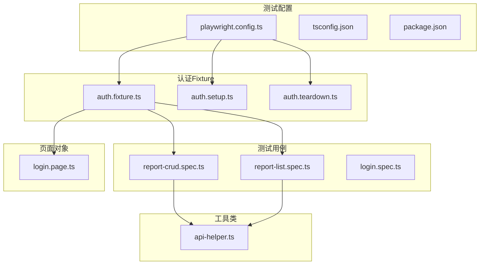
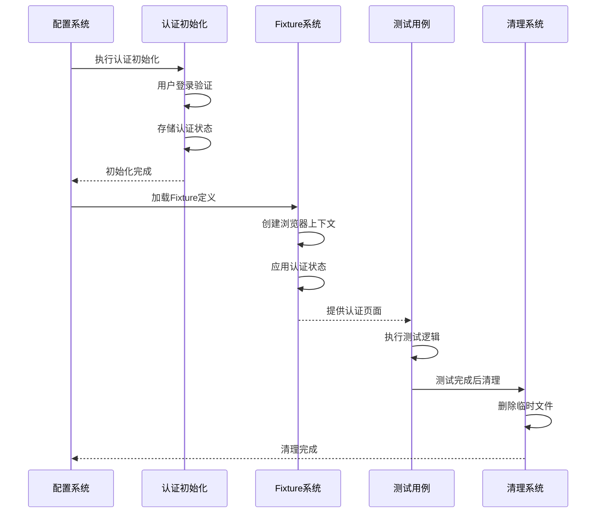
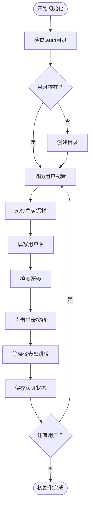
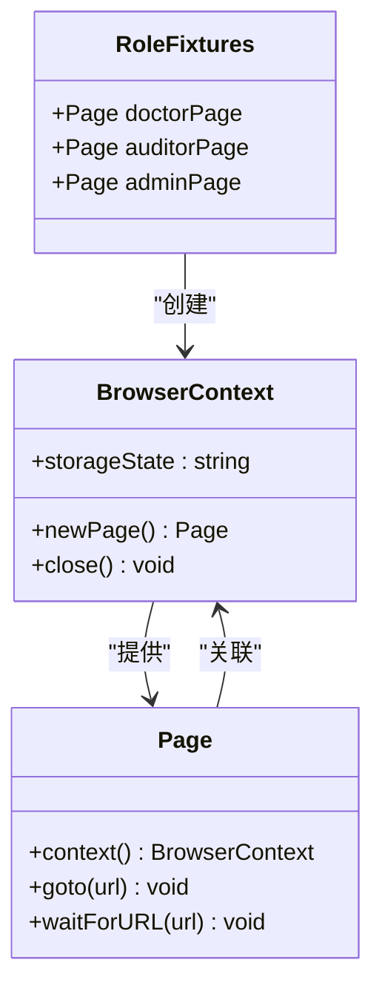
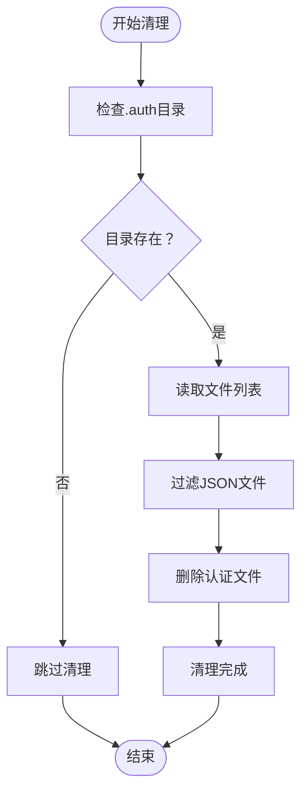
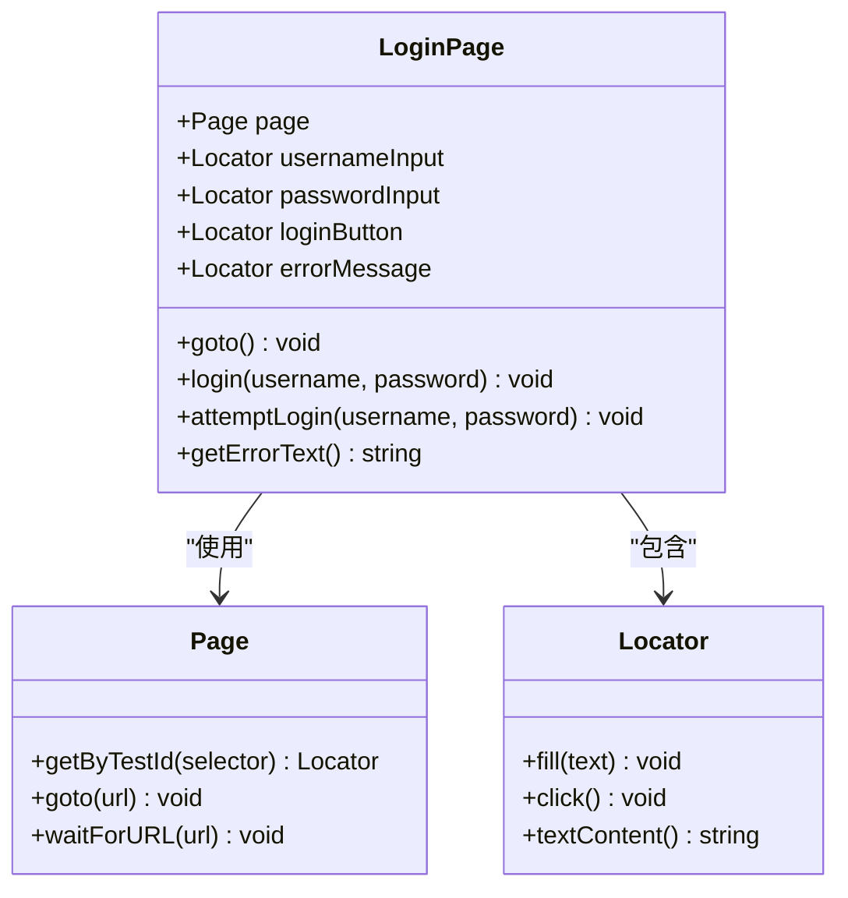
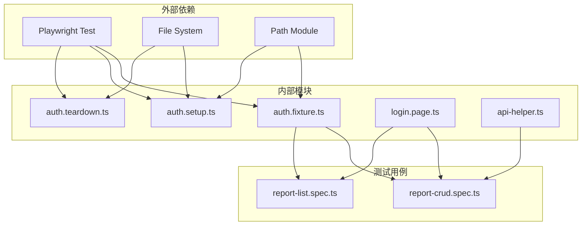

# Fixture认证系统

<cite>
**本文档引用的文件**
- [auth.fixture.ts](file://e2e-tests/fixtures/auth.fixture.ts)
- [auth.setup.ts](file://e2e-tests/fixtures/auth.setup.ts)
- [auth.teardown.ts](file://e2e-tests/fixtures/auth.teardown.ts)
- [playwright.config.ts](file://e2e-tests/playwright.config.ts)
- [login.page.ts](file://e2e-tests/pages/login.page.ts)
- [report-crud.spec.ts](file://e2e-tests/tests/regression/report-crud.spec.ts)
- [report-list.spec.ts](file://e2e-tests/tests/smoke/report-list.spec.ts)
- [api-helper.ts](file://e2e-tests/utils/api-helper.ts)
- [package.json](file://e2e-tests/package.json)
- [tsconfig.json](file://e2e-tests/tsconfig.json)
</cite>

## 目录
1. [简介](#简介)
2. [项目结构](#项目结构)
3. [核心组件](#核心组件)
4. [架构概览](#架构概览)
5. [详细组件分析](#详细组件分析)
6. [依赖关系分析](#依赖关系分析)
7. [性能考虑](#性能考虑)
8. [故障排除指南](#故障排除指南)
9. [结论](#结论)
10. [附录](#附录)

## 简介

本项目采用Playwright Fixture系统实现高效的端到端测试认证管理。该系统通过三个核心文件实现了完整的认证生命周期管理：`auth.setup.ts`负责认证状态初始化，`auth.fixture.ts`定义Fixture并实现状态复用，`auth.teardown.ts`处理清理和销毁过程。

系统支持多角色认证（医生、审核员、管理员），每个角色拥有独立的认证上下文和存储状态。通过项目化配置，系统能够在不同测试环境中灵活切换，支持冒烟测试和回归测试的并行执行。

## 项目结构

项目采用模块化组织方式，认证相关代码集中在`fixtures`目录中：



**图表来源**
- [playwright.config.ts:31-66](file://e2e-tests/playwright.config.ts#L31-L66)
- [auth.fixture.ts:1-40](file://e2e-tests/fixtures/auth.fixture.ts#L1-L40)

**章节来源**
- [playwright.config.ts:1-68](file://e2e-tests/playwright.config.ts#L1-L68)
- [package.json:1-27](file://e2e-tests/package.json#L1-L27)

## 核心组件

### 认证Fixture系统

系统的核心是基于Playwright的Fixture扩展机制，提供了三种预配置的页面Fixture：

- **doctorPage**: 医生角色专用页面实例
- **auditorPage**: 审核员角色专用页面实例  
- **adminPage**: 管理员角色专用页面实例

每种Fixture都创建独立的浏览器上下文，确保测试间的完全隔离。

### 认证状态管理

系统通过`storageState`机制实现认证状态的持久化和复用：

- 每个角色对应独立的JSON文件存储认证状态
- 支持跨测试运行的状态缓存
- 自动处理会话管理和Cookie管理

**章节来源**
- [auth.fixture.ts:4-37](file://e2e-tests/fixtures/auth.fixture.ts#L4-L37)

## 架构概览

系统采用分层架构设计，通过项目化配置实现测试环境的分离：



**图表来源**
- [playwright.config.ts:31-66](file://e2e-tests/playwright.config.ts#L31-L66)
- [auth.setup.ts:16-26](file://e2e-tests/fixtures/auth.setup.ts#L16-L26)
- [auth.fixture.ts:10-37](file://e2e-tests/fixtures/auth.fixture.ts#L10-L37)

## 详细组件分析

### 认证初始化系统 (auth.setup.ts)

认证初始化系统负责首次建立和存储各角色的认证状态：

#### 核心功能流程



**图表来源**
- [auth.setup.ts:16-26](file://e2e-tests/fixtures/auth.setup.ts#L16-L26)

#### 关键实现细节

- **用户配置管理**: 通过对象字面量定义用户凭据
- **目录管理**: 自动创建`.auth`目录确保文件存储位置
- **状态持久化**: 使用`page.context().storageState()`方法保存认证状态
- **路径管理**: 动态生成JSON文件路径

**章节来源**
- [auth.setup.ts:1-28](file://e2e-tests/fixtures/auth.setup.ts#L1-L28)

### Fixture定义系统 (auth.fixture.ts)

Fixture系统通过Playwright的扩展机制实现认证状态的自动注入：

#### Fixture生命周期管理



**图表来源**
- [auth.fixture.ts:4-37](file://e2e-tests/fixtures/auth.fixture.ts#L4-L37)

#### 生命周期钩子

每个Fixture都实现了标准的生命周期钩子：

- **创建阶段**: 新建浏览器上下文并应用认证状态
- **使用阶段**: 将页面实例提供给测试用例
- **销毁阶段**: 关闭浏览器上下文释放资源

**章节来源**
- [auth.fixture.ts:10-37](file://e2e-tests/fixtures/auth.fixture.ts#L10-L37)

### 清理销毁系统 (auth.teardown.ts)

清理系统确保测试环境的整洁性和资源回收：

#### 清理策略



**图表来源**
- [auth.teardown.ts:7-17](file://e2e-tests/fixtures/auth.teardown.ts#L7-L17)

**章节来源**
- [auth.teardown.ts:1-18](file://e2e-tests/fixtures/auth.teardown.ts#L1-L18)

### 测试配置系统 (playwright.config.ts)

配置系统通过项目化方式管理不同的测试环境：

#### 项目配置结构

| 项目名称 | 测试目录 | 用途 | 依赖关系 |
|---------|---------|------|----------|
| setup | fixtures | 认证初始化 | 无 |
| cleanup | fixtures | 环境清理 | setup |
| smoke-chromium | smoke | 冒烟测试 | setup |
| regression-chromium | regression | 回归测试-Chromium | setup |
| regression-firefox | regression | 回归测试-Firefox | setup |

**章节来源**
- [playwright.config.ts:31-66](file://e2e-tests/playwright.config.ts#L31-L66)

### 页面对象系统 (login.page.ts)

页面对象封装了登录相关的UI交互逻辑：

#### 页面对象设计模式



**图表来源**
- [login.page.ts:3-51](file://e2e-tests/pages/login.page.ts#L3-L51)

**章节来源**
- [login.page.ts:1-52](file://e2e-tests/pages/login.page.ts#L1-L52)

## 依赖关系分析

系统采用松耦合的设计，通过明确的接口契约实现组件间的协作：



**图表来源**
- [auth.fixture.ts:1-3](file://e2e-tests/fixtures/auth.fixture.ts#L1-L3)
- [auth.setup.ts:2-3](file://e2e-tests/fixtures/auth.setup.ts#L2-L3)
- [auth.teardown.ts:2-3](file://e2e-tests/fixtures/auth.teardown.ts#L2-L3)

### 依赖注入机制

系统通过Playwright的依赖注入机制实现Fixture的自动解析：

- **基础测试实例**: 从`@playwright/test`导入
- **类型安全**: 通过TypeScript接口定义Fixture类型
- **自动解析**: Playwright自动解析依赖关系
- **生命周期管理**: 自动处理Fixture的创建和销毁

**章节来源**
- [auth.fixture.ts:1-40](file://e2e-tests/fixtures/auth.fixture.ts#L1-L40)

## 性能考虑

### 资源优化策略

1. **并发执行**: 启用完全并行执行以提高测试速度
2. **上下文复用**: 每个Fixture独立的浏览器上下文避免状态污染
3. **内存管理**: 及时关闭浏览器上下文释放内存
4. **文件I/O优化**: 批量操作认证文件减少磁盘访问

### 缓存策略

- **认证状态缓存**: 通过JSON文件缓存认证状态
- **测试间复用**: 不同测试可以复用已存在的认证状态
- **环境隔离**: 每个角色的认证状态相互独立

### 并发控制

系统支持多项目并行执行：

- **冒烟测试**: 单线程执行确保稳定性
- **回归测试**: 多线程并行执行提高效率
- **CI集成**: 在CI环境中自动调整并发度

**章节来源**
- [playwright.config.ts:12-15](file://e2e-tests/playwright.config.ts#L12-L15)
- [package.json:6-12](file://e2e-tests/package.json#L6-L12)

## 故障排除指南

### 常见问题及解决方案

#### 认证状态文件缺失

**问题症状**: 测试执行时报错找不到认证状态文件

**解决方案**:
1. 确认`.auth`目录存在且可写
2. 运行认证初始化脚本重新生成文件
3. 检查文件权限设置

#### 浏览器上下文创建失败

**问题症状**: Fixture无法创建新的浏览器上下文

**解决方案**:
1. 检查Playwright驱动安装状态
2. 确认浏览器可执行文件路径
3. 检查系统资源限制

#### 页面定位器失效

**问题症状**: 测试中元素定位失败

**解决方案**:
1. 检查页面URL是否正确加载
2. 验证测试ID是否与页面元素匹配
3. 调整等待策略

### 调试技巧

1. **启用详细日志**: 使用`--debug`参数获取更多信息
2. **截图调试**: 在关键步骤添加截图功能
3. **视频录制**: 启用视频录制功能便于回放
4. **断点调试**: 使用浏览器开发者工具调试页面

**章节来源**
- [playwright.config.ts:24-29](file://e2e-tests/playwright.config.ts#L24-L29)

## 结论

本Fixture认证系统通过精心设计的架构实现了高效、可靠的端到端测试认证管理。系统的主要优势包括：

1. **模块化设计**: 清晰的职责分离便于维护和扩展
2. **类型安全**: 全面的TypeScript支持提供编译时检查
3. **资源优化**: 合理的资源管理和并发控制提升执行效率
4. **环境隔离**: 独立的认证上下文确保测试结果的可靠性
5. **易于扩展**: 插件化的架构支持新角色和新功能的快速集成

该系统为复杂的医疗体检报告管理系统的自动化测试提供了坚实的基础，能够有效支撑从冒烟测试到回归测试的全场景覆盖。

## 附录

### 使用示例

#### 基本Fixture使用

```typescript
import { test, expect } from '../../fixtures/auth.fixture';

test('医生角色功能测试', async ({ doctorPage }) => {
  const listPage = new ReportListPage(doctorPage);
  await listPage.goto();
  // 测试逻辑...
});
```

#### 多角色测试场景

```typescript
import { test, expect } from '@playwright/test';

test('跨角色权限测试', async ({ doctorPage, auditorPage, adminPage }) => {
  // 分别使用不同角色执行测试
  await testDoctorPermissions(doctorPage);
  await testAuditorPermissions(auditorPage);
  await testAdminPermissions(adminPage);
});
```

### 最佳实践

1. **Fixture命名规范**: 使用语义化的Fixture名称
2. **错误处理**: 为每个Fixture实现适当的错误处理
3. **资源清理**: 确保所有临时资源都能被正确清理
4. **测试隔离**: 避免测试之间的状态依赖
5. **性能监控**: 定期监控测试执行时间和资源使用情况