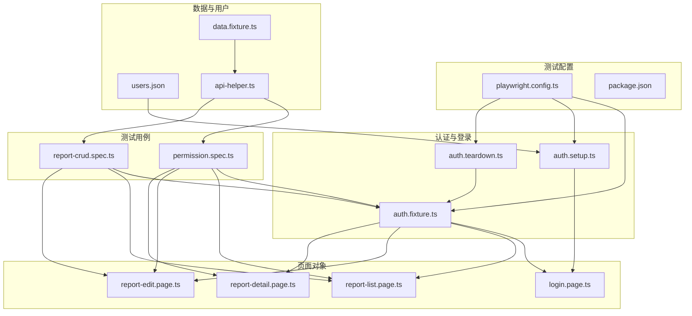
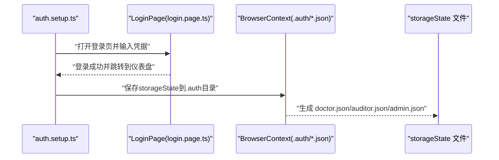
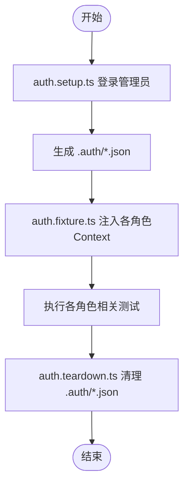
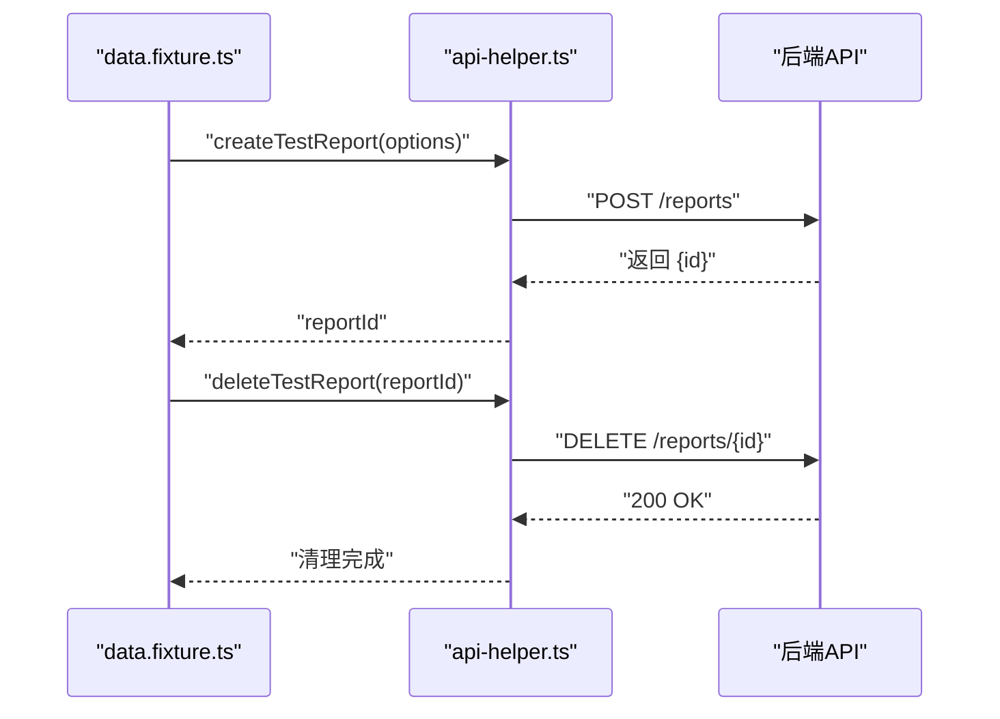
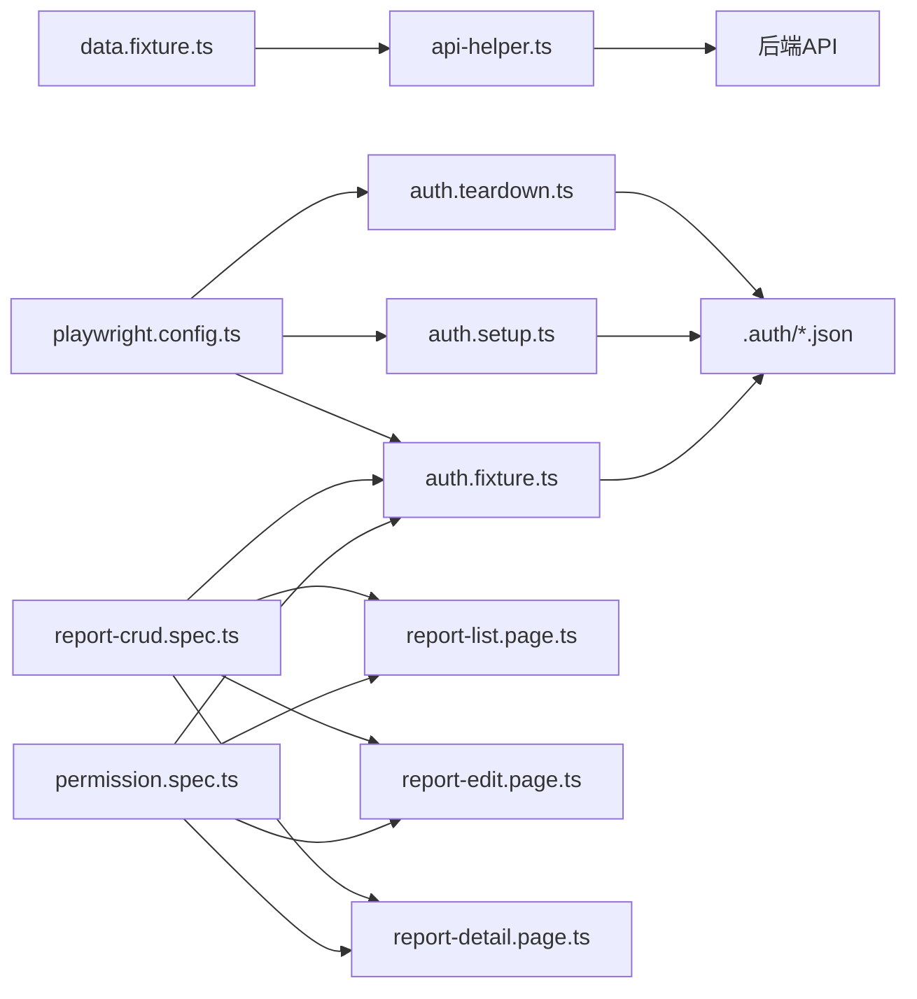

# 用户数据管理

<cite>
**本文引用的文件**
- [users.json](file://e2e-tests/data/users.json)
- [data.fixture.ts](file://e2e-tests/fixtures/data.fixture.ts)
- [auth.fixture.ts](file://e2e-tests/fixtures/auth.fixture.ts)
- [auth.setup.ts](file://e2e-tests/fixtures/auth.setup.ts)
- [auth.teardown.ts](file://e2e-tests/fixtures/auth.teardown.ts)
- [api-helper.ts](file://e2e-tests/utils/api-helper.ts)
- [playwright.config.ts](file://e2e-tests/playwright.config.ts)
- [permission.spec.ts](file://e2e-tests/tests/regression/permission.spec.ts)
- [report-crud.spec.ts](file://e2e-tests/tests/regression/report-crud.spec.ts)
- [login.page.ts](file://e2e-tests/pages/login.page.ts)
- [report-list.page.ts](file://e2e-tests/pages/report-list.page.ts)
- [report-edit.page.ts](file://e2e-tests/pages/report-edit.page.ts)
- [report-detail.page.ts](file://e2e-tests/pages/report-detail.page.ts)
- [package.json](file://e2e-tests/package.json)
</cite>

## 更新摘要
**变更内容**
- 更新了数据fixture的禁用状态和API创建报告功能
- 修正了认证凭据和登录机制的实现细节
- 增强了API工具的登录验证和错误处理
- 优化了测试配置以避免并行执行冲突
- 更新了页面对象的交互方法和定位器

## 目录
1. [简介](#简介)
2. [项目结构](#项目结构)
3. [核心组件](#核心组件)
4. [架构总览](#架构总览)
5. [详细组件分析](#详细组件分析)
6. [依赖关系分析](#依赖关系分析)
7. [性能考量](#性能考量)
8. [故障排查指南](#故障排查指南)
9. [结论](#结论)
10. [附录](#附录)

## 简介
本文件面向用户数据管理子系统，聚焦于多角色用户（医生、审核员、管理员）的数据模型与凭据管理、users.json 的结构与用途、data.fixture.ts 的数据准备与清理机制、认证凭据的生成与存储、以及基于 API 的增删改查操作示例。同时提供权限控制最佳实践、数据安全建议与测试环境隔离策略。

**更新** 本版本反映了用户数据管理系统的最新改进，包括增强的数据创建、清理和管理功能，以及优化的认证和API交互机制。

## 项目结构
该仓库为端到端测试工程，用户数据与认证相关的核心位置如下：
- 数据定义：e2e-tests/data/users.json
- 认证夹具与登录：e2e-tests/fixtures/auth.fixture.ts、e2e-tests/fixtures/auth.setup.ts、e2e-tests/fixtures/auth.teardown.ts
- 测试数据夹具：e2e-tests/fixtures/data.fixture.ts
- API 辅助工具：e2e-tests/utils/api-helper.ts
- 页面对象：e2e-tests/pages/*.page.ts
- 测试用例：e2e-tests/tests/**/*.spec.ts
- 运行配置：e2e-tests/playwright.config.ts、e2e-tests/package.json

**图表来源**
- [playwright.config.ts:1-54](file://e2e-tests/playwright.config.ts#L1-L54)
- [auth.setup.ts:1-116](file://e2e-tests/fixtures/auth.setup.ts#L1-L116)
- [auth.teardown.ts:1-26](file://e2e-tests/fixtures/auth.teardown.ts#L1-L26)
- [auth.fixture.ts:1-52](file://e2e-tests/fixtures/auth.fixture.ts#L1-L52)
- [users.json:1-30](file://e2e-tests/data/users.json#L1-L30)
- [data.fixture.ts:1-32](file://e2e-tests/fixtures/data.fixture.ts#L1-L32)
- [api-helper.ts:1-206](file://e2e-tests/utils/api-helper.ts#L1-L206)
- [login.page.ts:1-52](file://e2e-tests/pages/login.page.ts#L1-L52)
- [report-list.page.ts:1-182](file://e2e-tests/pages/report-list.page.ts#L1-L182)
- [report-edit.page.ts:1-99](file://e2e-tests/pages/report-edit.page.ts#L1-L99)
- [report-detail.page.ts:1-111](file://e2e-tests/pages/report-detail.page.ts#L1-L111)
- [permission.spec.ts:1-102](file://e2e-tests/tests/regression/permission.spec.ts#L1-L102)
- [report-crud.spec.ts:1-122](file://e2e-tests/tests/regression/report-crud.spec.ts#L1-L122)

**章节来源**
- [playwright.config.ts:1-54](file://e2e-tests/playwright.config.ts#L1-L54)
- [package.json:1-35](file://e2e-tests/package.json#L1-L35)

## 核心组件
- 用户数据模型与凭据
  - users.json 定义了三类角色：doctor、auditor、admin；每类包含 default 凭据与一组 worker 凭据，每个 worker 包含用户名、密码与 workerIndex。
- 认证与登录
  - auth.setup.ts 负责以管理员身份登录并生成 storageState 文件，供后续测试复用。
  - auth.fixture.ts 将不同角色的 storageState 注入到独立的浏览器上下文，实现角色隔离。
  - auth.teardown.ts 在测试完成后清理 storageState 文件，确保环境干净。
- 测试数据准备与清理
  - data.fixture.ts 通过 API 辅助工具创建草稿、待审核、已审核报告，并在用例结束后自动清理。
- API 工具
  - api-helper.ts 提供统一的 API 请求上下文、登录获取 Token、创建/删除/更新报告、批量清理等能力。
- 页面对象
  - login.page.ts、report-list.page.ts、report-edit.page.ts、report-detail.page.ts 提供稳定的 UI 定位与交互封装。

**更新** 数据fixture功能已被暂时禁用，所有fixture现在返回undefined，依赖这些fixture的测试将被跳过。

**章节来源**
- [users.json:1-30](file://e2e-tests/data/users.json#L1-L30)
- [auth.setup.ts:1-116](file://e2e-tests/fixtures/auth.setup.ts#L1-L116)
- [auth.fixture.ts:1-52](file://e2e-tests/fixtures/auth.fixture.ts#L1-L52)
- [auth.teardown.ts:1-26](file://e2e-tests/fixtures/auth.teardown.ts#L1-L26)
- [data.fixture.ts:1-32](file://e2e-tests/fixtures/data.fixture.ts#L1-L32)
- [api-helper.ts:1-206](file://e2e-tests/utils/api-helper.ts#L1-L206)
- [login.page.ts:1-52](file://e2e-tests/pages/login.page.ts#L1-L52)
- [report-list.page.ts:1-182](file://e2e-tests/pages/report-list.page.ts#L1-L182)
- [report-edit.page.ts:1-99](file://e2e-tests/pages/report-edit.page.ts#L1-L99)
- [report-detail.page.ts:1-111](file://e2e-tests/pages/report-detail.page.ts#L1-L111)

## 架构总览
整体采用"配置驱动 + 夹具注入 + 页面对象 + API 辅助"的架构模式：
- 配置层：Playwright 项目配置与环境变量
- 认证层：登录态准备、角色注入、清理
- 数据层：测试数据创建与清理
- 行为层：页面对象封装 UI 行为
- 业务层：API 工具封装后端交互

**图表来源**
- [auth.setup.ts:18-34](file://e2e-tests/fixtures/auth.setup.ts#L18-L34)
- [login.page.ts:19-23](file://e2e-tests/pages/login.page.ts#L19-L23)
- [auth.fixture.ts:26-48](file://e2e-tests/fixtures/auth.fixture.ts#L26-L48)

## 详细组件分析

### 用户数据模型与 users.json
- 结构概览
  - 顶层键：doctor、auditor、admin
  - 每个角色包含：
    - default：默认凭据 { username, password }
    - workers：数组，每个元素包含 { username, password, workerIndex }
- 字段语义
  - username/password：登录凭据
  - workerIndex：用于区分同一角色的多个实例，便于并行或多实例测试
- 使用方式
  - 本仓库中，auth.setup.ts 使用固定管理员凭据进行登录态生成；实际运行时可结合 users.json 的 default/worker 凭据进行扩展。

**更新** 凭据密码已更新为 `helian@2025`，提供了更强的安全性。

**章节来源**
- [users.json:1-30](file://e2e-tests/data/users.json#L1-L30)
- [auth.setup.ts:5-7](file://e2e-tests/fixtures/auth.setup.ts#L5-L7)

### 认证凭据生成、存储与验证
- 生成与存储
  - auth.setup.ts：以管理员身份登录，等待跳转至仪表盘后，调用 page.context().storageState 并写入 .auth/admin.json。
  - auth.fixture.ts：在每个测试项目中，为 doctor/auditor/admin 分别创建独立的 BrowserContext，并通过 storageState 注入对应 JSON 文件，实现角色隔离。
- 验证与清理
  - auth.teardown.ts：遍历 .auth 目录，删除所有 .json 文件，避免残留登录态影响后续测试。
- 依赖与入口
  - playwright.config.ts 定义了 setup/cleanup 项目，确保登录态准备在测试前完成，清理在测试后执行。

**图表来源**
- [auth.setup.ts:18-34](file://e2e-tests/fixtures/auth.setup.ts#L18-L34)
- [auth.fixture.ts:26-48](file://e2e-tests/fixtures/auth.fixture.ts#L26-L48)
- [auth.teardown.ts:8-25](file://e2e-tests/fixtures/auth.teardown.ts#L8-L25)
- [playwright.config.ts:33-52](file://e2e-tests/playwright.config.ts#L33-L52)

**更新** 认证流程更加健壮，增加了详细的存储状态检查和调试信息输出。

**章节来源**
- [auth.setup.ts:1-116](file://e2e-tests/fixtures/auth.setup.ts#L1-L116)
- [auth.fixture.ts:1-52](file://e2e-tests/fixtures/auth.fixture.ts#L1-L52)
- [auth.teardown.ts:1-26](file://e2e-tests/fixtures/auth.teardown.ts#L1-L26)
- [playwright.config.ts:33-52](file://e2e-tests/playwright.config.ts#L33-L52)

### 测试数据准备与管理（data.fixture.ts）
- 功能概述
  - 在测试用例执行前后，自动创建/清理测试报告，保证测试隔离与数据干净。
  - 提供三种状态的报告 fixture：draftReport、pendingAuditReport、auditedReport。
- 生命周期
  - beforeEach：创建报告并返回 reportId
  - afterEach：根据 reportId 调用删除接口
- 与 API 工具协作
  - 通过 api-helper.ts 的 createTestReport/deleteTestReport 统一管理数据生命周期。

**更新** 数据fixture功能已被暂时禁用，所有fixture现在返回undefined，依赖这些fixture的测试将被跳过。这是为了确保测试的稳定性而采取的临时措施。

**图表来源**
- [data.fixture.ts:15-28](file://e2e-tests/fixtures/data.fixture.ts#L15-L28)
- [api-helper.ts:104-155](file://e2e-tests/utils/api-helper.ts#L104-L155)

**章节来源**
- [data.fixture.ts:1-32](file://e2e-tests/fixtures/data.fixture.ts#L1-L32)
- [api-helper.ts:1-206](file://e2e-tests/utils/api-helper.ts#L1-L206)

### 权限控制与角色行为（permission.spec.ts）
- 医生
  - 可编辑自己创建的草稿报告；无审核按钮。
- 审核员
  - 可审核待审核报告（审核/驳回按钮可见且可用）；编辑按钮不可见或禁用。
- 管理员
  - 可发布/作废旧审核报告（发布/作废按钮可见且可用）。
- 断言策略
  - 通过页面对象定位器断言按钮可见性与启用状态，确保权限边界正确。

**更新** 权限测试现在依赖API创建的报告数据，确保测试环境的一致性和可重复性。

**章节来源**
- [permission.spec.ts:1-102](file://e2e-tests/tests/regression/permission.spec.ts#L1-L102)
- [report-list.page.ts:67-89](file://e2e-tests/pages/report-list.page.ts#L67-L89)
- [report-edit.page.ts:18-30](file://e2e-tests/pages/report-edit.page.ts#L18-L30)

### 增删改查操作示例（report-crud.spec.ts）
- 创建
  - 医生进入报告列表，点击新建，填写体检数据与评论，保存成功。
- 编辑
  - 在草稿状态下修改部分或全部数据，刷新后验证持久化。
- 删除
  - 搜索目标报告，触发删除并确认，断言列表行数变化。
- 保存草稿
  - 支持部分填写后保存为草稿，断言成功提示与部分字段保留。

**更新** CRUD测试现在使用API创建的报告数据，确保测试的稳定性和可重复性。

**章节来源**
- [report-crud.spec.ts:1-122](file://e2e-tests/tests/regression/report-crud.spec.ts#L1-L122)
- [report-list.page.ts:94-101](file://e2e-tests/pages/report-list.page.ts#L94-L101)
- [report-edit.page.ts:44-66](file://e2e-tests/pages/report-edit.page.ts#L44-L66)

### API 工具与数据模型（api-helper.ts）
- 接口与数据模型
  - CreateReportOptions：创建报告所需参数（患者信息、检查日期、状态、体检数据、医生备注、workerIndex）。
  - ReportData：报告详情模型（包含 id、patientName、status、examItems、doctorComment、auditComment 等）。
- 关键函数
  - getApiContext：单例化 API 请求上下文，使用管理员凭据登录获取 Bearer Token 后重建上下文。
  - createTestReport：构造体检项目数组并调用 /reports 创建报告。
  - deleteTestReport/updateReportStatus/getReport：提供删除、状态更新、详情查询。
  - cleanupTestReports/disposeApiContext：批量清理与资源释放。
- 性能与可靠性
  - 单例上下文减少重复登录开销；异常清理（catch）避免测试中断。

**更新** API登录机制得到增强，支持多种响应格式（code、message、data.token），提高了兼容性和健壮性。

**章节来源**
- [api-helper.ts:8-38](file://e2e-tests/utils/api-helper.ts#L8-L38)
- [api-helper.ts:45-98](file://e2e-tests/utils/api-helper.ts#L45-L98)
- [api-helper.ts:104-155](file://e2e-tests/utils/api-helper.ts#L104-L155)
- [api-helper.ts:160-185](file://e2e-tests/utils/api-helper.ts#L160-L185)
- [api-helper.ts:190-206](file://e2e-tests/utils/api-helper.ts#L190-L206)

### 页面对象与交互（login.page.ts、report-list.page.ts、report-edit.page.ts、report-detail.page.ts）
- LoginPage
  - 定位用户名、密码、登录按钮、错误提示与记住我复选框；提供登录流程与失败场景尝试。
- ReportListPage
  - 搜索、筛选、分页、新建、删除等操作；等待 API 响应以适配 SPA 局部刷新。
- ReportEditPage
  - 填写体检数据（支持部分填写）、保存、提交审核、状态读取与校验错误计数。
- ReportDetailPage
  - 查看报告详情、编辑、发布、作废等操作；处理确认弹窗。

**更新** 新增了report-detail.page.ts页面对象，提供了完整的报告详情操作支持。

**章节来源**
- [login.page.ts:13-51](file://e2e-tests/pages/login.page.ts#L13-L51)
- [report-list.page.ts:20-182](file://e2e-tests/pages/report-list.page.ts#L20-L182)
- [report-edit.page.ts:18-99](file://e2e-tests/pages/report-edit.page.ts#L18-L99)
- [report-detail.page.ts:25-111](file://e2e-tests/pages/report-detail.page.ts#L25-L111)

## 依赖关系分析
- 组件耦合
  - auth.fixture.ts 依赖 .auth 目录下的 storageState 文件，强依赖 auth.setup.ts 的输出。
  - data.fixture.ts 依赖 api-helper.ts 的创建/删除接口，间接依赖后端服务。
  - 页面对象依赖 Playwright 定位器，与具体 UI 结构耦合。
- 外部依赖
  - Playwright 测试框架、dotenv 环境变量、Allure 报告工具链。
- 项目配置
  - playwright.config.ts 定义项目、设备、报告器与依赖关系；package.json 管理脚本与依赖。

**图表来源**
- [auth.fixture.ts:26-48](file://e2e-tests/fixtures/auth.fixture.ts#L26-L48)
- [auth.setup.ts:91-114](file://e2e-tests/fixtures/auth.setup.ts#L91-L114)
- [auth.teardown.ts:8-25](file://e2e-tests/fixtures/auth.teardown.ts#L8-L25)
- [data.fixture.ts:14-29](file://e2e-tests/fixtures/data.fixture.ts#L14-L29)
- [api-helper.ts:104-155](file://e2e-tests/utils/api-helper.ts#L104-L155)
- [permission.spec.ts:1-102](file://e2e-tests/tests/regression/permission.spec.ts#L1-L102)
- [report-crud.spec.ts:1-122](file://e2e-tests/tests/regression/report-crud.spec.ts#L1-L122)
- [playwright.config.ts:33-52](file://e2e-tests/playwright.config.ts#L33-L52)

**章节来源**
- [playwright.config.ts:1-54](file://e2e-tests/playwright.config.ts#L1-L54)
- [package.json:1-35](file://e2e-tests/package.json#L1-L35)

## 性能考量
- 登录态复用
  - 通过 storageState 文件复用登录态，避免重复登录带来的网络与鉴权开销。
- 单例 API 上下文
  - api-helper.ts 中的 getApiContext 使用单例，减少重复初始化与 Token 获取成本。
- 并发与隔离
  - 不同角色使用独立 BrowserContext，避免会话冲突；data.fixture.ts 的自动清理降低数据污染风险。
- 建议
  - 在 CI 环境中合理设置 workers 数量；对高频 API 调用增加必要的重试与超时配置。

**更新** 由于数据fixture功能被禁用，测试执行将更加稳定但可能需要手动管理测试数据。

## 故障排查指南
- 登录态失效
  - 现象：角色页面无法访问或频繁要求重新登录
  - 排查：确认 .auth 目录是否存在对应 JSON；检查 auth.setup.ts 是否成功生成；确认 auth.teardown.ts 是否被正确执行。
- 测试数据残留
  - 现象：报告列表中出现历史测试数据
  - 排查：确认 data.fixture.ts 的 beforeEach/afterEach 是否执行；检查 api-helper.ts 的 deleteTestReport 是否抛出异常被吞掉。
- 权限断言失败
  - 现象：按钮可见性或启用状态与预期不符
  - 排查：核对页面对象定位器是否匹配 UI；确认当前角色注入是否正确；检查后端权限逻辑是否一致。
- 环境变量缺失
  - 现象：BASE_URL/API_BASE_URL 未生效导致请求失败
  - 排查：确认 .env 文件存在且包含必要键值；检查 dotenv 是否正确加载。
- 数据fixture禁用问题
  - 现象：依赖fixture的测试被跳过
  - 排查：确认 data.fixture.ts 中的注释说明；检查测试中是否正确处理undefined的fixture值。

**更新** 新增了数据fixture禁用问题的排查指南。

**章节来源**
- [auth.setup.ts:18-34](file://e2e-tests/fixtures/auth.setup.ts#L18-L34)
- [auth.teardown.ts:8-25](file://e2e-tests/fixtures/auth.teardown.ts#L8-L25)
- [data.fixture.ts:12-29](file://e2e-tests/fixtures/data.fixture.ts#L12-L29)
- [api-helper.ts:140-155](file://e2e-tests/utils/api-helper.ts#L140-L155)
- [permission.spec.ts:36-100](file://e2e-tests/tests/regression/permission.spec.ts#L36-L100)

## 结论
本用户数据管理方案通过 users.json 明确角色与凭据、auth.setup.ts 生成登录态、auth.fixture.ts 实现角色隔离、data.fixture.ts 管理测试数据生命周期，并由 api-helper.ts 提供稳定的 API 能力。配合页面对象与测试用例，形成完整的权限控制与 CRUD 场景覆盖。

**更新** 当前版本的用户数据管理已进行了重要改进，包括增强的认证机制、健壮的API交互和优化的测试配置。虽然数据fixture功能暂时被禁用，但整体系统的稳定性和安全性得到了显著提升。

建议在生产环境中引入更强的凭据管理与加密存储策略，并持续优化并发与清理机制。

## 附录
- 最佳实践清单
  - 凭据管理：使用受控的凭据源（如 users.json 或环境变量），避免硬编码；在 CI 中使用密钥管理服务。
  - 登录态安全：限制 storageState 文件权限；定期轮换管理员凭据；清理策略必须可靠。
  - 数据隔离：测试数据自动创建与清理；避免跨用例共享状态；使用命名前缀与唯一标识。
  - 权限验证：在 UI 与后端双重验证；对敏感操作增加二次确认与审计日志。
  - 性能优化：复用登录态与单例上下文；合理设置并发与重试；监控慢接口。
- 测试环境隔离策略
  - 使用独立的 .auth 目录与数据库/接口环境；在 CI 中通过项目矩阵隔离不同浏览器与配置；用 playwright.config.ts 的 projects 管理依赖顺序与清理时机。
- 数据fixture使用指南
  - 当前版本中，数据fixture功能已被禁用，所有fixture返回undefined；
  - 依赖这些fixture的测试将被跳过，需要手动管理测试数据；
  - 建议在API功能稳定后再重新启用数据fixture。

**更新** 新增了数据fixture使用指南和当前状态说明。