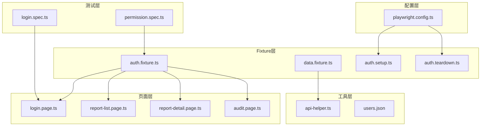
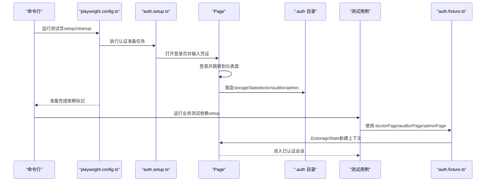
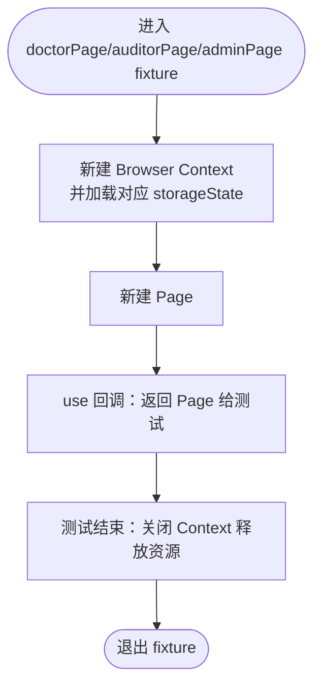
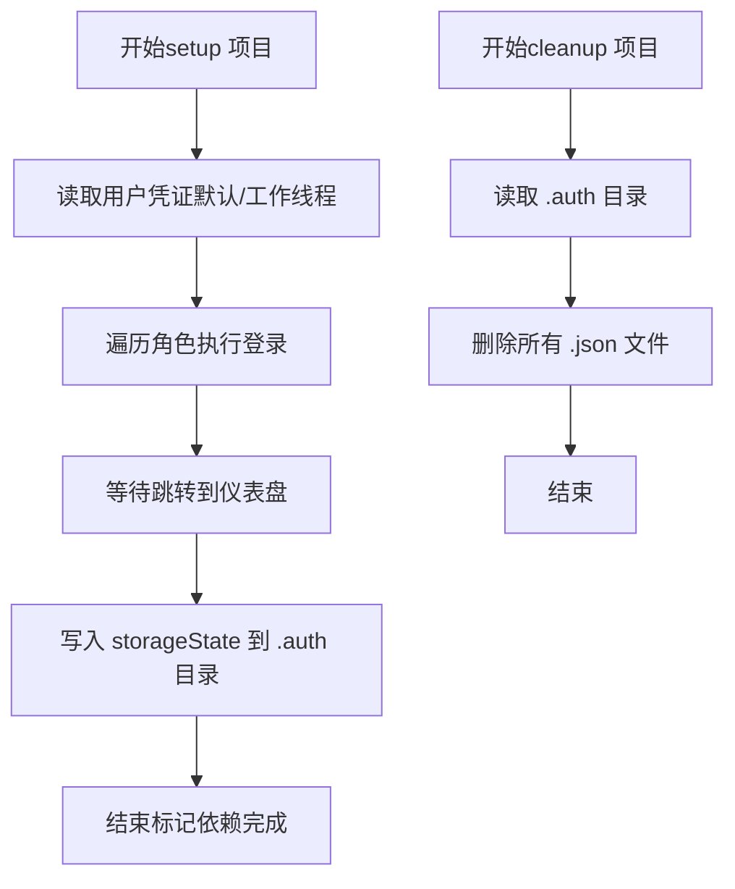
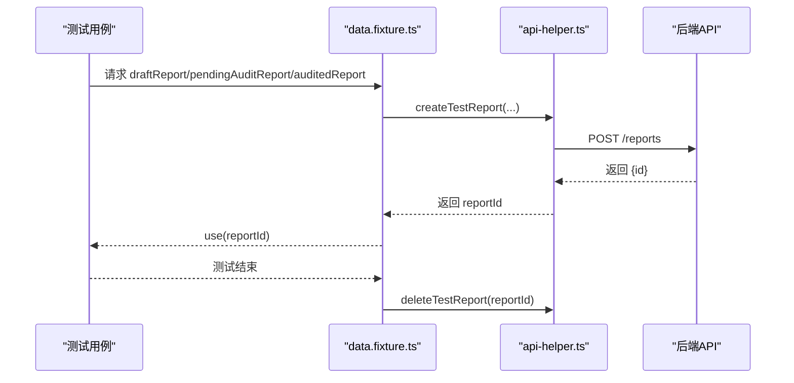
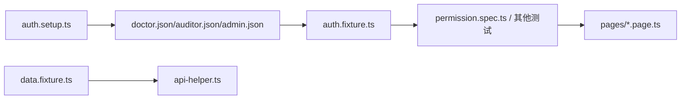

# 认证和Fixture系统

<cite>
**本文引用的文件**
- [playwright.config.ts](file://e2e-tests/playwright.config.ts)
- [auth.fixture.ts](file://e2e-tests/fixtures/auth.fixture.ts)
- [auth.setup.ts](file://e2e-tests/fixtures/auth.setup.ts)
- [auth.teardown.ts](file://e2e-tests/fixtures/auth.teardown.ts)
- [data.fixture.ts](file://e2e-tests/fixtures/data.fixture.ts)
- [users.json](file://e2e-tests/data/users.json)
- [login.page.ts](file://e2e-tests/pages/login.page.ts)
- [report-list.page.ts](file://e2e-tests/pages/report-list.page.ts)
- [report-detail.page.ts](file://e2e-tests/pages/report-detail.page.ts)
- [audit.page.ts](file://e2e-tests/pages/audit.page.ts)
- [permission.spec.ts](file://e2e-tests/tests/regression/permission.spec.ts)
- [login.spec.ts](file://e2e-tests/tests/smoke/login.spec.ts)
- [api-helper.ts](file://e2e-tests/utils/api-helper.ts)
- [package.json](file://e2e-tests/package.json)
</cite>

## 目录
1. [简介](#简介)
2. [项目结构](#项目结构)
3. [核心组件](#核心-components)
4. [架构总览](#架构总览)
5. [详细组件分析](#详细组件分析)
6. [依赖关系分析](#依赖关系分析)
7. [性能考虑](#性能考虑)
8. [故障排查指南](#故障排查指南)
9. [结论](#结论)
10. [附录](#附录)

## 简介
本文件面向开发者，系统性阐述该Playwright端到端测试工程中的认证与Fixture体系。重点包括：
- Playwright Fixture工作机制与认证状态管理
- 多角色用户（医生、审核员、管理员）支持与权限控制逻辑
- 认证状态的持久化存储与复用策略
- Fixture生命周期管理与数据清理策略
- 用户数据模型与认证流程说明
- 可扩展的自定义认证与权限实现指南

## 项目结构
该工程采用“按功能域划分”的组织方式，核心目录与职责如下：
- fixtures：认证Fixture与数据Fixture，负责登录态准备、复用与清理
- pages：页面对象模型（POM），封装UI交互与断言
- tests：测试用例，按冒烟与回归两类组织
- utils：工具模块，如API辅助、数据库辅助等
- data：静态数据源（如用户凭证）
- playwright.config.ts：全局配置，定义项目、设备、报告与认证准备任务

图表来源
- [playwright.config.ts:31-66](file://e2e-tests/playwright.config.ts#L31-L66)
- [auth.fixture.ts:10-37](file://e2e-tests/fixtures/auth.fixture.ts#L10-L37)
- [auth.setup.ts:18-28](file://e2e-tests/fixtures/auth.setup.ts#L18-L28)
- [auth.teardown.ts:7-17](file://e2e-tests/fixtures/auth.teardown.ts#L7-L17)
- [login.page.ts:29-34](file://e2e-tests/pages/login.page.ts#L29-L34)
- [report-list.page.ts:34-37](file://e2e-tests/pages/report-list.page.ts#L34-L37)
- [report-detail.page.ts:48-51](file://e2e-tests/pages/report-detail.page.ts#L48-L51)
- [audit.page.ts:42-45](file://e2e-tests/pages/audit.page.ts#L42-L45)
- [permission.spec.ts:36-100](file://e2e-tests/tests/regression/permission.spec.ts#L36-L100)
- [login.spec.ts:5-13](file://e2e-tests/tests/smoke/login.spec.ts#L5-L13)
- [api-helper.ts:83-121](file://e2e-tests/utils/api-helper.ts#L83-L121)
- [users.json:1-30](file://e2e-tests/data/users.json#L1-L30)

章节来源
- [playwright.config.ts:1-68](file://e2e-tests/playwright.config.ts#L1-L68)
- [auth.fixture.ts:1-40](file://e2e-tests/fixtures/auth.fixture.ts#L1-L40)
- [auth.setup.ts:1-30](file://e2e-tests/fixtures/auth.setup.ts#L1-L30)
- [auth.teardown.ts:1-18](file://e2e-tests/fixtures/auth.teardown.ts#L1-L18)
- [users.json:1-30](file://e2e-tests/data/users.json#L1-L30)

## 核心组件
- 认证Fixture（auth.fixture.ts）
  - 提供三种角色Page别名：doctorPage、auditorPage、adminPage
  - 通过storageState路径加载预登录态，确保测试快速进入受保护页面
- 认证准备与清理（auth.setup.ts、auth.teardown.ts）
  - 在独立“setup”项目中运行，完成一次性的登录与状态落盘
  - 在“cleanup”项目中清理storageState文件，避免跨测试污染
- 数据Fixture（data.fixture.ts）
  - 基于认证Fixture，自动创建/清理测试报告数据，保证测试隔离
- 页面对象模型（pages/*.page.ts）
  - 封装UI交互与断言，统一定位器命名与行为接口
- 测试用例（tests/*/*.spec.ts）
  - 权限测试覆盖三类角色在不同工作流中的可见性与可操作性
- 工具模块（utils/api-helper.ts）
  - 提供API上下文与测试数据准备，支持批量清理与状态变更

章节来源
- [auth.fixture.ts:10-37](file://e2e-tests/fixtures/auth.fixture.ts#L10-L37)
- [auth.setup.ts:18-28](file://e2e-tests/fixtures/auth.setup.ts#L18-L28)
- [auth.teardown.ts:7-17](file://e2e-tests/fixtures/auth.teardown.ts#L7-L17)
- [data.fixture.ts:13-54](file://e2e-tests/fixtures/data.fixture.ts#L13-L54)
- [login.page.ts:29-34](file://e2e-tests/pages/login.page.ts#L29-L34)
- [report-list.page.ts:34-37](file://e2e-tests/pages/report-list.page.ts#L34-L37)
- [report-detail.page.ts:48-51](file://e2e-tests/pages/report-detail.page.ts#L48-L51)
- [audit.page.ts:42-45](file://e2e-tests/pages/audit.page.ts#L42-L45)
- [permission.spec.ts:36-100](file://e2e-tests/tests/regression/permission.spec.ts#L36-L100)
- [api-helper.ts:83-121](file://e2e-tests/utils/api-helper.ts#L83-L121)

## 架构总览
认证与Fixture系统围绕“一次性准备、多次复用、自动清理”的原则设计，结合Playwright Projects实现跨浏览器与跨项目的数据共享。

图表来源
- [playwright.config.ts:31-66](file://e2e-tests/playwright.config.ts#L31-L66)
- [auth.setup.ts:18-28](file://e2e-tests/fixtures/auth.setup.ts#L18-L28)
- [auth.fixture.ts:10-37](file://e2e-tests/fixtures/auth.fixture.ts#L10-L37)

## 详细组件分析

### 认证Fixture（auth.fixture.ts）
- 设计要点
  - 通过extend扩展出三个角色Page别名，分别指向不同的storageState文件
  - 每个角色Page在use阶段创建独立Browser Context，确保会话隔离
  - 测试结束后关闭Context，避免资源泄漏
- 生命周期
  - 新建Context → 新建Page → use回调 → 关闭Context
- 适用场景
  - 需要以不同角色快速进入受保护页面的测试

图表来源
- [auth.fixture.ts:10-37](file://e2e-tests/fixtures/auth.fixture.ts#L10-L37)

章节来源
- [auth.fixture.ts:10-37](file://e2e-tests/fixtures/auth.fixture.ts#L10-L37)

### 认证准备与清理（auth.setup.ts、auth.teardown.ts）
- 准备流程
  - 读取用户凭证（默认与工作线程变体）
  - 依次执行登录流程，等待跳转至仪表盘
  - 调用storageState落盘，生成doctor.json、auditor.json、admin.json
- 清理流程
  - 删除.auth目录下所有.json文件，避免后续测试继承旧状态
- 项目编排
  - 通过playwright.config.ts中的projects将准备与清理拆分为独立任务，并设置依赖关系

图表来源
- [auth.setup.ts:18-28](file://e2e-tests/fixtures/auth.setup.ts#L18-L28)
- [auth.teardown.ts:7-17](file://e2e-tests/fixtures/auth.teardown.ts#L7-L17)
- [users.json:1-30](file://e2e-tests/data/users.json#L1-L30)

章节来源
- [auth.setup.ts:18-28](file://e2e-tests/fixtures/auth.setup.ts#L18-L28)
- [auth.teardown.ts:7-17](file://e2e-tests/fixtures/auth.teardown.ts#L7-L17)
- [users.json:1-30](file://e2e-tests/data/users.json#L1-L30)

### 数据Fixture（data.fixture.ts）
- 设计要点
  - 基于认证Fixture（authTest）扩展，确保在已认证上下文中创建/清理测试数据
  - 提供草稿、待审核、已审核三类报告的自动创建与清理
- 生命周期
  - beforeAll创建 → use阶段提供ID → afterAll清理
- 与API辅助的协作
  - 通过api-helper.ts统一管理API上下文与数据准备，支持批量清理

图表来源
- [data.fixture.ts:13-54](file://e2e-tests/fixtures/data.fixture.ts#L13-L54)
- [api-helper.ts:83-121](file://e2e-tests/utils/api-helper.ts#L83-L121)

章节来源
- [data.fixture.ts:13-54](file://e2e-tests/fixtures/data.fixture.ts#L13-L54)
- [api-helper.ts:83-121](file://e2e-tests/utils/api-helper.ts#L83-L121)

### 页面对象模型（pages/*.page.ts）
- Login Page
  - 提供goto、login、attemptLogin、getErrorText等方法，封装登录流程与错误断言
- Report List Page
  - 提供搜索、筛选、分页、打开报告等操作，等待响应完成
- Report Detail Page
  - 提供查看、编辑、发布、作废等操作，断言状态与按钮可见性
- Audit Page
  - 提供审核通过/退回流程，断言状态与历史记录

章节来源
- [login.page.ts:29-34](file://e2e-tests/pages/login.page.ts#L29-L34)
- [report-list.page.ts:34-37](file://e2e-tests/pages/report-list.page.ts#L34-L37)
- [report-detail.page.ts:48-51](file://e2e-tests/pages/report-detail.page.ts#L48-L51)
- [audit.page.ts:42-45](file://e2e-tests/pages/audit.page.ts#L42-L45)

### 权限控制与多角色支持（permission.spec.ts）
- 角色与权限矩阵
  - 医生：可编辑自己创建的草稿；无审核按钮
  - 审核医生：可审核待审核报告；编辑按钮不可用
  - 管理员：可发布/作废已审核报告
- 实现方式
  - 通过auth.fixture.ts提供的角色Page直接进入目标页面
  - 使用页面对象的断言方法验证按钮可见性与可用性
- 数据准备
  - 在beforeAll中通过API创建三类状态的报告，afterAll中统一清理

章节来源
- [permission.spec.ts:36-100](file://e2e-tests/tests/regression/permission.spec.ts#L36-L100)
- [auth.fixture.ts:10-37](file://e2e-tests/fixtures/auth.fixture.ts#L10-L37)
- [api-helper.ts:83-121](file://e2e-tests/utils/api-helper.ts#L83-L121)

### 配置与环境变量（playwright.config.ts、package.json）
- 项目配置
  - testDir、timeout、expect.timeout、fullyParallel、retries、workers、reporter
  - projects：setup、cleanup、smoke-chromium、regression-chromium、regression-firefox
  - use：baseURL、截图、视频、trace等
- 环境变量
  - BASE_URL、API_BASE_URL由dotenv加载
- 脚本
  - 提供冒烟、回归、全量测试与报告生成脚本

章节来源
- [playwright.config.ts:6-29](file://e2e-tests/playwright.config.ts#L6-L29)
- [playwright.config.ts:31-66](file://e2e-tests/playwright.config.ts#L31-L66)
- [package.json:6-12](file://e2e-tests/package.json#L6-L12)

## 依赖关系分析
- 低耦合高内聚
  - Fixture专注于认证态复用，页面对象专注UI交互，工具模块专注数据准备
- 明确的依赖链
  - 测试用例依赖认证Fixture；数据Fixture依赖认证Fixture；API辅助被数据Fixture与测试用例间接使用
- 清晰的生命周期
  - setup → 业务测试（依赖setup）→ cleanup

图表来源
- [auth.setup.ts:18-28](file://e2e-tests/fixtures/auth.setup.ts#L18-L28)
- [auth.fixture.ts:10-37](file://e2e-tests/fixtures/auth.fixture.ts#L10-L37)
- [data.fixture.ts:13-54](file://e2e-tests/fixtures/data.fixture.ts#L13-L54)
- [api-helper.ts:83-121](file://e2e-tests/utils/api-helper.ts#L83-L121)
- [permission.spec.ts:36-100](file://e2e-tests/tests/regression/permission.spec.ts#L36-L100)

章节来源
- [auth.setup.ts:18-28](file://e2e-tests/fixtures/auth.setup.ts#L18-L28)
- [auth.fixture.ts:10-37](file://e2e-tests/fixtures/auth.fixture.ts#L10-L37)
- [data.fixture.ts:13-54](file://e2e-tests/fixtures/data.fixture.ts#L13-L54)
- [api-helper.ts:83-121](file://e2e-tests/utils/api-helper.ts#L83-L121)
- [permission.spec.ts:36-100](file://e2e-tests/tests/regression/permission.spec.ts#L36-L100)

## 性能考虑
- 并发与并行
  - fullyParallel开启，CI下workers=4，提升执行效率
- 状态复用
  - 通过storageState避免重复登录，显著缩短测试时间
- 资源释放
  - 每个角色Page在use后及时关闭Context，防止内存与连接泄漏
- 数据隔离
  - 每个测试使用独立API上下文与临时数据，避免相互影响

## 故障排查指南
- 登录失败或跳转异常
  - 检查BASE_URL是否正确，确认登录页路由与定位器
  - 参考：[login.page.ts:29-34](file://e2e-tests/pages/login.page.ts#L29-L34)
- 认证状态未生效
  - 确认setup任务已成功生成doctor.json/auditor.json/admin.json
  - 确认playwright.config.ts中setup项目已执行且依赖已满足
  - 参考：[auth.setup.ts:18-28](file://e2e-tests/fixtures/auth.setup.ts#L18-L28)，[playwright.config.ts:31-66](file://e2e-tests/playwright.config.ts#L31-L66)
- 权限断言失败
  - 检查页面对象定位器是否匹配UI实际结构
  - 确认测试数据状态与预期一致（草稿/待审核/已审核）
  - 参考：[permission.spec.ts:36-100](file://e2e-tests/tests/regression/permission.spec.ts#L36-L100)
- 数据清理失败
  - 确认cleanup项目已执行，或手动删除.auth目录
  - 参考：[auth.teardown.ts:7-17](file://e2e-tests/fixtures/auth.teardown.ts#L7-L17)
- API请求失败
  - 检查API_BASE_URL与认证token获取流程
  - 参考：[api-helper.ts:45-77](file://e2e-tests/utils/api-helper.ts#L45-L77)

章节来源
- [login.page.ts:29-34](file://e2e-tests/pages/login.page.ts#L29-L34)
- [auth.setup.ts:18-28](file://e2e-tests/fixtures/auth.setup.ts#L18-L28)
- [playwright.config.ts:31-66](file://e2e-tests/playwright.config.ts#L31-L66)
- [permission.spec.ts:36-100](file://e2e-tests/tests/regression/permission.spec.ts#L36-L100)
- [auth.teardown.ts:7-17](file://e2e-tests/fixtures/auth.teardown.ts#L7-L17)
- [api-helper.ts:45-77](file://e2e-tests/utils/api-helper.ts#L45-L77)

## 结论
该认证与Fixture系统通过“一次性准备、多次复用、自动清理”的模式，实现了稳定高效的多角色权限测试方案。其优势在于：
- 显著降低登录成本，提升测试执行效率
- 通过明确的Fixture边界与页面对象封装，提高可维护性
- 借助Projects与storageState，实现跨浏览器与跨项目的状态共享
建议在团队内推广此模式，并根据业务扩展更多角色与数据Fixture。

## 附录

### 用户数据模型与认证流程
- 用户数据模型
  - 支持默认用户与工作线程变体（doctor/auditor/admin）
  - 参考：[users.json:1-30](file://e2e-tests/data/users.json#L1-L30)
- 认证流程
  - 登录页输入用户名/密码 → 点击登录 → 等待跳转到仪表盘 → 落盘storageState
  - 参考：[login.page.ts:29-34](file://e2e-tests/pages/login.page.ts#L29-L34)，[auth.setup.ts:18-28](file://e2e-tests/fixtures/auth.setup.ts#L18-L28)

### 配置参数与扩展指南
- Playwright配置要点
  - projects：setup/cleanup/业务项目，设置dependencies与设备
  - use：baseURL、截图、视频、trace等
  - 参考：[playwright.config.ts:6-29](file://e2e-tests/playwright.config.ts#L6-L29)，[playwright.config.ts:31-66](file://e2e-tests/playwright.config.ts#L31-L66)
- 扩展认证方式
  - 如需支持第三方登录或MFA，可在auth.setup.ts中增加相应步骤并更新storageState
  - 参考：[auth.setup.ts:18-28](file://e2e-tests/fixtures/auth.setup.ts#L18-L28)
- 扩展权限系统
  - 在auth.fixture.ts新增角色别名，或在data.fixture.ts扩展更多测试数据类型
  - 参考：[auth.fixture.ts:10-37](file://e2e-tests/fixtures/auth.fixture.ts#L10-L37)，[data.fixture.ts:13-54](file://e2e-tests/fixtures/data.fixture.ts#L13-L54)
- API辅助扩展
  - 在api-helper.ts中添加新的数据准备与清理方法，统一管理认证上下文
  - 参考：[api-helper.ts:83-121](file://e2e-tests/utils/api-helper.ts#L83-L121)