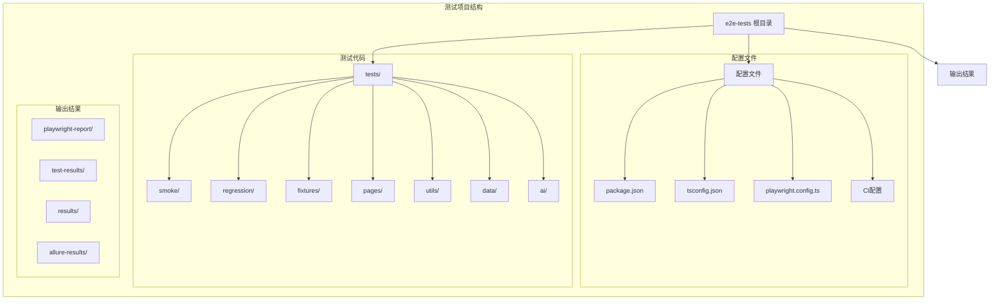
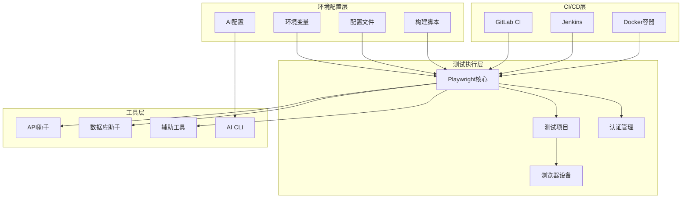
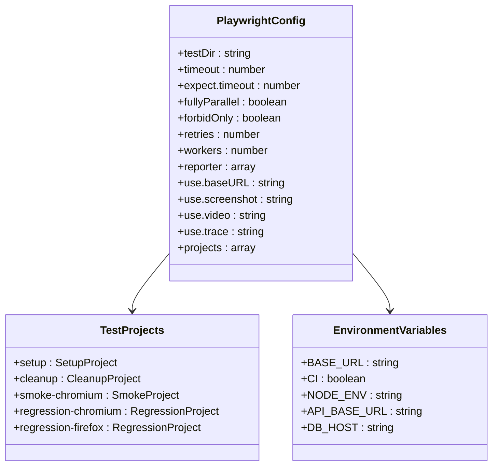
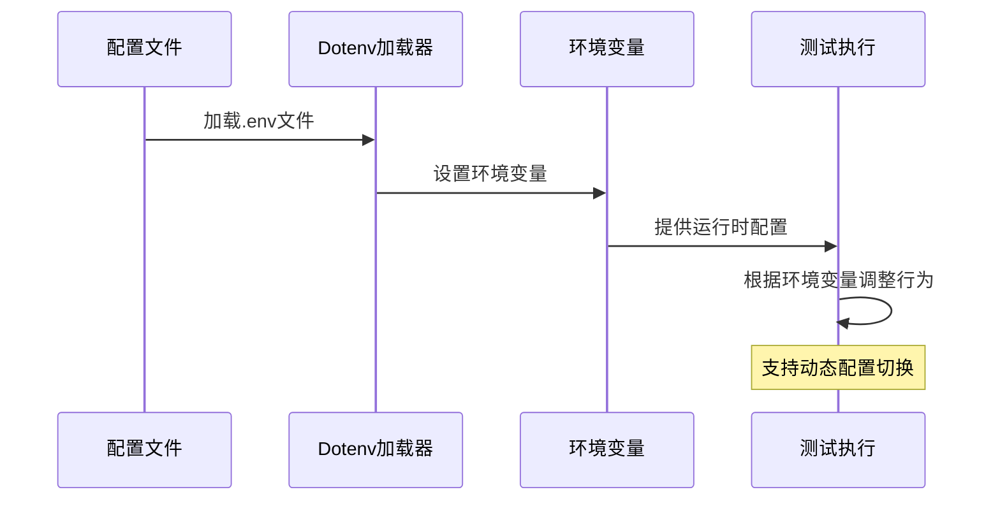
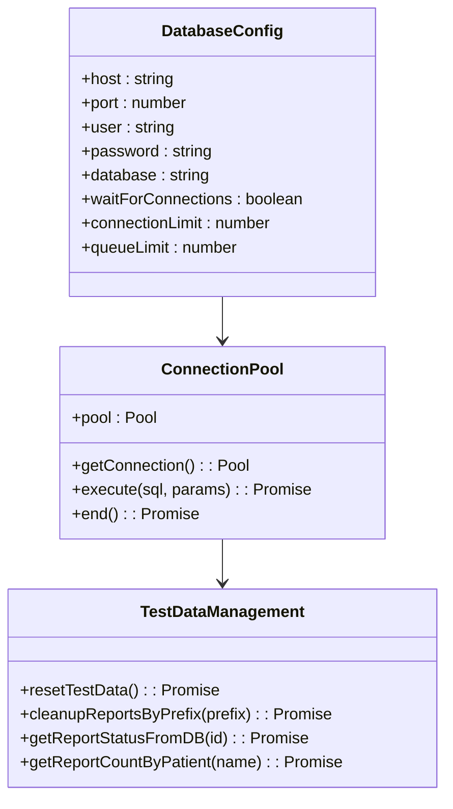
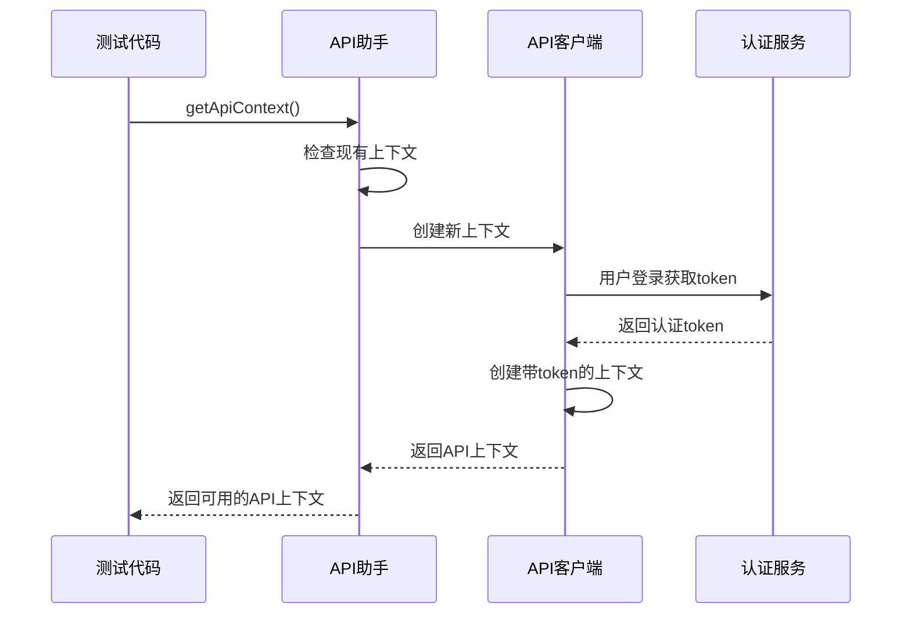
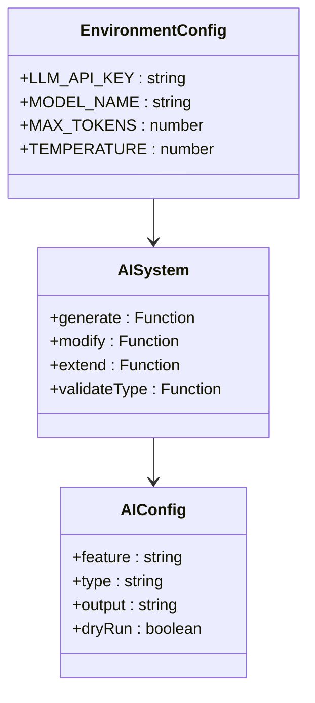
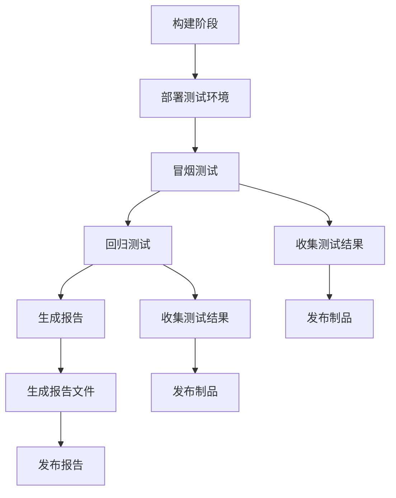

# 环境配置管理

<cite>
**本文档引用的文件**
- [package.json](file://e2e-tests/package.json)
- [playwright.config.ts](file://e2e-tests/playwright.config.ts)
- [tsconfig.json](file://e2e-tests/tsconfig.json)
- [.gitlab-ci.yml](file://e2e-tests/.gitlab-ci.yml)
- [Jenkinsfile](file://e2e-tests/Jenkinsfile)
- [auth.setup.ts](file://e2e-tests/fixtures/auth.setup.ts)
- [auth.teardown.ts](file://e2e-tests/fixtures/auth.teardown.ts)
- [auth.fixture.ts](file://e2e-tests/fixtures/auth.fixture.ts)
- [api-helper.ts](file://e2e-tests/utils/api-helper.ts)
- [db-helper.ts](file://e2e-tests/utils/db-helper.ts)
- [cli.ts](file://e2e-tests/ai/cli.ts)
</cite>

## 更新摘要
**所做更改**
- 更新了环境变量管理章节，反映更灵活的配置加载机制
- 新增了AI测试生成功能的环境配置说明
- 完善了认证状态管理的配置细节
- 增强了数据库配置和API配置的环境适配说明
- 更新了CI/CD集成中的环境变量传递机制

## 目录
1. [简介](#简介)
2. [项目结构](#项目结构)
3. [核心组件](#核心组件)
4. [架构概览](#架构概览)
5. [详细组件分析](#详细组件分析)
6. [依赖关系分析](#依赖关系分析)
7. [性能考虑](#性能考虑)
8. [故障排除指南](#故障排除指南)
9. [结论](#结论)
10. [附录](#附录)

## 简介

本项目是一个基于Playwright的端到端测试框架，专注于医院体检报告管理系统的自动化测试。项目采用现代化的测试架构，支持多环境配置、环境变量管理、依赖包版本控制和配置文件组织结构。

该测试框架提供了完整的环境配置管理方案，包括开发环境、测试环境和生产环境的差异化配置，支持多种包管理器（npm、pnpm）和CI/CD集成。最新的改进增强了配置管理的灵活性，支持更精细的环境切换和配置验证机制。

## 项目结构

项目采用功能模块化的组织方式，主要包含以下核心目录：



**图表来源**
- [package.json:1-35](file://e2e-tests/package.json#L1-L35)
- [playwright.config.ts:1-54](file://e2e-tests/playwright.config.ts#L1-L54)
- [tsconfig.json:1-25](file://e2e-tests/tsconfig.json#L1-L25)

**章节来源**
- [package.json:1-35](file://e2e-tests/package.json#L1-L35)
- [playwright.config.ts:1-54](file://e2e-tests/playwright.config.ts#L1-L54)
- [tsconfig.json:1-25](file://e2e-tests/tsconfig.json#L1-L25)

## 核心组件

### 环境配置系统

项目实现了多层次的环境配置管理，支持灵活的配置切换和环境适配：

#### 1. 环境变量管理
- **dotenv集成**：通过dotenv库实现环境变量加载
- **多环境支持**：支持开发、测试、生产环境的差异化配置
- **安全存储**：敏感信息通过环境变量管理，避免硬编码
- **动态加载**：支持运行时动态加载和覆盖配置

#### 2. Playwright配置管理
- **项目化配置**：支持多个测试项目（smoke、regression）
- **浏览器设备配置**：针对不同浏览器的设备模拟
- **并行执行**：支持多项目并行测试执行
- **条件配置**：根据CI/CD环境动态调整配置参数

#### 3. TypeScript编译配置
- **模块解析**：使用bundler模式进行模块解析
- **路径映射**：配置了完整的路径别名映射
- **严格类型检查**：启用严格的TypeScript编译选项

**章节来源**
- [playwright.config.ts:4](file://e2e-tests/playwright.config.ts#L4)
- [tsconfig.json:14-20](file://e2e-tests/tsconfig.json#L14-L20)

## 架构概览

项目采用分层架构设计，确保环境配置的灵活性和可维护性：



**图表来源**
- [package.json:6-17](file://e2e-tests/package.json#L6-L17)
- [playwright.config.ts:33-52](file://e2e-tests/playwright.config.ts#L33-L52)
- [.gitlab-ci.yml:8-46](file://e2e-tests/.gitlab-ci.yml#L8-L46)

## 详细组件分析

### Playwright配置管理

#### 配置文件结构
Playwright配置文件实现了完整的环境适配机制，支持灵活的配置切换：



**图表来源**
- [playwright.config.ts:6-54](file://e2e-tests/playwright.config.ts#L6-L54)

#### 项目配置分析
项目定义了四个主要测试项目，支持灵活的环境切换：

1. **Setup项目**：负责用户认证状态的准备
2. **Cleanup项目**：测试完成后清理认证状态
3. **Smoke项目**：冒烟测试，仅使用Chromium浏览器
4. **Regression项目**：回归测试，支持Chromium和Firefox

**章节来源**
- [playwright.config.ts:33-52](file://e2e-tests/playwright.config.ts#L33-L52)

### 环境变量管理

#### 变量定义与使用
项目通过多种方式管理环境变量，支持灵活的配置切换：



**图表来源**
- [playwright.config.ts:4](file://e2e-tests/playwright.config.ts#L4)
- [api-helper.ts:4](file://e2e-tests/utils/api-helper.ts#L4)
- [db-helper.ts:4](file://e2e-tests/utils/db-helper.ts#L4)

#### 变量作用域分析
- **全局变量**：在所有配置文件中生效
- **条件变量**：根据CI环境动态调整
- **项目变量**：特定测试项目使用的变量
- **动态变量**：运行时可修改的配置参数

**章节来源**
- [playwright.config.ts:13-15](file://e2e-tests/playwright.config.ts#L13-L15)
- [playwright.config.ts:24-31](file://e2e-tests/playwright.config.ts#L24-L31)

### 认证状态管理

#### 认证流程设计
项目实现了完整的认证状态管理机制，支持灵活的配置切换：


**图表来源**
- [auth.setup.ts:17-116](file://e2e-tests/fixtures/auth.setup.ts#L17-L116)

#### 认证状态存储
- **文件存储**：认证状态保存为JSON文件
- **角色分离**：不同用户角色使用独立的存储文件
- **自动清理**：测试结束后自动清理认证文件
- **调试支持**：支持临时禁用清理以便调试

**章节来源**
- [auth.setup.ts:1-116](file://e2e-tests/fixtures/auth.setup.ts#L1-L116)
- [auth.teardown.ts:1-26](file://e2e-tests/fixtures/auth.teardown.ts#L1-L26)
- [auth.fixture.ts:10-52](file://e2e-tests/fixtures/auth.fixture.ts#L10-L52)

### 数据库配置管理

#### 连接池配置
数据库配置实现了连接池管理和环境适配，支持灵活的配置切换：



**图表来源**
- [db-helper.ts:14-27](file://e2e-tests/utils/db-helper.ts#L14-L27)

#### 数据清理策略
- **测试前清理**：重置测试数据到初始状态
- **按前缀清理**：支持按命名规则清理特定数据
- **数据库验证**：提供数据库层面的数据状态验证
- **连接池管理**：支持连接池的生命周期管理

**章节来源**
- [db-helper.ts:33-91](file://e2e-tests/utils/db-helper.ts#L33-L91)

### API配置管理

#### API上下文管理
API助手实现了智能的API上下文管理，支持灵活的身份认证切换：



**图表来源**
- [api-helper.ts:45-98](file://e2e-tests/utils/api-helper.ts#L45-L98)

#### 数据操作接口
- **报告创建**：支持批量创建测试报告
- **状态更新**：直接通过API更新报告状态
- **数据清理**：提供批量数据清理功能
- **上下文管理**：支持API上下文的生命周期管理

**章节来源**
- [api-helper.ts:104-206](file://e2e-tests/utils/api-helper.ts#L104-L206)

### AI测试生成配置

#### AI CLI配置
AI测试生成系统提供了灵活的配置管理：



**图表来源**
- [cli.ts:14-77](file://e2e-tests/ai/cli.ts#L14-L77)

#### AI功能特性
- **测试生成**：根据功能描述生成新的测试文件
- **测试修改**：修改现有测试文件
- **测试扩展**：在现有测试文件中追加测试用例
- **配置验证**：支持测试类型的验证和约束

**章节来源**
- [cli.ts:1-77](file://e2e-tests/ai/cli.ts#L1-L77)

## 依赖关系分析

### 包管理器配置

项目支持多种包管理器，提供了灵活的依赖管理方案：

```mermaid
graph LR
subgraph "包管理器支持"
NPM[npm]
PNPM[pnpm]
Yarn[yarn]
end
subgraph "依赖管理"
Lock[package-lock.json]
Manifest[package.json]
PnpmStore[pnpm store]
end
subgraph "开发依赖"
Playwright[@playwright/test]
Typescript[typescript]
Allure[allure-playwright]
MySQL[mysql2]
Dotenv[dotenv]
Commander[commander]
TSX[tsx]
End
NPM --> Lock
PNPM --> PnpmStore
Yarn --> Lock
Manifest --> Playwright
Manifest --> Typescript
Manifest --> Allure
Manifest --> MySQL
Manifest --> Dotenv
Manifest --> Commander
Manifest --> TSX
```

**图表来源**
- [package.json:22-33](file://e2e-tests/package.json#L22-L33)

### 版本控制策略

#### 依赖版本管理
- **主版本锁定**：使用^符号锁定主版本
- **兼容性保证**：确保向后兼容的次要版本更新
- **安全更新**：定期更新安全相关的依赖包
- **AI工具支持**：支持AI测试生成的专用依赖

#### Node.js版本要求
- **最低版本**：Node.js >= 18
- **长期支持**：建议使用LTS版本
- **兼容性测试**：在多个Node.js版本上进行测试
- **AI工具兼容**：支持现代JavaScript特性和ES模块

**章节来源**
- [package.json:19-21](file://e2e-tests/package.json#L19-L21)

### CI/CD集成配置

#### GitLab CI配置
项目实现了完整的CI/CD流水线配置，支持灵活的环境变量传递：



**图表来源**
- [.gitlab-ci.yml:1-67](file://e2e-tests/.gitlab-ci.yml#L1-L67)

#### Jenkins集成配置
- **Docker容器**：使用官方Playwright Docker镜像
- **环境隔离**：每个构建在独立的容器环境中执行
- **制品管理**：自动收集和发布测试制品
- **环境变量继承**：支持从Jenkins传递环境变量

**章节来源**
- [.gitlab-ci.yml:8-46](file://e2e-tests/.gitlab-ci.yml#L8-L46)
- [Jenkinsfile:1-59](file://e2e-tests/Jenkinsfile#L1-L59)

## 性能考虑

### 并行执行优化

项目实现了多层级的并行执行策略，支持灵活的配置调整：

#### 测试并行化
- **项目级并行**：不同测试项目可以并行执行
- **浏览器并行**：支持多浏览器同时执行
- **用例级并行**：单个项目内的测试用例并行执行
- **条件并行**：根据环境变量动态调整并行度

#### 资源管理
- **连接池**：数据库连接使用连接池管理
- **内存优化**：API上下文采用单例模式
- **文件系统**：认证状态文件的高效管理
- **AI资源**：AI测试生成的资源优化

### 缓存策略

#### 认证状态缓存
- **文件缓存**：认证状态持久化到文件系统
- **重复使用**：避免重复登录操作
- **自动清理**：测试结束后自动清理缓存
- **调试支持**：支持临时禁用清理以便调试

#### 浏览器缓存
- **上下文复用**：同一浏览器上下文的复用
- **页面缓存**：页面对象的生命周期管理
- **AI缓存**：AI生成内容的缓存机制

## 故障排除指南

### 常见配置问题

#### 环境变量问题
**问题**：环境变量无法正确加载
**解决方案**：
1. 检查.env文件是否存在且格式正确
2. 验证dotenv配置是否正确初始化
3. 确认环境变量名称拼写正确
4. 验证环境变量的优先级和覆盖顺序

#### 数据库连接问题
**问题**：数据库连接失败
**解决方案**：
1. 验证数据库服务器地址和端口
2. 检查数据库凭据配置
3. 确认数据库服务正常运行
4. 验证连接池配置和限制

#### 浏览器驱动问题
**问题**：浏览器驱动下载失败
**解决方案**：
1. 检查网络连接和代理设置
2. 验证Playwright浏览器安装
3. 确认Docker容器网络配置
4. 验证CI/CD环境中的浏览器可用性

#### AI测试生成问题
**问题**：AI测试生成失败
**解决方案**：
1. 检查LLM API密钥配置
2. 验证模型名称和参数设置
3. 确认AI生成的输出权限
4. 验证测试文件的写入权限

### 调试技巧

#### 日志记录
- **详细日志**：启用详细的测试执行日志
- **错误追踪**：捕获和记录详细的错误信息
- **性能监控**：监控测试执行时间和资源使用
- **AI调试**：支持AI生成过程的详细日志

#### 断点调试
- **浏览器调试**：使用浏览器开发者工具
- **Node.js调试**：使用VS Code等IDE进行调试
- **API调试**：使用Postman等工具测试API
- **AI调试**：支持AI生成逻辑的调试

**章节来源**
- [playwright.config.ts:8-15](file://e2e-tests/playwright.config.ts#L8-L15)

## 结论

本项目提供了一个完整的企业级环境配置管理解决方案。通过多层配置架构、灵活的环境变量管理、完善的CI/CD集成和强大的工具链支持，实现了高效的跨环境测试管理。

### 主要优势
1. **环境隔离**：清晰的环境配置分离
2. **自动化程度高**：完整的CI/CD流水线
3. **可扩展性强**：模块化的架构设计
4. **维护成本低**：标准化的配置管理
5. **AI集成**：支持AI驱动的测试生成
6. **灵活切换**：支持多种环境配置的快速切换

### 最佳实践建议
1. **配置版本控制**：将配置文件纳入版本控制系统
2. **环境变量加密**：敏感信息使用加密存储
3. **定期更新**：保持依赖包和工具的最新状态
4. **监控告警**：建立完善的监控和告警机制
5. **AI配置管理**：合理配置AI测试生成的参数
6. **环境验证**：建立配置验证和测试机制

## 附录

### 配置文件清单

#### 核心配置文件
- `package.json` - 项目配置和依赖管理
- `playwright.config.ts` - Playwright测试配置
- `tsconfig.json` - TypeScript编译配置

#### CI/CD配置文件
- `.gitlab-ci.yml` - GitLab CI/CD配置
- `Jenkinsfile` - Jenkins流水线配置

#### 环境配置文件
- `.env.development` - 开发环境配置
- `.env.test` - 测试环境配置  
- `.env.production` - 生产环境配置

### 命令参考

#### 测试命令
- `npm run test:smoke` - 执行冒烟测试
- `npm run test:regression` - 执行回归测试
- `npm run test:all` - 执行所有测试
- `npm run report:html` - 打开HTML报告
- `npm run report:allure` - 生成Allure报告

#### 开发命令
- `npm run dev` - 启动开发服务器
- `npm run build` - 构建项目
- `npm run lint` - 代码质量检查

#### AI测试命令
- `npm run ai:generate` - 生成AI测试
- `npm run ai:modify` - 修改AI测试
- `npm run ai:extend` - 扩展AI测试
- `npm run ui` - 启动UI界面
- `npm run ui:install` - 安装UI依赖

### 环境变量参考

#### 基础配置
- `BASE_URL` - 应用程序基础URL
- `API_BASE_URL` - API基础URL
- `CI` - CI/CD环境标识
- `NODE_ENV` - Node.js环境模式

#### 数据库配置
- `DB_HOST` - 数据库主机地址
- `DB_PORT` - 数据库端口号
- `DB_USER` - 数据库用户名
- `DB_PASSWORD` - 数据库密码
- `DB_NAME` - 数据库名称

#### AI配置
- `LLM_API_KEY` - 大语言模型API密钥
- `MODEL_NAME` - 使用的模型名称
- `MAX_TOKENS` - 最大令牌数
- `TEMPERATURE` - 模型温度参数