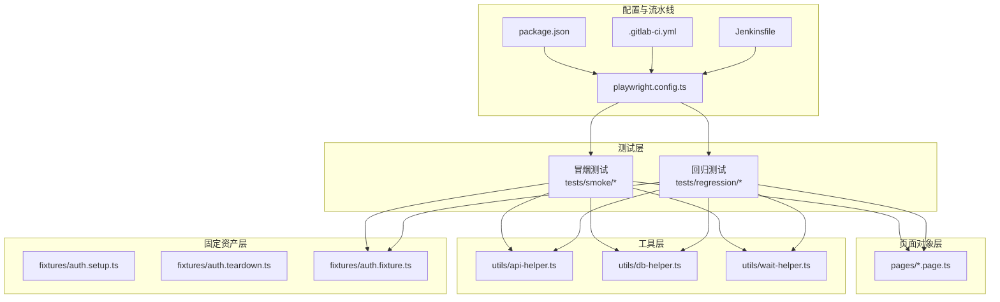
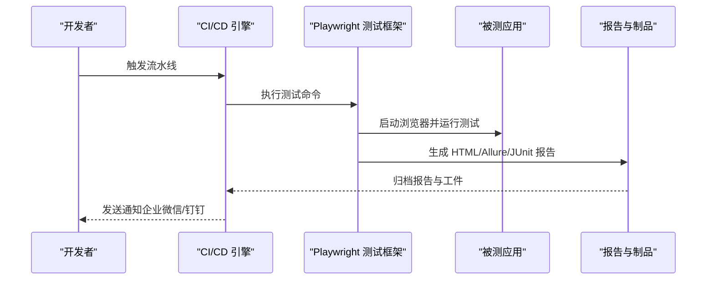
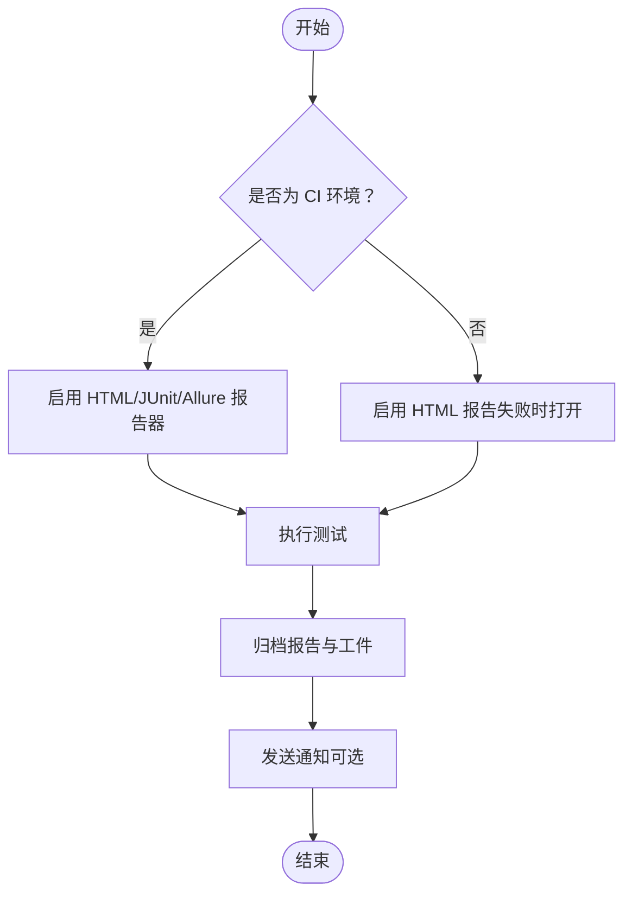
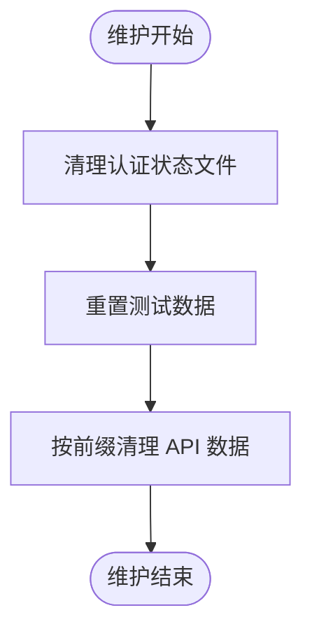
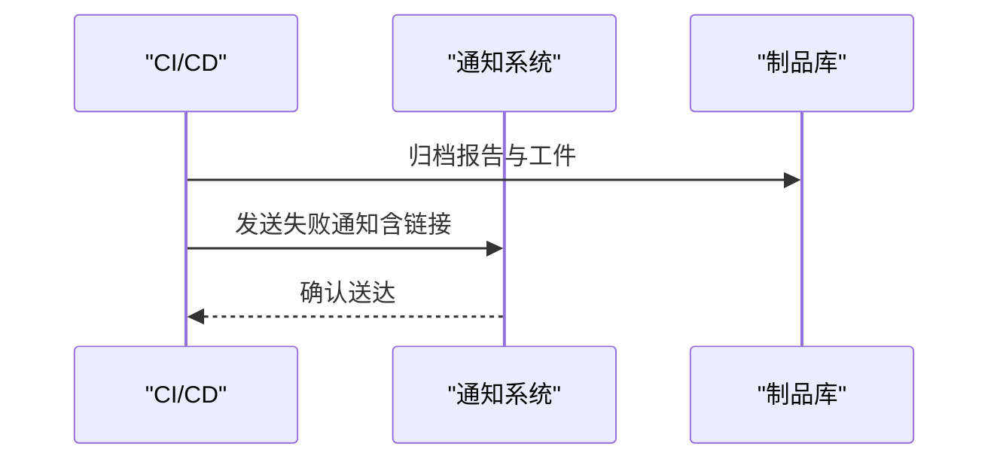
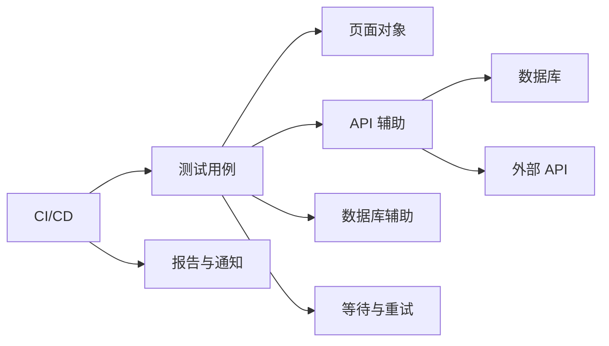

# 监控和维护

<cite>
**本文引用的文件**
- [package.json](file://e2e-tests/package.json)
- [playwright.config.ts](file://e2e-tests/playwright.config.ts)
- [.gitlab-ci.yml](file://e2e-tests/.gitlab-ci.yml)
- [Jenkinsfile](file://e2e-tests/Jenkinsfile)
- [api-helper.ts](file://e2e-tests/utils/api-helper.ts)
- [db-helper.ts](file://e2e-tests/utils/db-helper.ts)
- [wait-helper.ts](file://e2e-tests/utils/wait-helper.ts)
- [auth.setup.ts](file://e2e-tests/fixtures/auth.setup.ts)
- [auth.teardown.ts](file://e2e-tests/fixtures/auth.teardown.ts)
- [auth.fixture.ts](file://e2e-tests/fixtures/auth.fixture.ts)
- [login.spec.ts](file://e2e-tests/tests/smoke/login.spec.ts)
- [report-crud.spec.ts](file://e2e-tests/tests/regression/report-crud.spec.ts)
</cite>

## 目录
1. [简介](#简介)
2. [项目结构](#项目结构)
3. [核心组件](#核心组件)
4. [架构总览](#架构总览)
5. [详细组件分析](#详细组件分析)
6. [依赖分析](#依赖分析)
7. [性能考虑](#性能考虑)
8. [故障排查指南](#故障排查指南)
9. [结论](#结论)
10. [附录](#附录)

## 简介
本指南围绕端到端测试体系的监控与维护展开，覆盖测试执行监控、性能指标跟踪、系统健康检查、日志与报告管理、错误处理与异常监控、系统维护与数据清理、资源使用优化、故障诊断与瓶颈分析、容量规划以及自动化监控告警与应急响应流程。文档基于仓库中的 Playwright 配置、CI/CD 流水线、辅助工具模块与测试用例进行系统化梳理，帮助团队建立稳定可靠的自动化测试运维体系。

## 项目结构
该仓库采用“测试驱动 + 工具辅助 + CI/CD 集成”的组织方式：
- 测试层：tests 下按冒烟与回归分类组织用例，使用 fixtures 进行角色上下文注入。
- 页面对象层：pages 下封装页面交互逻辑，便于复用与维护。
- 工具层：utils 下提供 API 辅助、数据库辅助、等待与重试等通用能力。
- 固定资产层：fixtures 下提供认证状态准备与清理、角色上下文注入。
- 配置与流水线：playwright.config.ts 定义测试行为；package.json、Jenkinsfile、.gitlab-ci.yml 定义脚本与 CI/CD 阶段。

图表来源
- [playwright.config.ts:1-68](file://e2e-tests/playwright.config.ts#L1-L68)
- [package.json:1-27](file://e2e-tests/package.json#L1-L27)
- [.gitlab-ci.yml:1-67](file://e2e-tests/.gitlab-ci.yml#L1-L67)
- [Jenkinsfile:1-59](file://e2e-tests/Jenkinsfile#L1-L59)

章节来源
- [playwright.config.ts:1-68](file://e2e-tests/playwright.config.ts#L1-L68)
- [package.json:1-27](file://e2e-tests/package.json#L1-L27)

## 核心组件
- 测试执行与报告
  - Playwright 配置定义超时、并行度、重试、工件输出与报告格式。
  - CI/CD 配置定义冒烟与回归阶段，产物归档与通知。
- 数据准备与清理
  - API 辅助模块负责认证、创建/删除/更新报告、批量清理。
  - 数据库辅助模块负责连接池、重置测试数据、按前缀清理、状态校验。
- 等待与重试
  - 等待辅助模块提供表格加载、API 响应、导航完成、文本匹配等等待策略。
  - 重试包装器用于对不稳定操作进行有限次数重试。
- 认证与上下文
  - 固定资产提供登录态准备、清理与角色上下文注入，确保测试稳定性。

章节来源
- [playwright.config.ts:1-68](file://e2e-tests/playwright.config.ts#L1-L68)
- [.gitlab-ci.yml:1-67](file://e2e-tests/.gitlab-ci.yml#L1-L67)
- [Jenkinsfile:1-59](file://e2e-tests/Jenkinsfile#L1-L59)
- [api-helper.ts:1-172](file://e2e-tests/utils/api-helper.ts#L1-L172)
- [db-helper.ts:1-91](file://e2e-tests/utils/db-helper.ts#L1-L91)
- [wait-helper.ts:1-107](file://e2e-tests/utils/wait-helper.ts#L1-L107)
- [auth.setup.ts:1-28](file://e2e-tests/fixtures/auth.setup.ts#L1-L28)
- [auth.teardown.ts:1-18](file://e2e-tests/fixtures/auth.teardown.ts#L1-L18)
- [auth.fixture.ts:1-40](file://e2e-tests/fixtures/auth.fixture.ts#L1-L40)

## 架构总览
下图展示从测试执行到报告产出与通知的整体流程，包括 Playwright 配置、CI/CD 阶段、报告生成与制品归档、通知通道等。

图表来源
- [playwright.config.ts:16-22](file://e2e-tests/playwright.config.ts#L16-L22)
- [.gitlab-ci.yml:11-28](file://e2e-tests/.gitlab-ci.yml#L11-L28)
- [.gitlab-ci.yml:29-46](file://e2e-tests/.gitlab-ci.yml#L29-L46)
- [.gitlab-ci.yml:48-67](file://e2e-tests/.gitlab-ci.yml#L48-L67)
- [Jenkinsfile:21-38](file://e2e-tests/Jenkinsfile#L21-L38)
- [Jenkinsfile:41-57](file://e2e-tests/Jenkinsfile#L41-L57)

## 详细组件分析

### 测试执行监控与报告
- Playwright 报告器配置
  - 在 CI 环境下启用 HTML、JUnit、Allure 报告器，并设置输出目录与打开策略。
  - 本地开发环境仅在失败时打开 HTML 报告，降低干扰。
- CI/CD 阶段与产物
  - GitLab CI：冒烟测试与回归测试分别在不同阶段执行，产物归档至指定路径，支持通知。
  - Jenkins：安装依赖、冒烟测试、回归测试（分支条件）、报告归档与通知。
- 测试命令与脚本
  - package.json 提供统一测试脚本入口，便于本地与 CI 复用。

图表来源
- [playwright.config.ts:16-22](file://e2e-tests/playwright.config.ts#L16-L22)
- [.gitlab-ci.yml:19-25](file://e2e-tests/.gitlab-ci.yml#L19-L25)
- [.gitlab-ci.yml:37-43](file://e2e-tests/.gitlab-ci.yml#L37-L43)
- [Jenkinsfile:42-50](file://e2e-tests/Jenkinsfile#L42-L50)

章节来源
- [playwright.config.ts:16-22](file://e2e-tests/playwright.config.ts#L16-L22)
- [.gitlab-ci.yml:11-28](file://e2e-tests/.gitlab-ci.yml#L11-L28)
- [.gitlab-ci.yml:29-46](file://e2e-tests/.gitlab-ci.yml#L29-L46)
- [.gitlab-ci.yml:48-67](file://e2e-tests/.gitlab-ci.yml#L48-L67)
- [Jenkinsfile:12-38](file://e2e-tests/Jenkinsfile#L12-L38)
- [Jenkinsfile:41-57](file://e2e-tests/Jenkinsfile#L41-L57)
- [package.json:6-12](file://e2e-tests/package.json#L6-L12)

### 性能指标跟踪与系统健康检查
- 超时与重试策略
  - Playwright 全局超时与 expect 超时控制测试稳定性。
  - 重试包装器对不稳定操作进行有限次数重试，降低偶发失败影响。
- 并行与资源控制
  - CI 环境下启用并行与更多工作进程，提升吞吐；本地开发关闭并行以保证稳定性。
- 健康检查建议
  - 在 CI 步骤中增加“应用可达性检查”步骤，确保被测服务可用后再执行测试。
  - 对数据库连接池进行健康检查，避免连接耗尽导致测试失败。

章节来源
- [playwright.config.ts:8-15](file://e2e-tests/playwright.config.ts#L8-L15)
- [wait-helper.ts:74-92](file://e2e-tests/utils/wait-helper.ts#L74-L92)
- [db-helper.ts:11-27](file://e2e-tests/utils/db-helper.ts#L11-L27)

### 日志管理策略与错误处理流程
- 截图、视频与 Trace
  - 配置仅在失败时保留截图、视频与 trace，降低存储压力并聚焦问题定位。
- 错误处理与清理
  - 测试用例中对异常删除进行兜底处理，避免清理失败影响后续用例。
  - 固定资产提供登录态清理，防止上下文污染。
- 日志与报告
  - Allure 报告器提供更丰富的测试维度与历史趋势分析，适合长期追踪。

章节来源
- [playwright.config.ts:24-29](file://e2e-tests/playwright.config.ts#L24-L29)
- [report-crud.spec.ts:41-43](file://e2e-tests/tests/regression/report-crud.spec.ts#L41-L43)
- [auth.teardown.ts:7-17](file://e2e-tests/fixtures/auth.teardown.ts#L7-L17)

### 异常监控方案
- API 层异常
  - API 辅助模块统一认证与请求上下文，失败时返回明确响应，便于上层断言与日志记录。
- 数据层异常
  - 数据库辅助模块对查询与删除操作进行异常捕获，避免中断测试流程。
- 等待与导航异常
  - 等待辅助模块对加载指示器与 API 响应进行容错处理，避免超时抛出导致测试中断。

章节来源
- [api-helper.ts:45-77](file://e2e-tests/utils/api-helper.ts#L45-L77)
- [db-helper.ts:33-43](file://e2e-tests/utils/db-helper.ts#L33-L43)
- [wait-helper.ts:17-20](file://e2e-tests/utils/wait-helper.ts#L17-L20)

### 系统维护计划与数据清理策略
- 维护计划
  - 定期清理认证状态文件，避免过期上下文影响测试。
  - 定期重置测试数据，确保测试隔离性与可重复性。
- 数据清理策略
  - API 层提供按前缀批量清理接口，便于快速回收测试数据。
  - 数据库层提供按前缀删除与重置功能，支持大规模清理与初始化。

图表来源
- [auth.teardown.ts:7-17](file://e2e-tests/fixtures/auth.teardown.ts#L7-L17)
- [db-helper.ts:33-43](file://e2e-tests/utils/db-helper.ts#L33-L43)
- [api-helper.ts:156-161](file://e2e-tests/utils/api-helper.ts#L156-L161)

章节来源
- [auth.setup.ts:9-14](file://e2e-tests/fixtures/auth.setup.ts#L9-L14)
- [auth.teardown.ts:7-17](file://e2e-tests/fixtures/auth.teardown.ts#L7-L17)
- [db-helper.ts:33-43](file://e2e-tests/utils/db-helper.ts#L33-L43)
- [api-helper.ts:156-161](file://e2e-tests/utils/api-helper.ts#L156-L161)

### 资源使用优化方法
- 并行与工作进程
  - CI 环境下提高 workers 数量，缩短整体执行时间；本地开发保持单进程以稳定调试。
- 报告与工件
  - 仅在失败时保留截图、视频与 trace，减少存储占用。
- 数据库连接池
  - 控制连接池大小与队列长度，避免并发过高导致阻塞。

章节来源
- [playwright.config.ts:14-15](file://e2e-tests/playwright.config.ts#L14-L15)
- [playwright.config.ts:26-28](file://e2e-tests/playwright.config.ts#L26-L28)
- [db-helper.ts:20-23](file://e2e-tests/utils/db-helper.ts#L20-L23)

### 故障诊断工具与性能瓶颈分析
- 诊断工具
  - Playwright Trace：在失败时保留 trace，便于回放与定位问题。
  - Allure 报告：提供测试维度统计与趋势分析，辅助识别回归点。
- 瓶颈分析
  - 等待辅助模块可用于识别页面加载与 API 响应慢点，结合日志与 trace 进行根因分析。
  - 重试包装器可帮助区分偶发性与稳定性问题，指导优化方向。

章节来源
- [playwright.config.ts:26-28](file://e2e-tests/playwright.config.ts#L26-L28)
- [wait-helper.ts:8-23](file://e2e-tests/utils/wait-helper.ts#L8-L23)
- [wait-helper.ts:41-58](file://e2e-tests/utils/wait-helper.ts#L41-L58)

### 容量规划建议
- 并发与资源
  - 根据 CI 节点资源与被测应用性能，动态调整 workers 与 retries，平衡吞吐与稳定性。
- 存储与报告
  - 控制 trace、视频与截图保留范围，定期清理旧报告，避免磁盘压力。
- 数据库
  - 合理设置连接池上限与队列长度，配合清理策略避免连接泄漏与堆积。

章节来源
- [playwright.config.ts:14-15](file://e2e-tests/playwright.config.ts#L14-L15)
- [playwright.config.ts:26-28](file://e2e-tests/playwright.config.ts#L26-L28)
- [db-helper.ts:20-23](file://e2e-tests/utils/db-helper.ts#L20-L23)

### 自动化监控告警与应急响应流程
- 自动化监控
  - CI/CD 阶段完成后触发通知（如企业微信），将报告链接与状态同步给团队。
- 应急响应
  - 失败时保留完整工件与 trace，优先通过报告与 trace 定位问题。
  - 若为偶发失败，启用重试包装器进行二次尝试；若为持续失败，回滚最近变更并隔离问题用例。

图表来源
- [.gitlab-ci.yml:48-67](file://e2e-tests/.gitlab-ci.yml#L48-L67)
- [Jenkinsfile:51-56](file://e2e-tests/Jenkinsfile#L51-L56)

章节来源
- [.gitlab-ci.yml:48-67](file://e2e-tests/.gitlab-ci.yml#L48-L67)
- [Jenkinsfile:51-56](file://e2e-tests/Jenkinsfile#L51-L56)

## 依赖分析
- 组件耦合
  - 测试用例依赖页面对象与工具模块；工具模块之间相对独立，API 与 DB 辅助模块分别面向不同数据面。
- 外部依赖
  - Playwright、Allure、MySQL2、dotenv 等作为核心依赖，需关注版本兼容性与安全更新。
- CI/CD 依赖
  - Docker 镜像版本与网络连通性直接影响测试稳定性。

图表来源
- [report-crud.spec.ts:1-122](file://e2e-tests/tests/regression/report-crud.spec.ts#L1-L122)
- [api-helper.ts:1-172](file://e2e-tests/utils/api-helper.ts#L1-L172)
- [db-helper.ts:1-91](file://e2e-tests/utils/db-helper.ts#L1-L91)
- [wait-helper.ts:1-107](file://e2e-tests/utils/wait-helper.ts#L1-L107)

章节来源
- [report-crud.spec.ts:1-122](file://e2e-tests/tests/regression/report-crud.spec.ts#L1-L122)
- [api-helper.ts:1-172](file://e2e-tests/utils/api-helper.ts#L1-L172)
- [db-helper.ts:1-91](file://e2e-tests/utils/db-helper.ts#L1-L91)
- [wait-helper.ts:1-107](file://e2e-tests/utils/wait-helper.ts#L1-L107)

## 性能考虑
- 通过合理设置超时、重试与并行度，在稳定性与效率之间取得平衡。
- 使用等待辅助模块精准等待关键事件，避免盲目等待造成时间浪费。
- 在 CI 环境中启用 Allure 报告，便于长期趋势分析与回归定位。

## 故障排查指南
- 快速定位
  - 查看报告与 trace，确认失败节点与关键 API 响应。
  - 检查等待辅助模块的等待条件是否满足，必要时放宽超时或增加重试。
- 数据问题
  - 使用数据库辅助模块核对状态与计数，确认数据一致性。
  - 通过 API 辅助模块清理异常数据，恢复测试环境。
- 认证问题
  - 清理认证状态文件，重新生成登录态上下文。

章节来源
- [playwright.config.ts:26-28](file://e2e-tests/playwright.config.ts#L26-L28)
- [wait-helper.ts:8-23](file://e2e-tests/utils/wait-helper.ts#L8-L23)
- [db-helper.ts:59-67](file://e2e-tests/utils/db-helper.ts#L59-L67)
- [api-helper.ts:156-161](file://e2e-tests/utils/api-helper.ts#L156-L161)
- [auth.teardown.ts:7-17](file://e2e-tests/fixtures/auth.teardown.ts#L7-L17)

## 结论
本指南基于现有配置与工具模块，构建了从测试执行、报告与通知、数据清理到性能优化与故障排查的全链路运维体系。建议在现有基础上进一步完善应用健康检查、数据库连接池监控、报告趋势分析与告警联动，形成闭环的自动化测试运维平台。

## 附录
- 常用命令与脚本
  - 测试执行：冒烟、回归、全部、列出测试。
  - 报告生成：HTML 报告、Allure 报告。
- CI/CD 阶段
  - GitLab CI：build → deploy-test → smoke-test → regression-test → report。
  - Jenkins：Install → Smoke Test → Regression Test（分支条件）→ Post（发布报告与通知）。

章节来源
- [package.json:6-12](file://e2e-tests/package.json#L6-L12)
- [.gitlab-ci.yml:1-6](file://e2e-tests/.gitlab-ci.yml#L1-L6)
- [Jenkinsfile:12-38](file://e2e-tests/Jenkinsfile#L12-L38)