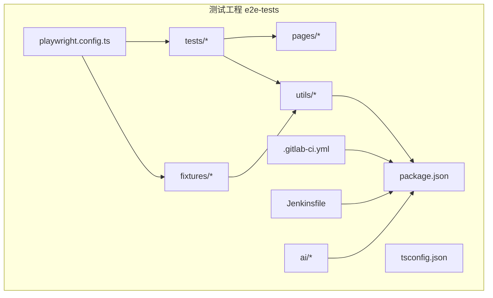
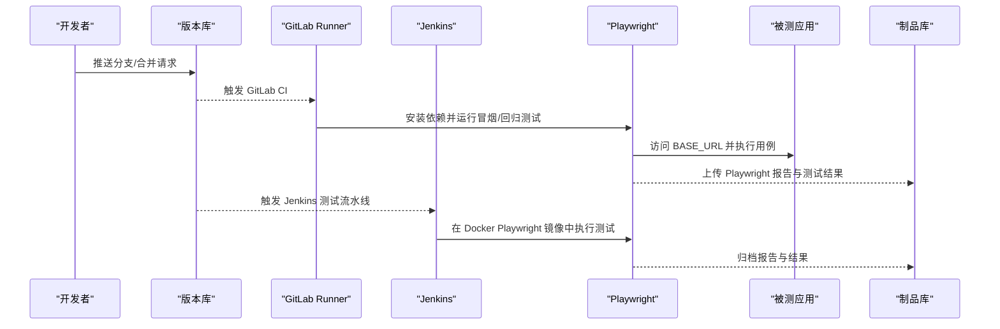
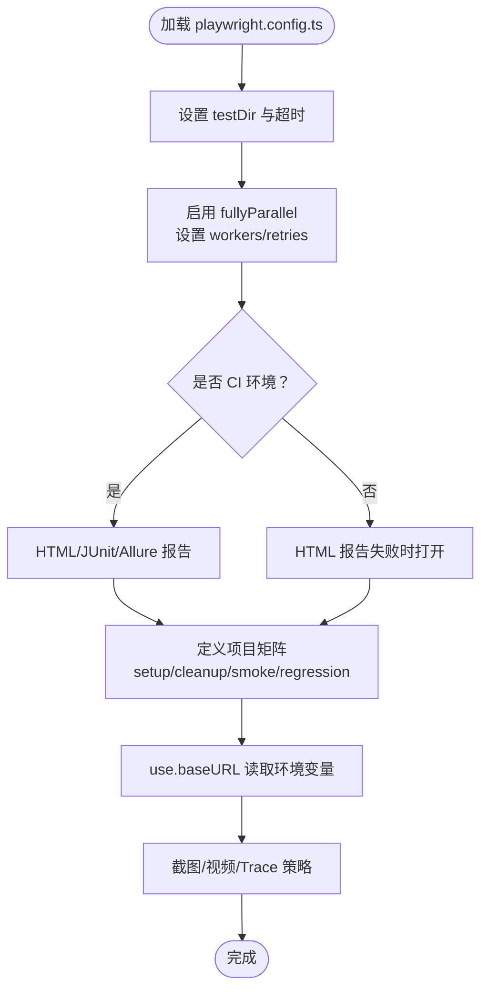
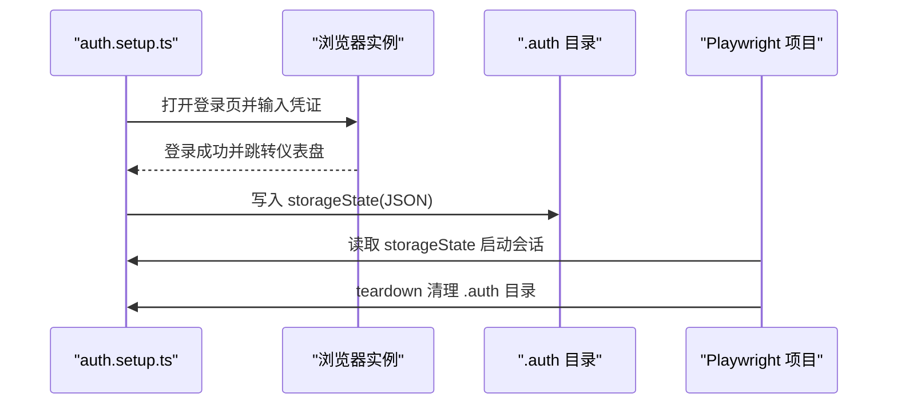
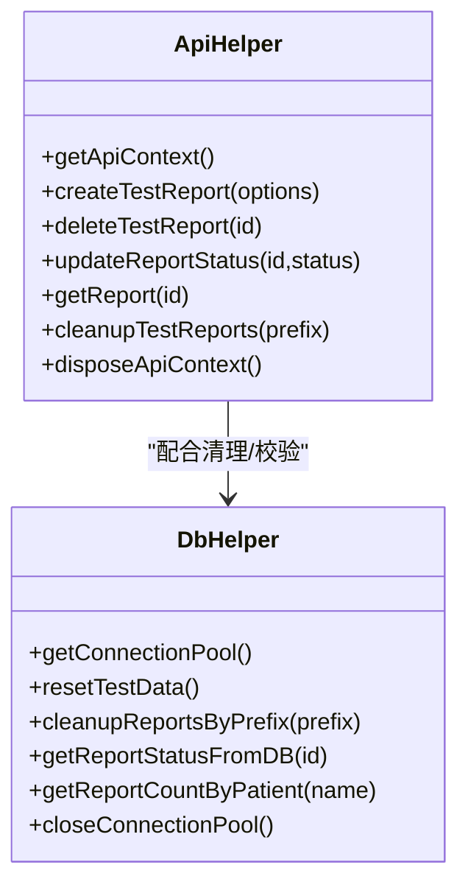
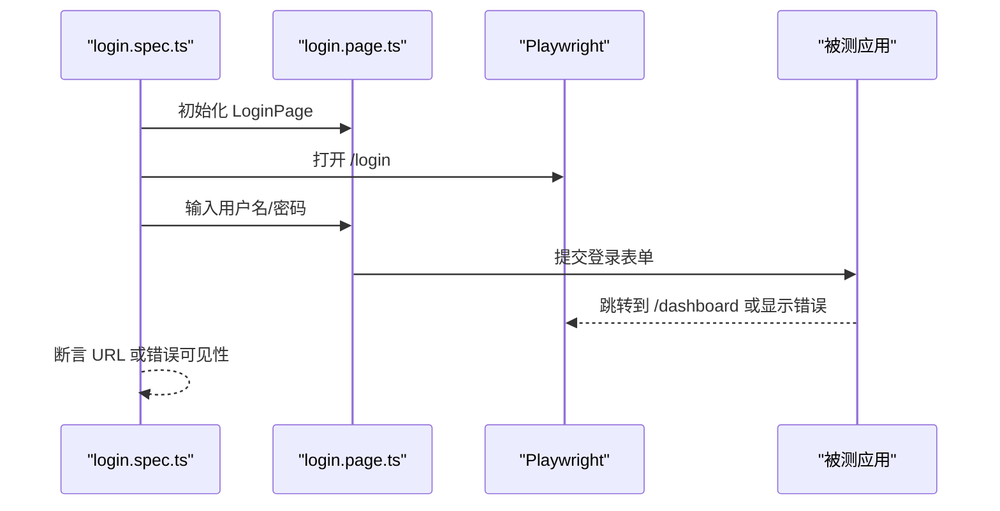
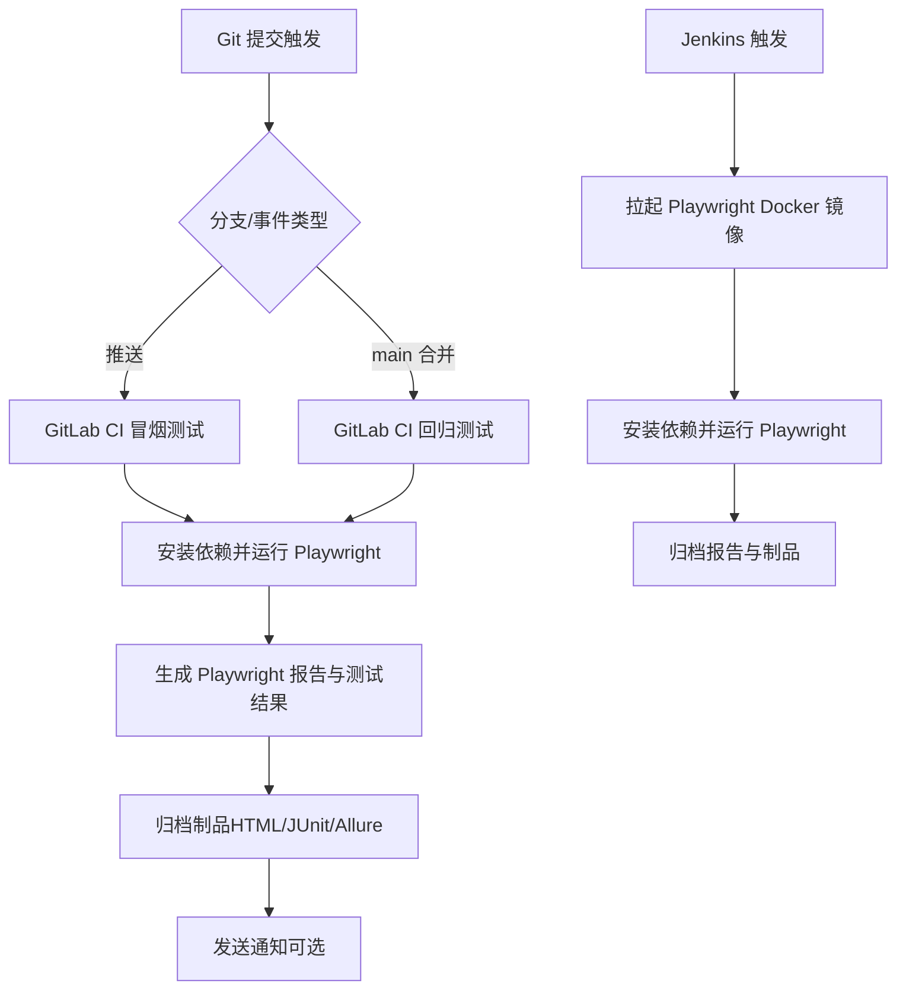
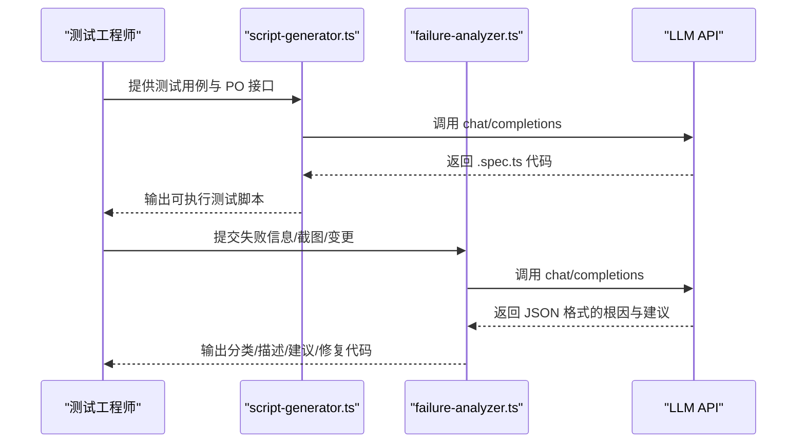
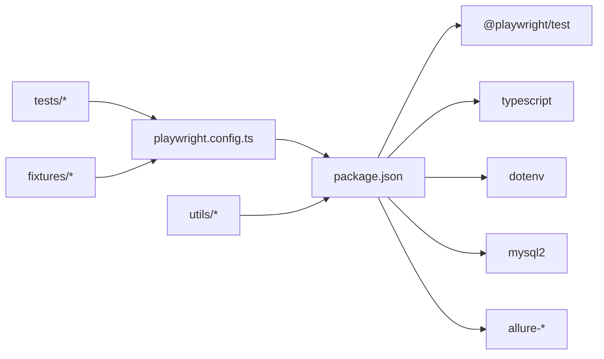

# 部署和运维

<cite>
**本文引用的文件**
- [package.json](file://e2e-tests/package.json)
- [playwright.config.ts](file://e2e-tests/playwright.config.ts)
- [.gitlab-ci.yml](file://e2e-tests/.gitlab-ci.yml)
- [Jenkinsfile](file://e2e-tests/Jenkinsfile)
- [tsconfig.json](file://e2e-tests/tsconfig.json)
- [auth.setup.ts](file://e2e-tests/fixtures/auth.setup.ts)
- [auth.teardown.ts](file://e2e-tests/fixtures/auth.teardown.ts)
- [api-helper.ts](file://e2e-tests/utils/api-helper.ts)
- [db-helper.ts](file://e2e-tests/utils/db-helper.ts)
- [login.spec.ts](file://e2e-tests/tests/smoke/login.spec.ts)
- [report-crud.spec.ts](file://e2e-tests/tests/regression/report-crud.spec.ts)
- [data.fixture.ts](file://e2e-tests/fixtures/data.fixture.ts)
- [login.page.ts](file://e2e-tests/pages/login.page.ts)
- [script-generator.ts](file://e2e-tests/ai/script-generator.ts)
- [failure-analyzer.ts](file://e2e-tests/ai/failure-analyzer.ts)
</cite>

## 目录
1. [简介](#简介)
2. [项目结构](#项目结构)
3. [核心组件](#核心组件)
4. [架构总览](#架构总览)
5. [详细组件分析](#详细组件分析)
6. [依赖分析](#依赖分析)
7. [性能考虑](#性能考虑)
8. [故障排查指南](#故障排查指南)
9. [结论](#结论)
10. [附录](#附录)

## 简介
本指南面向部署与运维团队，围绕该端到端测试仓库提供从开发环境搭建、测试环境配置到生产环境部署的完整流程说明；深入解析环境配置管理、依赖管理与版本控制策略；并给出监控与维护方案（日志、错误处理、系统维护）、部署脚本编写方法、自动化部署与回滚策略、性能监控与容量规划以及故障恢复机制与应急响应最佳实践。

## 项目结构
该仓库采用“测试即产品”的组织方式，核心目录与职责如下：
- e2e-tests：端到端测试工程，包含 Playwright 配置、测试用例、页面对象、辅助工具、AI 辅助模块、CI/CD 配置等
- tests：冒烟与回归测试用例
- pages：页面对象封装
- utils：API 与数据库辅助工具
- fixtures：登录态与数据夹具
- ai：基于 LLM 的脚本生成与失败分析
- CI/CD：GitLab CI 与 Jenkins 配置

图表来源
- [playwright.config.ts:1-68](file://e2e-tests/playwright.config.ts#L1-L68)
- [package.json:1-27](file://e2e-tests/package.json#L1-L27)
- [tsconfig.json:1-25](file://e2e-tests/tsconfig.json#L1-L25)
- [.gitlab-ci.yml:1-67](file://e2e-tests/.gitlab-ci.yml#L1-L67)
- [Jenkinsfile:1-59](file://e2e-tests/Jenkinsfile#L1-L59)

章节来源
- [playwright.config.ts:1-68](file://e2e-tests/playwright.config.ts#L1-L68)
- [package.json:1-27](file://e2e-tests/package.json#L1-L27)
- [tsconfig.json:1-25](file://e2e-tests/tsconfig.json#L1-L25)
- [.gitlab-ci.yml:1-67](file://e2e-tests/.gitlab-ci.yml#L1-L67)
- [Jenkinsfile:1-59](file://e2e-tests/Jenkinsfile#L1-L59)

## 核心组件
- Playwright 配置与项目矩阵：定义测试目录、超时、并行度、报告器、设备与项目依赖关系
- 登录态夹具：统一登录、存储上下文状态，支持多角色
- API 工具：统一 API 上下文、鉴权、报告 CRUD 与批量清理
- 数据库工具：连接池、测试数据重置与清理、状态校验
- 测试用例：冒烟与回归覆盖关键业务路径
- CI/CD：GitLab CI 与 Jenkins 管道，分别执行冒烟与回归测试，并归档报告

章节来源
- [playwright.config.ts:31-66](file://e2e-tests/playwright.config.ts#L31-L66)
- [auth.setup.ts:1-30](file://e2e-tests/fixtures/auth.setup.ts#L1-L30)
- [auth.teardown.ts:1-18](file://e2e-tests/fixtures/auth.teardown.ts#L1-L18)
- [api-helper.ts:40-77](file://e2e-tests/utils/api-helper.ts#L40-L77)
- [db-helper.ts:11-27](file://e2e-tests/utils/db-helper.ts#L11-L27)
- [login.spec.ts:1-25](file://e2e-tests/tests/smoke/login.spec.ts#L1-L25)
- [report-crud.spec.ts:1-122](file://e2e-tests/tests/regression/report-crud.spec.ts#L1-L122)
- [.gitlab-ci.yml:11-46](file://e2e-tests/.gitlab-ci.yml#L11-L46)
- [Jenkinsfile:12-38](file://e2e-tests/Jenkinsfile#L12-L38)

## 架构总览
下图展示从 CI 触发到测试执行、报告产出与制品归档的整体流程。

图表来源
- [.gitlab-ci.yml:11-46](file://e2e-tests/.gitlab-ci.yml#L11-L46)
- [Jenkinsfile:12-38](file://e2e-tests/Jenkinsfile#L12-L38)
- [playwright.config.ts:24-29](file://e2e-tests/playwright.config.ts#L24-L29)

## 详细组件分析

### Playwright 配置与项目矩阵
- 配置要点：测试目录、超时、并行、重试、工作进程、报告器（HTML/JUnit/Allure）、基础 URL、截图/视频/Trace 策略
- 项目矩阵：setup/cleanup 无浏览器执行；smoke-chromium；regression-chromium/firefox；各项目依赖 setup
- CI 条件：CI 环境启用 HTML/JUnit/Allure 报告与并行工作进程，本地仅 HTML 报告

图表来源
- [playwright.config.ts:6-68](file://e2e-tests/playwright.config.ts#L6-L68)

章节来源
- [playwright.config.ts:6-68](file://e2e-tests/playwright.config.ts#L6-L68)

### 登录态夹具与上下文管理
- auth.setup.ts：遍历预置用户，执行登录并将 storageState 写入 .auth 目录
- auth.teardown.ts：清理 .auth 目录下的 storageState 文件
- 项目依赖：smoke 与 regression 项目均依赖 setup，确保测试前具备登录态

图表来源
- [auth.setup.ts:18-28](file://e2e-tests/fixtures/auth.setup.ts#L18-L28)
- [auth.teardown.ts:7-17](file://e2e-tests/fixtures/auth.teardown.ts#L7-L17)
- [playwright.config.ts:33-43](file://e2e-tests/playwright.config.ts#L33-L43)

章节来源
- [auth.setup.ts:1-30](file://e2e-tests/fixtures/auth.setup.ts#L1-L30)
- [auth.teardown.ts:1-18](file://e2e-tests/fixtures/auth.teardown.ts#L1-L18)
- [playwright.config.ts:31-43](file://e2e-tests/playwright.config.ts#L31-L43)

### API 工具与数据库工具
- API 工具：单例 API 上下文、管理员鉴权、报告创建/删除/状态更新/查询、批量清理、上下文销毁
- 数据库工具：连接池单例、测试数据重置与清理、状态校验、连接池关闭

图表来源
- [api-helper.ts:40-77](file://e2e-tests/utils/api-helper.ts#L40-L77)
- [db-helper.ts:11-27](file://e2e-tests/utils/db-helper.ts#L11-L27)

章节来源
- [api-helper.ts:40-172](file://e2e-tests/utils/api-helper.ts#L40-L172)
- [db-helper.ts:11-91](file://e2e-tests/utils/db-helper.ts#L11-L91)

### 测试用例与页面对象
- 冒烟测试：登录成功/失败断言
- 回归测试：报告 CRUD、草稿保存、状态流转
- 页面对象：Login 对象封装定位器与常用交互

图表来源
- [login.spec.ts:4-13](file://e2e-tests/tests/smoke/login.spec.ts#L4-L13)
- [login.page.ts:22-34](file://e2e-tests/pages/login.page.ts#L22-L34)

章节来源
- [login.spec.ts:1-25](file://e2e-tests/tests/smoke/login.spec.ts#L1-L25)
- [login.page.ts:1-52](file://e2e-tests/pages/login.page.ts#L1-L52)
- [report-crud.spec.ts:1-122](file://e2e-tests/tests/regression/report-crud.spec.ts#L1-L122)

### CI/CD 流水线与报告归档
- GitLab CI：冒烟测试与回归测试阶段，产物归档至制品库，支持通知
- Jenkins：Docker Playwright 镜像执行安装与测试，发布 HTML 报告与制品

图表来源
- [.gitlab-ci.yml:11-66](file://e2e-tests/.gitlab-ci.yml#L11-L66)
- [Jenkinsfile:12-58](file://e2e-tests/Jenkinsfile#L12-L58)

章节来源
- [.gitlab-ci.yml:1-67](file://e2e-tests/.gitlab-ci.yml#L1-L67)
- [Jenkinsfile:1-59](file://e2e-tests/Jenkinsfile#L1-L59)

### AI 辅助：脚本生成与失败分析
- 脚本生成：基于测试用例与 Page Object 接口，生成可执行 .spec.ts
- 失败分析：对错误信息进行根因分类与修复建议输出

图表来源
- [script-generator.ts:63-109](file://e2e-tests/ai/script-generator.ts#L63-L109)
- [failure-analyzer.ts:69-111](file://e2e-tests/ai/failure-analyzer.ts#L69-L111)

章节来源
- [script-generator.ts:1-110](file://e2e-tests/ai/script-generator.ts#L1-L110)
- [failure-analyzer.ts:1-112](file://e2e-tests/ai/failure-analyzer.ts#L1-L112)

## 依赖分析
- 运行时依赖：Playwright、TypeScript、dotenv、mysql2、Allure
- Node 版本：>= 18
- 项目内依赖：fixtures 与 tests 通过 Playwright 项目依赖建立耦合；utils 作为共享能力被 tests 与 fixtures 使用

图表来源
- [package.json:17-25](file://e2e-tests/package.json#L17-L25)
- [playwright.config.ts:1-68](file://e2e-tests/playwright.config.ts#L1-L68)

章节来源
- [package.json:1-27](file://e2e-tests/package.json#L1-L27)
- [playwright.config.ts:1-68](file://e2e-tests/playwright.config.ts#L1-L68)

## 性能考虑
- 并行与资源：CI 环境启用 fullyParallel 与 workers，提升吞吐；本地禁用并行避免资源竞争
- 报告与产物：CI 生成 HTML/JUnit/Allure，本地仅失败时打开 HTML，降低磁盘与网络压力
- 数据清理：API 与 DB 工具提供批量清理与重置，避免测试数据膨胀影响性能
- LLM 调用：脚本生成与失败分析需注意外部 API 成本与时延，建议缓存与限流

章节来源
- [playwright.config.ts:12-22](file://e2e-tests/playwright.config.ts#L12-L22)
- [api-helper.ts:156-161](file://e2e-tests/utils/api-helper.ts#L156-L161)
- [db-helper.ts:33-43](file://e2e-tests/utils/db-helper.ts#L33-L43)
- [script-generator.ts:13-42](file://e2e-tests/ai/script-generator.ts#L13-L42)
- [failure-analyzer.ts:12-41](file://e2e-tests/ai/failure-analyzer.ts#L12-L41)

## 故障排查指南
- 环境变量缺失：BASE_URL、API_BASE_URL、DB_*、LLM_* 未配置会导致测试失败
- 登录态失效：.auth 目录缺失或过期，需重新执行 setup 项目
- 数据库连接失败：检查 DB_HOST/PORT/USER/PASSWORD/NAME 与网络连通性
- LLM API 异常：确认 LLM_API_URL/KEY/MODEL 配置与鉴权
- 报告无法打开：检查 CI 产物归档路径与访问权限

章节来源
- [playwright.config.ts:24-29](file://e2e-tests/playwright.config.ts#L24-L29)
- [api-helper.ts:6-7](file://e2e-tests/utils/api-helper.ts#L6-L7)
- [db-helper.ts:14-26](file://e2e-tests/utils/db-helper.ts#L14-L26)
- [script-generator.ts:6-8](file://e2e-tests/ai/script-generator.ts#L6-L8)
- [failure-analyzer.ts:5-7](file://e2e-tests/ai/failure-analyzer.ts#L5-L7)

## 结论
本指南提供了从开发到生产的端到端测试部署与运维实践，涵盖环境配置、依赖与版本控制、CI/CD 自动化、报告与制品管理、性能与容量规划、故障排查与应急响应。通过统一的 Playwright 配置、夹具与工具模块，结合 GitLab CI 与 Jenkins 管道，可实现稳定高效的测试交付流程。

## 附录

### 开发环境搭建清单
- 安装 Node >= 18
- 安装 pnpm
- 安装依赖：pnpm install
- 配置 .env（BASE_URL、API_BASE_URL、DB_*、LLM_*）
- 运行冒烟测试：pnpm test:smoke
- 运行回归测试：pnpm test:regression
- 生成报告：pnpm report:html 或 pnpm report:allure

章节来源
- [package.json:6-12](file://e2e-tests/package.json#L6-L12)
- [tsconfig.json:1-25](file://e2e-tests/tsconfig.json#L1-L25)

### 测试环境配置要点
- 基础 URL：playwright.config.ts use.baseURL 默认 http://localhost:8080，CI 中覆盖为 test-server 地址
- 报告器：CI 环境启用 HTML/JUnit/Allure；本地仅 HTML（失败时打开）
- 项目依赖：smoke 与 regression 依赖 setup，确保登录态可用

章节来源
- [playwright.config.ts:16-22](file://e2e-tests/playwright.config.ts#L16-L22)
- [playwright.config.ts:31-66](file://e2e-tests/playwright.config.ts#L31-L66)

### 生产环境部署与回滚策略（建议）
- 制品归档：CI 将 Playwright 报告与测试结果归档至制品库，便于审计与回溯
- 回滚策略：若回归测试失败，优先回滚最近一次通过的构建；必要时回退到上一个稳定版本
- 通知机制：通过 Webhook 通知团队，确保快速响应

章节来源
- [.gitlab-ci.yml:48-66](file://e2e-tests/.gitlab-ci.yml#L48-L66)
- [Jenkinsfile:41-57](file://e2e-tests/Jenkinsfile#L41-L57)

### 监控与维护方案
- 日志管理：保留 Playwright 报告与测试结果；在 CI 中开启 Allure 以便可视化
- 错误处理：利用 failure-analyzer 对失败进行分类与建议；结合截图与最近变更辅助定位
- 系统维护：定期清理 .auth 与测试数据；重置数据库与 API 上下文；优化 LLM 调用频率

章节来源
- [playwright.config.ts:16-22](file://e2e-tests/playwright.config.ts#L16-L22)
- [auth.teardown.ts:7-17](file://e2e-tests/fixtures/auth.teardown.ts#L7-L17)
- [api-helper.ts:166-171](file://e2e-tests/utils/api-helper.ts#L166-L171)
- [db-helper.ts:85-90](file://e2e-tests/utils/db-helper.ts#L85-L90)
- [failure-analyzer.ts:69-111](file://e2e-tests/ai/failure-analyzer.ts#L69-L111)

### 部署脚本编写方法
- GitLab CI：在 .gitlab-ci.yml 中定义 stages、variables、jobs 与 artifacts
- Jenkins：在 Jenkinsfile 中定义 agent、environment、stages、post 阶段与制品归档
- Playwright 命令：统一使用 npx playwright test --project=... 并指定报告输出目录

章节来源
- [.gitlab-ci.yml:1-67](file://e2e-tests/.gitlab-ci.yml#L1-L67)
- [Jenkinsfile:1-59](file://e2e-tests/Jenkinsfile#L1-L59)
- [playwright.config.ts:16-22](file://e2e-tests/playwright.config.ts#L16-L22)

### 性能监控与容量规划
- 并行度：CI workers 设置为 4，本地为 1；根据机器核数与并发需求调整
- 报告体积：Allure/HTML 报告随用例增多而增大，建议设置过期时间与清理策略
- 数据库连接池：默认连接数 5，可根据并发与数据库承载能力调整

章节来源
- [playwright.config.ts:14-15](file://e2e-tests/playwright.config.ts#L14-L15)
- [db-helper.ts:20-23](file://e2e-tests/utils/db-helper.ts#L20-L23)

### 故障恢复机制与应急响应
- 登录态恢复：执行 setup 项目重建 .auth；失败时清理 .auth 并重试
- 数据恢复：使用 resetTestData/cleanupReportsByPrefix 清理异常数据
- LLM 降级：当 LLM 不可用时，禁用相关 AI 功能或切换到本地离线模式（如可行）

章节来源
- [auth.setup.ts:18-28](file://e2e-tests/fixtures/auth.setup.ts#L18-L28)
- [auth.teardown.ts:7-17](file://e2e-tests/fixtures/auth.teardown.ts#L7-L17)
- [db-helper.ts:33-54](file://e2e-tests/utils/db-helper.ts#L33-L54)
- [script-generator.ts:13-16](file://e2e-tests/ai/script-generator.ts#L13-L16)
- [failure-analyzer.ts:12-15](file://e2e-tests/ai/failure-analyzer.ts#L12-L15)