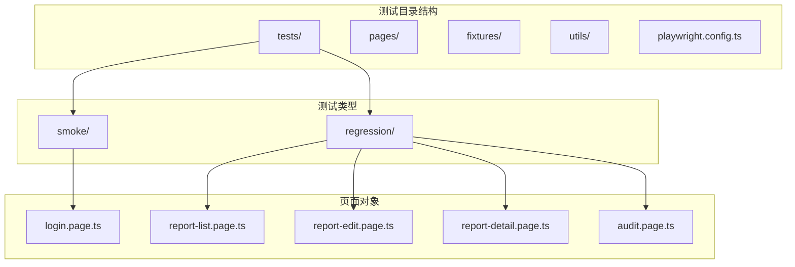
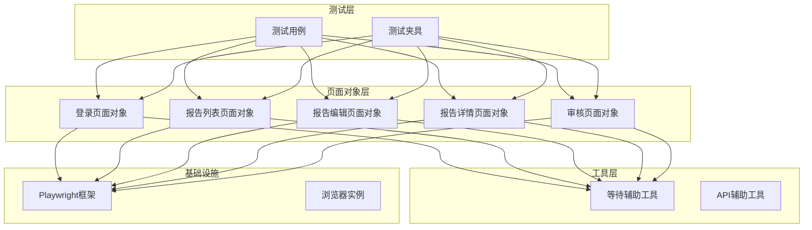
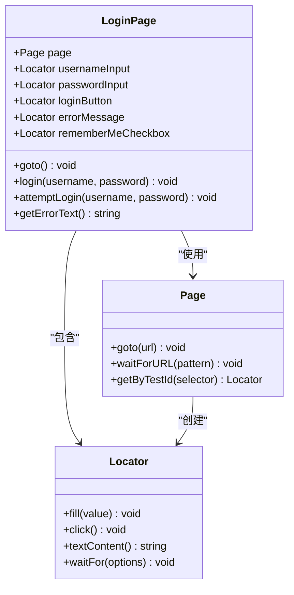
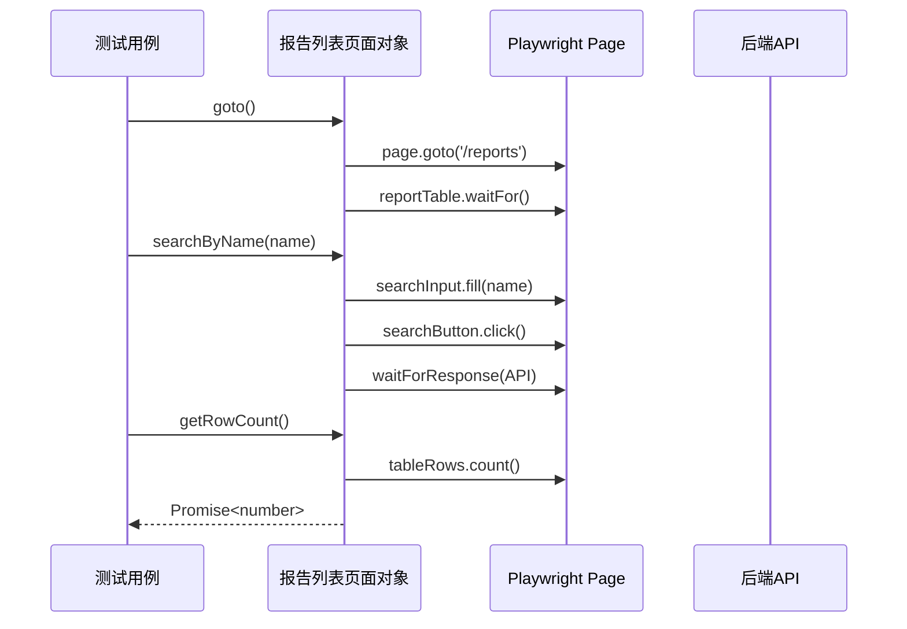
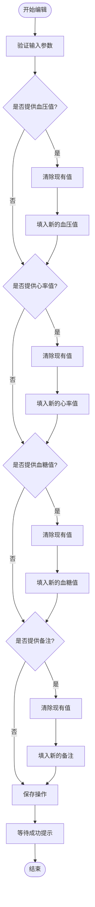
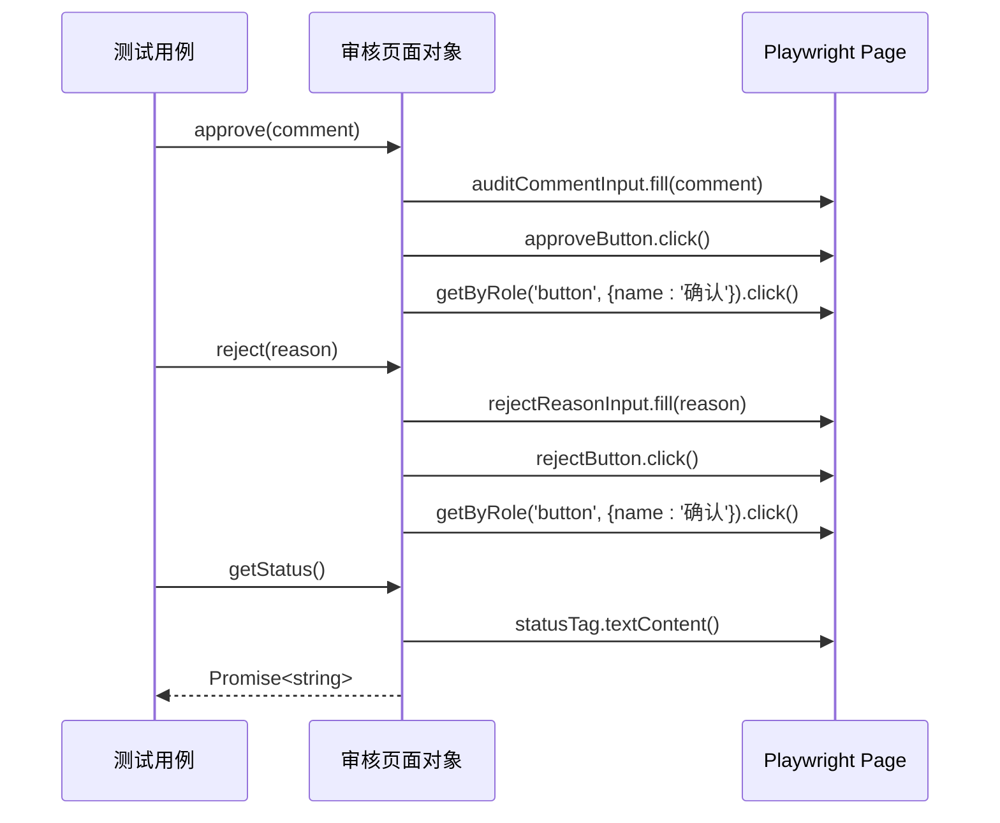
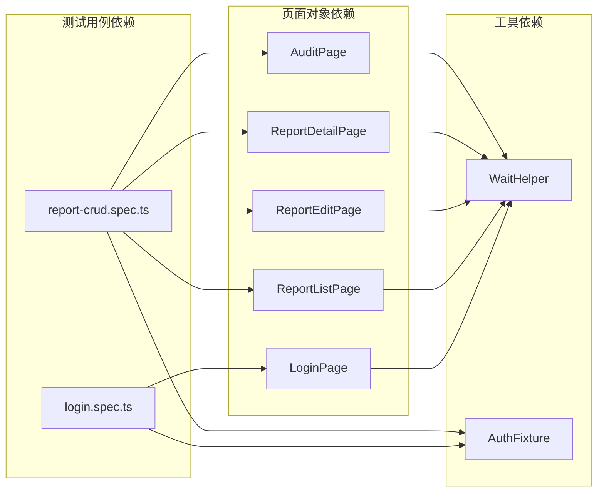

# Page Object模式基础概念

<cite>
**本文档引用的文件**
- [login.page.ts](file://e2e-tests/pages/login.page.ts)
- [report-list.page.ts](file://e2e-tests/pages/report-list.page.ts)
- [report-edit.page.ts](file://e2e-tests/pages/report-edit.page.ts)
- [audit.page.ts](file://e2e-tests/pages/audit.page.ts)
- [report-detail.page.ts](file://e2e-tests/pages/report-detail.page.ts)
- [login.spec.ts](file://e2e-tests/tests/smoke/login.spec.ts)
- [report-crud.spec.ts](file://e2e-tests/tests/regression/report-crud.spec.ts)
- [auth.fixture.ts](file://e2e-tests/fixtures/auth.fixture.ts)
- [auth.setup.ts](file://e2e-tests/fixtures/auth.setup.ts)
- [wait-helper.ts](file://e2e-tests/utils/wait-helper.ts)
- [playwright.config.ts](file://e2e-tests/playwright.config.ts)
- [package.json](file://e2e-tests/package.json)
</cite>

## 目录
1. [引言](#引言)
2. [项目结构](#项目结构)
3. [核心组件](#核心组件)
4. [架构概览](#架构概览)
5. [详细组件分析](#详细组件分析)
6. [依赖关系分析](#依赖关系分析)
7. [性能考虑](#性能考虑)
8. [故障排除指南](#故障排除指南)
9. [结论](#结论)
10. [附录](#附录)

## 引言

Page Object（PO）设计模式是自动化测试领域的重要概念，它通过将Web界面的元素定位和操作封装在独立的对象中，实现了测试代码与UI实现细节的解耦。这种模式的核心价值在于提高测试代码的可维护性、可重用性和可读性。

在本项目中，Page Object模式被广泛应用于Playwright E2E测试框架中，通过专门的页面类来管理每个业务页面的UI元素和交互逻辑。这种设计使得测试用例能够专注于业务逻辑的验证，而不需要关心具体的UI实现细节。

## 项目结构

该项目采用模块化的测试架构，按照功能域组织代码结构：

**图表来源**
- [playwright.config.ts:1-68](file://e2e-tests/playwright.config.ts#L1-L68)
- [login.page.ts:1-52](file://e2e-tests/pages/login.page.ts#L1-L52)

**章节来源**
- [playwright.config.ts:1-68](file://e2e-tests/playwright.config.ts#L1-L68)
- [package.json:1-27](file://e2e-tests/package.json#L1-L27)

## 核心组件

### Page Object模式的核心理念

Page Object模式的核心思想是将每个Web页面抽象为一个独立的对象，该对象包含：
- 页面元素的定位器定义
- 页面导航和交互方法
- 页面状态验证逻辑
- 错误处理和等待机制

### 设计原则

1. **单一职责原则**：每个页面对象只负责一个业务页面的所有交互
2. **封装性**：内部实现细节对外部隐藏
3. **可重用性**：页面对象可以在多个测试用例中重复使用
4. **可维护性**：UI变更只需修改对应的页面对象

### 最佳实践

1. **定位器策略**：优先使用语义化的选择器标识符
2. **操作封装**：将复杂的用户操作封装为高层次的方法
3. **等待机制**：合理使用异步等待确保页面状态稳定
4. **错误处理**：提供清晰的错误信息和回退策略

**章节来源**
- [login.page.ts:1-52](file://e2e-tests/pages/login.page.ts#L1-L52)
- [report-list.page.ts:1-130](file://e2e-tests/pages/report-list.page.ts#L1-L130)

## 架构概览

**图表来源**
- [auth.fixture.ts:1-40](file://e2e-tests/fixtures/auth.fixture.ts#L1-L40)
- [wait-helper.ts:1-107](file://e2e-tests/utils/wait-helper.ts#L1-L107)

## 详细组件分析

### 登录页面对象分析

登录页面对象体现了Page Object模式的基本实现方式：

**图表来源**
- [login.page.ts:3-51](file://e2e-tests/pages/login.page.ts#L3-L51)

#### 关键特性分析

1. **定位器封装**：所有UI元素都通过构造函数初始化，集中管理
2. **导航方法**：提供goto()方法简化页面访问
3. **业务操作封装**：login()和attemptLogin()方法封装完整的用户流程
4. **状态验证**：getErrorText()方法提供错误信息获取能力

**章节来源**
- [login.page.ts:13-51](file://e2e-tests/pages/login.page.ts#L13-L51)

### 报告列表页面对象分析

报告列表页面对象展示了复杂页面的Page Object实现：

**图表来源**
- [report-list.page.ts:34-49](file://e2e-tests/pages/report-list.page.ts#L34-L49)

#### 复杂交互处理

1. **异步等待机制**：使用waitForResponse()等待API响应
2. **条件操作**：根据索引选择特定行进行操作
3. **状态验证**：提供多种数据提取方法
4. **分页处理**：集成分页导航功能

**章节来源**
- [report-list.page.ts:19-129](file://e2e-tests/pages/report-list.page.ts#L19-L129)

### 报告编辑页面对象分析

编辑页面对象体现了数据驱动的Page Object设计：

**图表来源**
- [report-edit.page.ts:39-61](file://e2e-tests/pages/report-edit.page.ts#L39-L61)

#### 数据驱动设计

1. **灵活的数据填充**：支持部分字段的动态填充
2. **条件操作**：根据提供的数据决定执行哪些操作
3. **状态监控**：通过toast消息验证操作结果
4. **表单验证**：集成前端表单验证错误处理

**章节来源**
- [report-edit.page.ts:18-93](file://e2e-tests/pages/report-edit.page.ts#L18-L93)

### 审核页面对象分析

审核页面对象展示了双向数据流的Page Object实现：

**图表来源**
- [audit.page.ts:50-70](file://e2e-tests/pages/audit.page.ts#L50-L70)

#### 审核流程封装

1. **审批操作**：统一的approve()方法处理审批流程
2. **拒绝操作**：统一的reject()方法处理拒绝流程
3. **状态查询**：getStatus()方法提供实时状态检查
4. **确认对话框**：自动处理标准确认流程

**章节来源**
- [audit.page.ts:22-71](file://e2e-tests/pages/audit.page.ts#L22-L71)

## 依赖关系分析

**图表来源**
- [login.spec.ts:1-25](file://e2e-tests/tests/smoke/login.spec.ts#L1-L25)
- [report-crud.spec.ts:1-122](file://e2e-tests/tests/regression/report-crud.spec.ts#L1-L122)

### 组件耦合度分析

1. **低耦合设计**：页面对象之间相互独立，无直接依赖
2. **向上依赖**：测试用例依赖页面对象，但页面对象不依赖测试用例
3. **向下依赖**：页面对象依赖Playwright框架，但封装了具体实现
4. **工具依赖**：通过wait-helper提供统一的等待机制

**章节来源**
- [auth.fixture.ts:10-37](file://e2e-tests/fixtures/auth.fixture.ts#L10-L37)
- [wait-helper.ts:1-107](file://e2e-tests/utils/wait-helper.ts#L1-107)

## 性能考虑

### 等待策略优化

项目中的等待辅助工具提供了多种等待策略：

1. **智能等待**：根据不同的等待场景选择合适的等待策略
2. **超时控制**：可配置的超时时间，平衡稳定性和性能
3. **重试机制**：提供操作重试包装器，处理间歇性失败
4. **条件等待**：基于特定条件的等待，避免不必要的等待

### 性能最佳实践

1. **最小化等待**：只在必要时使用等待，避免过度等待
2. **并行执行**：利用Playwright的并行能力提升测试执行效率
3. **资源管理**：合理管理浏览器上下文和页面生命周期
4. **缓存策略**：复用已认证的会话状态，减少登录开销

**章节来源**
- [wait-helper.ts:74-92](file://e2e-tests/utils/wait-helper.ts#L74-L92)
- [playwright.config.ts:12-15](file://e2e-tests/playwright.config.ts#L12-L15)

## 故障排除指南

### 常见问题诊断

1. **定位器失效**：检查选择器的稳定性，优先使用语义化标识符
2. **页面状态不一致**：确保在操作后正确等待页面状态变化
3. **异步操作超时**：调整等待超时时间，增加重试机制
4. **跨页面导航问题**：使用明确的导航方法和状态验证

### 错误处理策略

1. **渐进式断言**：先验证页面加载，再进行功能测试
2. **错误恢复**：提供错误恢复机制，避免测试中断
3. **日志记录**：记录关键操作和状态变化，便于调试
4. **清理机制**：确保测试环境的清洁，避免状态污染

**章节来源**
- [wait-helper.ts:18-23](file://e2e-tests/utils/wait-helper.ts#L18-L23)
- [report-crud.spec.ts:83-86](file://e2e-tests/tests/regression/report-crud.spec.ts#L83-L86)

## 结论

Page Object模式在本项目中的成功应用证明了其在E2E测试中的价值。通过将UI交互逻辑封装在独立的页面对象中，实现了以下优势：

1. **代码复用**：页面对象可以在多个测试用例中重复使用
2. **维护成本降低**：UI变更只需修改对应的页面对象
3. **测试可读性提升**：测试用例专注于业务逻辑验证
4. **团队协作改善**：清晰的接口定义便于团队成员协作

对于初学者而言，建议从简单的页面对象开始，逐步掌握定位器策略、等待机制和错误处理的最佳实践。随着经验的增长，可以引入更高级的设计模式和工具来进一步提升测试质量。

## 附录

### Page Object设计规范

1. **命名约定**
   - 页面对象类名：使用名词短语，如ReportListPage
   - 方法命名：使用动词短语，如clickCreate()
   - 定位器命名：使用描述性名称，如createButton

2. **结构规范**
   - 定位器定义：按功能分组，保持逻辑清晰
   - 导航方法：提供goto()方法简化页面访问
   - 业务方法：封装完整的用户操作流程
   - 状态验证：提供数据提取和状态检查方法

3. **最佳实践**
   - 使用语义化选择器标识符
   - 实现异步等待机制
   - 提供错误处理和回退策略
   - 保持方法的单一职责

### 反模式避免

1. **避免在测试中直接操作DOM**
2. **避免硬编码的等待时间**
3. **避免在页面对象中编写业务逻辑**
4. **避免创建过于复杂的页面对象**