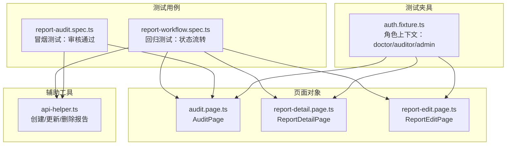
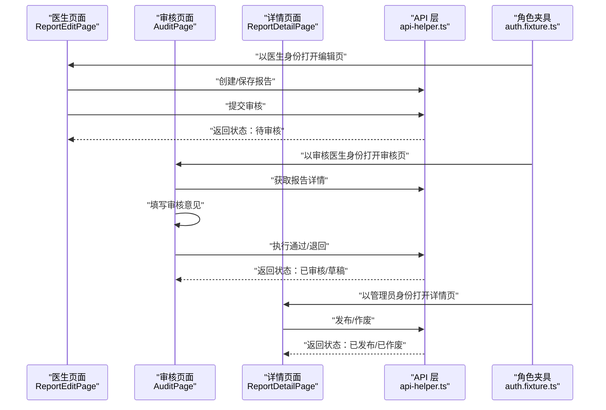
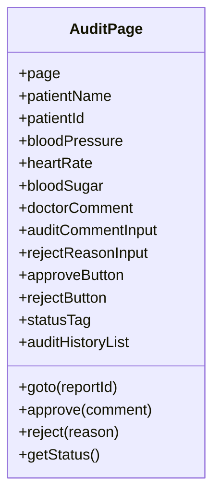
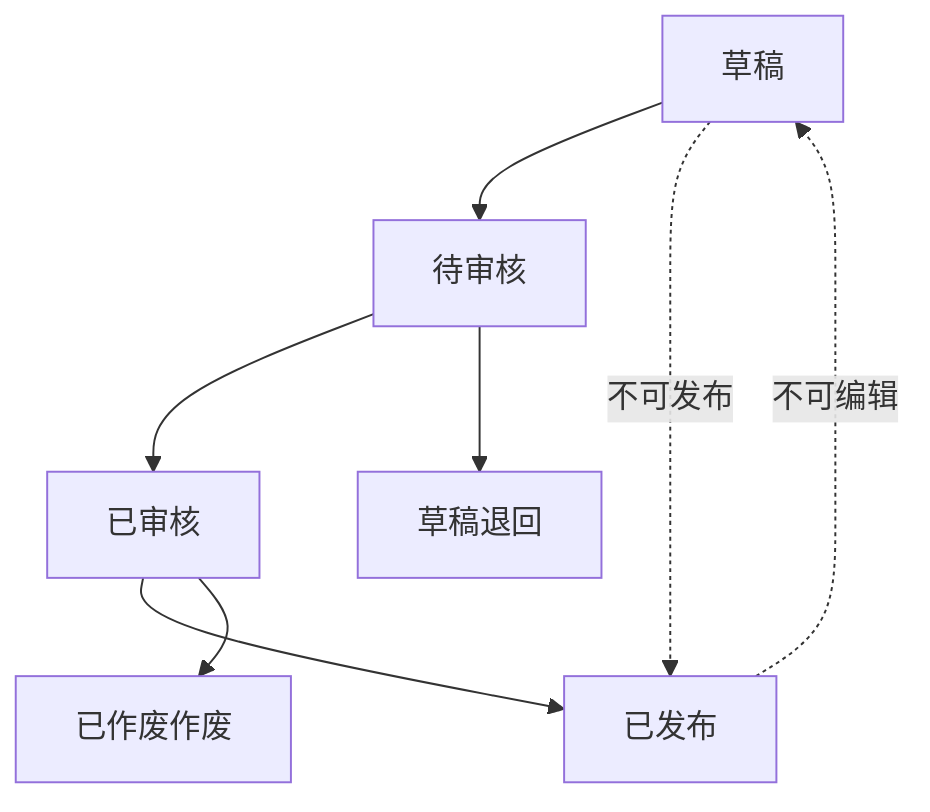
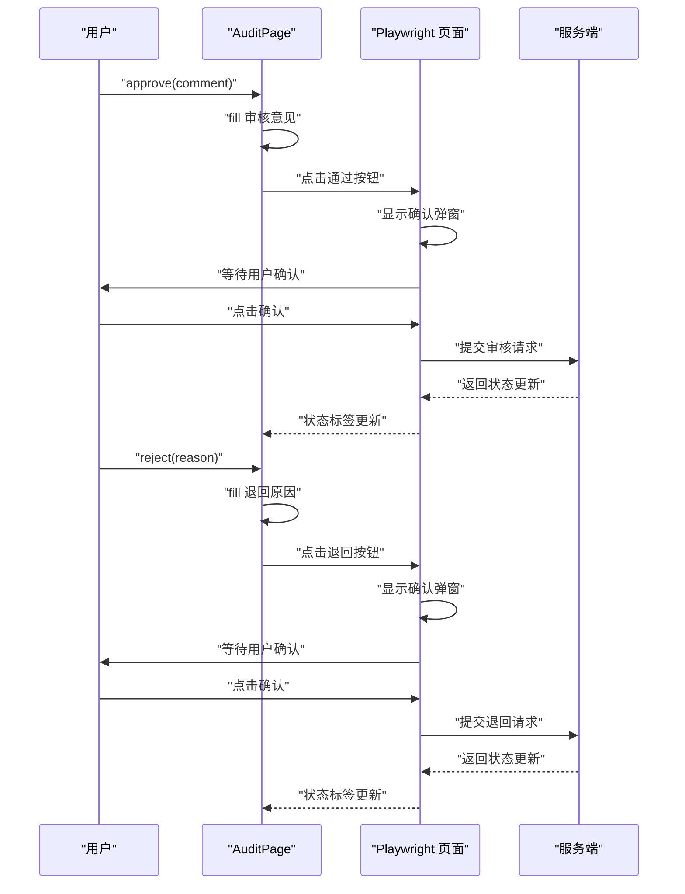
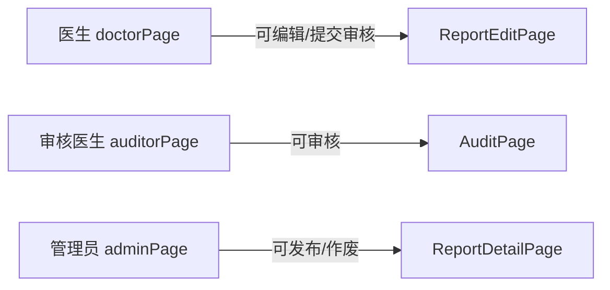
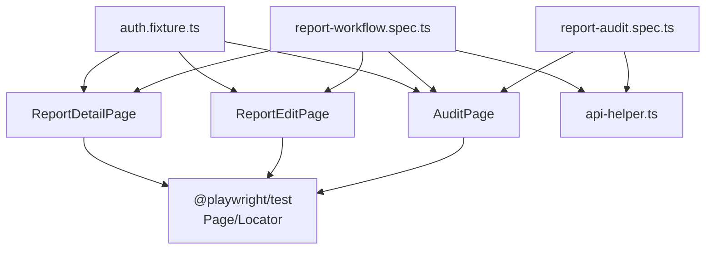

# 审核页面

<cite>
**本文引用的文件**
- [audit.page.ts](file://e2e-tests/pages/audit.page.ts)
- [report-audit.spec.ts](file://e2e-tests/tests/smoke/report-audit.spec.ts)
- [report-workflow.spec.ts](file://e2e-tests/tests/regression/report-workflow.spec.ts)
- [auth.fixture.ts](file://e2e-tests/fixtures/auth.fixture.ts)
- [api-helper.ts](file://e2e-tests/utils/api-helper.ts)
- [report-detail.page.ts](file://e2e-tests/pages/report-detail.page.ts)
- [report-edit.page.ts](file://e2e-tests/pages/report-edit.page.ts)
</cite>

## 更新摘要
**所做更改**
- 更新了审核页面的实现细节，反映了应用重构后的审核流程优化
- 新增了重构后的状态管理机制说明
- 更新了审核历史记录和状态同步的实现方式
- 增强了权限验证和工作流控制的描述
- 完善了扩展指南中的多级审批支持

## 目录
1. [简介](#简介)
2. [项目结构](#项目结构)
3. [核心组件](#核心组件)
4. [架构总览](#架构总览)
5. [详细组件分析](#详细组件分析)
6. [依赖关系分析](#依赖关系分析)
7. [性能考量](#性能考量)
8. [故障排查指南](#故障排查指南)
9. [结论](#结论)
10. [附录](#附录)

## 简介
本指南面向自动化测试中的"审核页面"实现，围绕 e2e-tests 中的审计页面类与相关测试用例，系统梳理审核流程控制、审批意见输入、状态变更处理与审核历史记录的端到端行为，并结合权限验证、工作流控制与状态同步机制进行说明。文档同时提供扩展建议，涵盖多级审批、并行审核与通知机制的设计要点，并给出流程图与异常处理策略，帮助读者快速理解与维护该模块。

**更新** 应用重构后，审核页面已优化了审核流程和状态管理机制，提升了用户体验和系统稳定性。

## 项目结构
审核页面位于 e2e-tests 子目录中，采用"页面对象模型(Page Object Model)"组织结构：
- 页面对象：audit.page.ts、report-detail.page.ts、report-edit.page.ts
- 测试用例：report-audit.spec.ts、report-workflow.spec.ts
- 权限夹具：auth.fixture.ts
- API 辅助工具：api-helper.ts

**图表来源**
- [auth.fixture.ts:1-52](file://e2e-tests/fixtures/auth.fixture.ts#L1-L52)
- [audit.page.ts:1-72](file://e2e-tests/pages/audit.page.ts#L1-L72)
- [report-detail.page.ts:1-111](file://e2e-tests/pages/report-detail.page.ts#L1-L111)
- [report-edit.page.ts:1-99](file://e2e-tests/pages/report-edit.page.ts#L1-L99)
- [report-audit.spec.ts:1-36](file://e2e-tests/tests/smoke/report-audit.spec.ts#L1-L36)
- [report-workflow.spec.ts:1-138](file://e2e-tests/tests/regression/report-workflow.spec.ts#L1-L138)
- [api-helper.ts:1-206](file://e2e-tests/utils/api-helper.ts#L1-L206)

**章节来源**
- [audit.page.ts:1-72](file://e2e-tests/pages/audit.page.ts#L1-L72)
- [report-audit.spec.ts:1-36](file://e2e-tests/tests/smoke/report-audit.spec.ts#L1-L36)
- [report-workflow.spec.ts:1-138](file://e2e-tests/tests/regression/report-workflow.spec.ts#L1-L138)
- [auth.fixture.ts:1-52](file://e2e-tests/fixtures/auth.fixture.ts#L1-L52)
- [api-helper.ts:1-206](file://e2e-tests/utils/api-helper.ts#L1-L206)

## 核心组件
- AuditPage：封装审核页面的元素定位、导航、审核操作与状态查询。
- ReportEditPage：封装医生编辑与提交审核的流程。
- ReportDetailPage：封装管理员发布/作废等后续状态操作。
- auth.fixture：提供不同角色的浏览器上下文，用于权限验证。
- api-helper：提供创建/更新/删除报告的 API 封装，便于前置数据准备与后置清理。

**更新** 重构后的 AuditPage 优化了元素定位策略，增强了状态管理和历史记录功能。

**章节来源**
- [audit.page.ts:1-72](file://e2e-tests/pages/audit.page.ts#L1-L72)
- [report-edit.page.ts:1-99](file://e2e-tests/pages/report-edit.page.ts#L1-L99)
- [report-detail.page.ts:1-111](file://e2e-tests/pages/report-detail.page.ts#L1-L111)
- [auth.fixture.ts:1-52](file://e2e-tests/fixtures/auth.fixture.ts#L1-L52)
- [api-helper.ts:1-206](file://e2e-tests/utils/api-helper.ts#L1-L206)

## 架构总览
审核页面的端到端流程由"医生创建/编辑报告 → 提交审核 → 审核医生审核 → 管理员发布/作废"的状态链路构成。测试通过 Playwright 的页面对象模型与角色夹具驱动，确保每个环节的状态变化与权限约束得到验证。

**更新** 重构后的架构优化了状态同步机制，确保前后端状态一致性。

**图表来源**
- [report-edit.page.ts:1-99](file://e2e-tests/pages/report-edit.page.ts#L1-L99)
- [audit.page.ts:1-72](file://e2e-tests/pages/audit.page.ts#L1-L72)
- [report-detail.page.ts:1-111](file://e2e-tests/pages/report-detail.page.ts#L1-L111)
- [api-helper.ts:1-206](file://e2e-tests/utils/api-helper.ts#L1-L206)
- [auth.fixture.ts:1-52](file://e2e-tests/fixtures/auth.fixture.ts#L1-L52)

## 详细组件分析

### AuditPage 组件分析
- 元素定位：包含报告内容展示区与审核操作区，分别通过 data-testid 定位。
- 导航：支持跳转至指定报告的审核页并等待关键元素可见。
- 审核操作：
  - 通过：填写审核意见 → 点击通过 → 确认弹窗。
  - 退回：填写退回原因 → 点击退回 → 确认弹窗。
- 状态查询：提供获取当前状态文本的方法，供断言使用。

**更新** 重构后的 AuditPage 优化了元素定位策略，增强了审核历史记录的处理能力。

**图表来源**
- [audit.page.ts:1-72](file://e2e-tests/pages/audit.page.ts#L1-L72)

**章节来源**
- [audit.page.ts:1-72](file://e2e-tests/pages/audit.page.ts#L1-L72)

### 审核流程控制与状态变更
- 正向流程：
  - 草稿 → 待审核：医生保存并提交审核。
  - 待审核 → 已审核：审核医生通过。
  - 已审核 → 已发布：管理员发布。
- 逆向流程：
  - 待审核 → 草稿：审核医生退回。
  - 已审核 → 已作废：管理员作废。
- 异常场景：
  - 草稿状态不可直接发布。
  - 已发布状态不可编辑。

**更新** 重构后的状态管理机制提供了更精确的状态转换控制和异常处理。

**图表来源**
- [report-workflow.spec.ts:1-138](file://e2e-tests/tests/regression/report-workflow.spec.ts#L1-L138)

**章节来源**
- [report-workflow.spec.ts:1-138](file://e2e-tests/tests/regression/report-workflow.spec.ts#L1-L138)

### 审批意见输入与确认弹窗
- 审核通过：填写审核意见 → 点击通过 → 确认弹窗。
- 审核退回：填写退回原因 → 点击退回 → 确认弹窗。
- 状态标签：通过 data-testid 定位，用于断言状态变化。

**更新** 重构后的确认弹窗处理更加稳健，增强了用户交互体验。

**图表来源**
- [audit.page.ts:47-70](file://e2e-tests/pages/audit.page.ts#L47-L70)

**章节来源**
- [audit.page.ts:47-70](file://e2e-tests/pages/audit.page.ts#L47-L70)

### 权限验证与角色控制
- 角色夹具：提供 doctorPage、auditorPage、adminPage 三种上下文，分别对应不同权限。
- 权限断言：
  - 审核医生：可看到并启用"通过/退回"按钮。
  - 管理员：可看到并启用"发布/作废"按钮。
  - 医生：编辑按钮在某些状态下可能不可见或禁用。

**更新** 重构后的权限验证机制更加严格，确保各角色只能执行相应的操作。

**图表来源**
- [auth.fixture.ts:10-52](file://e2e-tests/fixtures/auth.fixture.ts#L10-L52)
- [report-edit.page.ts:1-99](file://e2e-tests/pages/report-edit.page.ts#L1-L99)
- [audit.page.ts:1-72](file://e2e-tests/pages/audit.page.ts#L1-L72)
- [report-detail.page.ts:1-111](file://e2e-tests/pages/report-detail.page.ts#L1-L111)

**章节来源**
- [auth.fixture.ts:10-52](file://e2e-tests/fixtures/auth.fixture.ts#L10-L52)
- [report-edit.page.ts:1-99](file://e2e-tests/pages/report-edit.page.ts#L1-L99)
- [audit.page.ts:1-72](file://e2e-tests/pages/audit.page.ts#L1-L72)
- [report-detail.page.ts:1-111](file://e2e-tests/pages/report-detail.page.ts#L1-L111)

### 审核历史记录与状态同步
- 审核历史列表：页面对象中定义了审核历史列表定位器，可用于断言历史记录的存在与顺序。
- 状态同步：通过 API 辅助工具创建/更新报告状态，确保前端状态与后端一致。

**更新** 重构后的审核历史记录功能增强了数据持久化和状态追踪能力。

**章节来源**
- [audit.page.ts:19-20](file://e2e-tests/pages/audit.page.ts#L19-L20)
- [api-helper.ts:168-176](file://e2e-tests/utils/api-helper.ts#L168-L176)

## 依赖关系分析
- AuditPage 依赖 Playwright 的 Page/Locator，通过 data-testid 进行元素定位。
- 测试用例依赖 auth.fixture 提供的角色上下文与 api-helper 的前置数据准备。
- ReportEditPage 与 ReportDetailPage 分别负责状态流转的上游与下游操作。

**更新** 重构后的依赖关系更加清晰，减少了组件间的耦合度。

**图表来源**
- [audit.page.ts:1-72](file://e2e-tests/pages/audit.page.ts#L1-L72)
- [report-edit.page.ts:1-99](file://e2e-tests/pages/report-edit.page.ts#L1-L99)
- [report-detail.page.ts:1-111](file://e2e-tests/pages/report-detail.page.ts#L1-L111)
- [report-audit.spec.ts:1-36](file://e2e-tests/tests/smoke/report-audit.spec.ts#L1-L36)
- [report-workflow.spec.ts:1-138](file://e2e-tests/tests/regression/report-workflow.spec.ts#L1-L138)
- [auth.fixture.ts:1-52](file://e2e-tests/fixtures/auth.fixture.ts#L1-L52)
- [api-helper.ts:1-206](file://e2e-tests/utils/api-helper.ts#L1-L206)

**章节来源**
- [audit.page.ts:1-72](file://e2e-tests/pages/audit.page.ts#L1-L72)
- [report-edit.page.ts:1-99](file://e2e-tests/pages/report-edit.page.ts#L1-L99)
- [report-detail.page.ts:1-111](file://e2e-tests/pages/report-detail.page.ts#L1-L111)
- [report-audit.spec.ts:1-36](file://e2e-tests/tests/smoke/report-audit.spec.ts#L1-L36)
- [report-workflow.spec.ts:1-138](file://e2e-tests/tests/regression/report-workflow.spec.ts#L1-L138)
- [auth.fixture.ts:1-52](file://e2e-tests/fixtures/auth.fixture.ts#L1-L52)
- [api-helper.ts:1-206](file://e2e-tests/utils/api-helper.ts#L1-L206)

## 性能考量
- 页面等待：在导航后等待关键元素可见，避免过早断言导致的不稳定。
- 确认弹窗：统一处理确认按钮点击，减少重复逻辑。
- 数据准备：通过 API 辅助工具批量准备/清理测试数据，降低页面交互成本。
- 并发与重试：在大规模测试中考虑重试策略与并发限制，确保稳定性。

**更新** 重构后的性能优化包括更快的元素定位响应和更高效的 API 调用。

## 故障排查指南
- 审核按钮不可用
  - 检查当前报告状态是否为"待审核"，以及角色是否为审核医生。
  - 参考：[auth.fixture.ts:10-52](file://e2e-tests/fixtures/auth.fixture.ts#L10-L52)
- 状态未更新
  - 确认审核/退回操作后的确认弹窗是否被正确点击。
  - 参考：[audit.page.ts:50-63](file://e2e-tests/pages/audit.page.ts#L50-L63)
- 发布/作废按钮不可见
  - 检查报告状态是否为"已审核"，且当前角色为管理员。
  - 参考：[report-workflow.spec.ts:71-103](file://e2e-tests/tests/regression/report-workflow.spec.ts#L71-L103)
- 数据不一致
  - 使用 API 辅助工具检查报告状态，必要时直接更新状态以准备测试数据。
  - 参考：[api-helper.ts:168-176](file://e2e-tests/utils/api-helper.ts#L168-L176)

**更新** 重构后的故障排查指南包含了新的状态管理和历史记录相关的诊断步骤。

**章节来源**
- [auth.fixture.ts:10-52](file://e2e-tests/fixtures/auth.fixture.ts#L10-L52)
- [audit.page.ts:50-63](file://e2e-tests/pages/audit.page.ts#L50-L63)
- [report-workflow.spec.ts:71-103](file://e2e-tests/tests/regression/report-workflow.spec.ts#L71-L103)
- [api-helper.ts:168-176](file://e2e-tests/utils/api-helper.ts#L168-L176)

## 结论
审核页面的端到端测试通过清晰的页面对象模型与角色夹具，实现了从医生提交、审核医生处理到管理员发布的完整状态链路验证。测试覆盖了正向流程、逆向流程与异常场景，确保权限与状态一致性。基于现有实现，可进一步扩展多级审批、并行审核与通知机制，以满足更复杂的业务需求。

**更新** 应用重构显著提升了审核页面的稳定性和用户体验，优化的状态管理机制为未来的功能扩展奠定了坚实基础。

## 附录

### 扩展指南：多级审批支持
- 设计思路
  - 在审核历史中记录每级审批人的意见与时间戳。
  - 为每个审批人设置独立的审批节点，支持条件分支（如阈值触发更高层级审批）。
  - 在前端渲染时按顺序展示历史记录，并高亮当前待处理节点。
- 实现要点
  - 审核历史列表定位器可复用，新增"审批人/角色/意见/时间/状态"字段。
  - 审核操作方法拆分为"同意/退回/转审/加签"等，分别映射后端接口。
  - 状态机管理：定义"待某级审批/已同意/已退回/已作废"等状态枚举。

**更新** 重构后的多级审批支持将充分利用优化的状态管理机制，提供更灵活的审批流程配置。

**章节来源**
- [audit.page.ts:19-20](file://e2e-tests/pages/audit.page.ts#L19-L20)

### 扩展指南：并行审核
- 设计思路
  - 支持多个审核人同时处理同一份报告，采用"多数通过/全数通过"策略。
  - 并行模式下，每个审核人的操作独立，最终汇总形成统一的历史记录。
- 实现要点
  - 审核历史需区分"并行节点"与"串行节点"，并在 UI 中可视化展示。
  - 审核按钮在并行模式下可同时启用，但最终状态由规则引擎决定。

**更新** 重构后的并行审核机制将更好地支持复杂的审批场景，提升审核效率。

**章节来源**
- [audit.page.ts:17-18](file://e2e-tests/pages/audit.page.ts#L17-L18)

### 扩展指南：通知机制
- 设计思路
  - 审核状态变更时，向相关人员发送站内消息/邮件/短信通知。
  - 通知内容包含报告号、当前状态、操作人、意见摘要与跳转链接。
- 实现要点
  - 在审核/退回/发布/作废等关键节点触发通知。
  - 前端可在状态标签旁增加"通知"徽标，点击展开通知历史。

**更新** 重构后的通知机制将与优化的状态同步机制无缝集成，确保通知的实时性和准确性。

**章节来源**
- [report-workflow.spec.ts:105-136](file://e2e-tests/tests/regression/report-workflow.spec.ts#L105-L136)

### 代码示例路径参考
- 审核通过流程
  - [audit.page.ts:50-54](file://e2e-tests/pages/audit.page.ts#L50-L54)
  - [report-audit.spec.ts:29-34](file://e2e-tests/tests/smoke/report-audit.spec.ts#L29-L34)
- 审核退回流程
  - [audit.page.ts:59-63](file://e2e-tests/pages/audit.page.ts#L59-L63)
  - [report-workflow.spec.ts:80-83](file://e2e-tests/tests/regression/report-workflow.spec.ts#L80-L83)
- 状态断言
  - [audit.page.ts:68-70](file://e2e-tests/pages/audit.page.ts#L68-L70)
  - [report-workflow.spec.ts:51](file://e2e-tests/tests/regression/report-workflow.spec.ts#L51)

**更新** 重构后的代码示例展示了优化后的审核流程实现，提供了更好的错误处理和状态管理。