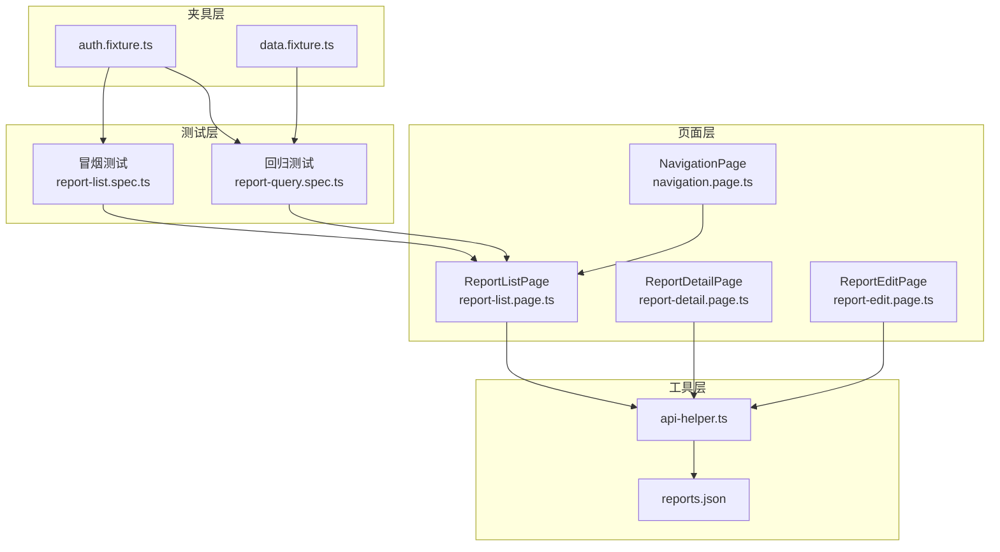
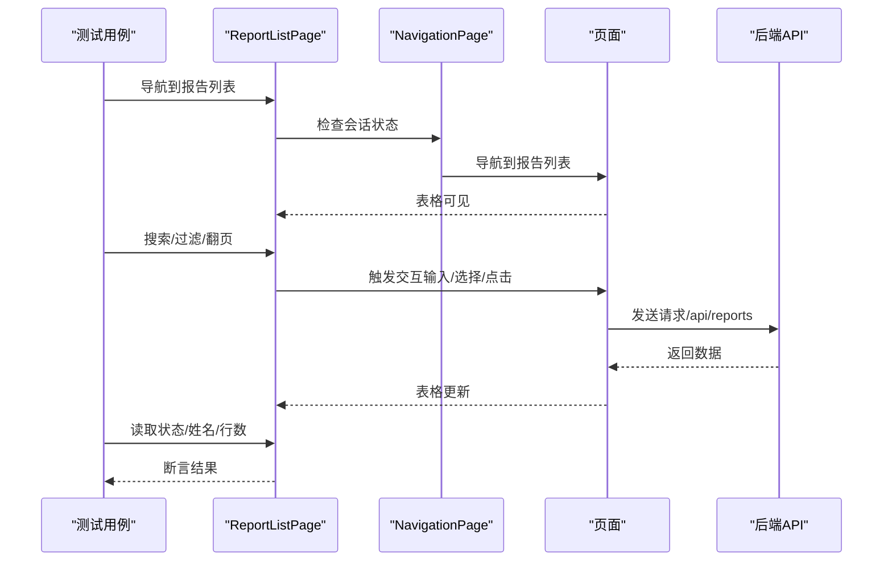
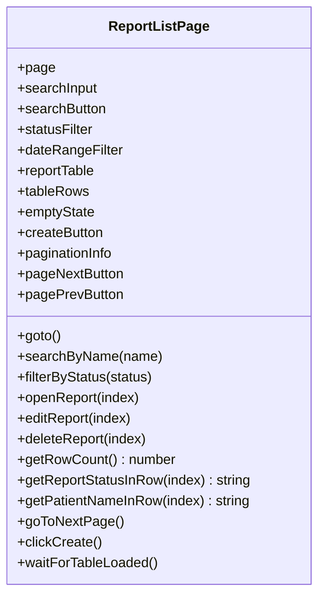
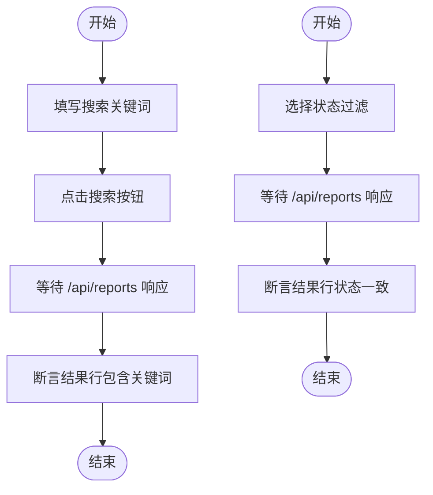
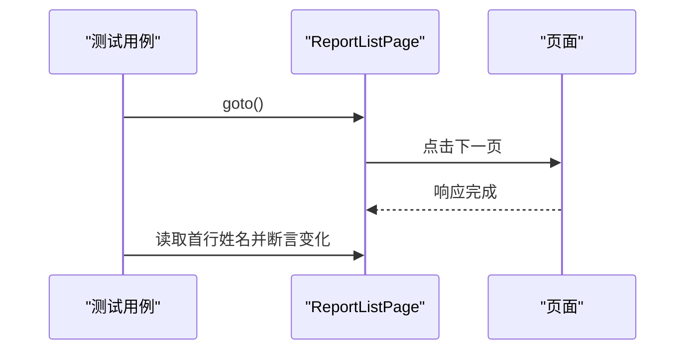
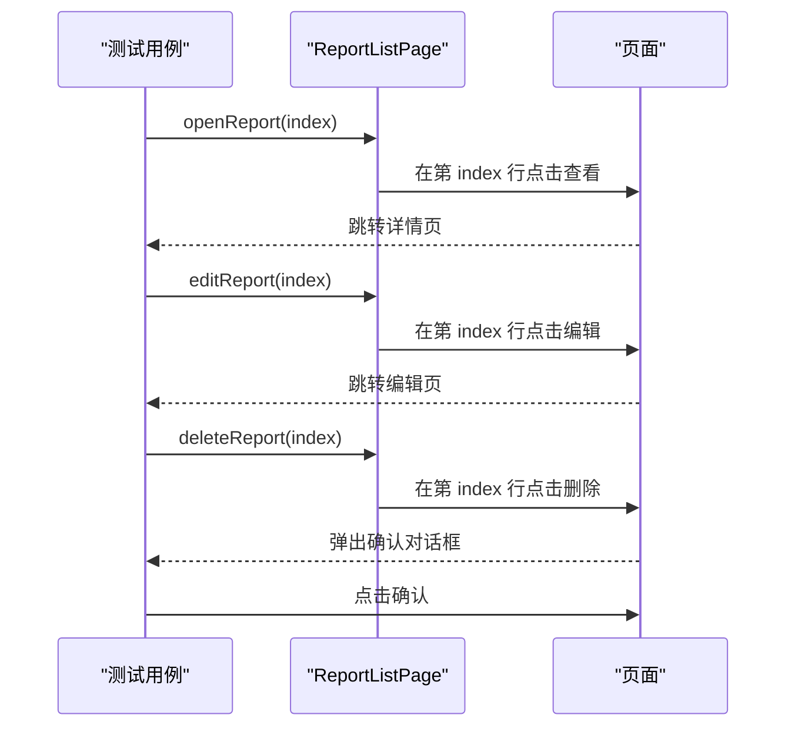
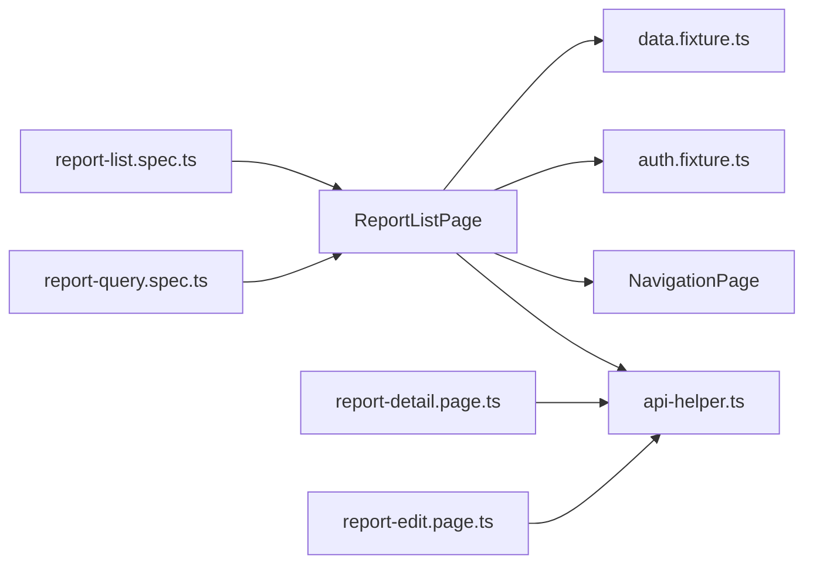

# 报告列表页面

<cite>
**本文引用的文件**
- [report-list.page.ts](file://e2e-tests/pages/report-list.page.ts)
- [report-list.spec.ts](file://e2e-tests/tests/smoke/report-list.spec.ts)
- [report-query.spec.ts](file://e2e-tests/tests/regression/report-query.spec.ts)
- [auth.fixture.ts](file://e2e-tests/fixtures/auth.fixture.ts)
- [api-helper.ts](file://e2e-tests/utils/api-helper.ts)
- [report-detail.page.ts](file://e2e-tests/pages/report-detail.page.ts)
- [report-edit.page.ts](file://e2e-tests/pages/report-edit.page.ts)
- [reports.json](file://e2e-tests/data/reports.json)
- [data.fixture.ts](file://e2e-tests/fixtures/data.fixture.ts)
- [playwright.config.ts](file://e2e-tests/playwright.config.ts)
- [navigation.page.ts](file://e2e-tests/pages/navigation.page.ts)
</cite>

## 更新摘要
**变更内容**
- 更新了报告列表页面的导航机制，增强了会话管理和页面重载逻辑
- 新增了更健壮的表格加载等待策略，支持多种加载状态检测
- 增强了搜索和过滤功能的实现细节
- 完善了分页处理和数据验证逻辑
- 优化了错误处理和超时控制机制

## 目录
1. [简介](#简介)
2. [项目结构](#项目结构)
3. [核心组件](#核心组件)
4. [架构总览](#架构总览)
5. [详细组件分析](#详细组件分析)
6. [依赖关系分析](#依赖关系分析)
7. [性能考虑](#性能考虑)
8. [故障排查指南](#故障排查指南)
9. [结论](#结论)
10. [附录](#附录)

## 简介
本指南面向自动化测试工程师与前端开发人员，系统性解析报告列表页面的端到端实现，重点覆盖：
- 报告表格渲染与行元素定位策略
- 搜索过滤（按姓名、按状态）与分页处理
- 排序机制与结果集处理逻辑
- 单个报告操作（查看、编辑、删除）与批量操作能力
- 报告状态显示与筛选条件设置
- 列表页面扩展方法（自定义列、导出、打印）
- 性能优化技巧、大数据集处理与用户体验提升

**更新** 应用已重构，增强了筛选功能和数据展示能力，包括改进的导航机制、更健壮的加载等待策略和增强的错误处理。

## 项目结构
该仓库采用基于"页面对象模型（Page Object Model, POM）"的测试组织方式，页面层、测试层、夹具层与工具层职责清晰分离：
- 页面层：封装页面交互与定位器，如报告列表页、详情页、编辑页等
- 测试层：编写业务场景驱动的测试用例，覆盖冒烟与回归场景
- 夹具层：提供角色化页面上下文与测试数据生命周期管理
- 工具层：封装 API 调用、数据库辅助与环境配置

**图表来源**
- [report-list.spec.ts:1-28](file://e2e-tests/tests/smoke/report-list.spec.ts#L1-L28)
- [report-query.spec.ts:1-122](file://e2e-tests/tests/regression/report-query.spec.ts#L1-L122)
- [report-list.page.ts:1-182](file://e2e-tests/pages/report-list.page.ts#L1-L182)
- [report-detail.page.ts:1-111](file://e2e-tests/pages/report-detail.page.ts#L1-L111)
- [report-edit.page.ts:1-99](file://e2e-tests/pages/report-edit.page.ts#L1-L99)
- [auth.fixture.ts:1-52](file://e2e-tests/fixtures/auth.fixture.ts#L1-L52)
- [data.fixture.ts:1-32](file://e2e-tests/fixtures/data.fixture.ts#L1-L32)
- [api-helper.ts:1-206](file://e2e-tests/utils/api-helper.ts#L1-L206)
- [reports.json:1-78](file://e2e-tests/data/reports.json#L1-L78)
- [navigation.page.ts:1-90](file://e2e-tests/pages/navigation.page.ts#L1-L90)

**章节来源**
- [report-list.spec.ts:1-28](file://e2e-tests/tests/smoke/report-list.spec.ts#L1-L28)
- [report-query.spec.ts:1-122](file://e2e-tests/tests/regression/report-query.spec.ts#L1-L122)
- [report-list.page.ts:1-182](file://e2e-tests/pages/report-list.page.ts#L1-L182)
- [auth.fixture.ts:1-52](file://e2e-tests/fixtures/auth.fixture.ts#L1-L52)
- [data.fixture.ts:1-32](file://e2e-tests/fixtures/data.fixture.ts#L1-L32)
- [api-helper.ts:1-206](file://e2e-tests/utils/api-helper.ts#L1-L206)
- [reports.json:1-78](file://e2e-tests/data/reports.json#L1-L78)
- [navigation.page.ts:1-90](file://e2e-tests/pages/navigation.page.ts#L1-L90)

## 核心组件
- 报告列表页对象（ReportListPage）
  - 定位器：搜索输入框、搜索按钮、状态筛选、日期范围筛选、报告表格、表格行集合、空状态、创建按钮、分页信息、上一页/下一页按钮
  - 关键方法：导航至列表页、按姓名搜索、按状态过滤、打开/编辑/删除报告、获取行数、获取某行状态/患者姓名、翻页、点击创建
- 测试用例
  - 冒烟测试：验证列表加载、表格可见、存在数据行、关键列标题存在
  - 回归测试：按姓名搜索、按状态过滤、分页翻页、空结果处理
- 角色夹具（auth.fixture.ts）
  - 提供医生、审核员、管理员三种角色页面上下文，确保不同权限用户的行为一致性
- 数据夹具（data.fixture.ts）
  - 自动创建/清理测试报告，简化前置数据准备
- API 辅助（api-helper.ts）
  - 提供创建/删除/更新状态/获取报告详情/批量清理等接口，支撑测试数据管理

**更新** 增强了导航和加载等待机制，提供了更健壮的页面交互能力。

**章节来源**
- [report-list.page.ts:1-182](file://e2e-tests/pages/report-list.page.ts#L1-L182)
- [report-list.spec.ts:1-28](file://e2e-tests/tests/smoke/report-list.spec.ts#L1-L28)
- [report-query.spec.ts:1-122](file://e2e-tests/tests/regression/report-query.spec.ts#L1-L122)
- [auth.fixture.ts:1-52](file://e2e-tests/fixtures/auth.fixture.ts#L1-L52)
- [data.fixture.ts:1-32](file://e2e-tests/fixtures/data.fixture.ts#L1-L32)
- [api-helper.ts:1-206](file://e2e-tests/utils/api-helper.ts#L1-L206)

## 架构总览
报告列表页面的端到端工作流如下：
- 用户通过角色夹具进入页面
- ReportListPage 发起导航与交互
- 页面触发异步请求（/api/reports），等待响应完成
- 表格渲染结果，支持搜索、过滤、分页
- 支持对单行报告进行查看、编辑、删除等操作

**图表来源**
- [report-list.page.ts:35-62](file://e2e-tests/pages/report-list.page.ts#L35-L62)
- [navigation.page.ts:13-89](file://e2e-tests/pages/navigation.page.ts#L13-L89)
- [report-query.spec.ts:44-120](file://e2e-tests/tests/regression/report-query.spec.ts#L44-L120)

## 详细组件分析

### 报告列表页对象（ReportListPage）
- 定位器设计
  - 使用 data-testid 统一定位，提高稳定性与可维护性
  - 表格行集合通过 tbody tr 定位，便于逐行读取状态与姓名
- 导航与等待
  - 导航后等待表格可见；每次交互后等待 /api/reports 成功响应，确保 UI 与数据一致
  - 增强的会话管理：自动检测登录状态，必要时重新导航
- 搜索与过滤
  - 搜索：填充输入框并点击搜索按钮，等待响应
  - 过滤：点击状态选择器并选择对应选项，等待响应
- 分页
  - 点击下一页按钮，等待响应后断言数据变化
- 行内操作
  - 查看/编辑/删除：通过 nth(index) 获取目标行，再在该行内定位对应按钮
- 结果集读取
  - 行数统计、某行状态文本、某行患者姓名文本

**更新** 新增了增强的导航机制和更健壮的加载等待策略。

**图表来源**
- [report-list.page.ts:4-33](file://e2e-tests/pages/report-list.page.ts#L4-L33)
- [report-list.page.ts:35-181](file://e2e-tests/pages/report-list.page.ts#L35-L181)

**章节来源**
- [report-list.page.ts:1-182](file://e2e-tests/pages/report-list.page.ts#L1-L182)

### 导航与会话管理
- 会话状态检查
  - 自动检测当前 URL，如果包含登录页则重新导航到主页
  - 支持会话失效后的自动恢复
- 导航策略
  - 使用 NavigationPage 通过菜单导航到报告列表
  - 支持直接访问 /reports 页面
- 加载等待
  - 等待页面加载完成（domcontentloaded）
  - 等待网络空闲（networkidle）
  - 支持多种加载状态检测

**更新** 新增了完整的会话管理和导航增强功能。

**章节来源**
- [report-list.page.ts:35-62](file://e2e-tests/pages/report-list.page.ts#L35-L62)
- [navigation.page.ts:13-89](file://e2e-tests/pages/navigation.page.ts#L13-L89)

### 增强的表格加载等待机制
- 多层次等待策略
  - 等待页面加载完成
  - 等待主要表格元素可见（report-table、empty-state、table、.el-table）
  - 等待 API 响应（/api/reports 200）
- 超时控制
  - 主要元素等待超时：10秒
  - API 响应等待超时：5秒
- 错误处理
  - 如果主要元素未找到，回退到 API 响应等待
  - 继续执行而不中断测试流程

**更新** 新增了多层等待策略和增强的错误处理机制。

**章节来源**
- [report-list.page.ts:67-89](file://e2e-tests/pages/report-list.page.ts#L67-L89)

### 搜索与过滤流程
- 搜索流程
  - 输入患者姓名 → 点击搜索 → 等待 /api/reports 响应 → 断言结果行均包含匹配关键字
- 过滤流程
  - 选择状态 → 等待 /api/reports 响应 → 断言结果行状态一致
- 空结果处理
  - 搜索不存在的关键字 → 断言行数为 0 或显示空状态

**图表来源**
- [report-list.page.ts:94-112](file://e2e-tests/pages/report-list.page.ts#L94-L112)
- [report-query.spec.ts:44-68](file://e2e-tests/tests/regression/report-query.spec.ts#L44-L68)
- [report-query.spec.ts:71-100](file://e2e-tests/tests/regression/report-query.spec.ts#L71-L100)

**章节来源**
- [report-list.page.ts:94-112](file://e2e-tests/pages/report-list.page.ts#L94-L112)
- [report-query.spec.ts:44-100](file://e2e-tests/tests/regression/report-query.spec.ts#L44-L100)

### 分页处理流程
- 获取第一页首行患者姓名
- 判断下一页按钮是否可用
- 若可用则点击下一页，等待响应
- 断言第二页首行与第一页首行不同

**图表来源**
- [report-list.page.ts:168-173](file://e2e-tests/pages/report-list.page.ts#L168-L173)
- [report-query.spec.ts:102-120](file://e2e-tests/tests/regression/report-query.spec.ts#L102-L120)

**章节来源**
- [report-list.page.ts:168-173](file://e2e-tests/pages/report-list.page.ts#L168-L173)
- [report-query.spec.ts:102-120](file://e2e-tests/tests/regression/report-query.spec.ts#L102-L120)

### 单个报告操作与批量操作
- 单个报告操作
  - 查看：在指定行内点击"查看"按钮
  - 编辑：在指定行内点击"编辑"按钮
  - 删除：在指定行内点击"删除"，并处理确认弹窗
- 批量操作
  - 当前实现未提供全选/批量删除/批量导出等操作
  - 可通过循环遍历行集合实现批量操作（例如：逐行点击删除）

**图表来源**
- [report-list.page.ts:117-135](file://e2e-tests/pages/report-list.page.ts#L117-L135)
- [report-detail.page.ts:48-51](file://e2e-tests/pages/report-detail.page.ts#L48-L51)
- [report-edit.page.ts:32-34](file://e2e-tests/pages/report-edit.page.ts#L32-L34)

**章节来源**
- [report-list.page.ts:117-135](file://e2e-tests/pages/report-list.page.ts#L117-L135)
- [report-detail.page.ts:48-51](file://e2e-tests/pages/report-detail.page.ts#L48-L51)
- [report-edit.page.ts:32-34](file://e2e-tests/pages/report-edit.page.ts#L32-L34)

### 报告状态显示与筛选条件
- 状态显示
  - 通过获取某行的"状态"单元格文本，断言其值
- 筛选条件
  - 状态筛选器使用 role='option' 的选项进行选择
  - 日期范围筛选器预留，当前测试未覆盖

**章节来源**
- [report-list.page.ts:147-163](file://e2e-tests/pages/report-list.page.ts#L147-L163)
- [report-list.page.ts:24](file://e2e-tests/pages/report-list.page.ts#L24)
- [report-query.spec.ts:71-100](file://e2e-tests/tests/regression/report-query.spec.ts#L71-L100)

### 列表页面扩展方法
- 自定义列显示
  - 在 ReportListPage 中新增定位器，如 getByTestId('cell-custom-column')
  - 在测试中断言列标题与单元格内容
- 导出功能
  - 若存在导出按钮，可在 ReportListPage 中添加导出按钮定位器，并在测试中验证下载行为
- 打印支持
  - 若存在打印按钮，可在 ReportListPage 中添加打印按钮定位器，并在 ReportDetailPage 中验证打印行为
  - 当前仓库未提供打印按钮的实现，需在页面侧增加相应 data-testid 并在页面对象中补充定位器

**章节来源**
- [report-list.page.ts:25](file://e2e-tests/pages/report-list.page.ts#L25)
- [report-detail.page.ts:43](file://e2e-tests/pages/report-detail.page.ts#L43)

## 依赖关系分析
- 页面对象依赖
  - ReportListPage 依赖 Playwright 的 Page/Locator 类型
  - 依赖 NavigationPage 进行菜单导航
  - 依赖 API 辅助工具进行数据准备与清理
- 测试依赖
  - 冒烟测试依赖 ReportListPage 与表格可见性断言
  - 回归测试依赖 ReportListPage、API 辅助与数据夹具
- 角色与数据夹具
  - auth.fixture.ts 提供 doctorPage/auditorPage/adminPage
  - data.fixture.ts 自动创建/清理测试报告，减少重复代码

**图表来源**
- [report-list.page.ts:1-182](file://e2e-tests/pages/report-list.page.ts#L1-L182)
- [report-list.spec.ts:1-28](file://e2e-tests/tests/smoke/report-list.spec.ts#L1-L28)
- [report-query.spec.ts:1-122](file://e2e-tests/tests/regression/report-query.spec.ts#L1-L122)
- [auth.fixture.ts:1-52](file://e2e-tests/fixtures/auth.fixture.ts#L1-L52)
- [data.fixture.ts:1-32](file://e2e-tests/fixtures/data.fixture.ts#L1-L32)
- [api-helper.ts:1-206](file://e2e-tests/utils/api-helper.ts#L1-L206)
- [report-detail.page.ts:1-111](file://e2e-tests/pages/report-detail.page.ts#L1-L111)
- [report-edit.page.ts:1-99](file://e2e-tests/pages/report-edit.page.ts#L1-L99)
- [navigation.page.ts:1-90](file://e2e-tests/pages/navigation.page.ts#L1-L90)

**章节来源**
- [report-list.page.ts:1-182](file://e2e-tests/pages/report-list.page.ts#L1-L182)
- [report-list.spec.ts:1-28](file://e2e-tests/tests/smoke/report-list.spec.ts#L1-L28)
- [report-query.spec.ts:1-122](file://e2e-tests/tests/regression/report-query.spec.ts#L1-L122)
- [auth.fixture.ts:1-52](file://e2e-tests/fixtures/auth.fixture.ts#L1-L52)
- [data.fixture.ts:1-32](file://e2e-tests/fixtures/data.fixture.ts#L1-L32)
- [api-helper.ts:1-206](file://e2e-tests/utils/api-helper.ts#L1-L206)
- [report-detail.page.ts:1-111](file://e2e-tests/pages/report-detail.page.ts#L1-L111)
- [report-edit.page.ts:1-99](file://e2e-tests/pages/report-edit.page.ts#L1-L99)
- [navigation.page.ts:1-90](file://e2e-tests/pages/navigation.page.ts#L1-L90)

## 性能考虑
- 等待策略
  - 使用 waitForResponse 等待 /api/reports 成功响应，避免过早断言导致的不稳定
  - 对于高频交互（搜索/过滤/分页），建议合并等待逻辑，减少重复等待
  - 增强的多层等待策略，支持不同加载阶段的优化
- 大数据集处理
  - 分页是默认处理方式，建议在测试中对大列表进行分页断言
  - 避免一次性读取全部行，优先使用 nth(index) 与局部断言
- 用户体验优化
  - 在搜索/过滤时提供即时反馈（如 loading 状态），当前实现通过等待响应保证一致性
  - 对空结果场景提供明确提示（空状态），已在测试中覆盖
- 错误处理
  - 增强的超时控制和错误恢复机制
  - 支持会话失效后的自动恢复

**更新** 新增了多层等待策略、增强的错误处理和会话管理机制。

## 故障排查指南
- 列表无法加载或表格不可见
  - 检查导航 URL 是否正确，确认 goto 后表格可见
  - 确认 /api/reports 能够返回 200 响应
  - 检查会话状态，确保不是在登录页
- 搜索/过滤无效
  - 确认 data-testid 是否正确，选项选择是否使用 role='option'
  - 检查等待响应逻辑是否生效
  - 验证多层等待策略是否正常工作
- 删除操作未生效
  - 确认删除按钮定位器与确认弹窗处理逻辑
- 分页异常
  - 检查下一页按钮是否启用，等待响应后再断言数据变化
- 导航问题
  - 检查会话状态检测逻辑
  - 验证 NavigationPage 的菜单选择策略

**更新** 新增了会话管理和导航相关的故障排查指南。

**章节来源**
- [report-list.page.ts:35-62](file://e2e-tests/pages/report-list.page.ts#L35-L62)
- [report-list.page.ts:94-112](file://e2e-tests/pages/report-list.page.ts#L94-L112)
- [report-list.page.ts:168-173](file://e2e-tests/pages/report-list.page.ts#L168-L173)
- [navigation.page.ts:13-89](file://e2e-tests/pages/navigation.page.ts#L13-L89)

## 结论
报告列表页面通过清晰的页面对象模型与完善的测试用例，实现了稳定的搜索、过滤、分页与单行操作能力。当前未提供批量操作与导出/打印功能，但具备良好的扩展基础。经过重构后，应用增强了：
- 更健壮的导航和会话管理机制
- 多层等待策略和错误处理
- 改进的加载等待和超时控制
- 增强的用户体验和稳定性

建议在后续迭代中：
- 增加批量操作与导出/打印按钮的定位器与测试
- 优化等待策略与大数据集下的性能表现
- 引入排序机制与更丰富的筛选条件（如日期范围）
- 进一步完善错误恢复和重试机制

## 附录
- 测试数据模板
  - reports.json 提供了多种状态的测试数据模板，可用于快速准备回归测试数据
- 环境配置
  - playwright.config.ts 提供了多项目配置与设备选择，确保跨浏览器一致性
- 角色权限
  - 支持医生、审核员、管理员三种角色，每种角色具有不同的页面访问权限

**更新** 新增了角色权限和增强的导航机制说明。

**章节来源**
- [reports.json:1-78](file://e2e-tests/data/reports.json#L1-L78)
- [playwright.config.ts:1-54](file://e2e-tests/playwright.config.ts#L1-L54)
- [auth.fixture.ts:10-14](file://e2e-tests/fixtures/auth.fixture.ts#L10-L14)