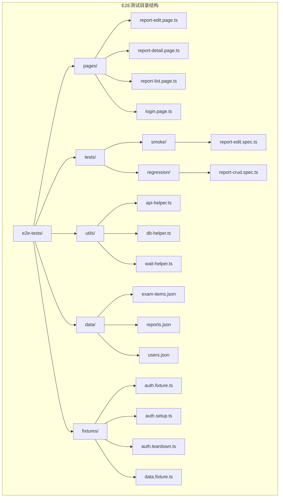
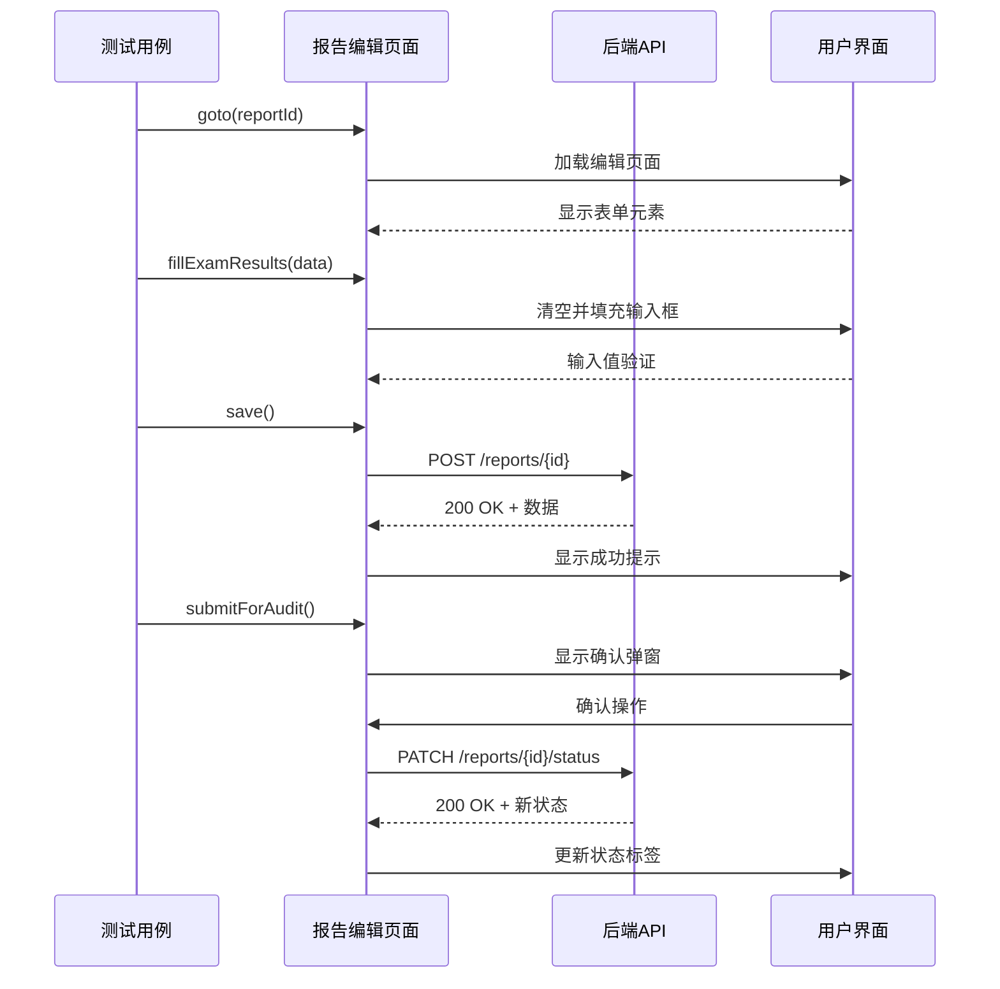
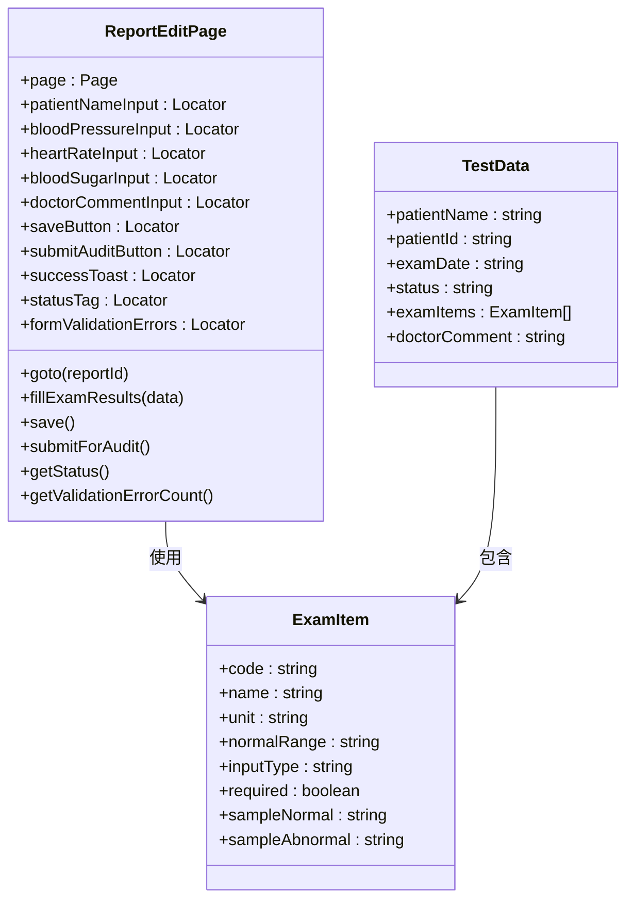
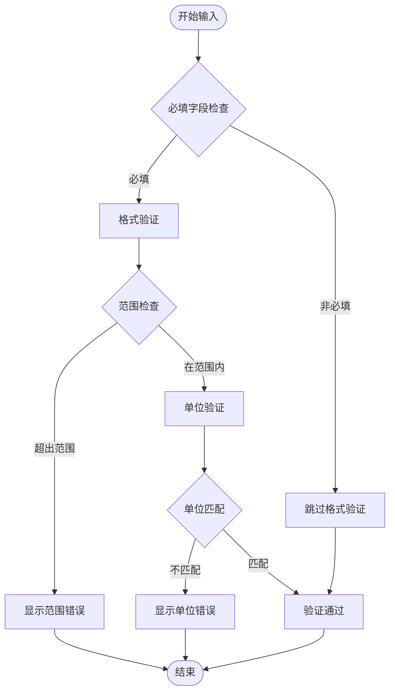
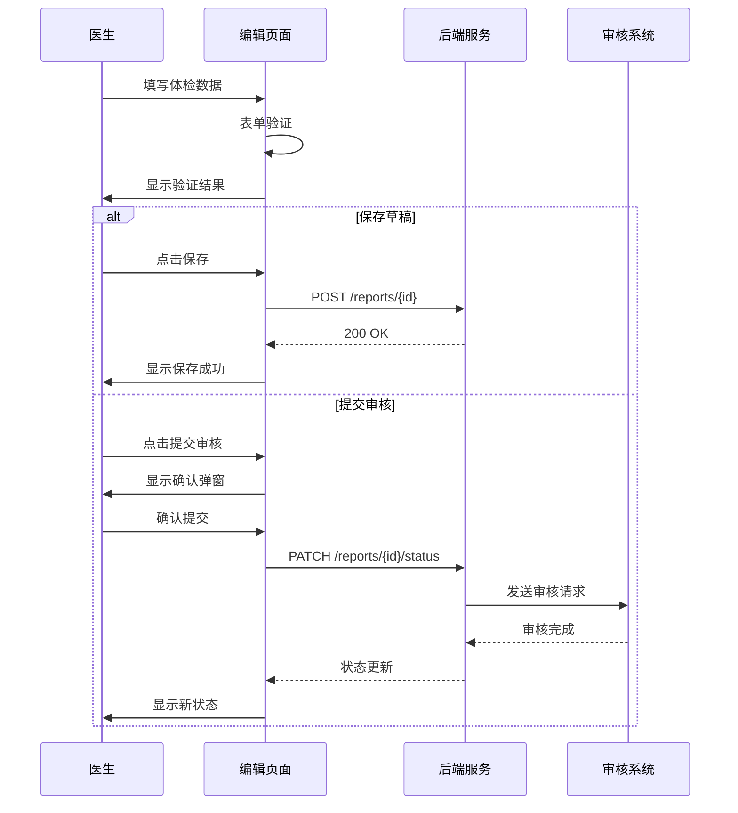
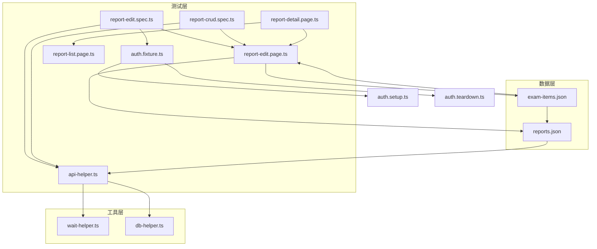

# 报告编辑页面

<cite>
**本文档引用的文件**
- [report-edit.page.ts](file://e2e-tests/pages/report-edit.page.ts)
- [report-edit.spec.ts](file://e2e-tests/tests/smoke/report-edit.spec.ts)
- [report-crud.spec.ts](file://e2e-tests/tests/regression/report-crud.spec.ts)
- [api-helper.ts](file://e2e-tests/utils/api-helper.ts)
- [auth.fixture.ts](file://e2e-tests/fixtures/auth.fixture.ts)
- [report-detail.page.ts](file://e2e-tests/pages/report-detail.page.ts)
- [report-list.page.ts](file://e2e-tests/pages/report-list.page.ts)
- [exam-items.json](file://e2e-tests/data/exam-items.json)
- [reports.json](file://e2e-tests/data/reports.json)
</cite>

## 目录
1. [简介](#简介)
2. [项目结构](#项目结构)
3. [核心组件](#核心组件)
4. [架构概览](#架构概览)
5. [详细组件分析](#详细组件分析)
6. [依赖关系分析](#依赖关系分析)
7. [性能考虑](#性能考虑)
8. [故障排除指南](#故障排除指南)
9. [结论](#结论)
10. [附录](#附录)

## 简介

报告编辑页面是体检报告管理系统中的核心功能模块，负责医生对体检报告进行数据录入、编辑和审核提交。该页面实现了完整的端到端测试覆盖，包括体检项目数据录入、表单验证、数据提交和状态管理等功能。

本指南将深入分析报告编辑页面的实现细节，涵盖体检项目数据录入、表单验证规则、数据提交流程和错误反馈机制，并提供扩展指南和最佳实践建议。

## 项目结构

报告编辑页面位于E2E测试框架中，采用Page Object模式组织代码结构：



**图表来源**
- [report-edit.page.ts:1-94](file://e2e-tests/pages/report-edit.page.ts#L1-L94)
- [report-edit.spec.ts:1-61](file://e2e-tests/tests/smoke/report-edit.spec.ts#L1-L61)

**章节来源**
- [report-edit.page.ts:1-94](file://e2e-tests/pages/report-edit.page.ts#L1-L94)
- [report-edit.spec.ts:1-61](file://e2e-tests/tests/smoke/report-edit.spec.ts#L1-L61)

## 核心组件

报告编辑页面的核心组件包括以下定位器和功能：

### 主要定位器

| 定位器名称 | 类型 | 功能描述 |
|-----------|------|----------|
| patientNameInput | Locator | 患者姓名输入框 |
| bloodPressureInput | Locator | 血压输入框 |
| heartRateInput | Locator | 心率输入框 |
| bloodSugarInput | Locator | 血糖输入框 |
| doctorCommentInput | Locator | 医生建议输入框 |
| saveButton | Locator | 保存按钮 |
| submitAuditButton | Locator | 提交审核按钮 |
| successToast | Locator | 成功提示消息 |
| statusTag | Locator | 报告状态标签 |
| formValidationErrors | Locator | 表单验证错误 |

### 关键功能方法

1. **导航方法**：`goto(reportId)` - 跳转到指定报告的编辑页面
2. **数据录入方法**：`fillExamResults(data)` - 填写体检结果（支持部分填写）
3. **保存方法**：`save()` - 保存报告并等待成功提示
4. **审核方法**：`submitForAudit()` - 提交审核并处理确认弹窗
5. **状态查询**：`getStatus()` - 获取报告当前状态
6. **错误统计**：`getValidationErrorCount()` - 获取表单验证错误数量

**章节来源**
- [report-edit.page.ts:18-92](file://e2e-tests/pages/report-edit.page.ts#L18-L92)

## 架构概览

报告编辑页面采用Page Object模式，实现了清晰的职责分离：



**图表来源**
- [report-edit.page.ts:32-78](file://e2e-tests/pages/report-edit.page.ts#L32-L78)
- [api-helper.ts:83-121](file://e2e-tests/utils/api-helper.ts#L83-L121)

## 详细组件分析

### 体检项目数据录入系统

报告编辑页面支持多种体检项目的录入，基于体检项目配置文件定义的数据类型：



**图表来源**
- [report-edit.page.ts:3-30](file://e2e-tests/pages/report-edit.page.ts#L3-L30)
- [exam-items.json:1-93](file://e2e-tests/data/exam-items.json#L1-L93)
- [reports.json:1-78](file://e2e-tests/data/reports.json#L1-L78)

#### 输入控件处理方法

1. **文本框处理**：
   - 使用 `clear()` 和 `fill()` 方法进行数据输入
   - 支持部分填写，未提供的字段保持不变
   - 自动处理输入验证和格式检查

2. **数字输入处理**：
   - 心率和血糖等数值项目使用数字输入
   - 支持单位显示和正常范围提示
   - 实时验证数值范围合理性

3. **文本域处理**：
   - 医生建议使用多行文本输入
   - 支持长文本内容编辑
   - 自动换行和滚动处理

4. **状态标签处理**：
   - 使用 `getByTestId('report-status')` 定位
   - 实时显示报告当前状态
   - 支持状态变更跟踪

**章节来源**
- [report-edit.page.ts:39-61](file://e2e-tests/pages/report-edit.page.ts#L39-L61)
- [exam-items.json:1-93](file://e2e-tests/data/exam-items.json#L1-L93)

### 表单验证策略

报告编辑页面实现了多层次的表单验证机制：



**图表来源**
- [report-edit.page.ts:29-30](file://e2e-tests/pages/report-edit.page.ts#L29-L30)
- [report-edit.page.ts:89-92](file://e2e-tests/pages/report-edit.page.ts#L89-L92)

#### 验证规则实现

1. **必填字段验证**：
   - 血压、心率、血糖等核心项目为必填
   - 医生建议为可选字段
   - 未填写的必填字段会触发验证错误

2. **格式验证**：
   - 数字字段验证数值格式
   - 文本字段验证长度限制
   - 特殊格式如血压值的格式要求

3. **范围验证**：
   - 基于体检项目配置的正常范围
   - 超出范围的值显示警告
   - 提供参考值和正常范围提示

4. **实时校验**：
   - 输入时即时验证
   - 实时显示错误信息
   - 动态更新验证状态

**章节来源**
- [report-edit.page.ts:89-92](file://e2e-tests/pages/report-edit.page.ts#L89-L92)
- [exam-items.json:1-93](file://e2e-tests/data/exam-items.json#L1-L93)

### 数据提交流程

报告编辑页面提供了完整的数据提交流程：



**图表来源**
- [report-edit.page.ts:66-78](file://e2e-tests/pages/report-edit.page.ts#L66-L78)
- [api-helper.ts:134-142](file://e2e-tests/utils/api-helper.ts#L134-L142)

#### 提交流程特点

1. **批量保存功能**：
   - 支持一次性保存多个体检项目
   - 自动处理部分填写场景
   - 保持未修改字段不变

2. **状态管理**：
   - 草稿状态：可编辑和删除
   - 待审核状态：锁定编辑权限
   - 已审核状态：发布后不可编辑
   - 已发布状态：最终状态不可更改

3. **确认机制**：
   - 审核提交需要二次确认
   - 删除操作需要确认弹窗
   - 防止误操作造成数据丢失

**章节来源**
- [report-edit.spec.ts:20-60](file://e2e-tests/tests/smoke/report-edit.spec.ts#L20-L60)
- [report-crud.spec.ts:30-62](file://e2e-tests/tests/regression/report-crud.spec.ts#L30-L62)

### 错误反馈机制

报告编辑页面实现了完善的错误反馈机制：

| 错误类型 | 触发条件 | 反馈方式 | 处理建议 |
|---------|---------|---------|---------|
| 必填字段缺失 | 未填写必填项目 | 显示红色错误提示 | 填写完整必填信息 |
| 格式错误 | 输入格式不正确 | 实时高亮显示 | 按要求格式输入 |
| 范围超限 | 数值超出正常范围 | 显示警告信息 | 调整到正常范围 |
| 网络错误 | API请求失败 | 显示网络错误提示 | 检查网络连接 |
| 权限错误 | 无操作权限 | 显示权限不足提示 | 联系管理员 |

**章节来源**
- [report-edit.page.ts:29-30](file://e2e-tests/pages/report-edit.page.ts#L29-L30)
- [report-edit.page.ts:89-92](file://e2e-tests/pages/report-edit.page.ts#L89-L92)

## 依赖关系分析

报告编辑页面与其他组件存在紧密的依赖关系：



**图表来源**
- [report-edit.spec.ts:1-61](file://e2e-tests/tests/smoke/report-edit.spec.ts#L1-L61)
- [report-edit.page.ts:1-94](file://e2e-tests/pages/report-edit.page.ts#L1-L94)
- [api-helper.ts:1-172](file://e2e-tests/utils/api-helper.ts#L1-L172)

### 组件耦合度分析

1. **高内聚低耦合**：
   - 页面对象封装了所有页面交互逻辑
   - 数据层与业务逻辑分离
   - 工具函数独立可复用

2. **依赖注入模式**：
   - 通过构造函数注入Page对象
   - 支持不同角色的页面实例
   - 便于测试环境隔离

3. **接口契约明确**：
   - 所有公共方法都有明确的输入输出
   - 数据结构定义清晰
   - 错误处理策略统一

**章节来源**
- [report-edit.page.ts:18-30](file://e2e-tests/pages/report-edit.page.ts#L18-L30)
- [auth.fixture.ts:10-37](file://e2e-tests/fixtures/auth.fixture.ts#L10-L37)

## 性能考虑

报告编辑页面在设计时充分考虑了性能优化：

### 加载性能优化

1. **延迟加载**：
   - 页面元素按需加载
   - 非关键资源异步加载
   - 减少首屏渲染时间

2. **缓存策略**：
   - API响应结果缓存
   - 页面状态本地存储
   - 减少重复请求

### 交互性能优化

1. **防抖处理**：
   - 输入验证防抖
   - 网络请求节流
   - 避免频繁API调用

2. **异步处理**：
   - 异步数据加载
   - 非阻塞操作
   - 用户体验优化

### 内存管理

1. **资源释放**：
   - 自动清理页面资源
   - 及时释放内存占用
   - 防止内存泄漏

2. **对象复用**：
   - Page对象复用
   - 定位器缓存
   - 减少对象创建开销

## 故障排除指南

### 常见问题及解决方案

#### 页面加载问题

**问题现象**：页面元素无法找到
**可能原因**：
- 页面尚未完全加载
- 元素定位器失效
- 网络请求超时

**解决步骤**：
1. 检查页面URL是否正确
2. 验证元素定位器有效性
3. 查看网络请求状态
4. 增加等待时间

#### 数据同步问题

**问题现象**：保存后数据未更新
**可能原因**：
- 页面未刷新
- API响应延迟
- 缓存数据未清除

**解决步骤**：
1. 显式刷新页面
2. 清除本地缓存
3. 重新获取数据
4. 检查API响应

#### 验证错误问题

**问题现象**：表单验证失败
**可能原因**：
- 输入格式不正确
- 数据超出范围
- 字段长度限制

**解决步骤**：
1. 检查输入格式
2. 验证数据范围
3. 确认字段长度
4. 查看错误提示

**章节来源**
- [report-edit.page.ts:66-69](file://e2e-tests/pages/report-edit.page.ts#L66-L69)
- [report-edit.page.ts:74-78](file://e2e-tests/pages/report-edit.page.ts#L74-L78)

### 调试技巧

1. **日志记录**：
   - 记录关键操作步骤
   - 捕获异常信息
   - 分析执行时间

2. **断点调试**：
   - 在关键节点设置断点
   - 检查变量状态
   - 追踪执行流程

3. **数据验证**：
   - 验证API响应格式
   - 检查数据完整性
   - 确认状态一致性

## 结论

报告编辑页面作为体检报告管理系统的核心功能模块，展现了良好的架构设计和实现质量。通过Page Object模式的应用，实现了清晰的职责分离和高度的可维护性。

### 主要优势

1. **完整的测试覆盖**：涵盖了从基础功能到复杂场景的全面测试
2. **清晰的架构设计**：采用Page Object模式，职责分离明确
3. **完善的错误处理**：多层次的验证和错误反馈机制
4. **良好的扩展性**：支持自定义字段、模板和数据导入导出

### 改进建议

1. **增强实时验证**：增加更细粒度的实时验证反馈
2. **优化用户体验**：改进表单布局和交互设计
3. **扩展数据处理**：支持更多类型的体检项目
4. **提升性能表现**：优化页面加载和数据处理速度

## 附录

### 扩展指南

#### 自定义字段支持

要为报告编辑页面添加新的体检项目，需要：

1. **更新体检项目配置**：
   ```json
   {
     "code": "new_exam_item",
     "name": "新项目名称",
     "unit": "单位",
     "normalRange": "正常范围",
     "inputType": "text/number/textarea",
     "required": true/false
   }
   ```

2. **添加页面定位器**：
   ```typescript
   readonly newExamItemInput: Locator;
   ```

3. **实现数据处理方法**：
   ```typescript
   async fillNewExamItem(value: string) {
     await this.newExamItemInput.clear();
     await this.newExamItemInput.fill(value);
   }
   ```

#### 模板功能

报告编辑页面可以扩展模板功能：

1. **预设模板**：
   - 常见体检项目的默认值
   - 标准化的医生建议模板
   - 不同科室的专用模板

2. **模板应用**：
   - 一键应用预设模板
   - 模板个性化定制
   - 模板版本管理

#### 数据导入导出

支持批量数据处理：

1. **数据导入**：
   - CSV文件批量导入
   - Excel表格数据导入
   - API批量数据导入

2. **数据导出**：
   - PDF格式报告导出
   - Excel表格数据导出
   - JSON格式数据导出

### 测试策略

#### 单元测试

1. **页面对象测试**：
   - 定位器有效性验证
   - 方法调用正确性测试
   - 错误处理场景测试

2. **数据验证测试**：
   - 输入格式验证
   - 数据范围检查
   - 业务规则验证

#### 集成测试

1. **端到端流程测试**：
   - 完整的编辑流程
   - 状态转换测试
   - 权限控制验证

2. **边界条件测试**：
   - 最大最小值测试
   - 空值处理测试
   - 异常情况处理

#### 回归测试

1. **功能回归测试**：
   - 基础功能稳定性
   - 兼容性测试
   - 性能回归测试

2. **用户验收测试**：
   - 用户场景模拟
   - 业务流程验证
   - 用户体验评估

### 用户体验优化

1. **界面优化**：
   - 响应式布局适配
   - 无障碍访问支持
   - 多语言国际化

2. **交互优化**：
   - 智能提示和帮助
   - 操作反馈及时性
   - 错误恢复机制

3. **性能优化**：
   - 页面加载速度提升
   - 内存使用优化
   - 网络请求优化