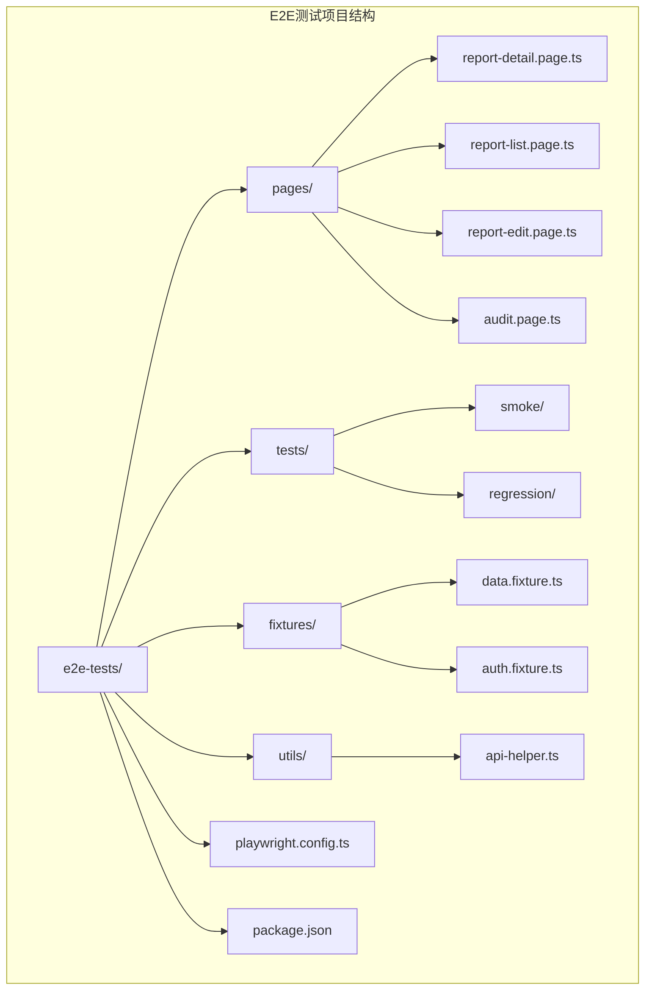
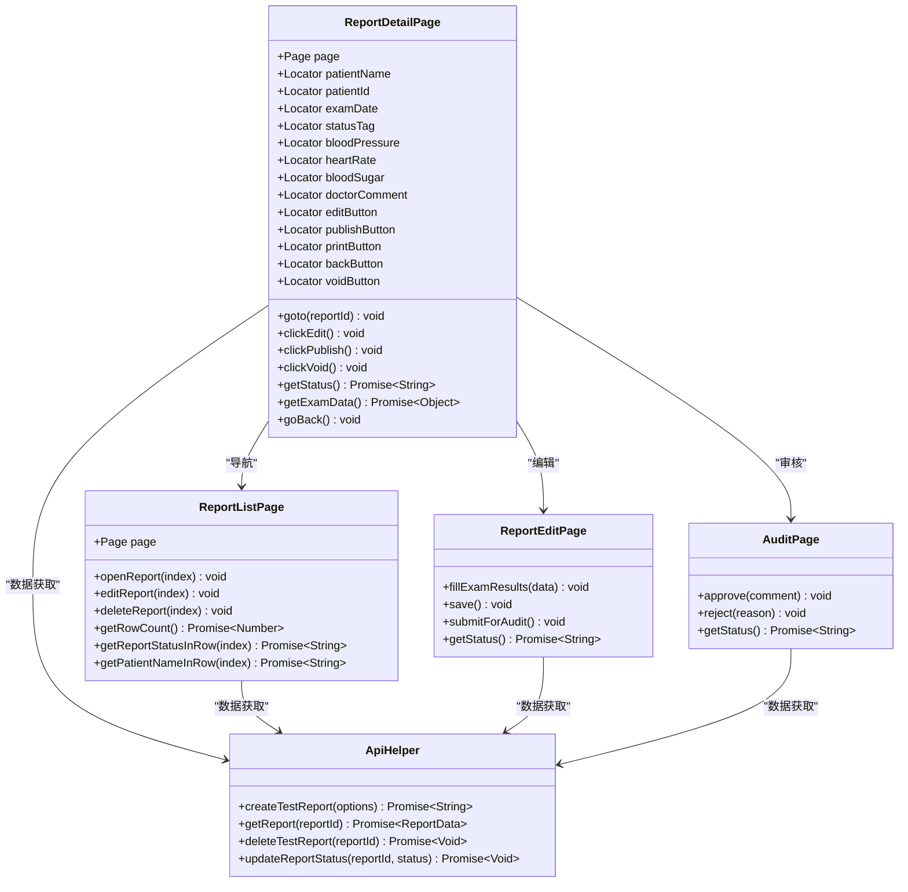
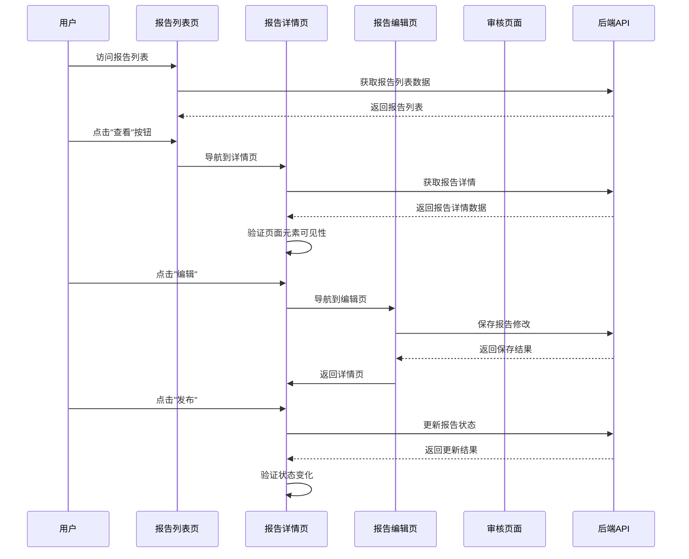
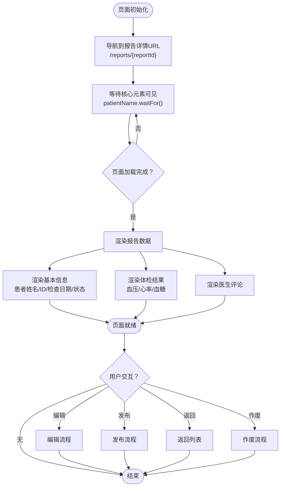
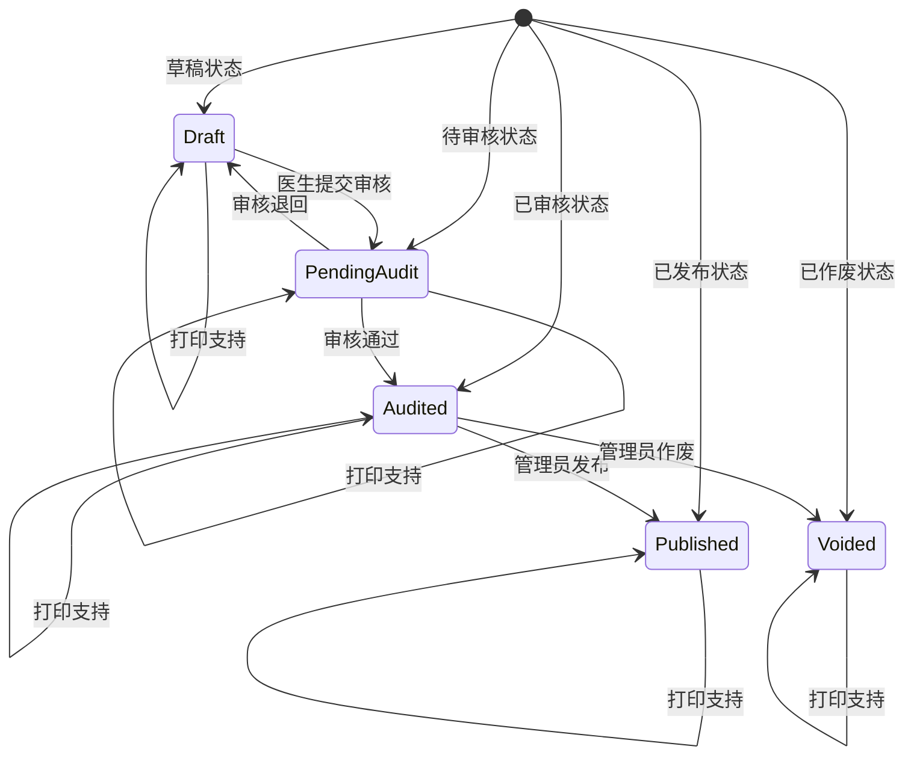
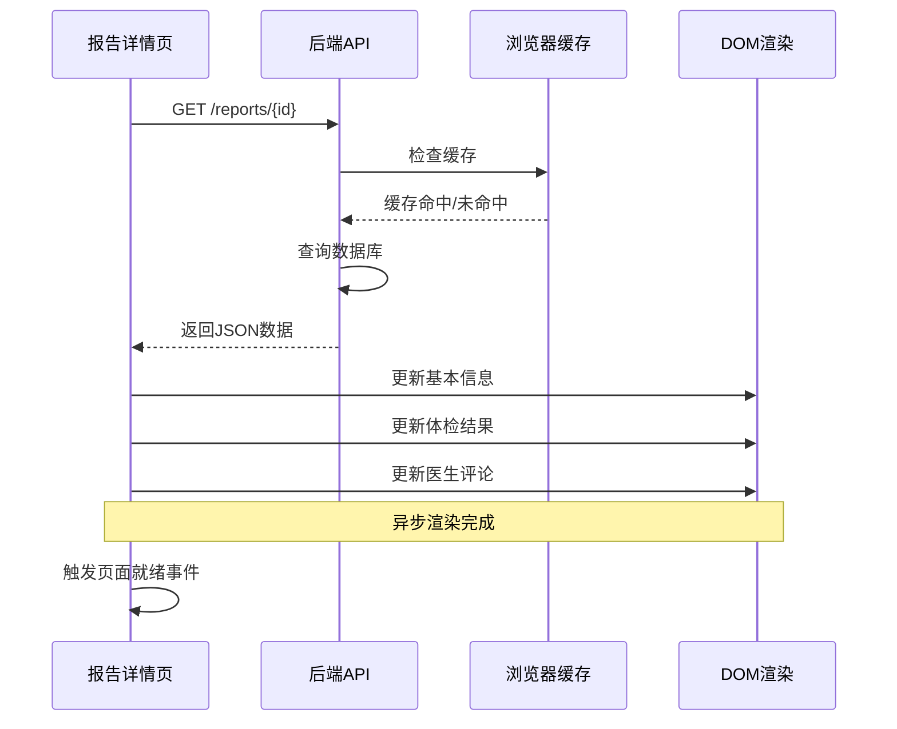
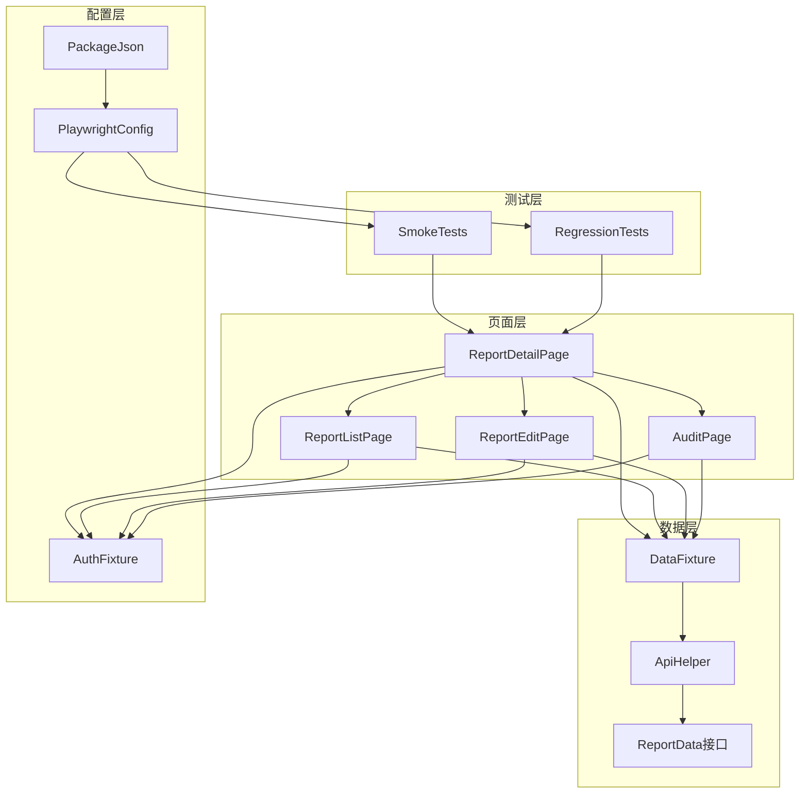

# 报告详情页面

<cite>
**本文档引用的文件**
- [report-detail.page.ts](file://e2e-tests/pages/report-detail.page.ts)
- [report-view.spec.ts](file://e2e-tests/tests/smoke/report-view.spec.ts)
- [report-workflow.spec.ts](file://e2e-tests/tests/regression/report-workflow.spec.ts)
- [report-list.page.ts](file://e2e-tests/pages/report-list.page.ts)
- [report-edit.page.ts](file://e2e-tests/pages/report-edit.page.ts)
- [audit.page.ts](file://e2e-tests/pages/audit.page.ts)
- [data.fixture.ts](file://e2e-tests/fixtures/data.fixture.ts)
- [api-helper.ts](file://e2e-tests/utils/api-helper.ts)
- [auth.fixture.ts](file://e2e-tests/fixtures/auth.fixture.ts)
- [playwright.config.ts](file://e2e-tests/playwright.config.ts)
- [package.json](file://e2e-tests/package.json)
</cite>

## 目录
1. [简介](#简介)
2. [项目结构](#项目结构)
3. [核心组件](#核心组件)
4. [架构概览](#架构概览)
5. [详细组件分析](#详细组件分析)
6. [依赖关系分析](#依赖关系分析)
7. [性能考虑](#性能考虑)
8. [故障排除指南](#故障排除指南)
9. [结论](#结论)
10. [附录](#附录)

## 简介

报告详情页面是医院体检报告管理系统中的关键组件，负责展示报告的核心信息、体检项目结果以及提供相关的操作功能。该页面通过Playwright框架实现端到端自动化测试，确保报告详情功能的正确性和稳定性。

本页面主要功能包括：
- 报告基本信息展示（患者姓名、ID、检查日期、状态标签）
- 体检项目结果查看（血压、心率、血糖等）
- 医生评论显示
- 编辑、发布、作废、返回等操作按钮
- 状态流转验证（草稿、待审核、已审核、已发布、已作废）

## 项目结构

基于仓库的实际结构，报告详情页面位于e2e-tests目录下的pages子目录中，采用Page Object Model模式进行组织：



**图表来源**
- [report-detail.page.ts:1-107](file://e2e-tests/pages/report-detail.page.ts#L1-L107)
- [report-list.page.ts:1-130](file://e2e-tests/pages/report-list.page.ts#L1-L130)
- [report-edit.page.ts:1-94](file://e2e-tests/pages/report-edit.page.ts#L1-L94)
- [audit.page.ts:1-72](file://e2e-tests/pages/audit.page.ts#L1-L72)

**章节来源**
- [report-detail.page.ts:1-107](file://e2e-tests/pages/report-detail.page.ts#L1-L107)
- [playwright.config.ts:1-68](file://e2e-tests/playwright.config.ts#L1-L68)

## 核心组件

报告详情页面的核心组件包括以下定位器和功能模块：

### 基本信息区域
- **患者姓名**: `page.getByTestId('detail-patient-name')`
- **患者ID**: `page.getByTestId('detail-patient-id')`
- **检查日期**: `page.getByTestId('detail-exam-date')`
- **状态标签**: `page.getByTestId('report-status')`

### 体检结果区域
- **血压**: `page.getByTestId('detail-blood-pressure')`
- **心率**: `page.getByTestId('detail-heart-rate')`
- **血糖**: `page.getByTestId('detail-blood-sugar')`
- **医生评论**: `page.getByTestId('detail-doctor-comment')`

### 操作按钮区域
- **编辑按钮**: `page.getByTestId('btn-edit')`
- **发布按钮**: `page.getByTestId('btn-publish')`
- **打印按钮**: `page.getByTestId('btn-print')`
- **返回按钮**: `page.getByTestId('btn-back')`
- **作废按钮**: `page.getByTestId('btn-void')`

**章节来源**
- [report-detail.page.ts:6-46](file://e2e-tests/pages/report-detail.page.ts#L6-L46)

## 架构概览

报告详情页面采用Page Object Model (POM)设计模式，通过独立的Page类封装UI元素和交互逻辑：



**图表来源**
- [report-detail.page.ts:3-106](file://e2e-tests/pages/report-detail.page.ts#L3-L106)
- [report-list.page.ts:3-129](file://e2e-tests/pages/report-list.page.ts#L3-L129)
- [report-edit.page.ts:3-93](file://e2e-tests/pages/report-edit.page.ts#L3-L93)
- [audit.page.ts:3-71](file://e2e-tests/pages/audit.page.ts#L3-L71)
- [api-helper.ts:83-151](file://e2e-tests/utils/api-helper.ts#L83-L151)

## 详细组件分析

### 页面导航与生命周期

报告详情页面的导航流程遵循标准的SPA路由模式：



**图表来源**
- [report-detail.page.ts:48-51](file://e2e-tests/pages/report-detail.page.ts#L48-L51)
- [report-list.page.ts:65-67](file://e2e-tests/pages/report-list.page.ts#L65-L67)
- [report-edit.page.ts:32-34](file://e2e-tests/pages/report-edit.page.ts#L32-L34)
- [report-workflow.spec.ts:63-68](file://e2e-tests/tests/regression/report-workflow.spec.ts#L63-L68)

### 数据获取与渲染逻辑

报告详情页面的数据获取采用异步模式，确保UI元素完全加载后再进行断言：



**图表来源**
- [report-detail.page.ts:48-51](file://e2e-tests/pages/report-detail.page.ts#L48-L51)
- [report-detail.page.ts:86-98](file://e2e-tests/pages/report-detail.page.ts#L86-L98)

### 状态管理与验证

报告详情页面支持多种状态的验证和操作：



**图表来源**
- [report-workflow.spec.ts:8-69](file://e2e-tests/tests/regression/report-workflow.spec.ts#L8-L69)
- [report-workflow.spec.ts:71-136](file://e2e-tests/tests/regression/report-workflow.spec.ts#L71-L136)

### 动态内容加载与懒加载策略

虽然当前实现主要基于静态数据断言，但页面设计考虑了动态内容的加载：



**图表来源**
- [api-helper.ts:147-151](file://e2e-tests/utils/api-helper.ts#L147-L151)
- [report-detail.page.ts:48-51](file://e2e-tests/pages/report-detail.page.ts#L48-L51)

**章节来源**
- [report-detail.page.ts:48-106](file://e2e-tests/pages/report-detail.page.ts#L48-L106)
- [api-helper.ts:83-151](file://e2e-tests/utils/api-helper.ts#L83-L151)

## 依赖关系分析

报告详情页面与其他组件之间的依赖关系如下：



**图表来源**
- [report-detail.page.ts:1-107](file://e2e-tests/pages/report-detail.page.ts#L1-L107)
- [report-list.page.ts:1-130](file://e2e-tests/pages/report-list.page.ts#L1-L130)
- [report-edit.page.ts:1-94](file://e2e-tests/pages/report-edit.page.ts#L1-L94)
- [audit.page.ts:1-72](file://e2e-tests/pages/audit.page.ts#L1-L72)
- [data.fixture.ts:1-57](file://e2e-tests/fixtures/data.fixture.ts#L1-L57)
- [api-helper.ts:1-172](file://e2e-tests/utils/api-helper.ts#L1-L172)
- [auth.fixture.ts:1-40](file://e2e-tests/fixtures/auth.fixture.ts#L1-L40)
- [playwright.config.ts:1-68](file://e2e-tests/playwright.config.ts#L1-L68)
- [package.json:1-27](file://e2e-tests/package.json#L1-L27)

**章节来源**
- [data.fixture.ts:13-54](file://e2e-tests/fixtures/data.fixture.ts#L13-L54)
- [api-helper.ts:40-77](file://e2e-tests/utils/api-helper.ts#L40-L77)

## 性能考虑

基于当前实现的分析，以下是针对报告详情页面的性能优化建议：

### 加载性能优化
1. **延迟加载策略**: 对于大型报告，可以考虑分块加载体检项目数据
2. **虚拟滚动**: 当体检项目数量较多时，使用虚拟滚动技术提升渲染性能
3. **缓存机制**: 利用浏览器缓存减少重复请求

### 内存管理
1. **组件卸载**: 在页面切换时及时清理事件监听器和定时器
2. **数据清理**: 避免在内存中保留不必要的DOM引用
3. **垃圾回收**: 定期触发垃圾回收机制

### 网络优化
1. **请求合并**: 将多个小请求合并为批量请求
2. **CDN加速**: 对静态资源使用CDN分发
3. **压缩传输**: 启用Gzip/Brotli压缩

### 响应式设计考虑
1. **移动端适配**: 确保在移动设备上的良好体验
2. **触摸友好**: 按钮大小和间距适合触摸操作
3. **字体缩放**: 支持系统字体大小调整

## 故障排除指南

### 常见问题及解决方案

#### 页面元素加载超时
**症状**: `TimeoutError: waiting for selector failed`
**原因**: 页面元素尚未完全渲染
**解决方案**:
- 增加等待时间或使用更精确的选择器
- 检查网络连接和API响应时间
- 验证测试数据是否正确生成

#### 状态验证失败
**症状**: 状态标签文本与预期不符
**原因**: 报告状态未正确更新
**解决方案**:
- 检查状态流转API调用
- 验证权限角色配置
- 确认数据库状态同步

#### 数据断言失败
**症状**: 体检结果或基本信息断言失败
**原因**: 测试数据不匹配或API响应格式变化
**解决方案**:
- 更新测试数据fixture
- 检查API接口变更
- 验证数据模型一致性

**章节来源**
- [report-view.spec.ts:10-24](file://e2e-tests/tests/smoke/report-view.spec.ts#L10-L24)
- [report-workflow.spec.ts:105-135](file://e2e-tests/tests/regression/report-workflow.spec.ts#L105-L135)

## 结论

报告详情页面作为医院体检报告管理系统的核心组件，通过Playwright框架实现了完善的端到端测试覆盖。页面采用Page Object Model设计模式，具有良好的可维护性和可扩展性。

当前实现的主要优势：
- **清晰的职责分离**: 每个页面类专注于特定的功能领域
- **强大的测试覆盖**: 包含冒烟测试和回归测试
- **灵活的数据管理**: 支持多种报告状态和操作流程
- **标准化的配置**: 统一的测试环境和工具链

未来改进建议：
- 实现图片和附件预览功能
- 添加评论和分享机制
- 增强历史版本对比功能
- 优化大数据量展示性能
- 完善打印支持功能

## 附录

### API接口定义

报告详情页面涉及的主要API接口：

| 接口 | 方法 | 描述 |
|------|------|------|
| `/reports/{id}` | GET | 获取报告详情 |
| `/reports` | POST | 创建测试报告 |
| `/reports/{id}` | DELETE | 删除测试报告 |
| `/reports/{id}/status` | PATCH | 更新报告状态 |

### 测试数据结构

```typescript
interface ReportData {
  id: string;
  patientName: string;
  patientId: string;
  examDate: string;
  status: string;
  examItems: Array<{
    code: string;
    name: string;
    value: string;
    unit: string;
  }>;
  doctorComment?: string;
  auditComment?: string;
  createdBy?: string;
  updatedAt?: string;
}
```

### 测试配置参数

| 配置项 | 默认值 | 描述 |
|--------|--------|------|
| timeout | 30000ms | 测试超时时间 |
| expect.timeout | 5000ms | 断言超时时间 |
| workers | 1 | 并行工作进程数 |
| retries | 0 | 失败重试次数 |

**章节来源**
- [api-helper.ts:22-38](file://e2e-tests/utils/api-helper.ts#L22-L38)
- [playwright.config.ts:8-15](file://e2e-tests/playwright.config.ts#L8-L15)