# 登录页面封装

<cite>
**本文档引用的文件**
- [login.page.ts](file://e2e-tests/pages/login.page.ts)
- [login.spec.ts](file://e2e-tests/tests/smoke/login.spec.ts)
- [auth.fixture.ts](file://e2e-tests/fixtures/auth.fixture.ts)
- [auth.setup.ts](file://e2e-tests/fixtures/auth.setup.ts)
- [auth.teardown.ts](file://e2e-tests/fixtures/auth.teardown.ts)
- [wait-helper.ts](file://e2e-tests/utils/wait-helper.ts)
- [playwright.config.ts](file://e2e-tests/playwright.config.ts)
- [users.json](file://e2e-tests/data/users.json)
- [package.json](file://e2e-tests/package.json)
</cite>

## 目录
1. [简介](#简介)
2. [项目结构](#项目结构)
3. [核心组件](#核心组件)
4. [架构概览](#架构概览)
5. [详细组件分析](#详细组件分析)
6. [依赖关系分析](#依赖关系分析)
7. [性能考虑](#性能考虑)
8. [故障排除指南](#故障排除指南)
9. [结论](#结论)
10. [附录](#附录)

## 简介

本指南专注于登录页面封装的实现与最佳实践，基于Playwright框架构建的企业级端到端测试体系。该系统采用Page Object模式设计，通过明确的职责分离和可复用的组件封装，提供了稳定可靠的登录功能测试解决方案。

系统的核心特点包括：
- **模块化设计**：每个页面封装独立的定位器和交互方法
- **类型安全**：完整的TypeScript类型定义确保开发体验
- **可扩展性**：支持多种认证方式和会话管理策略
- **稳定性**：内置重试机制和超时处理确保测试可靠性

## 项目结构

整个测试项目采用分层架构组织，登录功能位于核心的页面对象层：

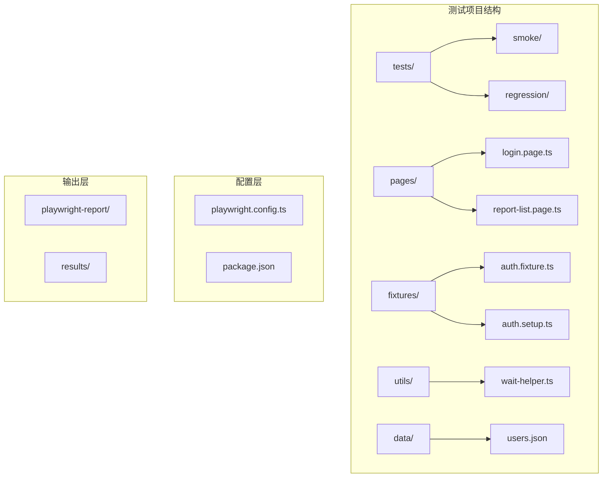

**图表来源**
- [playwright.config.ts:1-68](file://e2e-tests/playwright.config.ts#L1-L68)
- [package.json:1-27](file://e2e-tests/package.json#L1-L27)

**章节来源**
- [playwright.config.ts:1-68](file://e2e-tests/playwright.config.ts#L1-L68)
- [package.json:1-27](file://e2e-tests/package.json#L1-L27)

## 核心组件

### LoginPage类设计

LoginPage类是登录功能的核心封装，采用Page Object模式实现：

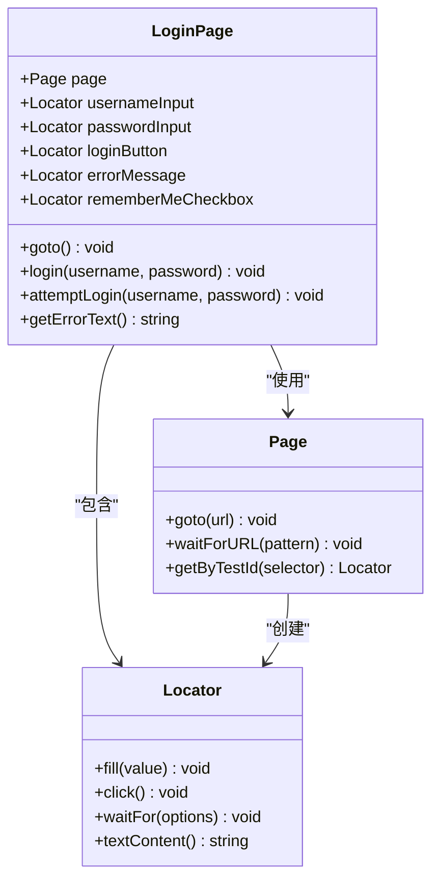

**图表来源**
- [login.page.ts:3-51](file://e2e-tests/pages/login.page.ts#L3-L51)

### 关键特性分析

1. **定位器策略**：使用`data-testid`属性进行元素定位，确保测试稳定性
2. **方法分离**：提供完整登录流程和失败场景测试两种方法
3. **错误处理**：内置错误消息获取和断言能力
4. **会话管理**：支持记住我功能和持久化认证状态

**章节来源**
- [login.page.ts:13-51](file://e2e-tests/pages/login.page.ts#L13-L51)

## 架构概览

系统采用分层架构设计，确保各层职责清晰分离：

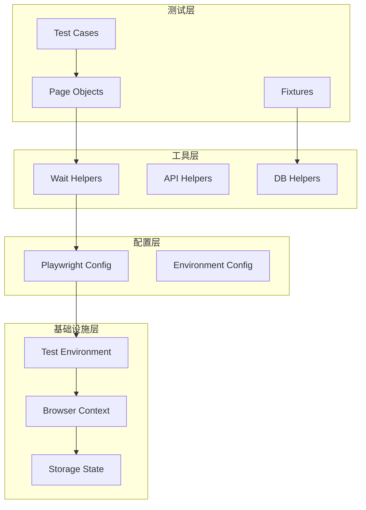

**图表来源**
- [playwright.config.ts:6-68](file://e2e-tests/playwright.config.ts#L6-L68)
- [auth.fixture.ts:10-37](file://e2e-tests/fixtures/auth.fixture.ts#L10-L37)

## 详细组件分析

### 登录页面定位策略

#### 元素定位器设计

登录页面使用统一的`data-testid`命名规范，确保定位器的稳定性和可维护性：

| 元素类型 | 定位器ID | 用途 | 期望状态 |
|---------|----------|------|----------|
| 用户名输入框 | `input-username` | 输入用户名 | 可见且可交互 |
| 密码输入框 | `input-password` | 输入密码 | 可见且可交互 |
| 登录按钮 | `btn-login` | 触发登录流程 | 可见且可点击 |
| 错误消息 | `login-error-message` | 显示登录错误 | 初始隐藏，错误时可见 |
| 记住我复选框 | `checkbox-remember` | 保持登录状态 | 可见且可选择 |

#### 定位器初始化流程

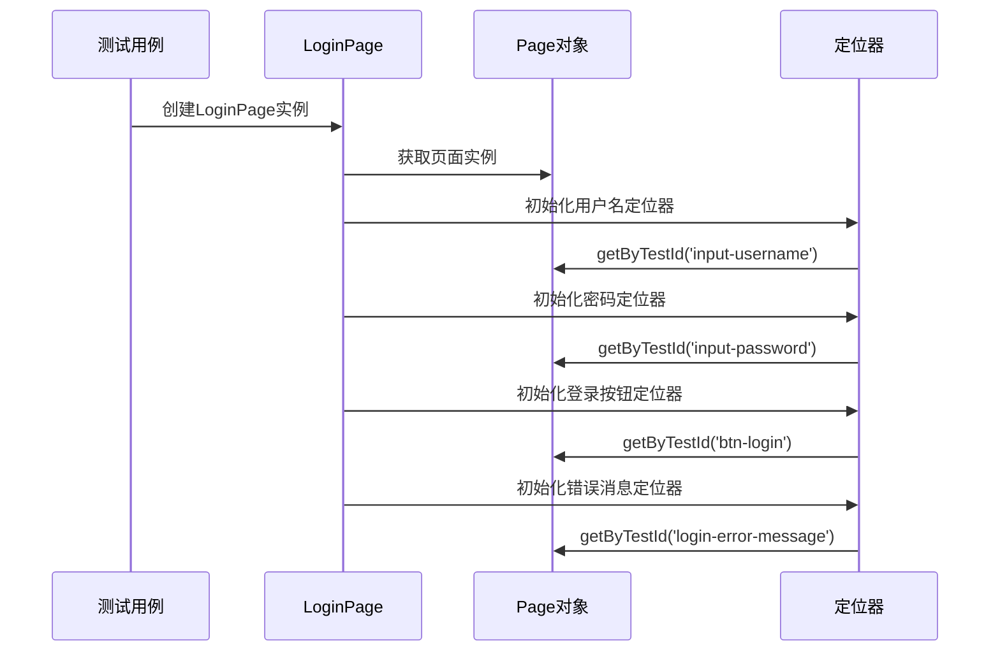

**图表来源**
- [login.page.ts:13-20](file://e2e-tests/pages/login.page.ts#L13-L20)

**章节来源**
- [login.page.ts:6-20](file://e2e-tests/pages/login.page.ts#L6-L20)

### 登录流程实现

#### 完整登录流程

完整的登录流程包含三个关键步骤：凭证输入、提交验证、结果等待：

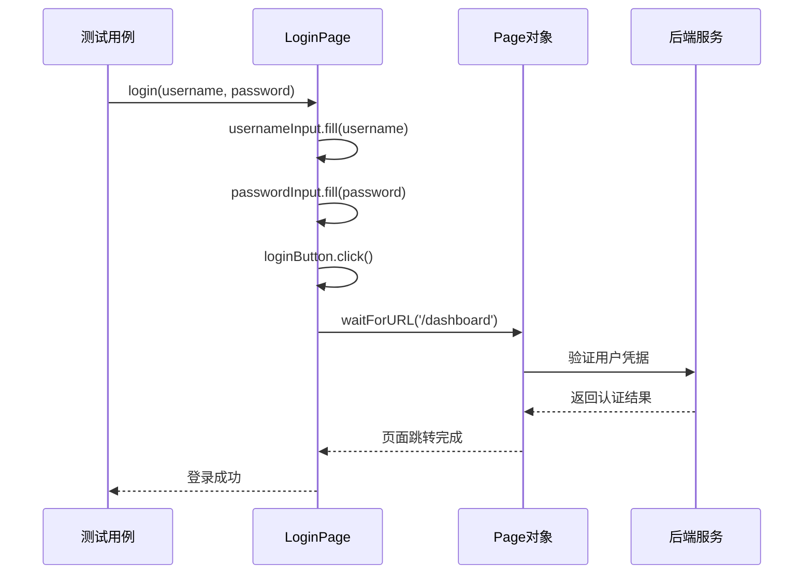

**图表来源**
- [login.page.ts:29-34](file://e2e-tests/pages/login.page.ts#L29-L34)

#### 失败场景测试流程

针对错误凭证的测试采用不同的流程策略：

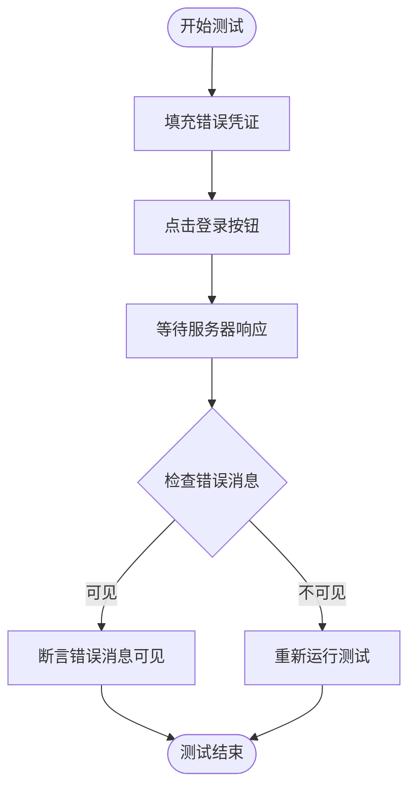

**图表来源**
- [login.spec.ts:15-23](file://e2e-tests/tests/smoke/login.spec.ts#L15-L23)

**章节来源**
- [login.page.ts:29-43](file://e2e-tests/pages/login.page.ts#L29-L43)
- [login.spec.ts:5-23](file://e2e-tests/tests/smoke/login.spec.ts#L5-L23)

### 错误处理机制

#### 错误消息处理

系统实现了多层次的错误处理机制：

1. **UI层面错误显示**：通过`errorMessage`定位器检测错误消息
2. **断言机制**：使用Playwright的expect API进行断言
3. **超时处理**：内置超时机制防止无限等待

#### 网络错误处理

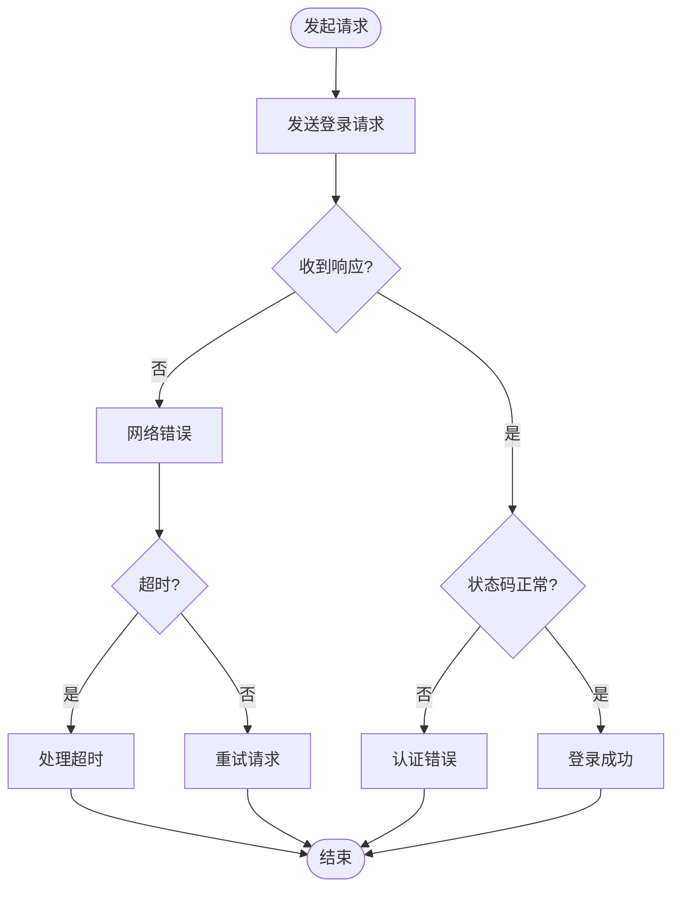

**图表来源**
- [login.page.ts:48-50](file://e2e-tests/pages/login.page.ts#L48-L50)

**章节来源**
- [login.page.ts:48-50](file://e2e-tests/pages/login.page.ts#L48-L50)

### 登录状态验证与会话管理

#### 会话状态管理

系统采用多种方式管理登录状态：

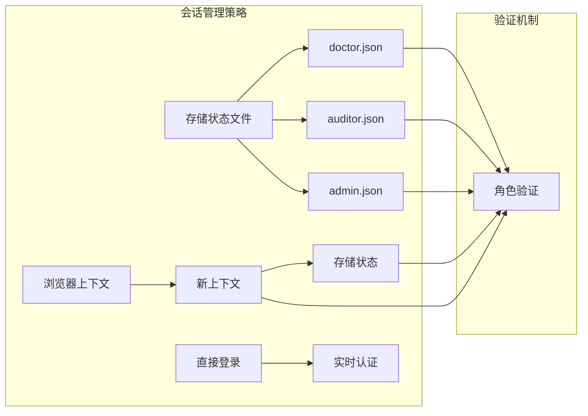

**图表来源**
- [auth.fixture.ts:10-37](file://e2e-tests/fixtures/auth.fixture.ts#L10-L37)
- [auth.setup.ts:17-26](file://e2e-tests/fixtures/auth.setup.ts#L17-L26)

#### 存储状态文件结构

每个角色的认证状态以JSON格式存储在`.auth`目录中：

| 字段 | 类型 | 描述 | 示例值 |
|------|------|------|--------|
| cookies | Array | 浏览器Cookie数组 | [] |
| origins | Array | 已访问的域名列表 | [] |
| userId | String | 用户唯一标识 | "doctor01" |
| role | String | 用户角色 | "doctor" |
| expires | Number | 过期时间戳 | 1700000000000 |

**章节来源**
- [auth.fixture.ts:10-37](file://e2e-tests/fixtures/auth.fixture.ts#L10-L37)
- [auth.setup.ts:17-26](file://e2e-tests/fixtures/auth.setup.ts#L17-L26)

## 依赖关系分析

### 组件依赖图

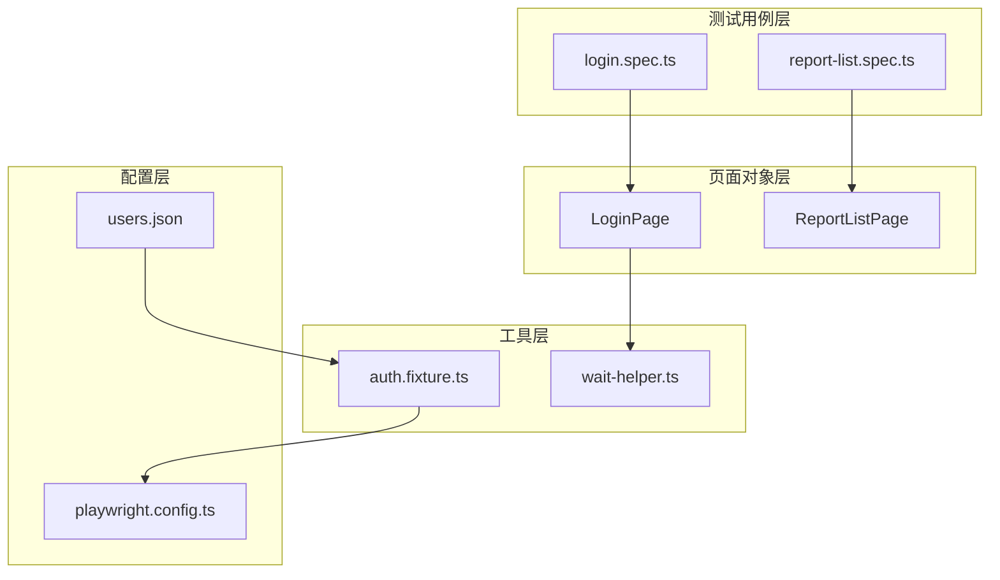

**图表来源**
- [login.page.ts:1-51](file://e2e-tests/pages/login.page.ts#L1-L51)
- [login.spec.ts:1-25](file://e2e-tests/tests/smoke/login.spec.ts#L1-L25)
- [wait-helper.ts:1-107](file://e2e-tests/utils/wait-helper.ts#L1-L107)

### 外部依赖关系

系统主要依赖以下外部库：

| 依赖包 | 版本 | 用途 | 关键功能 |
|--------|------|------|----------|
| @playwright/test | ^1.50.0 | 测试框架 | 浏览器自动化、断言 |
| typescript | ^5.3.0 | 类型系统 | 编译时类型检查 |
| dotenv | ^16.4.0 | 环境变量 | 配置管理 |
| allure-playwright | ^3.0.0 | 测试报告 | 交互式测试报告 |

**章节来源**
- [package.json:17-25](file://e2e-tests/package.json#L17-L25)

## 性能考虑

### 测试执行优化

系统在多个层面进行了性能优化：

1. **并行执行**：启用完全并行测试执行
2. **智能重试**：CI环境自动重试失败的测试
3. **资源管理**：及时清理临时文件和浏览器上下文

### 等待策略优化

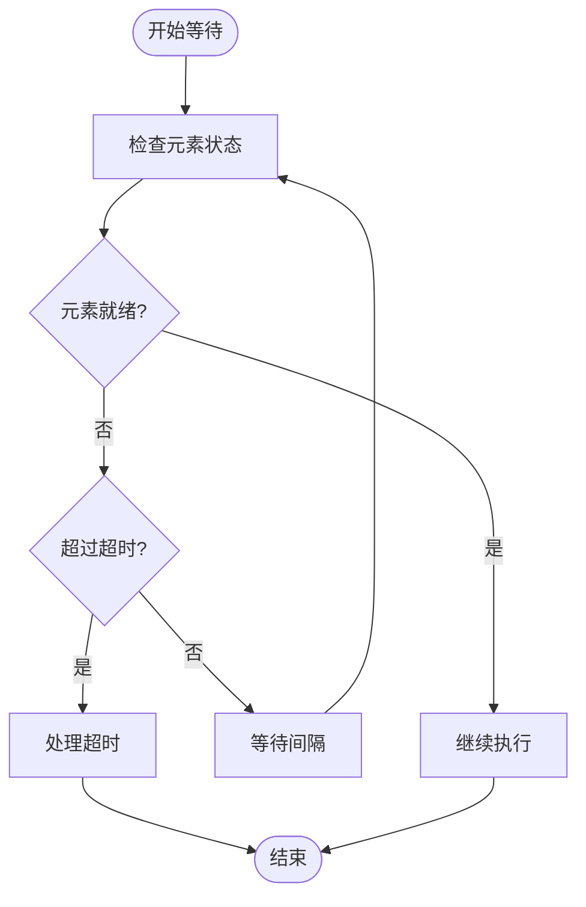

**图表来源**
- [wait-helper.ts:74-92](file://e2e-tests/utils/wait-helper.ts#L74-L92)

**章节来源**
- [wait-helper.ts:3-107](file://e2e-tests/utils/wait-helper.ts#L3-L107)

## 故障排除指南

### 常见问题诊断

#### 登录测试失败排查

| 问题类型 | 排查步骤 | 解决方案 |
|----------|----------|----------|
| 元素定位失败 | 检查`data-testid`属性 | 更新定位器或检查页面结构 |
| 超时错误 | 检查网络连接和服务器状态 | 增加超时时间或优化等待策略 |
| 认证失败 | 验证用户名密码 | 使用正确的凭证或更新配置 |
| 页面跳转失败 | 检查路由配置 | 确认目标URL和路由设置 |

#### 调试技巧

1. **启用视频录制**：在配置中设置`video: 'retain-on-failure'`
2. **生成详细报告**：使用Allure报告工具
3. **截图保存**：在失败时自动保存截图
4. **trace跟踪**：启用trace记录完整的测试过程

**章节来源**
- [playwright.config.ts:24-29](file://e2e-tests/playwright.config.ts#L24-L29)

### 会话状态清理

系统提供了完整的会话状态清理机制：

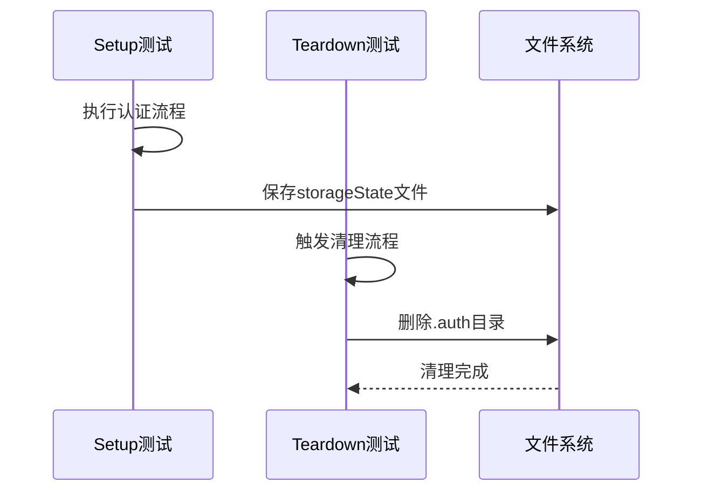

**图表来源**
- [auth.setup.ts:17-26](file://e2e-tests/fixtures/auth.setup.ts#L17-L26)
- [auth.teardown.ts:7-17](file://e2e-tests/fixtures/auth.teardown.ts#L7-L17)

**章节来源**
- [auth.teardown.ts:7-17](file://e2e-tests/fixtures/auth.teardown.ts#L7-L17)

## 结论

登录页面封装系统通过精心设计的架构和完善的错误处理机制，为企业级端到端测试提供了可靠的基础。系统的主要优势包括：

1. **稳定性**：基于`data-testid`的定位策略确保测试稳定性
2. **可维护性**：清晰的Page Object模式便于代码维护
3. **可扩展性**：支持多种认证方式和会话管理策略
4. **可靠性**：内置超时处理和重试机制提高测试成功率

该系统为后续的功能扩展（如多因素认证、第三方登录）奠定了良好的基础，开发者可以在此基础上轻松添加新的认证方式和功能特性。

## 附录

### 扩展指南

#### 多因素认证支持

要添加多因素认证支持，建议在现有LoginPage基础上扩展：

```typescript
// 新增的MFA登录方法
async loginWithMFA(username: string, password: string, mfaCode: string) {
  await this.login(username, password);
  await this.mfaInput.fill(mfaCode);
  await this.mfaSubmit.click();
  await this.page.waitForURL('/dashboard');
}
```

#### 第三方登录集成

支持OAuth等第三方登录方式：

```typescript
// OAuth登录流程
async loginWithOAuth(provider: string) {
  const oauthButton = this.page.getByTestId(`btn-oauth-${provider}`);
  await oauthButton.click();
  // 处理第三方认证页面
  await this.handleOAuthRedirect();
  await this.page.waitForURL('/dashboard');
}
```

### 测试用例编写最佳实践

1. **使用数据驱动测试**：利用`users.json`中的用户数据
2. **参数化测试场景**：覆盖正常和异常场景
3. **断言层次化**：从页面URL到具体元素的多层次断言
4. **测试数据隔离**：确保测试之间相互独立

### 调试和监控

- **启用详细日志**：在开发环境中启用详细日志输出
- **性能监控**：监控测试执行时间和内存使用
- **错误追踪**：使用trace功能追踪复杂问题
- **报告分析**：定期分析测试报告识别趋势问题