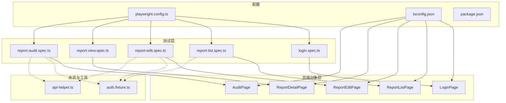
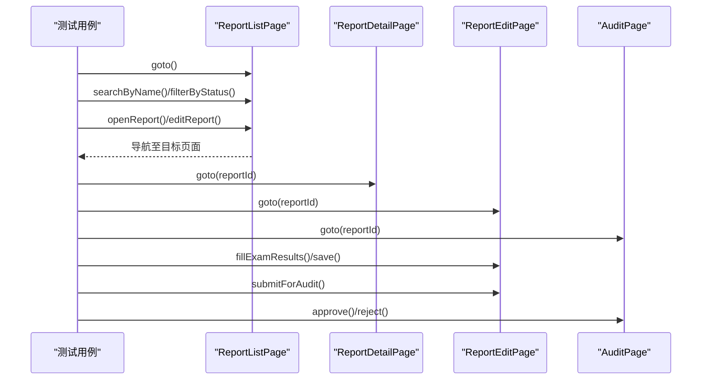
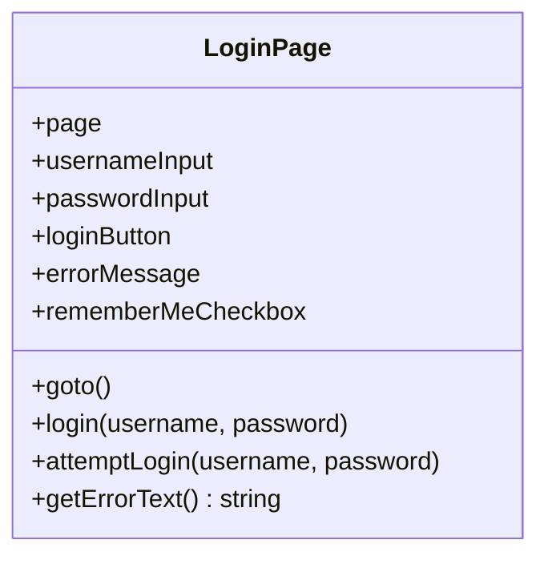
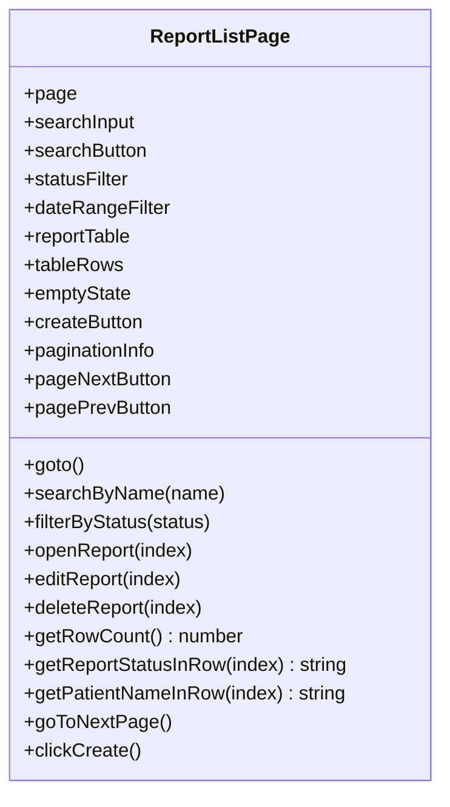
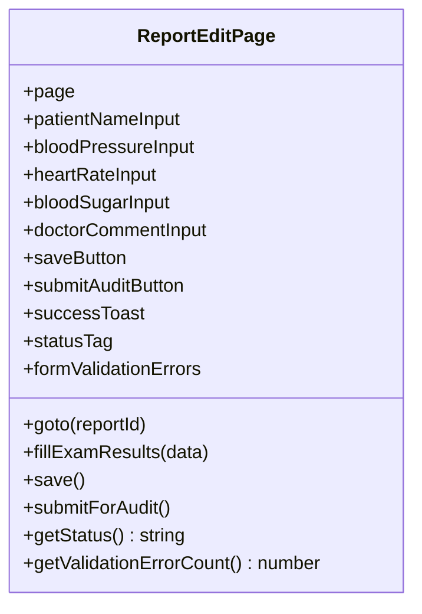
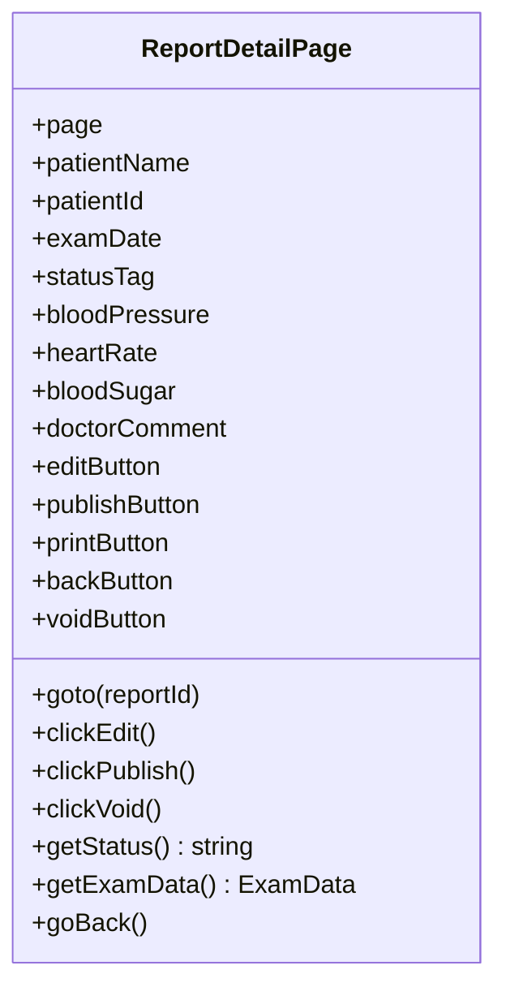
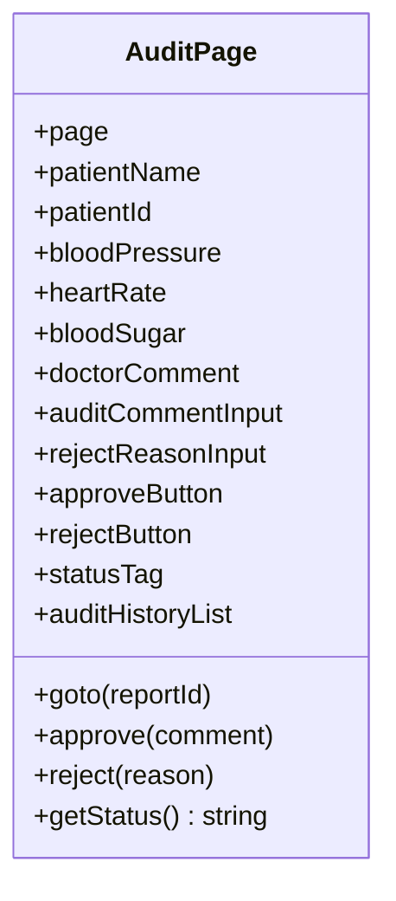
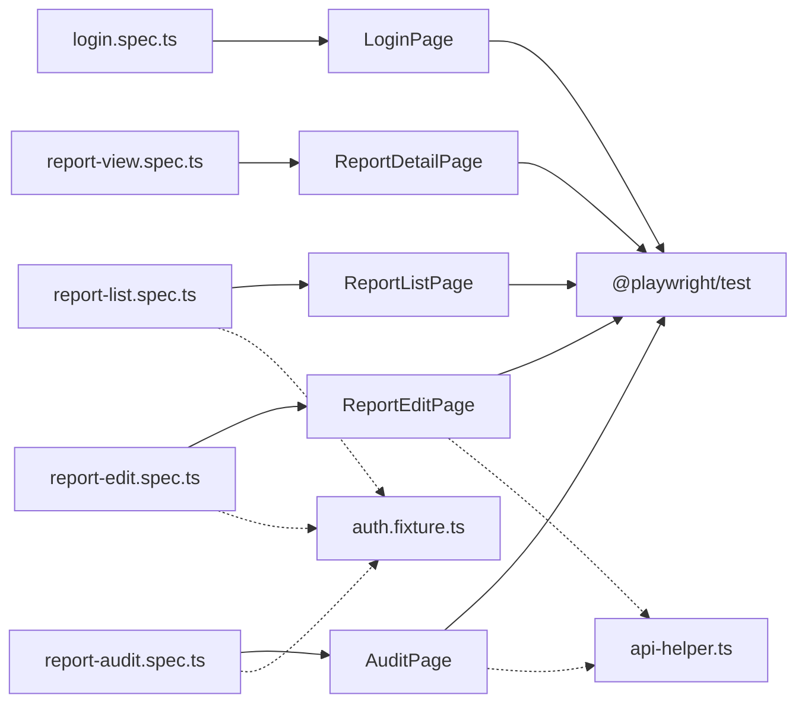

# 页面对象设计模式

<cite>
**本文引用的文件**
- [login.page.ts](file://e2e-tests/pages/login.page.ts)
- [report-list.page.ts](file://e2e-tests/pages/report-list.page.ts)
- [report-edit.page.ts](file://e2e-tests/pages/report-edit.page.ts)
- [report-detail.page.ts](file://e2e-tests/pages/report-detail.page.ts)
- [audit.page.ts](file://e2e-tests/pages/audit.page.ts)
- [login.spec.ts](file://e2e-tests/tests/smoke/login.spec.ts)
- [report-list.spec.ts](file://e2e-tests/tests/smoke/report-list.spec.ts)
- [report-edit.spec.ts](file://e2e-tests/tests/smoke/report-edit.spec.ts)
- [report-view.spec.ts](file://e2e-tests/tests/smoke/report-view.spec.ts)
- [report-audit.spec.ts](file://e2e-tests/tests/smoke/report-audit.spec.ts)
- [auth.fixture.ts](file://e2e-tests/fixtures/auth.fixture.ts)
- [api-helper.ts](file://e2e-tests/utils/api-helper.ts)
- [playwright.config.ts](file://e2e-tests/playwright.config.ts)
- [tsconfig.json](file://e2e-tests/tsconfig.json)
- [failure-analyzer.ts](file://e2e-tests/ai/failure-analyzer.ts)
- [locator-healer.ts](file://e2e-tests/ai/locator-healer.ts)
- [package.json](file://e2e-tests/package.json)
</cite>

## 目录
1. [引言](#引言)
2. [项目结构](#项目结构)
3. [核心组件](#核心组件)
4. [架构总览](#架构总览)
5. [详细组件分析](#详细组件分析)
6. [依赖关系分析](#依赖关系分析)
7. [性能考虑](#性能考虑)
8. [故障排查指南](#故障排查指南)
9. [结论](#结论)
10. [附录](#附录)

## 引言
本指南围绕页面对象设计模式在端到端测试中的落地实践，系统阐述UI元素定位策略、操作封装与错误处理机制；深入分析登录页、报告列表页、报告编辑页、报告详情页与审核页的实现；解释页面间导航与数据传递；提供扩展与自定义页面的开发流程、性能优化技巧与调试方法，并形成面向测试工程师的标准规范。

## 项目结构
- 页面对象位于 pages 目录，每个页面一个类，统一管理定位器与页面交互。
- 测试用例位于 tests 目录，按冒烟/回归组织，使用 fixtures 注入不同角色的页面上下文。
- 工具类位于 utils，提供API辅助、数据库辅助与等待辅助。
- 配置位于 playwright.config.ts、tsconfig.json 与 package.json，定义运行环境、路径别名与脚本命令。
- AI辅助位于 ai 目录，提供失败分析与定位器自愈能力，提升稳定性与可维护性。

图表来源
- [login.spec.ts:1-25](file://e2e-tests/tests/smoke/login.spec.ts#L1-L25)
- [report-list.spec.ts:1-28](file://e2e-tests/tests/smoke/report-list.spec.ts#L1-L28)
- [report-edit.spec.ts:1-61](file://e2e-tests/tests/smoke/report-edit.spec.ts#L1-L61)
- [report-view.spec.ts:1-26](file://e2e-tests/tests/smoke/report-view.spec.ts#L1-L26)
- [report-audit.spec.ts:1-36](file://e2e-tests/tests/smoke/report-audit.spec.ts#L1-L36)
- [auth.fixture.ts:1-40](file://e2e-tests/fixtures/auth.fixture.ts#L1-L40)
- [api-helper.ts:1-172](file://e2e-tests/utils/api-helper.ts#L1-L172)
- [playwright.config.ts:1-68](file://e2e-tests/playwright.config.ts#L1-L68)
- [tsconfig.json:1-25](file://e2e-tests/tsconfig.json#L1-L25)

章节来源
- [playwright.config.ts:1-68](file://e2e-tests/playwright.config.ts#L1-L68)
- [tsconfig.json:1-25](file://e2e-tests/tsconfig.json#L1-L25)

## 核心组件
- 页面对象职责分离：定位器集中声明、页面导航与业务操作封装、断言与状态查询。
- 统一的goto入口：每个页面对象提供goto方法，确保页面加载完成后再进行后续操作。
- 明确的等待策略：对异步响应（API）与UI状态（元素可见）分别采用waitForResponse与waitFor。
- 表单与交互的幂等封装：如保存、提交审核、确认弹窗等，均在页面对象内处理。
- 角色驱动的测试夹具：通过auth.fixture.ts注入不同角色的Page上下文，隔离权限差异。

章节来源
- [login.page.ts:1-52](file://e2e-tests/pages/login.page.ts#L1-L52)
- [report-list.page.ts:1-130](file://e2e-tests/pages/report-list.page.ts#L1-L130)
- [report-edit.page.ts:1-94](file://e2e-tests/pages/report-edit.page.ts#L1-L94)
- [report-detail.page.ts:1-107](file://e2e-tests/pages/report-detail.page.ts#L1-L107)
- [audit.page.ts:1-72](file://e2e-tests/pages/audit.page.ts#L1-L72)
- [auth.fixture.ts:1-40](file://e2e-tests/fixtures/auth.fixture.ts#L1-L40)

## 架构总览
页面对象围绕“定位器+导航+操作+断言”的闭环构建，测试用例仅负责编排步骤与断言，页面对象内部处理细节，降低重复与脆弱性。

图表来源
- [report-list.page.ts:34-83](file://e2e-tests/pages/report-list.page.ts#L34-L83)
- [report-detail.page.ts:48-105](file://e2e-tests/pages/report-detail.page.ts#L48-L105)
- [report-edit.page.ts:32-86](file://e2e-tests/pages/report-edit.page.ts#L32-L86)
- [audit.page.ts:42-70](file://e2e-tests/pages/audit.page.ts#L42-L70)

## 详细组件分析

### 登录页面对象（LoginPage）
- 设计要点
  - 定位器以data-testid为主，保证稳定且语义明确。
  - 提供完整登录与尝试登录两种流程，前者等待跳转，后者用于错误场景断言。
  - 错误信息定位器用于断言提示可见性。
- 关键方法
  - goto：访问登录路由并等待页面就绪。
  - login：填充凭据→点击登录→等待跳转到仪表盘。
  - attemptLogin：仅触发登录动作，不等待跳转。
  - getErrorText：读取错误提示文本。
- 使用示例
  - 参考冒烟测试用例中对登录页的使用与断言。

图表来源
- [login.page.ts:3-51](file://e2e-tests/pages/login.page.ts#L3-L51)

章节来源
- [login.page.ts:1-52](file://e2e-tests/pages/login.page.ts#L1-L52)
- [login.spec.ts:1-25](file://e2e-tests/tests/smoke/login.spec.ts#L1-L25)

### 报告列表页面对象（ReportListPage）
- 设计要点
  - 使用data-testid定位搜索框、筛选器、表格、分页控件等。
  - 对异步请求（API）使用waitForResponse，确保UI与数据一致。
  - 封装常用操作：按姓名搜索、按状态筛选、打开详情/编辑、删除、翻页、创建。
  - 提供读取行信息的方法（状态、患者名）与行数统计。
- 关键方法
  - goto：访问列表路由并等待表格可见。
  - searchByName：输入名称→点击搜索→等待API响应。
  - filterByStatus：选择状态→点击选项→等待API响应。
  - openReport/editReport/deleteReport：点击对应按钮并处理确认弹窗。
  - getRowCount/getReportStatusInRow/getPatientNameInRow：读取表格数据。
  - goToNextPage：点击下一页并等待响应。
  - clickCreate：点击新建报告。
- 使用示例
  - 参考报告列表冒烟测试，断言表格可见与关键列标题存在。

图表来源
- [report-list.page.ts:3-129](file://e2e-tests/pages/report-list.page.ts#L3-L129)

章节来源
- [report-list.page.ts:1-130](file://e2e-tests/pages/report-list.page.ts#L1-L130)
- [report-list.spec.ts:1-28](file://e2e-tests/tests/smoke/report-list.spec.ts#L1-L28)

### 报告编辑页面对象（ReportEditPage）
- 设计要点
  - 支持部分字段填写，使用clear+fill确保幂等。
  - 保存后等待成功提示出现，刷新页面验证持久化。
  - 提交审核时处理确认弹窗；提供状态标签读取与表单校验错误计数。
- 关键方法
  - goto：访问编辑路由。
  - fillExamResults：可选字段填充。
  - save：点击保存→等待成功提示。
  - submitForAudit：点击提交→等待确认弹窗并点击确认。
  - getStatus：读取报告状态。
  - getValidationErrorCount：统计表单校验错误数量。
- 使用示例
  - 参考报告编辑冒烟测试，断言保存成功与状态变更。

图表来源
- [report-edit.page.ts:3-93](file://e2e-tests/pages/report-edit.page.ts#L3-L93)

章节来源
- [report-edit.page.ts:1-94](file://e2e-tests/pages/report-edit.page.ts#L1-L94)
- [report-edit.spec.ts:1-61](file://e2e-tests/tests/smoke/report-edit.spec.ts#L1-L61)

### 报告详情页面对象（ReportDetailPage）
- 设计要点
  - 以只读展示为核心，提供编辑、发布、作废、返回等操作入口。
  - 等待关键元素可见再进行断言，避免竞态。
- 关键方法
  - goto：访问详情路由并等待患者信息可见。
  - clickEdit/clickPublish/clickVoid：点击对应按钮并处理确认弹窗。
  - getStatus：读取状态。
  - getExamData：聚合体检数据。
  - goBack：返回列表页。
- 使用示例
  - 参考报告查看冒烟测试，断言详情页核心信息与体检项目可见。

图表来源
- [report-detail.page.ts:3-106](file://e2e-tests/pages/report-detail.page.ts#L3-L106)

章节来源
- [report-detail.page.ts:1-107](file://e2e-tests/pages/report-detail.page.ts#L1-L107)
- [report-view.spec.ts:1-26](file://e2e-tests/tests/smoke/report-view.spec.ts#L1-L26)

### 审核页面对象（AuditPage）
- 设计要点
  - 以只读展示报告内容为主，提供审核意见、退回原因输入与审批/拒绝操作。
  - 等待内容可见与状态标签更新。
- 关键方法
  - goto：访问审核路由并等待内容可见。
  - approve：填写意见→点击通过→确认弹窗。
  - reject：填写原因→点击退回→确认弹窗。
  - getStatus：读取状态。
- 使用示例
  - 参考审核冒烟测试，断言通过后状态变为“已审核”。

图表来源
- [audit.page.ts:3-71](file://e2e-tests/pages/audit.page.ts#L3-L71)

章节来源
- [audit.page.ts:1-72](file://e2e-tests/pages/audit.page.ts#L1-L72)
- [report-audit.spec.ts:1-36](file://e2e-tests/tests/smoke/report-audit.spec.ts#L1-L36)

### 页面间导航与数据传递
- 导航链路
  - 列表页：搜索/筛选→打开详情/编辑→返回列表。
  - 编辑页：填写体检结果→保存→提交审核→跳转审核页。
  - 审核页：审核通过/退回→状态更新。
- 数据传递
  - 通过URL参数（reportId）传递实体标识。
  - 通过API预创建/预更新状态准备前置数据，确保测试可重复。

章节来源
- [report-list.page.ts:65-83](file://e2e-tests/pages/report-list.page.ts#L65-L83)
- [report-edit.page.ts:32-86](file://e2e-tests/pages/report-edit.page.ts#L32-L86)
- [report-detail.page.ts:48-105](file://e2e-tests/pages/report-detail.page.ts#L48-L105)
- [audit.page.ts:42-70](file://e2e-tests/pages/audit.page.ts#L42-L70)
- [api-helper.ts:83-142](file://e2e-tests/utils/api-helper.ts#L83-L142)

### 错误处理机制
- 定位器失效
  - 使用AI定位器自愈工具，基于DOM快照生成新定位器建议，提高健壮性。
- 业务逻辑变更
  - 通过AI失败分析工具，结合错误信息与最近变更，输出根因分类与修复建议。
- 环境与数据问题
  - 配置文件与环境变量控制基础URL与LLM接口；API工具统一认证与上下文管理。

章节来源
- [locator-healer.ts:62-130](file://e2e-tests/ai/locator-healer.ts#L62-L130)
- [failure-analyzer.ts:69-111](file://e2e-tests/ai/failure-analyzer.ts#L69-L111)
- [playwright.config.ts:24-29](file://e2e-tests/playwright.config.ts#L24-L29)
- [api-helper.ts:45-77](file://e2e-tests/utils/api-helper.ts#L45-L77)

## 依赖关系分析
- 页面对象依赖Playwright的Page与Locator类型，通过getByTestId/getByRole等策略定位。
- 测试用例依赖页面对象与夹具；夹具通过storageState注入不同角色上下文。
- 工具类提供API上下文与数据准备，减少对真实后端的耦合。
- 配置文件定义超时、并发、报告器与项目划分，影响测试执行与产物。

图表来源
- [login.spec.ts:1-25](file://e2e-tests/tests/smoke/login.spec.ts#L1-L25)
- [report-list.spec.ts:1-28](file://e2e-tests/tests/smoke/report-list.spec.ts#L1-L28)
- [report-edit.spec.ts:1-61](file://e2e-tests/tests/smoke/report-edit.spec.ts#L1-L61)
- [report-view.spec.ts:1-26](file://e2e-tests/tests/smoke/report-view.spec.ts#L1-L26)
- [report-audit.spec.ts:1-36](file://e2e-tests/tests/smoke/report-audit.spec.ts#L1-L36)
- [auth.fixture.ts:10-37](file://e2e-tests/fixtures/auth.fixture.ts#L10-L37)
- [api-helper.ts:83-142](file://e2e-tests/utils/api-helper.ts#L83-L142)

章节来源
- [tsconfig.json:14-20](file://e2e-tests/tsconfig.json#L14-L20)
- [playwright.config.ts:1-68](file://e2e-tests/playwright.config.ts#L1-L68)

## 性能考虑
- 合理等待策略
  - 对局部SPA更新使用waitForResponse，避免全局page.waitForLoadState导致的长等待。
  - 对UI可见性使用waitFor({ state: 'visible' })，缩短等待时间。
- 并发与重试
  - CI环境启用多工作线程与重试，提升吞吐；本地开发可关闭以快速反馈。
- 资源管理
  - API上下文复用（单例），减少重复认证开销；测试结束后及时释放。
- 路径别名与模块化
  - tsconfig路径别名简化导入，提升可维护性。

章节来源
- [report-list.page.ts:46-59](file://e2e-tests/pages/report-list.page.ts#L46-L59)
- [report-edit.page.ts:66-69](file://e2e-tests/pages/report-edit.page.ts#L66-L69)
- [playwright.config.ts:12-15](file://e2e-tests/playwright.config.ts#L12-L15)
- [api-helper.ts:45-77](file://e2e-tests/utils/api-helper.ts#L45-L77)
- [tsconfig.json:14-20](file://e2e-tests/tsconfig.json#L14-L20)

## 故障排查指南
- 定位器失效
  - 使用AI定位器自愈工具，传入失败定位器与元素描述，获得新定位器建议与置信度。
- 失败根因分析
  - 使用AI失败分析工具，输入测试名、错误信息、截图与最近变更，得到分类、描述、建议与修复代码。
- 常见问题
  - 页面未就绪：检查goto后是否等待关键元素可见或表格响应。
  - 弹窗未处理：确认点击操作后是否等待并点击确认按钮。
  - 状态不一致：使用API工具预置状态，或在页面对象中增加状态轮询。

章节来源
- [locator-healer.ts:62-130](file://e2e-tests/ai/locator-healer.ts#L62-L130)
- [failure-analyzer.ts:69-111](file://e2e-tests/ai/failure-analyzer.ts#L69-L111)
- [report-list.page.ts:81-82](file://e2e-tests/pages/report-list.page.ts#L81-L82)
- [report-edit.page.ts:74-78](file://e2e-tests/pages/report-edit.page.ts#L74-L78)
- [audit.page.ts:50-63](file://e2e-tests/pages/audit.page.ts#L50-L63)

## 结论
本项目以页面对象为核心，结合夹具与工具类，实现了稳定的端到端测试体系。通过统一的定位策略、清晰的操作封装与完善的等待机制，显著提升了可维护性与鲁棒性。AI辅助工具进一步增强了定位器自愈与失败分析能力，为持续改进提供了技术保障。

## 附录

### 页面对象扩展与自定义开发流程
- 新增页面对象
  - 在pages目录新增类文件，集中声明定位器与方法。
  - 在测试中引入并使用，遵循goto→操作→断言的顺序。
- 数据准备
  - 优先使用API工具创建/更新状态，必要时在页面对象内补充等待策略。
- 规范建议
  - 定位器以data-testid为主，配合role/name增强可读性。
  - 方法命名语义化，返回值用于断言或状态读取。
  - 对弹窗与异步响应统一处理，避免竞态。

章节来源
- [api-helper.ts:83-142](file://e2e-tests/utils/api-helper.ts#L83-L142)
- [tsconfig.json:14-20](file://e2e-tests/tsconfig.json#L14-L20)

### 测试工程师使用标准规范
- 用例组织
  - 按功能域划分测试套件，使用describe与test组织。
- 断言风格
  - 优先使用expect(page).toHaveURL/expect(locator).toBeVisible等内置断言。
- 脚本命令
  - 使用package.json脚本运行冒烟/回归测试与生成报告。

章节来源
- [login.spec.ts:4-23](file://e2e-tests/tests/smoke/login.spec.ts#L4-L23)
- [report-list.spec.ts:4-26](file://e2e-tests/tests/smoke/report-list.spec.ts#L4-L26)
- [package.json:6-12](file://e2e-tests/package.json#L6-L12)