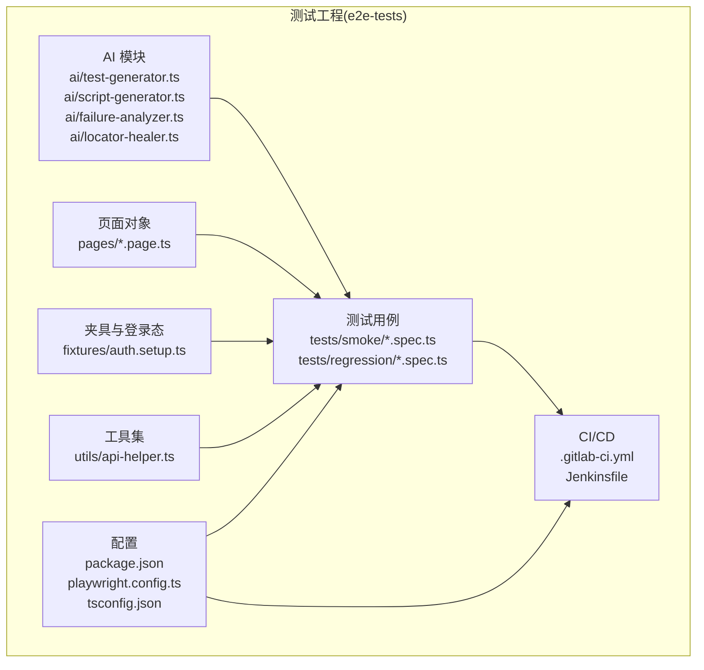
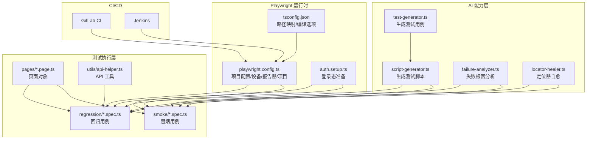
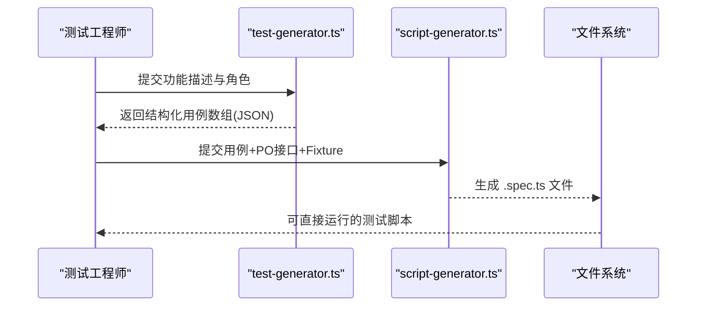
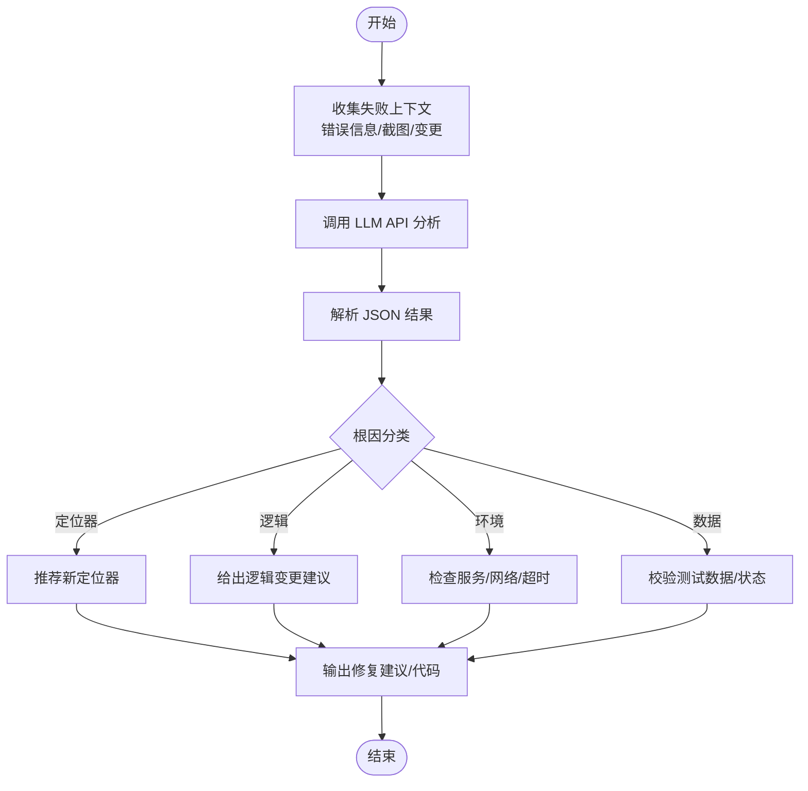
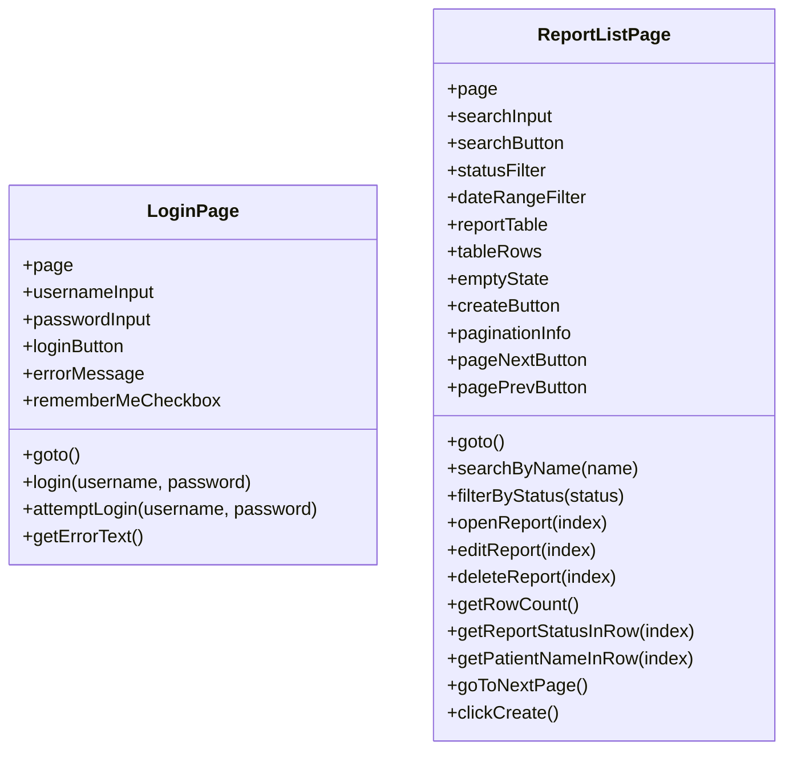
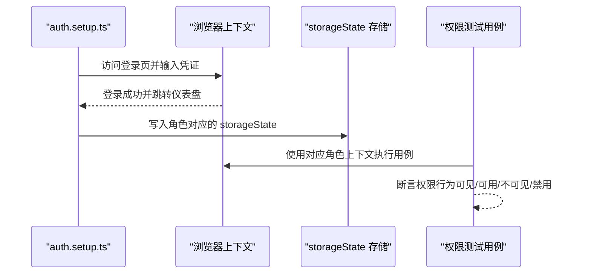
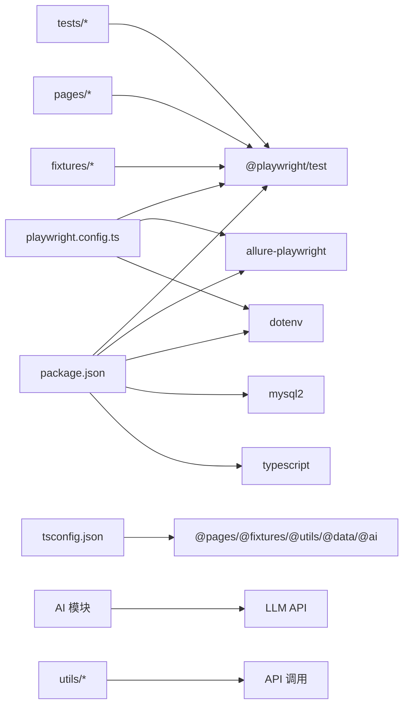

# 项目概述

<cite>
**本文引用的文件**
- [package.json](file://e2e-tests/package.json)
- [playwright.config.ts](file://e2e-tests/playwright.config.ts)
- [tsconfig.json](file://e2e-tests/tsconfig.json)
- [.gitlab-ci.yml](file://e2e-tests/.gitlab-ci.yml)
- [Jenkinsfile](file://e2e-tests/Jenkinsfile)
- [ai/test-generator.ts](file://e2e-tests/ai/test-generator.ts)
- [ai/script-generator.ts](file://e2e-tests/ai/script-generator.ts)
- [ai/failure-analyzer.ts](file://e2e-tests/ai/failure-analyzer.ts)
- [ai/locator-healer.ts](file://e2e-tests/ai/locator-healer.ts)
- [fixtures/auth.setup.ts](file://e2e-tests/fixtures/auth.setup.ts)
- [pages/login.page.ts](file://e2e-tests/pages/login.page.ts)
- [pages/report-list.page.ts](file://e2e-tests/pages/report-list.page.ts)
- [tests/smoke/login.spec.ts](file://e2e-tests/tests/smoke/login.spec.ts)
- [tests/regression/permission.spec.ts](file://e2e-tests/tests/regression/permission.spec.ts)
- [utils/api-helper.ts](file://e2e-tests/utils/api-helper.ts)
</cite>

## 目录
1. [引言](#引言)
2. [项目结构](#项目结构)
3. [核心组件](#核心组件)
4. [架构总览](#架构总览)
5. [详细组件分析](#详细组件分析)
6. [依赖关系分析](#依赖关系分析)
7. [性能考虑](#性能考虑)
8. [故障排查指南](#故障排查指南)
9. [结论](#结论)
10. [附录](#附录)

## 引言
AutoTestQoder 是一个基于 Playwright 的端到端测试自动化项目，目标是为“医院体检报告管理系统”提供高可靠、可扩展、可维护的 AI 驱动测试体系。项目通过 AI 自动生成测试用例与测试脚本、自动分析失败根因、自动修复失效定位器，并结合多浏览器与多角色权限测试，实现从冒烟到回归的全链路测试覆盖。同时，项目内置环境隔离与 CI/CD 集成（GitLab CI 与 Jenkins），支持持续集成与持续交付。

## 项目结构
项目采用“按功能域划分”的组织方式，核心目录与职责如下：
- e2e-tests：端到端测试工程根目录
  - ai：AI 驱动的测试能力模块（用例生成、脚本生成、失败分析、定位器自愈）
  - pages：页面对象模型（Page Objects），封装页面交互与断言
  - tests：测试用例，分为 smoke 与 regression 两大类
  - fixtures：测试夹具与登录态准备
  - utils：通用工具（API 辅助、数据库辅助、等待辅助）
  - 配置文件：package.json、playwright.config.ts、tsconfig.json、.gitlab-ci.yml、Jenkinsfile

图表来源
- [playwright.config.ts:1-68](file://e2e-tests/playwright.config.ts#L1-L68)
- [package.json:1-27](file://e2e-tests/package.json#L1-L27)
- [tsconfig.json:1-25](file://e2e-tests/tsconfig.json#L1-L25)
- [.gitlab-ci.yml:1-67](file://e2e-tests/.gitlab-ci.yml#L1-L67)
- [Jenkinsfile:1-59](file://e2e-tests/Jenkinsfile#L1-L59)

章节来源
- [playwright.config.ts:1-68](file://e2e-tests/playwright.config.ts#L1-L68)
- [package.json:1-27](file://e2e-tests/package.json#L1-L27)
- [tsconfig.json:1-25](file://e2e-tests/tsconfig.json#L1-L25)
- [.gitlab-ci.yml:1-67](file://e2e-tests/.gitlab-ci.yml#L1-L67)
- [Jenkinsfile:1-59](file://e2e-tests/Jenkinsfile#L1-L59)

## 核心组件
- AI 测试生成与恢复
  - 用例生成：根据功能描述生成结构化测试用例，覆盖正向、逆向、边界与权限四类场景
  - 脚本生成：将测试用例与 Page Object 接口结合，生成可直接运行的 .spec.ts 测试脚本
  - 失败分析：对失败用例进行根因分类（定位器、逻辑、环境、数据），并给出修复建议
  - 定位器自愈：当定位器失效时，基于 DOM 快照推荐新的定位器
- 页面对象模型（PO）
  - login.page.ts：登录页交互封装
  - report-list.page.ts：报告列表页交互封装（查询、筛选、翻页、CRUD 操作）
- 权限与登录态管理
  - auth.setup.ts：按角色（医生、审核医生、管理员）准备登录态，存储 storageState 供后续测试复用
- API 工具
  - api-helper.ts：统一的 API 请求上下文、认证、测试数据准备与清理
- 测试用例
  - smoke：冒烟测试（如登录）
  - regression：回归测试（如权限控制、报告 CRUD、工作流）
- CI/CD 集成
  - GitLab CI：多阶段流水线（构建、部署测试、冒烟、回归、报告）
  - Jenkins：Docker Playwright 镜像执行，冒烟与回归阶段，产物归档与报告展示

章节来源
- [ai/test-generator.ts:1-107](file://e2e-tests/ai/test-generator.ts#L1-L107)
- [ai/script-generator.ts:1-110](file://e2e-tests/ai/script-generator.ts#L1-L110)
- [ai/failure-analyzer.ts:1-112](file://e2e-tests/ai/failure-analyzer.ts#L1-L112)
- [ai/locator-healer.ts:1-131](file://e2e-tests/ai/locator-healer.ts#L1-L131)
- [pages/login.page.ts:1-52](file://e2e-tests/pages/login.page.ts#L1-L52)
- [pages/report-list.page.ts:1-130](file://e2e-tests/pages/report-list.page.ts#L1-L130)
- [fixtures/auth.setup.ts:1-30](file://e2e-tests/fixtures/auth.setup.ts#L1-L30)
- [utils/api-helper.ts:1-172](file://e2e-tests/utils/api-helper.ts#L1-L172)
- [tests/smoke/login.spec.ts:1-25](file://e2e-tests/tests/smoke/login.spec.ts#L1-L25)
- [tests/regression/permission.spec.ts:1-102](file://e2e-tests/tests/regression/permission.spec.ts#L1-L102)
- [.gitlab-ci.yml:1-67](file://e2e-tests/.gitlab-ci.yml#L1-L67)
- [Jenkinsfile:1-59](file://e2e-tests/Jenkinsfile#L1-L59)

## 架构总览
AI 驱动的测试自动化系统围绕 Playwright 运行时展开，通过配置化的项目结构与夹具机制实现环境隔离与多浏览器兼容；AI 组件贯穿测试设计、生成、执行与恢复阶段，形成闭环。

图表来源
- [playwright.config.ts:1-68](file://e2e-tests/playwright.config.ts#L1-L68)
- [tsconfig.json:1-25](file://e2e-tests/tsconfig.json#L1-L25)
- [fixtures/auth.setup.ts:1-30](file://e2e-tests/fixtures/auth.setup.ts#L1-L30)
- [ai/test-generator.ts:1-107](file://e2e-tests/ai/test-generator.ts#L1-L107)
- [ai/script-generator.ts:1-110](file://e2e-tests/ai/script-generator.ts#L1-L110)
- [ai/failure-analyzer.ts:1-112](file://e2e-tests/ai/failure-analyzer.ts#L1-L112)
- [ai/locator-healer.ts:1-131](file://e2e-tests/ai/locator-healer.ts#L1-L131)
- [pages/login.page.ts:1-52](file://e2e-tests/pages/login.page.ts#L1-L52)
- [pages/report-list.page.ts:1-130](file://e2e-tests/pages/report-list.page.ts#L1-L130)
- [utils/api-helper.ts:1-172](file://e2e-tests/utils/api-helper.ts#L1-L172)
- [tests/smoke/login.spec.ts:1-25](file://e2e-tests/tests/smoke/login.spec.ts#L1-L25)
- [tests/regression/permission.spec.ts:1-102](file://e2e-tests/tests/regression/permission.spec.ts#L1-L102)
- [.gitlab-ci.yml:1-67](file://e2e-tests/.gitlab-ci.yml#L1-L67)
- [Jenkinsfile:1-59](file://e2e-tests/Jenkinsfile#L1-L59)

## 详细组件分析

### AI 用例与脚本生成
- 设计理念
  - 将自然语言需求转化为结构化测试用例，再由脚本生成器产出可执行的 Playwright 测试脚本，降低手工编写成本，提升覆盖面与一致性
- 关键流程
  - 输入：功能名称、描述、角色
  - 输出：结构化用例数组（含优先级与分类）
  - 脚本生成：结合 Page Object 接口与夹具，生成 .spec.ts
- 适用场景
  - 新功能快速冒烟验证
  - 回归测试用例补充
  - 权限与工作流场景覆盖

图表来源
- [ai/test-generator.ts:67-106](file://e2e-tests/ai/test-generator.ts#L67-L106)
- [ai/script-generator.ts:63-109](file://e2e-tests/ai/script-generator.ts#L63-L109)

章节来源
- [ai/test-generator.ts:1-107](file://e2e-tests/ai/test-generator.ts#L1-L107)
- [ai/script-generator.ts:1-110](file://e2e-tests/ai/script-generator.ts#L1-L110)

### 失败根因分析与定位器自愈
- 设计理念
  - 将 Playwright 失败信息与上下文（截图、最近变更）输入 AI，输出根因分类与修复建议，必要时给出修复后的代码片段
  - 对于定位器失效，基于 DOM 快照推荐新定位器，提高稳定性
- 关键流程
  - 输入：测试名、错误信息、截图、最近变更
  - 输出：根因分类（定位器/逻辑/环境/数据）、描述、建议、可选修复代码
  - 定位器自愈：返回新定位器、置信度与策略说明

图表来源
- [ai/failure-analyzer.ts:69-111](file://e2e-tests/ai/failure-analyzer.ts#L69-L111)
- [ai/locator-healer.ts:62-130](file://e2e-tests/ai/locator-healer.ts#L62-L130)

章节来源
- [ai/failure-analyzer.ts:1-112](file://e2e-tests/ai/failure-analyzer.ts#L1-L112)
- [ai/locator-healer.ts:1-131](file://e2e-tests/ai/locator-healer.ts#L1-L131)

### 页面对象模型（PO）
- 设计理念
  - 将页面交互与断言封装在 PO 中，降低重复代码，提升可读性与可维护性
- 关键类
  - LoginPage：封装登录页输入、按钮、错误提示与登录流程
  - ReportListPage：封装报告列表页查询、筛选、翻页、CRUD 操作与断言

图表来源
- [pages/login.page.ts:3-51](file://e2e-tests/pages/login.page.ts#L3-L51)
- [pages/report-list.page.ts:3-129](file://e2e-tests/pages/report-list.page.ts#L3-L129)

章节来源
- [pages/login.page.ts:1-52](file://e2e-tests/pages/login.page.ts#L1-L52)
- [pages/report-list.page.ts:1-130](file://e2e-tests/pages/report-list.page.ts#L1-L130)

### 权限测试与登录态管理
- 设计理念
  - 通过夹具准备不同角色的登录态，确保各角色在受控环境中执行对应权限范围内的操作
- 关键流程
  - auth.setup.ts：按角色登录并存储 storageState，供 smoke 与 regression 项目复用
  - regression/permission.spec.ts：以医生、审核医生、管理员三类角色验证 CRUD 与工作流权限

图表来源
- [fixtures/auth.setup.ts:19-28](file://e2e-tests/fixtures/auth.setup.ts#L19-L28)
- [tests/regression/permission.spec.ts:36-100](file://e2e-tests/tests/regression/permission.spec.ts#L36-L100)

章节来源
- [fixtures/auth.setup.ts:1-30](file://e2e-tests/fixtures/auth.setup.ts#L1-L30)
- [tests/regression/permission.spec.ts:1-102](file://e2e-tests/tests/regression/permission.spec.ts#L1-L102)

### API 工具与数据准备
- 设计理念
  - 通过统一的 API 上下文与认证，集中处理测试数据准备、状态更新与清理，保证测试隔离与幂等
- 关键能力
  - createTestReport：创建测试报告并返回 ID
  - updateReportStatus：更新报告状态（草稿/待审核/已审核/已发布）
  - deleteTestReport/cleanupTestReports：清理测试数据
  - disposeApiContext：全局销毁，避免资源泄漏

章节来源
- [utils/api-helper.ts:1-172](file://e2e-tests/utils/api-helper.ts#L1-L172)

### CI/CD 集成
- GitLab CI
  - 多阶段：build → deploy-test → smoke-test → regression-test → report
  - 使用官方 Playwright Docker 镜像，安装依赖后执行冒烟与回归测试，归档报告与产物
- Jenkins
  - Docker Playwright 镜像，执行冒烟与回归阶段，归档 Playwright 报告与测试结果

章节来源
- [.gitlab-ci.yml:1-67](file://e2e-tests/.gitlab-ci.yml#L1-L67)
- [Jenkinsfile:1-59](file://e2e-tests/Jenkinsfile#L1-L59)

## 依赖关系分析
- 项目内依赖
  - playwright.config.ts 定义项目、设备、报告器与项目间依赖（setup → smoke/regression）
  - tsconfig.json 提供路径映射（@pages/@fixtures/@utils/@data/@ai），便于模块化导入
  - package.json 定义 Playwright、Allure、dotenv、mysql2、TypeScript 等依赖与脚本命令
- 外部依赖
  - Playwright：端到端测试运行时与浏览器驱动
  - LLM API：AI 生成与分析能力的基础
  - CI 平台：GitLab CI 与 Jenkins

图表来源
- [package.json:17-25](file://e2e-tests/package.json#L17-L25)
- [playwright.config.ts:1-68](file://e2e-tests/playwright.config.ts#L1-L68)
- [tsconfig.json:14-20](file://e2e-tests/tsconfig.json#L14-L20)

章节来源
- [package.json:1-27](file://e2e-tests/package.json#L1-L27)
- [playwright.config.ts:1-68](file://e2e-tests/playwright.config.ts#L1-L68)
- [tsconfig.json:1-25](file://e2e-tests/tsconfig.json#L1-L25)

## 性能考虑
- 并行与重试
  - fullyParallel 启用并行执行，减少总耗时
  - CI 环境启用 retries，提高不稳定用例的通过率
- 浏览器与项目分离
  - smoke 仅 Chromium，回归包含 Chromium 与 Firefox，平衡速度与兼容性
- 截图、视频与 Trace
  - 失败时才录制截图/视频/Trace，降低磁盘占用与执行时间
- API 工具单例
  - API 请求上下文复用与认证缓存，减少重复登录开销

章节来源
- [playwright.config.ts:12-29](file://e2e-tests/playwright.config.ts#L12-L29)
- [utils/api-helper.ts:45-77](file://e2e-tests/utils/api-helper.ts#L45-L77)

## 故障排查指南
- LLM API 未配置
  - 现象：调用 AI 组件时报错，提示未配置 LLM_API_URL 与 LLM_API_KEY
  - 处理：在 .env 中设置 LLM_API_URL、LLM_API_KEY、LLM_MODEL
- Playwright 报告与产物
  - 本地：使用脚本生成 HTML 报告
  - CI：GitLab CI/Jenkins 归档 playwright-report 与 test-results/results，便于回溯
- 登录态失效
  - 现象：权限测试失败或页面跳转异常
  - 处理：重新执行 auth.setup.ts 生成 storageState，或检查 BASE_URL
- 定位器失效
  - 现象：元素找不到或交互失败
  - 处理：使用定位器自愈工具分析 DOM 并推荐新定位器；必要时调整 Page Object

章节来源
- [ai/script-generator.ts:13-16](file://e2e-tests/ai/script-generator.ts#L13-L16)
- [ai/test-generator.ts:12-15](file://e2e-tests/ai/test-generator.ts#L12-L15)
- [ai/failure-analyzer.ts:12-15](file://e2e-tests/ai/failure-analyzer.ts#L12-L15)
- [ai/locator-healer.ts:13-16](file://e2e-tests/ai/locator-healer.ts#L13-L16)
- [package.json:11-12](file://e2e-tests/package.json#L11-L12)
- [playwright.config.ts:24-29](file://e2e-tests/playwright.config.ts#L24-L29)
- [fixtures/auth.setup.ts:19-28](file://e2e-tests/fixtures/auth.setup.ts#L19-L28)

## 结论
AutoTestQoder 将 AI 能力深度融入 Playwright 测试体系，实现了从“需求 → 用例 → 脚本 → 执行 → 分析 → 修复”的闭环，显著提升了测试效率与稳定性。通过多浏览器兼容、角色权限测试、环境隔离与 CI/CD 集成，项目能够稳定支撑医院体检报告管理系统的持续演进。对于初学者，建议先从冒烟测试与登录页 PO 入手；对于有经验的开发者，可深入探索 AI 生成与定位器自愈能力，并结合 API 工具完善数据准备与清理策略。

## 附录
- 使用场景示例
  - 新功能上线前：使用 AI 生成用例与脚本，执行冒烟测试
  - 回归测试：多浏览器并行执行，结合权限测试覆盖关键业务路径
  - 失败定位：AI 分析失败根因，结合定位器自愈快速修复
- 命令参考
  - 本地：冒烟测试、回归测试、列出测试、生成报告
  - CI：GitLab CI/Jenkins 分别执行对应阶段并归档报告

章节来源
- [package.json:6-12](file://e2e-tests/package.json#L6-L12)
- [.gitlab-ci.yml:11-46](file://e2e-tests/.gitlab-ci.yml#L11-L46)
- [Jenkinsfile:21-38](file://e2e-tests/Jenkinsfile#L21-L38)